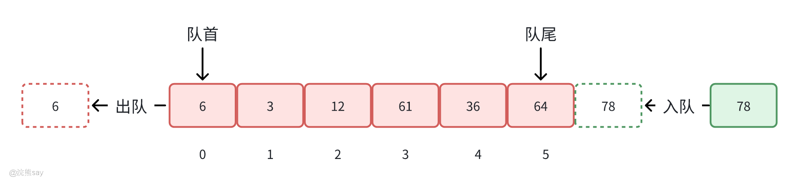
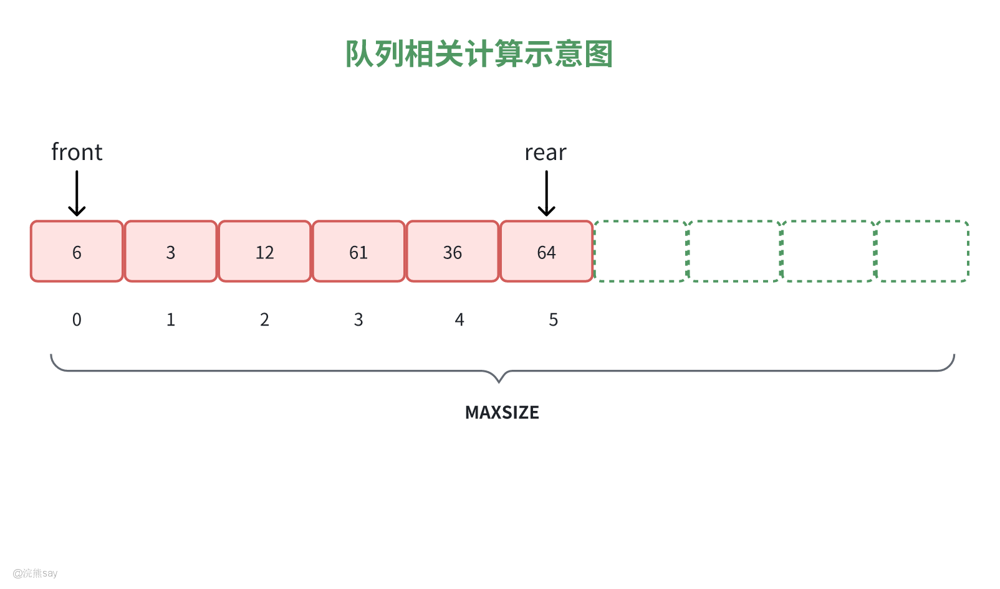
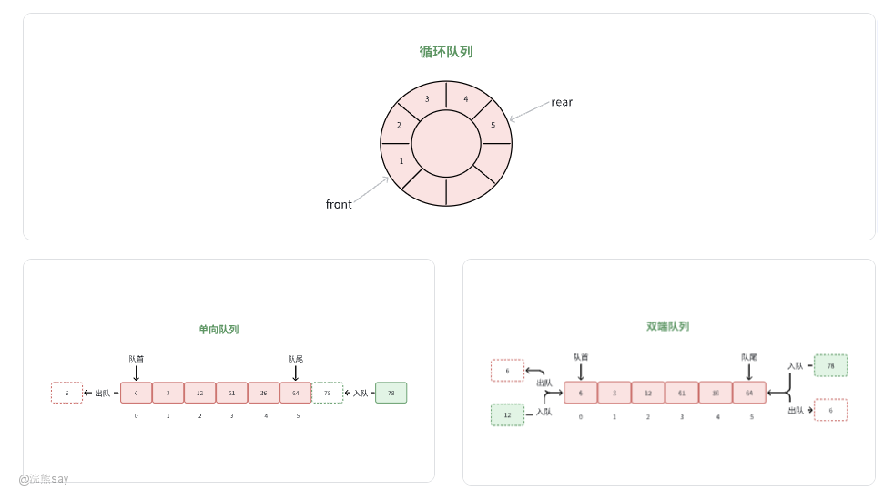
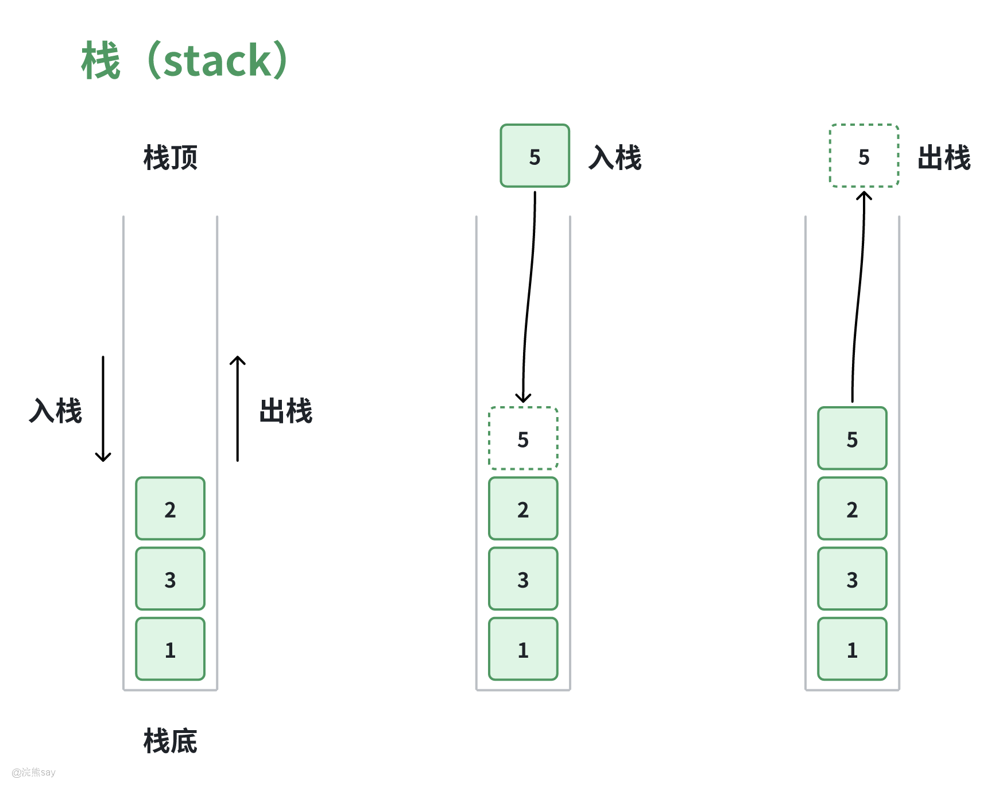
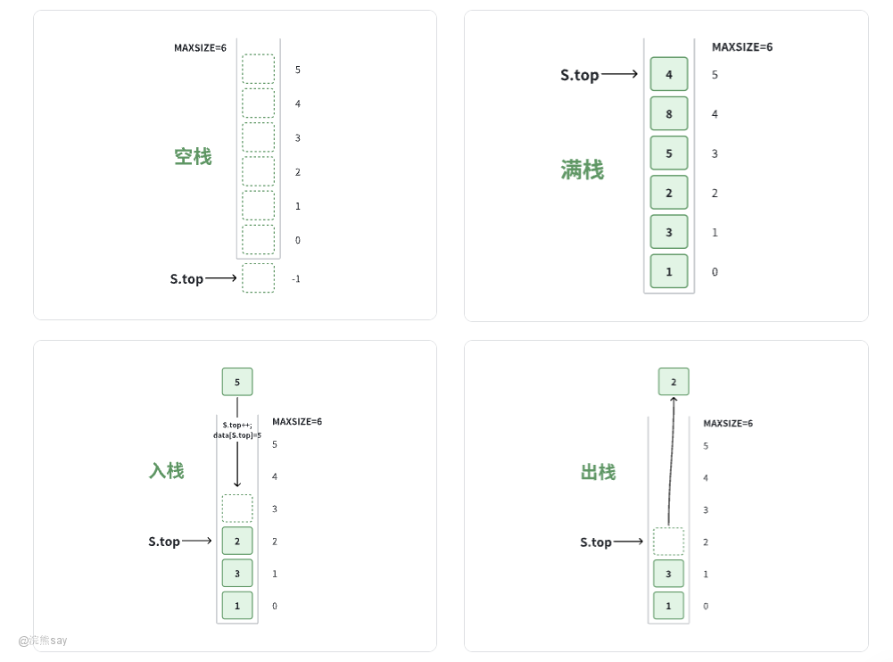
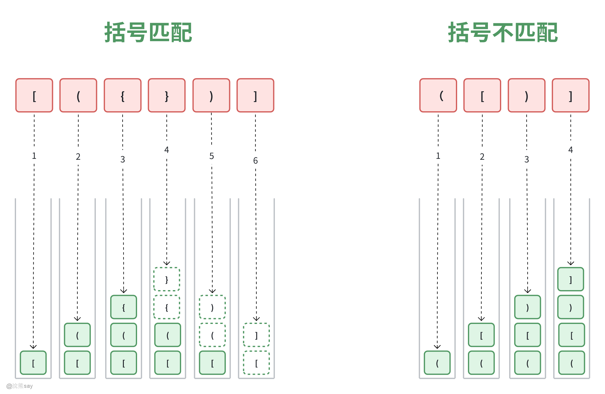

# 3、栈和队列

**Part 03：栈和队列**
| 【原创声明】大家好，我是say，是这篇文章的原创作者！985硕士毕业，应届进入某大厂后道心破碎，社招上岸多家855半垄断央企，因为自己淋过雨，希望帮大家撑把伞，帮助更多同学找到不内卷、能够好好生活的央国企，已帮助1000+同学上岸央国企，需要连联系学长的加微信：wx_hxsay |
| --- |

# 队列

## 队列的定义



队列（Queue）是一种**运算受限**的线性表。队列只允许在一端进行插入操作（队尾，rear），而在另一端进行删除操作（队头，front），这种特性使得队列具有**“先进先出”（First-In-First-Out, FIFO）**的特点。

## 队列的特点：先进先出（FIFO）



1.  **循环队列判空条件**：当 front == rear 时，队列为空。
2.  **循环队列判满条件**：当 (rear + 1) % MAXSIZE == front 时，队列为满。
3.  **求队列中的元素个数**：队列中的元素个数可以通过公式 (rear - front + MAXSIZE) % MAXSIZE 计算得出。
4.  **插入操作**：在队尾插入元素，操作为 rear = (rear + 1) % MAXSIZE，然后将新元素放入 queue\[rear\]。
5.  **删除操作**：从队头删除元素，操作为 front = (front + 1) % MAXSIZE，然后返回 queue\[front\]。

## 队列分类

在数据结构中，队列作为一种重要的抽象数据类型，可以根据其特性和实现方式被分类为几种不同类型。以下是数据结构中队列的主要分类：



1.  **单向队列 (Simple Queue)：**单向队列是最基础的队列形式，它遵循先进先出（FIFO）原则。所有新元素都添加到队列的尾部，而移除操作则始终从队列的头部开始。

2.  **循环队列 (Circular Queue)：**循环队列是对单向队列的优化，通过将队列的最后一个位置与第一个位置相连形成一个环形结构。这有助于更高效地利用数组空间，避免了普通队列可能出现的空间浪费问题。

3.  **双端队列 (Deque, Double-Ended Queue)：**双端队列允许在队列的两端进行插入和删除操作。这意味着可以在队列的前端或后端添加或移除元素，提供了一种更加灵活的数据结构形式。

## 队列的应用

队列在信息处理中常用于逐层或逐行处理问题。这类问题的解决方法通常是在处理当前层或当前行时，预先处理下一层或下一行，并安排好处理顺序。使用队列可以有效地保存下一步的处理顺序。此外，队列在计算机系统中应用广泛，主要体现在以下几个方面：

1.  **解决主机与外部设备之间的速度不匹配问题**：在主机与外部设备（如打印机、磁盘驱动器等）进行数据传输时，由于主机的处理速度远高于外部设备，可能会导致数据丢失或溢出。通过使用队列，可以缓冲数据，使得主机和外部设备之间的数据传输更加平滑。

1.  **解决多用户资源竞争问题**：在多用户操作系统中，多个用户可能同时请求某种资源（如打印机、文件系统等）。通过队列可以管理这些请求，确保每个用户都能按顺序获得资源，避免资源竞争和冲突。

1.  **任务调度**：在操作系统中，任务调度器使用队列来管理进程的执行顺序。每个进程按照进入队列的顺序依次执行，确保系统的公平性和效率。

1.  **消息传递**：在分布式系统中，不同节点之间通过消息传递进行通信。消息队列可以确保消息的有序传递，保证系统的可靠性和一致性。

## 队列的基本操作

```
class MyQueue {
    private int[] array;
    private int front;
    private int rear;
    private int size;

    public MyQueue(int capacity) {
        array = new int[capacity];
        front = 0;
        rear = -1;
        size = 0;
    }

    // 入队操作
    public boolean offer(int value) {
        if (size == array.length) {
            return false; // 队列已满
        }
        rear = (rear + 1) % array.length;
        array[rear] = value;
        size++;
        return true;
    }

    // 出队操作
    public Integer poll() {
        if (size == 0) {
            return null; // 队列为空
        }
        int result = array[front];
        front = (front + 1) % array.length;
        size--;
        return result;
    }

    // 查看队首元素
    public Integer peek() {
        if (size == 0) {
            return null; // 队列为空
        }
        return array[front];
    }

    // 检查队列是否为空
    public boolean isEmpty() {
        return size == 0;
    }

    // 查看队列的大小
    public int size() {
        return size;
    }
}

public class ManualQueueImplementation {
    public static void main(String[] args) {
        MyQueue queue = new MyQueue(5);

        // 入队操作
        queue.offer(10);
        queue.offer(20);
        queue.offer(30);
        System.out.println("入队后的队列是否为空: " + queue.isEmpty());
        System.out.println("队首元素: " + queue.peek());

        // 出队操作
        Integer removed = queue.poll();
        System.out.println("出队的元素: " + removed);
        System.out.println("出队后的队列大小: " + queue.size());
    }
}
```

# 栈

## 栈的定义



栈（Stack），也称堆栈，是一种**运算受限的线性表**。栈只允许在**表的一端进行插入和删除操作**，这一端称为**栈顶**，而另一端称为**栈底**。向栈中插入新元素的操作称为进栈、入栈或压栈，即将新元素放置在栈顶元素之上，使其成为新的栈顶元素；从栈中删除元素的操作称为出栈或退栈，即删除栈顶元素，使其相邻的元素成为新的栈顶元素。这种特性使得栈具有**“先进后出”**（Last-In-First-Out, LIFO）的特点。

## 栈的特点：先进后出



-   **栈的存储结构**：
-   **顺序栈**：使用数组实现，栈的大小固定。
-   **链式栈**：使用链表实现，栈的大小动态变化。
-   **栈的判空条件**：当 S.top == -1 时，栈为空。
-   **栈的判满条件**：当 S.top == MAXSIZE - 1 时，栈为满。
-   **进栈操作**：先将 S.top 增加 1，然后将新元素放入 S.data\[S.top\]。
-   **出栈操作**：先取出 S.data\[S.top\] 中的元素，然后将 S.top 减少 1。

【思考:如果一个栈的入栈序列为123，则出栈序列应该有多少种？ 】


解析：这种题大家最好在草稿纸上画一下，通过时操来总结规律，得出答案。题目中只指定了入栈顺序，没有指定出栈顺序，因此在入栈期间的任何时候都可以出栈，所以出栈的序列一共有5种，123、132、213、231、321

## 栈的应用

### 数制转换

将一个数从一种进制转换为另一种进制时，可以使用栈来存储中间结果。例如，将十进制数转换为二进制数时，每次取余数并将其压入栈中，最后依次弹出栈中的元素即可得到转换后的结果。
```
import java.util.Stack;

public class DecimalToBinary {
    public static void main(String[] args) {
        int decimalNumber = 10;
        String binaryNumber = convertToBinary(decimalNumber);
        System.out.println("十进制数 " + decimalNumber + " 转换为二进制数是: " + binaryNumber);
    }

    public static String convertToBinary(int decimal) {
        // 创建一个栈来存储余数
        Stack stack = new Stack<>();

        // 当十进制数大于 0 时，进行除 2 取余操作，并将余数压入栈中
        while (decimal > 0) {
            int remainder = decimal % 2;
            stack.push(remainder);
            decimal = decimal / 2;
        }

        // 从栈中弹出元素并拼接成二进制字符串
        StringBuilder binary = new StringBuilder();
        while (!stack.isEmpty()) {
            binary.append(stack.pop());
        }

        // 如果二进制字符串为空，说明输入的十进制数是 0，直接返回 "0"
        return binary.length() == 0 ? "0" : binary.toString();
    }
}
```

### 括号匹配检验

检查字符串中的括号是否匹配，可以通过栈来实现,每当遇到左括号时将其压入栈中，遇到右括号时检查栈顶元素是否为对应的左括号，如果是则弹出栈顶元素，否则匹配失败。



Java代码实现括号匹配：

```
import java.util.Stack;

public class BracketMatching {
    public static boolean isMatching(String str) {
        // 创建一个栈用于存储左括号
        Stack stack = new Stack<>();

        // 遍历输入字符串中的每个字符
        for (int i = 0; i < str.length(); i++) {
            char ch = str.charAt(i);

            // 如果是左括号，将其压入栈中
            if (ch == '(' || ch == '[' || ch == '{') {
                stack.push(ch);
            }
            // 如果是右括号
            else if (ch == ')' || ch == ']' || ch == '}') {
                // 如果栈为空，说明没有对应的左括号，返回 false
                if (stack.isEmpty()) {
                    return false;
                }
                // 弹出栈顶元素
                char top = stack.pop();
                // 检查栈顶左括号和当前右括号是否匹配
                if ((ch == ')' && top != '(') ||
                    (ch == ']' && top != '[') ||
                    (ch == '}' && top != '{')) {
                    return false;
                }
            }
        }

        // 遍历结束后，如果栈为空，说明所有括号都匹配成功
        return stack.isEmpty();
    }

    public static void main(String[] args) {
        String test1 = "{[()]}";
        String test2 = "{[(])}";
        String test3 = "{[(";

        System.out.println(isMatching(test1)); // 输出: true
        System.out.println(isMatching(test2)); // 输出: false
        System.out.println(isMatching(test3)); // 输出: false
    }
}
```

### 行编辑程序

在日常的文本编辑过程中，用户难免会出现输入错误或者想要修改之前输入内容的情况，这种错误几乎是无可避免的。因此当字符输入后不应该直接写入存储区，这样容易造成磁盘IO浪费，而是应该先写入缓存，当用户输入完一定量的字符之后再刷入存储区。

序利用栈的后进先出特性，能够方便地实现撤销功能。例如，在一个简单的文本编辑器里，用户输入了一行文字 “I like apples”，之后发现 “apples” 输入有误，按下退格键（对应程序中的 # 字符），行编辑程序就会从栈中弹出最后一个字符，逐步撤销错误输入，将内容变为 “I like apple” 。

当用户想要完全清除当前正在编辑的一行内容时，就可以使用类似行编辑程序中 @ 字符的功能。比如在编辑一篇文章时，用户发现某一行内容完全错误或者不需要了，按下特定快捷键触发清空操作，程序会快速清空栈中的所有字符，让用户可以重新开始输入。

在这个过程中，栈是一个非常合适的数据结构，因为它的后进先出（LIFO）特性可以很好地处理撤销操作。

### 表达式求值

计算中缀、前缀、后缀表达式的值时，栈是一个非常有用的工具，例如，中缀表达式可以先转换为后缀表达式，然后使用栈进行求值。

# 栈和队列的Java代码实现（了解）

## 栈的实现

###  基于数组的栈

```
public class ArrayStack {
    private int[] data;
    private int top;
    private int capacity;

    public ArrayStack(int capacity) {
        this.capacity = capacity;
        this.data = new int[capacity];
        this.top = -1;
    }

    public boolean isFull() {
        return top == capacity - 1;
    }

    public boolean isEmpty() {
        return top == -1;
    }

    public void push(int value) {
        if (isFull()) {
            throw new RuntimeException("Stack is full");
        }
        data[++top] = value;
    }

    public int pop() {
        if (isEmpty()) {
            throw new RuntimeException("Stack is empty");
        }
        return data[top--];
    }

    public int peek() {
        if (isEmpty()) {
            throw new RuntimeException("Stack is empty");
        }
        return data[top];
    }
}
```

###  基于链表的栈
```
public class LinkedListStack {
    private Node top;

    private static class Node {
        int value;
        Node next;

        Node(int value) {
            this.value = value;
            this.next = null;
        }
    }

    public boolean isEmpty() {
        return top == null;
    }

    public void push(int value) {
        Node newNode = new Node(value);
        newNode.next = top;
        top = newNode;
    }

    public int pop() {
        if (isEmpty()) {
            throw new RuntimeException("Stack is empty");
        }
        int value = top.value;
        top = top.next;
        return value;
    }

    public int peek() {
        if (isEmpty()) {
            throw new RuntimeException("Stack is empty");
        }
        return top.value;
    }
}
```

## 队列的实现

 ### 基于数组的队列

```
public class ArrayQueue {
    private int[] data;
    private int front;
    private int rear;
    private int size;

    public ArrayQueue(int capacity) {
        this.data = new int[capacity];
        this.front = 0;
        this.rear = -1;
        this.size = 0;
    }

    public boolean isFull() {
        return size == data.length;
    }

    public boolean isEmpty() {
        return size == 0;
    }

    public void enqueue(int value) {
        if (isFull()) {
            throw new RuntimeException("Queue is full");
        }
        rear = (rear + 1) % data.length;
        data[rear] = value;
        size++;
    }

    public int dequeue() {
        if (isEmpty()) {
            throw new RuntimeException("Queue is empty");
        }
        int value = data[front];
        front = (front + 1) % data.length;
        size--;
        return value;
    }

    public int peek() {
        if (isEmpty()) {
            throw new RuntimeException("Queue is empty");
        }
        return data[front];
    }
}
```

### 基于链表的队列

```
public class LinkedListQueue {
    private Node head;
    private Node tail;

    private static class Node {
        int value;
        Node next;

        Node(int value) {
            this.value = value;
            this.next = null;
        }
    }

    public boolean isEmpty() {
        return head == null;
    }

    public void enqueue(int value) {
        Node newNode = new Node(value);
        if (isEmpty()) {
            head = tail = newNode;
        } else {
            tail.next = newNode;
            tail = newNode;
        }
    }

    public int dequeue() {
        if (isEmpty()) {
            throw new RuntimeException("Queue is empty");
        }
        int value = head.value;
        head = head.next;
        if (head == null) {
            tail = null;
        }
        return value;
    }

    public int peek() {
        if (isEmpty()) {
            throw new RuntimeException("Queue is empty");
        }
        return head.value;
    }
}
```

以上代码分别实现了基于数组和链表的栈和队列，并提供了基本的操作方法。你可以根据具体需求选择合适的数据结构实现。

# 真题练习
| 【国家电网（2021）】若进栈的顺序是1，2，3，4，进栈和出栈的操作可以穿插执行，那么不可能出现的出栈序列是？A. 1，2，3，4B. 2，3，4，1C. 3，1，4，2D. 3，4，2，1答案：C解析：栈的特点是先进后出，对于C来说第一个出栈的是3，那么1肯定比2先入栈，所以2肯定比1先出栈，而答案中1比2先出栈，因此是错误的。 |
| --- |

| 【国家电网（2021）】设计一个判别表达式中左右括号是否配对的算法，采用()数据结构最佳A.顺序表B.栈C.队列D.链表答案：B解析：括号配对的核心逻辑是 “左括号入栈，右括号与栈顶左括号匹配并出栈”，最终栈空则配对成功。栈的 “先进后出” 特性完美适配这种 “嵌套匹配” 场景，而顺序表、队列、链表无法高效实现此类逻辑，故最佳选择为栈。 |
| --- |

| 【南方电网（2021）】为支持函数调用及返回，常采用称为“()”的数据结构A队列B.栈C.多维数组D顺序长答案：B解析：函数调用时，需保存当前调用状态（如返回地址、局部变量），后续嵌套调用时新状态压栈；函数返回时，按 “最后调用的函数先返回” 的顺序弹出栈顶状态，符合栈 “先进后出” 的特性。队列（先进先出）、数组、顺序表均不适合该场景。 |
| --- |

| 【南方电网（2020）】栈和队列的共同特点是().A. 只允许在端点处插人和删除元素B. 都是先进后出C. 都是先进先出D. 没有共同点答案：A解析：栈仅允许在栈顶（一端）执行插入（push）和删除（pop）；队列仅允许在队尾（一端）插入、队头（另一端）删除；二者共同特点是 “只允许在端点处操作”。B（先进后出）是栈的特性，C（先进先出）是队列的特性，D 错误。 |
| --- |

| 【国家电网（2019）】队列是一种()的线性表A.先进先出B.先进后出C.只能插人D.只能删除答案：A解析：队列的核心特性是 “先进先出”（FIFO），即先进入队列的元素先被取出。B 是栈的特性，C、D 描述片面（队列允许插入和删除，只是位置固定）。 |
| --- |

| 【中国铁塔（2019）】元素3、1、2一次全部进入一个栈陆陆续续出操作，得到的很出栈序列为().
A 321
B.312
C.123
D.213
答案：D
解析：元素入栈顺序为 3→1→2（栈内顺序：3 在底，1 中间，2 在顶）。“陆续出栈” 指可在入栈过程中出栈，但需遵循 “栈顶先出”：若全部入栈后再出栈：栈顶为 2，依次出栈 2→1→3，即序列 213（D）。其他选项分析：A（321）：3 出栈后，栈内剩 1 和 2（1 在底），需先出 2 再出 1，逻辑可行，但题目中 “一次全部进入” 更倾向 “全部入栈后出栈”，故不优先；B（312）、C（123）需在入栈过程中提前出栈，不符合 “一次全部进入” 的场景。综上，最符合题意的是 D。 |
| --- |
