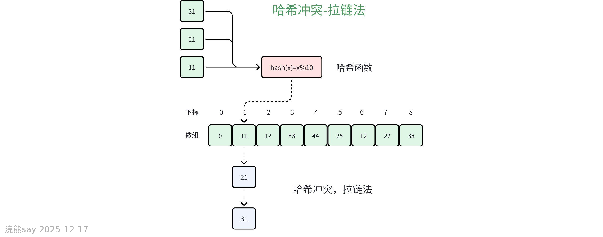

# 哈希表基础概念

## 什么是哈希表？

哈希表（Hash Table）是一种通过键值对（Key-Value Pair）存储数据的数据结构，其核心特性是能在平均O(1)时间复杂度内完成数据的插入、删除和查找操作， 核心组件如下：
| 组件 | 作用 |
| --- | --- |
| 键（Key） | 数据的唯一标识符（如学号、身份证号） |
| 值（Value） | 与键关联的数据（如学生姓名、用户信息） |
| 哈希函数 | 将键转换为数组索引的算法：index = hash(key) % capacity |
| 桶（Bucket） | 存储键值对的数组单元 |

## 哈希表 vs 数组/链表
| 操作 | 哈希表（平均） | 数组/链表 |
| --- | --- | --- |
| 插入 | O(1) | O(1)（尾部插入） |
| 查询 | O(1) | O(n)（遍历查找） |
| 删除 | O(1) | O(n)（查找+删除） |

# 哈希函数设计

## 哈希函数的作用

将任意大小的输入（键）映射到固定范围的输出（数组索引），其设计原则如下：

1.  **确定性**：相同键必须产生相同索引。
2.  **均匀性**：键应均匀分布到所有桶中。
3.  **高效性**：计算速度快，避免复杂运算。

## 哈希函数实现示例

 - 简单哈希算法

```
def simple_hash(key: int, capacity: int) -> int:
    return key % capacity  # 对容量取模
```

 - 字符串哈希算法（乘法哈希）

```
def string_hash(s: str, capacity: int) -> int:
    hash_value = 0
    for char in s:
        hash_value = (hash_value * 31 + ord(char)) % capacity
    return hash_value
```

# 哈希冲突与解决方案

## 哈希冲突的原因

当不同键通过哈希函数映射到同一索引时发生冲突，根本原因是输入空间（键）远大于输出空间（桶数量）。

## 解决方案

### 链式地址（Separate Chaining）



-   **原理**：每个桶存储一个链表（或其他结构），冲突元素追加到链表。
-   **操作复杂度**：
-   插入：O(1)
-   查询/删除：O(k)（k为链表长度，理想情况下k≈n/m）

### 开放寻址（Open Addressing）

-   **原理**：冲突时按探测规则（如线性探测）寻找下一个空桶。
-   **探测方法**：

1.  **线性探测**：index = (hash(key) + i) % capacity（i=1,2,3...）


2.  **平方探测**：index = (hash(key) + i²) % capacity


3.  **双重哈希**：index = (hash1(key) + i \* hash2(key)) % capacity

### 哈希表扩容（Rehashing）
- 触发条件

    -   **负载因子（Load Factor）**：λ = 元素数量 / 桶数量
    -   Java默认阈值：λ ≥ 0.75时扩容至2倍。

- 扩容步骤

    1.  创建新桶数组（容量为原2倍）。
    2.  遍历旧桶中所有键值对，重新计算哈希值并插入新数组。
    3.  释放旧数组内存。

- **性能影响**：扩容耗时O(n)，但分摊到每次操作仍为O(1)。

# 知识点速记

 哈希表核心机制
| 要点 | 关键内容 |
| --- | --- |
| 定义 | 通过键值映射实现O(1)时间复杂度的增删查改操作 |
| 组成 | 哈希函数（计算索引） + 数组（存储键值对） + 冲突解决策略 |
| 性能对比 | ✅ 哈希表：增删查改均为O(1)
⚠️ 数组/链表：查询/删除需O(n) |

 哈希冲突及处理
| 冲突原因 | 解决方法 |
| --- | --- |
| 不同key映射到同一索引 | 1. 链式地址：冲突元素用链表存储（Java HashMap实现）2. 开放寻址：线性探测/平方探测/多次哈希 |

 扩容机制
| 触发条件 | 操作 |
| --- | --- |
| 负载因子 > 阈值（如0.75） | 1. 扩容为原容量2倍
2. 重新哈希所有元素 |

 哈希函数设计要点
| 原则 | 说明 |
| --- | --- |
| 模数选择 | ✅ 必须用质数（如97、101）→ 减少周期性冲突 |
| 均匀分布 | 哈希算法需让key均匀分布（如SHA-256） |
| 真题示例 | H(k) = k % P，P选质数（如97）→ 答案B |

# 真题练习
| 【国家电网2019：】设某散列表的长度为100,散列两数H(k)-k%P，则P通常情况下最好选择()
A.99
B.97
C.91
D.93
答案:B
解析:在散列表的设计中，选择合适的哈希函数是非常重要的一步，它直接影响到散列表的性能。当使用取模运算作为哈希函数的一部分时（即 H(k)=k%PH(k)=k%P），选择一个合适的 PP 值尤为关键。理想情况下，PP 应该是一个素数，尤其是当散列表的大小不是素数时。这是因为，如果 PP 是一个素数，可以更好地分散键值，减少冲突的发生，从而提高散列表的效率。选项分析：
A.99：99 不是素数，因此不是一个好的选择。
B.97：97 是一个素数，能够较好地分布键值，减少冲突。
C.91：91 不是素数（91=7*13），因此也不是一个好的选择。
D.93：93 不是素数（93=3*31），同样不是一个好的选择。
答案: B. 97。
解析：选择一个接近散列表长度的素数可以最大化地利用散列表的空间，并有效地减少哈希冲突。 |
| --- |
