# 树

## 树的基础

### 树的定义

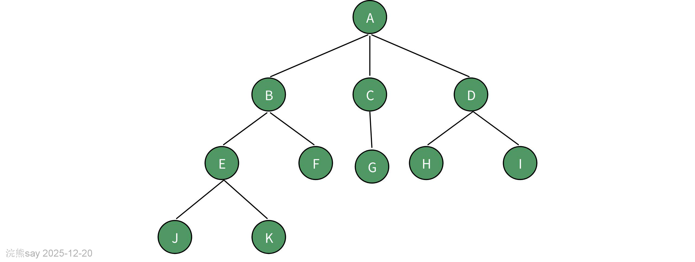

树（Tree）是一种**非线性层级式数据结构**，由有限个节点（Node）和连接节点的边（Edge）组成，核心特征区别于线性结构（数组、链表）的 “一对一” 关系，树是 “一对多” 的层级关系，且满足以下关键约束：

-   当节点数 _n_\>0 时，有且仅有一个**根节点（Root）**（无父节点的顶层节点）；
-   其余节点被划分为若干个互不相交的**子树（Subtree）**，每个子树也遵循树的规则；
-   整个结构无环（任意两个节点间有且仅有一条路径相连），无孤立节点（除空树外）。

可将树看作现实中的 “家族树”—— 根节点是祖先，子节点是子女，叶子节点是无后代的子孙，边是血缘关系。

## 树的相关术语

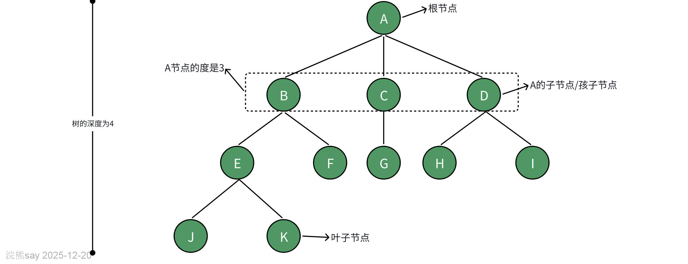

-   **孩子节点或子节点**：一个节点含有的子树的根节点称为该节点的子节点，如A节点的子节点为B、C、D；
-   **节点的度**：一个节点含有的子节点的个数称为该节点的度，如A节点的度为4；
-   **叶节点或终端节点**：度为0或没有子孙节点的节点称为叶节点，如上图J、K、F、G、H、I都是叶子节点；
-   **非终端节点或分支节点**：度不为0或还有子孙节点的节点称为非终端节点或分支节点；
-   **双亲节点或父节点**：若一个节点含有子节点，则这个节点称为其子节点的父节点，如节点D的父节点是A；
-   **兄弟节点**：具有相同父节点的节点互称为兄弟节点，如节点D的兄弟节点为B、C；
-   **树的度**：一棵树中，最大的节点的度称为树的度，上图中树的度是4；
-   **节点的层次**：从根开始定义起，根为第1层，根的子节点为第2层，以此类推。
-   **树的高度或深度**：树中节点的最大层次称为树的高度或深度。
-   **堂兄弟节点**：双亲在同一层的节点互为堂兄弟。
-   **节点的祖先**：从根到该节点所经过的所有节点称为该节点的祖先。
-   **子孙**：以某节点为根的子树中任一节点都称为该节点的子孙。

## 树的性质

1.  **树中的结点数等于所有结点的度数加1**：这个性质来源于树的定义，即一个连通且无环的图。每个边连接两个节点，因此所有节点的度数之和等于边数的两倍。由于树是一个连通图，它恰好有 n-1条边n 是节点数，所以所有节点的度数之和为 2(n-1)。但是，由于树至少有一个根节点，其度数可能为0（叶子节点），因此所有节点的度数之和加上1正好等于节点总数。

1.  **度为 m的树中第 i层上至多有 个结点** :在一个 m叉树中，每一层的结点数最多可以是前一层结点数的 m 倍。因为树的第一层（根节点所在层）只有1个结点，所以第二层最多有 m 个结点，第三层最多有 个结点，以此类推。因此，第 i 层上的结点数最多为

1.  **高度为 h 的 m叉树至多有个结点**：这个公式计算的是完全 m叉树的最大结点数。完全 m叉树是指除了最后一层外，其他所有层都是满的，并且最后一层的所有结点都尽可能靠左排列。根据等比数列求和公式，可以得出上述结果。

1.  **具有 n 个结点的 m 叉树的最小高度为**：最小高度意味着树尽可能平衡，即每一层的结点数都接近最大值。根据前一个性质，我们可以通过解不等式找到最小的高度 h，使得树能够包含至少 n 个结点。通过解不等式，可以得到 h 的下界，即最小高度。

## 树的顺序存储结构

### 双亲表示法

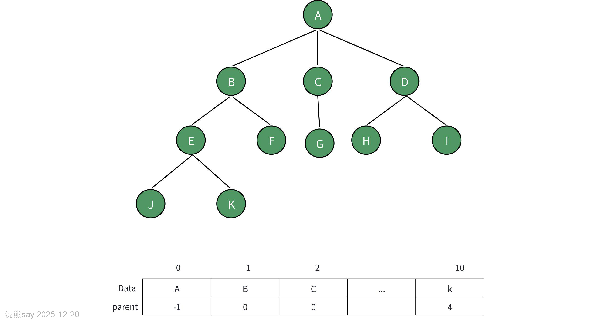

假设以一组连续空间存储树的结点，同时**在每个结点中，附设一个指示器指示其双亲结点到链表中的位置**。也就是说，每个结点除了知道自已是谁以外，还知道它的双亲在哪里。其中data是数据域，存储结点的数据信息，而parent是指针域，存储该结点的双亲在数组中的下标。

### 孩子表示法

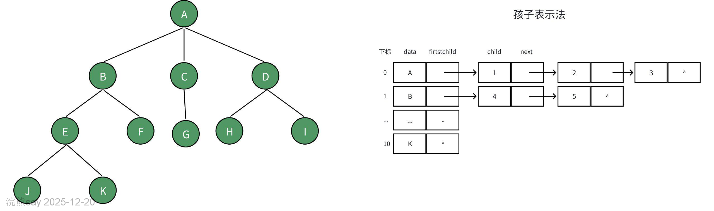

孩子表示法是把每个结点的孩子结点排列起来，以单链表作存储结构，则n个结点有n个孩子链表，如果是叶子结点则此单链表为空。然后n个头指针又组成-一个线性表，采用顺序存储结构，存放进一个一维数组中。

### 孩子兄弟表示法

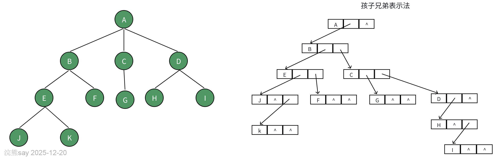

孩子兄弟表示法是一种用于表示树形结构的方法，**通过每个节点存储其第一个孩子节点和下一个兄弟节点的指针来实现**。每个节点包含三个部分：数据域 (data) 存储节点的实际数据，第一个孩子指针 (firstChild) 指向该节点的第一个孩子节点，右兄弟指针 (rightSib) 指向该节点的右兄弟节点。这种方法将树的每个节点视为一个链表的头节点，其 firstChild 指向子链表的头，rightSib 指向同级链表的下一个节点。这种表示法不仅适用于多叉树，也适用于二叉树和森林，能够灵活地表示任意形状的树结构，并且便于查找和遍历节点及其子节点。通过这种方式，树的层次结构被转换成了一种链式存储结构，简化了树的操作和管理。

# 二叉树

## 二叉树定义

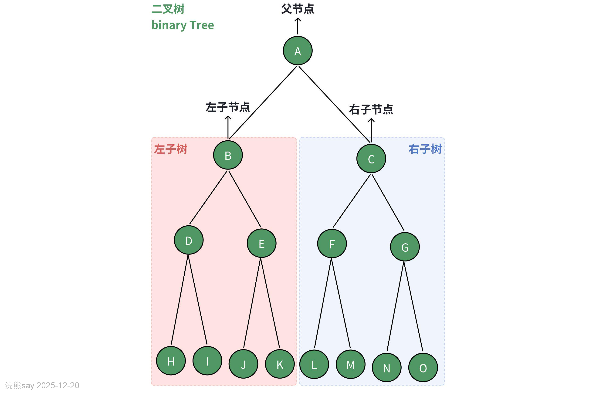

顾名思义，二叉树（Binary Tree）是一种特殊的树结构，每个节点最多有两个子节点，分别称为左子节点和右子节点。
| Java/* 二叉树节点类 */class TreeNode {int val; // 节点值TreeNode left; // 左子节点引用TreeNode right; // 右子节点引用TreeNode(int x) { val = x; }} |
| --- |

每个节点都有两个引用（指针），分别指向左子节点（left-child node）和右子节点（right-child node），该节点被称为这两个子节点的父节点（parent node）。当给定一个二叉树的节点时，我们将该节点的左子节点及其以下节点形成的树称为该节点的左子树（left subtree），同理可得右子树（right subtree）。

## 二叉树常见术语

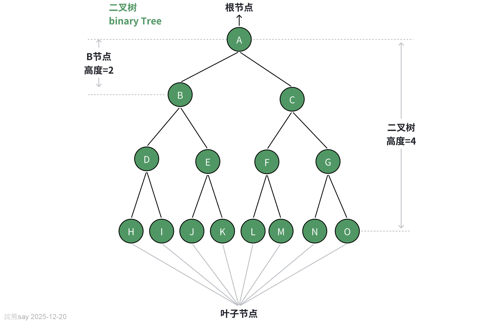

-   根节点（root node）：位于二叉树顶层的节点，没有父节点。
-   叶节点（leaf node）：没有子节点的节点，其两个指针均指向 None 。
-   边（edge）：连接两个节点的线段，即节点引用（指针）。
-   节点所在的层（level）：从顶至底递增，根节点所在层为 1 。
-   节点的度（degree）：节点的子节点的数量。在二叉树中，度的取值范围是 0、1、2 。
-   二叉树的高度（height）：从根节点到最远叶节点所经过的边的数量。
-   节点的深度（depth）：从根节点到该节点所经过的边的数量。
-   节点的高度（height）：从距离该节点最远的叶节点到该节点所经过的边的数量。

## 二叉树分类

### 满二叉树

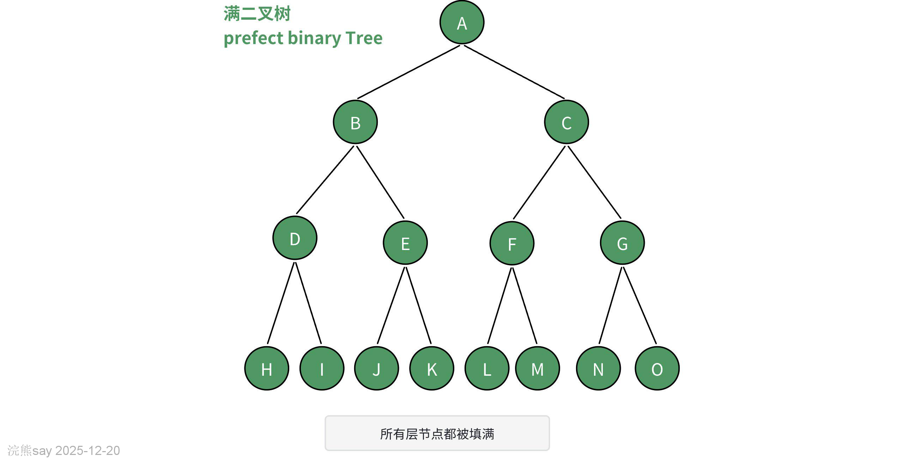

满二叉树（perfect binary tree）所有层的节点都被完全填满。在完美二叉树中，叶节点的度为 0 ，其余所有节点的度都为 2 ；若树的高度为 h ，则节点总数为 ，呈现标准的指数级关系，反映了自然界中常见的细胞分裂现象。

### 完全二叉树

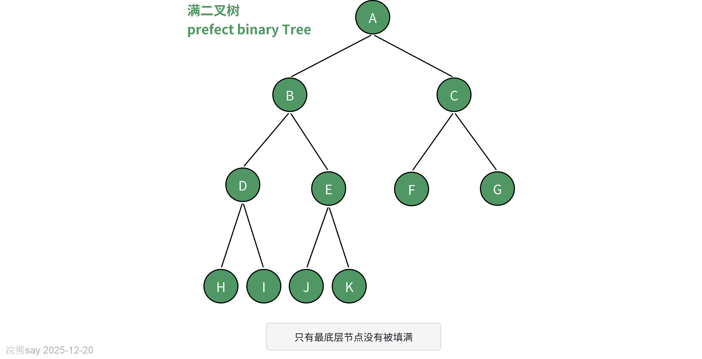

完全二叉树是一种效率很高的数据结构，它是从满二叉树引出来的。它的定义是：对于深度为K，有n个结点的二叉树，只有当它的每一个结点都与深度为K的满二叉树中编号从1到n的结点一一对应时，才称之为完全二叉树。

### 平衡二叉树

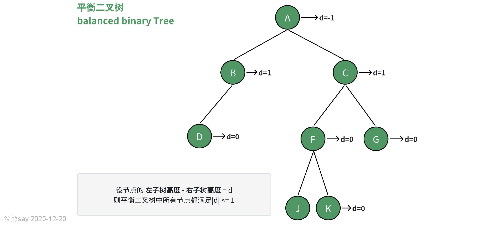

平衡二叉树（balanced binary tree）中任意节点的左子树和右子树的高度之差的绝对值不超过 1 。

### 二叉树的退化

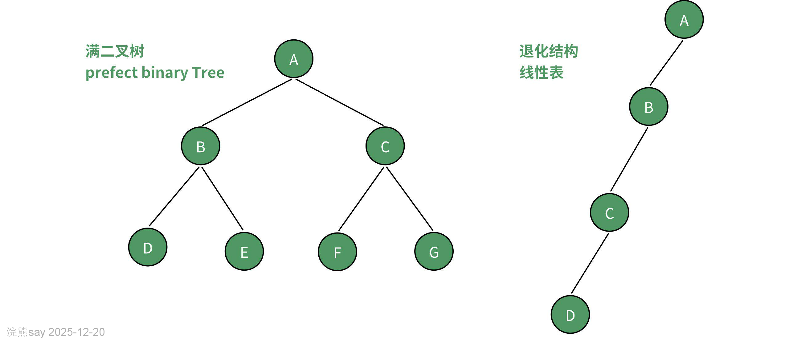

当二叉树的每层节点都被填满时，达到“完美二叉树”；而当所有节点都偏向一侧时，二叉树退化为“链表”。满二叉树是理想情况，可以充分发挥二叉树“分治”的优势，链表则是另一个极端，各项操作都变为线性操作，时间复杂度退化至 O(n)

## 二叉树的存储结构

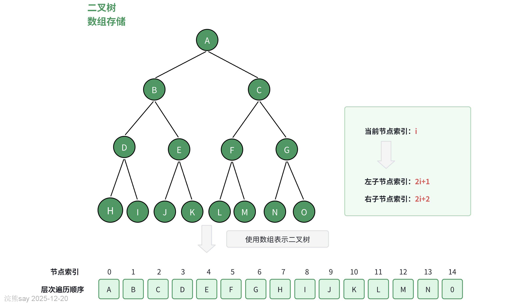

**二叉树的存储方式一般有2种——链式存储、数组存储**，一般链式存储会对应二叉树节点的结构体TreeNode，然后节点之间通过指针进行连接，如下：
| Javapublic class TreeNode {int val;TreeNode left;TreeNode right;TreeNode(int x) {val = x;}} |
| --- |

而数组存储则是根据二叉树的节点序号规律，通过计算的方式来得到二叉树的子节点的下标位置，从而组织成一棵逻辑上的二叉树结构，如下：
| Javapublic class BinaryTreeArray {private int[] array;private int size;public BinaryTreeArray(int capacity) {this.array = new int[capacity + 1]; // 数组大小比容量大1，以适应索引从1开始this.size = 0; // 当前二叉树的节点数量}} |
| --- |

对于数组的存储结构，一定要记住**假设当前节点的索引是i，那么其左子节点索引是2i+i，右子节点是2i+2。**

## 二叉树基本操作

二叉树是一种常见的数据结构，它由节点组成，每个节点最多有两个子节点，通常分为左子节点和右子节点。以下是几个基本的二叉树操作及其Java代码实现，包括创建节点、插入节点、删除节点、查找节点、前序遍历、中序遍历和后序遍历。

### 创建节点

首先定义一个二叉树节点类 TreeNode：
| Javapublic class TreeNode {int val;TreeNode left;TreeNode right;TreeNode(int x) {val = x;}} |
| --- |

### 插入节点

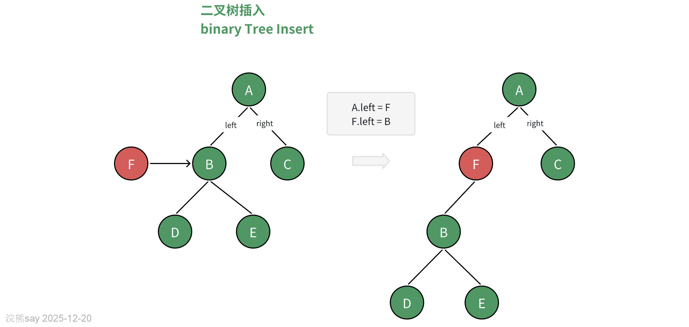

这里假设我们要构建一个二叉搜索树（Binary Search Tree, BST），在BST中，对于任意节点N，其左子树中的所有节点值都小于N的值，而右子树中的所有节点值都大于N的值。
| Javapublic TreeNode insert(TreeNode root, int key) {if (root == null) {return new TreeNode(key);}if (key  root.val) {root.right = insert(root.right, key);}// 如果key等于root.val，则不做任何操作，避免重复值return root;} |
| --- |

### 删除节点

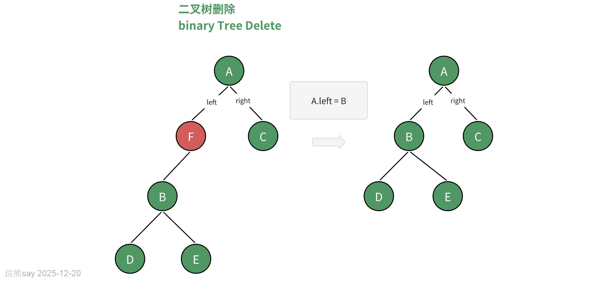

删除节点稍微复杂一些，需要考虑三种情况：没有子节点、有一个子节点、有两个子节点。
| Javapublic TreeNode deleteNode(TreeNode root, int key) {if (root == null) {return null;}if (key  root.val) {root.right = deleteNode(root.right, key);} else {// 节点有两个子节点if (root.left != null && root.right != null) {// 找到右子树中的最小值来替代TreeNode minNode = findMin(root.right);root.val = minNode.val;root.right = deleteNode(root.right, minNode.val);} else if (root.left != null) {// 只有左子节点root = root.left;} else if (root.right != null) {// 只有右子节点root = root.right;} else {// 没有子节点root = null;}}return root;}private TreeNode findMin(TreeNode node) {while (node.left != null) {node = node.left;}return node;} |
| --- |

### 查找节点

查找特定值的节点：
| Javapublic TreeNode search(TreeNode root, int key) {if (root == null || root.val == key) {return root;}if (key  root.val) {root.right = insertRec(root.right, key);}return root;}} |
| --- |

 删除节点

先在二叉树中查找到目标节点，再将其删除。与插入节点类似，我们需要保证在删除操作完成后，二叉搜索树的“左子树  root.val) {root.right = deleteRec(root.right, key);} else {if (root.left == null) {return root.right;} else if (root.right == null) {return root.left;}root.val = minValue(root.right);root.right = deleteRec(root.right, root.val);}return root;}private int minValue(TreeNode root) {int minValue = root.val;while (root.left != null) {minValue = root.left.val;root = root.left;}return minValue;}} |
| --- |

 查找节点
| Java// SearchOperation.javapublic class SearchOperation {public boolean search(TreeNode root, int key) {return searchRec(root, key) != null;}private TreeNode searchRec(TreeNode root, int key) {if (root == null || root.val == key) {return root;}if (key < root.val) {return searchRec(root.left, key);} else {return searchRec(root.right, key);}}} |
| --- |

 遍历操作
| Java// TraverseOperation.javapublic class TraverseOperation {public void preOrder(TreeNode root) {preOrderRec(root);System.out.println();}private void preOrderRec(TreeNode root) {if (root != null) {System.out.print(root.val + " ");preOrderRec(root.left);preOrderRec(root.right);}}public void inOrder(TreeNode root) {inOrderRec(root);System.out.println();}private void inOrderRec(TreeNode root) {if (root != null) {inOrderRec(root.left);System.out.print(root.val + " ");inOrderRec(root.right);}}public void postOrder(TreeNode root) {postOrderRec(root);System.out.println();}private void postOrderRec(TreeNode root) {if (root != null) {postOrderRec(root.left);postOrderRec(root.right);System.out.print(root.val + " ");}}} |
| --- |

### 二叉搜索树中序遍历有序

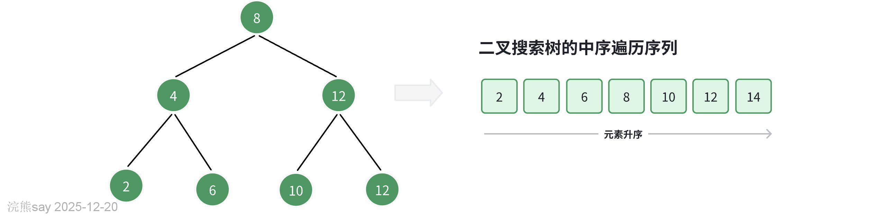

二叉树的中序遍历遵循“左 → 根 → 右”的遍历顺序，而二叉搜索树满足“左子节点 < 根节点 < 右子节点”的大小关系。这意味着在二叉搜索树中进行中序遍历时，总是会优先遍历下一个最小节点，从而得出一个重要性质：**二叉搜索树的中序遍历序列是升序的**。利用中序遍历升序的性质，我们在二叉搜索树中获取有序数据仅需 O(n) 时间，无须进行额外的排序操作，非常高效。

# 真题
| 【国家电网2016】若将关键字 1，2，3，4，5，6，7 依次插入到初始为空的平衡二叉树 T 中，则 T 中平衡因子为 0 的分支结点的个数是（ ）。A. 0B. 1C. 2D. 3答案 ：D解析 ：平衡二叉树要求任意节点左右子树高度差≤1。依次插入关键字后，最终平衡二叉树中有 3 个分支节点的平衡因子为 0（左右子树高度相等 |
| --- |

| 【国家电网2016】已知三叉树 T 中 6 个叶结点的权分别是 2，3，4，5，6，7，T 的带权（外部）路径长度最小是（ ）。A. 27B. 46C. 54D. 56答案 ：B解析 ：带权路径长度最小的三叉树为 最优三叉树 （哈夫曼树扩展），需每次合并 3 个最小权值（叶节点数 6=2 mod 3，补 1 个 0 权值），计算得最小带权路径长度为 46 |
| --- |

| 【国家电网2016】二叉树为二叉排序树的充分必要条件是其任一结点的值均大于其左孩子的值、小于其右孩子的值。该说法是否正确？A.正确；B.错误答案 ：B解析 ：二叉排序树要求结点值 大于左子树所有节点 、 小于右子树所有节点 ，而非仅左/右孩子 |
| --- |

| 【国家电网2017】以下说法正确的是（）。A.二叉树的特点是每个结点至多只有两棵子树；B.二叉树的子树无左右之分；C.二叉树只能进行链式存储；D.树的结点包含一个数据元素及若干指向其子树的分支答案 ：AD解析 ：二叉树每个节点至多有两棵子树（A 正确）；二叉树的子树有左右之分（B 错误）；二叉树可通过链式或数组存储（C 错误）；树的节点包含数据元素和指向子树的分支（D 正确 |
| --- |

| 【国家电网2017】树的表示方法有以下哪几种？（）。A.直观表示法；B.嵌套集合表示法；C.凹入表示法；D.广义表表示法答案 ：ABCD解析 ：树的常见表示方法包括直观表示法（图形展示）、嵌套集合表示法（集合嵌套）、凹入表示法（缩进层次）、广义表表示法（括号嵌套 |
| --- |

| 【国家电网2017】（）二叉排序树不可以得到一个从小到大的有序序列。A.先序遍历；B.中序遍历；C.后序遍历；D.层次遍历答案 ：ACD解析 ：二叉排序树的中序遍历（左→根→右）会输出升序序列，先序（根→左→右）、后序（左→右→根）、层次（按层访问）均无法保证有序。 |
| --- |
