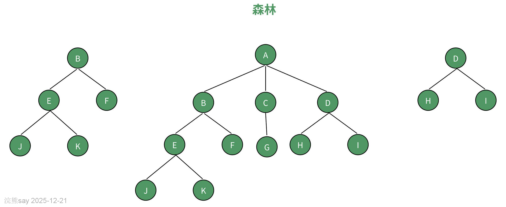
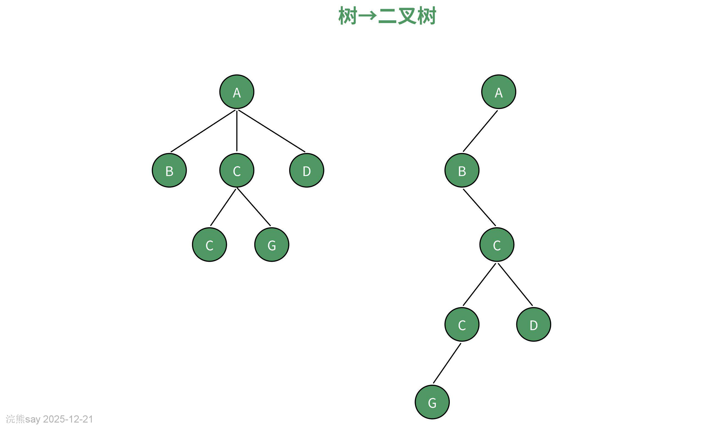
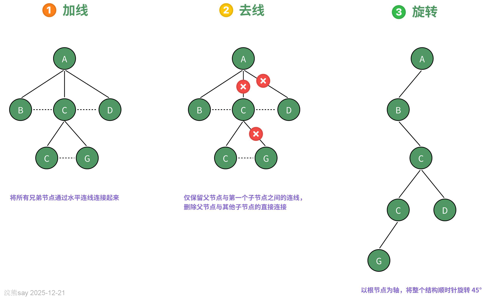
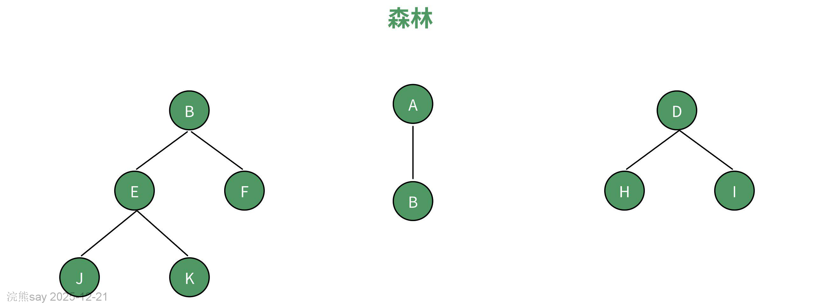
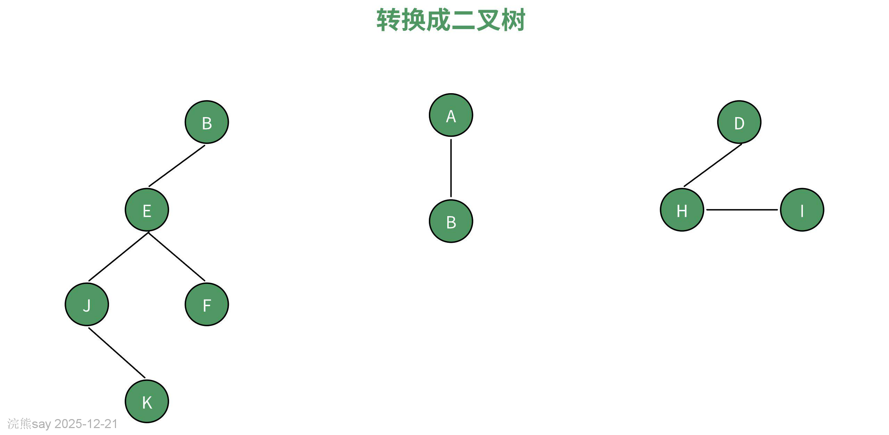
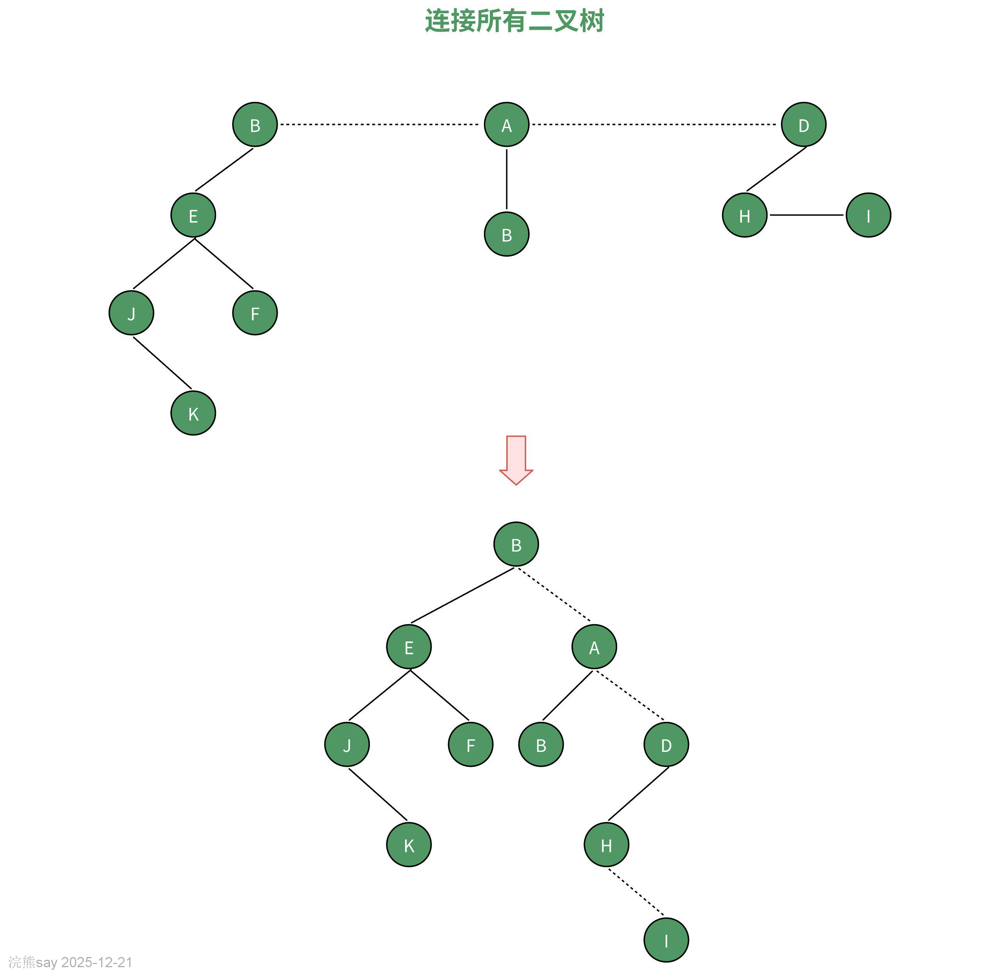
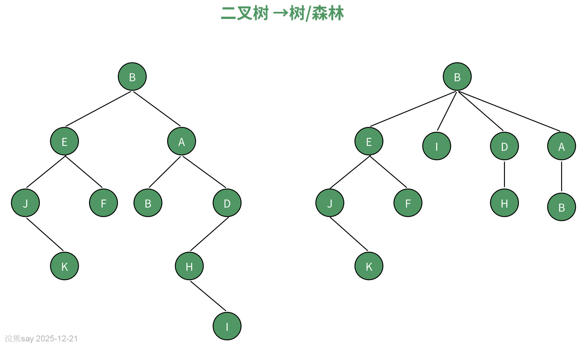
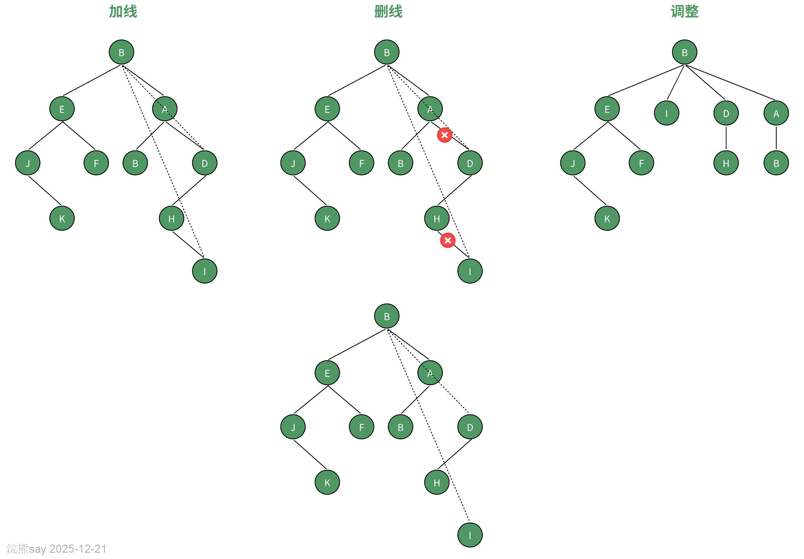

# 2、森林、树与二叉树的转换

**森林、树与二叉树的转换**
| 【原创声明】大家好，我是浣熊say，是这篇文章的原创作者！985硕士毕业，应届进入某大厂后道心破碎，社招上岸多家855半垄断央企，因为自己淋过雨，希望帮大家撑把伞，帮助更多同学找到不内卷、能够好好生活的央国企，已帮助1000+同学上岸央国企，需要连联系学长的加微信：wx_hxsay |
| --- |

## 什么是森林？

在数据结构中，**森林是由多个互不相交的树组成的集合**，每棵树具有以下特征：

1.  **节点关系**：每个节点（除根节点外）有且仅有一个父节点，可以有零或多个子节点。
2.  **无环结构**：树中不存在环路，任意两个节点之间只有一条唯一路径。
3.  **独立性**：森林中的树彼此独立，无共享节点或边。

类比一下，森林就像一片由多棵独立树木组成的自然森林，每棵树自成体系，彼此之间没有根系或枝叶的交织。

## 树、森林与二叉树的转换

## 树 → 二叉树

**核心思想**：通过“左孩子右兄弟”表示法，将多叉树转换为仅含左、右子节点的二叉树。

**转换步骤**：

1.  **加线：**在树中，将所有兄弟节点通过水平连线连接起来，这一步骤的目的是构建节点间的横向关系，以便后续转换。
2.  **去线：**仅保留父节点与第一个子节点之间的连线，删除父节点与其他子节点的直接连接，通过这一操作，突出了第一个子节点作为 “左孩子” 的特殊地位。
3.  **层次调整：**以根节点为轴，将整个结构顺时针旋转 45°，经过旋转，二叉树的层次结构更加清晰，便于理解与后续操作。

## 森林 → 二叉树

**核心思想**：将森林中的每棵树分别转换为二叉树，再通过右指针链接成链状结构。

**转换步骤**：

1.  **单树转换**：将每棵树按“树→二叉树”规则转换。

1.  **链接成链**：将第二棵二叉树的根节点作为第一棵根节点的右孩子，第三棵作为第二棵的右孩子，依此类推。

**意义**：通过右指针串联多棵树，实现森林的线性化表示。

## 二叉树 → 树/森林

**核心思想**：逆向操作，将二叉树的右指针还原为兄弟关系。

**转换步骤（以二叉树→树为例）**：

1.  加线：如果某节点存在左孩子，那么该节点的右孩子以及所有右后代节点，都将作为该节点的子节点。通过这一步，恢复了树结构中节点间的多叉分支关系。
2.  去线：删除所有右孩子与原父节点之间的连线，使得节点关系更加符合树的结构定义。
3.  层次调整：对节点进行重新排列，恢复树原本自然的层次结构，使树的形态更加直观。

## 树和森林的遍历原理

## 树的深度优先遍历

### 先序遍历树流程

**核心思想**：先访问根节点，再从左到右递归遍历子树。

**步骤**：

1.  访问根节点。
2.  对根节点的子节点（从左到右顺序）依次递归执行先序遍历。

**示例**：
| Plain Text树结构：A/ \B C/ | \D E F先序遍历结果：A → B → C → D → E → F |
| --- |

**代码实现（递归）**：
| Plain Textdef pre_order_tree(root):if root is None:returnprint(root.value)for child in root.children: # 从左到右遍历子节点pre_order_tree(child) |
| --- |

### 中序遍历树流程

**说明**：普通树没有严格的中序遍历定义，但可通过转换后的二叉树间接实现。

**规则**（基于二叉树转换逻辑）：

1.  递归遍历左子树（原树的第一个子节点）。
2.  访问根节点。
3.  递归遍历右子树（原树的兄弟节点）。

**示例**：
| Plain Text原树结构：A/ \B C转换后的二叉树：A/B\C中序遍历结果：B → A → C |
| --- |

## 森林的先序遍历

### 森林先序遍历流程

**核心思想**：依次对森林中的每棵树执行先序遍历。

**步骤**：

1.  从第一棵树开始，执行树的先序遍历。
2.  完成当前树后，继续对下一棵树执行先序遍历。

**示例**：
| Plain Text森林结构：树1：A-B-C | 树2：D-E先序遍历结果：A → B → C → D → E |
| --- |

**代码实现（递归）**：
| Plain Textdef pre_order_forest(forest):for tree_root in forest:pre_order_tree(tree_root) # 直接调用树的先序遍历函数 |
| --- |

### 森林中序遍历流程

**说明**：与树的中序遍历类似，需基于转换后的二叉树实现。

**规则**：

1.  将森林转换为二叉树（右链连接各树根）。
2.  对转换后的二叉树执行中序遍历。

**示例**：
| Plain Text原森林：树1：A | 树2：B-C转换后的二叉树：A\B/C中序遍历结果：A → C → B |
| --- |

**代码实现**：
| Plain Textdef in_order_forest(forest):# 将森林转换为二叉树（此处假设已实现）converted_bst = convert_forest_to_bst(forest)in_order_tree(converted_bst) # 调用树的中序遍历函数 |
| --- |

## 树和森林的广度优先遍历

**核心思想**：按层级逐层访问节点，从左到右、从上到下扫描。

# 树的广度优先遍历

**步骤**：

1.  初始化队列，将根节点入队。
2.  循环执行：

-   弹出队首节点并访问。
-   将该节点的所有子节点（从左到右）入队。

**示例**：
| Plain Text树结构：A/ \B C/ \D E广度优先遍历结果：A → B → C → D → E |
| --- |

**代码实现（队列）**：
| Plain Textfrom collections import dequedef bfs_tree(root):queue = deque([root])while queue:node = queue.popleft()print(node.value)queue.extend(node.children) # 从左到右入队 |
| --- |

# 森林的广度优先遍历

**步骤**：

1.  初始化队列，依次将所有树的根节点入队。
2.  循环执行：

-   弹出队首节点并访问。
-   若该节点属于某棵树，将其所有子节点入队。

**示例**：
| Plain Text森林结构：树1：A-B | 树2：C-D广度优先遍历结果：A → C → B → D |
| --- |

## 浣熊真题
