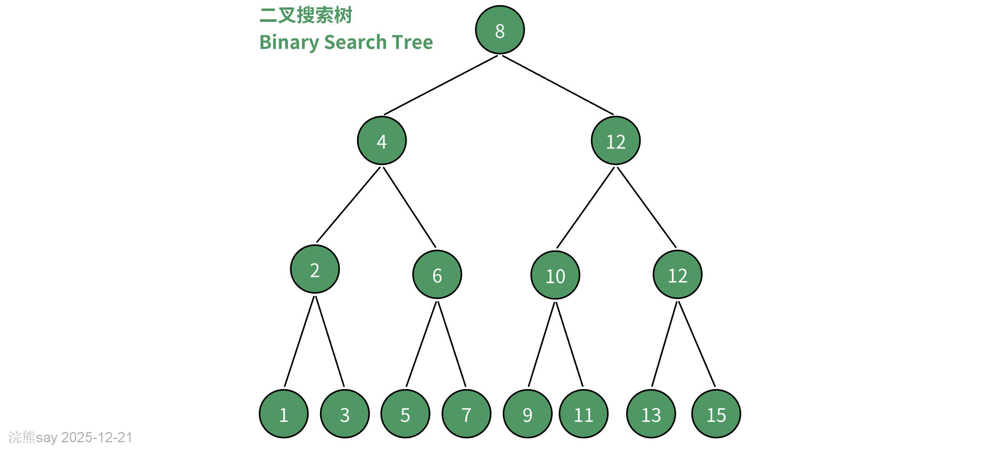
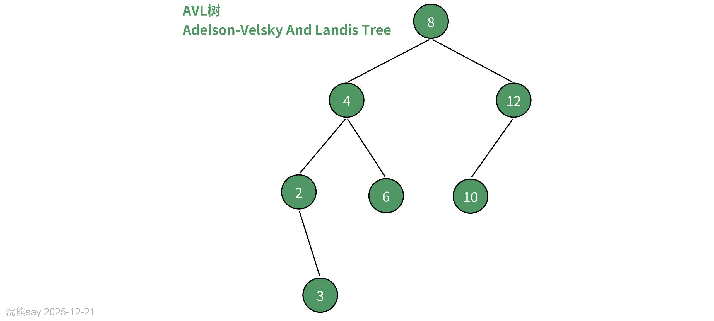
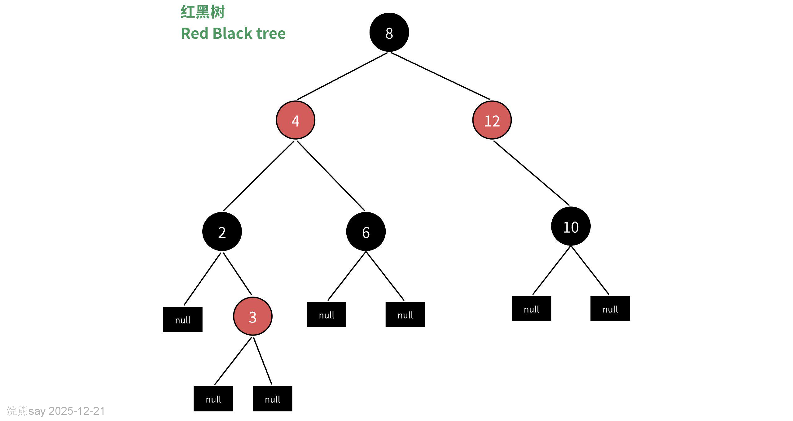
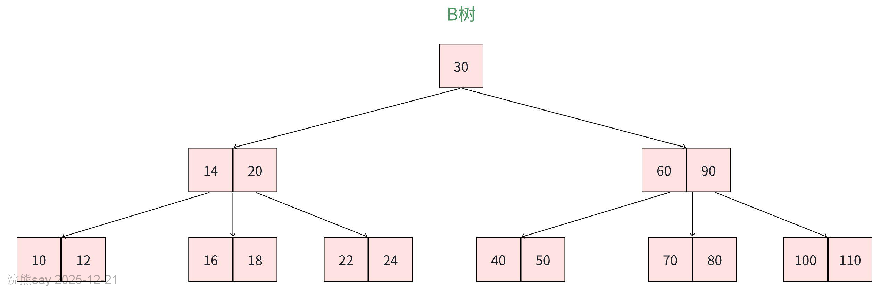
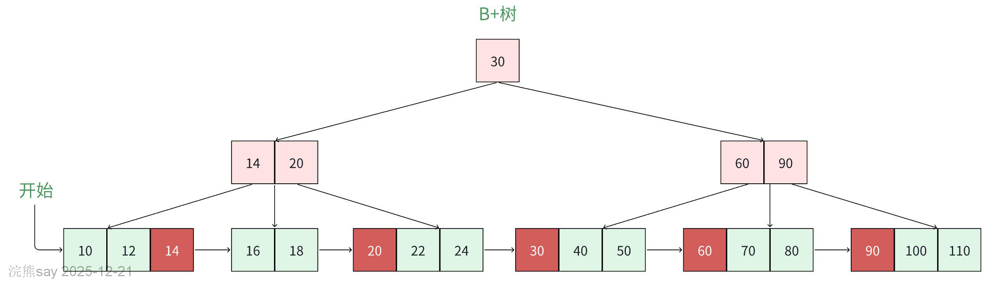

# 4、BST、AVL树、红黑树、B树、B+树（了解）

**BST、AVL树、红黑树、B树、B+树（了解）**

 Search Tree）

特点：

-   左子树的所有节点  根节点
-   左右子树也分别为二叉查找树

当二叉查找树是平衡的时候（左右子树深度差不超过1），查询的时间复杂度为Olog2(n)，查找效率较高。但是当二叉查找树不平衡的时候，会退化成线性表，查询时间复杂度退化成O(n).

 Adelson-Velsky and Landis Tree）树

AVL树是一种自平衡二叉搜索树（Self-balancing Binary Search Tree），在1962年被提出。，它的名称来自于发明者 G.M. Adelson-Velsky 和 E.M. Landis 的名字缩写。AVL 树的特点是保证任何节点的左右子树高度之差不超过 1，因此也被称为高度平衡二叉树，它的查找、插入和删除在平均和最坏情况下的时间复杂度都是 O(logn)。

AVL树和也叫做”平衡二叉搜索树“，对于二叉搜索树在多次插入和删除操作后，二叉搜索树可能退化为链表。在这种情况下，所有操作的时间复杂度将从 O(log⁡n) 劣化为 O(n) 。为了避免二叉搜索树在频繁的插入、删除操作之后退化成链表形式，AVL树会在插入、删除等操作的过程中去调整整棵树的平衡性，保障查询效率。**二叉搜索树有个特殊的概念，节点的平衡因子（balance factor）定义为节点左子树的高度减去右子树的高度，同时规定空节点的平衡因子为 0 。**

AVL 树采用了旋转操作来保持平衡。主要有四种旋转操作：LL 旋转、RR 旋转、LR 旋转和 RL 旋转。其中 LL 旋转和 RR 旋转分别用于处理左左和右右失衡，而 LR 旋转和 RL 旋转则用于处理左右和右左失衡。AVL树存在的问题：

-   AVL树需要频繁的旋转操作来保持平衡，性能开销较大
-   AVL树每个节点只能存储一个数据，磁盘IO每次只能读取一个节点，查询数据分布在多个节点时就需要多次IO

# 红黑树

红黑树是一种自平衡的二叉查找树，相较于AVL树更加灵活、插入删除效率更高、存储需求更好、性能稳定性更好。

**基本性质：**

-   每个节点非黑即红
-   根节点始终为黑色
-   每个叶子结点都是黑色的空节点（NIL节点）
-   节点为红、子节点必为黑
-   从根到NIL节点的每条路径，包含的黑色节点数目相同（高度一致）

**特点：**

-   红黑树并不追求严格的平衡，只追求大致的平衡。
-   红黑树插入、删除节点只需要O(1)次数的旋转和变色操作，维护平衡性开销较低。
-   由于红黑树只是相对平衡，可能会造成树的层次较高，查询效率降低。

由于上面的特点，红黑树并没有被应用到数据库中，但是TreeMap、TreeSet、HashMap等内存的数据结构上用得比较广泛。

# B&B+树

# B树

# B+树

# B&B+树的异同

1、B树的所有节点既存放键（key）也存放数据（data），B+树只有叶子结点存放key和data，其它节点只存放key。

2、B树的叶子节点都是相互独立的，B+树的叶子节点有指针指向前后相邻的叶子节点。

3、B树由于所有节点都有key和data，因此可能没走到叶子节点检索就结束了，查询效率不稳定。B+树由于data只存在于叶子节点，所有检索都是从根到叶子节点，查询效率很稳定。

4、在 B 树中进行范围查询时，首先找到要查找的下限，然后对 B 树进行中序遍历，直到找到查找的上限；而 B+树的范围查询，只需要对链表进行遍历即可。

综上，B+树与 B 树相比，具备更少的 IO 次数、更稳定的查询效率和更适于范围查询这些优势。
