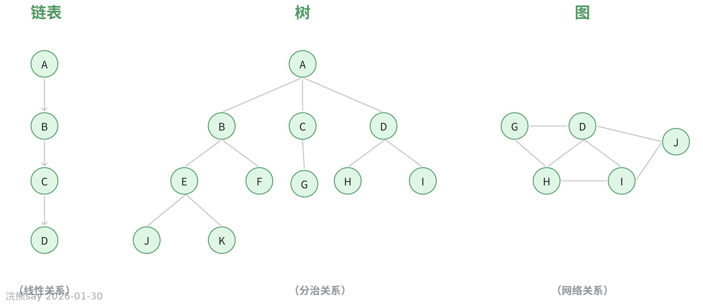
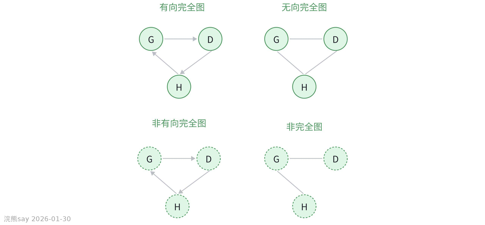
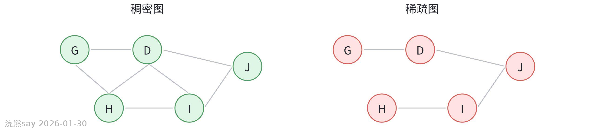
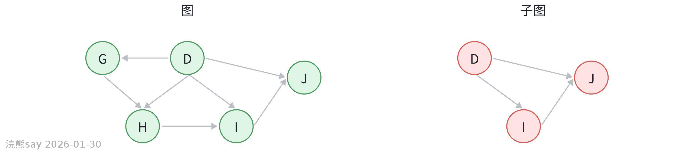
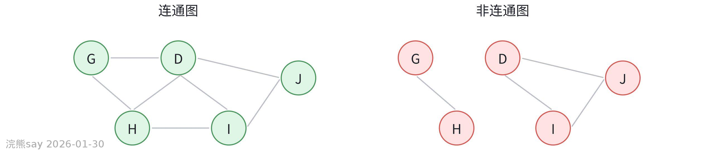
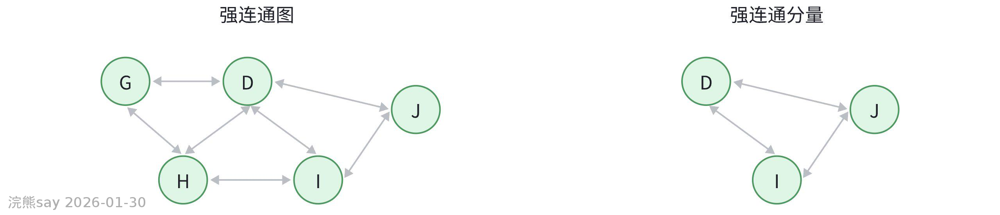
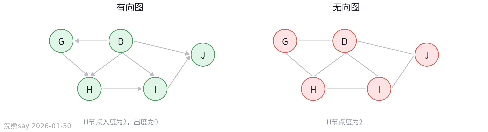
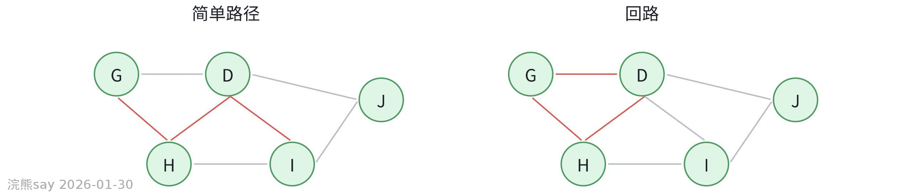
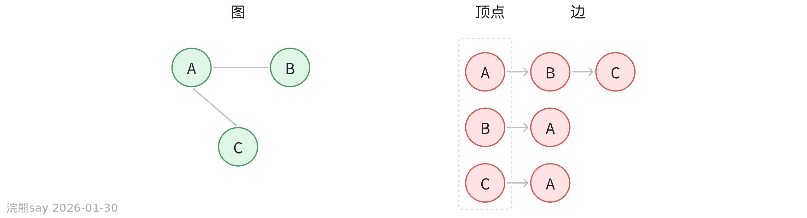
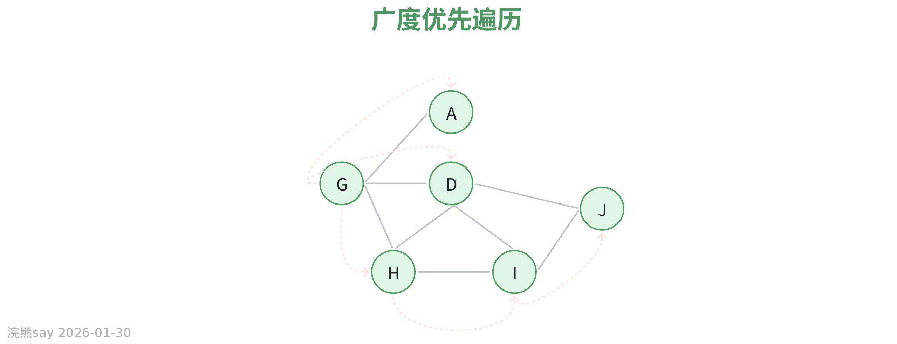

# 1、图基本概念

**图基本概念**

## 图的基本概念

在数据结构中，图是一种复杂且重要的非线性数据结构。它由顶点（Vertex）集合和边（Edge）集合组成，通常表示为，其中是顶点的集合，是连接顶点的边的集合。

顶点也称为节点，是图的基本元素，可以代表各种事物，比如城市、网络中的计算机等。边则用于表示顶点之间的关系，例如城市之间的道路、计算机之间的通信线路等。根据边是否有方向，图可分为有向图和无向图。在有向图中，边具有方向，从一个顶点指向另一个顶点；无向图的边没有方向，两个顶点之间的连接是双向的。如果边具有相关的权值，比如表示距离、成本等，这样的图称为带权图。图结构在社交网络分析、交通规划、电路设计等众多领域都有广泛应用。

## 图的分类与术语

## 图的分类

### 无向图

无向图就是由一堆点（顶点集合）和连接这些点的线（边集合）组成。关键是这些线没有方向，连接点 A 和点 B 的线，从 A 到 B 走和从 B 到 A 走是一样的，A 和 B 这两个点在这条线两端，顺序无所谓 。

因为线没方向，所以如果点 A 和点 B 有边连着，那 B 和 A 也肯定有边连着。就好比两个城市 A 和 B 之间有一条公路，从 A 开车能到 B，从 B 开车也能到 A

像微信好友关系。如果 A 加了 B 为好友，B 也通过了，那 A 和 B 就是双向好友。在这个关系图里，每个用户是一个点，好友关系就是连接点的线，而且这种好友关系是相互的。无向图可以用顶点集合 和边集合 来表示，对于这张无向图：

-   **顶点集合** ：包含图中所有的顶点，即 。

-   **边集合** ：由于无向图的边没有方向，边是由无序的顶点对组成。图中的边可以表示为无序对，所以边集合 。

那么这个无向图整体就可以表示为 ，其中 ， 。

### 有向图

同样由点（顶点集合）和线（边集合）组成，但这里的线有方向。连接点 A 和点 B 的线，明确规定了是从 A 指向 B，和从 B 指向 A 是完全不同的情况 。

线有方向，所以如果有一条线从 A 指向 B，不代表就有从 B 指向 A 的线。比如在信息传播里，消息从 A 传到 B，但 B 不一定会把消息再传回到 A

微博关注关系，A 关注了 B，可 B 不一定关注 A。在这个图里，用户是点，关注关系就是有方向的线，从关注的人指向被关注的人

有向图可以用顶点集合 _V_ 和边集合 _E_ 来表示，对于这张有向图：

-   顶点集合 _V_：包含图中所有的顶点，即 _V_\={_G_,_D_,_H_,_I_,_J_}。
-   边集合 _E_：有向图的边具有方向性，边是由有序的顶点对组成，用 (_u_,_v_) 表示从顶点 _u_ 指向顶点 _v_ 的边。所以根据图中边的指向，边集合 _E_\={(_G_,_D_),(_G_,_H_),(_D_,_J_),(_D_,_I_),(_H_,_I_),(_I_,_J_)} 。

那么这个有向图整体就可以表示为 _G_\=(_V_,_E_)，其中 _V_\={_G_,_D_,_H_,_I_,_J_} ， _E_\={(_G_,_D_),(_G_,_H_),(_D_,_J_),(_D_,_I_),(_H_,_I_),(_I_,_J_)} 。

### 无向完全图和有向完全图

-   无向完全图：在一个图中，如果任意两个顶点之间都有一条无方向的边相连，这样的图就是无向完全图。比如一个班级里的同学，任意两个同学之间都能直接交流，不存在交流的方向限制，这就类似无向完全图。

-   有向完全图：与无向完全图不同，有向完全图中任意两个顶点之间有两条方向相反的有向边。就像城市中的单行道，任意两个地点之间都有两条不同方向的单行道连接，从一个地点到另一个地点的方向是明确规定的。

### 稠密图和稀疏图

**稠密图**：图中边的数量比较多，接近完全图的状态。就像一个大城市的交通网络，道路很多，各个地方之间的连接很紧密。

**稀疏图**：与稠密图相反，边的数量相对较少。比如一些偏远地区的交通网络，道路很少，很多地方之间没有直接的道路连接。

### 子图

从一个图中选取一部分顶点和这些顶点之间的边所组成的新图就是子图。就像一个大家庭是一个图，家庭中的一个小家庭就是这个大家庭图的子图，小家庭中的成员和他们之间的关系就是从大家庭中选取出来的。

### 连通图

在无向图中，如果任意两个顶点之间都存在路径，能够相互到达，那么这个图就是连通图。比如一个由多个岛屿组成的群岛，如果任意两个岛屿之间都有桥连接，那么这个群岛的关系图就是连通图。

### 连通分量

对于非连通图，可以把它分成若干个连通的子图，这些子图就是连通分量。就像一个由多个独立的小部落组成的地区，每个小部落内部成员之间有联系，但不同部落之间没有联系，每个小部落就是一个连通分量。

### 强连通图

在有向图中，任意两个顶点之间都存在双向的路径，即从顶点A可以到达顶点B，从顶点B也可以到达顶点A，这样的有向图就是强连通图。比如在一个城市的单向交通网络中，如果任意两个地点之间都能通过合适的路线相互到达，就是强连通图。

### 强连通分量

对于非强连通的有向图，其极大强连通子图就是强连通分量。可以想象成一个复杂的有向交通网络中，有一些小区域内部的交通是双向可达的，这些小区域就是强连通分量。

## 图的常见术语

### 权值

可以理解为图中边的“代价”或“价值”。比如在一个表示城市之间距离的图中，权值就是两个城市之间的实际距离；如果图表示的是网络通信，权值可能是通信的成本或者传输延迟等。

### 网络

一般指带权的图，这里的权值可以表示各种实际意义，如距离、成本、时间等。像我们的交通网络、通信网络等都可以用图来表示，图中的顶点是站点、节点等，边就是连接它们的道路、线路等，权值就是相关的距离、费用等信息。

### 邻接顶点

对于图中的某个顶点，如果有其他顶点通过边与它直接相连，那么这些顶点就是它的邻接顶点。比如在一个表示人际关系的图中，一个人的直接朋友就是他的邻接顶点。

### 顶点的度

对于无向图，顶点的度是指与该顶点相连的边的数量。对于有向图，分为入度和出度，入度是指以该顶点为终点的有向边的数量，出度是指以该顶点为起点的有向边的数量。比如在一个社交网络中，一个人的度就是他直接联系的人数，对于有向的关注关系网络，入度就是关注他的人数，出度就是他关注的人数。

### 路径

从一个顶点到另一个顶点所经过的顶点序列和边序列就是路径。比如在一个城市地图中，从家到学校经过的一系列路口和街道就是一条路径。

### 路径长度

路径中边的数量或者边的权值之和。如果是不考虑权值的简单图，路径长度就是经过的边的条数；如果是带权图，就是经过的边的权值相加的结果。比如在计算从家到学校的距离时，路径长度就是经过的各段道路长度之和。

### 简单路径和回路

**简单路径**：在路径中，除了起点和终点可以相同外，其余顶点都不重复的路径。就像从一个地方出发去多个地方办事，每个地方只去一次，最后回到起点或者不回到起点。

**回路**：起点和终点相同的路径。比如绕着一个公园散步一圈，起点和终点是同一个地方。

### 生成树

对于一个连通图，它的生成树是包含图中所有顶点的一个极小连通子图，且这个子图是一棵树。比如在一个由多个城市组成的交通网络中，选取一些道路，使得这些道路连接所有城市，并且没有环路，这就是一个生成树，它可以用来找到一种最经济的连接所有城市的方式。

## 图的表示

## 邻接矩阵

**定义**：是表示图中顶点之间相邻关系的矩阵。对于具有个顶点的图，其邻接矩阵是一个的矩阵。如果顶点和之间有边相连（对于无向图）或者有从到的有向边（对于有向图），则；否则。如果是带权图，当顶点和之间有边相连时，的值为该边的权值，没有边相连时通常用或一个很大的数表示。

**示例**：假设有一个无向图，包含顶点、、，其中与、与相连，则其邻接矩阵为

**特点**：优点是可以快速判断两个顶点之间是否有边相连，时间复杂度为；缺点是对于稀疏图会浪费大量空间，空间复杂度为。

## 邻接表

**定义**：是图的一种链式存储结构。对于图中的每个顶点，用一个链表来存储与它相邻的顶点。链表中的每个节点包含两个信息：邻接顶点的编号和指向下一个邻接顶点的指针。对于带权图，节点还需要存储边的权值。

**示例**：对于上述无向图，其邻接表表示为：的邻接表为；的邻接表为；的邻接表为。

**特点**：优点是对于稀疏图节省空间，空间复杂度为，其中是顶点数，是边数；缺点是判断两个顶点之间是否有边相连相对较慢，时间复杂度为，是顶点的度。

## 图的基本操作

## 邻接矩阵表示法

邻接矩阵是一个二维数组，对于一个有 V 个顶点的图，其邻接矩阵是一个 V x V 的矩阵。如果顶点 i 和顶点 j 之间有边相连，那么矩阵中第 i 行第 j 列的元素为 1（对于无权图）或边的权值（对于有权图）；否则为 0。
| Javaimport java.util.Arrays;class GraphAdjMatrix {private int V; // 顶点数量private int[][] adjMatrix;// 构造函数，初始化图public GraphAdjMatrix(int V) {this.V = V;adjMatrix = new int[V][V];for (int i = 0; i > adjList;// 构造函数，初始化图public GraphAdjList(int V) {this.V = V;adjList = new ArrayList<>();for (int i = 0; i ());}}// 添加边public void addEdge(int src, int dest) {adjList.get(src).add(dest);adjList.get(dest).add(src); // 无向图}// 删除边public void removeEdge(int src, int dest) {adjList.get(src).remove((Integer) dest);adjList.get(dest).remove((Integer) src); // 无向图}// 检查两个顶点之间是否有边public boolean hasEdge(int src, int dest) {return adjList.get(src).contains(dest);}// 打印邻接表public void printGraph() {for (int i = 0; i [] adj;public Graph(int V) {this.V = V;adj = new LinkedList[V];for (int i = 0; i ();}}public void addEdge(int u, int v) {adj[u].add(v);}private void DFSUtil(int v, boolean[] visited) {visited[v] = true;System.out.print(v + " ");for (int neighbor : adj[v]) {if (!visited[neighbor]) {DFSUtil(neighbor, visited);}}}public void DFS(int start) {boolean[] visited = new boolean[V];DFSUtil(start, visited);}} |
| --- |

## 广度优先搜索（BFS）

-   **核心思想**：类似于树的层序遍历，从起始顶点出发，逐层访问所有邻接顶点。
-   **实现步骤**：

1.  选择起始顶点，标记为已访问并加入队列。
2.  从队列中取出顶点，访问其所有未访问邻接顶点并加入队列。

-   **应用场景**：
-   计算最短路径（无权图）。
-   社交网络中的“共同好友”推荐。
-   检测二分图。
-   **时间复杂度**：O(V + E)。

**Java代码实现**：
| Javapublic void BFS(int start) {boolean[] visited = new boolean[V];Queue queue = new LinkedList<>();visited[start] = true;queue.add(start);while (!queue.isEmpty()) {int v = queue.poll();System.out.print(v + " ");for (int neighbor : adj[v]) {if (!visited[neighbor]) {visited[neighbor] = true;queue.add(neighbor);}}}} |
| --- |

## 浣熊真题
| 【国家电网2023】从存储空间的利用率角度来看，以下关于数据结构中图的存储的叙述中，正确的是？A.有向图适合采用邻接矩阵存储，无向图适合采用邻接表存储；B.无向图适合采用邻接矩阵存储，有向图适合采用邻接表存储；C.完全图适合采用邻接矩阵存储；D.完全图适合采用邻接表存储；答案：C；解析：完全图边数多，邻接矩阵能直接反映顶点间的连接关系，存储空间利用率更高 |
| --- |

| 【国家电网2017】关于连通图的生成树，下列说法错误的是？A.生成树必须包含原图的所有顶点；B.生成树是原图的极小连通子图；C.生成树中边的数量等于顶点数减 1；D.生成树可以通过删除原图中的任意一条边得到；答案：D；解析：生成树需删除冗余边以消除环路，但任意删除一条边可能破坏连通性，无法保证得到生成树 |
| --- |

| 【国家电网2014】若一个无向连通图有 7 个顶点，其最小生成树中边的数量为？A.6；B.7；C.8；D.5；答案：A；解析：生成树的边数恒等于顶点数减 1（7-1=6），确保无环且连通 |
| --- |

| 【国家电网2016】关于强连通图，下列说法正确的是？A.强连通图仅存在于无向图中；B.强连通分量内部顶点间双向可达；C.非强连通的有向图无法分解为强连通分量；D.强连通图的邻接矩阵一定是对称矩阵；答案：B；解析：强连通分量是有向图中顶点间能互相到达的最大子图，内部顶点双向可达 |
| --- |

| 【中国华电2025】有向图 G 中所有顶点的度数之和是 24，则 G 中弧的数量是？A.10；B.12；C.14；D.16；答案：B；解析：有向图每条弧贡献一个出度和一个入度，总度数是弧数的 2 倍（24÷2=12） |
| --- |

| 【南方电网2018】在一个无向图中，所有顶点的度数之和等于边数的？A.1 倍；B.2 倍；C.3 倍；D.4 倍；答案：B；解析：无向图每条边贡献两个度数（连接两个顶点），总度数是边数的 2 倍 |
| --- |
