# 2、图的最小生成树

**图的最小生成树**

简单来说，图的最小生成树就是帮你解决 “**用最少成本把所有点连起来**” 的问题 —— 比如修公路（城市 = 顶点，公路 = 边，造价 = 权重），要让所有城市互通，还得总造价最低，这时候找的就是最小生成树（还不能有环路，环路等于多花钱修重复路）。

但是，图的最小生成树的存在必须有一个前置条件，那就是图必须是连通的，因此，本文从连通图开始逐步深入介绍什么是图的最小生成树，以及找图的最小生成树的两种算法——Prim算法和Kruska's算法。

## 生成树的前置知识——连通图

## 非连通图（UnConnected Graph）

非连通图（Disconnected Graph）是指一个图中存在至少两个顶点，它们之间没有路径相连。换句话说，在非连通图中，至少存在一个顶点对 (u,v) ，使得从 u 到 v没有路径。非连通图可以分为多个连通分量，每个连通分量都是一个连通子图。

## 连通图（Connected Graph）

连通图是指在一个无向图中，任意两个顶点之间都存在至少一条路径相连的图。换句话说，从图中的任意一个顶点出发，都可以通过图中的边到达图中的其他任何一个顶点。连通图的特点是没有孤立的顶点，且整个图作为一个整体是连通的。

## 连通子图（Connected Subgraph）

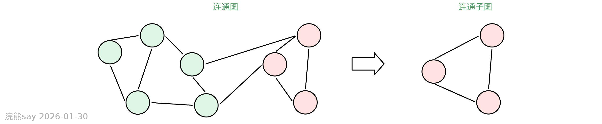

连通子图是指原图的一个子集，这个子集本身构成一个连通图。也就是说，如果从原图中选择一部分顶点及其相关的边，这些顶点和边所组成的图如果仍然是连通的，那么这个新的图就是原图的一个连通子图。需要注意的是，连通子图可以是原图本身，也可以是原图的一个部分。

## 极大连通子图（Maximal Connected Subgraph）

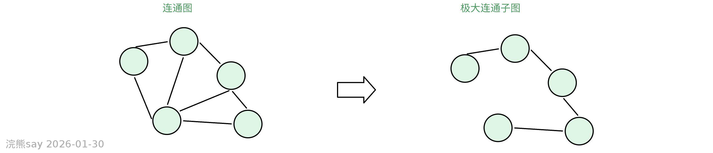

极大连通子图是指一个连通子图，它不能通过添加更多的顶点和边来扩展，同时仍然保持连通性。换句话说，如果再向这个子图中添加任何一个不属于当前子图的顶点或边，这个子图就会失去连通性。

## 极小连通子图（Minimal Connected Subgraph）

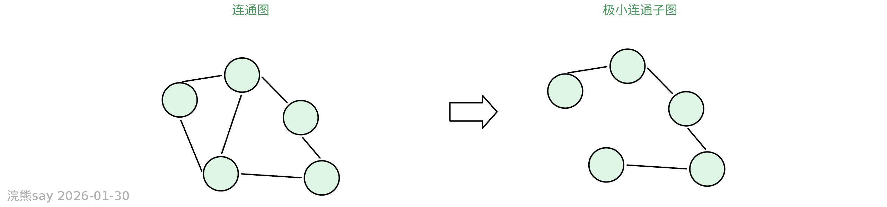

极小连通子图是指一个连通子图，它不能通过删除任何一条边来保持连通性。换句话说，如果从这个子图中删除任何一条边，子图就会变得不连通。

## 强连通图（Strongly Connected Graph, SCC）

在图论中，强连通图（Strongly Connected Graph）是一个有向图中的一个重要概念。与无向图的连通性不同，强连通图强调的是有向图中顶点之间的双向可达性。具体来说，强连通图是指在一个有向图中，任意两个顶点 _u_ 和 _v_ 之间都存在从 _u_ 到 _v_ 和从 _v_ 到 _u_ 的有向路径。换句话说，从图中的任意一个顶点出发，都可以通过图中的有向边到达图中的其他任何一个顶点，并且反过来也成立。

## 强连通分量（Strongly Connected Component, SCC）

如果一个有向图不是强连通的，它可以被分解成若干个强连通分量。强连通分量是指图中最大的子图，这些子图内部是强连通的，但与其他子图之间没有这样的双向可达性。

## 连通图的最小生成树

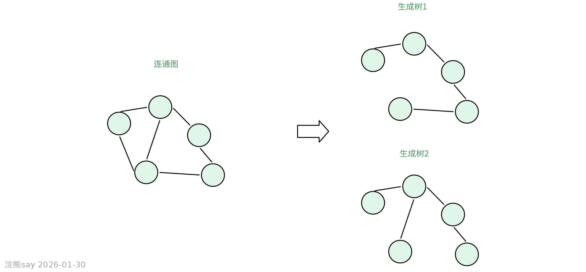

连通图的生成树（Spanning Tree）是指一个无向连通图的一个子图，它是一棵树，包含了原图中的所有顶点，并且是原图的一个极小连通子图，也就是说，它恰好有足够多的边来保证所有顶点都是连通的，但又没有多余的边形成环路。具体来说，如果一个连通图有 n个顶点，那么它的生成树将有 n−1条边。生成树的几个关键特性包括：

-   连通性：生成树必须保持原图的连通性，即在生成树中可以从任意一个顶点到达其他任何一个顶点。
-   无环：生成树不能包含任何环路。
-   极小性：生成树是连通的，但是删除任何一条边都会使图变得不连通；同样地，添加任何一条不在生成树中的原图的边都会产生一个环。

在实际应用中，生成树的概念非常重要，尤其是在网络设计、路径规划等领域。例如，在设计通信网络时，生成树可以帮助确定一种连接所有节点的最经济的方式，避免了不必要的冗余连接。

此外，对于带权图（每条边都有一个关联的数值，称为权重），还有一种特殊的生成树——**最小生成树**（Minimum Spanning Tree, MST），它是在所有可能的生成树中总权重最小的那一个。最小生成树在很多实际问题中有着广泛的应用，比如在电力网络、交通网络等基础设施的设计和优化中。

要找到一个无向连通图的最小生成树（Minimum Spanning Tree, MST），可以使用几种经典的算法，比如普里姆算法（Prim's Algorithm）或者克鲁斯卡尔算法（Kruskal's Algorithm）。这两种算法都能有效地找到一个图的最小生成树，即一个包含图中所有顶点且总权重最小的连通子图。

## 普里姆算法 (Prim's Algorithm)

## 什么是Prim算法？

普里姆算法从图中的任意一个顶点开始，**逐步将最近的顶点加入到正在构建的最小生成树中，直到所有的顶点都被加入为止。**这个过程中始终保持已经选择的顶点集合与剩余顶点集合之间的最短边被选择。通过一个具体的例子来说明普里姆算法（Prim's Algorithm）的流程会更加直观。假设我们有一个无向图，如下所示：

## Prim算法的通俗解释

Prim算法就像建桥工程师连接岛屿的过程，目标是花最少的钱让所有岛屿通车。比如有7个岛，每个岛之间修桥的成本不同，工程师会这样做：

1.  **随便选起点**：比如先选1号岛当基地（这就像树的根）
2.  **找最便宜的桥**：看1号岛周围哪座桥最便宜，比如到2号岛只要1块钱，先修这座桥
3.  **扩大基地范围**：现在1、2号岛连起来了，再看这两个岛周围未连的岛中，哪座桥最便宜。比如发现2号岛到6号岛只要1块钱，接着修这座桥
4.  **重复找最便宜**：就像滚雪球，每次都用已经连通的岛做跳板，找连接新岛最便宜的桥，直到所有岛都连通

整个过程像搭积木，每次只选当前最划算的积木块。工程师永远不选贵的桥，只挑当下最便宜的，这种"贪小便宜"的策略最后反而能省最多的钱。实际生活中，这种算法能帮快递员设计最短送货路线，或者帮探险家规划最短寻宝路径。

## Prim算法操作步骤

1.  **初始化：选择一个起始顶点，假设选择顶点 A**

1.  **从优先队列中取出距离最小的顶点 B:** 在与A相连的边中A到B的边权最小，因此我们将A到B加入最小生成树。

1.  **从优先队列中取出距离最小的顶点 ：**在与\[A、B\]相连的所有边中，权重最小的为BC=2，所以将C加入最小生成树

1.  **从优先队列中取出距离最小的顶点 D：**在与\[A、B、C\]相连的所有边当中，权重最小的为AD=3，所以将D加入最小生成树。

1.  **从优先队列中取出距离最小的顶点 E：**在与\[A、B、C、D\]相连的所有边当中，权重最小的为DE=8，所以将E加入最小生成树。

1.  **从优先队列中取出距离最小的顶点 ：**在与\[A、B、C、D、E\]相连的所有边当中，权重最小的为EF=6，所以将F加入最小生成树。此时所有顶点都已在最小生成树中，算法结束。

## 克鲁斯卡尔算法 (Kruskal's Algorithm)

## 什么是Kruskal's 算法？

克鲁斯卡尔算法则是从图的所有边中按权重从小到大排序，然后依次选择权重最小的边加入到最小生成树中，前提是这条边不会形成环路。这个过程一直持续到生成树包含了图中所有的顶点为止。

## Kruskal算法的通俗解释

Kruskal算法就像用最省钱的方法把所有村庄用道路连起来，而且不绕圈圈！具体来说，分三步走：

1.  **按价格排序**

假设每个村庄是图上的点，连接它们的道路有不同造价（权重）。我们先把所有道路从便宜到贵排好队。

1.  **选最便宜的路**

从最便宜的路开始检查。比如第一条路连接A村和B村，只要这两个村子还没被其他路连起来，就修这条路。这里有个小秘诀：用村长（并查集）记录每个村子的归属。如果两个村子的村长不同，说明它们还没连通，可以修路；如果村长相同，修这条路就会形成绕圈的路，不能修。

1.  **重复直到全连通**

继续检查下一条便宜的路，直到所有村子都被连接。就像拼拼图，每次都用最便宜的零件，而且保证不出现多余的环。最后用的路数量总是比村子少1个（比如5个村子用4条路）。

整个过程就像玩闯关游戏：先整理道具（排序），然后按性价比使用道具（选边），还要用村长系统防止重复建设（避免环路），最终用最低成本完成任务！

## Kruskal算法的操作步骤

假设我们有一个具体的无向图，其中顶点用字母表示，边及其权重用数字表示。为了简化说明，我们假设有一个简单的例子：

1.  **将带权无向图的边按照权值大小的顺序存放到边集合中**

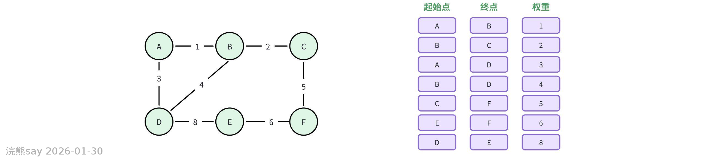

1.  **构造一个不包含任何边的图**

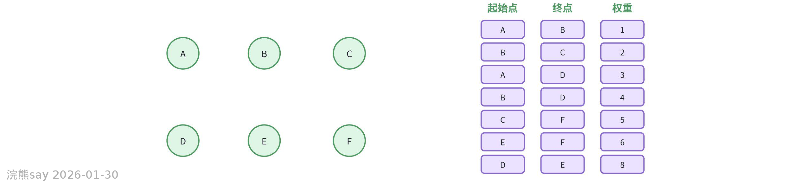

1.  **从边集合中取出一条最小的边AB，将B加入图中(这里需要判断不属于同一个连通分量)**

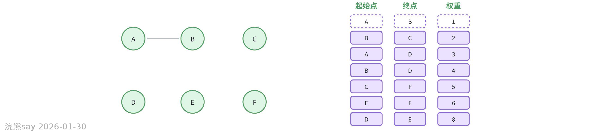

1.  **从边集合中取出一条最小的边BC，这里C和AB不属于同一个连通分量，因此将C加入图中**

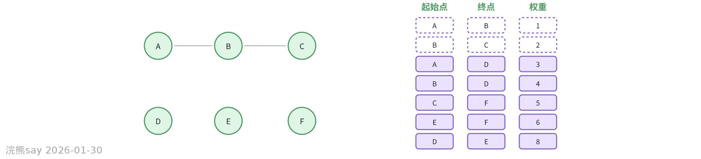

1.  **从边集合中取出一条最小的边AD，这里D和ABC不属于同一个连通分量，因此将D加入图中**

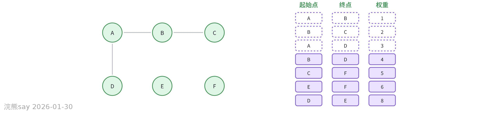

1.  **从边集合中取出一条最小的边BD，但是这里BD和ABCD属于同一个连通分量，所以BD不能加入图中**
2.  **从边集合中取出一条最小的边CF，这里F和ABCD不属于同一个连通分量，因此将F加入图中**

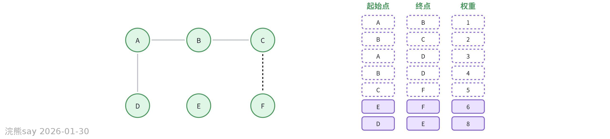

1.  **从边集合中取出一条最小的边EF，这里E和ABCDF不属于同一个连通分量，因此将E加入图中，结束**

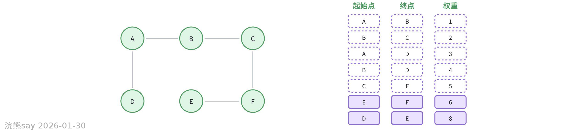

## 真题
| 【国家电网2017】关于连通图的生成树，下列说法错误的是（ ）A. 生成树必须包含原图的所有顶点B. 生成树是原图的极小连通子图C. 生成树中边的数量等于顶点数减1D. 生成树可以通过删除原图中的任意一条边得到答案：D解析：生成树需要删除原图中的冗余边使其无环，但并非任意删除一条边都能得到生成树（可能破坏连通性）。 |
| --- |

| 【国家电网2016】以下关于Prim算法和Kruskal算法的描述，正确的是（ ）A. Prim算法适用于有向图，Kruskal算法仅适用于无向图B. 两种算法都基于贪心策略寻找最小生成树C. Kruskal算法的时间复杂度始终优于Prim算法D. Prim算法需要预先对所有边按权重排序答案：B解析：Prim和Kruskal均采用贪心策略，B正确。A错误（均适用于无向图）；C错误（时间复杂度取决于具体实现）；D错误（Kruskal需排序边，Prim不需要）。 |
| --- |

| 【南方电网2020】关于强连通图，下列说法正确的是（ ）A. 强连通图仅存在于无向图中B. 强连通分量内部顶点间双向可达C. 非强连通的有向图无法分解为强连通分量D. 强连通图的邻接矩阵一定是对称矩阵答案：B解析：强连通分量内部顶点双向可达，B正确。A错误（强连通为有向图概念）；C错误（任何有向图均可分解为强连通分量）；D错误（有向图邻接矩阵不一定对称）。 |
| --- |

| 【国家能源集团2019】关于强连通图，下列说法正确的是（ ）A. 强连通图仅存在于无向图中；B. 强连通分量内部顶点间双向可达；C. 非强连通的有向图无法分解为强连通分量；D. 强连通图的邻接矩阵一定是对称矩阵答案：B解析：强连通分量内部顶点双向可达，B 正确。A 错误（强连通为有向图概念）；C 错误（任何有向图均可分解为强连通分量）；D 错误（有向图邻接矩阵不一定对称 |
| --- |

| 【国家电网2018】使用Kruskal算法求解最小生成树时，需避免以下哪种情况？（ ）A. 选择权重最小的边B. 形成环路C. 边的数量超过顶点数D. 顶点未被全部包含答案：B解析：Kruskal算法需避免环路，通过并查集判断是否属于同一连通分量。 |
| --- |

| 【国家电网2013】若一个无向连通图有7个顶点，其最小生成树中边的数量为（ ）A. 6B. 7C. 8D. 5答案：A解析：生成树的边数=顶点数-1，7个顶点对应6条边。 |
| --- |

| 【国家电网2018】以下关于 Prim 算法和 Kruskal 算法的描述，正确的是？A.Prim 算法适用于有向图，Kruskal 算法仅适用于无向图；B.两种算法都基于贪心策略寻找最小生成树；C.Kruskal 算法的时间复杂度始终优于 Prim 算法；D.Prim 算法需要预先对所有边按权重排序；答案：B；解析：Prim（从顶点扩展）和 Kruskal（从边排序选择）均通过贪心策略逐步构建最小生成树 |
| --- |

| 【国家电网2015】使用 Kruskal 算法求解最小生成树时，需避免以下哪种情况？A.选择权重最小的边；B.形成环路；C.边的数量超过顶点数；D.顶点未被全部包含；答案：B；解析：Kruskal 通过并查集判断边的两个顶点是否属于同一连通分量，避免添加边形成环路 |
| --- |
