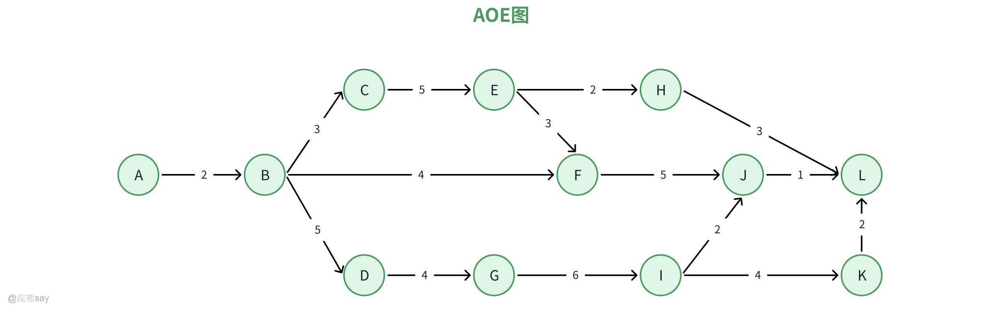
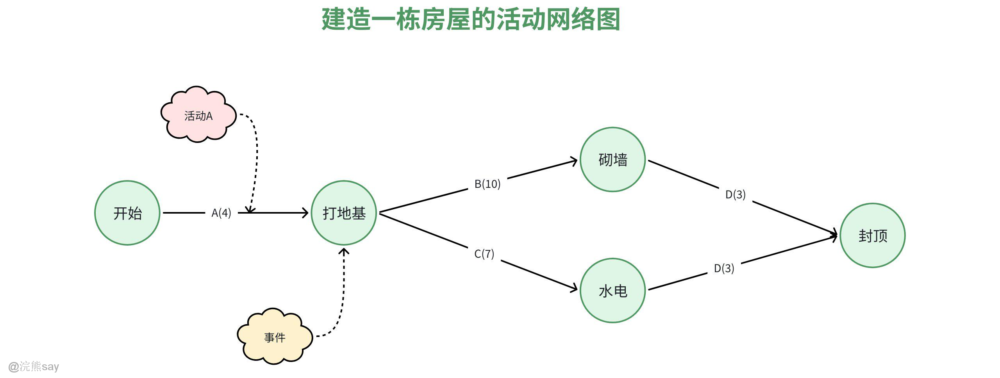
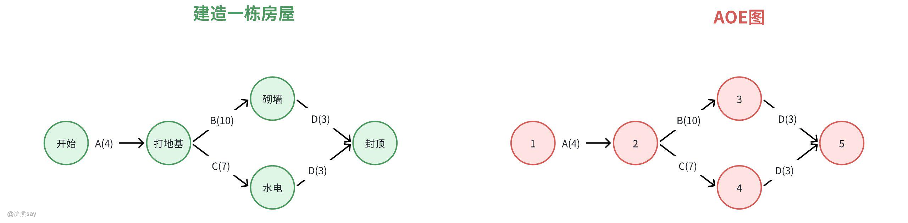
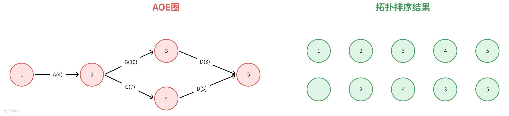
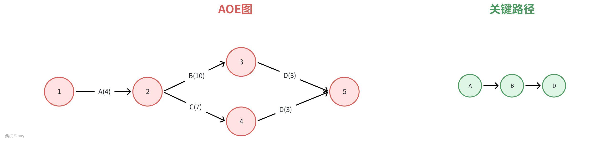
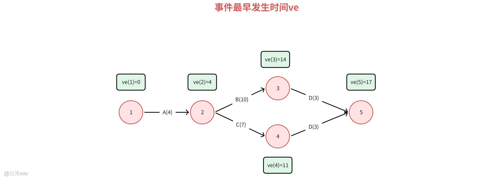
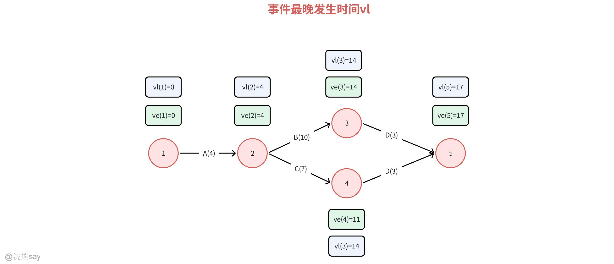
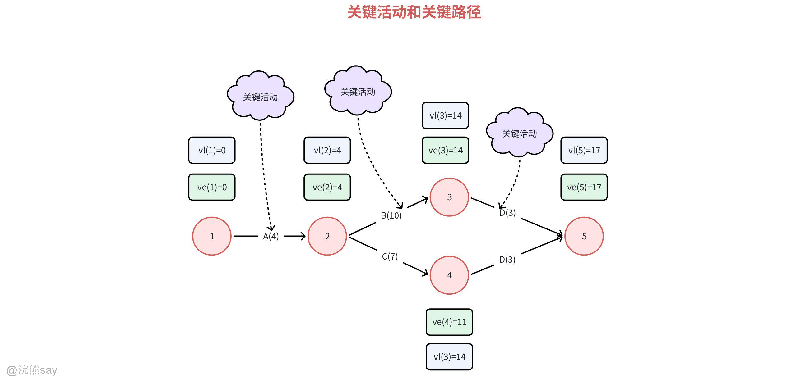

# 3、活动网络（AOE）

**活动网络（AOE）**

## 活动网络概念

## 活动网络的定义

活动网络是**项目管理、系统工程、流程优化**等领域的核心工具，本质是通过**有向图**可视化呈现活动之间的逻辑依赖关系、时间参数及资源约束，核心用于进度规划、关键路径识别、资源优化分配，典型应用包括项目管理中的关键路径法（CPM）、计划评审技术（PERT）等。

它通过有向图（如AOE网络，Activity On Edge）表示活动间的时序约束，其中**节点代表事件（如项目里程碑**），边代表活动（如具体任务），边上的权值表示活动持续时间。通过计算关键路径（Critical Path），可以确定项目最短完成时间和关键活动。

在软件项目中，活动图通常用于描述业务流程、用例实现或程序的执行流程。通过活动图，我们可以清晰地看到项目从开始到结束的整个过程，包括各个活动之间的顺序关系、并行关系以及条件分支等。这种图形化的表示方式不仅提高了项目流程的可读性，还有助于团队成员之间的沟通与协作。明确 “哪些活动必须先完成才能启动下一个”“整个流程的最短工期是多少”“哪些活动延迟会影响整体进度”。

## 活动网络的相关概念

### 活动网络相关术语

#### 活动（Activity）——带箭头的边

活动指的是项目中需要**消耗时间、资源**的具体任务单元，也是网络的基本组成部分，一般由带箭头的边组成，如上图示，带箭头的线段A就是一个活动，这个活动所需要的事件是4天，活动完成之后就完成了打地基这个事件。

#### 事件（Node）——节点

事件表示活动的**开始、结束或衔接点**，是网络图的 “连接点”，不同网络类型中，节点的含义完全不同，如上图所示，打地基、砌墙、水电、封顶都是建造房屋这个活动所必须的事件。

#### 紧前活动（Predecessor Activity）

紧前活动必须**先于某一活动完成**，才能启动该活动的前置任务，比如砌墙依赖于打地基这个事件的完成，那么活动A就是活动B的紧前活动。

#### 紧后活动（Successor Activity）

紧后活动是指某一活动**完成后才能启动**的后续任务，比如打地基完成之后，才能进行砌墙这个事件，那么活动B就是活动A的紧后活动。

#### 路径（Path）

从项目的**起始节点**到**终止节点**的一系列连续活动的集合，一个项目的活动网络中，通常存在多条路径。比如：

开始 - 打基地 - 砌墙 - 封顶，是一条路径；开始 - 打地基 - 水电 - 封顶是另外一条路径。

#### 关键路径（Critical Path）

关键路径是指活动网络中**总工期最长的路径**。它的核心特点是：**路径上的所有活动都没有弹性时间（时差为 0）**，任何一个活动的延迟都会直接导致**整个项目的工期延迟**。关键路径活动网络分析的核心目标 —— 找到关键路径，就能把项目管理的重点放在这些 “不可延迟” 的活动上。后续我们将详细介绍如何找一个活动网络的关键路径。

## 动网络示例

活动网络实际上就是用来描述各种活动和进度和前后依赖关系的方法，这里我们以一个简单的例子来介绍活动网络，假设要建造一栋房屋，活动网络可以描述如下：

1.  活动A：打地基（需5天）
2.  活动B：砌墙（需10天，依赖A完成）
3.  活动C：安装水电（需7天，依赖A完成）
4.  活动D：封顶（需3天，依赖B和C完成）

上图中每一个节点是一个事件，节点之间的带箭头的边是完成这项活动所需要的时间。其中有个非常重要的概念是——关键路径，关键路径上的任务能够按时完成，那么整个工程都能够按时完成，图中的关键路径为 A→B→D（总时长17天），若B延迟，整个项目将延期；而C有3天缓冲时间（非关键路径）。

## 拓扑排序（Topological Sorting）

拓扑排序是**有向无环图（DAG）** 的核心算法之一，本质是对 DAG 的顶点进行线性排序，使得对于图中任意一条有向边 u→v，顶点 u 在排序结果中始终位于顶点 v 之前。该算法是活动网络（如项目管理、任务调度）中 “依赖关系合规排序” 的核心支撑，与活动网络依赖关系（紧前 / 紧后活动）直接呼应，广泛应用于任务调度、编译依赖解析、工作流编排等场景。

### 常用实现算法（简单步骤）

#### Kahn 算法（入度法）

-   步骤 1：统计每个顶点的 “入度”（有多少条边指向它，代表 “前置依赖数”）。
-   步骤 2：把**入度为 0**的顶点加入队列（这些是 “没有前置任务” 的节点）。
-   步骤 3：从队列取顶点，加入排序序列；同时去掉该顶点的所有出边，更新对应顶点的入度。
-   步骤 4：重复步骤 2-3，直到队列空；若排序序列包含所有顶点，就是合法的拓扑排序。

#### 深度优先搜索（DFS）法

-   步骤 1：从任意未访问的顶点出发，递归遍历其所有后续顶点。
-   步骤 2：当一个顶点的所有后续顶点都遍历完毕，将它加入 “临时序列”。
-   步骤 3：遍历结束后，把临时序列**反向输出**，就是拓扑排序。

### 结合建房 AOE 图的示例

之前的建房图（节点 1 = 开始、2 = 打地基完成、3 = 砌墙完成、4 = 水电完成、5 = 封顶完成）是 DAG，它的拓扑排序可以是：

-   序列 1：1 → 2 → 3 → 4 → 5
-   序列 2：1 → 2 → 4 → 3 → 5

这两个序列都满足 “前置事件在前、后续事件在后” 的依赖规则，拓补排序相对来说是比较简单的。

## 关键路径

## 什么是关键路径？

**关键路径（Critical Path）** 是项目管理和图论中的核心概念，**指项目计划中耗时最长的路径**，决定了项目的最短完成时间。通俗来说，它是项目的“生命线”——路径上的任何活动延迟，都会直接导致整个项目延期。

**只要关键路径上的活动都完成了，其他路径上的活动也就完成了，因为耗时肯定比关键路径上的活动耗时小，此时才能说是完成了项目。**

**关键路径**：是从“起点事件”到“终点事件”的**最长路径**——因为项目必须等这条路径上的所有活动都完成才能结束，这条路径的总耗时就是项目的最短工期。

**关键活动：**关键路径上的活动——这些活动**没有缓冲时间**，一旦延迟，整个项目就会延期。

## 求解关键路径的步骤

-   起点：顶点1；终点：顶点5
-   活动：A(4)（1→2）、B(10)（2→3）、C(7)（2→4）、D(3)（3→5）、D(3)（4→5）

# 步骤1：计算事件的最早发生时间（ve）

从起点正向计算，取“入边路径的最大值”为事件的最早发生时间（事件需等前置活动都完成才能发生）：

-   （起点事件最早时间为0）

# 步骤2：计算事件的最迟发生时间（vl）

从终点逆向计算，取“出边路径的最小值”（事件不能延误，否则会拖后总工期）：

-   （终点事件最迟时间=最早时间）

# 步骤3：判断关键活动

活动的**最早开始时间（e）= 起点事件的ve**，**最迟开始时间（l）= 终点事件的vl - 活动持续时间**。

当 时，该活动是关键活动（延误则总工期延误）：

-   活动A（1→2）： → （关键活动）
-   活动B（2→3）： → （关键活动）
-   活动C（2→4）： → （非关键）
-   活动D（3→5）： → （关键活动）
-   活动D（4→5）： → （非关键）

# 步骤4：确定关键路径

由关键活动（A、B、D（3→5））组成的路径：（对应活动A→B→D），即图右侧的关键路径。

## 浣熊真题
| 【国家电网2016】拓扑排序是按 AOE 网中每个结点事件的最早发生时间对结点进行排序。A. 正确B. 错误答案 ：B解析 ：拓扑排序是对有向无环图(DAG)的顶点进行线性排序，使得对于图中任意一条有向边 u→v，顶点 u 在排序结果中始终位于顶点 v 之前。拓扑排序的顺序并不一定是按照 AOE 网中每个结点事件的最早发生时间排序。 |
| --- |

【央国企笔试真题】某软件项目的活动图如下图所示，其中顶点表示项目里程碑，连接顶点的边表示包含的活动，边上的数字表示活动的持续时间（天），则完成该项目的最少时间为\_\_\_\_\_\_天。活动BD最多可以晚开始\_\_\_\_\_\_\_\_\_天而不会影响整个项目的进度。

（1）A 15 B 21 C 22 D 24

（2）A 0 B 2 C 3 D 5

**（1）完成该项目的最少时间**

关键路径概念：在项目活动图中，关键路径是从开始顶点到结束顶点的最长路径，它决定了完成项目的最少时间 。因为关键路径上的活动一旦延迟，整个项目的完成时间就会延迟。

寻找关键路径：

-   计算各条路径的持续时间：
-   路径：天。
-   路径：天。
-   路径：天。
-   路径：天。

比较各路径持续时间，22天是最长的，所以关键路径是，完成该项目的最少时间为22天，答案选 C。

**（2）活动BD最多可以晚开始的天数**

总时差概念：活动的总时差是指在不影响整个项目完成时间（即不影响关键路径）的前提下，该活动可以延迟开始的最长时间。

计算BD总时差：

-   关键路径是 ，活动BD在关键路径上。
-   关键路径上的活动总时差为0，这意味着在不影响整个项目进度的情况下，活动BD最多可以晚开始0天，答案选 A。
