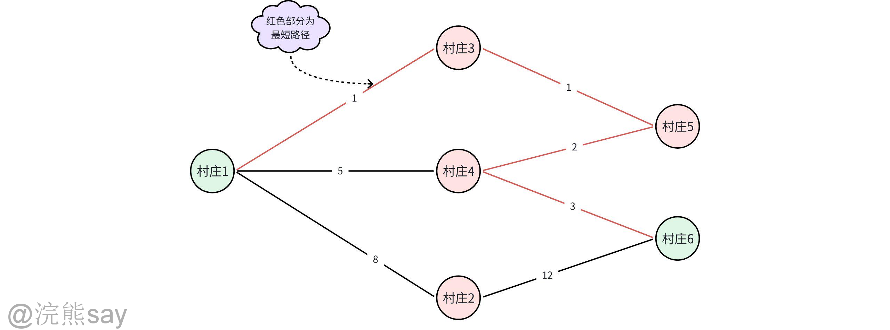
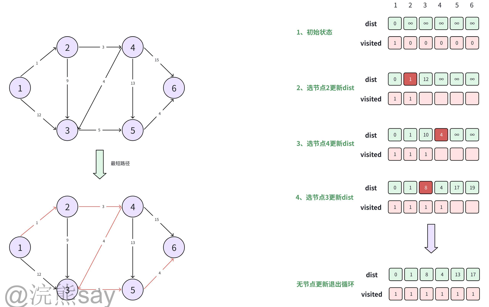
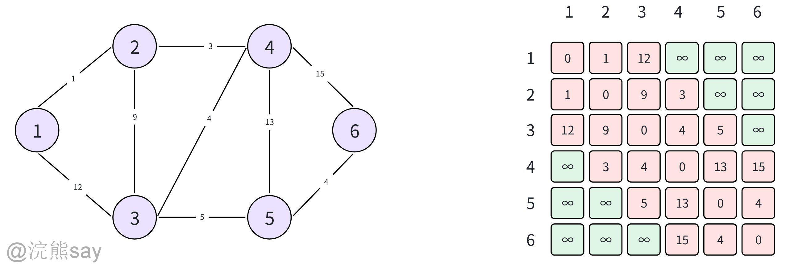
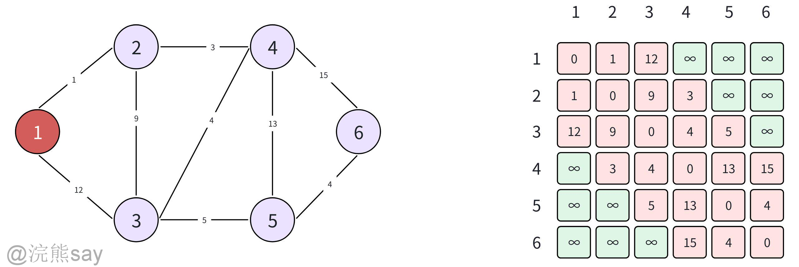
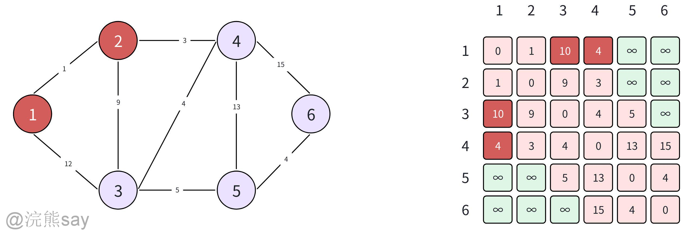
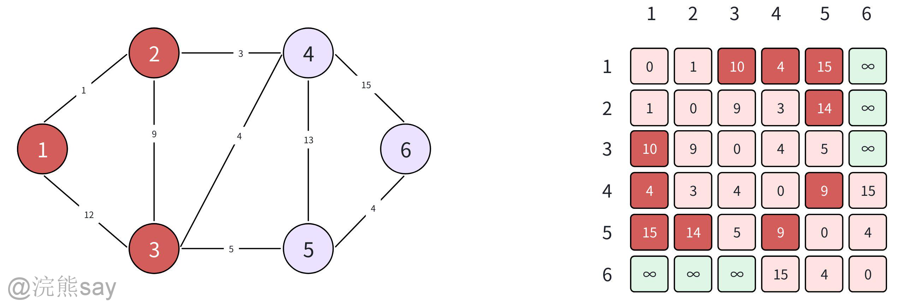
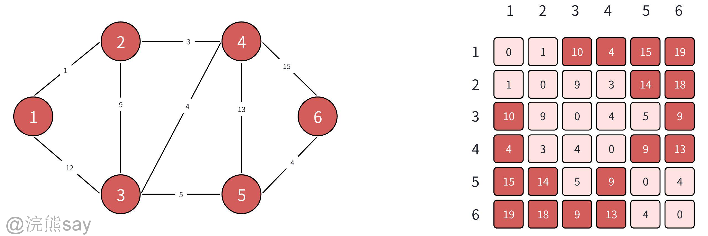
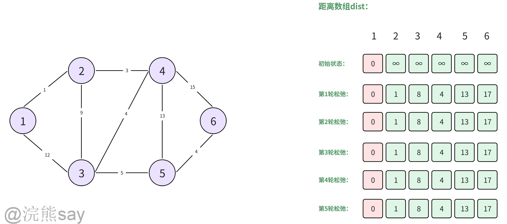

# 4、图的最短路径

**图的最短路径**

## 最短路径是什么？

图的**最短路径**是带权图的核心问题之一，其定义也非常简单，就是**求解两个顶点之间，**边的权值之和最小的路径，通俗一点儿解释就是我们从地点A走到地点B怎么走最近，类似于地图导航的路径规划实际上就是个最短路径的问题。

以上图为例，节点代表村庄，边代表两个村庄之间存在路径，边上的权重代表两个村庄之间所需要的时间。假设我们从村庄1到村庄6，怎么走才能使得所需要的时间最短？这个选择耗费时间最小的路径的问题就是图的最短路径问题。最短路径问题一般分为两类，即单源最短路径问题和多源最短路径问题：

1.  **单源最短路径**：给定一个起点，求它到图中所有其他顶点的最短路径。
2.  **多源最短路径**：求图中**任意两个顶点**之间的最短路径。

针对于这两类最短路径问题，现在主要有Dijkstra 算法（求解单源最短路径），Bellman-Ford 算法（允许负边权值）和Floyd-Warshall 算法（多源最短路径）等三种方法，后续给大家详细介绍这三种方法。

## Dijkstra算法（贪心思想）——单源最短路径

Dijkstra算法（Dijkstra's Algorithm）由荷兰计算机科学家Edsger W. Dijkstra于1956年提出，是一种用于**求解非负权值单源最短路径**的经典图论算法。它通过**贪心策略**逐步扩展路径，每次都找到离当离其它节点最短的路径，组合起来最终找到从起点到所有其他节点的最短距离。Dijkstra算法的适用场景需要满足以下三个条件：

1.  有向图或无向图
2.  边权非负（若存在负权边需使用Bellman-Ford算法）
3.  单源最短路径问题（如城市交通导航、物流路径规划）

从贪心的角度来理解Dijkstra算法就是每次贪婪的寻找离自己当前出发位置最近距离的节点，每步都确保是最近的，那么最终找到的路径自然是最短路径。

### Dijkstra算法原理

Dijkstra算法的核心原理是通过“**逐步确定最短路径、松弛更新距离**”的方式来求解最短路径，Dijkstra算法会贪婪的寻找离当前节点距离最短的下一个节点作为最短路径的一部分，然后再松弛更新距离，从局部最优到全局最优：

1.  **初始化**

-   给每个节点的“起点到该节点的距离（dist）”赋值：起点dist=0，其他节点dist=∞（表示暂未可达）。
-   用visited数组标记节点是否“已确定最短路径”，起点初始标记为“已访问”。

1.  **循环：选节点→松弛→标记**

重复以下步骤，直到所有节点都被标记为“已访问”：

-   **选节点**：从**未访问**的节点中，选dist最小的节点（称为“当前节点”）。
-   **松弛操作**：遍历当前节点的所有邻边，用“起点→当前节点的距离 + 邻边权值”，更新邻接节点的dist（若新距离比原dist小，则替换）。
-   **标记**：将当前节点标记为“已访问”（一旦标记，该节点的dist就是最终最短路径）。

### Dijkstra算法示例

-   **第1轮**：

选未访问的dist最小节点（节点2，dist=1）；

用节点2的边（到3权9、到4权3）更新：dist\[3\]=1+9=10（原12）、dist\[4\]=1+3=4（原∞）；

标记节点2为已访问。

-   **第2轮**：

选未访问的dist最小节点（节点4，dist=4）；

用节点4的边（到3权4、到5权13、到6权15）更新：dist\[3\]=4+4=8（原10）、dist\[5\]=4+13=17（原∞）、dist\[6\]=4+15=19（原∞）；

标记节点4为已访问。

-   **后续轮次**：

依次选节点3、5、6，重复“松弛→标记”，最终得到所有节点的最短dist：\[0,1,8,4,13,17\]（对应节点1-6）。

## Floyd-Warshall算法（动态规划）——负边权重

Floyd-Warshall 算法是一种**基于动态规划思想**的图算法，其核心用途是**求解图中所有顶点对之间的最短路径**（多源最短路径问题），它的显著特点是：

1.  能处理带负权边的图（边的权重可以为负数）；
2.  **无法处理包含负权环（又称负回路）的图**—— 因为负权环可以无限次绕行来缩短路径长度，不存在确定的最短路径；
3.  实现简单，核心仅需三重循环即可完成。

Floyd-Warshall 算法的时间复杂度 O (n³)，空间复杂度 O (n²)，实现简单但仅适用于小规模图，不适用于求规模较大的图。

## Floyd-Warshall算法原理

1.  **动态规划核心思想**

Floyd-Warshall 算法的核心是「中转节点优化」：对于任意两个顶点 i 和 j，尝试以图中每一个顶点 k 作为中间中转节点，判断是否能通过 i→k→j 的路径缩短 i 到 j 的直接路径长度，逐步更新得到所有顶点对的最短路径。

1.  **状态定义**

定义二维数组 dist\[i\]\[j\] 表示：从顶点 i 到顶点 j 的当前最短路径长度。

1.  **关键状态转移方程**

对于每一个中转节点 k，遍历所有顶点对 (i, j)，执行状态更新：
| Plain Textdist[i][j] = min(dist[i][j], dist[i][k] + dist[k][j]) |
| --- |

比较「i 直接到 j 的路径长度」和「i 经过 k 中转到 j 的路径长度」，取较小值作为新的 dist\[i\]\[j\]。始动态规划会使用三维数组 dist\[k\]\[i\]\[j\]（表示经过前 k 个节点中转时，i 到 j 的最短路径），但通过观察可以发现，每一轮更新仅依赖上一轮的结果，因此可以压缩为二维数组，直接在原数组上覆盖更新，大幅节省空间。

## Floyd-Warshall算法示例

1.  **第一步：初始化矩阵S**

1.  **第二步：以顶点1为中介点更新矩阵S**

遍历所有(i,j)，判断是否能通过i→1→j缩短路径，由于顶点 1 仅与顶点 2 、3有直接边，大部分路径无优化空间，由于任意i→1→j的路径，均不优于原始路径（例如 2→1→3 距离 1+12=13 > 原始 2→3 的 9），因此**矩阵无变化**。

1.  **以顶点2为中转节点更新矩阵S**

遍历所有(i,j)，判断是否能通过i→2→j缩短路径，这一步有明显优化，如下：

-   1→4：原始 INF → 1→2→4（1+3=4），更新为 4；
-   1→3：原始 12 → 1→2→3（1+9=10），更新为 10；
-   4→1：原始 INF → 4→2→1（3+1=4），更新为 4；
-   3→1：原始 12 → 3→2→1（9+1=10），更新为 10。

1.  **以 顶点 3为中转节点更新矩阵S**

遍历所有(i,j)，判断是否能通过i→3→j缩短路径，优化核心围绕顶点 3 的邻接节点（2、4、5），具体如下：

-   1→5：原始 INF → 1→3→5（10+5=15），更新为 15；
-   2→5：原始 INF → 2→3→5（9+5=14），更新为 14；
-   4→5：原始 13 → 4→3→5（4+5=9），更新为 9；
-   5→1：原始 INF → 5→3→1（5+10=15），更新为 15；
-   5→2：原始 INF → 5→3→2（5+9=14），更新为 14；
-   5→4：原始 13 → 5→3→4（5+4=9），更新为 9。

1.  **后续步骤以此类推，经过所有中转节点更新后，得到的所有顶点对最短路径距离矩阵如下**

## Bellman-Ford算法（动态规划）

Bellman-Ford 算法是**基于动态规划思想**的单源最短路径算法，核心优势是能处理含负权边的图，且可检测负权回路。而Dijkstra算法同样作为单源最短路径算法，无法处理含有负边权重的值，这是Ford算法相较于Dijkstra算法最大的区别。

## Bellman-Ford算法原理

假设给定带权有向图 和源点 ，求 到所有其他顶点的最短路径长度。Ford算法的本质是将 “单源最短路径” 分解为子问题，通过迭代更新最优解，利用 “最优子结构” 和 “重叠子问题” 特性优化计算。

### 状态转移方程

设 表示**经过最多 条边**从源点 到顶点 的最短路径长度。限制 “最多 条边” 的原因是因为最短路径（无负权回路时）最多包含 条边（），否则会出现环路（非负环路可移除，负环路无最优解）。对于每条边 （权重为 ），状态转移满足:

到 且最多 条边的最短路径，要么是 “不经过边 的原有路径”（），要么是 “经过边 的路径”（先到 且最多 条边，再加上边权重 ）。

### 算法完整步骤

由于我们通常使用Ford算法求解的是单源的最短路径，因此上面状态转移方程中的二维数组可以使用一维距离数组代替，假设起始节点为，那么代表的就是的最短距离，在此基础上算法的完成步骤如下:

1.  **初始化**：创建距离数组 （替代二维 ，优化空间），，其余 。
2.  **迭代更新（n-1 次）**：

-   遍历所有边 ，若 ，则更新 。
-   原理：经过 n-1 次迭代后， 已收敛为源点到 的最短路径长度（无负权回路时）。

1.  **负权回路检测**：

-   再遍历所有边，若仍存在 ，则图中存在**可达负权回路**（从源点可到达该回路，最短路径无界）。

### 算法复杂度

**时间复杂度：**（，），外层循环 n-1 次，内层循环遍历所有 m 条边。

**空间复杂度：**（用一维数组 替代二维 DP 表，优化后无需存储所有 k 的状态）。

## Bellman-Ford算法示例

如上图使用 Bellman-Ford 算法求解，需先明确**源点**（默认选顶点 1）、顶点集、边集（无向图边为双向），再执行松弛操作：

# 步骤1：初始化

顶点集 ，源点 。

初始化距离数组，

 次松弛操作

每次遍历所有边，更新距离（仅展示关键变化轮次）：

# 第1轮松弛：

第1轮后：

# 第2-5轮松弛：

后续轮次遍历所有边，距离不再变化（权重均为正，无更优路径）。

# 步骤3：检查负权环

图中所有边权重为正，**无负权环**，结果有效。

## 浣熊真题
| 【央国企笔试真题】以下哪种算法无法处理负权边？A.Floyd-Warshall；B.Dijkstra；C.Bellman-Ford；D.SPFA；答案：B；解析：Dijkstra 依赖贪心选择当前最短路径，负权边会导致已确定的最短路径被后续更短路径推翻 |
| --- |

| 【国家电网2013】Dijkstra 算法适用于以下哪种场景？A.所有边权均为负数的图；B.单源最短路径问题；C.多源最短路径问题；D.无向图但边权可能为负；答案：B；解析：Dijkstra 用于计算从一个起点到所有其他顶点的最短路径，要求边权非负 |
| --- |

| 【国家电网2021】关于 Dijkstra 算法的时间复杂度，正确的是？A.O(V²)（邻接矩阵实现）；B.O(E log V)（邻接表+优先队列）；C.O(V³)（Floyd-Warshall 对比）；D.以上都正确；答案：D；解析：邻接矩阵实现为 O(V²)，邻接表+优先队列优化为 O((V+E)log V) |
| --- |
