# 12、并行处理系统

**并行处理系统**

## 并行处理系统

并行处理系统是一类通过同步执行多个计算任务提升处理效能的计算机系统，其核心思想是 “分而治之”—— 将复杂问题拆解为多个独立子任务，由多个处理单元并行推进执行，进而显著缩短整体计算周期。该系统广泛应用于科学计算、大数据处理、人工智能等对计算强度要求较高的领域。

## 弗林分类

### 弗林（Flynn）分类法

弗林分类法（Flynn's Taxonomy）由计算机科学家迈克尔・弗林（Michael J. Flynn）于 1966 年提出，是计算机体系结构领域的经典分类框架。其核心逻辑是依据**指令流（Instruction Stream）** 与**数据流（Data Stream）** 的数量维度，对计算机系统的并行架构进行归类，为理解不同系统的并行特性提供了简洁直观的分析视角，至今仍被广泛引用。

1.  指令流：计算机执行的指令序列（即程序的具体执行步骤）；
2.  数据流：指令所操作的数据集合（含输入数据、中间计算结果、输出数据）。

基于 “单条” 或 “多条” 的数量划分，弗林分类法将并行系统明确为四类：SISD 系统、SIMD 系统、MISD 系统及 MIMD 系统。

### SISD体系结构

SISD（Single Instruction Stream, Single Data Stream，单指令流单数据流）是早期单处理器计算机的典型架构，系统仅含一个处理单元，每次仅执行一条指令并操作一组数据，指令与数据均按串行方式处理，无实质并行性，核心特点如下：

1.  处理器可串行执行指令，或通过指令流水线的时间重叠实现基础指令并行；超标量处理器则借助多条指令流水线，进一步提升指令并行度；
2.  从存储器中按单一指令流读取指令，按单一数据流获取操作数并写回计算结果；
3.  系统由控制单元（CU）、处理单元（PU）、存储单元（MU）构成，指令流（IS）与数据流（DS）在各单元间有序传递（对应图 1 SISD 体系结构）。

作为最基础的计算模式，SISD 所有操作严格按顺序执行，适用于简单任务处理，但无法满足大规模并行计算需求。

### SIMD体系结构

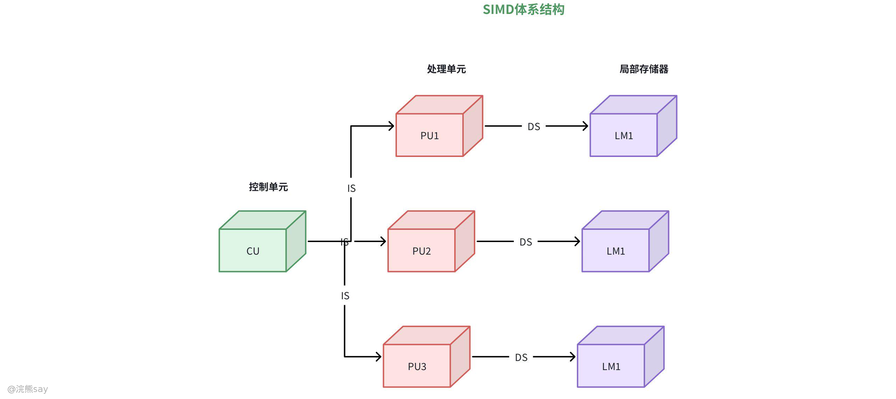

SIMD（Single Instruction Multiple Data，单指令多数据流）是一类高效的并行计算体系结构，核心设计思想是通过一条统一指令，同步对多个数据元素执行相同运算，从而大幅提升数据处理效率。该架构在处理海量同类数据时优势显著，是现代处理器提升并行性能的核心技术之一。

1.  由一个统一控制器发送指令，驱动多个处理单元（PE，Processing Element）同步工作，每个处理单元独立处理不同的数据元素；
2.  系统架构包含一个主控制器与多个处理单元，各处理单元通过共享内存或高速总线实现数据交互；
3.  数据通常以向量（Vector）形式组织存储，便于批量并行处理。

SIMD 广泛应用于图像 / 视频处理（如批量像素滤波、色彩调整）、科学计算（如大规模矩阵乘法、向量运算）、深度学习中的卷积操作等场景，日常使用的 GPU（图形处理器）正是基于 SIMD 体系结构实现高效数据并发处理的典型。

### MISD体系结构

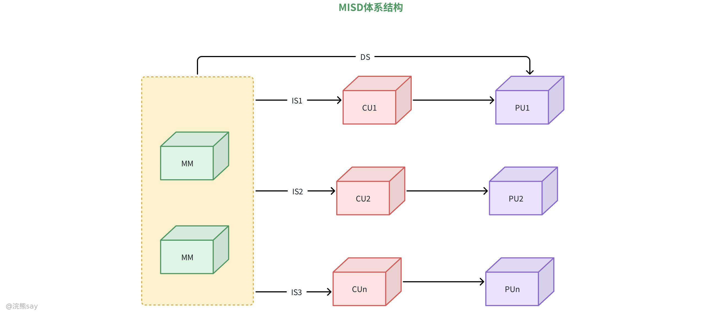

MISD（Multiple Instruction Streams, Single Data Stream，多指令流单数据流）是并行计算领域中偏向理论研究的体系结构，核心思想是多个处理单元对同一组数据执行不同指令，最终汇总各单元处理结果输出。

1.  多个控制器（或独立处理单元）各自接收不同指令流，协同对同一数据源进行差异化处理；
2.  数据流向为：单一数据源 → 多个处理单元（执行不同指令）→ 结果汇总输出。

与 SIMD（单指令多数据流）和 MIMD（多指令多数据流）相比，MISD 在实际工程应用中较为少见，更多停留在学术研究阶段，但其 “多指令协同处理单一数据” 的设计理念，为异构计算、数据流处理等领域提供了重要参考方向。

### MIMD系统结构

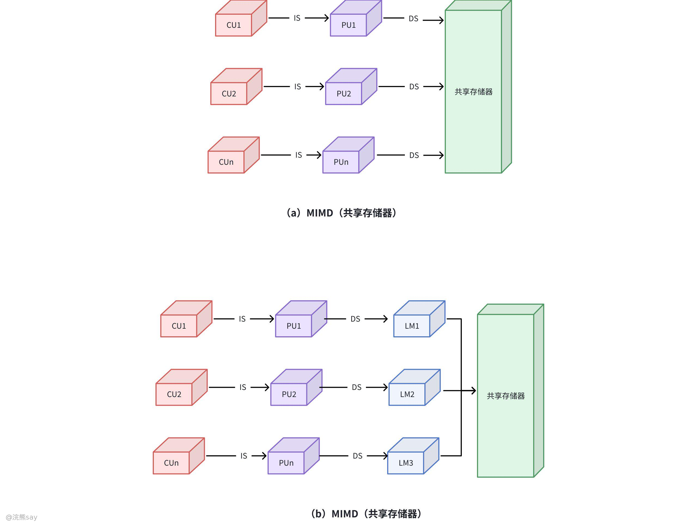

MIMD（Multiple Instruction Streams, Multiple Data Streams，多指令流多数据流）是现代并行计算领域最主流的体系结构，核心特征是多个处理单元可同时执行不同指令，并独立处理不同数据流。

1.  系统包含多个处理单元，且每个处理单元均配备专属控制单元，各处理单元可独立接收指令、操作数据流；
2.  绝大多数现代并行计算机均属于此类架构；
3.  多处理机系统、多计算机系统是 MIMD 架构的典型实现形式。

相较于 SIMD 的 “同指令异数据” 和 MISD 的 “异指令同数据”，MIMD 具有更强的灵活性与通用性，广泛应用于多核 CPU、集群计算、超级计算机等各类并行处理场景。

## 提高并行性途径

并行性指在同一时刻或同一时间间隔内，完成两种及以上性质相同或不同的任务 —— 只要任务执行时间存在相互重叠，即构成并行性。例如多任务操作系统中，后台文件下载（任务 A）与前台网页浏览（任务 B）虽未必同时启停，但在 “下载 + 浏览” 的时间区间内，二者执行过程相互重叠，这便是并行性的直观体现。

1.  **两层核心含义：**

-   **同时性：**多个事件在同一时刻实际发生（如多核 CPU 中，不同核心同一瞬间各自运算）。
-   **并发性：**多个事件在同一时间间隔内交替发生（如单核 CPU 通过时间分片，让多个程序看似 “同时” 运行 ）。
-   简单说，“同时性” 是物理上的真并行，“并发性” 是逻辑上的并行，二者共同构成并行性的完整概念。

1.  **时间重叠**：在并行性概念中引入时间因素，让多个处理过程在时间上错开、交叉轮流使用同一套硬件设备的各个部分，加快硬件使用周转以提升处理速度。典型例子为流水技术，借由时间维度的交错，实现硬件资源在不同任务阶段的复用 。
2.  **资源重复**：在并行性概念里引入空间因素，通过重复设置资源（尤其是硬件资源）提升系统性能。像阵列处理机，依靠空间维度的硬件冗余，让多个任务可并行执行，直接增加系统吞吐量 。
3.  **时间重叠 + 资源重复**：同时运用时间并行（时间重叠）与空间并行（资源重复）技术，在计算机系统中应用广泛，是并行性主流技术。例如现代多核 CPU，每个核心内部以流水技术实现时间重叠，多个核心并行构成资源重复，兼顾效率与吞吐量 。
4.  **资源共享**：利用软件方法让多个任务按一定顺序轮流使用一套资源，通过提升系统资源利用率来增强性能和效率。多道程序分时系统、计算机网络及分布处理系统等都是典型例子，借助软件调度优化资源分配，无需新增硬件即可提升整体效能 。

## 并行处理机结构

并行处理机结构通过从不同层级挖掘并行潜力，适配多样化并行计算需求。其核心设计逻辑是按 “指令→任务 / 作业→线程→芯片” 的层级递进，结合硬件架构优化与软件调度协同，最大化系统并行处理能力。

### 指令级并行：超标量与超长指令字

指令级并行（Instruction-Level Parallelism, ILP）的核心是在单个处理核心内部挖掘指令间的潜在并行性，通过同步执行多条独立指令提升处理效率，属于 “细粒度并行” 的典型实现形式。

1.  **超标量处理机（Superscalar Processor）**：在处理机内部部署多条独立的并行指令流水线，每个时钟周期可向执行单元发射多条无依赖关系的指令，通过多指令发射技术实现指令级并行。该架构的核心创新是将空间并行性融入处理机设计（此前流水线技术已率先实现时间并行性），无需编译器特殊优化即可动态挖掘指令并行潜力，是现代 CPU 的主流基础架构之一。
2.  **超长指令字（VLIW, Very Long Instruction Word）处理机**：由编译器在编译阶段主动挖掘指令间的并行性，将多个可同步执行的操作（如算术运算、存储访问）打包成一条超长指令，驱动处理机的多个独立功能部件协同工作，等效于同步执行多条指令，从而显著提升指令级并行度。其优势在于将并行性挖掘压力转移至编译器，简化硬件控制逻辑，但对编译器的优化能力要求较高。

### 任务/作业级并行：多处理机与多计算机

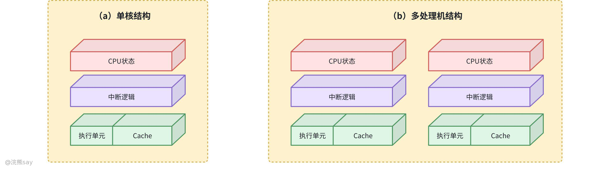

任务 / 作业级并行属于 “粗粒度并行”，核心是将复杂任务拆解为多个独立作业或子任务，由多个处理单元分布式执行，通过协同调度完成整体计算目标，适用于大规模复杂问题处理。

1.  **多处理机系统**：由多台独立处理机构成，每台可独立执行程序、指令流，通过专用网络通信、交换数据，协同完成大任务；各处理机由操作系统管理，实现作业/任务级并行，共享公共内存（或部分共享 ）。
2.  **多计算机系统**：多处理机系统的特殊形式，处理机不共享公共内存，靠消息传递通信；每个系统有私有内存，集群系统是典型代表，适合大规模分布式并行计算。

### 线程级并行：多线程处理机

线程级并行（Thread-Level Parallelism, TLP）的核心是从线程维度挖掘并行潜力，通过硬件层面支持多线程并发执行，提升处理机资源利用率。

多线程处理机支持 CPU 同步运行多个硬件线程（Hardware Thread），当某个线程因等待资源（如 I/O 操作、缓存未命中）暂停执行时，其他线程可无缝接续占用硬件资源（如执行单元、高速缓存 Cache 等），确保硬件资源始终处于高效利用状态。其本质是通过线程切换掩盖单线程执行中的延迟，从逻辑层面提升处理机的并发处理能力，广泛应用于多任务处理场景（如服务器并发请求处理、桌面端多程序运行）。

### 片上多核并行：多核处理机

片上多核并行是现代并行处理的核心架构形式，将 “资源重复” 与 “层级并行” 深度融合，兼顾并行性能与硬件集成效率。

多核处理机（Multi-Core Processor）是一种高度集成的多处理机架构，将多个独立处理核心（Processing Core）集成在同一块芯片上。各处理核心既可独立执行任务，也可通过协同调度完成复杂计算，同时共享片上部分关键资源（如多级高速缓存 Cache、内存控制器、总线接口等）。这种架构的优势在于：一方面，单个核心可通过流水线技术实现指令级并行；另一方面，多个核心可支持任务级、线程级并行，形成多维度并行能力。其兼顾了并行计算性能与硬件集成度，是现代 CPU、嵌入式处理器的主流架构，能够灵活适配从桌面计算到高性能计算的各类应用场景。

## 浣熊真题
| 【国家电网2018】从计算机执行程序的并行性看，由低到高的并行性等级可分为四级（）。A.指令内部B.指令之间C.任务或进程间D.作业或程序间答案：ABCD解析：并行性等级从低到高为指令内部（微操作级）、指令之间、任务或进程间、作业或程序间 |
| --- |

| 【国家电网2016】提高计算机系统并行性的主要技术途径有（）。A.时间重叠B.时间重复C.资源重复D.资源共享答案：ACD解析：提高并行性的途径包括时间重叠（如流水线）、资源重复（如多处理器）、资源共享（如多道程序），时间重复不是有效途径 |
| --- |

## 多处理机

多处理机技术是**计算机并行处理体系**的核心技术之一，指通过构建**多处理机系统**，将**多个物理上相互独立的处理机（Processor）** 整合在同一套硬件系统中，在统一的操作系统和任务调度机制协调下，**协同执行单一或多个任务**，从而突破单处理机的性能瓶颈，提升系统的整体处理能力、吞吐量、可靠性和扩展性的技术体系。

## 多处理机类型

多处理机是并行处理系统的核心实现形式之一，通过多台独立处理机协同工作，突破单处理机的性能瓶颈，多处理机按架构设计、资源共享方式及互联逻辑，可划分为五大典型类型，各类均有明确的应用场景与技术特征：

1.  **并行向量处理机（PVP）**

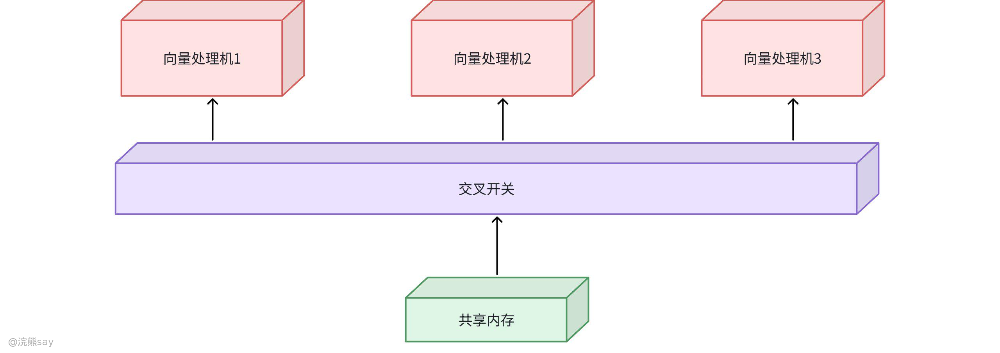

PVP 是面向尖端大规模数值计算的定制化高端架构，以少量高性能向量处理器为核心，搭配专用互联与存储设计。（1）PVP 系统包含数量较少但功能强大的定制向量处理器（VP），配备定制化高带宽纵横交叉开关与高速数据访问模块，保障向量运算的高效推进；

（2）由少数几台巨型向量处理机通过共享存储器方式互连构建，核心聚焦向量类复杂计算任务；

（3）对程序编制的专业性要求高，硬件成本昂贵且系统管理难度大。

因技术门槛与成本限制，PVP 主要应用于大型国家关键部门（如航天航空模拟、气象预测），适配对计算精度与速度要求极高的尖端场景。

1.  **对称多处理机（SMP）**

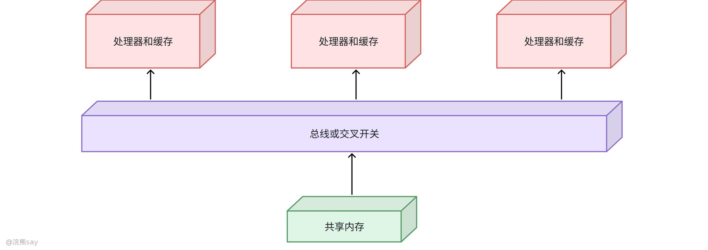

SMP 是最经典的共享存储多处理机架构，以 “处理机对等、访存均匀” 为核心设计原则。

（1）由一组处理机与一组存储器模块通过互联网络连接组成，所有处理机性能完全一致，架构呈现对称特性；（2）所有处理器可平等访问内存、I/O 设备及外部中断，无访问权限差异；

（3）每次存储器访问时，数据集中于单一存储器模块，访问任意存储单元的延迟时间保持一致。

SMP 架构设计简洁、数据交互效率高，广泛应用于中小型服务器、桌面级多核计算设备，适配多任务并发处理场景。。

1.  **分布共享存储多处理机（DSM）**

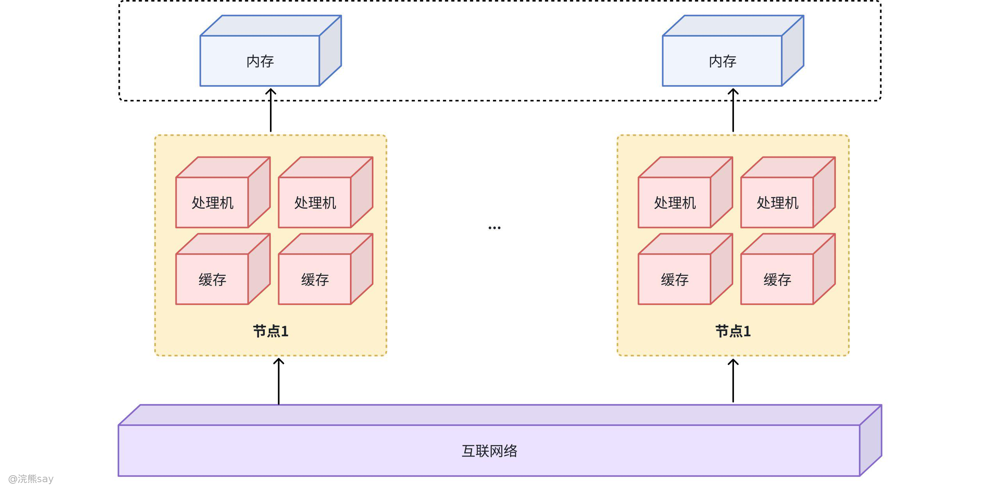

DSM 融合 “分布存储” 与 “共享逻辑地址” 优势，平衡扩展性与数据访问灵活性。

（1）共享存储器物理分布在各台处理机中，每台处理机配备专属本地存储器，所有分布式存储器统一编址，在逻辑上构成单一共享存储空间；

（2）各存储器单元通过互联网络互联互通，处理机既可以快速访问本地存储器，也能直接访问其他处理机的 “远程存储器”；

（3）处理机访问本地存储器的延迟远低于访问远程存储器，呈现 “本地优先” 的访存特性。

DSM 兼顾共享存储的易用性与分布存储的扩展性，适用于中大规模并行计算场景，尤其适配对数据共享需求较高且需灵活扩展的任务。

1.  **大规模并行处理机（MPP）**

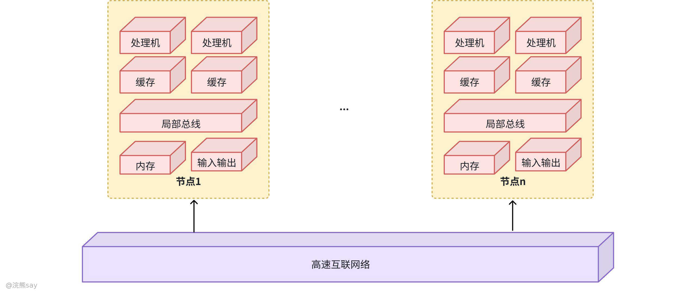

MPP 是松耦合架构的典型代表，以 “分布式节点 + 消息传递” 为核心，侧重大规模并行扩展能力。

（1）属于松耦合多处理机系统，每个独立计算单元称为一个结点，结点内部集成处理机、局部存储器、结点接口，部分结点还配备专属 I/O 设备，通过结点内总线连接为一体；

（2）各计算机模块通过结点接口接入互联网络，结点可高度集成（甚至封装为单一芯片）；

（3）普遍采用分布存储结构，结点间通过消息传递方式协调工作，避免共享存储的访存竞争。

MPP 架构扩展性极强，可通过增加结点数量提升计算能力，适用于超大规模科学计算、分布式大数据处理等需要海量并行节点的场景。

1.  **集群（cluster）**

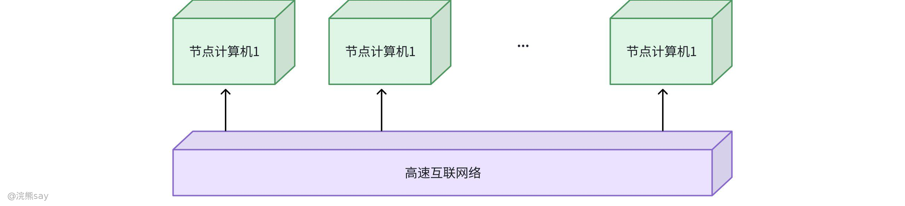

集群是基于通用硬件的低成本并行架构，通过高速网络互联实现 “单一系统模式” 管理。

（1）由一组相互独立的计算机通过高速网络互联组成，整体以单一系统模式进行管理，具备统一的对外接口；

（2）客户与集群交互时，集群呈现为独立服务器的形态，屏蔽内部节点的分布式特性；

（3）集群配置可通过冗余设计提升系统可用性，通过增加节点数量实现性能可伸缩。

集群兼顾低成本与高扩展性，广泛应用于互联网服务器集群、分布式计算平台、企业级数据中心等场景，是性价比最高的并行处理方案之一。

## 阵列处理机

1.  **阵列处理机概念**

这类计算机采用资源重复方法引入空间因素，即在系统中设置多个相同的处理单元来开发并行性。此外，它是利用并行性中的同时性，所有处理单元必须同时进行相同操作。

1.  **设计阵列处理机基本思想**

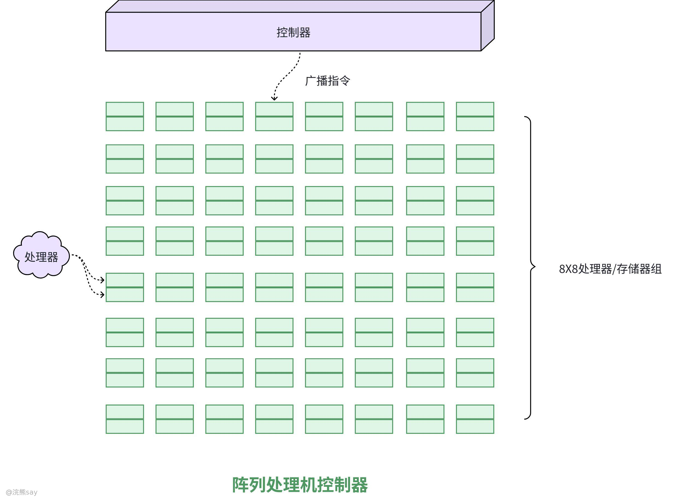

阵列处理机的设计核心是通过单一控制单元实现多处理单元的协同调度，具体逻辑如下：控制单元统一提供驱动信号，驱动所有处理单元同时运行；每个处理单元均由 CPU 或功能增强的 ALU 与本地内存构成，且因共享同一控制单元，所有处理单元的执行过程严格同步。这种设计既保证了并行运算的一致性，又简化了控制逻辑，是阵列处理机实现并行性的关键。

1.  **各种阵列处理机的区别**

不同阵列处理机的差异主要体现在三个核心维度，这些差异直接决定了其适用场景：

（1）处理单元的结构:处理单元的结构可能很简单，也可能很复杂

（2）处理单元连接:网格是比较常用的结构。

（3）处理单元自治能力:每个处理单元都可以选择执行或不执行某条指令

这些差异使得阵列处理机能够根据不同并行任务需求调整配置，但其核心的同步执行逻辑保持一致。

1.  **阵列处理机的缺点**

尽管阵列处理机在并行运算理念上有独特性，但市场表现和技术前景并不乐观：目前尚无厂商的阵列处理机产品取得显著市场成功，从并行计算机体系结构来看，其设计理念难以适配复杂多样的实际应用场景，缺乏持续优化的技术空间，整体发展前景受限。

## 向量处理机

向量处理机是面向大规模数值计算场景设计的高性能计算机系统，其核心特征是通过**向量指令集**实现批量数据的并行处理，以**流水线技术**为核心支撑，能够高效解决矩阵运算、科学计算、工程仿真等密集型数值问题，是高性能计算（HPC）领域的关键设备之一。

### 标量和向量

标量与向量是向量处理机的核心数据表示形式，二者构成了向量运算的基础：

（1）标量:是指单个变量。

（2）向量:是指一组标量。

例如，有一个数组 A=（a1,a2, a3,…,an），其中括号内的每一个元素 ai就是一个标量而 A则称为向量，它由一组标量组成。这种数据表示的区分，直接决定了向量处理机的指令设计和运算逻辑，为后续高效向量计算奠定了基础。

### 向量计算

向量计算是向量处理机的核心运算模式，其本质是通过单条指令实现对一组数据的并行操作，关键特征如下：（1）单条向量指令可一次性处理 N 个（或 N 对）同类型操作数（即向量的全部元素），这种 “指令级并行 - 数据级并行” 结合的模式称为向量处理。

（2）向量指令的处理效率显著高于标量指令，核心原因是：① 减少指令流开销（无需循环控制指令、地址重复计算）；② 流水线充分重叠（不同元素的运算阶段并行执行）；③ 存储访问批量优化（连续地址访问降低存储延迟）。

（3）典型示例：计算线性组合 Z=a×X+Y（其中 a 为标量， 为长度为 n 的向量，初始数据存储于主存）

**标量处理机实现**：本质是串行循环执行，需通过循环控制指令遍历每个元素，单次仅处理一个数据对，指令开销占比高：
| Plain Text代码块for （i= 0; i<n; i++ ）Z[i] = A* X[i] + Y[i]; |
| --- |

**向量处理机实现**：单条向量指令完成全部元素运算，指令开销大幅降低，使用向量指令计算一条向量指令可以一次完成x或Y向量中所有元素的处理，

### 标量处理机和向量处理机

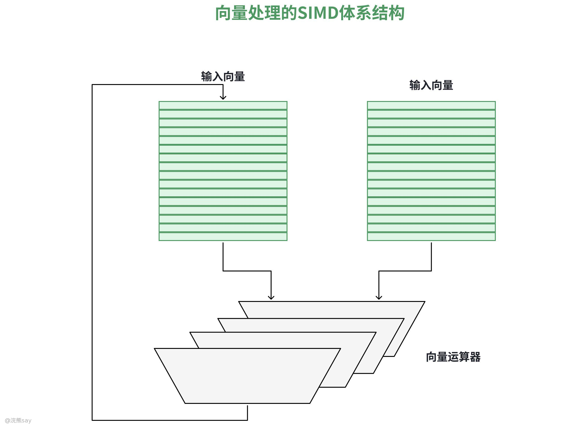

标量处理机是流水线处理机的基础类型，其核心特征是仅支持标量数据（单个数值、字符等独立数据单元）的处理，不具备向量数据表示能力及配套的向量指令集。这类处理机的工作模式以单个标量数据为操作对象，通过流水线技术优化单条指令的执行效率，适用于普通事务处理、简单数值计算、日常办公等对并行计算需求较低的场景，是计算机体系中应用最广泛的基础处理单元之一。

向量处理机则是为满足高性能数值计算需求设计的专用处理机，其核心优势在于能够对向量数据（一组有序的同类数据元素集合）进行并行化操作。向量处理机以流水线式算术逻辑单元（ALU）为核心架构，通过时间重叠技术实现向量中多个元素的并行计算 —— 即单条向量指令可驱动流水线的不同阶段同时处理向量的不同元素，大幅减少指令执行的总开销。为支撑这一能力，向量处理机不仅配备了专门的向量数据存储格式和完整的向量指令集，还通常采用多条并行工作的流水线设计，进一步提升数据吞吐量。需要注意的是，向量处理机的性能优势需建立在问题的向量化转化基础上，只有将复杂数值计算任务拆解为批量的向量运算（如矩阵乘法、数组运算等），才能充分发挥其并行处理潜力。在实现形态上，向量处理机既包括原生支持向量运算的大型机、巨型机（主要用于气象预测、航空航天仿真、量子计算等尖端数值计算场景），也存在 “微型计算机 + 向量协处理器” 的轻量化方案，通过协处理器扩展普通微机的向量处理能力，兼顾灵活性与性价比。

### 向量处理机的结构

向量处理机的硬件结构主要分为存储器 - 存储器结构与寄存器 - 寄存器结构两类，核心差异集中在数据存储与传输路径的设计上。

存储器 - 存储器结构的核心特点是运算部件直接与主存储器进行数据交互，其架构设计围绕 “高访存带宽” 展开：系统配置多个独立的存储器模块，通过多存储体交叉访问与并行访问机制，突破单个存储模块的带宽限制，为多个高速流水线运算部件提供持续、高效的数据流支持。由于运算过程中数据需频繁在存储器与运算部件之间传输，这类结构对存储系统的访问速度要求极高，通常用于对数据吞吐量要求苛刻的大型向量处理机，其设计难点在于平衡存储带宽与运算部件的处理能力，避免出现 “运算部件等待数据” 的瓶颈。

寄存器 - 寄存器结构则对上述架构进行了优化，核心改进是引入向量寄存器作为数据缓冲与传输的核心载体：运算过程不再直接依赖主存储器，而是先将所需向量数据从主存加载至向量寄存器，运算部件仅与向量寄存器进行数据交互，运算结果也暂存于向量寄存器中，最终按需写回主存。这一设计大幅降低了对主存储系统访问速度的依赖，通过向量寄存器的高速数据传输能力提升整体运算效率，同时简化了存储系统的设计复杂度。相比存储器 - 存储器结构，寄存器 - 寄存器结构的向量处理机在灵活性和能效比上更具优势，是目前主流向量处理机的首选架构。

## 多处理机访存模式

多处理机系统的访存模式直接决定了处理器与内存之间的交互效率、系统扩展性及适用场景，主流模式包括均匀内存访问结构（UMA）、非均匀内存访问结构（NUMA）、全缓存内存访问结构（COMA）及非远程内存访问结构（NORMA）四类。

1.  **均匀内存访问结构（UMA）**

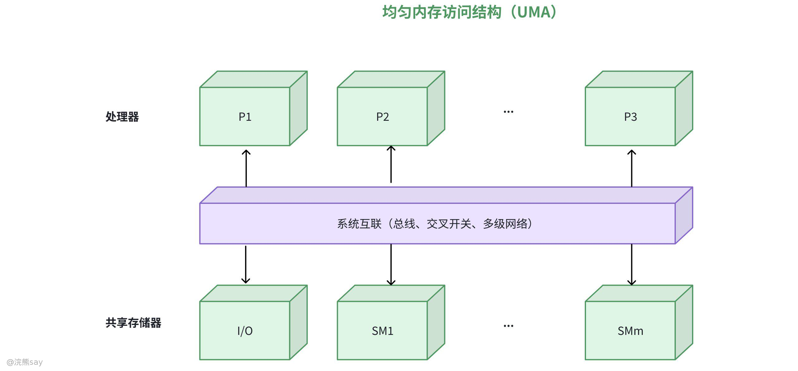

UMA 是结构最简单的多处理机访存模式，其核心特征是所有处理器通过一条共享总线访问全局共享的物理存储器。在该模式下，所有节点采用统一的访存接口和寻址方式，访问系统中任意存储单元的延迟的一致性，且发生访存竞争时，仲裁机制会平等对待每个节点，确保各处理器获得均等的总线访问机会。为降低总线负载并提升局部访存效率，各节点的 CPU 通常会配备局部私有高速缓存（Cache），同时外围 I/O 设备也支持全局共享，且各节点拥有平等的访问权限。UMA 的优势在于设计简洁、实现成本低，无需复杂的内存管理和调度机制，适用于处理器数量或执行核较少的场景（如桌面多核处理器、小型服务器）；但局限性也十分明显 —— 共享总线的带宽是系统扩展的核心瓶颈，处理器数量增多后会导致严重的总线冲突，且无法针对特定程序的局部性特征进行访存优化，难以满足大规模并行计算的需求。

1.  **非均匀内存访间结构（NUMA）**

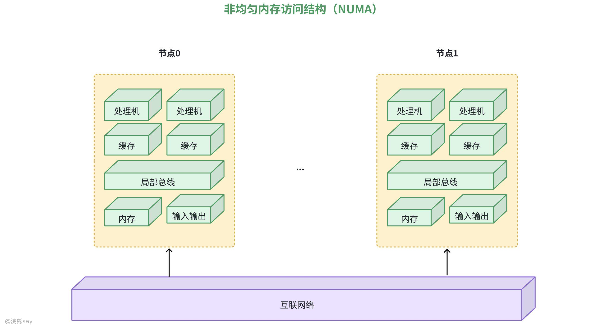

NUMA 是为解决 UMA 扩展性问题而设计的访存模式，其核心设计是 “本地内存 + 全局共享”：每个处理器节点都配备专属的本地内存，同时所有节点的物理存储器构成全局共享地址空间，任意节点可直接访问其他节点的本地内存（即远端内存）。与 UMA 的核心区别在于访存延迟的非均匀性 —— 访问本地内存的速度通常是访问远端内存的 3 倍以上，因此系统性能高度依赖任务调度策略，需将程序及所需数据尽可能调度至靠近本地内存的执行核，以最大化访存效率。在资源共享方面，各节点 CPU 可配备私有 Cache，外围 I/O 设备支持全局共享，但由于硬件拓扑的差异，不同节点对 I/O 设备的访问效率可能存在差异；发生访存竞争时，仲裁机制可能会优先保障本地内存访问，对不同节点存在非等价对待。NUMA 的优势在于灵活性高、扩展性强，通过分布式内存架构突破总线带宽瓶颈，即使执行核数量大幅增加，仍能保持较高的访存效率，因此被广泛应用于大型数据中心、高性能计算集群等场景；其主要挑战在于需要复杂的调度算法和内存管理机制，以优化数据的分布和任务的分配

1.  **全缓存内存访问结构（COMA）**

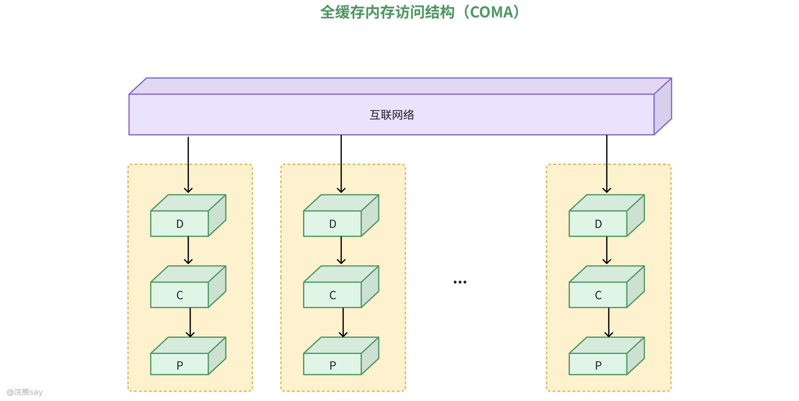

COMA 是一种基于分布式缓存的访存模式，其核心创新是 “无独立主存，全缓存构成全局地址空间”：每个处理器节点不设置传统的主存储器层次，仅配备大容量高速缓存，所有节点的缓存共同组成系统的全局地址空间，处理器执行所需的数据均缓存在本地缓存中。物理地址空间被划分为固定大小的 Cache 块，这些 Cache 块没有固定的宿主节点，可根据程序运行需求在系统内动态迁移 —— 当某节点需要访问特定数据时，系统会通过分布式高速缓存目录（D）定位该数据所在的 Cache 块，并将其迁移至本地缓存，实现高效访问。为支撑大规模数据的缓存和迁移，COMA 系统中高速缓存的容量通常远大于传统的二级缓存（L2 Cache），能够容纳更多共享数据以减少迁移频率。COMA 的核心优势在于数据局部性优化的自动化：初始阶段数据可任意分配，运行过程中系统会自动将数据迁移至需使用它的节点，无需人工干预，大幅简化了程序优化的复杂度；同时，分布式缓存架构也保障了系统的扩展性，适用于对数据共享需求高且访问模式动态变化的并行计算场景。

1.  **非远程内存访问结构（NORMA）**

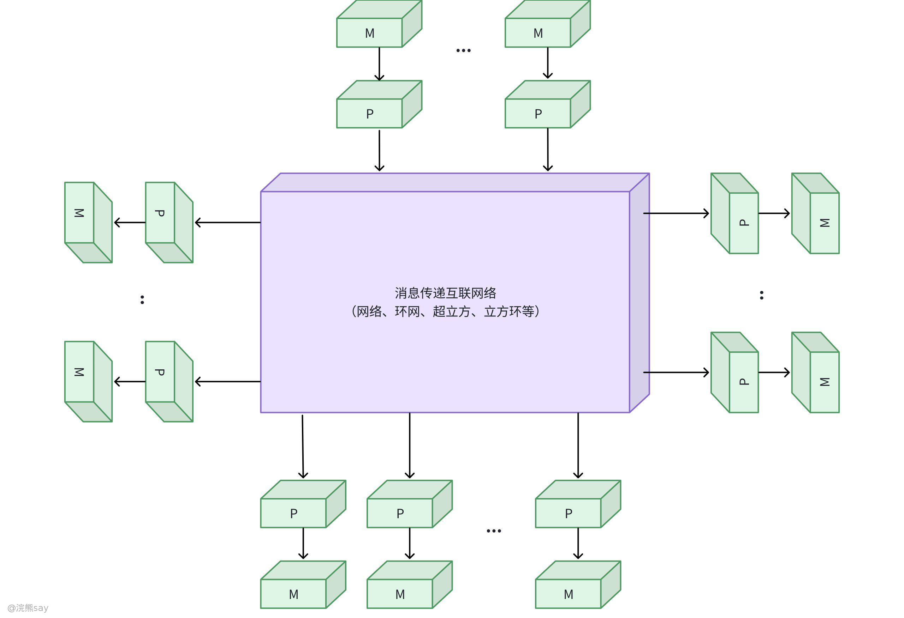

NORMA 是一种基于 “私有内存 + 消息传递” 的访存模式，其核心规则是内存单元为各处理器节点私有，处理器仅能直接访问自身的私有内存，跨节点的内存访问必须通过消息传递机制实现 —— 即一个处理器需向目标处理器发送数据请求消息，目标处理器读取自身私有内存中的数据后，再通过消息回传，完成跨节点数据交互。绝大多数 NORMA 系统不支持直接的远程存储器访问，且在分布式共享内存（DSM）架构出现后，NORMA 模式因缺乏透明的全局内存访问能力而逐渐被淘汰。NORMA 的设计复杂度低于 NUMA 和 COMA，无需处理全局内存共享的一致性问题；但缺点也极为突出 —— 处理器间的通信延迟高、成本高昂，数据交互需经过多轮消息传输，大幅降低了并行计算效率，因此在现代多核体系结构中应用极少，仅在部分对硬件成本要求极低、处理器间耦合度低的嵌入式分布式系统中偶有使用。

## 浣熊真题
| 【国家电网2016】多处理机机间互连一般有（）等几种形式。A.总线B.环行互连C.交叉开关D.多端口存储器答案：ABCD解析：多处理机互连形式包括总线、环形互连、交叉开关、多端口存储器 |
| --- |

## 多核处理器

## 核的概念

多核处理器的核心构成单元 “核”，是具备完整指令执行能力的独立计算模块，其基本组件涵盖 CPU 寄存器集合、中断逻辑单元、指令译码与执行单元（含算术 / 逻辑部件 ALU）以及高速缓存（Cache）。其中，寄存器集合用于临时存储指令执行过程中的数据与地址；中断逻辑单元负责响应并处理外部或内部的中断请求，保障指令执行的有序性；指令与算术 / 逻辑部件是核心运算载体，完成指令解析、数据运算及逻辑判断；Cache 则用于缓存频繁访问的数据与指令，缩短访存延迟，提升执行效率。

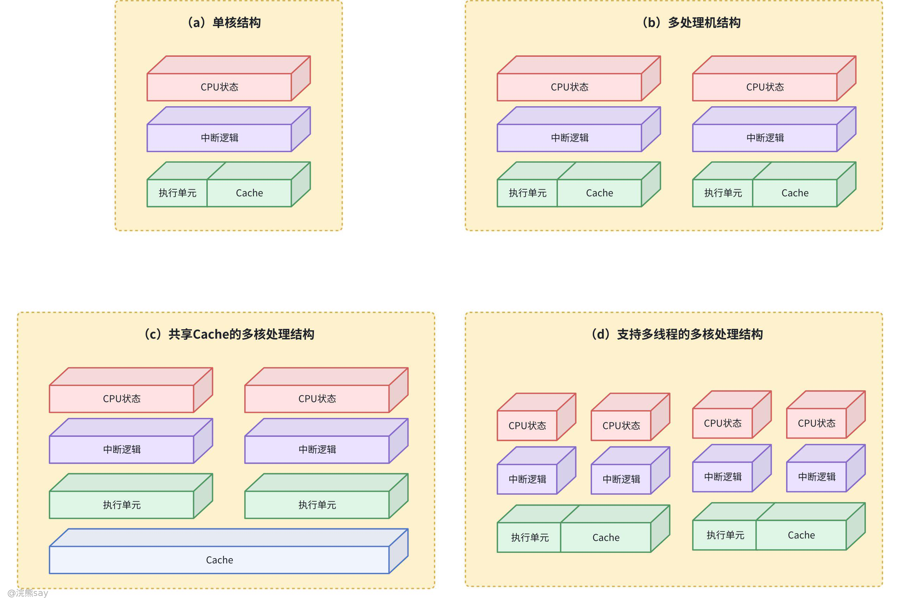

这些独立的核通过片内互连架构（如总线、交叉开关或片上网络）实现数据交互与协同工作，对外呈现为一个统一的处理机实体。从架构定义来看，多核处理机是在单颗芯片内集成两个及以上完整并行工作核的特殊多处理机，其核心特征在于 “共享内存 + 并行执行”：所有核共享同一全局内存空间，不同核可独立执行不同线程或进程，针对内存的不同区域进行操作，通过开发线程级或进程级并行性，突破单核处理器的性能瓶颈。

与传统多处理机相比，多核架构具有显著优势：传统多处理机的多个处理机分散在不同芯片上，需通过片外系统总线连接，不仅占用更大的电路板空间、产生更高的功耗，还需额外的软件适配来协调跨芯片通信；而多核处理器将所有核集成于单芯片内，核间通信距离更短、延迟更低，无需复杂的片外互连设计，软件优化难度也相对降低，成为现代计算机体系结构的主流形态。

## 组织结构

多核处理器的组织结构主要分为同构多核与异构多核两类，二者在核心架构、功能分工及适用场景上存在显著差异。

同构多核处理机的核心特征是所有计算内核的硬件结构完全一致、地位对等，均为通用处理核心，其架构与传统高性能单核处理机相近。这类处理器的核间通过共享存储器、Cache 或局部存储器实现互连，各核心可平等地获取系统资源、执行各类任务，无需固定的主从分工。由于核心结构统一，软件优化难度较低，只需通过任务拆分与负载均衡，将复杂任务分配至不同核心并行执行即可，广泛应用于服务器、桌面计算机等需要处理大规模通用计算任务的场景，例如数据中心的分布式计算、办公软件的多线程处理等。

异构多核处理机则采用 “主处理核 + 协处理核” 的主从架构，各计算内核的硬件结构、功能侧重、功耗水平及运算性能存在明显差异。其设计理念是 “按需分配任务”：根据不同应用场景的性能与功耗需求，配置针对性优化的核心 —— 例如主处理核为高性能通用核心，负责复杂指令调度、系统管理等核心任务；协处理核则可能是低功耗精简核心、图形处理核心（GPU）、人工智能加速核心（NPU）等，专门处理高并行度、重复性强的特定任务（如图像渲染、矩阵运算、语音识别）。这种结构的优势在于能充分发挥不同类型核心的专长，在保障复杂任务处理能力的同时，有效降低整体功耗，成为移动终端（手机、平板）、嵌入式系统及高性能计算集群的主流选择，例如智能手机中的 “大核 + 小核” 架构，可在游戏等高负载场景调用大核保障性能，在日常聊天、浏览网页时切换小核节省电量。

## 并行性

多核处理器的性能提升核心源于对并行性的深度挖掘，主要体现在指令级并行（ILP）与线程级并行（TLP）两个层面，二者分别从指令执行与任务调度维度优化处理效率。

指令级并行（ILP）的本质是当指令序列中不存在数据相关或控制相关时，通过流水线技术将多条指令重叠执行，从而提升单位时间内的指令吞吐量。数据相关指指令间存在数据依赖（如后一条指令需使用前一条指令的运算结果），控制相关则与分支跳转等指令有关（如 if-else 语句导致指令执行路径不确定）。在无相关约束的情况下，处理器可通过指令重排、拆分为微指令等方式，让流水线的取指、译码、执行、写回等阶段同时处理不同指令，实现并行加速。ILP 的优势不仅在于直接提升处理器运算速度，还能处理编译阶段难以预判的相关关系（如涉及内存引用的间接数据依赖），简化编译器的优化设计；同时，基于 ILP 优化的指令序列具有良好的兼容性，在不同架构的流水线处理器上均可高效运行，保障了软件的可移植性。

线程级并行（TLP）则将并行粒度从单条指令提升至线程层面，核心思想是通过多线程的交替执行，充分利用处理器的空闲资源。在单核处理器中，当某一线程因等待内存访问、I/O 操作等事件而阻塞时，处理器会陷入空闲状态，导致资源利用率低下；而 TLP 通过引入多线程调度机制，当一个线程阻塞时，处理器可立即切换至就绪状态的其他线程执行，使流水线始终保持忙碌，从而提升系统整体吞吐量。TLP 的典型应用场景包括 Web 服务器、数据库服务器等，这类场景中每个线程可独立为一个客户端提供服务，通过多线程并行处理海量请求。需要注意的是，单核超标量处理器由于硬件资源有限，无法完全发挥 TLP 的潜力；而多核架构通过为每个核分配独立线程，或在单个核内支持超线程技术，实现了 TLP 的全面落地，让多线程并行从 “时间片轮转” 的伪并行升级为 “真正的硬件并行”。

## Cache结构

多核处理器的 Cache 结构设计直接影响访存效率与系统性能，根据 Cache 的层级、私有与共享属性，主流结构可分为四类，核心差异在于 Cache 的片内 / 片外分布及核间共享方式。

1.  **片内私有 L1 cache 结构**

系统采用 L1+L2 两级 Cache 架构，其中多个核各自配备私有 L1 Cache，且 L1 Cache 通常分为指令 Cache（I-Cache）和数据 Cache（D-Cache），分别缓存指令与数据，减少核间指令与数据的访问冲突；L2 Cache 则位于处理机芯片之外，由所有核共享，用于缓存 L1 Cache 未命中的数据，平衡访存速度与存储容量。

1.  **片内私有 L2 Cache 结构**

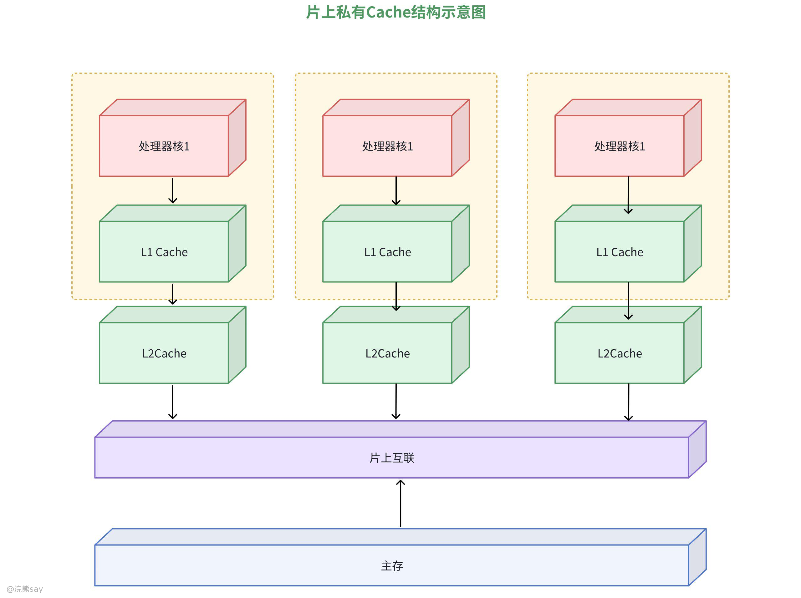

在保留片内私有 L1 Cache（分指令与数据 Cache）的基础上，将 L2 Cache 从片外移至片内，且每个核独占专属的 L2 Cache。这种设计缩短了 L2 Cache 的访问延迟，同时避免了核间共享 L2 Cache 带来的竞争冲突；所有核仍共享片外主存，主存作为 Cache 的后备存储，提供大容量数据支持。

1.  **片内共享 L2 Cache 结构**

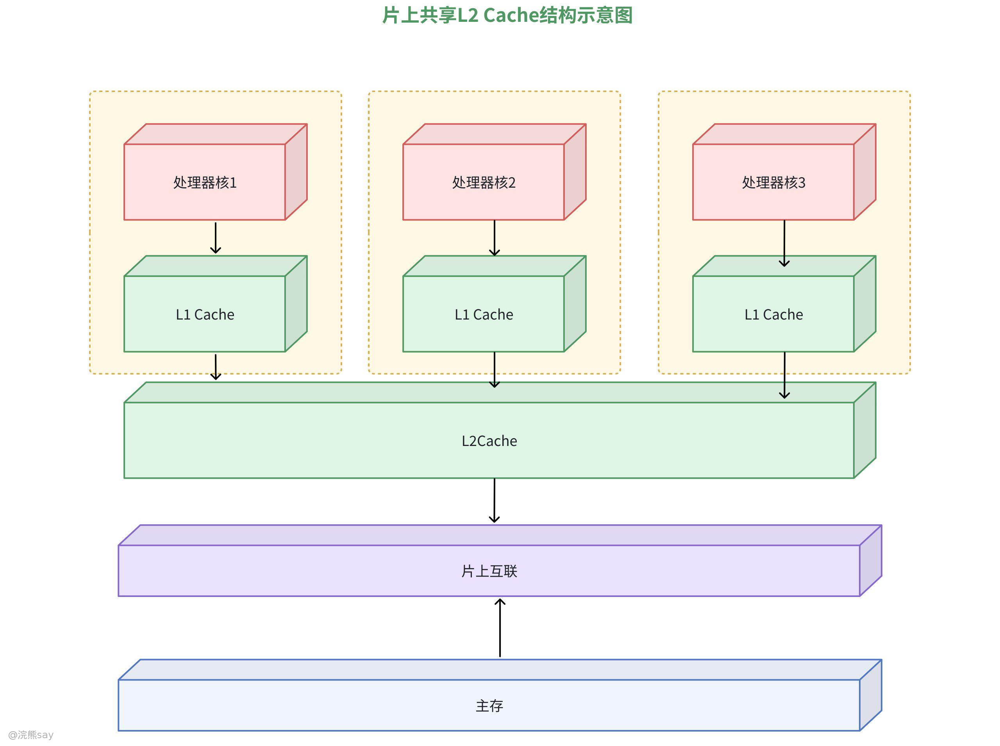

采用片上两级 Cache 架构，核心变化是将原本私有 L2 Cache 改为所有核共享的片内 L2 Cache。共享 L2 Cache 可更高效地缓存核间共享数据，减少多个核访问同一数据时的 Cache 未命中次数，提升数据复用率；核间通过共享 L2 Cache 实现数据交互，无需频繁访问片外主存，进一步降低访存延迟，同时仍共享片外主存作为大容量存储池。

1.  **片内共享 L3 Cache 结构**

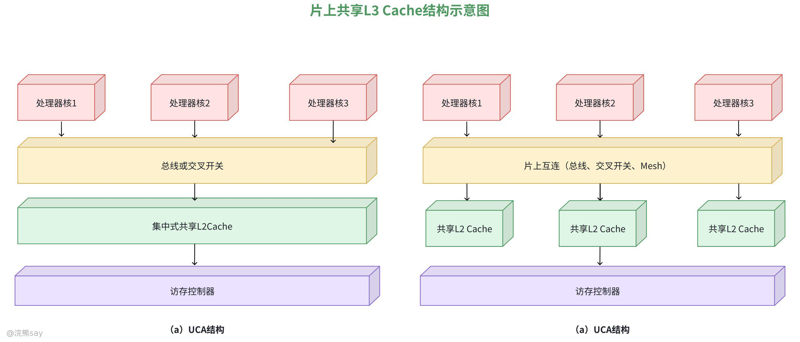

在 L1、L2 Cache 的基础上，将 L3 Cache 也从片外移至片内，形成三级 Cache 架构，且 L3 Cache 由所有核共享。片内共享 L3 Cache 的引入大幅提升了缓存总容量，减少了对片外主存的访问频率，显著优化了存储系统性能；在该结构中，主流的实现方式包括集中式共享 UCA（Uniform Cache Access）和分布式共享 NUCA（Non-Uniform Cache Access）：UCA 架构中所有核访问 L3 Cache 的延迟一致，设计简单；NUCA 架构中 L3 Cache 分布式部署，核访问本地附近的 Cache 块延迟更低，更适合大规模多核系统，能平衡访问延迟与扩展性。

## Cache一致性

### 多核处理器 cache 一致性问题

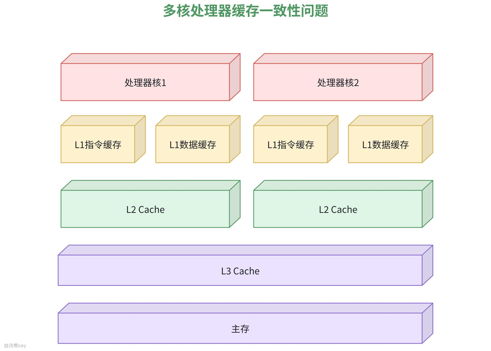

多核处理器的私有 Cache 机制虽能提升单个核的访存效率，但也引发了 Cache 一致性问题。当多个核访问内存中的同一数据时，每个核会在其私有 Cache 中创建该数据的副本，若缺乏有效的管理机制，不同核的 Cache 副本可能出现数据不一致 —— 例如核 A 修改了 Cache 中的数据副本但未写回主存，核 B 仍读取自身 Cache 中未更新的旧副本，导致运算结果错误。

多核系统的 “Cache 一致性” 包含两层含义：一是各核的 Cache 与主存之间的数据一致性，即 Cache 中的副本需与主存中的原始数据保持同步；二是不同核的 Cache 之间的数据一致性，即针对内存同一位置的数据，所有核的 Cache 副本必须保持相同的值。因此，必须通过专门的 Cache 一致性协议来管理共享数据的多个副本，确保无论哪个核访问或修改数据，所有相关副本都能及时更新或失效，保障系统运算的正确性。

### Cache 一致性协议

Cache 一致性协议是解决上述问题的核心技术，主要分为总线监听协议和目录协议两类，二者基于不同的实现原理，适用于不同的多核架构。

#### 监听协议

作为目前主流的一致性协议，其核心依托共享总线的广播机制实现数据同步。所有核的 Cache 控制器都连接在共享总线上，持续监听总线上的访存事务（如读、写操作）。当某个核对 Cache 中的共享数据执行写操作时，会通过总线广播该操作，其他核的 Cache 控制器监听到广播后，根据协议规则处理自身 Cache 中的对应副本。监听协议主要分为写无效协议和写更新协议：写无效协议在写操作前，广播使其他核的相关共享副本变为无效，确保当前核独占该数据的修改权，修改后的数据可选择写回主存（写回策略）或直接更新主存（写直通策略）；写更新协议则在写操作时，通过总线将新数据广播至所有持有该数据副本的 Cache，直接更新副本内容，若采用写直通策略，还需同步修改主存中的数据。监听协议的优势是实现简单、响应速度快，但由于依赖总线广播，仅适用于共享总线架构，在核数量较多时会导致总线带宽瓶颈。

#### 目录协议

为解决监听协议的广播瓶颈而设计，适用于片上网络（NoC）等大规模多核架构。其核心是为内存中的每个存储行维护一个目录项，该目录项记录了所有当前持有该存储行副本的核编号（通常通过 n 位位向量表示，n 为核的总数，位为 “1” 表示对应核持有副本），以及该存储行是否已被改写的状态（改写位，位为 “1” 表示某核独占并修改了该数据）。当某个核欲对某存储行执行写操作时，会先查询目录项，仅向持有该副本的核发送写无效或写更新信号，无需广播至所有核，大幅减少了通信开销。目录协议的操作逻辑与监听协议类似，核心差异在于同步机制：监听协议通过总线广播，目录协议通过目录控制器定向发送消息。典型的目录组织方式为位向量目录，其结构简单、查询高效，能有效支撑大规模多核系统的一致性管理，但目录项本身会占用一定的存储资源，且目录控制器的设计复杂度高于监听协议。

## 核间通信

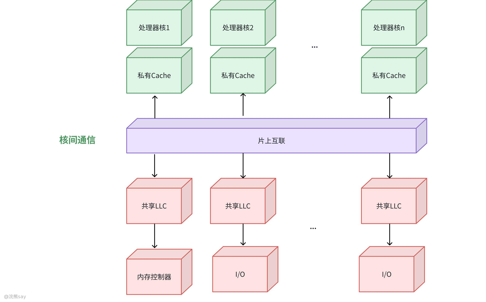

核间通信是多核处理器实现多核心协同工作的核心支撑技术，其本质是通过片上互连架构（如总线、交叉开关、片上网络），将处理器核、Cache、内存控制器、I/O 接口等核心模块有机连接，实现核心间的数据共享、状态同步与任务协作。高效的核间通信机制直接决定了多核系统的并行处理效率，是突破 “多核性能提升瓶颈” 的关键所在 —— 若通信延迟过高、带宽不足，即使核心数量增加，也会因数据交互受阻导致整体性能下降。

### 为什么需要核间通信

多核处理器的各核心虽共享全局内存，但本质上是独立的计算单元，其并行执行的任务往往存在紧密的数据依赖与逻辑关联：一方面，不同核心可能需要访问同一组共享数据（如并行计算中的全局参数、中间结果），需通过通信机制确保数据的一致性传输；另一方面，复杂任务的拆分执行（如流水线式并行、分块处理）要求核心间实时同步任务进度（如 “前一个核心完成数据预处理后，通知后一个核心开始运算”）。因此，核间通信不仅是数据传输的载体，更是协调多核心并行行为、避免任务冲突的关键，其效率直接影响多核系统的整体吞吐量与响应速度。

### 主流片上高效通信机制

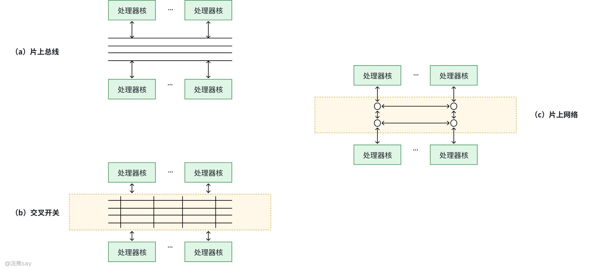

多核处理器的核间通信机制主要分为三类，分别适配不同核心数量、性能需求及硬件复杂度，其核心差异在于互连架构与数据传输方式的设计。

#### 基于总线共享的 Cache 结构通信

该机制以共享总线为核心互连载体，搭配多级共享 Cache（通常为二级或三级 Cache）构建通信链路：所有处理器核、I/O 端口、主存控制器均连接至同一条共享总线，核心的私有 Cache 用于缓存本地高频访问数据，而共享 Cache 则专门存储核间高频共享的数据（如全局变量、公共指令集），减少核心直接访问主存的频率。其通信流程为：当核心 A 需要向核心 B 传输数据时，若数据已存在于共享 Cache 中，核心 B 可通过总线直接读取共享 Cache 中的数据，无需核心 A 主动发送；若数据仅存在于核心 A 的私有 Cache 或主存中，则通过总线完成数据的迁移与传输。

该机制的优势在于硬件结构极简、设计成本低，共享总线的直接传输模式使通信延迟较低，且无需复杂的软件适配，适用于核心数量较少（通常 4 核及以下）的场景；但局限性也十分突出：共享总线的带宽是固定资源，核心数量增加后，多个核心同时发起通信会导致严重的总线竞争，形成带宽瓶颈，且总线的物理特性决定了其扩展性极差，难以支撑大规模多核系统的通信需求。

#### 基于片上互连结构的通信

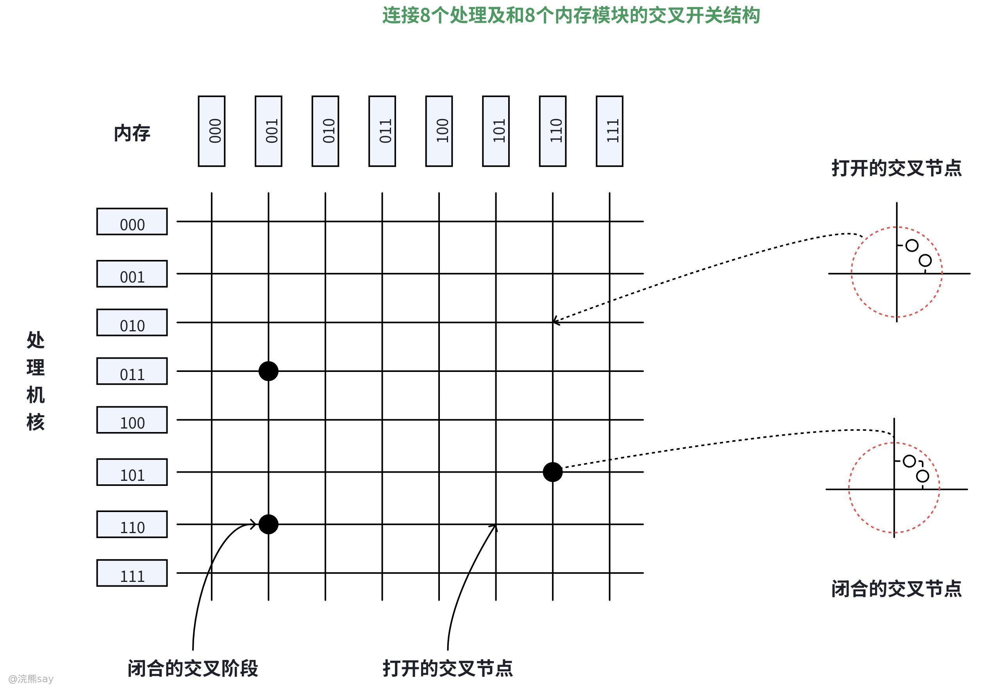

为解决总线共享结构的扩展性问题，片上互连结构采用 “独立模块 + 动态连接” 的设计思路：每个处理器核均配备专属的处理单元与私有 Cache，核心间通过交叉开关（Crossbar）或简易片上网络实现互连，数据传输采用消息传递模式 —— 核心需发送的数据被封装为消息包，通过互连结构定向传输至目标核心，无需占用全局共享资源。

其中，交叉开关是该结构的核心组件，本质是一套矩阵式组织的可编程开关集合，每个输入端口与输出端口的交叉点均设有独立开关，可根据通信需求动态置为 “导通” 或 “断开” 状态，实现任意两个核心间的点对点连接。这种设计的核心优势在于 “并行传输”：多个通信链路可同时建立，互不干扰，大幅提升了通信带宽；同时，点对点的传输模式避免了全局总线的竞争冲突，扩展性显著优于总线共享结构，适用于 8 核至 32 核的中大规模多核系统。但其缺点也较为明显：交叉开关的硬件复杂度随核心数量呈平方级增长（核心数越多，交叉点开关数量越多），导致芯片面积与功耗大幅增加；此外，消息传递模式需要软件层面的适配（如数据封装、地址映射），相比总线共享结构的 “透明通信”，软件改动成本更高。

#### 基于片上网络结构的核间通信

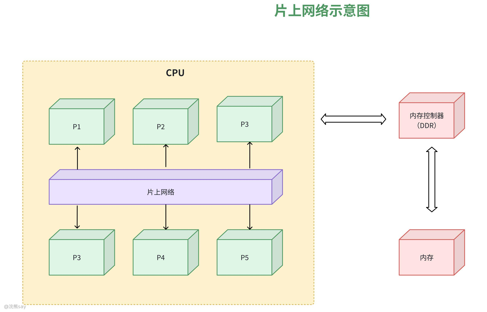

片上网络是面向大规模多核处理器（通常 32 核以上）的高端通信机制，其设计理念深度借鉴了分布式计算机网络的 TCP/IP 协议体系，将片上各核心、Cache、I/O 模块抽象为 “网络节点”，通过专门的片上路由器、通信链路构建成结构化网络（如 Mesh、Torus、Fat-Tree 拓扑），数据传输采用 “分组交换 + 存储 - 转发” 机制。

其通信流程为：发送核心将待传输数据拆分为固定长度的数据包（含目标地址、数据载荷、校验信息），通过本地网络接口（NI）发送至片上路由器；路由器根据数据包的目标地址，通过预设的路由算法（如最短路径路由、自适应路由）将数据包转发至下一跳路由器，直至送达目标核心的网络接口；目标核心接收数据包后，重组为完整数据并写入本地 Cache 或寄存器。

片上网络的核心优势在于彻底突破了总线瓶颈：分布式的网络架构使通信带宽随核心数量线性增长，支持大规模多核的并行通信；灵活的拓扑结构与路由算法可根据任务需求优化通信路径，降低延迟；同时，存储 - 转发机制确保了数据包传输的可靠性，适配复杂的并行任务场景。其研究重点集中在四大方向：拓扑结构（影响通信延迟与扩展性）、路由算法（决定数据包传输路径与效率）、流量控制（避免网络拥堵）、服务质量（QoS，保障关键任务的通信优先级）。相比前两种机制，片上网络的硬件复杂度最高，但能充分发挥大规模多核的并行潜力，已成为高端服务器、高性能计算（HPC）领域多核处理器的主流通信架构。

## 同步机制

在多核处理器中，多个核心并行访问共享资源（如共享内存、全局变量）时，若缺乏有效的协调机制，可能出现 “竞态条件”（Race Condition）—— 即多个核心的访问顺序不确定导致最终结果错误。同步机制的核心目标的就是通过特定的硬件指令与软件逻辑，协调多核心对共享资源的访问行为，确保并行执行的任务在逻辑上的正确性与一致性。这类机制通常构建在用户级软件例程之上，而软件例程的底层依赖处理器提供的原子操作指令（如测试并置位、比较并交换）实现。主流的同步机制主要包括锁操作、栅障操作与事务内存三类。

### 锁操作

锁是并行编程中最基础、应用最广泛的同步机制，核心作用是保护 “临界区”—— 即多个线程（或核心）不能同时执行的代码段（通常是访问共享资源的代码），确保临界区的操作具有原子性（要么全执行，要么全不执行）。

其工作原理为：当某个核心需要进入临界区时，首先尝试获取锁；若锁未被占用，则成功获取并进入临界区，此时其他核心尝试获取锁会失败，需等待锁被释放；当核心完成临界区操作后，释放锁，等待中的核心可重新竞争锁。根据实现方式的不同，锁可分为自旋锁（Spin Lock）与互斥锁（Mutex Lock）：自旋锁适用于临界区操作耗时较短的场景，等待锁的核心会持续循环检测锁的状态（不放弃处理器资源），减少上下文切换开销；互斥锁则适用于临界区耗时较长的场景，等待锁的核心会被挂起，释放处理器资源给其他任务，直至锁被释放后再被唤醒。锁操作的优势在于实现简单、适配性强，但其缺点也较为突出：若锁的粒度过粗（如一个锁保护大量共享资源），会导致核心频繁等待，降低并行效率；若粒度过细，则会增加锁的管理开销，甚至引发死锁（多个核心互相等待对方释放锁）。

### 栅障操作

栅障（Barrier）操作是实现多核全局同步的核心机制，主要用于协调多个核心的执行进度，确保所有核心完成特定阶段的任务后，再同步进入下一阶段，避免因核心执行速度差异导致的数据不一致。

其典型应用场景包括并行迭代计算（如矩阵乘法、有限元分析）、数据分块处理等：例如在并行迭代中，每个核心负责计算矩阵的一个子块，需等待所有核心完成当前迭代的计算后，汇总全局结果并更新迭代参数，再进入下一次迭代。栅障操作的实现逻辑为：系统预设一个全局计数器，当某个核心完成当前阶段任务后，会触发计数器加 1，并进入等待状态；当计数器的值等于核心总数（即所有核心均到达栅障）时，系统发送释放信号，所有等待中的核心同时被唤醒，继续执行后续代码。根据实现层级的不同，栅障可分为硬件栅障（由处理器硬件直接支持，延迟低、效率高）与软件栅障（通过共享内存、原子指令实现，灵活性强但延迟略高）。栅障操作的核心价值在于简化了全局同步的编程复杂度，确保了并行任务的逻辑一致性，但过多的栅障会导致核心频繁等待，降低系统吞吐量，因此需合理规划栅障的使用时机。

### 事务内存

事务内存（Transactional Memory, TM）是一种面向复杂共享资源访问的新型同步机制，其设计灵感源于数据库中的 “事务” 概念，旨在解决传统锁机制的死锁、粒度难以平衡等问题，简化并行编程。

其核心思想是：将访问共享变量的代码区域声明为一个 “事务”，事务具有三大核心特性 —— 原子性（事务内的所有操作要么全部执行成功并提交，要么全部失败并回滚，无中间状态）、一致性（事务执行前后，共享数据的状态符合预设规则）、隔离性（多个事务并发执行时，彼此的操作互不干扰，仿佛串行执行）。事务内存的实现需解决三大关键问题：①冲突检测：实时监测多个事务对同一共享资源的访问冲突（如两个事务同时修改同一变量）；②冲突解决：当冲突发生时，通过预设策略处理（如让优先级较低的事务回滚并重试，或暂停当前事务等待其他事务完成）；③事务提交与放弃：若事务执行过程中无冲突，或冲突已解决，则提交事务，将修改后的结果写入共享内存；若冲突无法解决（如死锁），则放弃事务，回滚至执行前的状态，避免数据不一致。

相比传统锁机制，事务内存的优势在于无需手动管理锁的获取与释放，降低了编程复杂度；同时，事务的隔离性确保了并行执行的效率，冲突检测与解决由硬件或运行时系统自动完成，无需开发者干预。目前，事务内存已逐渐应用于高性能计算、分布式系统等场景，成为多核同步机制的重要发展方向。

## 浣熊真题
| 【中国银行2023】下列哪种技术可以用于分配计算任务到多个处理器上？A.分布式处理技术B.多线程技术C.阵列处理器技术D.超线程技术答案 ：B解析 ：多线程技术从软件或硬件上实现多个线程并发执行，支持多线程的系统包括多核心处理器等，能将计算任务分配到多个处理器（内核）上。 |
| --- |

## GPU

## GPU概念

图形处理器（Graphics Processing Unit，GPU），又称显示核心、视觉处理器或显示芯片，是专为图像运算优化设计的微处理器，广泛应用于个人电脑、工作站、游戏机及智能手机、平板电脑等移动设备。其发展源于市场对实时、高清晰度 3D 图形的迫切需求 —— 早期 GPU 仅负责图形渲染相关的专用计算（如顶点变换、纹理映射、像素着色），而随着并行计算需求的爆发，可编程 GPU 已演进为高度并行化、多线程、多核心的通用计算核心，不仅保留了极强的图形处理能力，更具备了通用计算能力与超高存储带宽。

与中央处理器（CPU）的 “串行优化” 设计逻辑不同，GPU 的架构天生适配并行计算：它以海量线程为核心载体，聚焦 “面向吞吐量的数据并行”，擅长处理计算密度高、逻辑分支简单、数据规模庞大的并行负载（如矩阵运算、图像渲染、深度学习训练）；而 CPU 则侧重复杂逻辑控制与低延迟串行运算，通过复杂的控制单元（如分支预测器）和大容量缓存降低单任务延迟，更适配操作系统调度、复杂应用逻辑处理等场景。如今，GPU 已从专用图形硬件升级为 “通用并行计算核心”（GPGPU，General-Purpose computing on Graphics Processing Units），成为人工智能、科学计算、数据挖掘等领域的核心算力支撑。

## GPU特点

GPU 的性能优势源于其针对性优化的硬件架构，核心特点集中在并行能力、运算密度与流水线设计三大维度，完美适配大规模并行计算场景。

**1\. 极致高效的并行计算能力**GPU 本质是基于 SIMD（单指令多数据）架构的并行处理器，其核心特征是 “海量计算核心 + 集中式控制”：主流 GPU 通常集成数千甚至上万个流处理器（ALU，即运算核心），这些核心在单一控制部件的调度下，可同时执行同一指令集，对不同数据元素进行并行运算（即 “单指令驱动多数据”）。为进一步提升并行吞吐量，GPU 还配备了多条独立的处理流水线 —— 例如主流型号中常见 16 个片段处理流水线、6 个顶点处理流水线，这些流水线既可集中受控运行，也可根据任务需求独立工作，实现多维度并行。这种并行架构让 GPU 能轻松支撑上万个线程并发执行，在廉价硬件成本基础上，为大规模并行应用提供了高效解决方案。

**2\. 超高密度的运算与存储带宽**GPU 的硬件设计极度侧重 “运算密集型任务”：一方面，其内存位宽普遍达到 128 位、256 位甚至更高，远超 CPU 的内存位宽，带来极高的内存带宽（主流 GPU 带宽可达数百 GB/s），能为海量并行核心提供持续、高速的数据流支撑，避免因数据供应不足导致运算核心闲置；另一方面，GPU 的晶体管资源主要分配给运算单元，而非复杂的控制单元与缓存，让单位芯片面积能承载更多运算能力，在浮点运算等密集型任务中，性能表现远超同功耗的 CPU。

**3\. 超长图形流水线设计**GPU 的流水线设计以 “吞吐量最大化为核心目标”，摒弃了 CPU 追求 “低延迟” 的短流水线设计，转而采用数百级的超长流水线 —— 例如 NVIDIA GeForce3 的流水线高达 800 个阶段。这种设计让 GPU 能高效处理大规模连续数据流：每个流水线阶段专注处理特定的运算步骤（如顶点着色、几何处理、像素渲染），海量数据按顺序流经各阶段，实现 “流水线满负荷运转”，大幅提升单位时间内的任务处理量。作为典型的数据流并行处理机，这种设计让 GPU 在图像渲染、大规模矩阵运算等 “高吞吐、可预测” 的数据流处理场景中，具备无可替代的优势。

## GPU和CPU对比
| 对比维度 | CPU（中央处理器） | GPU（图形处理器） |
| --- | --- | --- |
| 概念 | 计算机的运算核心和控制核心，功能是解释计算机指令、处理软件数据 | 专门进行图像运算工作的微处理器 |
| 架构设计 | 存储单元和控制单元多，擅长逻辑控制、串行运算，大规模并行处理速度弱 | 计算单元多、核数远多于 CPU，擅长密集数据计算、大规模并行处理；逻辑运算单元设计简单，逻辑处理能力弱 |
| 缓存结构 | 有大量缓存，主流芯片多配备四级缓存 | 缓存简单，主流芯片最多两层缓存 |
| 响应方式 | 要求实时响应，对单任务速度要求高，靠多层缓存保障单任务速度 | 先排好任务再批处理，对缓存要求低 |
| 浮点运算方式 | 除浮点、整型运算，还执行多媒体解码等其他指令集；注重单线程性能，控制部分消耗多晶体管和能耗 | 基本只做浮点运算，设计结构简单；注重吞吐量，单指令驱动更多计算，控制部分能耗少，可把资源给浮点计算，性能数倍至上百倍于 CPU |
| 应用 | 擅长操作系统等需快速响应、低延迟优化的应用，控制部分（分支预测等）消耗晶体管和能耗 | 适合高可预测性、大量相似运算，高延迟、高吞吐的场景，如人工智能机器学习训练 |

## 集群

集群是一种**价格低廉、易于构建、可伸缩性极强**的并行计算机系统，其核心架构是将多台同构或异构的独立计算机（节点），通过高性能网络或局域网互连，形成协同工作的计算集群，共同完成单一计算机无法高效处理的大规模并行计算任务。从用户视角来看，集群对外呈现为 “单一、集中的计算资源”—— 用户无需关注底层的节点分布，只需通过统一接口提交任务，集群会自动将任务拆分至各节点并行执行，并汇总最终结果，实现 “透明化并行计算”。

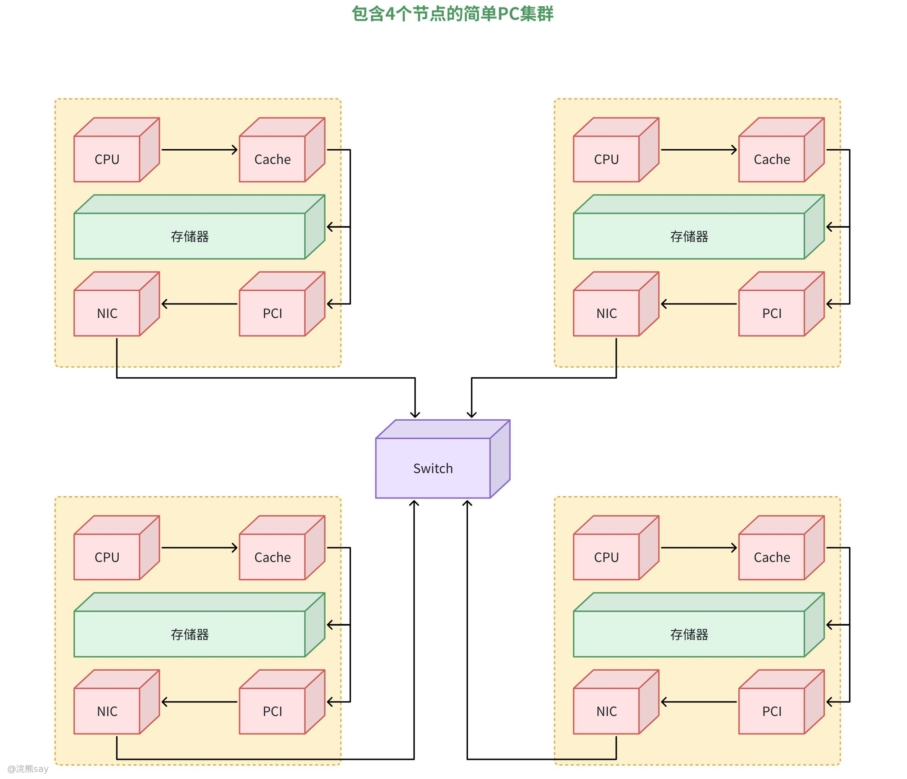

集群的逻辑结构由 “节点、互连网络、接口耦合” 三部分核心组件构成，各组件分工明确，共同支撑集群的协同工作：

1.  **节点（计算单元）**构成集群的每台独立计算机称为一个 “节点”，每个节点都是完整的计算系统 —— 配备本地磁盘、独立操作系统（如 Linux）、CPU、内存等核心组件，可单独作为计算资源供用户使用。节点的形态灵活多样：既可以是普通 PC 机、工作站，也可以是规模较大的对称多处理机（SMP），支持同构（所有节点硬件配置一致）或异构（节点配置不同，适配不同类型任务）部署，满足多样化计算需求。
2.  **互连网络**集群的各个节点通过商品化高性能网络（如以太网、InfiniBand）连接，形成节点间的通信链路。互连网络的核心作用是实现节点间的数据传输、任务调度指令分发与计算结果汇总 —— 其性能（带宽、延迟）直接影响集群的整体并行效率，但由于集群采用商品化网络，成本远低于传统并行计算机的专用互连设备。
3.  **接口耦合方式**网络接口与节点的 I/O 总线采用 “松散耦合” 方式连接：节点的本地运算与节点间的网络通信相对独立，不会因网络传输占用过多本地运算资源，确保每个节点能充分发挥自身的计算能力，同时避免单一节点故障影响整个集群的运行（具备一定的容错性）。

与传统大型机、小型机相比，集群的核心优势在于 “高性价比 + 高扩展性”：通过商品化硬件（如普通 PC 机、工作站）构建，无需专用硬件，大幅降低构建成本；同时，集群的节点数量可根据任务需求灵活增减（从几台到数千台），轻松应对不同规模的计算任务，解决了传统大型机 “扩展成本高、灵活性差” 的痛点。
