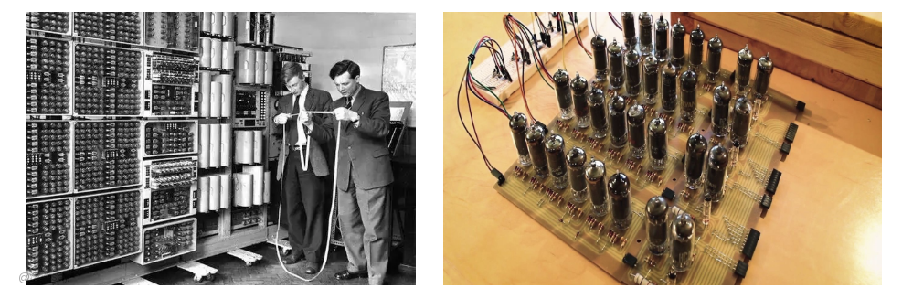
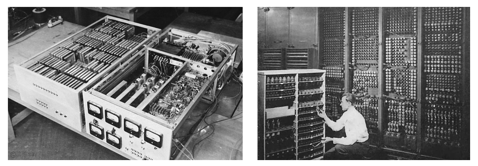
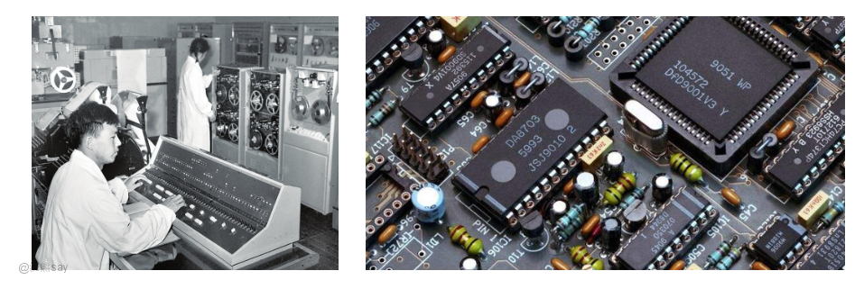
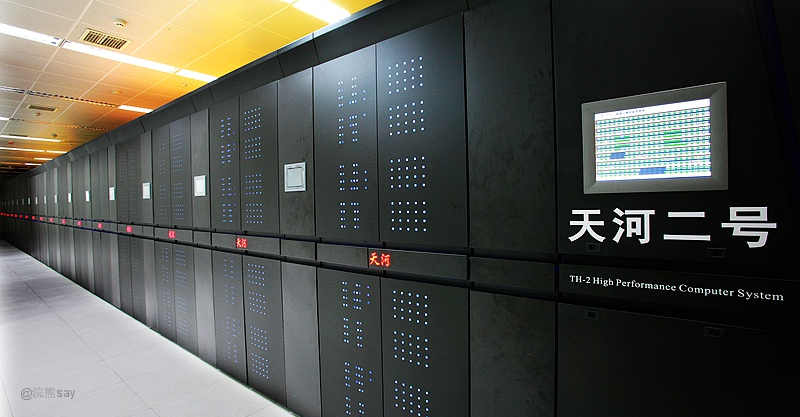
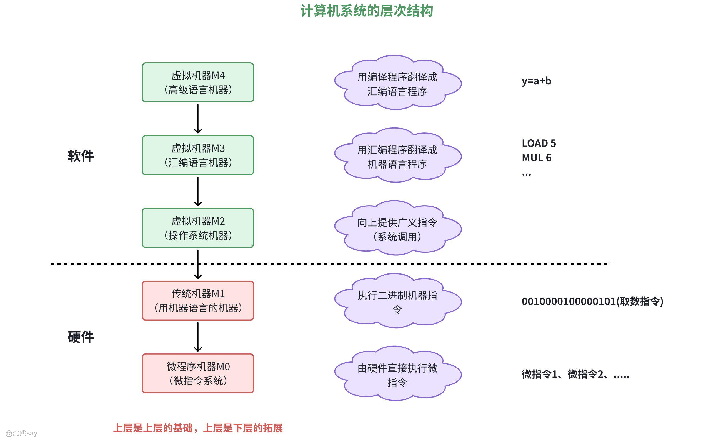
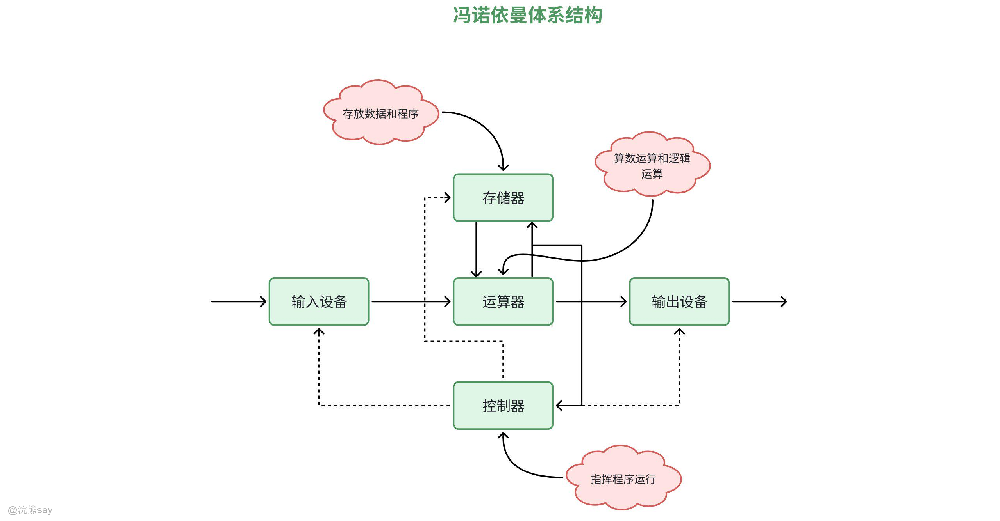
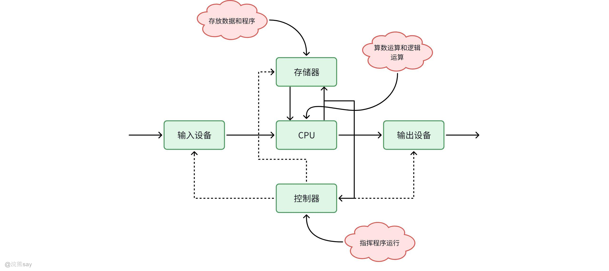
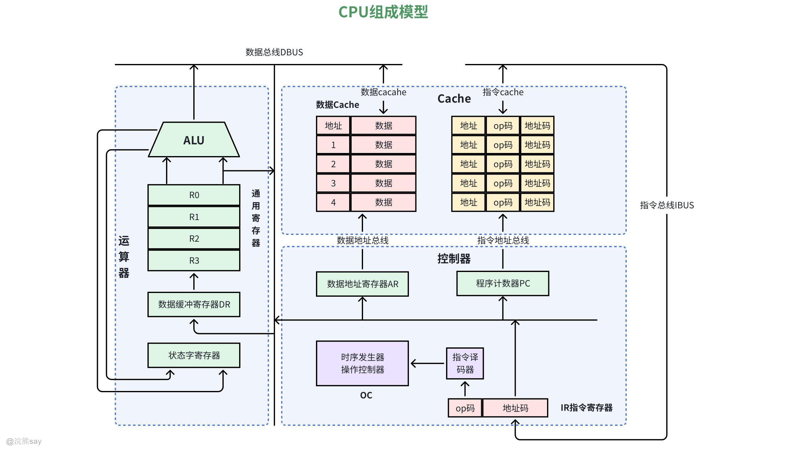

# **计算机系统基础**

## 计算机系统概述

## 计算机发展阶段

计算机的发展可以分为四个主要阶段，每个阶段都有其显著的技术特点：

# 第一代（1946-1958年）：电子管计算机

1946 年 2 月 14 日，世界首台通用计算机 “ENIAC” 在美国宾夕法尼亚大学诞生，由莫克利（John W. Mauchly）和艾克特（J. Presper Eckert）研发，主要用于美国国防部弹道计算。这台设备堪称 “庞然大物”，搭载 18000 个电子管，占地 170 平方米、重达 30 吨，功耗达 150 千瓦，每秒可完成 5000 次运算 —— 这在当时是突破性成就，如今虽显微薄。作为第一代计算机的代表，其核心特征为以电子管作为开关器件（体积大、功耗高、可靠性差），依赖二进制机器语言编程，初步具备存储功能，但输入输出速度缓慢，且受电子管发热问题限制，无法长时间连续工作。

# 第二代（1959-1964年）：晶体管计算机

晶体管计算机是指20世纪50年代末到60年代的[计算机](https://baike.baidu.com/item/%E8%AE%A1%E7%AE%97%E6%9C%BA/140338?fromModule=lemma_inlink)，本阶段以晶体管替代电子管为核心革新，主机采用半导体器件，辅助存储器升级为磁鼓和磁盘，设备体积大幅缩小、可靠性显著提升，运算速度跃升至每秒几十万次。硬件方面，内存储器广泛采用磁性材料制成的磁芯，外存储器以磁盘为主；软件技术同步迭代，操作系统概念应运而生，编程语言从机器语言升级为汇编语言，同时 Ada、FORTRAN、COBOL 等高级程序设计语言相继问世，大幅提升了编程效率与计算机工作效能。

# 第三代（1965-1970年）：中小规模集成电路计算机

核心元器件升级为中小规模集成电路，使得计算机的性能、可靠性与集成度实现跨越式提升。同时，成熟的操作系统正式问世，不仅简化了用户操作流程，更实现了计算机硬件资源的高效管理，为通用计算机的普及奠定了基础。

# 第四代（1971年至今）：大规模和超大规模集成电路计算机

大规模（LSI）与超大规模集成电路（VLSI）的普及成为核心标志，计算机集成度与性能呈指数级增长。1971 年 Intel 4004 微处理器的诞生，推动计算机向小型化、便携化转型，直接催生了个人计算机（PC）的崛起；如今，这一阶段仍在持续演进，硬件集成度不断突破，计算机应用场景也从专业领域拓展至大众生活的方方面面。

## 计算机硬件的发展

1.  电子管时代（1940s-1950s）代表机型为世界首台通用计算机 ENIAC，搭载 1.8 万只电子管，具有体积庞大（30 吨）、功耗高（150kW）的特点，运算速度达每秒 5 千次；技术上采用磁鼓存储（容量仅数 KB），编程依赖机器语言，硬件操作直接且繁琐。
2.  晶体管时代（1950s-1960s）以 IBM 7090 为代表机型，用晶体管替代电子管，实现了体积缩小、可靠性提升的突破，运算速度跃升至每秒 10 万次；技术突破集中在存储与编程，磁芯存储器投入使用（容量提升至 MB 级），FORTRAN、COBOL 等高级语言应运而生，降低了硬件操作门槛。
3.  集成电路时代（1960s-1980s）中小规模集成电路（SSI/MSI）的应用推动 CPU 集成度提升，代表机型 IBM System/360 开启通用计算机时代；后续大规模集成电路（LSI）实现关键突破，1971 年 Intel 4004（首款微处理器）诞生，Apple II、IBM PC 等个人计算机萌芽，硬件形态开始向小型化、民用化转型。
4.  超大规模集成电路（VLSI）与多核时代（1990s 至今）CPU 制程从微米级逐步迈入纳米级（如 Intel i7 从 45nm 迭代至 3nm），集成度遵循摩尔定律（每 18 个月翻倍）；硬件技术呈现多元化发展，多核处理器（如 AMD Ryzen 16 核）、GPU 并行计算（NVIDIA CUDA）、AI 专用芯片（TPU）成为主流，满足了不同场景下的高性能计算需求。

## 计算机软件的发展

1.  机器语言与汇编时代（1940s-1950s）软件直接对应硬件二进制指令（0/1 代码），编程效率极低且依赖硬件特性，无通用编程标准，典型代表为 ENIAC 的机器语言编程，软件与硬件高度绑定。
2.  操作系统与高级语言萌芽（1960s-1970s）操作系统实现关键突破，1964 年 IBM 推出 OS/360（支持多任务处理），1969 年 UNIX 系统发布，奠定现代操作系统架构基础；高级语言逐步普及，BASIC（面向初学者）降低编程门槛，C 语言（适用于系统编程）影响深远，软件开始脱离硬件直接操作，形成独立发展体系。
3.  商用软件与图形界面时代（1980s-1990s）图形化操作成为主流，1985 年微软 Windows 1.0 发布，Office 办公套件（Word、Excel）成为民用与商用标配；互联网软件快速崛起，1993 年 Mosaic 浏览器推动 WWW 应用普及，1995 年 Java 语言实现 “一次编写，到处运行”，软件应用场景从单机拓展至网络互联，商用化进程加速。
4.  开源与智能化时代（2000s 至今）开源运动成为技术基石，Linux（1991 年诞生）、Apache 服务器、Python 语言（2000s 后崛起）构建起开放协作的软件生态；人工智能软件实现产业化落地，TensorFlow（2015）、PyTorch 等框架推动深度学习发展，自动驾驶、自然语言处理等智能软件逐步商业化，软件智能化成为核心趋势。

## 计算机的分类与发展方向

### 计算机分类

1.  超级计算机：以千万亿次 / 秒的极强算力为核心特征，擅长并行处理复杂计算任务，主要应用于对算力要求苛刻的领域，如天气预报模拟、核物理反应推演、航空航天工程计算等。
2.  服务器：具备高可靠性、可扩展性与持续运行能力，是数据存储与网络服务的核心载体，广泛应用于云计算中心、企业数据中心、大型网站后台等场景，支撑海量数据处理与多用户并发访问。
3.  个人计算机：涵盖桌面 PC、笔记本电脑、平板电脑等形态，设计侧重便携性与易用性，功能兼顾办公高效处理、日常娱乐体验与个人开发需求，是大众生活与工作中最普及的计算设备。
4.  嵌入式计算机：核心特点为低功耗、小型化且高度集成，通常嵌入各类终端设备内部实现特定功能，典型应用包括智能手机、物联网传感设备、汽车电子控制系统、智能家电等。
5.  专用计算机：针对特定任务场景定制化设计，硬件与软件深度适配单一需求，例如用于深度学习推理的 AI 专用芯片、专注密码破解的专用计算设备、工业控制专用终端等。

### 未来发展方向

1.  算力突破：量子计算量子计算以量子比特（qubit）为核心运算单元，凭借量子叠加与纠缠特性实现并行计算，理论上可高效解决经典计算机难以处理的复杂问题（如大数分解、量子模拟等）。目前 IBM、Google 等企业已推出上百量子比特的原型机，但在抗噪声干扰、量子纠错技术等关键领域仍需突破，距离规模化实用化仍有一定距离。
2.  形态变革：泛在计算计算机将打破传统设备形态限制，深度融入生活环境与各类场景，实现 “无形化” 存在。典型方向包括可穿戴设备（智能手表、AR 眼镜）、智能家居中枢（联动家电的物联网控制终端）、脑机接口技术（通过神经信号直接操控设备）等，让人与计算设备的交互更自然、更便捷。
3.  绿色计算：低功耗与可持续性可持续发展成为技术演进的核心考量，未来将通过多维度优化实现绿色化：数据中心持续降低能效比（PUE），芯片制程向 3nm 以下先进工艺演进以减少功耗，可再生能源（太阳能、风能）供电逐步成为数据中心与计算设施的标配，推动计算产业与生态环境协同发展。
4.  异构融合：硬件与软件协同演进硬件层面，CPU、GPU、NPU（神经网络处理器）等异构芯片通过高速互联技术（如 CXL 协议）构建协同算力集群，按需分配计算资源以适配不同任务需求；软件层面，跨平台开发框架（如 Flutter、Unity）日益成熟，实现 “一次开发、多端部署”，打破设备壁垒，提升软件开发效率与适配范围。
5.  边缘计算与分布式协同算力布局从集中式云端向网络边缘下沉，将计算资源部署于基站、智能家居网关、工业控制节点等边缘设备，减少数据传输延迟，提升实时响应能力，典型应用包括自动驾驶车辆的本地决策、工业物联网的实时监控与控制、高清视频的边缘渲染等，形成 “云端 + 边缘” 的分布式协同计算体系。

计算机技术的发展始终遵循 “性能持续提升、成本逐步下降、易用性不断增强” 的核心规律，从早期单一的科学计算工具，逐步演变为驱动数字化社会运转的核心基础设施。未来，量子计算、泛在计算等方向将推动技术向更智能、更普惠的形态演进，而绿色化转型与安全防护能力建设，也将成为贯穿发展全过程的重要课题。

## 计算机体系结构

## 计算机的分层架构

计算机系统采用模块化分层设计，核心逻辑是 “每一层屏蔽底层实现细节，同时为上层提供标准化接口”，形成清晰的五层层次结构，从底层到上层逐步抽象，适配不同使用场景：

-   硬件层（Hardware Layer）作为系统最底层的物理基础，核心组件包括 CPU、内存、存储设备（硬盘、SSD）、输入输出（I/O）设备等实体硬件。其核心功能是执行最基本的机器指令（如加法、移位运算），为整个系统提供基础算力、存储空间等硬件资源。关键概念包括指令集架构（ISA）与微体系结构：ISA 定义了 CPU 能识别执行的指令集合（如 x86、ARM 架构），是连接硬件与软件的核心接口；微体系结构则是 ISA 的物理实现方式，涵盖流水线设计、缓存结构等硬件细节。
-   指令集与汇编层（Instruction Set & Assembly Layer）直接对应硬件层的机器指令，通过助记符（如ADD A, B）替代晦涩的二进制代码，降低硬件操作门槛。该层的核心作用的是双向衔接：一方面，程序员可通过汇编语言直接控制硬件细节（如寄存器分配、端口操作），但开发效率较低；另一方面，它是高级语言编译的中间目标（如 C 语言代码需先编译为汇编代码，再进一步转换为机器指令）。
-   操作系统层（Operating System Layer）作为硬件与上层软件的 “中间桥梁”，核心功能是统一管理硬件资源（如 CPU 调度、内存分配、存储管理），并提供标准化的系统调用接口（API）。其关键组件包括内核（Kernel）与系统调用：内核是操作系统的核心，负责处理进程管理、文件系统、设备驱动等底层核心任务（如 Linux 内核、Windows 内核）；应用程序无法直接访问硬件，需通过open()、read()等系统调用 API 间接调用硬件资源，实现对底层的隔离。
-   编程语言与库层（Programming Language & Library Layer）以高级编程语言为核心，涵盖 Python、Java、C++ 等面向开发者的语言，这些语言通过编译器或解释器将人类可读的代码转换为底层指令（汇编或机器指令）。同时，该层提供丰富的标准库与开发框架，封装了复杂的底层功能（如网络通信、图形渲染、数据处理），例如 Java 的 JavaFX 框架、Python 的 TensorFlow 库，可大幅减少重复开发，提升编程效率。
-   应用层（Application Layer）直接面向用户的最上层，是用户可直接交互的软件集合，涵盖办公软件（Office、WPS）、浏览器（Chrome、Edge）、游戏、专业工具（如 Photoshop、CAD）等。该层基于下层提供的接口实现特定功能，完全屏蔽底层技术细节 —— 用户无需关心硬件指令、系统调用等原理，仅需通过图形界面或操作指令即可完成需求。

## 计算机体系结构

### 经典体系结构：冯・诺依曼架构

1945 年提出的冯・诺依曼架构，奠定了现代计算机的核心设计思想，其核心逻辑包括两点：一是 “存储程序原理”，即程序与数据统一存储在同一内存中，CPU 按指令顺序读取并执行，打破了早期 “程序与数据分离” 的设计；二是明确五大核心组件，即运算器、控制器、存储器、输入设备、输出设备，各组件分工协作完成计算任务。

该架构存在显著局限性 ——“冯・诺依曼瓶颈”：CPU 的运算速度远高于内存与 CPU 间的数据传输速度，导致数据搬运成为系统效率的制约因素，无法充分发挥 CPU 的算力。

### 现代体系结构的扩展与革新

为突破经典架构的局限，现代计算机体系结构向多维度扩展，核心围绕 “提升算力、优化存储、灵活部署” 展开：

-   并行处理架构核心是通过 “多单元协同” 提升运算效率：单指令多数据（SIMD）架构允许一条指令同时处理多个数据，适用于图像像素计算、矩阵运算等场景（如 CPU 的 AVX 指令集）；多指令多数据（MIMD）架构支持多个处理器同时执行不同指令，典型代表为多核 CPU、集群计算系统；异构计算则融合 CPU、GPU、NPU（神经网络处理器）等不同类型芯片，通过高速互联协同工作，例如 AI 服务器用 GPU 加速深度学习训练，CPU 负责逻辑调度。
-   存储体系结构采用 “层次化存储” 设计，基于 “访问局部性原理”（近期访问的数据更可能再次被访问）优化读写效率，从高速到低速依次为：CPU 缓存（L1/L2/L3，纳秒级响应）→ 内存（DRAM，微秒级）→ 固态硬盘（SSD，毫秒级）→ 机械硬盘（HDD，秒级）。这种设计平衡了存储速度与成本，通过缓存机制减少低速存储的访问频率，提升系统整体性能。
-   分布式体系结构打破单机局限，实现多设备协同计算：集群计算通过网络连接多台计算机，协同处理大规模任务（如 Hadoop 大数据集群的分布式计算）；云计算则通过虚拟化技术（虚拟机 VM、容器 Docker）将硬件资源抽象为可弹性分配的服务，按层级提供 IaaS（基础设施即服务）、PaaS（平台即服务）、SaaS（软件即服务），满足不同用户的灵活部署需求。

### 新兴体系结构：突破冯・诺依曼限制

为解决冯・诺依曼瓶颈等核心问题，新兴体系结构向 “硬件形态重构、计算模式革新” 方向发展：

-   存算一体架构核心创新是将计算单元直接嵌入存储设备（如 MRAM 磁阻存储器），让数据在存储节点直接完成运算，大幅减少数据在存储与 CPU 间的搬运，从根源上解决 “存储墙” 问题，适用于数据密集型场景（如 AI 推理、大数据分析）。
-   量子计算机体系结构基于量子比特（qubit）而非传统二进制比特设计，利用量子叠加、量子纠缠特性实现并行计算，理论上可高效解决经典计算机无法处理的复杂问题（如大数分解、量子化学模拟）。目前主流实现方案包括 IBM 的超导回路架构，但仍需突破量子纠错、抗噪声干扰等关键技术，才能实现规模化实用化。
-   神经形态计算模仿人脑神经元网络的结构与工作模式（如 Intel Loihi 芯片），通过突触连接实现信息的并行处理与低功耗运算，适用于需要实时响应、低功耗的 AI 推理场景（如自动驾驶的实时决策、边缘设备的智能感知）。

## 计算机系统的组成

## 计算机系统组成概述

计算机系统是硬件与软件的有机结合体：硬件作为物理实体，提供计算、存储、输入输出的物质基础；软件则是程序、数据及文档的集合，负责指挥硬件完成特定任务。两者如同 “躯体” 与 “灵魂”，缺一不可 —— 例如缺少操作系统的电脑无法实现正常功能。

## 硬件组成——五大核心子系统

冯・诺依曼架构奠定了现代计算机的硬件设计基础，其核心是五大功能模块的有机协同。这些模块各司其职、紧密配合，共同支撑计算机完成数据处理、存储与交互等核心任务，具体如下：

1.  中央处理器（CPU）：作为计算机的 “大脑”，核心功能是执行指令与处理数据，关键组件包括完成算术运算（加减乘除）和逻辑运算（与或非）的运算器（ALU）、从内存读取指令并解码控制各部件协同的控制器（CU），以及暂存指令和数据的高速存储单元寄存器（如通用寄存器 EAX、程序计数器 PC）。其性能主要由主频（GHz）、核心数、缓存容量（L1/L2/L3）及指令集（如 x86、ARM）决定。
2.  存储系统：采用层次化架构（按速度从快到慢依次为 CPU 缓存→内存（RAM）→外存（SSD/HDD）→备份存储（光盘、磁带）），兼顾速度与容量需求。其中主存（内存）以 DRAM（如 DDR4，易失性、速度快）和 SRAM（缓存，速度极快但成本高）为主要类型，用于临时存储正在运行的程序和数据，与 CPU 直接交互；外存（辅助存储）则包括 SSD（闪存存储，无机械部件、读写快）和 HDD（机械硬盘，容量大、成本低），负责长期存储操作系统、用户文件等数据，断电不丢失。
3.  输入输出设备（I/O Devices）：输入设备（如键盘、鼠标、摄像头、麦克风、扫描仪）将外部信息转换为计算机可识别的电信号，输出设备（如显示器、打印机、扬声器、投影仪）则将处理结果转换为人类可感知的形式，而 I/O 接口（如 USB、HDMI、PCIe）作为连接设备与主机的桥梁，保障数据传输顺畅。
4.  系统总线（System Bus）：是连接各硬件组件的通信线路，负责传输数据、地址和控制信号，主要分为数据总线（宽度决定一次可传输的数据量，如 64 位总线一次传 8 字节）、地址总线（宽度决定最大寻址空间，如 32 位可寻址 4GB）和控制总线（传输读写命令、中断请求等控制信号）三类。
5.  电源与散热系统：电源（Power Supply）将交流电转换为硬件所需的直流电（如 + 12V、+5V），为整个系统供电；散热系统（如 CPU 风扇、散热片、液冷装置）则防止 CPU 等核心部件因过热影响运行，保障硬件稳定性。

以上五大核心模块共同构成了计算机硬件的核心骨架，从运算控制到数据存储，从设备交互到系统供电散热，每个环节都不可或缺。它们的高效协同，是计算机稳定、高效运行的硬件基础，也为后续软件层的功能实现提供了坚实的物理支撑。

## 软件组成

计算机软件按功能和层次可分为三类，彼此依赖、协同工作，构建从底层资源管理到上层用户服务的完整支撑体系：

1.  系统软件：核心作用是管理硬件资源、为应用软件提供运行环境，用户通常不直接交互。其核心组件包括操作系统（OS，如 Windows、Linux、macOS），负责进程管理、内存分配、文件系统、设备驱动等核心功能（例如 Linux 内核处理磁盘读写，Windows 的任务管理器监控进程）；设备驱动程序（连接硬件与操作系统，如显卡驱动、打印机驱动）；编译 / 解释程序（将高级语言转换为机器码，如 GCC 编译 C 语言，Python 解释器执行代码）；以及系统维护工具（如磁盘碎片整理工具）、调试器（如 GDB）等工具软件。
2.  支撑软件：介于系统软件和应用软件之间，提供通用功能模块，降低应用软件开发难度。常见示例包括数据库管理系统（DBMS，如 MySQL、Oracle，用于存储和管理数据）、软件开发工具包（SDK，如 Android SDK 用于开发手机应用），以及连接不同应用程序的中间件（如 Web 服务器 Tomcat、消息队列 RabbitMQ）。
3.  应用软件：针对特定用户需求开发，直接为用户提供服务，分为通用应用软件和行业专用软件两类。通用应用软件包括办公软件（Microsoft Office、WPS）、多媒体处理软件（Photoshop、Premiere）等；行业专用软件涵盖金融领域的证券交易系统、工业领域的 CAD 设计软件等；此外还有企业自研的 ERP 系统、医院 HIS 管理系统等定制化软件。

计算机系统的组成遵循 “分层解耦” 原则：硬件提供物理能力，系统软件屏蔽底层技术细节，应用软件聚焦具体业务功能。从 CPU 的运算逻辑到操作系统的资源调度，再到用户指尖的应用操作，各层级协同工作，共同构成现代计算机的强大效能。未来，随着 AI 芯片、量子计算等硬件技术的突破，软件架构也将向智能化、模块化方向演进，进一步提升系统的运行效率与应用灵活性。

## 程序开发与执行过程

### 机器语言：计算机唯一能直接理解的“母语”

机器语言是由二进制代码（0 和 1）组成的指令集合，也是计算机硬件唯一可直接执行的语言。一条典型的 x86 机器指令二进制形式为10110000 00000001 00000000 00000000，对应十六进制B0 01 00 00，功能是 “将立即数 1 存入寄存器 AL”。其核心特点表现为强硬件相关性 —— 不同架构（如 x86、ARM）的机器语言完全不兼容，同时具备极高的执行效率（无需翻译可直接执行），但可读性极差，人工编写和维护几乎不可能（早期程序员需通过打孔卡片输入机器码）。

机器语言程序的执行流程遵循 CPU 的指令周期：首先从内存地址读取指令到控制器（取指令），接着分析指令的操作码（如加法、跳转）和操作数（解码），随后由运算器完成指定操作，结果存入寄存器或内存（执行），最后将结果写回内存或输出至外部设备（写回），机器语言程序存储在内存中，CPU按以下步骤执行：

1.  取指令：从内存地址读取指令到控制器。
2.  解码：分析指令的操作码（如加法、跳转）和操作数。
3.  执行：运算器完成操作，结果存入寄存器或内存。
4.  写回：将结果写回内存或输出设备。

### 汇编语言：用符号替代二进制的“桥梁语言”

为解决机器语言难以记忆和编写的痛点，汇编语言应运而生，它通过助记符（如 ADD、MOV）替代机器指令的二进制码，与机器语言形成一一对应关系。例如 x86 汇编指令MOV AL, 1对应机器码B0 01，功能是 “将数值 1 存入 AL 寄存器”；ADD AL, 2对应机器码04 02，实现 “AL = AL + 2” 的运算；HLT则对应机器码F4，用于暂停程序。

汇编语言的开发与执行需经过特定流程：先编写汇编代码（.asm 文件），通过汇编器（如 NASM、MASM）转换为目标文件（.obj），再经链接器处理生成可执行程序（.exe）。相较于机器语言，汇编语言引入了标签（如LOOP: JMP LOOP）和变量名，提升了代码可读性，同时保留了机器语言的高效性，其应用场景集中在底层开发（如操作系统内核、设备驱动）、性能敏感场景（如加密算法）及逆向工程（反汇编分析程序逻辑）。

### 高级语言：贴近人类思维的“抽象语言”
| Javasum = 0for i in range(1, 101):sum += iprint("1到100的和为:", sum) |
| --- |

高级语言脱离了硬件细节，采用类自然语言（如英语单词）和数学表达式编写代码，抽象层次更高，更贴近人类解决问题的思维方式。例如用 Python 计算 1 到 100 的和，仅需简单几行代码。按执行方式，高级语言可分为三类：​

不同类型的高级语言执行流程存在差异：编译型语言（以 C 为例）需经 “源代码（.c）→编译器（如 GCC）→目标文件（.o）→链接器→可执行文件（.out）” 步骤；解释型语言（以 Python 为例）直接通过解释器逐行翻译执行，无需生成可执行文件；虚拟机模式（以 Java 为例）则先将源代码编译为字节码（.class），再由 JVM（Java 虚拟机）解释执行。

高级语言的核心优势在于开发效率高（代码量少，如 Python 一行代码可能等价于 C 语言十行）、跨平台性强（同一段代码可在不同系统运行，如 Java 通过 JVM 实现 “一次编写，到处运行”），且抽象能力突出，支持面向对象、函数式编程等高级范式。但也存在一定挑战：执行效率上，编译型语言接近汇编，解释型语言效率较低；底层控制方面，难以直接操作硬件寄存器，需通过底层接口调用。

### 三种语言的对比与演进逻辑
| 维度 | 机器语言 | 汇编语言 | 高级语言 |
| --- | --- | --- | --- |
| 抽象层次 | 硬件底层（0/1） | 硬件相关（助记符） | 面向问题（自然语言抽象） |
| 开发效率 | 极低（需手动编写二进制） | 低（需熟悉硬件指令） | 高（代码可读性强） |
| 执行效率 | 最高（直接执行） | 高（与机器指令一一对应） | 编译型高，解释型低 |
| 典型应用 | 早期计算机、嵌入式固件 | 驱动开发、加密算法 | 互联网应用、AI开发 |

### 从机器语言到高级语言的演进本质

计算机语言的发展始终遵循 “抽象化” 和 “自动化” 两大核心原则：机器语言受限于计算机的物理特性（仅能识别电信号），形成了最底层的二进制形式；汇编语言通过符号替代二进制，解决了机器语言 “记忆难、编写难” 的问题，但仍依赖具体硬件架构；高级语言则借助编译器、解释器屏蔽底层硬件细节，让程序员无需关注 “如何控制硬件”，而是专注于 “如何解决问题”。

这种演进使得软件开发效率呈指数级提升（如 100 行 C 代码的功能可能需要 1000 行汇编代码实现），同时也形成了 “效率与抽象” 的权衡关系 —— 抽象层次越高，开发效率越高，但可能牺牲部分执行效率。未来，随着编译技术（如即时编译 JIT）和硬件性能的持续提升，高级语言将在更多场景中替代底层语言，成为软件开发的主流，同时也会朝着更智能、更贴近自然语言的方向演进。

## 计算机系统的工作过程

### 计算机工作的核心逻辑：冯·诺依曼体系结构

现代计算机的工作逻辑均基于冯・诺依曼架构，其核心思想是 “存储程序控制”—— 即先将指令和数据统一存储在内存中，CPU 再按顺序读取指令并执行操作，实现自动化运算。这一架构的核心组件包括 CPU（负责指令执行与数据处理）、内存（主存，存储正在运行的程序和数据）、输入 / 输出设备（实现人机交互，如键盘、显示器）以及总线（连接各组件，传输数据、地址和控制信号），各组件通过协同配合完成从数据输入到结果输出的完整流程。

### 计算机工作的完整流程

1\. 开机初始化：电源通电后，CPU 会从固定地址（如 BIOS/UEFI 芯片）读取启动程序，首先完成硬件检测（校验内存、硬盘、显卡等组件是否正常），随后将操作系统内核加载到内存中。内核启动后，会初始化进程管理、内存管理等核心模块，搭建起软件运行环境，最终启动用户程序（如浏览器、办公软件），完成开机流程。

## 程序执行的基本循环：Fetch-Decode-Execute（取指-解码-执行）

以计算 “1+2 并输出结果” 为例，整个过程遵循 “取指 - 解码 - 执行 - 写回” 的闭环：

1.  程序存储： 高级语言代码（如int result = 1 + 2;）编译为机器指令，存入内存。
2.  取指阶段： CPU通过地址总线从内存读取指令（如LOAD 1、ADD 2、STORE result）。
3.  解码阶段： 指令寄存器（IR）解析操作码（如ADD表示加法）和操作数（1和2）。
4.  执行阶段： 运算器（ALU）计算1+2=3，结果存入寄存器。
5.  写回阶段： 结果从寄存器写回内存（result变量地址）或输出设备（如显示器显示3）。

### CPU各部件的分工与协作

CPU 作为计算机的 “运算核心”，内部由控制器、运算器、寄存器和高速缓存等部件组成，各部件分工明确且紧密协作：​

1.  控制器（Control Unit, CU）：作为 CPU 的 “指挥中心”，核心功能是生成时序信号，协调 CPU 内部及外部组件的同步操作（如控制内存读写、设备交互），同时解析指令的操作码，确定下一步执行的动作（如加法、跳转）。其关键组件包括程序计数器（PC）和指令寄存器（IR）—— 程序计数器存储下一条指令的内存地址，每执行完一条指令自动递增，确保指令按顺序执行；指令寄存器则暂存当前正在处理的指令，为解码阶段提供依据。
2.  运算器（Arithmetic Logic Unit, ALU）：相当于 CPU 的 “计算器”，专门负责算术运算（加减乘除等数值计算）和逻辑运算（与、或、非、异或等布尔运算）。例如执行3 & 1（二进制11 & 01）时，ALU 会按逻辑运算规则输出结果1（二进制01），运算过程中会将状态信息反馈给状态寄存器。
3.  寄存器（Registers）：是 CPU 内部的高速存储单元，容量虽小（仅几 KB）但速度远超内存（快 10-100 倍），主要用于暂存当前执行的指令、待处理的数据及运算结果。常见类型包括累加器（AX，存储运算结果和待运算数据，ALU 默认优先使用）、通用寄存器（如 EAX、EBX、ECX，现代 CPU 已扩展至数十个，用于临时存储数据）和状态寄存器（记录运算状态，如结果是否溢出、是否为 0，为条件跳转指令提供判断依据）。

| 寄存器名称 | 功能描述 |
| --- | --- |
| 累加器（AX） | 存储运算结果和待运算数据，是 ALU 的核心协作寄存器（x86 架构）。 |
| 通用寄存器 | 临时存储数据或地址，如 EAX、EBX 等，支持灵活的数据操作。 |
| 状态寄存器 | 记录运算状态标志（如溢出、零值、进位），影响条件跳转指令执行。 |

1.  高速缓存（Cache）：为缓解 CPU 与内存之间的速度差异而设计，采用分级结构提升数据访问效率。L1 Cache 容量最小（几十 KB），速度最快（纳秒级），分为数据缓存和指令缓存，与 CPU 核心直接相连；L2/L3 Cache 容量更大（几 MB 至数十 MB），速度稍慢，为多个 CPU 核心共享。其工作原理是 “局部性原理”——CPU 访问数据时先查询 Cache，若数据已存在（缓存命中）则直接读取，未命中时从内存读取数据，并将数据及相邻数据加载到 Cache 中，后续访问可直接命中，大幅减少内存访问延迟。

### 取数指令（LOAD）的执行步骤

以 x86 架构的MOV EAX, \[1000H\]指令（将内存地址 1000H 处的数据存入 EAX 寄存器）为例，其执行过程完整展现了 CPU 与内存的协同操作：

1.  取指阶段： PC指向指令地址，控制器通过地址总线发送指令地址，内存返回指令MOV EAX, \[1000H\]到IR。 PC自动+1，指向下一条指令地址。
2.  解码阶段： 控制器解析操作码MOV（表示数据传送），确定源操作数为内存地址1000H，目标操作数为寄存器EAX。
3.  执行阶段：

-   地址计算：若为直接寻址（如\[1000H\]），直接使用1000H作为内存地址；若为间接寻址（如\[EBX\]），则先从EBX寄存器获取地址。
-   内存访问：控制器通过地址总线发送内存地址1000H，通过数据总线从内存读取数据（假设为0x1234）。

1.  写回阶段： 数据通过内部总线存入EAX寄存器，EAX的值变为0x1234。

### 指令流水线：现代CPU提升效率的核心技术

为解决 “取指 - 解码 - 执行” 串行流程中的等待问题，现代 CPU 普遍采用指令流水线技术（如 Intel 64 位处理器支持 14 级流水线），核心思路是将指令执行的完整过程拆分为多个独立阶段，让不同指令的不同阶段并行处理。以 5 级流水线（取指 IF、解码 ID、执行 EX、访存 MEM、写回 WB）为例，当第 1 条指令进入解码阶段时，第 2 条指令已开始取指；第 1 条指令执行时，第 2 条指令解码、第 3 条指令取指，以此类推，形成 “重叠并行” 的执行模式。

这种设计的核心效果是，理想情况下一条指令的执行时间被分摊到多个阶段，CPU 无需等待前一条指令完全结束即可启动下一条指令，吞吐量可提升 3-5 倍（如 i7 处理器可同时处理数十条处于不同阶段的指令）。尽管流水线可能因指令依赖、缓存未命中等情况出现 “阻塞”，但通过分支预测、乱序执行等优化技术，现代 CPU 仍能维持高效的并行处理能力，成为提升运算效率的核心支撑。

整体来看，计算机的工作过程是 “硬件协同 + 指令驱动” 的自动化循环：从内存读取指令，经 CPU 拆解为控制信号和运算操作，通过各部件分工协作完成数据处理，最终将结果反馈给用户或存储设备。这一过程中，冯・诺依曼架构奠定了核心逻辑，而流水线、高速缓存等技术则持续优化执行效率，操作系统和程序通过指令集控制硬件行为，形成了从底层硬件到上层应用的完整工作链路。理解这一核心流程，不仅能深入掌握计算机性能优化的关键（如减少缓存未命中、利用流水线并行性），也为底层开发（如汇编编程、驱动开发）提供了基础逻辑支撑。

## 真题
| 【国家电网2017】冯·诺依曼机工作方式的基本特点是()A. 多指令流单数据流B. 按地址访问并顺序执行指令C. 堆栈操作D. 存储器按内部选择地址答案： B解析： 冯·诺依曼简化了计算机的结构核心思想和结构设计是"存储程序"和"程序控制"，主要包括：(1)计算机应用包括运算器、控制器、存储器、输入/输出设备。(2)计算机内部应采用二进制来表示指令和数据。(3)程序和数据送会内存储器，然后计算机自动地逐条取出指令和数据进行分析、处理和执行。 |
| --- |

| 【国家电网2018】计算机系统的组成包括( )A. 程序和数据B. 计算机硬件和计算机软件C. 处理器和内存D. 处理器,存储器和外围设备答案： B解析： 计算机系统由硬件系统和软件系统两大部分组成。硬件是计算机系统的物理基础，软件是计算机系统的灵魂，两者缺一不可。 |
| --- |

| 【中国铁塔2019】下列叙述中，错误的是（）A. 把数据从内存传输到硬盘的操作称为写盘B. WPS Office 2010 属于系统软件C. 把高级语言源程序转换为等价的机器语言目标程序的过程叫编译D. 计算机内部对数据的传输、存储和处理都使用二进制答案： B 解析： WPS Office 2010 属于应用软件，而非系统软件。系统软件包括操作系统、编译程序等，主要用于管理计算机硬件资源和提供基础服务。 |
| --- |
