# 2、总线系统

**总线系统**

## 总线概述

## 总线概念与分类

### 什么是总线？

总线（Bus）是计算机系统中连接多个硬件部件的一组公共通信线路，作为各部件间传送信息的公共通道，其作用如同计算机内部的 “交通主干道”。通过这一通道，处理器、存储器、输入输出设备等核心部件可实现数据、地址和控制信号的传输，进而协同完成各类运算与交互任务，是保障系统整体联动的关键基础，总线具有以下4个特点：

1.  共享性：总线上的所有设备共享同一传输介质，同一时间只能有一个设备发送数据，但多个设备可以接收数据。
2.  标准化：总线有明确的电气特性、机械特性、功能特性和规程特性，确保不同厂商的设备能够兼容连接。
3.  高效性：通过分时复用技术，实现多个部件之间的信息传输，提高系统的整体效率。
4.  扩展性：便于添加新的设备，只需将新设备连接到总线上并遵循相应的总线协议即可。

总线设备按功能可分为主设备与从设备两类：主设备（Master Device）拥有主动发起数据传输的能力，如 CPU、DMA 控制器等，它能掌控总线控制权，自主决定通信时机与通信对象；从设备（Slave Device）则只能被动响应主设备的请求，如存储器、I/O 设备等，通过接收主设备发送的地址和控制信号，执行相应的数据传输或操作指令。

### 总线分类

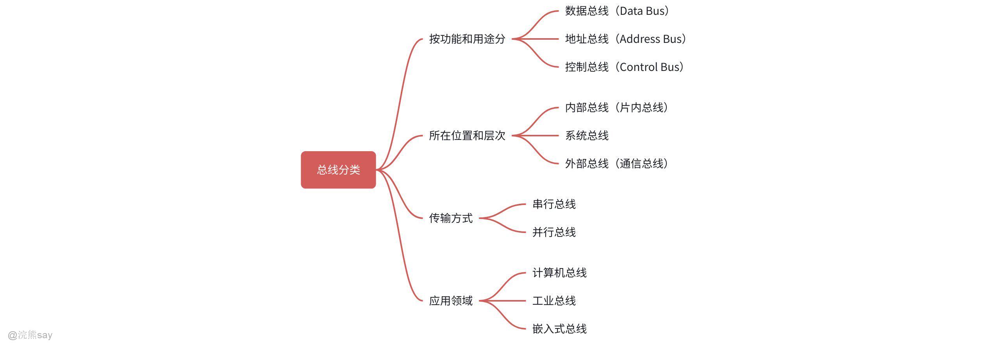

总线是计算机及各类电子系统中实现数据、信号传输与部件协调的关键通路，其分类方式较为丰富，通常可围绕功能用途、位置层次、传输方式、应用领域这4个核心维度展开，具体分类及详情如下：

#### 按功能和用途分类

1.  数据总线（Data Bus）：用于传输数据信息，其宽度直接决定CPU与其他设备单次传输的信息量，常见形式包括32位数据总线、64位数据总线；
2.  地址总线（Address Bus）：承担地址信息的传输，用于明确数据传输的来源或目的地，典型如20位地址总线（支持1MB空间的寻址）；
3.  控制总线（Control Bus）：负责传输控制信号与时序信号，用于协调计算机各部件的操作，常见信号包括读/写控制信号、中断请求信号。

#### 按所在位置和层次分类

1.  内部总线（片内总线）：是CPU内部各功能单元的连接线路，用于实现内部的数据传输与控制，例如CPU寄存器之间、ALU与寄存器间的总线；
2.  系统总线：用于连接CPU、存储器、I/O接口等核心部件，可传输数据、地址及控制信号，具体包括数据总线、地址总线、控制总线；
3.  外部总线（通信总线）：作用于计算机与外部设备、计算机之间的通信，常用类型有USB、IEEE 1394（火线）、RS-232。

#### 按传输方式分类

1.  串行总线：数据以按位依次传输的方式通信，具有速度较慢、线路结构简单、成本较低的特点，适配远距离传输场景，常见类型包括USB、RS-232、SPI、I²C；
2.  并行总线：采用多位数据同时传输的方式，优势是速度快，但线路结构复杂、成本较高，且传输距离较短，典型如早期PCI总线、IDE接口、SCSI。

#### 按应用领域分类

1.  计算机总线：适用于通用计算机系统，具体包括系统总线、外部总线（如USB、PCI）；
2.  工业总线：适配工业控制领域，具有高可靠性、强抗干扰的特性，常用类型有CAN总线、Modbus总线、EtherCAT；
3.  嵌入式总线：针对嵌入式系统设计，可满足体积小、功耗低的使用需求，典型如AMBA（ARM片上总线）、Wishbone总线。

综上，从不同维度对总线进行分类，清晰区分了各类总线的定位、特性与适用场景，能帮助更精准地把握总线在通用计算机、工业控制、嵌入式系统等不同领域中的应用逻辑。

## 总线的组成与特性

### 总线的内部结构

总线内部并非单一线路，而是由 地址总线（Address Bus）、数据总线（Data Bus）、控制总线（Control Bus） 三类核心线路组成，分工明确。
| 总线类型 | 功能 | 关键特点 |
| --- | --- | --- |
| 地址总线（AB） | 传输 CPU 访问内存 / 外设的地址信息，指定数据 “去哪里”。 | 位数决定寻址空间（如 32 位地址总线可寻址 4GB 内存） |
| 数据总线（DB） | 传输实际的数据、指令（如 CPU 与内存间的读写数据、指令内容）。 | 位数决定 “一次传输的数据量”（如 64 位总线一次传 8 字节） |
| 控制总线（CB） | 传输控制 / 时序信号（如 “读 / 写命令”“中断请求”“时钟同步”），协调设备动作。 | 信号双向 / 单向都有（如 CPU 发 “读命令”，外设发 “中断请求”） |

读取内存数据为例，其传输流程可直观体现三类总线的协作：首先地址总线发送 “目标内存地址”，明确读取数据的存储位置；随后控制总线发送 “读命令”，告知内存执行读取操作；最后数据总线接收内存返回的 “数据内容”，完成整个传输过程。

### 总线的物理实现

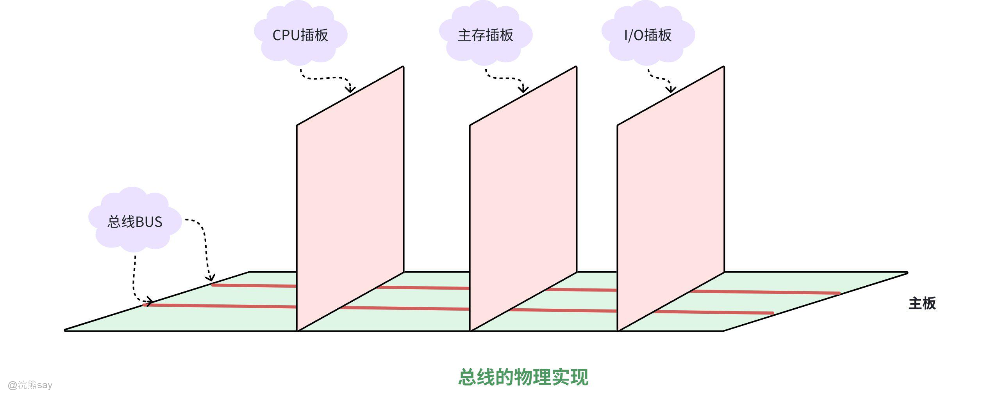

总线的物理实现以主板为核心载体，主板上的 “BUS” 以铜质印刷线路形式存在，地址、数据、控制总线通过主板内部的精密布线形成并行传输通道。CPU 插板、主存插板、I/O 插板等硬件设备，通过底部的 “金手指”（金属触点）与主板总线连接，这些金手指与总线信号（地址、数据、控制）一一对应，设备插入主板插槽后，即可建立稳定的电气通路，实现与总线的信号交互。

## 总线性能指标

总线性能指标反映其数据传输能力、时序特性，核心指标包括 传输周期、时钟周期、工作频率、时钟频率、宽度、带宽、线复用、信号线数 ，逐个解析：

1.  **总线传输周期（总线周期）：**一次总线操作的完整时间，包含 “请求→寻址→传输→结束” 全阶段，由若干总线时钟周期组成 。用来衡量总线完成一次数据交互的 “总耗时”，周期越短，总线响应越快 。
2.  **总线时钟周期：**计算机统一时钟的基本周期，总线操作受其同步控制（总线节奏由计算机主时钟决定 ），是总线传输周期的 “时间颗粒”，总线传输周期 = N× 总线时钟周期（N 为阶段数 ）。
3.  **总线工作频率：**总线 1 秒内完成的操作次数，公式为 工作频率 = 1 / 总线传输周期 ；若总线传输周期含 N 个时钟周期，也可表示为 工作频率 = 时钟频率 / N 。总线工资频率体现总线 “操作密度”，频率越高，单位时间能完成的总线操作越多 。
4.  **总线时钟频率：**计算机主时钟的频率（如常见 1GHz 等 ），是时钟周期的倒数（时钟频率 = 1 / 时钟周期 ）。总线时钟频率的作用是总线时序的 “基准心跳”，决定总线时钟周期长短，影响总线整体速度 。
5.  **总线宽度（总线位宽）：**总线同时传输的数据位数（如 32 位、64 位 ），通常指数据总线的物理线路数量（32 位总线 = 32 根数据线 ）。宽度越大，“一次能传的数据量” 越多，直接提升单次传输效率 。
6.  **总线带宽：**单位时间总线传输的最大字节数（MB/s 等 ），公式为 带宽 = 总线宽度（字节） × 总线工作频率 （注意：总线宽度若为 “位”，需 ÷8 转字节，如 32 位 = 4 字节 ）。示例：33MHz 工作频率 + 32 位（4 字节）宽度 → 带宽 = 33×4=132MB/s ，体现总线 “数据吞吐极限” 。
7.  **总线复用：**同一组信号线，不同时间传输不同类型信息（如地址线、数据线复用 ），总线复用的价值在于减少物理信号线数量，节省硬件成本与空间（比如地址 / 数据复用，少布线但靠时序区分信号 ）。
8.  **信号线数：**地址线、数据线、控制线的总和，体现总线物理线路规模 ，总线复用会减少信号线数（复用后，一组线干多件事，无需单独布线 ）。

## 总线传送方式

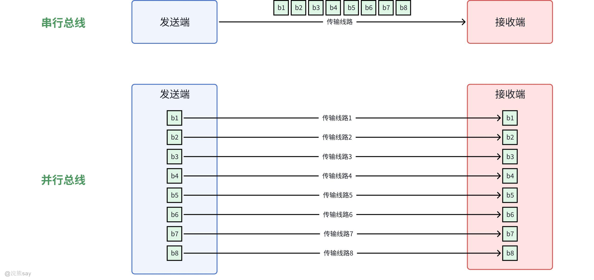

总线的传送方式主要分为串行传送、并行传送和分时传送三类，各类方式根据传输需求平衡速度、成本与效率：

1.  **串行传送:**使用一条传输线，采用脉冲传送，主要优点是只需要一条传输线，这点对长距离传输特别重要，成本比较低廉，缺点就是速度慢。
2.  **并行传送**：为每个数据位配置一条独立传输线，通常采用电位信号同时传输多位数据。相较于串行传送，其传输速度大幅提升，因此出于速度和效率考量，系统总线上的信息传输普遍采用并行传送方式。
3.  **分时传送**：本质是总线的分时复用，即共享总线的多个部件按时间片轮流使用总线。通过合理分配时间资源，实现多个部件对总线的高效共享，避免单一部件长期占用总线导致的资源浪费。

## 总线接口

总线接口是 CPU 与主存、外部设备之间通过总线连接的核心逻辑部件，起到衔接不同硬件、协调信号交互的关键作用。

其典型功能包括控制总线传输时序、缓冲数据以匹配不同部件的速度差异、转换信号格式与协议、整理传输数据格式，以及支持程序中断机制等。一个完整的适配器（即接口）通常包含两个连接端：一端与系统总线相连，采用并行传输方式保障传输效率；另一端与外部设备对接，可根据设备特性灵活采用并行或串行传输方式。

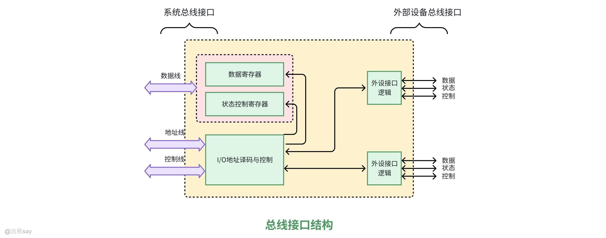

总线接口结构主要分为系统总线接口模块和外部设备接口模块，两者配合实现系统与外部设备的通信，具体如下：

1.  **系统总线接口模块：**这是系统总线与外部设备的中间枢纽，连接系统的数据线、地址线、控制线，并包含三类核心部件：

-   数据寄存器：与系统数据线相连，负责暂存系统和外设之间传输的数据；
-   状态 / 控制寄存器：与系统控制线相连，用于传递外设的状态信息、接收系统的控制信号；
-   I/O 地址译码与控制：与系统地址线相连，解析地址信号以识别目标外设的地址，实现外设寻址。

1.  **外部设备接口模块：**该模块衔接系统总线接口与外部设备，通过 “外设接口逻辑” 对应连接各个外设：每个外设匹配一套外设接口逻辑，负责传递该外设与系统之间的数据、状态、控制信号，完成特定外设与系统的通信交互。

## 总线结构

总线结构直接影响计算机系统的传输效率、扩展性与稳定性，主要分为单总线、双总线、三总线、四总线等类型，同时包含特定功能的 Host 总线及标准化连接方式：

### 单总线结构

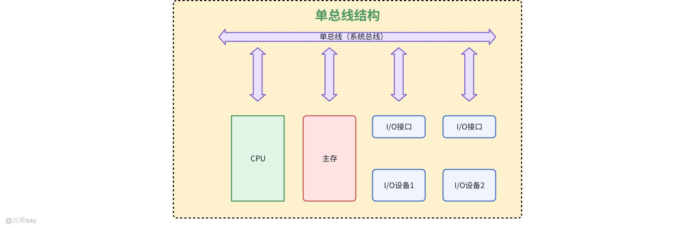

单总线结构将 CPU、主存、I/O 设备（通过 I/O 接口）统一挂接在一组总线上，允许 I/O 设备之间、I/O 设备与主存之间直接交换信息，CPU 与主存、CPU 与外设之间也可直接进行数据交互，无需中间设备干预。需要注意的是，单总线并非指仅含一根信号线，而是按传输信息类型细分为地址总线、数据总线和控制总线三类。该结构的核心优势是设计简单、硬件成本低，且易于接入新设备；但存在明显短板，即总线带宽有限、负载较重，多个部件需争用唯一总线资源，无法支持并发传送操作。因此，连接到单总线上的逻辑部件必须具备高速运行能力，以便在需要时快速获取总线控制权，不用时迅速释放，避免因多部件共用导致的大幅时间延迟。

### 双总线结构

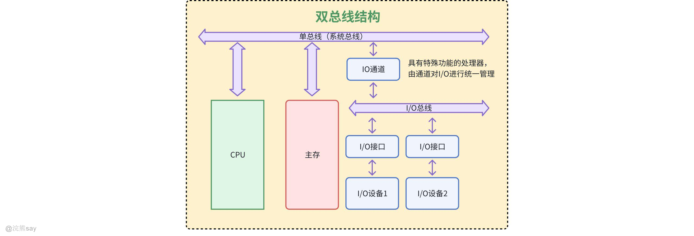

双总线结构通过两条独立总线划分传输职责：一条为主存总线，负责 CPU、主存和通道之间的数据传送；另一条为 I/O 总线，用于多个外部设备与通道之间的通信。这种设计的核心优势是将较低速的 I/O 设备从单总线上分离，实现存储器总线与 I/O 总线的物理隔离，提升了主存与 CPU 之间的传输效率；但相应增加了通道等硬件设备的成本，系统复杂度略有提升。

### 三总线结构

#### 三总线结构1

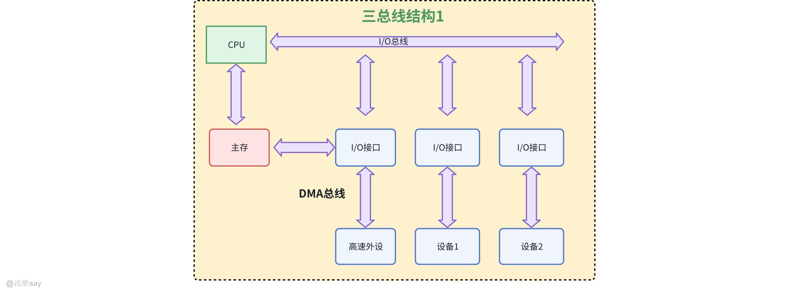

三条总线分别为主存总线、I/O 总线和直接内存访问（DMA）总线。主存总线负责 CPU 与内存之间的地址、数据和控制信息传输；I/O 总线承担 CPU 与各类外设的通信任务；DMA 总线则专门用于内存和高速外设之间的直接数据传送，无需 CPU 干预。该结构的优势是显著提升了 I/O 设备的响应速度和系统吞吐量，尤其适配高速外设的数据传输需求；缺点是总线架构复杂，可能导致系统整体工作效率有所降低。

#### 三总线结构2

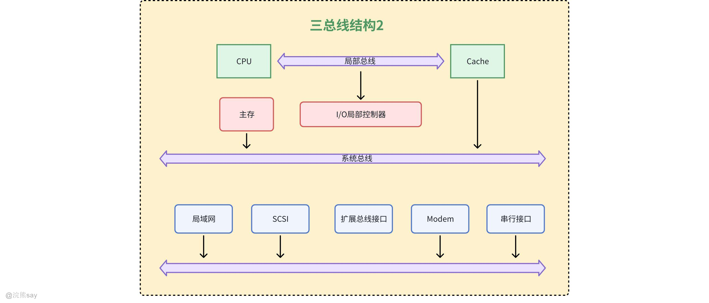

在传统总线基础上新增扩展总线和局部总线。局部总线直接连接 CPU 与 Cache，Cache 再通过系统总线与主存衔接，使得 CPU 优先与高速 Cache 进行数据交互，仅当 Cache 中无目标数据时，才由 Cache 与主存通信并加载数据。所有 I/O 设备通过扩展总线与系统总线、主存建立连接，但该设计的不足是扩展总线上无法区分高速与低速 I/O 设备，可能影响部分设备的传输效率。

### 四总线结构

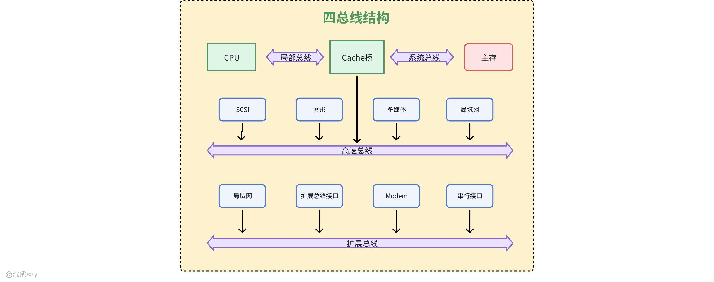

四总线结构在三总线基础上新增一条高速总线，专门用于连接高速 I/O 设备（如高速存储、图形卡等）。该高速总线距离 CPU 和主存较近，数据传输延迟低、速度快；而扩展总线上则集中连接各类低速 I/O 设备，通过总线层级划分，实现高速设备与低速设备的隔离运行，进一步提升系统整体的传输效率和资源利用率。

### 总线的连接方式

总线的连接遵循层级化原则，围绕 CPU、缓存、主存及各类设备，通过不同类型总线与桥接组件实现协同工作：

1.  **CPU与缓存的连接**：CPU和cache之间采用高速的CPU总线连接，以满足两者间高频数据交互需求。
2.  **主存的连接**：主存连接在系统总线上，作为系统数据存储的核心枢纽之一。
3.  **高速设备与高速总线的连接**：

-   高速总线上可接入多种高速设备接口与组件，如100Mb/s的高速LAN、视频接口、图形接口等。
-   还能连接SCSI接口，该接口可支持本地磁盘驱动器及其他外设。
-   以及Firewire接口，其能够支持大容量I/O设备。
-   高速总线通过扩充总线接口与扩充总线相连，扩充总线上可连接以串行方式工作的I/O设备。

1.  **各类总线的桥接连接**：通过桥将CPU总线、系统总线和高速总线相互连接。桥本质上是一种具备缓冲、转换和控制功能的逻辑电路，用于实现不同总线之间的数据传输与协议转换，确保整个系统总线架构的协同工作。

### Host总线

Host 总线又称 CPU 总线、系统总线、主存总线或前端总线，是连接 “北桥” 芯片与 CPU 的核心信息通路，不仅可连接主存，还能支持多个 CPU 的互联。总线上通常还挂接有 L2 级 Cache、主存与 Cache 控制器芯片，后者负责管理 CPU 对主存和 Cache 的存取操作。CPU 默认拥有 Host 总线的控制权，在必要情况下（如 DMA 传输需求）可主动放弃总线控制权，确保其他核心部件的高效数据传输。

## 真题
| 【国家电网2019】下列陈述中正确的是()。A. 总线结构传送方式可以提高数据的传输速度B. 与独立请求方式相比，链式查询方式对电路的故障更敏感C. PCI 总线采用同步时序协议和集中式仲裁策略D. 总线的带宽即总线本身所能达到的最高传输速率答案 ：BCD解析 ：总线结构传送方式虽然简单，但由于所有设备共享一条总线，实际上会降低数据传输速度。与独立请求方式相比，链式查询方式对电路的故障更敏感，因为一个设备的故障可能导致整个链路中断。PCI 总线确实采用同步时序协议和集中式仲裁策略。总线的带宽定义为总线本身所能达到的最高传输速率。 |
| --- |

| 【国家电网2015】一次总线事务中，主设备只需给出一个首地址，从设备就能从首地址开始的若干连续单元格读出或写入的多个数据，这种总线事务方式称为()。A. 并行传输B. 串行传输C. 突发D. 同步答案 ：C解析 ：猝发(突发)传输是在一个总线周期中可以传输多个存储地址连续的数据，即一次传输一个地址和一批地址连续的数据。并行传输是在传输中有多个数据位同时在设备之间进行的传输。串行传输是指数据的二进制代码在一条物理信道上以位为单位按时间顺序逐位传输的方式。同步传输是指传输过程由统一的时钟控制。 |
| --- |

## 总线仲裁

## 什么是总线仲裁？

总线是计算机系统中各功能模块（如 CPU、内存、外设等）之间传输数据、地址和控制信号的公共通道，其资源具有唯一性 —— 同一时刻仅能支持一组设备进行数据交互。当多个设备同时需要使用总线时，会产生访问冲突，导致数据传输错误或系统瘫痪。

**总线仲裁**就是解决总线访问冲突的核心机制：它通过预设的规则和逻辑，对多个设备的总线请求进行优先级判断和权限分配，确保在任意时刻仅有一个设备获得总线控制权，同时兼顾访问的公平性、高效性和系统可靠性，是保障总线有序、稳定工作的关键技术。总线仲裁一般可以分为两类，集中式仲裁和分布式仲裁，下面将介绍两种仲裁方式的区别。

## 集中式仲裁

集中式仲裁的核心是通过**中央仲裁器（Arbiter）** 统一管理多个设备的总线访问请求，确保同一时刻仅单个设备获得总线控制权，从根源上避免访问冲突，是总线仲裁中应用广泛的一类方式。

### 链式查询方式

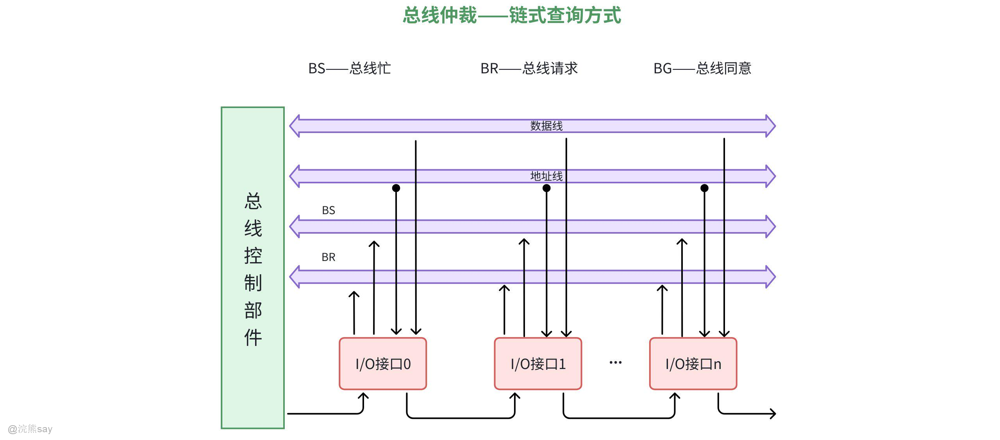

设备按固定顺序串联形成 “仲裁链”，中央仲裁器通过 1 条总线请求线接收所有设备的访问请求，再通过 1 条总线授权线（Grant 信号）沿仲裁链依次传递授权。设备发出请求后，仲裁器触发授权信号从链首开始逐设备传递，首个接收到授权信号的请求设备立即获得总线控制权，后续设备请求暂时被忽略；设备使用总线完毕后释放控制权，仲裁器重新响应新的请求。

链式查询的优点在于硬件电路简单、成本低且易于扩展设备，但仲裁效率较低（授权信号需逐设备传递），存在固定优先级特性（链首设备优先级最高），链尾设备可能出现 “饥饿” 现象（长时间无法获得授权），适用于低速外设、简单系统等场景。

### 计数器定时查询方式

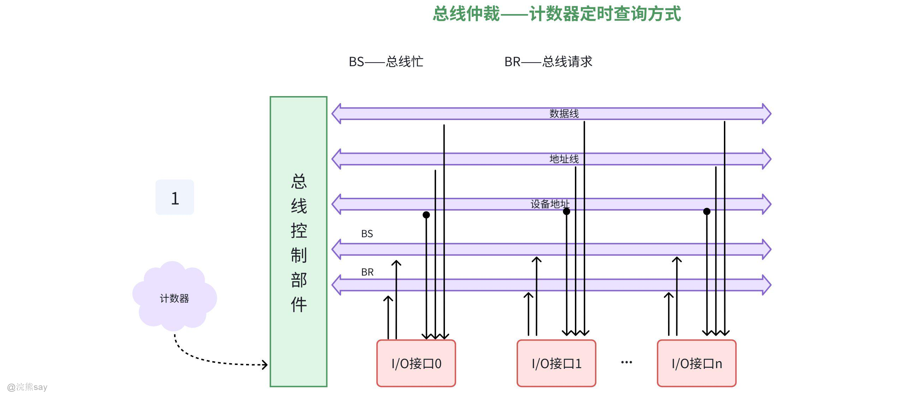

中央仲裁器内置计数器，通过 1 条总线请求线收集设备请求，再通过 N 条设备地址线向各设备发送查询信号。设备发出请求后，仲裁器启动计数器（从 0 或指定值开始计数），计数器值通过地址线同步发送；对应地址的设备若存在请求，立即获得总线控制权，计数器停止计数；若该设备无请求，计数器持续计数直至找到有请求的设备。

优先级可通过计数器初始值灵活调整（如从上次结束位置开始计数实现轮询），能有效避免设备 “饥饿”；相比链式查询，需额外配置地址线，硬件复杂度中等，仲裁效率处于中间水平，适用于中等规模系统、需均衡优先级的场景。

### 独立请求方式

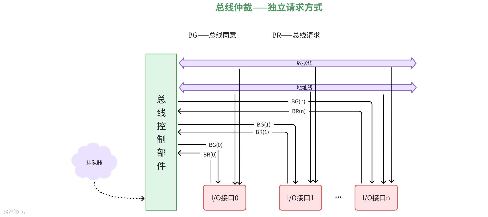

每个设备均配备独立的请求线和授权线，直接与中央仲裁器相连，仲裁器根据预设优先级（固定优先级、循环优先级等）或特定算法处理所有设备请求。各设备通过专属请求线向仲裁器发送访问请求，仲裁器依据优先级逻辑判断优先授权对象，通过对应设备的授权线发送 Grant 信号；获得授权的设备使用总线，完成操作后释放控制权。

仲裁速度最快（无需逐设备查询），优先级控制灵活且可动态调整，无设备 “饥饿” 问题；但硬件复杂度最高（请求线和授权线数量与设备数成正比）、成本较高，适用于高速总线系统、多处理器系统等对仲裁效率要求高的场景。

### 三种方式表格对比
| 仲裁方式 | 请求 / 授权线数量 | 仲裁效率 | 硬件复杂度 | 典型应用场景 |
| --- | --- | --- | --- | --- |
| 链式查询方式 | 1 条请求线 + 1 条授权线 | 低 | 低 | 低速外设、简单系统 |
| 计数器定时查询方式 | 1 条请求线 + N 条地址线 | 中 | 中 | 中等规模系统、需均衡优先级场景 |
| 独立请求方式 | N 条请求线 + N 条授权线 | 高 | 高 | 高速总线、多处理器系统 |

## 分布式仲裁

分布式仲裁无需设置中央仲裁器，每个潜在的主方功能模块均配备独立的仲裁号和仲裁器，各模块地位平等，通过分布式逻辑自主完成仲裁决策。这种设计避免了因中央仲裁器故障导致的整体系统瘫痪，显著提升了仲裁方案的容错能力和系统整体可靠性。

其工作原理为：当多个模块同时发起总线请求时，各模块将自身唯一的仲裁号发送至共享仲裁总线；每个模块的仲裁器会将总线上的仲裁号与自身仲裁号进行比较，若总线上的仲裁号更大，则该模块撤销自身仲裁号并放弃请求；最终，仲裁总线上仅保留获胜者的仲裁号，对应模块获得总线控制权

## 真题
| 【国家电网2015】一次总线事务中，主设备只需给出一个首地址，从设备就能从首地址开始的若干连续单元格读出或写入的多个数据，这种总线事务方式称为()。A. 并行传输B. 串行传输C. 突发D. 同步答案 ：C解析 ：猝发(突发)传输是在一个总线周期中可以传输多个存储地址连续的数据，即一次传输一个地址和一批地址连续的数据。并行传输是在传输中有多个数据位同时在设备之间进行的传输。串行传输是指数据的二进制代码在一条物理信道上以位为单位按时间顺序逐位传输的方式。同步传输是指传输过程由统一的时钟控制 |
| --- |

| 【国家电网2018】在集中式总线仲裁中,（ ）方式对电路故障最敏感。A、链式查询B、计数器定时查询C、独立请求D、以上均不对答案 ：A解析 ：链式查询方式是设备按固定顺序串联形成"仲裁链"，中央仲裁器通过 1 条总线请求线接收所有设备的访问请求，再通过 1 条总线授权线沿仲裁链依次传递授权。由于采用链式结构，一个设备的故障可能导致整个链路中断，因此对电路故障最敏感。 |
| --- |

## 总线操作和定时

## 总线周期

总线周期（Bus Cycle），也称为总线事务（Bus Transaction），是指 CPU 或其他主设备通过总线与内存、I/O 接口等外部设备完成一次数据传输所需的时间，同时也是计算机系统总线操作的基本时间单位。总线周期的时长由若干个时钟周期构成，具体周期数量取决于总线类型、数据传输方式以及主从设备的运行速度。

一个完整的总线周期通常包含四个核心阶段，不同总线标准（如 ISA、PCI、PCIe）的具体实现会存在一定差异，各阶段的功能如下：

1.  **申请阶段（总线请求与仲裁）**：主设备向总线仲裁器发送总线控制权申请，仲裁器依据集中式或分布式等仲裁算法进行裁决，最终仅授权一个主设备占用总线，以此避免总线冲突。
2.  **寻址阶段（地址传输）**：获得总线控制权的主设备通过地址总线发送目标设备的地址信息，包括内存地址或 I/O 端口地址，地址信号经译码器解析后，精准选中对应的从设备（如存储器芯片、外设接口）。
3.  **数据传输阶段（读写操作）**：此阶段是总线周期的核心环节，主从设备通过数据总线完成数据交互，同时控制总线发送 RD#、WR# 等读写控制信号协调传输时序。其中，读操作是主设备从从设备读取数据，写操作则是主设备向从设备写入数据。
4.  **结束阶段（总线释放）**：数据传输完成后，主设备释放总线控制权，相关控制信号恢复初始状态，总线回归空闲状态，等待下一次总线请求。

## 总线定时：同步方式

### 总线定时的作用

总线定时是通过时钟信号或控制信号，协调总线上各设备数据传输时序关系的机制，其核心目标是确保主设备（如 CPU）与从设备（如内存、外设）在数据发送、接收和控制信号交互过程中保持时序一致。具体作用体现在三个方面：一是实现时序协调，统一各设备的操作节奏，避免因设备速度差异引发数据传输错误（如数据未准备就绪就被读取）；二是优化传输效率，借助同步或异步等合理的定时规则，平衡传输速度与设备兼容性，提升总线带宽利用率；三是保障跨设备兼容，为不同速度、不同类型的设备（如高速 CPU 与低速外设）提供标准化的时序接口，确保跨设备通信的可靠性。

### 同步方式的概念

同步总线定时（Synchronous Timing）是指总线操作由统一的系统时钟信号驱动，总线上所有数据传输和控制信号的发送、接收，均以时钟周期为基准开展。在该方式下，所有设备共享一个公共时钟源，时钟周期的上升沿或下降沿被作为操作的时间基准（如 PCI 总线以 33MHz 时钟为基准）；同时数据传输的寻址、数据读写等每个阶段，都占用固定数量的时钟周期，各阶段的时序关系预先定义且需被严格遵循（如读操作需在地址发送后 2 个时钟周期内完成数据传输）。

### 同步方式的特点

#### 同步方式优势

1.  传输效率高：固定时钟周期内的操作时序明确，无需等待从设备响应，主设备可按预设节奏连续发送地址和数据（如突发传输时连续读取多个内存单元），适合高速同步设备（如 CPU 与缓存、高速内存）的通信。
2.  控制逻辑简单：无需复杂的应答机制，仅需根据时钟信号同步操作，硬件设计成本低（如 ISA、PCI 总线采用同步定时）。
3.  时序可预测性强：每个操作的开始和结束时间由时钟严格定义，便于系统调试和性能分析（如通过时钟频率直接计算最大传输率）。

#### 同步方式缺点

1.  兼容性差：若总线上接入低速设备（如传统外设），高速时钟会迫使低速设备必须在固定周期内完成操作，可能导致数据传输失败（需额外插入等待周期，降低效率）。
2.  时钟偏移问题：当总线长度较长或设备数量较多时，时钟信号到达各设备的时间存在差异（时钟偏移），可能导致时序混乱，限制总线扩展能力（如 PCI 总线长度通常不超过 30cm）。
3.  功耗与噪声：高频时钟信号会增加总线功耗，且长距离传输时易产生电磁干扰（EMI），需额外设计信号完整性措施（如 PCIe 采用差分信号缓解此问题）。

## 总线定时：异步方式

### 异步方式的概念

异步总线定时（Asynchronous Timing）是一种不依赖统一系统时钟的总线时序协调机制，其核心是通过主设备与从设备之间的**握手信号（Handshaking Signals）** 来管控数据传输流程。该机制以 “请求 - 应答” 的闭环逻辑为基础，主设备发出读、写等操作请求信号后，需等待从设备反馈数据准备好、操作完成等应答信号，双方会根据实际传输需求动态确定各操作阶段的时间间隔，摆脱了固定时钟周期的约束。

### 异步方式的特点

#### 同步方式优势

1.  兼容性强：可适配不同速度的设备（如高速 CPU 与低速外设），从设备根据自身处理能力决定应答时间。例如：USB 接口通过 “数据有效”（DATA VALID）和 “准备好接收”（READY TO RECEIVE）信号，允许低速 U 盘与高速主机通信时自动调整传输节奏。
2.  无时钟偏移问题：不依赖公共时钟源，避免了长距离传输时的时钟同步误差，适合扩展总线长度或连接分布式设备（如 PCIe 总线采用异步差分信号，传输距离可达数米）。
3.  功耗优化：仅在数据传输时激活信号，空闲时功耗较低（如 I2C 总线在非通信状态下保持低电平，减少待机功耗），适合嵌入式系统或低功耗设备。

#### 同步方式缺点

1.  传输效率波动：每次操作需等待应答信号，存在额外的延迟（如请求与应答的信号传输时间），高速设备间的通信效率可能低于同步定时（如 DDR 内存若采用异步方式，需频繁等待应答，无法实现突发传输）。
2.  控制逻辑复杂：需设计复杂的握手协议（如多级应答状态机），硬件实现成本高（如 USB 控制器需处理不同设备的应答时序差异）。
3.  时序调试困难：操作时序不固定，难以通过固定时钟周期预测故障点，系统调试需依赖实时信号监测（如逻辑分析仪抓取握手信号波形）。

### 异步方式的类型

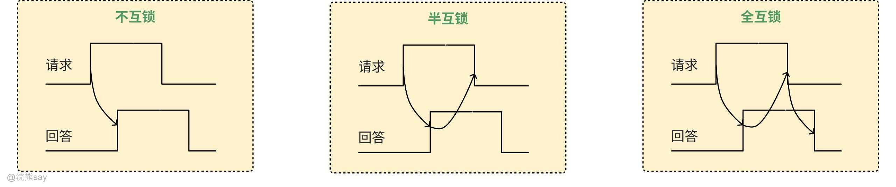

异步通信方式的核心是通过 “请求” 与 “回答” 两类握手信号协调总线传输，主要分为**不互锁、半互锁、全互锁**三种实现逻辑，三者的差异在于握手信号的确认机制，呈现出从灵活到严谨的递进关系。

1.  **不互锁方式**主设备发送 “请求” 信号后，无需等待从设备回应即可完成信号发送；从设备接收到 “请求” 信号后发送 “回答” 信号，双方均无需确认对方的信号是否结束，仅按照自身时序完成操作。这种方式的时序灵活性最高，但可靠性最差，若信号传输延迟差异较大，极易出现 “请求 / 回答” 信号错位的情况，进而引发通信错误。
2.  **半互锁方式**主设备发送 “请求” 信号后会保持该信号有效，直到检测到从设备的 “回答” 信号才撤销 “请求”；从设备收到 “请求” 信号后发送 “回答” 信号，发送完成后无需等待主设备撤销 “请求”，可自行结束 “回答” 信号。相较于不互锁方式，半互锁方式通过主设备等待应答的设计提升了一定可靠性，但仍存在风险，比如从设备的 “回答” 信号可能因主设备未及时响应而出现失控问题。
3.  **全互锁方式**该方式遵循完整的闭环握手流程：主设备发送 “请求” 信号→从设备接收后反馈 “回答” 信号→主设备收到 “回答” 后撤销 “请求”→从设备检测到 “请求” 撤销后，再撤销 “回答” 信号。全互锁方式的可靠性最高，通过严格的双向信号确认机制，能够适配不同设备、不同传输延迟的复杂场景，但也存在时序控制逻辑复杂的问题，信号交互次数的增加会带来额外的总线传输开销。

简单说，三种异步方式是“握手信号”确认机制的递进：不互锁完全“自由”、半互锁主设备等确认、全互锁双方互相等待确认，以此平衡通信效率与可靠性 ，让总线在无统一时钟的设备间，也能协调数据传输时序。
| 类型 | 请求与应答互锁关系 | 可靠性 | 传输效率 | 典型场景 |
| --- | --- | --- | --- | --- |
| 非互锁方式 | 无依赖，自动撤销 | 低 | 高（无等待） | 简单低速外设 |
| 半互锁方式 | 请求依赖应答撤销，应答独立 | 中 | 中 | 通用串口、部分并行接口 |
| 全互锁方式 | 请求与应答双向互锁 | 高 | 低（四次交互） | USB、SATA、PCIe 等高速接口 |

| 【练习题】在下列各种情况中，最应采用异步传输方式的是( )。A.1/0接口与打印机交换信息B.CPU与主存交换信息C.CPU和 PC总线交换信息D.由统一时序信号控制方式下的设备答案： A解析：(1)在异步定时方式中，没有统一的时钟，也没有固定的时间间隔，完全依靠传送双方相互制约的“握手”信号来实现定时控制。(2)1/0接口和打印机之间的速度差异较大，应采用异步传输方式来提高效率。异步定时方式能保证两个工作速度相差很大的部件或设备之间可靠地进行信息交换。(3)在速度不同的设备之间进行数据传送，应选用异步控制，虽然采用同步控制也可以进行数据的传送，但是不能发挥快速设备的高速性能。 |
| --- |

| 【练习题】同步通信与异步通信相比传输速度较快的原因是()。A.同步通信使用公共时钟进行同步B.同步通信不需要等待应答信号C.进行同步通信的部件运行速度相近D.以上都正确答案： D解析：(1)同步通信使用统一的时钟信号，不需要等待回答，所以传输速度较快。(2)另外因为同步通信总线周期的选择应以满足总线上速度最慢的设备的需要为原则所以要求进行同步通信的设备运行速度比较接近，因此，此题应选 D。 |
| --- |

## 总线定时：半同步方式

### 半同步方式概念

半同步方式是一种介于同步总线与异步总线之间的总线定时机制，它融合了两者的核心优势，既保留同步总线的统一时钟信号以保障基本时序同步，又引入**等待状态（Wait State）** 机制来适配不同设备的速度差异，有效解决了同步总线中主从设备速度不匹配的问题。

该方式的核心运行逻辑为：系统以总线时钟信号统一控制基本操作周期，主从设备需在时钟周期的特定边沿（如上升沿、下降沿）完成信号采样或操作执行，以此保证时序的基本一致性；当从设备（如低速外设）无法在预设时钟周期内完成数据传输或响应时，可向主设备发送**等待请求（Wait Request）** 信号，触发主设备插入额外的时钟周期（即等待状态），直至从设备准备就绪后再继续传输流程，避免因速度差异引发数据错误。这种设计让半同步方式兼具高速设备所需的同步时序效率，以及适配低速设备的灵活性，适用于主从设备速度差异较大的计算机系统。

### 半同步方式示例

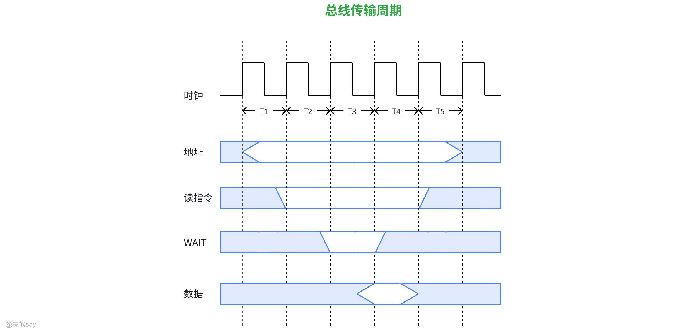

以早期 Intel 8086 微处理器总线为例，可清晰体现半同步方式的工作流程，典型场景为**CPU（主设备）向存储器（从设备）读取数据**：

1.  系统由 CPU 提供统一时钟信号（CLK），每个时钟周期划分为 T1、T2、T3、T4 四个阶段。
2.  **T1 周期**：CPU 向总线发送目标地址信号与读命令，此时地址信号处于有效状态，从设备开始接收并解析指令。
3.  **T2 周期**：CPU 采样从设备反馈的 “准备好（Ready）” 信号，触发两种传输分支：若存储器速度足够快，Ready 信号为高电平，数据将在 T3 周期进入有效状态，流程按正常读操作推进；若存储器速度较慢，Ready 信号为低电平，代表从设备向 CPU 发送等待请求，CPU 会在 T2 周期结束后插入等待状态（Tw 周期）。
4.  **Tw 周期**：CPU 持续采样 Ready 信号，该等待状态会循环直至存储器完成数据准备，Ready 信号转为高电平，随即退出等待状态进入 T3 周期。
5.  **T3 周期**：存储器将待读取数据放置到数据总线上，CPU 在 T3 周期结束时完成数据采样。
6.  **T4 周期**：读操作正式完成，总线释放控制权回归空闲状态。

## 总线定时：分离方式

### 同步、异步、半同步方式特点
| 类型 | 核心特点 | 优势 | 局限性 |
| --- | --- | --- | --- |
| 同步方式 | 由统一时钟信号控制所有操作，每个步骤在固定时钟周期内完成，主从设备严格同步。 | 时序简单、传输效率高、控制逻辑简单。 | 主从设备速度需严格匹配，灵活性差。 |
| 异步方式 | 无统一时钟，依赖握手信号（Request/Acknowledge）控制传输，操作周期可变。 | 完全适配不同速度设备，灵活性高。 | 握手信号延迟可能降低效率，时序控制复杂。 |
| 半同步方式 | 基于统一时钟，但允许插入等待状态（Wait State）适应设备速度差异。 | 兼顾同步的效率和异步的灵活性。 | 等待状态仍可能引入额外周期，效率非最优。 |

### 分离式通信实现

分离式通信是总线定时的进阶优化方案，其核心设计思想是**将一次完整的总线传输过程拆分为多个独立阶段**，允许主从设备在各阶段分时占用总线，以此实现总线资源的高效复用。

以读操作为例，分离式通信的工作流程分为三个独立阶段：

1.  **主设备申请与地址传输阶段**：主设备（如 CPU）向总线仲裁器发起使用权申请，获批后向总线发送目标地址信号与读命令，明确告知从设备（如存储器）数据读取的目标位置，随后立即释放总线控制权。
2.  **从设备数据准备阶段**：从设备接收地址与命令后，独立开展数据读取操作（如访问目标存储单元），此阶段总线处于空闲状态，其他设备可向仲裁器申请总线使用权并开展传输任务。
3.  **从设备申请与数据传输阶段**：从设备完成数据准备后，向总线仲裁器发起使用权申请，获批后将数据与应答信号发送至主设备，完成数据传输后释放总线，整个读操作流程结束。

### 分离式通信特点

#### 分离式通信优势

1.  总线利用率大幅提升：传输过程中总线空闲阶段可被其他设备使用，避免传统方式中主从设备独占总线导致的资源浪费。例如，从设备准备数据时，总线可同时处理其他设备的请求，理论上总线利用率接近 100%。
2.  支持多设备并行操作：允许多个主设备或从设备分时使用总线，适合多处理器或高速外设并发工作的系统（如大型服务器、高性能计算机）。
3.  适配高速与低速设备：低速设备准备数据时不占用总线，高速设备可优先获取总线资源，解决了同步 / 半同步方式中低速设备拖累整体效率的问题。
4.  降低系统功耗：设备无需持续占用总线，空闲时可进入低功耗状态，尤其适用于移动设备或功耗敏感的系统。

#### 分离式通信局限性

1.  控制逻辑复杂：需实现双向总线申请、仲裁机制及数据传输的状态跟踪，硬件设计难度较高，成本增加。
2.  传输延迟略有增加：由于拆分为多个阶段，每次总线申请和释放需额外的仲裁时间，对于极短数据传输（如单字节）可能效率反而降低。
3.  时序同步要求高：主从设备需严格遵循分离式通信协议，否则可能出现数据传输错误或总线冲突，对系统设计规范性要求高。

#### 分离式通信应用场景

1.  高性能计算机总线：如 PCIe（Peripheral Component Interconnect Express）总线采用类似分离式通信的机制，支持多设备并发传输，满足高速数据交换需求。
2.  分布式系统总线：在多处理器或多核系统中，分离式通信可减少总线竞争，提升系统整体吞吐量。
3.  嵌入式系统的高速总线：如 ARM AMBA（Advanced Microcontroller Bus Architecture）中的 AXI 总线，通过分离事务机制实现高效数据传输。

## 总线标准

## 什么是总线标准

总线标准是为规范计算机系统内处理器、存储器、外设等各类组件间的数据传输、控制信号交互及物理连接而制定的统一技术规范。它明确界定了总线的**电气特性**（如电压等级、信号电平标准）、**机械特性**（如接口形状、引脚数量与排布）、**功能特性**（如信号定义、时序逻辑关系）和**协议规范**（如数据传输流程、总线仲裁机制），核心目标是保障不同厂商生产的硬件设备能够无缝兼容、协同工作。

## 典型总线

### 系统总线标准？

系统总线标准是专门针对计算机主机内部核心组件互联的总线规范，是计算机系统架构的核心组成部分，主要解决主机内部高速数据传输与多设备协调调度的问题，常见的系统总线标准如下：

1.  **PCIe（Peripheral Component Interconnect Express）**采用串行差分信号传输技术，通过灵活的 “链路宽度”（如 x1、x16）实现带宽线性扩展，其中 PCIe 5.0 x16 的理论带宽可达 512GB/s。该标准主要用于连接显卡、NVMe 固态硬盘、高速网卡等高性能外设，是现代台式机与服务器的主流系统总线。
2.  **DMI（Direct Media Interface）**由 Intel 推出的高速点对点总线，核心功能是实现 CPU 与南桥芯片的通信，采用串行传输模式，DMI 3.0 的带宽可达 8GB/s。它替代了传统的 FSB 总线，简化了主板架构设计，有效降低了组件间的数据传输延迟。
3.  **QPI（QuickPath Interconnect）**是 Intel 面向多处理器架构推出的互联总线，支持处理器节点间的高速数据传输，QPI 2.0 单链路带宽可达 25.6GB/s。其主要应用于服务器多 CPU 系统，可实现处理器之间的缓存一致性维护与数据高效共享。
4.  **AMBA（Advanced Microcontroller Bus Architecture）**由 ARM 公司定义的片内总线标准，包含 AXI、AHB、APB 等多个子标准，可分别适配高性能计算与低功耗控制场景。该标准广泛应用于嵌入式系统的 SoC 内部，负责 CPU 与外设控制器等组件的互联。

系统总线标准需具备四项关键特性：一是**高速传输能力**，满足 CPU 与内存、高性能外设间的高带宽需求，例如 DDR5 内存总线带宽可达 50GB/s 以上；二是**低延迟设计**，通过优化传输协议减少数据交互延迟，如 PCIe 的传输延迟约为 100ns；三是**多设备仲裁机制**，支持多个设备同时发起总线申请，借助优先级或公平算法进行调度，如 PCIe 采用基于信用的流量控制机制；四是**电源管理功能**，支持设备在空闲状态下进入 L0s、L1 等低功耗模式，降低系统整体能耗。

### 设备总线标准
| 标准 | 传输速率 | 典型应用 | 特点 |
| --- | --- | --- | --- |
| USB 4 | 40Gbps | 外接硬盘、显示器 | 高速、双向、支持多设备级联 |
| PCIe 5.0 | 每通道 4GB/s | 显卡、NVMe 硬盘 | 高带宽、低延迟，支持热插拔 |
| HDMI 2.1 | 48Gbps | 8K 电视、游戏主机 | 音视频同步传输，支持动态刷新率 |
| CANopen | 最高 1Mbps | 工业机器人、汽车电控系统 | 抗干扰性强，支持多节点实时通信 |
| SATA III | 600MB/s | 机械硬盘、SATA 固态硬盘 | 成本低，兼容性好，逐渐被 PCIe 取代 |

## PCI总线

### PCI总线概念

PCI（Peripheral Component Interconnect，外设组件互连标准）是一种由英特尔（Intel）在 1992 年推出的高性能局部总线标准，用于连接计算机内部的处理器、芯片组、存储设备及外设（如显卡、声卡、网卡等）。它定义了硬件接口规范和软件协议，实现了高速数据传输和设备扩展能力，曾是个人计算机中最主流的总线标准之一。

### PCI总线特点

1.  高速数据传输：早期 PCI 总线工作频率为 33MHz，32 位带宽下传输速率可达 132MB/s；后期 64 位、66MHz 的 PCI 总线速率提升至 528MB/s，满足高速外设（如显卡、磁盘阵列）的需求。
2.  即插即用（Plug-and-Play）：支持自动配置设备资源（如中断请求 IRQ、内存地址空间），无需手动设置跳线或 DIP 开关，简化硬件安装流程。
3.  兼容性强：独立于处理器架构，可适配 x86、RISC 等多种处理器，且支持多主设备（Multiple Master）架构，允许多个设备同时控制总线。
4.  扩展性灵活：通过 PCI 桥（Bridge）可扩展多个 PCI 总线分支，或与其他总线（如 ISA、AGP）兼容，支持设备热插拔（部分场景）。
5.  低功耗设计：采用 5V 或 3.3V 电压标准，减少硬件功耗，适配桌面和服务器场景。

### PCI总线仲裁方式

PCI 总线采用同步时序协议与集中式仲裁策略，具备完善的自动配置能力。总线上的设备可灵活充当主设备、从设备，或兼具两种身份，仲裁器会根据预设规则合理分配总线使用权，保障多设备并发请求下的有序通信。

### 桥

系统中可部署多条 PCI 总线，这些总线既可以通过 HOST 桥与 HOST 总线相连，也能够借助 PCI/PCI 桥与已接入 HOST 总线的 PCI 总线互联，以此扩充 PCI 总线的负载能力。

在 PCI 总线体系结构中存在三种桥接设备，其中 HOST 桥同时承担 PCI 总线控制器的角色，内置中央仲裁器。桥是连接两条总线的核心转换部件，不仅能实现不同总线间的通信交互，还可将一条总线的地址空间映射到另一条总线的地址空间中，确保系统内任意一个总线主设备都能访问统一的地址表。

桥的结构可根据应用需求灵活设计，结构简单的桥仅具备信号缓冲与信号电平转换功能；功能复杂的桥则集成了规程转换、数据缓存、数据分拆与组装等高级功能，满足高复杂度的总线互联需求。

## 真题
| 【国家电网2016】下列选项中，用于设备和设备控制器（I/O 接口）之间互连的接口标准是（）。A. PCIB. USBC. AGPD. PCI-Express答案：B解析：USB 是设备与 I/O 接口间的互连标准，PCI、AGP、PCI-Express 是总线标准（连接主机与 I/O 接口）。 |
| --- |

| 【练习题】一次总线事务中，主设备只需给出一个首地址，从设备就能从首地址开始的若干连续单元格读出或写入的多个数据，这种总线事务方式称为()。A.并行传输B.串行传输C.突发D.同步答案：C解析:(1)猝发(突发)传输是在一个总线周期中可以传输多个存储地址连续的数据，即一次传输一个地址和一批地址连续的数据。(2)并行传输是在传输中有多个数据位同时在设备之间进行的传输。(3)串行传输是指数据的二进制代码在一条物理信道上以位为单位按时间顺序逐位传输的方式。(4)同步传输是指传输过程由统一的时钟控制。 |
| --- |

## 真题
| 【国家电网2016】多处理机机间互连一般有()等几种形式。A. 总线B. 环行互连C. 交叉开关D. 多端口存储器答案 ：ABCD解析 ：多处理机互连形式包括总线、环形互连、交叉开关、多端口存储器等，故全选 |
| --- |

| 【国家电网2023】以下关于总线的叙述中,正确的是()。A. 并行总线适合近距离高速数据传输B. 串行总线适合长距离数据传输C. 单总线结构在一个总线上适应不同种类的设备,设计简单且性能很高D. 专用总线在设计上可以与连接设备实现最佳匹配答案 ：ABD解析 ：单总线结构是所有设备挂载在一条总线上，需要传输时按优先级顺序决定哪个设备优先使用。设计简单节省费用，但很明显性能不高，设备需要等待 |
| --- |

| 【国家电网2019】下列陈述中正确的是()。A. 总线结构传送方式可以提高数据的传输速度B. 与独立请求方式相比，链式查询方式对电路的故障更敏感C. PCI 总线采用同步时序协议和集中式仲裁策略D. 总线的带宽即总线本身所能达到的最高传输速率答案 ：BCD解析 ：总线结构传送方式虽然简单，但由于所有设备共享一条总线，实际上会降低数据传输速度。与独立请求方式相比，链式查询方式对电路的故障更敏感，因为一个设备的故障可能导致整个链路中断。PCI 总线确实采用同步时序协议和集中式仲裁策略。总线的带宽定义为总线本身所能达到的最高传输速率 |
| --- |

|   |
| --- |
