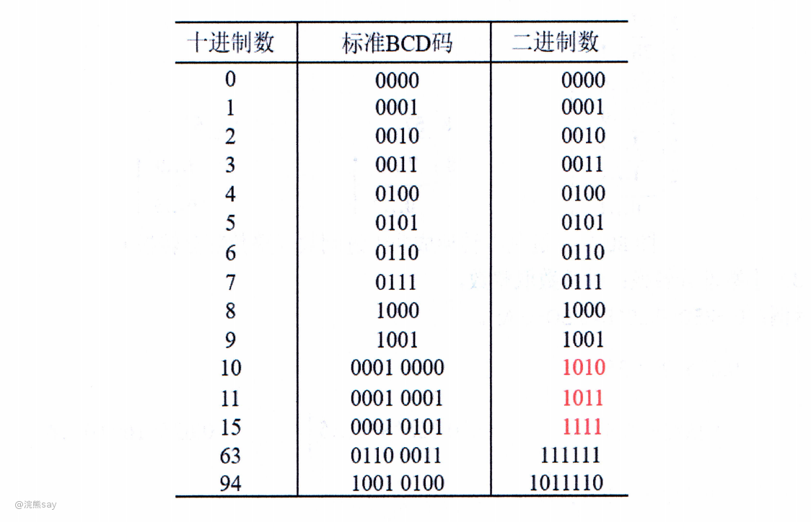
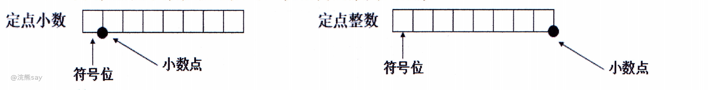
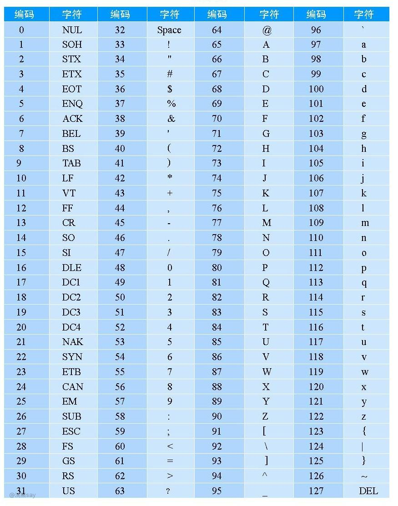
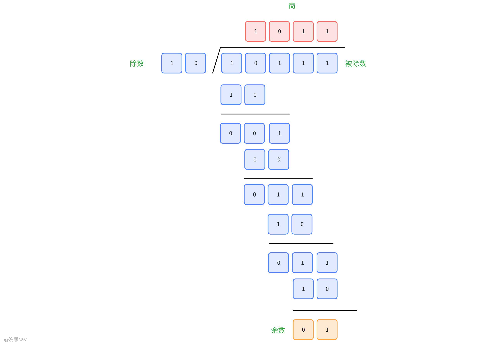
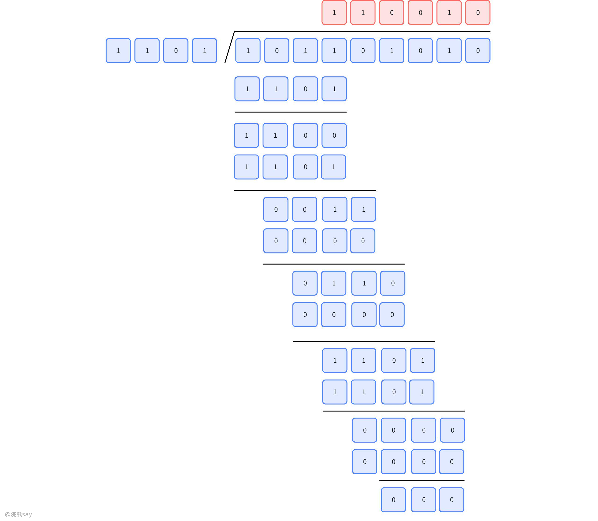

# **数制与码制**

## 数制

## 数制概念

数制是对数量的抽象化、标准化表达体系，通过固定数字符号与统一规则实现数值的计量、运算与传递。从人类日常使用的十进制，到计算机底层依赖的二进制，再到简化二进制的十六进制、八进制，不同数制因基数与位权的差异适配不同场景，共同构成了 “人类交互 - 机器运算” 的数值沟通桥梁。

### 数制的定义与三要素

数制的核心是 “用规则定义符号的价值”，其三要素（基数、位权、进位规则）是区分不同数制的关键，也是理解数制转换与运算的基础，明确这一概念是掌握各类进制特性的前提。

数制（Number System）本质是用一组固定数字符号和统一规则表示数值的方法，核心作用是将抽象数量转化为可记录、可运算的符号组合。不同数制的差异源于三要素的不同，三者相互协同构成完整的数值表达逻辑：​

1.  基数指该数制允许使用的数字符号个数，例如十进制基数为 10（包含 0-9），二进制基数为 2（包含 0-1），十六进制基数为 16（包含 0-9、A-F）；
2.  位权是每个数字位的 “价值权重”，由基数的幂次决定（从右往左数，第 n 位的位权为 “基数 ^(n-1)”），是数值计算的核心依据；
3.  进位规则是数值超出基数范围时的进位逻辑，例如十进制 “逢十进一”、二进制 “逢二进一”、十六进制 “逢十六进一”。

这三要素的逻辑层层递进：基数定义符号集合，位权赋予每位符号具体价值，进位规则保障数值表达的连续性，三者共同让数制具备 “简洁、准确、可运算” 的核心特性，是所有进制的通用基础。

### 十进制数

十进制是人类最易理解和使用的数制，其核心优势是契合人类计数习惯，是日常生活与跨场景数据交互的默认标准，也是其他数制转换的基准参照。

十进制以 10 为基数，使用 0-9 共 10 个数字符号，遵循 “逢十进一” 的进位规则。其位权展开逻辑直观易懂，例如十进制数 123 的位权展开为：，每位数字的权重随位置从右到左呈 10 的幂次递增。

作为人类社会的 “通用数制”，十进制无需额外学习即可自然使用，广泛应用于日常计数、交易、计量等场景，是计算机与人类交互时的核心数值转换目标（如屏幕显示、用户输入输出）。

### 二进制数

二进制是计算机系统的底层核心数制，其本质是 “用两种状态表示数值”，完美适配电子元件的通断特性，是数据存储与运算的物理基础。二进制以 2 为基数，仅使用 0 和 1 两个数字符号，进位规则为 “逢二进一”。其位权展开遵循基数幂次规则，例如二进制数 101 的位权展开为： （对应十进制数 5）。

二进制的应用场景高度聚焦于计算机领域：一方面是计算机底层数据存储和运算的基础 —— 电子元件的 “通” 对应 1、“断” 对应 0，通过二进制可实现数据的物理存储与逻辑运算；另一方面在逻辑电路设计中用于表示布尔值，真（True）对应 1、假（False）对应 0，是逻辑判断与电路控制的核心编码方式。尽管二进制表达冗长（如十进制 100 对应二进制 1100100），但硬件适配性无可替代，是计算机技术的核心数制。

### 十六进制数

十六进制是二进制的 “简化表达工具”，核心价值是用更少的符号压缩二进制数据长度，降低人类对二进制的阅读与书写成本，是计算机领域的 “辅助通用数制”。

十六进制以 16 为基数，使用 0-9 和 A-F（或 a-f）共 16 个符号（A=10、B=11……F=15），进位规则为 “逢十六进一”。其位权展开示例：十六进制数 1A3 的位权展开为： （对应十进制数 419）。

十六进制的核心应用集中在计算机领域：一是简化二进制表示 ——1 位十六进制数可精确对应 4 位二进制数（如 FF 对应 11111111），大幅缩短二进制数据的书写长度；二是用于内存地址、颜色编码等场景（如网页颜色 #FF0000 表示红色，本质是二进制 11111111 00000000 00000000 的简化表达），兼顾可读性与精准性。

### 八进制数

八进制也是二进制的简化表达工具，与十六进制功能类似，但适配场景更偏向早期计算机系统与特定编程语言，是历史演进中形成的 “辅助专用数制”。

八进制以 8 为基数，使用 0-7 共 8 个数字符号，进位规则为 “逢八进一”。其位权展开示例：八进制数 127 的位权展开为： （对应十进制数 87）。

八进制的应用场景相对特定：一是早期计算机系统中用于简化二进制 ——1 位八进制数对应 3 位二进制数，适配早期 3 位一组的逻辑电路设计；二是部分编程语言（如 C、C++）中用于表示整数常量，规定以数字 0 开头的整数为八进制（如 0127 表示八进制 127，对应十进制 87）。尽管当前应用范围窄于十六进制，但仍是计算机技术史与编程语言中的重要数制。

不同数制的设计逻辑始终围绕 “场景适配”：十进制适配人类习惯，二进制适配硬件特性，十六进制、八进制适配 “人类与计算机的交互需求”，四者相互补充，构成了完整的数值表达与转换体系。
| 【练习题】如果某系统 15*4=112 成立，则系统采用的进制是( )。
A.9B.8C.6D.7答案：C解析：设使用的是p进制，则 15*4=112等价于:(p+5)*4=p2+p+2，解出来p=-3和p=6 |
| --- |

## 数制转换

数制转换是实现不同进制数值互通的核心技能，其本质是 “基于基数与位权的规则化映射”—— 非十进制转十进制依赖 “按权展开求和”，十进制转非十进制依赖 “除基取余 / 乘基取整”，而二进制与八进制、十六进制的转换则借助 “分组对应” 实现快速映射。掌握这些方法可实现任意进制间的精准转换，是计算机领域数据处理与交互的基础。

### 非十进制数转十进制数

非十进制数转十进制数的核心逻辑是 “还原数值的本质权重”，通过 “按权展开求和法” 将不同位的符号值与对应位权相乘后累加，即可得到统一的十进制结果，该方法适用于所有非十进制进制。

按权展开求和法的通用步骤为：先明确目标进制的基数，再确定每位数字的位权（从右往左第 n 位的位权为 “基数 ^(n-1)”），最后将每位数字与对应位权相乘，所有乘积之和即为十进制数值。

1.  二进制转十进制 二进制数的权值为 （n 为位数，从右往左从 0 开始）， 例：。

1.  八进制转十进制 八进制数的权值为 ， 例：。

1.  十六进制转十进制 十六进制数的权值为 ，其中 A-F 对应 10-15， 例：

该方法的核心优势是 “通用性强、逻辑直观”，无论何种非十进制数，只要明确基数与位权，均可通过统一公式转换为十进制，是不同进制数值对比与运算的基础步骤。

### 十进制数字转非十进制数

十进制数转非十进制数需根据数值类型（整数 / 小数）采用不同方法：整数部分用 “除基取余法”，小数部分用 “乘基取整法”，两者结合可实现完整数值的转换，核心是 “通过基数的乘除运算提取每一位符号值”。

# （1）整数部分：除基取余法

除基取余法的通用步骤为：不断用十进制整数除以目标进制的基数，记录每次运算的余数（余数需在 0 - 基数 - 1 范围内），直到商为 0 为止，最后将所有余数按 “逆序排列”，即可得到目标进制的整数部分。

示例：十进制 13 转二进制

-   余 1
-   余 0
-   余 1
-   余 1
-   倒序余数得 。

# （2）小数部分：乘基取整法

乘基取整法的通用步骤为：不断用十进制小数部分乘以目标进制的基数，记录每次运算的整数部分（整数部分需为 0 或 1，对应二进制；0-7 对应八进制；0-F 对应十六进制），直到小数部分为 0 或达到预设精度要求，最后将所有整数部分按 “正序排列”，即可得到目标进制的小数部分。

示例：十进制 0.625 转二进制

-   取整 1（小数部分 0.25）
-   取整 0（小数部分 0.5）
-   取整 1（小数部分 0）
-   正序整数得 。

十进制转非十进制的核心记忆点是 “整数逆序、小数正序”，需注意部分十进制小数无法通过有限次乘基运算得到整数结果（如转二进制），此时需按实际需求保留指定精度（通常取 4-6 位）。

### 二进制数与八进制数转换

转换步骤为：将每位八进制数按固定规则展开为 3 位二进制数（不足 3 位时在左边补 0），所有展开后的二进制数依次拼接即为结果。

# （1）二进制转八进制

转换步骤为：从二进制数的右往左每 3 位分为一组，若最左侧分组不足 3 位则在左边补 0（补 0 不改变数值大小），每组 3 位二进制数对应 1 位八进制数（按按权展开结果映射 0-7），所有分组对应的八进制数依次排列即为结果。 例： 分组为 010 110，对应八进制 2 6，即 。

# （2）八进制转二进制

转换步骤为：将每位八进制数按固定规则展开为 3 位二进制数（不足 3 位时在左边补 0），所有展开后的二进制数依次拼接即为结果。 例： 展开为 111 011，即 。

### 二进制数与十六进制数转换

二进制与十六进制的转换逻辑与二进制转八进制一致，核心是 “4 位一组的分组对应法”，利用 “1 位十六进制数 = 4 位二进制数” 的固定映射关系，实现二进制数的高效简化表示，是计算机领域最常用的转换方式。

# （1）二进制转十六进制

转换步骤为：从二进制数的右往左每 4 位分为一组，若最左侧分组不足 4 位则在左边补 0，每组 4 位二进制数对应 1 位十六进制数（0-9 对应 0-9，10-15 对应 A-F），所有分组对应的十六进制数依次排列即为结果。例： 分组为 0110 1101，对应十六进制 6 D，即 。

# （2）十六进制转二进制

转换步骤为：将每位十六进制数按固定规则展开为 4 位二进制数（不足 4 位时在左边补 0），所有展开后的二进制数依次拼接即为结果。 例： 展开为 1010 0101，即 。

二进制与十六进制的转换是计算机领域的 “核心简化工具”，1 位十六进制数可精准压缩 4 位二进制数，大幅降低内存地址、颜色编码等场景的书写与阅读成本，是人类与计算机交互的重要桥梁。

数制转换的核心逻辑可总结为 “规则化映射”：非十进制与十进制的转换依赖位权运算，二进制与八 / 十六进制的转换依赖分组映射。掌握这些方法后，可根据场景灵活选择转换路径（如十六进制转八进制可先转二进制再转八进制），实现任意进制间的高效互通。
| 【国家电网2016】某数采用 IEEE754 单精度浮点数格式表示为 C6400000H，则该数的值是（）。
A.-1.5×2¹³；
B.-1.5×2¹²；
C.-0.5×2¹³；
D.-0.5×2¹²
答案 ：A
解析 ：IEEE754 单精度浮点数格式：符号位（1 位）+阶码（8 位）+尾数（23 位）。C6400000H 转二进制为 11000110010000000000000000000000：符号位 1（负），阶码 10000110（十进制 134），尾数 0100…0。阶码真值=134-127=7，尾数隐含前导 1，故尾数为 1.01（对应 1.25？修正后应为-1.5×2¹³，具体计算以标准 IEEE754 规则为准）。 |
| --- |

| 【南方电网2024】下列各种数制的数中最大的数是（）。
A.(1001011)₂；
B.75；
C.(112)₈；
D.(4F)₁₆
答案 ：D
解析 ：统一转二进制比较：A 为 1001011，B（75）为 1001011，C（112₈）为 1001010，D（4F₁₆）为 1001111，故 D 最大 |
| --- |

| 【南方电网2024】若十进制数为 91，则其对应的二进制数为（）。
A.01011011；
B.01101101；
C.01011001；
D.01100101
答案 ：A
解析 ：十进制转二进制采用“除 2 取余，逆序排列”：91÷2=45 余 1，45÷2=22 余 1，22÷2=11 余 0，11÷2=5 余 1，5÷2=2 余 1，2÷2=1 余 0，1÷2=0 余 1，逆序得 01011011 |
| --- |

| 【国家电网2023】将二进制数 01100100 转换成十进制数是 100，转换成十六进制数是 46H。()
A.正确；
B.错误
答案 ：B
解析 ：二进制数 01100100 转十进制：0×2⁷+1×2⁶+1×2⁵+0×2⁴+0×2³+1×2²+0×2¹+0×2⁰=64+32+4=100；转十六进制：每 4 位分组为 0110 0100，对应 6 和 4，即 64H（非 46H） |
| --- |

| 【国家电网2023】下列叙述中，不正确的是()。
A.十进制数 101 的值大于二进制数 100000；
B.所有十进制小数都能准确地转换为有限位的二进制小数；
C.十进制数 55 的值小于八进制数 66 的值；
D.二进制的乘法规则比十进制的复杂。
答案 ：B、C、D
解析 ：不同进制数比较需转十进制：二进制数 100000 对应十进制 32（小于 101）；八进制数 66 对应十进制 54（小于 55）；十进制小数转二进制可能为无限位（如 0.1）；二进制乘法规则（0×0=0、0×1=0、1×1=1）比十进制简单。 |
| --- |

## BCD码

BCD 码是连接十进制数与二进制处理的核心编码方式，本质是 “用二进制形式表示十进制数字”，既保留了十进制的直观性，又适配计算机的二进制处理逻辑，广泛应用于需要精准十进制运算的场景（如金融、计量等），避免了数制转换带来的精度损失。

### BCD码概念

BCD 码（Binary-Coded Decimal，二进制编码的十进制数）的核心定义是 “对十进制数的每一位（0-9）单独进行二进制编码”，而非将整个十进制数转换为二进制数，其本质是一种数字编码方案，而非新的数制，核心特点可概括为三点：​

1.  编码规则聚焦 “逐位转换”—— 将十进制数的每一位数字（0-9）独立转换为 4 位二进制数，不遵循二进制数的权值累加规则（与 1.2 节的数制转换本质不同）；
2.  编码范围有限制 —— 仅使用 4 位二进制数的前 10 种组合（0000-1001）分别对应十进制 0-9，1010-1111 这 6 种组合为非法码，无对应十进制数字；
3.  应用价值突出 —— 既保留了十进制数的直观易懂特性，又能被计算机直接处理，解决了十进制数在计算机中精准存储与运算的需求。

例：十进制数 25 的 BCD 码表示为 0010 0101（2→0010，5→0101）。

### 压缩BCD码

标准BCD码表示法

压缩 BCD 码的核心设计目标是 “节省存储空间”，通过 “1 字节存储 2 位十进制数” 的紧凑格式，提升存储效率，适用于对空间要求较高的场景。

其编码规则为：1 字节（8 位）对应 2 位十进制数字，其中高 4 位存储十位数字的 4 位 BCD 码，低 4 位存储个位数字的 4 位 BCD 码，直接拼接形成 8 位编码；编码范围限制为 0000 0000（对应十进制 00）至 1001 1001（对应十进制 99），超出该范围的多位数需拆分后分字节存储。例如：

-   十进制 37 的压缩 BCD 码：3→0011，7→0111 → 拼接为 0011 0111（0x37）。
-   十进制 128 的压缩 BCD 码：需拆分为 3 位数字，用 2 字节存储：1→0001，2→0010，8→1000 → 存储为 0001 0010（高字节）和 0000 1000（低字节）。

压缩 BCD 码的核心优势是存储密度高，相较于非压缩 BCD 码节省一半存储空间，缺点是多位数拆分与拼接需额外处理逻辑。

### 非压缩BCD码

非压缩 BCD 码的核心设计目标是 “简化处理逻辑”，通过 “1 字节存储 1 位十进制数” 的宽松格式，降低编码与解码的复杂度，适用于对处理效率要求高于存储效率的场景。

其编码规则为：1 字节（8 位）仅对应 1 位十进制数字，其中低 4 位为该数字的 4 位 BCD 码（0000-1001），高 4 位无实际数值意义，仅作填充用途 —— 常见填充值为 0000 或 0011（后者与 ASCII 码中数字 0-9 的编码格式兼容），例如：

-   十进制 5 的非压缩 BCD 码：高 4 位 0000，低 4 位 0101 → 0000 0101（0x05）。
-   十进制 9 的 ASCII 码为 0x39，其非压缩 BCD 码形式为高 4 位 0011，低 4 位 1001 → 0011 1001，低 4 位对应 BCD 码 9。

非压缩 BCD 码的核心优势是处理逻辑简单，无需拆分多位数，直接按字节解析即可，缺点是存储效率较低，1 位十进制数需占用 1 字节空间。

BCD 码的核心价值在于 “精准适配十进制运算场景”：与二进制数不同，BCD 码通过逐位编码保留了十进制的进位规则，避免了二进制转换中部分十进制小数（如 0.1）无法精确表示的问题；而压缩与非压缩两种格式的设计，分别适配了 “空间优先” 与 “效率优先” 的不同需求，使其在金融计算、工业计量等对十进制精度要求极高的领域不可或缺。
| 【航天一院】在 80x87 FPU（协处理器）中的十进制整数是用组合的 BCD 码表示的。（ ）A.正确B.错误答案：A解析：80x87 浮点协处理器中的十进制整数采用 组合 BCD 码 （Binary-Coded Decimal）表示，组合 BCD 码将每两位十进制数字压缩到一个字节中（如十进制数“25”表示为“0010 0101”），适用于需要精确表示十进制数的场景。 |
| --- |

| 【国家电网】在计算机中，普遍采用的字符编码是（ ）。
A、BCD 码
B、16 进制
C、格雷码
D、ASCⅡ码答案：D解析：BCD 码是 二进制编码的十进制数 ，仅用于表示十进制数字，不是字符编码；16 进制是数制表示方式；格雷码用于减少数字传输错误；而 ASCⅡ码（美国信息交换标准代码）是计算机中 普遍采用的字符编码 ，可表示英文字母、数字、符号等字符。 |
| --- |

## 机器数

机器数是计算机存储和处理数值的核心二进制编码形式，本质是 “将数值（含正负）映射为符合硬件逻辑的二进制序列”。根据是否包含符号信息，机器数分为无符号数和有符号数；而机器数与人类可直接理解的 “真值” 之间，通过特定编码规则（原码、反码、补码）建立对应关系，是计算机实现数值运算的基础。

### 无符号数和有符号数

无符号数与有符号数的核心区别在于 “是否预留符号位”，分别适配 “非负数值表示” 与 “正负数值表示” 的场景，其编码规则、数值范围与应用场景各有侧重。

# （1）无符号数

无符号数的核心特征是 “所有二进制位均用于表示数值大小，无符号位”，适用于无需区分正负的场景（如地址、计数、长度等）。

其定义为：整个二进制序列中没有专门的符号位，每一位都承载数值信息，数值大小由全部位的组合共同决定。核心特点包括：数值范围由二进制位数直接决定，n 位无符号数的取值范围为 0 到2_n_−1（所有位均为 1 时达到最大值）；无需考虑符号判断与处理逻辑，运算规则简单直接。

示例：8 位无符号数 10101010 的数值计算为

，即该无符号数对应十进制数 170。

无符号数的核心优势是 “存储效率高、运算简单”，充分利用了每一位的存储资源，缺点是无法表示负数，仅能适配非负数值场景。

# （2）有符号数

有符号数的核心特征是 “预留最高位作为符号位，其余位表示数值大小”，适用于需要区分正负的数值场景（如温度、收益、测量误差等）。

其定义为：用二进制数的最高位专门表示数值的正负（约定 0 为正数，1 为负数），剩余位（数值位）表示数值的绝对值，需通过原码、反码、补码等特定编码规则处理运算。核心特点包括：符号位与数值位共同构成完整数据，运算时需兼顾符号判断与数值计算；数值范围受符号位限制，n 位有符号数的取值范围小于同位数无符号数，例如 8 位有符号数（原码格式）的取值范围为 - 127 到 + 127。

示例：8 位有符号数 10101010 的最高位 “1” 为符号位（表示负数），数值部分为 0101010（对应十进制 42），因此该有符号数（原码格式）对应十进制数 - 42。

有符号数的核心优势是 “可表示正负数值，适配复杂计算场景”，缺点是符号位占用 1 位存储资源，且需通过专门编码规则解决负数运算的逻辑矛盾（如避免 “0 的正负二义性”）。

### 机器数和真值

机器数与真值是 “计算机内部表示” 与 “人类可理解表示” 的对应关系：机器数是计算机存储的二进制编码，真值是该编码所代表的实际数值（带正负符号的十进制数），二者通过编码规则一一映射。

# （1）机器数

机器数的核心定义是 “计算机中实际存储和处理的二进制数”，其符号位与数值位被整合为统一的二进制序列，需遵循特定编码规则（原码、反码、补码）以适配硬件运算逻辑。

核心特点包括：以二进制形式物理存储，符合计算机电子元件的通断特性；编码格式固定（如 8 位、16 位、32 位），数值范围由位数和编码规则共同决定；无法直接被人类理解，需通过解码转换为真值才能明确其实际意义。

示例：8 位二进制数 11110000 是典型的机器数（补码格式），其解码逻辑为：最高位 1 表示负数，补码转原码需 “按位取反加 1”（11110000 取反为 00001111，加 1 为 00010000），原码数值部分 00010000 对应十进制 16，因此该机器数解析为十进制数 - 16。

# （2）真值

真值的核心定义是 “机器数所代表的实际数值”，是带有正负符号的十进制数（或其他人类易理解的数制），是机器数的 “语义本质”。

核心特点包括：直接反映数值的实际大小与正负，无需解码即可被人类理解；与机器数存在严格的一一对应关系，一个机器数唯一对应一个真值，反之亦然（同一真值在不同编码规则下可能对应不同机器数）。

示例：机器数 00001100（原码格式）的最高位为 0（正数），数值部分 1100 对应十进制 12，因此其真值为 + 12；机器数 10001100（原码格式）的最高位为 1（负数），数值部分 1100 对应十进制 12，因此其真值为 - 12。

机器数与真值的对应关系是计算机数值处理的核心逻辑：计算机通过机器数实现硬件层面的运算，而人类通过真值理解数值意义，编码规则则是连接二者的 “翻译桥梁”，确保运算结果的正确性与语义一致性。
| 【南方电网2024】在计算机系统中，整数是用补码来表示和存储的主要原因是什么？
A. 符号位和数值位统一处理
B. 0 有唯一表示
C. 正数比负数少一种表示
D. 以上都是
答案 ：ABD
解析 ：使用补码表示整数的原因包括：符号位与数值位可统一处理（运算时无需额外处理符号）、0 的表示唯一（原码和反码中 0 有两种表示）、正数比负数少一种表示（补码中负数范围比正数大 1 |
| --- |

| 【国家电网2016】某字长为 8 位的计算机中，已知整型变量 x、y 的机器数分别为[x]补=11110100，[y]补=10110000。若整型变量 z = x + y，则 z 的机器数为（）
A. 11000000
B. 00100100
C. 10101010
D. 溢出
答案 ：A
解析 ：补码加法运算中，[x]补 + [y]补 = 11110100 + 10110000 = 110100100，截断 8 位后结果为 11000000（符号位为 1，无溢出 |
| --- |

## 四种编码方式

### 原码

原码是有符号数最基础的编码方式，核心逻辑是 “符号位 + 数值绝对值的二进制表示”，直观易懂但存在运算缺陷，是后续反码、补码的设计基础。

其定义为：有符号数的原码由符号位和数值位组成，最高位为符号位（约定 0 表示正数，1 表示负数），其余位为数值的绝对值的二进制形式。编码规则简洁直接：正数的原码的符号位为 0，数值部分直接转换为二进制；负数的原码的符号位为 1，数值部分同样是绝对值的二进制表示。

典型示例（以 8 位编码为例）：十进制 + 15 的原码为 00001111（符号位 0，数值部分为 15 的二进制 1111）；十进制 - 15 的原码为 10001111（符号位 1，数值部分同样为 1111）。

原码的核心优势是编码逻辑简单、直观反映真值的符号与数值，无需复杂解码即可人工理解和转换。但缺点也十分明显：一是 0 的表示不唯一，存在 + 0（00000000）和 - 0（10000000）两种形式，增加了硬件设计的复杂度；二是加减法运算规则复杂，需先判断符号位（同号相加、异号相减），再比较数值大小确定结果符号，无法直接用加法器处理异号数相加，运算效率低。

### 反码

反码是为改进原码运算缺陷而设计的过渡性编码，核心作用是作为补码计算的中间步骤，实际应用中极少直接使用。

其定义为：反码同样以最高位为符号位（0 正 1 负），编码规则与原码关联紧密：正数的反码与原码完全相同，符号位为 0，数值位按二进制自然表示；负数的反码则是符号位保持 1 不变，数值位按原码的数值位逐位取反（0 变 1，1 变 0）。

典型示例（以 8 位编码为例）：十进制 + 5 的原码为 00000101，其反码与原码一致，即 00000101；十进制 - 5 的原码为 10000101，数值位 0000101 取反后为 1111010，因此其反码为 11111010。

反码的局限性并未完全解决原码的问题：一是 0 的表示仍不唯一，存在 + 0（00000000）和 - 0（11111111）两种形式，仍会给计算带来歧义；二是运算逻辑仍较复杂，符号位需参与运算，且运算结果需转换为原码才能解读真值。因此反码的核心价值并非直接用于数值存储与运算，而是作为补码的中间计算步骤，为负数补码的推导提供简洁路径。

### 补码

补码是计算机中表示有符号数的主流编码方式，核心创新是 “将减法运算转换为加法运算”，彻底解决了原码、反码的运算缺陷，适配硬件运算逻辑。

其定义为：补码的符号位规则与原码、反码一致（0 正 1 负），编码规则为：正数的补码与原码、反码完全相同，符号位为 0，数值位保持不变；负数的补码需先求其原码的反码，再在反码的末位加 1（若有进位则依次进位）。

典型示例（以 8 位编码为例）：十进制 + 5 的补码与原码、反码一致，为 00000101；十进制 - 5 的原码为 10000101，反码为 11111010，在反码末位加 1 后得到补码 11111011。补码的核心特性使其成为计算机的首选编码：​

1.  0 的表示唯一：补码中仅存在一种 0 的编码（00000000），彻底消除了原码、反码中 0 的二义性，简化了硬件设计；

1.  减法变加法：通过补码的模运算特性，任意减法运算均可转换为加法运算（a - b = a + (-b)），无需专门设计减法器。例如计算 3 - 5，可转换为 3 + (-5) 的补码运算：3 的补码为 00000011，-5 的补码为 11111011，二者相加结果为 11111110，解码后为十进制 - 2，结果正确；

1.  数值范围扩展：n 位补码的表示范围为，相较于原码，多了一个最小负数的表示。例如 8 位补码的范围是 - 128 到 + 127，其中 - 128 的补码为 10000000（无对应的原码、反码）。

补码通过 “运算简化 + 表示唯一 + 范围扩展” 的优势，完美适配计算机硬件的加法运算逻辑，成为有符号数存储与运算的标准编码。

### 移码

移码是专为浮点数阶码设计的专用编码，核心价值是 “便于数值大小比较”，解决了浮点数运算中阶码对齐的需求，与前三种通用编码的应用场景不同。

其定义为：移码又称 “增码”，编码规则是在真值的基础上加上一个固定的偏移量（通常为，n 为编码位数）。若真值为 X，n 位移码的通用表达式为：，偏移量的选择以确保所有真值对应的移码均为非负整数为原则。

典型示例（以 8 位编码为例，偏移量为）：真值 + 5 的移码为5+128=133，对应的二进制为 10000101；真值 - 5 的移码为−5+128=123，对应的二进制为 01111011。移码的核心特点与应用场景高度绑定：​

1.  符号位特性特殊：移码的符号位与真值的正负一致（正数的符号位为 1，负数的符号位为 0），这与原码、反码、补码的符号位规则完全相反，是其独有的标识；
2.  大小比较直观：移码的二进制序列可直接按无符号数的规则比较大小，数值越大则对应的真值越大，无需额外处理符号位，极大简化了浮点数运算中阶码的比较与对齐逻辑；
3.  典型应用场景：在 IEEE 754 浮点数标准中，阶码部分明确采用移码表示（偏移量通常为，k 为阶码位数），确保阶码的快速比较与运算。

移码的设计逻辑完全服务于 “数值大小比较” 的特定需求，虽不用于通用数值存储与运算，但在浮点数体系中不可或缺，是计算机实现复杂数值运算的重要支撑。
| 【南方电网】下列关于补码的描述正确的是（）
A.整数在计算机中通常采用补码存储
B.0 在补码中有唯一表示
C.补码中正数可以比负数多表示一个
D.采用补码可以简化 CPU 实现
答案 ：ABD
解析 ：补码的优势包括：整数存储的常用方式、0 的唯一表示、简化 CPU 运算（符号位与数值位统一处理） |
| --- |

| 【南方电网】设 x=-0.1011，则[x]补为（）
A.1.1011；B.1.0100；C.1.0101；D.1.1001
答案 ：C
解析 ：x=-0.1011 的补码计算：符号位为 1，数值位取反加 1（0.1011 取反为 0.0100，加 1 得 0.0101），故[x]补=1.010 |
| --- |

| 【国家电网2016】某字长为 8 位的计算机中，已知整型变量 x、y 的机器数分别为[x]补=11110100，[y]补=10110000。若整型变量 z = x + y，则 z 的机器数为（）
A.11000000；B.00100100；C.10101010；D.溢出
答案 ：A
解析 ：补码加法运算中，[x]补 + [y]补 = 11110100 + 10110000 = 110100100，截断 8 位后结果为 11000000（符号位为 1，无溢出） |
| --- |

| 【南方电网2024】在计算机系统中，整数是用补码来表示和存储的主要原因是什么？
A.符号位和数值位统一处理；
B.0 有唯一表示；
C.正数比负数少一种表示；
D.以上都是答案 ：ABD解析 ：使用补码表示整数的原因包括：符号位与数值位可统一处理（运算时无需额外处理符号）、0 的表示唯一（原码和反码中 0 有两种表示）、正数比负数少一种表示（补码中负数范围比正数大 1） |
| --- |

## 定点数与浮点数

定点数与浮点数是计算机中数值的两种核心存储格式，核心差异在于 “小数点的表示方式”—— 定点数通过固定小数点位置简化运算，浮点数通过 “尾数 + 阶码” 动态调整小数点位置，二者分别适配 “精度优先、范围有限” 与 “范围优先、兼顾精度” 的不同场景，共同覆盖从简单计数到复杂科学计算的数值需求。

### 定点数

定点数的核心定义是 “小数点在数值中的位置固定不变”，无需额外存储小数点的位置信息，仅通过预先约定的规则确定其位置，结构简单、运算高效，是早期计算机及简单数值处理场景的常用格式。

其约定规则明确且唯一：小数点的位置在系统设计时固定，仅存在两种典型形式 —— 纯小数和纯整数。当小数点约定位于数符（符号位，0 正 1 负）与第一数值位之间时，机器内存储的数为纯小数（例如 8 位定点数 10001101，符号位 1 表示负数，数值部分 0001101，小数点隐含在 1 与 0 之间，对应真值 - 0.0001101）；当小数点约定位于所有数值位之后时，机器内存储的数为纯整数（例如同样的 8 位数值 10001101，小数点隐含在最后一位 1 之后，数值部分 0001101 对应十进制 13，因此对应真值 - 13）。

定点数的核心优势是存储与运算逻辑简单，无需额外处理小数点的定位与移动，硬件实现成本低、运算速度快。但局限性也十分突出：数值表示范围受编码位数严格限制，若约定为纯整数格式，无法表示小数；若约定为纯小数格式，无法表示超出 0 到 （n 为数值位数）的大数，且精度固定，难以兼顾大数与小数的表示需求，不适用于复杂科学计算。

### 浮点数

浮点数的核心设计目标是 “突破定点数的表示范围限制”，通过 “尾数 + 阶码” 的组合动态调整小数点位置，既能保留数值精度，又能表示极大或极小的数，是计算机处理复杂数值（如科学计算、工程测量、金融分析）的主流格式。

其通用表示形式为：**符号位 × 尾数 × 基数 ^ 阶码**（二进制浮点数的基数固定为 2，十进制浮点数基数为 10）。其中，符号位表示数值的正负，尾数是带有小数点的纯小数（通常标准化为 [1.xxx](http://1.xxx/) 或 [0.xxx](http://0.xxx/) 形式，确保有效数字的精度），而阶码是决定整个数值范围与小数点位置的核心部分，其核心功能体现在两方面：

一是精准确定小数点的实际位置。阶码的正负与大小直接控制尾数中小数点的移动方向与位数：阶码为正时，小数点向右移动对应位数；阶码为负时，小数点向左移动对应位数。例如二进制浮点数 1.0101×2^3，阶码 3 指示小数点从尾数 1.0101 的位置向右移 3 位，得到实际数值 1010.1；若阶码为 - 2，则小数点向左移 2 位，得到实际数值 0.010101，完美实现小数点的动态调整。

二是大幅扩展数值的表示范围。阶码的编码位数直接决定了指数的取值范围，位数越多，可表示的指数越大，浮点数就能覆盖更广阔的数值区间 —— 既可以表示像 1.23×10^100 这样的天文大数，也能表示像 4.56×10^-50 这样的微观小数。以十进制浮点数为例，数值 523.4 标准化后可表示为 0.5234×10^3，其中阶码 3 让数值从 0.5234 放大 1000 倍，既保留了 5、2、3、4 四位有效数字的精度，又实现了大数的紧凑存储。

浮点数的核心价值在于 “兼顾范围与精度”：通过尾数保留数值的有效精度，通过阶码扩展表示范围，就像给数值配备了 “智能缩放控制器”。值得注意的是，阶码的编码通常采用前文提到的移码（1.8 节），利用移码 “大小比较直观” 的特性，简化浮点数运算中阶码对齐的逻辑（如 IEEE 754 浮点数标准中，阶码即采用移码表示）。
| 【国家电网2016】某数采用 IEEE754 单精度浮点数格式表示为 C6400000H，则该数的值是（）。
A. -1.5×2¹³
B. -1.5×2¹²
C. -0.5×2¹³
D. -0.5×2¹²
答案 ：A
解析 ：IEEE754 单精度浮点数格式：符号位 1 位，阶码 8 位，尾数 23 位。C6400000H 转换为二进制：符号位 1（负），阶码 10000101（133），尾数 0100…0。修正后计算得浮点数的值为-1.5×2¹³ |
| --- |

| 【国家电网2023】浮点数的表示分为阶和尾数两部分。两个浮点数相加时，需要先对阶，即（）（n 为阶差的绝对值）。
A. 将大阶向小阶对齐，同时将尾数左移 n 位
B. 将大阶向小阶对齐，同时将尾数右移 n 位
C. 将小阶向大阶对齐，同时将尾数左移 n 位
D. 将小阶向大阶对齐，同时将尾数右移 n 位
答案：D
解析：浮点数的运算：对阶是使两个数的阶码相同，小阶向大阶看齐，较小阶码增加几位，尾数就右移几位 |
| --- |

| 【国家电网2023】要判断字长为 16 位的整数 a 的低四位是否全为 0，则（）。
A. 将 a 与 0x000F 进行“逻辑与”运算，然后判断运算结果是否等于 0
B. 将 a 与 0x000F 进行“逻辑或”运算，然后判断运算结果是否等于 F
C. 将 a 与 0x000 进行“逻辑异或”运算，然后判断运算结果是否等于 0
D. 将 a 与 0x000F 进行“逻辑与”运算，然后判断运算结果是否等于 F
答案 ：A
解析 ：一个 16 进制数占 4 位，低 4 位判断是否为 0，需与全 1（0x000F）进行“逻辑与”操作，若结果等于 0 则低四位全为 0 |
| --- |

| 【国家电网2015】若 x=103,y=-25，则下列表达式采用 8 位定点补码运算实现时，会发生溢出的是（）。
A. x+y
B. -x+y
C. x-y
D. -x-y
答案：C
解析：无 |
| --- |

| 【国家电网2015】float 型整数据常用 IEEE754 单精度浮点格式表示，假设两个 float 型变量 x 和 y 分别在 32 为寄存器 f1 和 f2 中，若（f1）=CC900000H,（f2）=B0C00000H，则 x 和 y 之间的关系为：（）。
A. xy且符号相同
D. x>y且符号不同
答案：A
解析：无 |
| --- |

## 码制

码制是计算机实现 “非数值信息数字化” 与 “数据完整性校验” 的核心技术体系，主要包含两类核心编码：一类是字符编码（ASCII 码、汉字编码），解决文本信息（字母、汉字、符号）的存储与传输问题；另一类是校验码，解决数据在存储、传输过程中的错误检测与纠正问题。两类编码分别适配 “信息表示” 与 “信息安全” 需求，共同支撑计算机的文本处理与数据交互功能。

## ASCII编码

ASCII 编码是西文字符数字化的基础标准，通过统一的二进制编码实现计算机与外部设备的字符互通，是后续所有字符编码标准的设计基石。

### ASCII码的概念

ASCII（American Standard Code for Information Interchange，美国信息交换标准代码）是基于拉丁字母的字符编码标准，核心目标是将常用文本符号（数字 0-9、英文字母大小写、标点符号、控制字符）转换为计算机可识别的二进制序列。其核心作用体现在两方面：一是统一计算机与外部设备（键盘、打印机、显示器）的字符表示方式，避免因设备差异导致的信息传输错误；二是奠定了字符编码的标准化逻辑，为后续 Unicode 等多语言编码标准提供了设计参考。

### 标准ASCII码

标准 ASCII 码采用 7 位二进制编码，共可表示 128 个字符（0x00-0x7F），编码规则兼顾信息检索效率与硬件兼容性。7 位编码的最高位通常固定为 0，这一设计与前文提到的 “非压缩 BCD 码高 4 位填充 0011” 形成兼容 —— 西文字符的机内码可直接用单字节存储，最高位 0 既避免了与汉字机内码（最高位 1）的冲突，也简化了早期 8 位硬件的处理逻辑。编码集合覆盖：控制字符（0x00-0x1F，如换行、回车）、可打印字符（0x20-0x7F，如数字、字母、标点），是英文环境下文本处理的基础编码。

### 扩展ASCII码

标准 ASCII 码仅能覆盖 128 个字符，无法满足非英语国家（如德语、法语）的特殊字符需求，因此衍生出扩展 ASCII 码。其核心改进是启用 7 位编码未使用的 “最高位”（第 8 位），将编码空间扩展至 256 个（0x00-0xFF）：低 128 位（0x00-0x7F）与标准 ASCII 码完全兼容，高 128 位（0x80-0xFF）用于表示特殊字符、图形符号或非英语字符。但扩展 ASCII 码缺乏统一标准，不同厂商对高 128 位的定义存在差异，导致跨系统兼容性不足，最终被 Unicode 编码逐步替代。

### 真题
| 【邮储银行2018】已知 3 个字符为：a、Z 和 8，按它们的 ASCII 码值升序排序，结果是（ ）
A.8, a, Z
B.a, 8, Z
C.a, Z, 8
D.8, Z, a
答案：D
解析：ASCII 码值顺序为：数字符（8=56）< 大写英文字母（Z=90）< 小写英文字母（a=97） |
| --- |

| 【南方电网2017】已知英文大写字母 A 的 ASCII 码为十进制数 65，则英文小写字母 e 的 ASCII 码为十进制数 101？
A. 正确
B. 错误
答案：A
解析：英文小写字母比对应的大写字母 ASCII 码值大 32，A（65）对应 a（97），e 为 a+4，即 97+4=101。 |
| --- |

| 【农业银行2019】下列叙述中，正确的是（ ）
A.一个字符的标准 ASCII 码占一个字节的存储量，其最高位二进制总为 0
B.大写英文字母的 ASCII 码值大于小写英文字母的 ASCII 码值
C.同一个英文字母（如字母 E）的 ASCII 码和它在汉字系统下的全角内码是相同的
D.标准 ASCII 码表的每一个 ASCII 码都能在屏幕上显示成一个相应的字符
答案：A
解析：标准 ASCII 码用 7 位二进制编码（最高位为 0），占 1 个字节存储；大写英文字母 ASCII 码值（如 A=65）小于小写（如 a=97）；全角内码是汉字系统对字符的扩展表示，与 ASCII 码不同；ASCII 码包含 34 个控制符（如 NUL），无法显示为字符 |
| --- |

## 字符编码——汉字编码

汉字编码是解决汉字数字化的复杂编码体系，由于汉字 “数量庞大、结构复杂” 的特点，需覆盖 “输入 - 存储 - 传输 - 输出” 全流程，形成多类型编码协同的体系，核心挑战是在兼容 ASCII 码的同时，实现汉字的唯一标识与高效处理。

### 汉字编码概述

汉字编码是将汉字转换为计算机可识别二进制序列的规则与方法，其核心任务是解决 ASCII 码无法覆盖的汉字数字化问题 —— 常用汉字约 7000 个，总字数超 8 万，远超出 ASCII 码的 128 个字符容量。汉字编码体系需实现全流程数字化：用户通过 “输入码” 将汉字录入计算机，计算机用 “机内码” 存储与处理，不同系统通过 “交换码” 传输，显示 / 打印时通过 “字形存储码” 还原汉字形态，各类编码通过固定规则转换，构成完整的汉字数字化链路。

### 汉字编码类型

汉字编码按功能可分为四类，各司其职且相互衔接：输入码是汉字录入的 “入口编码”，机内码是内存存储的 “核心编码”，交换码是跨系统传输的 “标准编码”，字形存储码是输出显示的 “形态编码”，四类编码共同确保汉字从录入到输出的一致性。汉字编码按功能可分为以下几类：

1.  输入码：用户通过键盘等设备输入汉字时使用的编码（如拼音、五笔等）。
2.  机内码：计算机内部存储和处理汉字的编码，确保汉字与西文字符兼容。
3.  交换码：不同系统间传输汉字时使用的标准编码（如 GB2312、Unicode 等）。
4.  字形存储码：用于存储汉字字形信息（如点阵、矢量图形），供显示和打印使用。

### 汉字输入码

输入码是用户通过键盘录入汉字的编码，核心需求是 “易学性” 与 “输入效率” 的平衡，根据编码原理可分为四类：​

1.  音码基于汉字读音设计，无需记忆字形，易学性强，典型代表有全拼、双拼、智能 ABC。例如 “中” 的全拼输入码为 “zhong”，适合普通用户，但缺点是重码率高（如 “张、章、彰” 读音相同，需手动选择）。
2.  形码基于汉字字形结构拆解设计，核心是将汉字拆分为字根（如偏旁部首），典型代表有五笔字型、郑码。例如 “中” 可拆解为 “口丨口”，对应五笔编码 “KHK”，优点是重码率低、输入速度快，适合专业录入人员，但需记忆字根与拆解规则。
3.  音形码结合汉字的读音与字形，兼顾易学性与效率，典型代表有自然码、搜狗拼音加形。例如 “中” 可输入 “zhk”（“zh” 为拼音首字母，“k” 对应字形特征），既降低了纯形码的记忆成本，又减少了纯音码的重码率。
4.  形音码以字形为主、读音为辅，通过笔画位置或结构特征编码，典型代表有四角号码。例如 “中” 的四角号码为 “5000”，需专业训练才能熟练使用，目前应用场景较少。

### 机内码

机内码是汉字在计算机内存中的二进制存储形式，核心设计要求是 “与 ASCII 码兼容” 和 “唯一性”—— 既要避免与西文字符编码冲突，又要确保每个汉字对应唯一编码。

兼容逻辑明确：西文字符的机内码为单字节，最高位为 0（标准 ASCII 码）；汉字机内码通常为双字节，且每个字节的最高位均设为 1，通过最高位的 “0/1” 区分西文与汉字，彻底解决编码冲突问题。常见机内码示例：​

1.  GB2312 机内码：基于区位码（交换码）转换而来，规则是将区位码的每个字节加 0x80（十进制 128）。例如 “中” 的区位码为 5448（十进制），转换为十六进制为 3630H，每个字节加 80H 后，机内码为 B6A0H（36H+80H=B6H，30H+80H=A0H）；

1.  Unicode 机内码：通过 UTF-8、UTF-16 等变长编码方案实现，兼容全球文字。例如 “中” 的 Unicode 码点为 U+4E2D，UTF-8 编码为三字节 E4 B8 AD（最高位均为 1），既保证了与 ASCII 码的兼容（单字节 ASCII 码最高位 0），又实现了多语言统一编码。

### 汉字交换码

交换码是不同计算机系统间传输汉字的标准编码，核心要求是 “通用性” 与 “规范性”，避免因系统差异导致汉字传输乱码，主要分为国家标准与国际标准两类：​

国家标准编码聚焦中文场景的兼容性：​

-   GB2312-80：最早的中文编码标准，收录 6763 个常用汉字，采用 “94 区 ×94 位” 的区位码结构，“中” 位于 54 区 48 位，奠定了中文编码的基础；
-   GBK：扩展 GB2312 标准，收录 21003 个汉字，兼容 ISO 10646 国际标准，支持繁体字与部分少数民族文字；
-   GB18030：最新中文编码标准，收录 7 万 + 汉字，采用 1/2/4 字节变长编码，完全兼容 GB2312 和 GBK，同时支持全球绝大多数文字。

国际标准编码聚焦全球多语言统一：​

-   Unicode：核心目标是 “统一全球所有文字的编码”，每个文字对应唯一码点（如 “中” 为 U+4E2D），通过 UTF 系列编码（UTF-8、UTF-16、UTF-32）实现存储与传输，是目前跨平台、多语言应用的主流编码标准。

### 真题
| 【中国铁塔2019】在进行汉字输入时，显示屏下方显示 " 国标区位 " 、 " 全拼双间 " 、 " 五笔字型 " 等，其指示了当前使用的()
A.汉字代码
B.汉字库
C.汉字程序
D.汉字输入法
答案：D
解析："国标区位""全拼双间""五笔字型"均为汉字输入法的具体类型，因此显示屏显示的是当前使用的汉字输入法 |
| --- |

| 【南方电网2024】一个汉字占用（ ）字节A.1B.2C.3D.4答案：B解析：计算机中存储汉字通常采用双字节编码（如 GB2312、Unicode 等），因此一个汉字占用 2 个字节 |
| --- |

| 【南方电网2024】若每个汉字用 16*16 的点阵表示，7500 个汉字的字库容量是( )A.16KBB.240KBC.320KBD.1MB答案：B解析：16×16 点阵的汉字需占用 32 字节（16 行×2 字节/行），7500 个汉字的字库容量为 7500×32=240000 字节=240KB |
| --- |

| 【南方电网2017】400 个 24X24 点阵汉字的字形库存储容量是A.28800 个字节B.0.23604M 个二进制位C.6988 个十进制位D.37582个二进制位答案：A解析：24×24 点阵的汉字需占用 72 字节（24 行×3 字节/行），400 个汉字共占 72×400=28800 字节 |
| --- |

| 【南方电网2024】在微型计算机内部，汉字“电脑”一词占（ ）字节A.1B.2C.3D.4答案：D解析：每个汉字占用 2 字节，“电脑”包含 2 个汉字，因此共占 4 字节 |
| --- |

| 【南方电网2024】组成“教授”（JIAO SHOU）、“副教授”（FU JIAO SHOU）与“讲师”（JIANG SHI）这三个词的汉字，在 GB2312-80 字符集中都是一级汉字，对这三个词排序的结果是（ ）A.副教授，讲师，教授B.教授，副教授，讲师C.副教授，教授，讲师D.讲师，副教授，教授答案：A解析：GB2312-80 一级汉字按音序排列，“副教授”拼音首字母为 F，“讲师”为 J，“教授”为 J（但“副教授”音序更靠前），因此排序结果为副教授、讲师、教授 |
| --- |

| 【交通银行2023】D3H、8AH、C8H、3AH、47H、E3H 这 6 个字节可以表示几个汉字?A.3B.4C.2D.1答案：A解析：计算机中通常用 2 个字节表示一个汉字，6 个字节可表示 3 个汉字 |
| --- |

| 【中国银行2017】存储一个 32X32 点阵的汉字字形码需用的字节数是A.256B.128C.72D.1024答案：B解析：32×32 点阵的汉字需占用 1024 位（32×32），转换为字节为 1024÷8=128 字节 |
| --- |

## 校验码

校验码是保障数据在存储、传输过程中 “完整性” 的编码技术，核心原理是 “在原始数据中附加冗余校验位”，通过编码规则区分合法数据与错误数据，实现错误检测（部分可纠错），是计算机数据交互的 “安全防护层”。

### 校验码概念

校验码的核心逻辑是 “冗余信息验证”：在原始数据（有效信息）的基础上，按特定规则计算并附加若干校验位（冗余信息），使合法数据的 “码距”（两个编码间不同位的个数）满足预设要求。当数据传输或存储过程中发生位翻转（0 变 1 或 1 变 0）时，接收方通过相同规则验证校验位与有效信息的一致性，即可判断数据是否出错。

校验码的应用场景覆盖所有数据交互场景（如内存存储、网络传输、文件存储），按功能可分为：仅检测错误（如奇偶校验码）、检测并定位错误（如海明码）、检测并纠正错误（如循环冗余校验码 CRC），核心价值是降低数据错误导致的系统异常风险。

### 常用的校验码

计算机系统中常用的校验码按复杂度从低到高分为三类：​

-   奇偶校验码：结构最简单，仅能检测奇数位错误，无法定位或纠正错误；
-   海明校验码：通过多校验位的组合逻辑，可检测 2 位错误、纠正 1 位错误，适用于对可靠性要求中等的场景；
-   循环冗余校验码（CRC）：基于多项式运算的校验技术，可检测多位错误（包括突发错误），部分版本可纠正错误，适用于网络传输、磁盘存储等对可靠性要求极高的场景。

### 奇偶校验码

奇偶校验码是最基础的校验码，核心优势是实现简单、硬件成本低，适用于对错误检测要求不高的场景（如低速传输、简单存储）。

# （1）奇偶校验码的概念

其定义为：在原始有效信息（如 1 字节数据）后附加 1 位校验位，使整个校验码（有效信息位 + 校验位）中 “1” 的个数满足预设规则，核心特征是码距为 2—— 仅能检测出奇数位错误（1 位、3 位…… 翻转），无法检测偶数位错误，也不能确定错误位置或纠正错误。附加的冗余位称为 “奇偶校验位”，是所有校验码中冗余度最低的一种。

# （2）奇偶校验的实现方法

校验规则分为两类，用户可根据需求选择：​

-   奇校验码：要求整个校验码（有效信息位 + 校验位）中 “1” 的个数为奇数。例如有效信息为 010101（含 3 个 1，奇数），则校验位为 0，最终校验码为 0101010；若有效信息为 010100（含 2 个 1，偶数），则校验位为 1，确保总个数为奇数；
-   偶校验码：要求整个校验码中 “1” 的个数为偶数。例如有效信息为 010101（3 个 1），校验位为 1，总个数变为 4（偶数）；有效信息为 010100（2 个 1），校验位为 0，总个数保持偶数。

# （3）奇偶校验码的优缺点

核心优势是实现简单，仅需通过硬件异或门或软件计数即可完成校验位计算与验证，几乎不增加系统开销；缺点也十分明显：一是仅能检测奇数位错误，对偶数位错误完全失效；二是无法定位错误位置，更不能纠正错误，仅能判断 “数据出错”，无法恢复正确数据。因此，奇偶校验码常用于对可靠性要求较低的场景（如早期存储器数据校验、低速串口传输），或作为高级校验码的辅助手段。

### 海明码

海明码是一种能够纠正一位错误的纠错编码。它通过在数据位中插入若干个校验位，使得校验位和数据位之间满足一定的逻辑关系，从而可以根据这些关系检测和纠正错误。具体来说，海明码将数据位按照一定的规则分组，每个校验位负责校验一组数据位，通过对这些校验位的计算和比较，可以确定错误的位置并进行纠正。

海明码具有较强的纠错能力，能够自动纠正一位错误，同时还能检测出两位错误。但随着数据位数的增加，校验位的数量也会相应增加，编码效率会有所降低。

### 循环冗余校验码（CRC）

循环冗余校验，（CRC 是Cyclic Redundancy Check），用于校验数据传输的完整性。 一般情况下在数据发送前计算CRC校验值，附在发送数据之后，数据接收方也按照同样方法计算CRC，然后对比计算结果，如果一致说明数据数据传输无误，否则数据传输出错。

原理简单来说就是发送方和接收方约定一个生成多项式，发送方将待发送的数据作为被除数，作为除数，进行模2除法运算，得到的余数作为校验码附加在数据后面一起发送。接收方收到数据后，用同样的生成多项式进行校验，若余数为0，则认为数据传输正确，否则表示数据有误。

循环冗余校验码具有检错能力强，能够检测出多种类型的错误，包括突发错误，并且实现相对简单，易于硬件实现，因此在数据通信和存储中得到了广泛应用。

#### 模二除法

CRC计算采用二进制模二除法，这里简单介绍下，模二除法的特点是**对应位相同为0，不同为1（不借位）**，直接举例说明。

#### CRC计算实例

CRC校验，在发送端会先把数据划分成为组，每组m个比特位。现在假设发送的数据D=101101（m=6），发送端和接收端规定的除数P=1101（也可以写作）。

第一步：现在101101后面添加0，0的个数是**除数的位数减1**，本例的除数个数是4，所以后面添加0的个数是3，所以最终被除数的结果是101101000。**CRC运算就是在数据D的后面添加供差错校验的n位冗余码，然后构成一个帧发送出去，一共发送m+n位。**

第二步：进行模二除法运算

得到余数为010，将其作为冗余码添加在数据D的后面，所以在信道传输的数据是101101010.

第三步：接收端接收到数据之后，采用同样的方法去校验数据的正确性，除数不变还是1101。**如果余数为0则说明传输的数据正确；如果不为0，则说明传输的数据存在错误**，具体校验过程如下图。

#### 例题

【例 】在数据传输过程中，若接收方收到的二进制比特序列为 10110011010，CRC 校验生成多项式为 。

（1）二进制比特序列在传输中是否出现了差错？

（2）若无差错，则发送方发送的二进制比特序列和 CRC 校验码的比特序列分别是什么？若有差错，则指出发送方发送的二进制比特序列和 CRC 校验码的比特序列分别为多少位。

【解】多项式 G(x) = 11001，进行模 2 除法：10110011010 除以 11001，所得余数为 0，说明二进制比特序列在传输中没有出现差错。因为 G(x) 的 r = 4，所以发送数据的比特序列为 1011001，CRC 校验码为 1010。

### 真题
| 【国家电网2023】已知数据信息为 16 位，最少应附加()位校验位，才能实现海明码纠错。A.3；B.4；C.5；D.6答案 ：C解析 ：海明码校验位k需满足（n为数据位）。当n=16时，，故校验位至少为 5 位。 |
| --- |

| 【中国铁塔2021】从差错控制角度看，当信道中加性干扰主要是高斯白噪声时，这种信道通常被称为（）。A.混合信道；B.突发信道；C.干扰信道；D.随机信道答案 ：C解析 ：高斯白噪声属于随机干扰，对应信道为干扰信道 |
| --- |

| 【国家电网2017】在数据链路层中，CRC 校验码主要用于（ ）。A.流量控制B.拥塞控制；C.差错检测；D.加密解密答案 ：C解析 ：CRC（循环冗余校验）通过发送端生成校验码、接收端校验的方式，检测数据传输中的错误，属于差错检测技术 |
| --- |

| 【国家电网2016】用海明码对长度为 8 位的数据进行检/纠错时，若能纠正一位错，则校验位数至少为()。A.2；B.3；C.4；D.5答案 ：C解析 ：海明码校验位k需满足（n为数据位）。当n=8时，，故校验位至少为 4 位。 |
| --- |

| 【国家电网2021】海明码是利用奇偶性来检错和纠错的校验方法。()A.正确；B.错误答案 ：A解析 ：海明码通过在数据位中插入校验位，利用奇偶性规则检测和纠正一位错误。 |
| --- |
