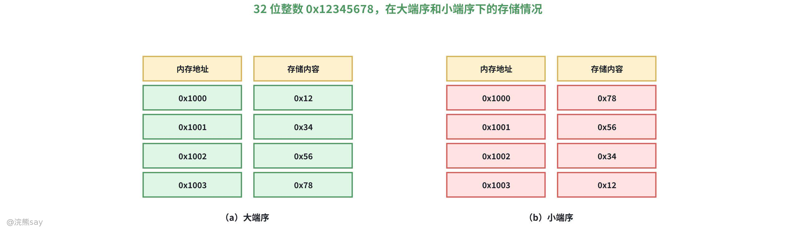
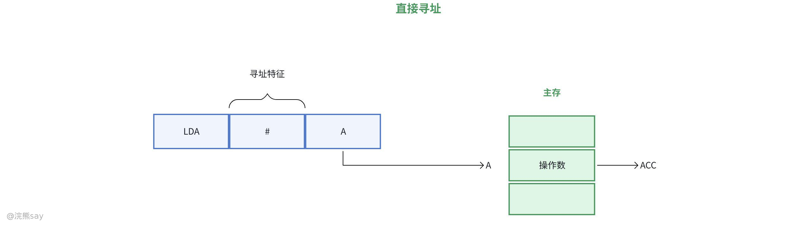
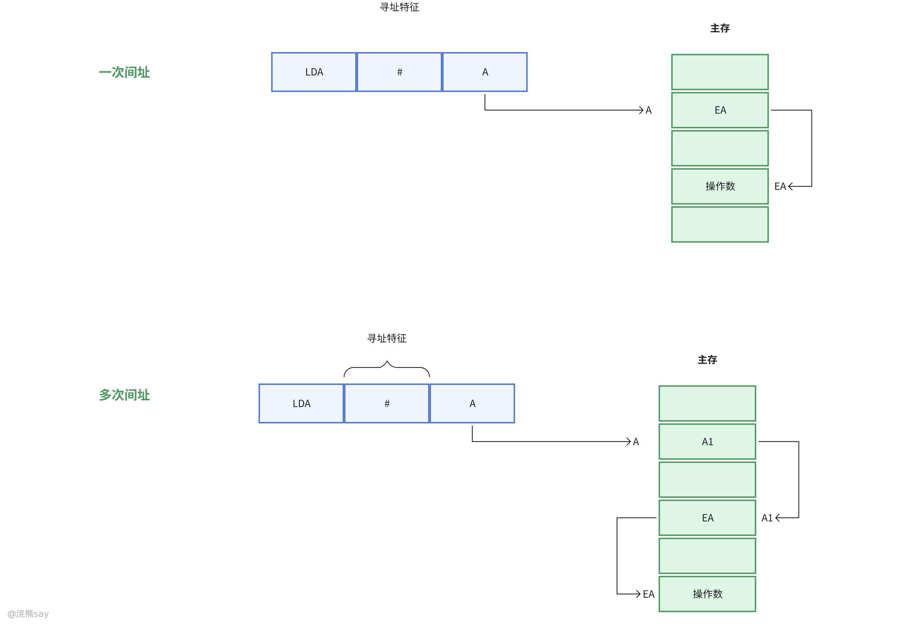
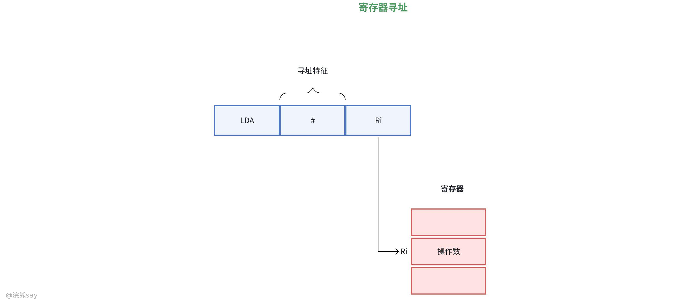
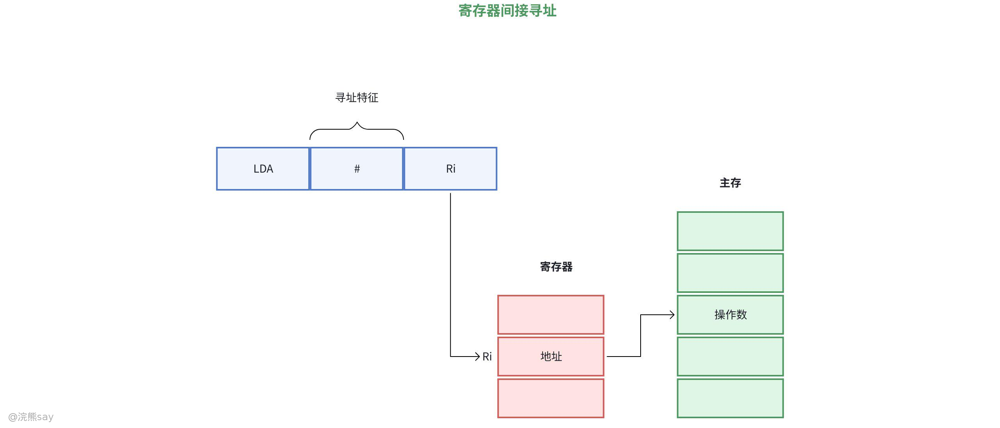
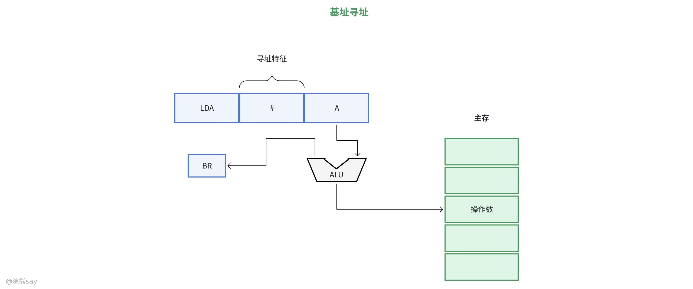
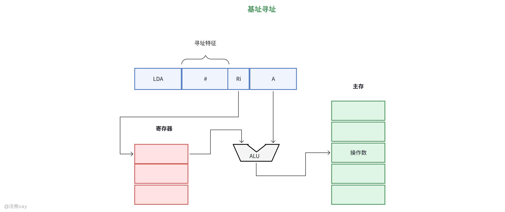
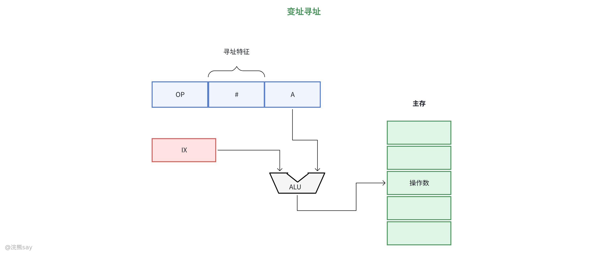
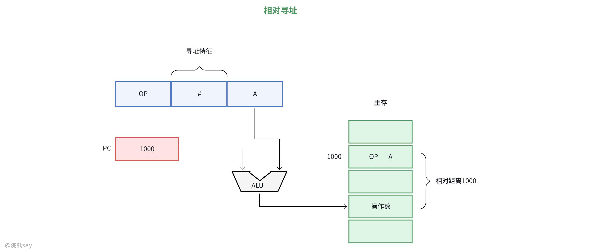

# 8、指令系统

**指令系统**

## 指令概述

## 指令格式

### 指令格式

指令是计算机硬件执行操作的基本单元，其格式规定了指令的结构和各部分功能。典型的指令格式由操作码（Opcode） 和地址码（Address） 两部分组成：

-   操作码：指明指令要执行的操作（如加法、跳转、存储等），是指令的核心。
-   地址码：指明操作数的地址或结果的存储位置，可能包含 0~ 多个地址字段。

### 地址码

地址码根据划分方式不同，可以分为四地址码、三地址码、二地址码、一地址码，假设指令字长为32位，操作码固定为8位置，则：
| 类型 | 地址字段数 | 典型指令示例 | 优势 | 应用场景 |
| --- | --- | --- | --- | --- |
| 四地址 | 4 | ADD A B C NEXT | 逻辑直观 | 早期简单计算机架构 |
| 三地址 | 3 | MUL X Y Z | 省去PC地址字段 | 中低端处理器 |
| 二地址 | 2 | AND R1, [2000H] | 平衡指令长度与灵活性 | x86、ARM等主流架构 |
| 一地址 | 1 | INC R1 | 指令紧凑 | 单操作数运算或隐含操作 |
| 零地址 | 0 | POP、HALT | 最短指令长度 | 堆栈操作、控制指令 |

1.  四地址：四个地址码各占6位，分4次访存，寻址范围，A1是第一操作数地址；A2是第二操作数地址；A3是结果地址；A4是下一条指令地址。
2.  三地址:三个地址码各占8位，4次访存，寻址范围 。
3.  二地址:两个地址码各占 12 位，4 次访存，寻址范围 。
4.  一地址:地址码各占 24 位，2 次访存，寻址范围 。
5.  零地址码：无地址码

### 机器码的存储方式

在计算机中机器码的存储方式分成两种，即**大端序（Big Endian）和小端序（Little Endian）** 是两种不同的存储多字节数据（像整数、浮点数这类）的字节顺序。

1.  **大端序（Big Endian）**

大端序也被称作 “网络字节序”。在这种存储方式中，数据的高位字节会被存放在内存的低地址处，而低位字节则存放在内存的高地址处。可以把它类比成我们书写数字的顺序，比如数字 1234，我们会先写高位的 1，再依次写低位的 2、3、4。

1.  **小端序（Little Endian）**

小端序与大端序相反，在小端序中，数据的低位字节会被存放在内存的低地址处，高位字节则存放在内存的高地址处，这类似于我们有时念数字的方式，比如对于 1234，可能会说成 “四千三百二十一”。
| 【例题】某 32 位计算机按字节编址，采用小端方式。若语句“int i=0;”对应指令的机器代码为“C7 45 FC00 00 00 00”，则语句“inti=-64;”对应指令的机器代码是( )。A.C7 45 FC CO FF FF FFB.C7 45 FC OC FF FF FFC.C7 45 FC FF FF FF COD.C7 45 FC FF FF FF OC答案： A解析：(1)按字节编址，采用小端方式，低位的数据存储在低地址位，高位的数据存储在高地址位，并且按照一个字节相对不变的顺序存储。(2)由题意知机器代码的地址是递减的，存储0的位数是后 32 位，那么我们只需要把64 的补码按字节存储在其中即可，而- 64 表示成 32 位的十六进制数是 FF FF FF CO，根据小端方式的特点，低字节存储在低地址，就是 CO FF FF FF。 |
| --- |

## 指令字长

指令字长指指令中包含二进制代码的位数，简单来说指令的二进制表示由**操作码**（表示指令要执行的操作，如加、减、取数）和**操作数地址码**（表示操作数的存储位置或直接数值）两部分组成，指令字长就是这两部分二进制位数的总和。，其设计核心与操作码长度分配直接相关，主要分为两种格式：

### 定长操作码指令格式

定长操作码是指操作码长度固定，且位于指令字的最高位或某一固定位置，结构规整统一，其核心特点是：

① 指令解析逻辑简单，硬件设计复杂度低，无需额外判断操作码边界；

② 适合指令集规模较小的处理器，便于标准化设计；

③ 扩展性受限，若需扩展指令集，需增加指令字长，易造成存储空间浪费。

例如，假设指令字长为 16 位，其中操作码占 4 位、地址码占 12 位，则操作码可表示 2⁴=16 种不同操作，地址码可寻址 2¹²=4096 个存储单元。

### 不定长操作码指令格式

不定长操作码指令格式是指，操作码长度不固定，根据指令功能优先级动态分配 —— 高频简单指令使用短操作码，低频复杂指令使用长操作码，其核心特点包括：

① 灵活性高，编码效率优，能显著减少指令字长的冗余浪费；

② 硬件解码复杂度提升，需通过前缀编码规则（任一操作码不能是其他操作码的前缀）避免歧义，可能增加解码时间。
| 【例题】下列关于指令字长、机器字长和存储字长的说法中，正确的是 ( )。A. 指令字长等于机器字长的前提下取指周期等于机器周期B. 指令字长等于存储字长的前提下取指周期等于机器周期C. 指令字长和机器字长的长度没有必然联系D. 为了硬件设计方便，指令字长都和存储字长一样大答案：BC解析：① 指令字长通常取存储字长的整数倍：若二者相等，1 次访存即可取出指令，取指周期等于机器周期；若指令字长是存储字长的 2 倍，则需 2 次访存，取指周期为 2 个机器周期，故 A 错误、B 正确。② 指令字长由操作码长度、操作数地址长度及个数决定，与机器字长（CPU 一次能处理的数据长度，通常等于内部寄存器位数）无必然关联；为简化硬件设计，指令字长一般取字节或存储字长的整数倍，而非必须与存储字长相等，故 C 正确、D 错误。 |
| --- |

## 指令类型

指令按功能可分为五大类，各类型分工明确，共同支撑计算机的运算、控制与数据交互 —— 数据传送是基础，算术逻辑运算实现数值处理，位移操作优化数据处理效率，转移操作赋予程序逻辑判断能力，I/O 指令连接主机与外部设备。

### 数据传送指令

数据传送指令的主要功是能实现数据在寄存器、内存、I/O 设备间的传输，源数据保持不变，是最基础的指令类型，其主要操作流程是：

① 一般传送（如 MOV）：支持主存与寄存器、寄存器间、主存单元间的数据传输，例：MOV AX, \[2000H\]（将内存地址 2000H 的数据传至寄存器 AX）；

② 堆栈操作（PUSH/POP）：

-   进栈PUSH BX将数据压入堆栈，堆栈指针 SP 自动递减（依字长定 1 或 2）；
-   出栈POP CX从堆栈弹出数据，SP 自动递增；

③ 数据交换（如 XCHG）：实现双向数据传输，例：XCHG AL, BL（交换寄存器 AL 与 BL 的内容）。

### 算术、逻辑操作

#### 算术运算指令

算术运算指令的主要功能是，处理定点 / 浮点数值运算，执行后会影响标志位（如进位 CF、溢出 OF、零标志 ZF 等），其核心操作包括：

① 基础运算含加法（ADD）、减法（SUB）、乘法（MUL）、除法（DIV），以及多字节运算专用的带进位加法（ADC）、带借位减法（SBB）；

② 比较指令（CMP）通过减法更新标志位但不保存结果，为后续条件判断提供依据。

#### 逻辑运算指令

逻辑运算指令的主要功能是对二进制位进行按位操作，常用于数据掩码、位处理或状态判断。

① 与运算AND（全 1 则 1，否则 0，如AND AL, 0FH保留 AL 低 4 位）；

②或运算OR（全 0 则 0，否则 1，如OR BL, 80H置 BL 最高位为 1）；

③非运算NOT（按位取反，如NOT CX）；

④异或运算XOR（不同则 1，相同则 0，如XOR AX, AX将 AX 清零）。

### 位移操作指令

位移操作指令的功能是对寄存器或内存数据的二进制位进行移位处理，按适用场景分为三类，核心用于数据缩放、位重组等：

①算术移位：适用于带符号数，移位时符号位保持不变。

-   算术左移SAL：低位补 0，高位溢出至 CF，相当于乘以 2；
-   算术右移SAR：高位复制符号位，低位溢出至 CF，相当于除以 2（向下取整）。

②逻辑移位：适用于无符号数，移位时空位补 0。

-   逻辑左移SHL：功能同SAL；
-   逻辑右移SHR：高位补 0，低位溢出至 CF。

③循环移位：

-   小循环（不带进位）：ROL（左循环）、ROR（右循环），移位后首尾相连；
-   大循环（带进位）：RCL（带 CF 左循环）、RCR（带 CF 右循环），CF 参与循环。

### 转移操作指令

转移操作指令的主要功能是改变程序执行顺序，实现条件判断、子程序调用等逻辑跳转，核心是调整程序计数器（PC）的值：

①无条件转移（JMP）：直接跳转到目标地址，例如JMP LABEL。

②条件转移：根据标志位状态决定是否跳转，采用相对寻址（目标地址 = PC + 位移量）。

-   基于无符号数比较：JA（大于则跳）、JB（小于则跳）等；
-   基于带符号数比较：JG（大于则跳）、JL（小于则跳）等；
-   基于标志位：JZ（结果为 0 则跳）、JC（进位标志为 1 则跳）等。

③子程序调用与返回：

-   调用指令CALL：保存当前 PC 到堆栈，跳转子程序；
-   返回指令RET：从堆栈取出 PC 值，返回主程序（子程序末尾必含RET）。

### 输入输出指令

输入输出指令的主要功能是实现主机与外部设备的数据交互、状态查询及控制命令发送，核心依赖编址方式设计：

①编址方式与指令：

-   独立编址：使用专用 I/O 指令，如IN AL, 20H（从端口 20H 输入字节到 AL）、OUT 40H, AX（从 AX 输出字到端口 40H）；
-   统一编址：将外设寄存器视为内存单元，使用MOV指令访问（如MOV \[DX\], AL，DX 存放外设地址）。

②操作类型：

-   数据传输：输入（读外设数据）、输出（写数据到外设）；
-   状态查询：读取外设状态寄存器（如打印机是否就绪）；
-   控制命令：发送命令到外设（如磁盘驱动器的磁头定位）

| 【例题】在补码表示的机器中，若寄存器 R 中原存的数为 9EH，执行一条指令后现存的数为 CFH，则表明该指令不可能是 ()。A.XOR 异或运算指令B.IMUL 有符号数乘法指令C.SAR 算术右移指令D.ADD 加法指令答案：B解析：① 先将十六进制数转为二进制：原数 9EH=10011110，结果 CFH=11001111；② XOR 指令可通过与 01010001 异或得到结果，SAR 算术右移 1 位可实现，ADD 指令通过加 31H（二进制 00110001）可实现，故 A、C、D 正确；③ 有符号乘法指令无法找到对应的整数，使得 9EH 与该整数相乘后得到 CFH，故 B 错误。 |
| --- |

## 真题
| 【国家电网2015】某计算机采用微程序控制器，共有 32 条指令，公共的取指令微程序包含 2 条微指令，各指令对应的微程序平均由 4 条微指令组成，采用断定法（下址字段法）确定下条微指令的地址，则微指令中下址字段的位数至少是（）；A.5B.6C.8D.9答案：C解析：微程序总数为 2+32×4=130 条，下址字段需表示 130 个地址，2^8=256≥130，故位数至少是 8 |
| --- |

| 【国家电网2015】某计算机有 16 个通用寄存器，采用 32 位定长指令字操作码字段（含寻址方式位）为 8 位，Store 指令的源操作数和目的操作数分别采用寄存器直接寻址和基址寻址方式，若基址寄存器可使用任一通用寄存器，且偏移量用补码表示，则 Store 指令中偏移量的取值范围是（）；A.-32768~+32768B.-32767~+32768C.-65536~+65535D.-65535~+65536答案：C解析：Store 指令的源操作数是寄存器直接寻址（4 位），目的操作数是基址寻址（基址寄存器 4 位），操作码字段 8 位，偏移量位数为 32-8-4-4=16 位，补码表示的 16 位偏移量取值范围是-65536~+6553 |
| --- |

| 【国家电网2016】指令由哪几部分组成（）；A.操作码B.地址码C.变量D.程序答案：AB；解析：指令的基本组成部分是操作码（指明操作）和地址码（指明操作数地址），变量和程序不是指令组成部分 |
| --- |

| 【南方电网2024】直接寻址是指（）；A.指令中地址码字段给出的地址就是操作数的有效地址B.指令中直接给出操作数C.指令中间接给出操作数地址D.操作数在寄存器中；答案：A；解析：直接寻址是指指令中地址码字段给出的地址就是操作数的有效地址，即操作数在内存的地址 |
| --- |

| 【南方电网2024】执行一条二/三/四地址指令都需要（）次访问主存，执行一条一地址指令需（）次访问主存；A.1，2B.2，3C.3，4D.4，2；答案：D；解析：执行一条二/三/四地址指令都需要 4 次访问主存，执行一条一地址指令需 2 次访问主存 |
| --- |

| 【南方电网2024】一条计算机指令中，规定其执行功能的部分称为（）；A.操作数B.被操作数C.地址码D.操作码；答案：D；解析：一条计算机指令中，规定其执行功能的部分称为操作码。源操作数的地址码称为源地址码，目标操作数的地址码称为目标地址码 |
| --- |

## 寻址方式

寻址方式是 CPU 为访问内存数据或指令、确定操作数所在内存地址的核心方法，是计算机组成原理的关键概念，其设计直接决定指令系统的灵活性、执行效率及 CPU 的整体性能。根据寻址目标的不同，寻址方式可分为**指令寻址**和**数据寻址**两大类，前者聚焦 “下一条指令地址的确定”，后者专注 “操作数地址的定位”，二者协同支撑程序的正常执行。

## 指令寻址

指令寻址的核心目标是确定下一条待执行指令的内存地址，是程序流程控制的基础。其本质是通过程序计数器（PC）的动态调整，实现指令的连续执行或按需跳转，主要包含顺序寻址和跳跃寻址两种方式，二者分别对应程序的线性流程与分支逻辑。

### 顺序寻址

顺序寻址是程序执行的默认方式，核心逻辑是指令在内存中按连续地址存放，执行完当前指令后，PC 会自动累加当前指令的字节数（或固定步长），精准指向紧邻的下一条指令地址。例如：若当前指令地址为 100H，指令字长为 4 字节，则 PC 自动更新为 100H+4=104H，确保程序按顺序线性执行。这种方式无需额外的地址计算，逻辑简单、执行高效，是程序中最基础的执行模式。

### 跳跃寻址

跳跃寻址用于打破程序的线性执行流程，核心逻辑是根据当前指令的操作码（无条件跳转）或标志位状态（条件跳转），直接修改 PC 的值，使程序跳转到非连续的目标地址。其中，无条件跳跃（如 JMP 200H）直接将目标地址送入 PC，无需判断；条件跳跃（如 JZ LABEL）则依赖前序运算的标志位（如零标志 ZF），仅当满足条件时才跳转。例如：当前 PC 为 100H，执行 JMP +10H 后，PC 更新为 110H，实现程序分支。

## 数据寻址

数据寻址的核心是通过指令的地址码字段结合特定规则，定位操作数的真实地址（有效地址 EA），其设计需在执行速度、寻址范围、灵活性之间进行权衡。不同数据寻址方式的核心差异在于操作数的存储位置（指令内、内存、寄存器）及地址的解析逻辑，以下是常用的 8 种数据寻址方式，每种方式均有其独特的适用场景与性能特点。

### 立即寻址

立即寻址的核心逻辑是 “操作数直接嵌入指令中”，地址码字段本身就是操作数，无需访问内存即可直接获取。其指令格式为 “操作码 + 立即数”，例如MOV AX, 1234H中，1234H 是操作数，执行时直接将该值送入寄存器 AX。这种方式的最大优势是执行速度极快，无需额外访存开销，但缺点是操作数固定，无法动态修改，因此常用于给寄存器赋初值或使用固定常量的场景。

### 直接寻址

直接寻址的核心逻辑是 “地址码字段直接表示操作数的内存地址”，有效地址 EA = 地址码，仅需一次访存即可获取操作数。其指令格式为 “操作码 + 内存地址”，例如MOV AL, \[2000H\]，执行时直接访问内存地址 2000H，将对应数据送入 AL。该方式的优点是寻址逻辑简单、易于实现，缺点是地址码长度受指令字长限制，寻址范围有限，且操作数地址固定，灵活性较低，适合访问固定地址的内存单元。

### 间接寻址

间接寻址的核心逻辑是 “地址码字段是操作数地址的指针”，需通过两次（或多次）访存获取操作数：第一次访存读取指针（操作数的地址），第二次访存读取真实操作数。其指令格式为 “操作码 + 间接地址”，例如MOV AX, @\[2000H\]（@表示间接寻址），先访问 2000H 得到操作数地址 3000H，再访问 3000H 获取最终数据。这种方式的优势是能显著扩大寻址范围（指针可指向更大的地址空间），但多次访存导致执行速度较慢，适合需要灵活访问大地址空间数据的场景。

### 寄存器寻址

寄存器寻址的核心逻辑是 “操作数存储在 CPU 寄存器中”，地址码字段为寄存器编号，有效地址 EA = 寄存器号，直接从寄存器取数无需访存。例如ADD AX, BX，操作数存储在 AX 和 BX 中，执行时直接读取寄存器数据进行运算。该方式的突出优势是执行速度极快（寄存器访问速度远高于内存），但受限于寄存器数量，适合存储频繁使用的临时数据或运算中间结果。

### 寄存器间接寻址

寄存器间接寻址的核心逻辑是 “操作数的内存地址存储在寄存器中”，有效地址 EA = 寄存器中的值，需一次访存获取操作数。其指令格式为 “操作码 + 寄存器号”，例如MOV DX, \[BX\]，若 BX 中存储地址 2000H，则访问该地址取数送入 DX。这种方式结合了寄存器的高速访问与间接寻址的灵活性，无需修改指令即可通过调整寄存器值访问不同内存单元，常用于数组遍历、指针操作等场景。

### 基址寻址

基址寻址的核心逻辑是 “有效地址 = 基址寄存器值 + 形式地址 A”，基址寄存器（如 BP、BX）通常存储程序或数据段的基地址，形式地址为偏移量，二者相加定位目标数据。

例如MOV AX, \[BP+10H\]，若 BP=1000H，则 EA=1000H+10H=1010H，访问该地址获取数据。基址寻址的核心价值是简化内存空间管理，基址寄存器值由操作系统确定，执行过程中固定，适合多道程序设计中隔离不同程序的内存空间，或定位数据段内的变量。

### 变址寻址

变址寻址的核心逻辑是 “有效地址 = 变址寄存器值 + 形式地址 A”，变址寄存器（如 SI、DI）通常存储数组下标或偏移量，形式地址为数组首地址，二者相加遍历数组元素。例如MOV AL, \[SI+2000H\]，若 SI=0 则访问 2000H（数组第一个元素），SI=1 则访问 2001H（第二个元素）。变址寻址的优势是灵活遍历连续内存单元，变址寄存器值由用户设定且可动态修改，是编制循环程序、处理数组数据的理想选择。

### 相对寻址

相对寻址的核心逻辑是 “有效地址 = 当前 PC 值 + 形式地址 A”，形式地址为有符号偏移量，常用于转移指令。例如当前 PC=100H（指向当前指令下一条地址），执行JMP +10H，则目标地址 = 100H+10H=110H。该方式的核心优势是与内存物理地址无关，仅依赖 PC 的相对偏移，便于程序重定位（如程序加载到不同内存地址仍可正常执行），是分支跳转、子程序调用的常用寻址方式。
| 【例题1】假设变址寄存器 R 的内容为 1000H，指令中的形式地址为 2000H；地址 1000H 中的内容为 2000H，地址 2000H 中的内容为 3000H，地址 3000H 中的内容为 4000H，则变址寻址方式下访问到的操作数是 ()。A.1000HB.2000HC.3000HD.4000H答案：D解析：变址寻址的有效地址 EA = 变址寄存器值 + 形式地址 A，即 1000H+2000H=3000H（操作数的内存地址）；通过该有效地址访问内存，地址 3000H 中存储的内容为 4000H，即为最终操作数，故答案为 D。 |
| --- |

| 【例题2】某机器字长为 16 位，主存按字节编址，转移指令采用相对寻址，由两个字节组成：第一字节为操作码字段，第二字节为相对位移量字段。假定取指令时，每取一个字节 PC 自动加 1。若某转移指令所在主存地址为 2000H，相对位移量字段的内容为 06H，则该转移指令成功转移后的目标地址是 ()。A.2006HB.2007HC.2008HD.2009H答案：C解析：相对寻址的核心公式为 EA = 当前 PC 值 + 相对位移量 A。首先，转移指令由 2 字节组成，取指令时每取 1 字节 PC 自动加 1，因此取完该指令后，PC 值从 2000H 更新为 2000H+2=2002H（即当前 PC 值）；再代入公式计算目标地址：2002H+06H=2008H，故答案为 C。 |
| --- |

## 真题
| 【国家电网 2015 】某计算机采用微程序控制器，共有 32 条指令，公共的取指令微程序包含 2 条微指令，各指令对应的微程序平均由 4 条微指令组成，采用断定法（下址字段法）确定下条微指令的地址，则微指令中下址字段的位数至少是？A.5 B.6 C.8 D.9答案：C解析：微程序总数为 2+32×4=130 条，下址字段需表示 130 个地址，2⁸=256≥130，故位数至少是 8 |
| --- |

| 【国家电网2015】某计算机有 16 个通用寄存器，采用 32 位定长指令字，操作码字段（含寻址方式位）为 8 位，Store 指令的源操作数和目的操作数分别采用寄存器直接寻址和基址寻址方式，若基址寄存器可使用任一通用寄存器，且偏移量用补码表示，则 Store 指令中偏移量的取值范围是？A.-32768~+32768B.-32767~+32768C.-65536~+65535D.-65535~+65536答案：C解析：Store 指令的源操作数是寄存器直接寻址（4 位），目的操作数是基址寻址（基址寄存器 4 位），操作码字段 8 位，偏移量位数为 32-8-4-4=16 位，补码表示的 16 位偏移量取值范围是-65536~+65535 |
| --- |

| 【国家电网2016】假设变址寄存器 R 的内容为 1000H，指令中的形式地址为 2000H；地址 1000H 中的内容为 2000H，地址 2000H 中的内容为 3000H，地址 3000H 中的内容为 4000H，则变址寻址方式下访问到的操作数是？A.1000HB.2000HC.3000HD.4000H答案：C解析：变址寻址的有效地址=变址寄存器内容+形式地址=1000H+2000H=3000H，操作数为地址 3000H 中的内容 3000H |
| --- |

| 【国家电网2020】指令系统中采用不同寻址方式的目的主要是？A.实现存储程序和程序控制B.缩短指令长度、扩大寻址空间、提高编程灵活性C.可以直接访问外存D.提供扩展操作码的可能并降低指令译码难度答案：D解析：提供扩展操作码的可能并降低指令译码难度 |
| --- |

| 【国家电网2020】用某个寄存器中操作数的寻址方式称为？A.直接B.间接C.寄存器直接D.寄存器间接答案：C解析：寄存器直接寻址就是用寄存器中的操作数来寻址。寄存器间接寻址是用寄存器中操作数的地址来寻址的 |
| --- |

| 【国家电网2022】随着主存增加，指令本身很难保证直接反映操作数的值或其地址，必须通过某种映射方式实现对所需操作数的获取。指令系统中将这种映射方式称为寻址方式，即指令按什么方式寻找（或访问）到所需的操作数或信息（例如转移地址信息等）。可以被指令访问到的数据和信息包括通用寄存器、主存、堆栈及外设端口寄存器等。指令中地址码字段直接给出操作数本身，而不是其访存地址，不需要访问任何地址的寻址方式被称为？A.隐含寻址B.间接寻址C.立即寻址D.直接寻址答案：C解析：指令中地址码字段直接给出操作数本身，而不是其访存地址，不需要访问任何地址的寻址方式被称为立即寻址 |
| --- |

| 【南方电网2024】在指令格式的地址字段中直接指出操作数在内存的地址这种寻址方式称为？A.隐含B.间接C.立即D.直接答案：D解析：直接寻址是指指令中地址码字段给出的地址就是操作数的有效地址，即操作数在内存的地址 |
| --- |

## CISC和RISC

CISC（复杂指令集计算机）与 RISC（精简指令集计算机）是微处理器设计的两大核心架构，其核心差异源于指令集的设计理念：CISC 追求 “用复杂指令覆盖更多功能”，通过丰富的指令类型减少程序指令条数；RISC 主张 “精简指令 + 高效执行”，聚焦高频指令的优化，以单周期执行、流水线兼容为目标。两种架构各有侧重，分别适配不同的应用场景，其设计思路直接影响处理器的性能、功耗与硬件复杂度。

## CISC与RISC的特点

CISC 与 RISC 的特点均围绕其设计理念展开：CISC 以 “功能全面” 为核心，指令集涵盖复杂操作；RISC 以 “高效精简” 为核心，指令集聚焦高频基础操作，两者在指令结构、执行机制等方面形成鲜明对比。

### 什么是RISC和CISC

RISC（Reduced Instruction Set Computer）即精简指令集计算机，是一种微处理器设计架构，它的指令集精简，强调每个指令周期的效率。CISC（Complex Instruction Set Computer）即复杂指令集计算机，是一种微处理器设计架构，它的指令集复杂，强调硬件执行指令的功能性。

### CISC特点

CISC 的设计思路是 “硬件实现更多功能”，通过复杂指令减少软件层面的指令条数，其特点集中体现为 “复杂与多样”，具体如下：

1.  指令系统庞大且功能丰富：指令数目通常达 200~300 条，涵盖简单运算、复杂寻址、多步操作等多种功能，部分指令可直接完成复杂任务（如字符串处理、多字节运算）；
2.  指令结构灵活多变：指令长度不固定（如 x86 架构指令为 1~15 字节），指令格式多样，寻址方式复杂（支持基址、变址、间接等多种组合寻址）；
3.  内存与寄存器直接交互：指令可直接对存储器和寄存器进行操作，无需依赖专用的读写指令；
4.  执行效率差异显著：由于指令功能复杂度不同，执行时间相差较大，大多数指令需要多个时钟周期才能完成，CPI（每条指令平均时钟周期数）通常在 1~20 之间；
5.  硬件控制逻辑复杂：控制器多采用微程序控制，通过微指令解释执行复杂指令，硬件设计难度较高；
6.  编译优化难度大：指令格式不规则、功能差异大，编译器难以生成高效的目标代码，难以充分发挥硬件性能。

CISC 通过复杂指令减少了程序的指令条数，降低了软件开发的复杂度，但也导致硬件逻辑复杂、指令执行效率不均，更适合对兼容性要求高、注重复杂功能支持的场景。

### RISC特点

RISC 的设计思路是 “精简指令 + 优化执行”，剔除低频复杂指令，聚焦高频基础指令的高效实现，其特点集中体现为 “精简与高效”，具体如下：

1.  指令系统精简实用：仅包含使用频度高的基础指令（通常约 100 条），剔除复杂特殊指令，指令功能单一（如仅支持算术运算、寄存器操作、简单寻址）；
2.  指令结构规整统一：指令长度固定（如 ARM 架构 32 位指令），指令格式少（通常不超过 3~4 种），寻址方式简化（仅支持寄存器寻址、立即数寻址等少数类型）；
3.  内存访问严格分离：仅通过 LOAD（取数）/STORE（存数）指令访问存储器，其余指令的操作均在寄存器之间进行，减少内存访问开销；
4.  执行效率高效稳定：采用流水线技术优化，大多数指令可在一个时钟周期内完成，CPI 接近 1，执行速度均匀且可预测；
5.  硬件控制逻辑简化：控制器采用硬布线控制，直接通过硬件电路执行指令，无需微程序解释，硬件设计更简洁，功耗更低；
6.  依赖编译优化：指令规则统一，编译器可充分优化指令排序、寄存器分配，通过软件层面的优化弥补指令功能的精简，提升程序整体执行效率。

RISC 通过精简指令集、优化执行机制，实现了高效、低功耗的设计目标，硬件逻辑简单、流水线兼容性好，但需要编译器的深度优化配合，更适合对性能、功耗敏感的场景。

## CISC和RISC比较
| 比较维度 | CISC（复杂指令集计算机） | RISC（精简指令集计算机） |
| --- | --- | --- |
| 指令系统 | 指令数量多（200-300+），功能复杂 | 指令数量少（约 100 条），功能简单 |
| 指令长度 | 不固定（如 x86 指令 1-15 字节） | 固定长度（如 ARM 32 位指令） |
| 寻址方式 | 多样且复杂（如基址 + 变址 + 偏移） | 寻址方式少（通常仅寄存器 / 立即数） |
| 执行周期 | 指令执行时间差异大（CPI=1-20+） | 大多数指令单周期完成（CPI≈1） |
| 寄存器数量 | 较少（依赖内存操作） | 大量通用寄存器（减少内存访问） |
| 内存访问 | 指令可直接操作内存（如 MOV [eax], ebx） | 仅 LOAD/STORE 指令访问内存 |
| 流水线支持 | 复杂指令影响流水线效率 | 指令简单，适合深度流水线（如 5-8 级） |
| 控制器设计 | 微程序控制（复杂逻辑） | 硬布线控制（简化设计） |
| 编译难度 | 指令功能强但不规则，编译优化困难 | 指令规则，编译易生成高效代码 |
| 代表架构 | Intel x86、AMD64 | ARM、MIPS、RISC-V、PowerPC |
| 典型应用 | 桌面电脑、服务器（兼容性优先） | 移动设备、嵌入式系统（能效优先） |
| 发展趋势 | 引入微操作（μops）模拟 RISC 特性 | 增加向量指令等扩展功能（如 ARM NEON） |

## 真题
| 【国家电网2014】RISC 结构的机器性能一定要比 CISC 结构的机器性能高；A、正确B、错误答案：B解析：RISC 和 CISC 各有优势，性能高低取决于具体应用场景，不能绝对说 RISC 结构机器性能一定比 CISC 高 |
| --- |

| 【中国银行2024】RISC 的主要特点有哪些；A.选取使用频率最高的一些简单指令，复杂指令的功能由简单指令的组合来实现；B.指令长度固定，指令格式种类少，寻址方式种类少C.只有 Load/Store 指令访存，其余指令的操作都在寄存器之间进行D.CPU 中通用寄存器的数量相当多答案：A、B、C、D解析：RISC 通过简化指令系统，减少指令格式和寻址方式，增加通用寄存器数量，采用流水线技术等方式提高计算机性能 |
| --- |
