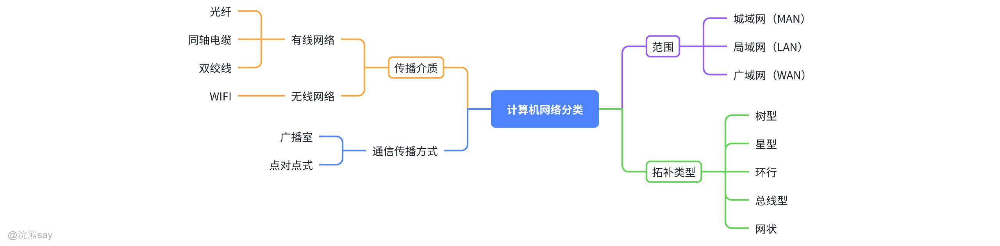

# **Part 01：计算机网络概念**
| 【原创声明】大家好，我是say，是这篇文章的原创作者！985硕士毕业，应届进入某大厂后道心破碎，社招上岸多家855半垄断央企，因为自己淋过雨，希望帮大家撑把伞，帮助更多同学找到不内卷、能够好好生活的央国企，已帮助1000+同学上岸央国企，需要连联系学长的加微信：wx_hxsay |
| --- |

## 计算机网络概念

## 什么是计算机网络？

计算机网络是指将地理上分散的、具有独立功能的多台计算机（或其他智能设备，如手机、服务器、打印机等），通过通信线路（如网线、光纤、无线电波）和网络设备（如路由器、交换机）连接起来，并遵循统一的网络协议（如 TCP/IP），实现数据通信和资源共享的系统。以公路交通来对比理解计算机网络，它就像 “计算机之间的高速公路网”：

-   「公路」= 通信线路 + 网络设备；
-   「交通规则」= 网络协议；
-   「目的」= 让不同计算机之间能 “传话”（数据通信）、“借东西”（资源共享）

任何计算机网络都离不开以下 3 个核心要素，缺少其一则无法正常运行：

1.  节点（Node）：网络中具有独立功能的设备，包括 “终端设备”（如个人电脑、手机、平板）和 “网络设备”（如路由器、交换机、服务器）。
2.  通信链路（Link）：连接节点的物理或无线通道，比如：

-   物理链路：网线（双绞线）、光纤、同轴电缆；
-   无线链路：WiFi（无线电波）、蓝牙、5G/4G（移动通信信号）。

1.  网络协议（Protocol）：节点之间通信的 “共同语言”，规定了数据的格式、传输规则、错误处理方式等。例如，我们常用的TCP/IP 协议簇（互联网的核心协议），就像 “全球计算机的通用语言”，确保不同品牌、不同系统的设备能互通。

计算机网络不仅是 “连接计算机的工具”，更是现代社会的 “信息基础设施”，是数字化、智能化发展的核心载体。

## 计算机网络发展阶段

第一阶段：ARPANET

ARPANET是第一个成功的分组交换网络，由美国国防部高级研究计划局（ARPA）于1969年建立。它被认为是现代互联网的前身，奠定了网络通信的基础。

第二阶段：三层结构（主干网、地区网、校园网）

在这一阶段，网络结构逐渐发展为三层结构：主干网（国家级或国际级网络）、地区网（省级或市级网络）和校园网（学校或企业内部网络）。这种层次结构提高了网络的扩展性和管理效率。

第三阶段：多级ISP结构的网络

随着互联网的普及和发展，网络结构进一步演变为多级ISP（Internet Service Provider）结构。ISP提供互联网接入服务，形成了多层次的网络架构，包括国家级ISP、区域级ISP和本地ISP等。

## 计算机网络相关术语

1.  通信子网与资源子网

| 通信子网：由负责处理主机之间通信任务的专用计算机组成的传输网络，核心作用是提供信息传输服务。资源子网：建立在通信子网基础上的主机集合，核心作用是提供计算资源。 |
| --- |

1.  网络边缘部分与核心部分

| 边缘部分：由所有连接在因特网上的主机组成，是用户 “直接使用” 的部分，用于通信（传送数据、音频或视频）和资源共享。核心部分：由大量网络和连接这些网络的路由器组成，为边缘部分提供服务（连通性和交换功能）。 |
| --- |

1.  结点、网络、主机

| 网络：由若干结点和连接这些结点的链路组成（结点可理解为网络中的设备，如计算机、路由器等）。互联网：是 “网络的网络”，即由多个不同的网络互联而成。主机：连接在因特网上的计算机，都可称为主机。 |
| --- |

## 计算机网络组成

一个完整的计算机网络主要由硬件、软件、协议三大部分组成：

1.  硬件部分

网络节点：分为端节点（比如计算机，是用户直接使用的设备）和中间节点（像交换机、集中器、复用器、路由器、中继器这些，主要负责数据的转发、中继等，保障网络连通）。

通信链路：是信息传输的通道，包括物理链路（也就是传输介质，比如网线、光纤等实际的线路）和逻辑链路（即信道，是从逻辑层面划分的传输通路）。

1.  软件部分

软件主要用于实现资源共享和方便用户使用，具体包括通信软件（网络协议软件，负责处理网络通信的规则实现）、网络操作系统（管理网络资源和服务）、网络管理 / 安全控制软件（保障网络运行和安全）、网络应用软件（用户直接使用的网络应用，比如浏览器、邮件客户端等）。

1.  协议部分

协议是计算机网络的核心，它规定了网络传输数据时必须遵循的规范，确保不同设备之间能正确、有序地交换数据。

## 计算机网络功能

1.  数据通信：是最基本且最重要的功能，可实现联网计算机之间各类信息的传输，将分散在不同地理位置的计算机联系起来，进行统一调配、控制与管理（如文件传输、IP 电话、电子邮件、视频会议、信息发布、交互式娱乐、音乐等场景均依赖此功能）。
2.  资源共享：支持软件共享、数据共享、硬件共享，使网络中的资源互通有无、分工协作，极大提升硬件资源、软件资源和数据资源的利用率。
3.  提供高可靠性服务：借助可替代的资源，为用户提供连续的高可靠服务。
4.  节省投资：能替代昂贵的大中型机系统，降低整体成本。
5.  分布式处理：当网络中某台计算机系统负荷过重时，可将其处理的复杂任务分配给网络内其他计算机系统，利用空闲计算机资源提高整个系统的利用率。
6.  其他功能：还可实现电子化办公与服务、远程教育、娱乐等，满足社会需求，方便人们学习、工作和生活，产生巨大经济效益。

## 计算机网络分类

## 按范围分类

1.  广域网（WAN）：广域网（Wide Area NetWork，WAN），覆盖广阔地理区域的网络，如国家或洲际网络，作用范围从几十千米到几千千米不等。
2.  城域网（MAN）：城域网（Metropolitan Area Network，MAN）一般覆盖一个城市或大都市区的网络，可以跨越几个截取甚至整个城市，作用距离一般为5~50km不等。
3.  局域网（LAN）：局域网（Local Area NetWork）覆盖较小区域的网络，如办公室、学校、宿舍或家庭，作用范围一般小于1km，局域网一般用微型计算机或工作站通过高低速通信线路连接。
4.  个人区域网（PAN）：个人区域网（Personal Area Network, PAN） 是指用于个人设备之间短距离通信的网络，通常覆盖范围在 10米以内，常见技术包括：蓝牙（Bluetooth）​​（如无线耳机、键盘连接手机/电脑）、红外（IrDA）​​（旧式手机间红外传输）、ZigBee​（智能家居设备互联）、NFC（近场通信）​​（如手机支付、门禁卡）。个人区域网的特点是：低功耗、短距离、设备互联。

## 按拓扑分类
|   |   |   |
| --- | --- | --- |

网络拓扑结构是指网络中各个节点（如计算机、服务器、交换机等）之间的连接方式。不同的拓扑结构适用于不同的网络需求，包括规模、可靠性、成本和维护难度等方面。以下是五种常见网络拓扑结构的详细解释：

1.  **树型拓扑（Tree Topology）**

树型拓扑是一种层次化的网络结构，类似于一棵倒置的树，由根节点、分支节点和叶节点组成。根节点位于最顶层，负责管理整个网络，分支节点连接多个子节点，而叶节点通常是终端设备（如计算机或打印机）。这种结构适用于层次分明的组织，例如企业网络、校园网或电信网络。

树型拓扑的优点在于其良好的可扩展性，可以通过增加分支节点来扩展网络规模。同时，由于数据流向是分层的，管理起来较为方便，适合大型网络的分区管理。然而，树型拓扑的缺点是高度依赖根节点，如果根节点发生故障，整个网络可能会瘫痪。此外，随着层级的增加，数据传输的延迟也会相应提高。

1.  **星型拓扑（Star Topology）**

星型拓扑是最常见的网络结构之一，所有节点都直接连接到一个中央节点（如交换机或集线器）。中央节点负责数据的转发和管理，而其他节点之间不直接通信，必须通过中央节点交换数据。这种结构适用于小型网络，例如家庭网络、小型办公室或网吧。

星型拓扑的主要优点是易于安装和管理，因为所有设备都集中连接到中央节点，故障排查和网络维护都比较方便。此外，单个节点的故障不会影响整个网络，除非中央节点出现问题。然而，星型拓扑的缺点是中央节点成为单点故障，如果它损坏，整个网络将无法通信。此外，由于所有数据都必须经过中央节点，当网络规模扩大时，中央节点可能成为性能瓶颈。

1.  **环型拓扑（Ring Topology）**

环型拓扑中，所有节点连接成一个闭合的环形结构，数据沿着环单向或双向传输。每个节点接收数据并决定是否处理，否则将数据传递给下一个节点。这种结构适用于需要高可靠性的网络，例如工业控制系统或某些局域网（如令牌环网络）。

环型拓扑的优点是数据传输路径固定，延迟可预测，适合实时性要求较高的应用。此外，由于数据可以在两个方向上传输（双环结构），即使某个节点或线路故障，网络仍可通过另一方向维持通信。然而，环型拓扑的缺点是扩展性较差，增加或移除节点时需要中断网络。此外，如果环中的某个节点故障，整个网络可能会瘫痪，除非采用冗余设计（如双环）。
|   |   |   |
| --- | --- | --- |

1.  **总线型拓扑（Bus Topology）**

总线型拓扑采用一条共享的通信线路（总线），所有节点都连接到这条总线上。数据在总线上广播传输，每个节点检查数据包的目标地址，决定是否接收。这种结构适用于小型网络，例如早期的以太网（10BASE2/10BASE5）。

总线型拓扑的优点是结构简单、成本低，适合小型网络部署。由于所有节点共享同一条总线，布线较为方便。然而，总线型拓扑的缺点是网络性能随着节点数量的增加而下降，因为所有设备共享带宽，容易发生数据冲突（CSMA/CD机制用于解决冲突）。此外，如果总线本身出现故障，整个网络将无法通信，且故障排查较为困难。

1.  **网状拓扑（Mesh Topology）**

网状拓扑中，节点之间有多条路径相互连接，形成复杂的网状结构。这种结构可以是全网状（每个节点都直接连接其他所有节点）或部分网状（部分节点之间有冗余连接）。网状拓扑适用于需要高可靠性和高容错能力的网络，例如军事通信、数据中心或互联网骨干网。

网状拓扑的最大优点是极高的可靠性，即使某些节点或链路故障，数据仍可通过其他路径传输。此外，由于多条路径可用，网络负载可以均衡分配，提高整体性能。然而，网状拓扑的缺点是成本高昂，因为需要大量布线，并且网络配置和管理较为复杂。因此，它通常仅用于关键任务网络，而不是普通的企业或家庭环境。

## 按传输介质分类

1.  **有线网络**

| 光纤：传输速率高，抗干扰能力强，适用于长距离传输。同轴电缆：传输速率中等，抗干扰能力较好，适用于局域网。双绞线：传输速率适中，成本低，适用于局域网和家庭网络。 |
| --- |

1.  **无线网络**

| WIFI：于 IEEE 802.11 标准，支持无线接入，传输速率从百 Mbps 到数 Gbps（如 Wi-Fi 6 支持 9.6Gbps），覆盖范围通常为 10-100 米。5G网络：第五代移动通信技术，峰值速率可达 10Gbps，延迟低至 1ms，支持大规模设备连接（每平方公里 100 万台）。高速移动互联网、物联网（IoT）、自动驾驶、智慧城市等。 |
| --- |

## 央国企真题演练

1.  计算机网络的主要功能不包括以下哪一项？

A. 资源共享

B. 数据通信

C. 提高可靠性

D. 物理连接

1.  ARPANET的主要贡献是什么？

A. 建立了第一个局域网

B. 奠定了网络通信的基础

C. 发明了互联网浏览器

D. 实现了全球卫星通信

1.  计算机网络的三层结构包括哪些层级？

A. 主干网、地区网、校园网

B. 主干网、城域网、广域网

C. 城域网、局域网、个人网

D. 广域网、局域网、个人网

1.  多级ISP结构的网络主要解决了什么问题？

A. 网络的物理连接问题

B. 网络的扩展性和管理效率

C. 网络的物理安全问题

D. 网络的数据加密问题

1.  计算机网络按传输介质分类，以下哪种介质传输速率最高？

A. 光纤

B. 同轴电缆

C. 双绞线

D. 无线电波

1.  分组交换的特点不包括以下哪一项？

A. 采用“存储-转发”机制

B. 提高了线路利用率

C. 适合实时和交互式业务的数据传输

D. 要求在两个通信结点之间建立专用通路

1.  OSI参考模型中，负责将数据包从源主机传输到目的主机的层次是？

A. 物理层

B. 数据链路层

C. 网络层

D. 传输层

1.  TCP/IP模型中的网络接口层对应OSI模型的哪两层？

A. 物理层和数据链路层

B. 数据链路层和网络层

C. 网络层和传输层

D. 传输层和会话层

1.  协议三要素中的“语法”主要定义的是什么？

A. 数据的格式和编码方式

B. 控制信息的功能和含义

C. 操作的执行顺序

D. 时间限制和同步机制

1.  在TCP/IP模型中，负责提供端到端的通信和数据传输的层次是？

A. 网络接口层

B. 网际层

C. 传输层

D. 应用层

# 答案和解析

1.  答案：D. 物理连接解析：计算机网络的核心功能是资源共享、数据通信和分布式处理。物理连接属于网络的硬件组成部分，是实现功能的基础，但并非功能本身。

1.  答案：B. 奠定了网络通信的基础解析：ARPANET是互联网的前身，其核心贡献是开发了TCP/IP协议，为现代网络通信奠定了基础。其他选项（如局域网、浏览器、卫星通信）与ARPANET无关。

1.  答案：D. 广域网、局域网、个人网解析：按覆盖范围划分，计算机网络分为广域网（WAN，如互联网）、局域网（LAN，如家庭网络）和个人网（PAN，如蓝牙）。主干网和城域网属于广域网或局域网的细分。

1.  答案：B. 网络的扩展性和管理效率解析：多级ISP（互联网服务提供商）结构通过分层管理（如国家级、地区级、本地级），有效解决了网络规模扩大后的扩展性问题，提升了路由和流量管理效率。

1.  答案：A. 光纤解析：光纤利用光信号传输，速率可达100Gbps以上，远高于同轴电缆（10-100Mbps）、双绞线（1Gbps至10Gbps）和无线电波（如Wi-Fi的数Gbps）。

1.  答案：D. 要求在两个通信结点之间建立专用通路解析：分组交换采用“存储-转发”机制，不建立专用通路，提高了线路利用率。选项D描述的是电路交换（如传统电话网络）的特点。

1.  答案：C. 网络层解析：OSI模型中，网络层（第三层）负责通过路由选择将数据包从源主机传输到目的主机，核心协议如IP。

1.  答案：A. 物理层和数据链路层解析：TCP/IP的网络接口层对应OSI的物理层（传输介质）和数据链路层（帧的传输），负责设备间的物理连接和数据帧的传输。

1.  答案：A. 数据的格式和编码方式解析：协议三要素中，语法定义数据的格式（如二进制流的结构）和编码方式（如ASCII、UTF-8），确保通信双方能正确解析数据。

1.  答案：C. 传输层解析：TCP/IP模型中，传输层（如TCP和UDP）负责端到端的可靠或不可靠数据传输，实现进程间通信。
