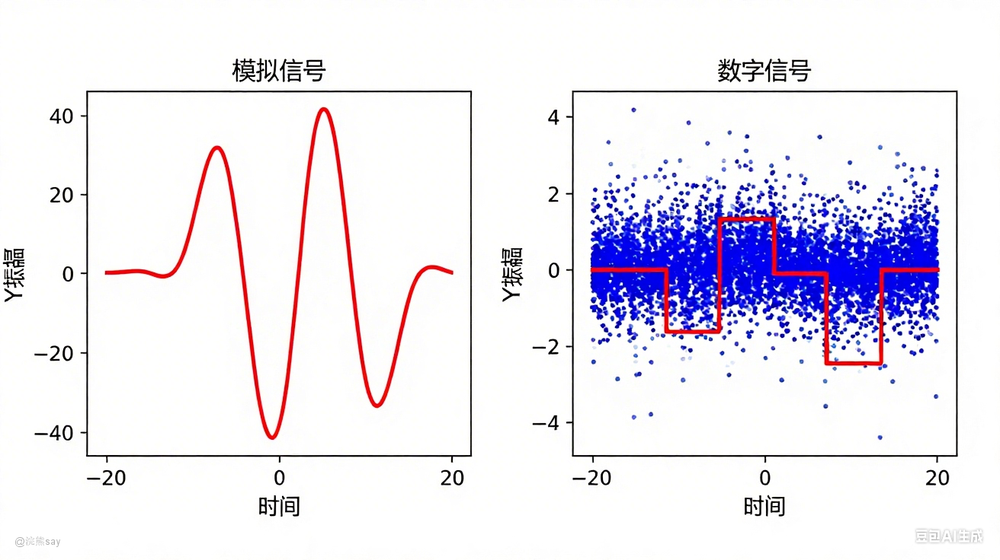
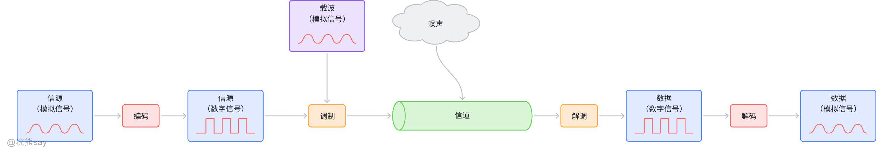
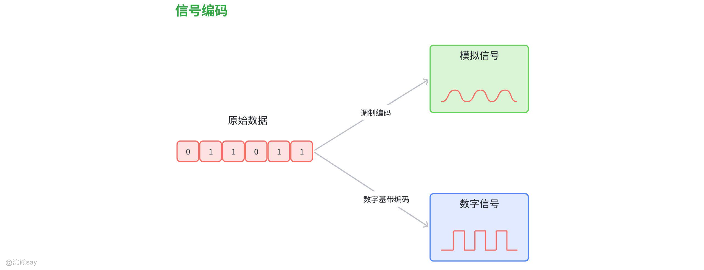
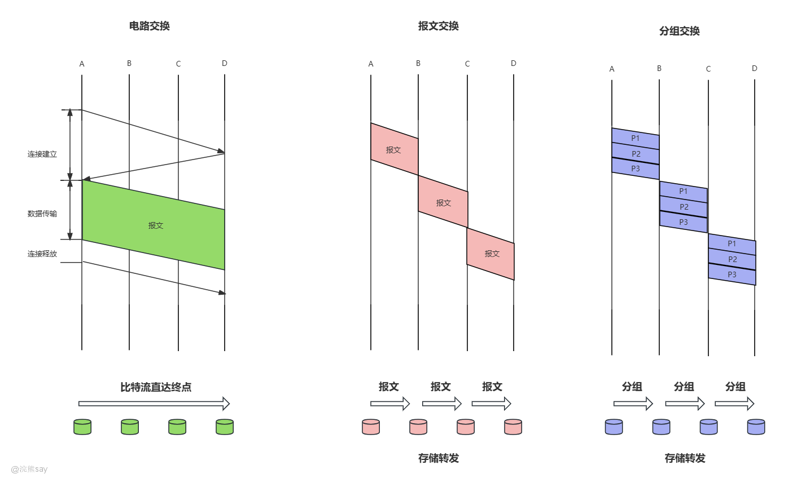
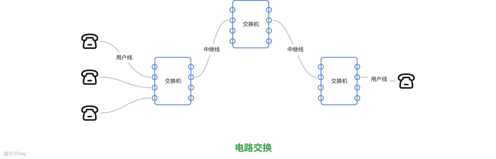
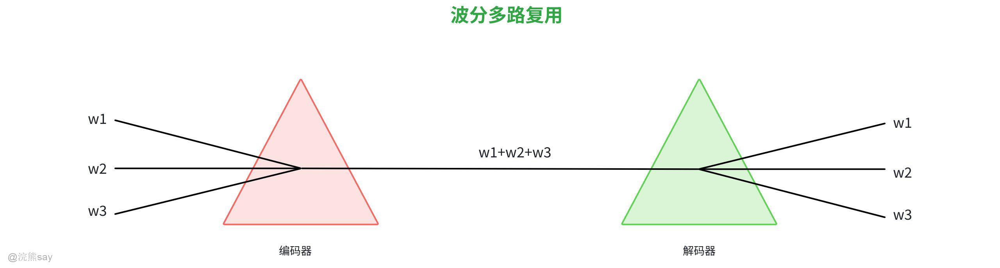

# **Part 03：数据通信基础**
| 【原创声明】大家好，我是浣熊say，是这篇文章的原创作者！985硕士毕业，应届进入某大厂后道心破碎，社招上岸多家855半垄断央企，因为自己淋过雨，希望帮大家撑把伞，帮助更多同学找到不内卷、能够好好生活的央国企，已帮助1000+同学上岸央国企，需要连联系学长的加微信：wx_hxsay |
| --- |

计算机网络的本质是实现数据通信，即将数据从一个主机传输到另外一个主机上，因此，计算机网络的基础实际上是数据通信。数据通信是指在两个或多个设备之间通过通信介质传输数据、信息的过程，其核心目标是实现数据的**高效、可靠、准确传输** 。

## 通信基础

## 什么是信号？

数字信号和模拟信号（此图片为AI生成）

-   **数据**：通信的核心内容，是对事实、概念或指令的符号化表示，分为数字数据（如文本、整数，离散形式）和模拟数据（如声音、温度，连续形式）。
-   **信号**：数据的传输载体，是数据在通信介质中的表现形式，分为模拟信号（连续变化的电磁波，如传统广播信号）和数字信号（离散的电压脉冲，如网线中的传输信号）。
-   **数据通信系统**：实现数据传输的硬件与软件集合，典型组成包括信源、信宿、通信介质、通信设备（如路由器、交换机）、通信协议。

## 通信的三个要素

通信通俗来讲就是指**信息在不同主体之间的传递与交换过程，**其核心是通过特定的技术手段和规则，将一方的消息、数据、指令等内容，准确、高效地传递给另一方（或多方），实现信息的共享与交互，是连接个体、设备、系统的重要基础。通信的三要素是数据通信的核心支撑，包含信源/信宿、通信介质和通信协议：

-   **信源与信宿**：信源是数据的发送方（如服务器、手机），信宿是数据的接收方（如电脑、终端设备），二者明确通信的“主体”。
-   **通信介质（信道）**：数据传输的物理/逻辑通道，分为有线介质（双绞线、光纤、同轴电缆）和无线介质（无线电波、微波、红外线），决定数据的传输速率和抗干扰能力。
-   **通信协议**：信源与信宿之间的标准化规则，规定数据的编码格式、传输时序、错误处理等（如TCP、HTTP协议），解决“按什么规则传”的问题。

有了通信的三要素，就可以实现将信息在不同的主体之间进行相互传递，为了方便理解大家可以以送快递为例，信源和信宿就是快递的发货方、收货方，通信介质就是运输货物的车、飞机等载具。

## 从数据到信号的传输链路

如上图所示，信息从发送到接收的核心转换流程，分为编码、调制、解调和解码等四个关键步骤：

1.  **编码**：将原始数据转换为适合传输的数字信号，目的是便于传输中的同步、识别和纠错，是数据进入通信系统的初步处理，例如以太网采用曼彻斯特编码实现比特同步。
2.  **调制**：把数字信号转换为适合信道传输的形式，可通过调整频率、幅度、相位来实现，常用于数字信号在模拟信道（如无线频段）的传输，比如 5G 通信中通过调制技术提升频谱利用率。
3.  **解调**：在接收端将传输的波形还原为数字信号，是调制的逆过程，确保接收方能够提取数字信息，例如调制解调器（Modem）的核心功能之一就是解调。
4.  **解码**：把数字信号转换为原始数据，完成信息的还原，让接收方能够理解并使用传输的内容，如计算机接收网络数据后解码为可识别的文本、图像等。

## 历年真题
| 【中国电信（2023）】通信系统中，将原始数据转换为适合传输的数字信号的过程称为（ ）选项：A. 调制B. 编码C. 解调D. 解码答案：B解析：根据文档，“编码：将原始数据转换为适合传输的数字信号，目的是便于传输中的同步、识别和纠错”；调制是“数字信号转模拟信道传输的形式”，解调是“模拟信号转数字信号”，解码是“数字信号转原始数据”。因此选B。 |
| --- |

| 【中国联通（2024）】以下属于数字信道的是（ ）A. 传统固定电话网B. 早期有线电视网C. 以太网（网线）D. 无线电广播答案：C解析：根据文档，数字信道包括“以太网（网线）、光纤网络、5G/4G核心网”；而A、B、D属于模拟信道（承载模拟信号，易受干扰）。因此选C。 |
| --- |

| 【国家电网（2023）】通信的三要素不包括以下哪一项（ ）A. 信源/信宿 B. 通信介质 C. 通信协议 D. 通信设备答案：D解析：文档明确“通信三要素是信源/信宿、通信介质、通信协议”；“通信设备（如路由器、交换机）”属于数据通信系统的组成（信源、信宿、通信介质、通信设备、通信协议），而非三要素。因此选D。 |
| --- |

| 【中国铁塔（2024）】在通信传输链路中，将传输的波形还原为数字信号的过程是（ ）A. 编码 B. 调制 C. 解调 D. 解码答案：C解析：根据文档，“解调：在接收端将传输的波形还原为数字信号，是调制的逆过程”；编码是“原始数据转数字信号”，调制是“数字信号转模拟信道传输形式”，解码是“数字信号转原始数据”。因此选C。 |
| --- |

## 信号编码

信号编码是指将原始数据（一般都是0/1的二进制流），比如文本、图片、音乐等内容转换成适配传输介质的电 / 光 / 无线电信号的过程，叫做信号的编码。原始的二进制流数据只有通过编码才能够转换成能够在网络信道上进行传输的数据。由于传输信道分为模拟信道和数字信道，因此信号编码也分为“数字基带编码”和“调制编码”：

1.  数字基带编码：将二进制数据编码为数字信号，信道直接传输数字信号，适用于短距离有线传输，如以太网，常见的编码包括，曼彻斯特编码（自带同步时钟）、差分曼彻斯特编码（抗干扰更强）。

1.  调制编码（频带编码）：将数字信号调制到载波上，适用于长距离或无线传输，常见的调制编码分为ASK（幅移键控）、FSK（频移键控）、PSK（相移键控），以及更高效的 QAM 调制

## 曼彻斯特编码

曼彻斯特编码是一种将二进制数据转换成数字信号的“数字基带编码”，之所以叫做曼彻斯特编码的原因也很简单，

因为，曼彻斯特编码最早是曼彻斯特大学的研究人员为了解决数据传输中的时钟同步难题，而设计出来的一种编码方案，这个在曼彻斯特大学的研究场景中被验证可行后，逐渐向行业推广。

曼彻斯特编码看起来很困难，实际上也不简单，哈哈，开玩笑的，如上图所示，我们知道二进制数据只有0和1两个数字。因此，所谓的数字基带编码实际上就是要使用电平的方式，表示出0和1就可以了。曼彻斯特编码会将一个电平周期分为前半周期和后半周期，然后将一个码元（0/1）调整成2个电平。

1.  表示数据0：前半个周期是正电压，后半个周期是负电压。

1.  表示数据1：前半周期是负电压，后半周期是正电压。

通过上面的方式，就可以成功的将0/1的二进制数据转换成使用电压、电平来表示，同时由于这样的编码方式与时间周期强相关（必须精准区分前半时钟周期和后半时钟周期），因此曼彻斯特编码是一种同步的时钟编码技术，常常使用在物理层和局域网传输当中。

## 差分曼彻斯特编码

差分曼彻斯特编码则和曼彻斯特编码有着显著的不同，作为曼彻斯特编码的改进版，核心保留 “自带同步时钟” 特性。区别在于，曼彻斯特编码是通过电平的“跳变方向”来确定编码的，而差分曼彻斯特编码是通过“比特起始处是否跳变” 表示数据。

相较于曼彻斯特编码，差分曼彻斯特编码本质是 “同步机制不变、数据表示方式优化” 的编码方案。差分曼彻斯特编码的同步时钟的实现原理与基础曼彻斯特编码完全一致，每个比特的传输周期内，信号必然发生一次跳变（通常在周期中间）接收端通过检测这一固定跳变，即可同步发送端时钟，避免时钟漂移，无需额外同步信号。

1.  表示 “1”：当前比特起始时刻**无跳变**，延续前一比特的结束电平，仅在比特周期中间完成同步跳变。
2.  表示 “0”：当前比特起始时刻**必须跳变**，之后在周期中间完成同步跳变。
3.  初始基准：若第一个比特为 “1”，则从默认初始电平开始，起始处无跳变；若为 “0”，起始处直接跳变

## 曼彻斯特编码和差分曼彻斯特编码的区别
| 对比维度 | 曼彻斯特编码 | 差分曼彻斯特编码 |
| --- | --- | --- |
| 核心编码规则（数据表示） | 比特周期内跳变方向决定数据：高→低为 “1”（或反之），依赖绝对跳变方向 | 比特起始处是否跳变决定数据：起始无跳变为 “1”、有跳变为 “0”，依赖相对跳变状态（参考前一比特结束电平） |
| 同步机制 | 每个比特周期中间跳变，提取时钟同步 | 同样每个比特周期中间跳变，同步逻辑完全一致 |
| 优点 | 1. 编码 / 解码逻辑简单，硬件实现成本低2. 无需额外同步信道，链路设计简洁 | 1. 抗干扰性更强，受线路衰减、噪声影响更小2. 兼容曼彻斯特编码硬件，仅需小幅修改3. 保留 “自带同步” 核心优势 |
| 缺点 | 1. 抗干扰性较弱，依赖绝对电平跳变2. 带宽利用率低（编码后带宽为原始 2 倍）3. 频繁跳变导致功耗较高 | 1. 解码复杂度更高，需存储前一比特电平状态2. 带宽利用率仍低（与曼彻斯特一致）3. 功耗未显著降低，仍存在频繁跳变 |

## 历年真题
| 【中国铁塔（2021）】下列关于曼彻斯特编码的叙述中，( ) 是正确的A. 为确保收发同步，将每个信号的起始边界作为时钟信号B. 将数字信号高电平与低电平不断交替的编码C. 每位中间不跳变时表示信号取值为 1D. 码元 1 是在前一个间隔为高电平而后一个间隔为低电平，码元 0 正好相反答案：D解析：曼彻斯特编码的核心是每位比特周期中间必须发生跳变，以此实现时钟同步，而非 “起始边界”，因此选项 A 错误。它不是简单的 “高、低电平交替”，而是通过 “前半周期与后半周期的电平组合” 表示数据，选项 B 错误。曼彻斯特编码每位中间必须跳变，不存在 “中间不跳变” 的情况，选项 C 错误。曼彻斯特编码的典型规则（如以太网采用的方式）是：码元 1 前半周期为高电平、后半周期为低电平；码元 0 前半周期为低电平、后半周期为高电平（即 “前半原码，后半反码”），选项 D 正确。 |
| --- |

## 调制解调

## 调制

调制是将数字信号转换为适合信道传输形式的过程，核心目的是适配模拟信道（如无线频段）传输需求，主要通过调整载波的频率、幅度或相位实现。

### 调制类型

1.  **基带调制**：仅对基带信号波形变换（如编码），变换后仍为数字信号，常称“编码”。
2.  **带通调制**：利用载波将基带信号频率搬移至高频段，转换为模拟信号（带通信号），适用于长距离或无线传输。
3.  **线性调制与非线性调制**：线性调制（AM、DSB、SSB、VSB）的频谱是基带信号的简单搬移；非线性调制（FM、PM）的频谱发生非线性变换。

### 调制方法

1.  **幅移键控（ASK）**：改变载波振幅表示数字信号，易实现但抗干扰差。
2.  **频移键控（FSK）**：改变载波频率表示数字信号，抗干扰强，应用广。
3.  **相移键控（PSK）**：改变载波相位表示数字信号，分绝对调相和相对调相。
4.  **正交振幅调制（QAM）**：ASK与PSK结合，数据传输率公式为 （B为波特率，m为相位数，n为振幅数）。

### 调制效率

AM调制效率最高为1/3（满幅调制时）；DSB调制效率可达100%（无载波分量）。

## 解调

解调是接收端将传输的模拟信号还原为数字信号的过程，是调制的逆过程。

### 解调方法

-   **相干解调**：需接收端提供与载波严格同步的本地载波，适用于所有线性调制（如DSB、SSB、VSB）及2PSK。
-   **非相干解调（包络检波）**：直接提取信号包络，适用于AM（当 时）。

### 关键特性

**门限效应**：AM信号采用包络检波时，小信噪比下会出现门限效应（解调性能急剧恶化）。

## 调制解调器（Modem）

调制解调器（俗称“猫”）是实现调制和解调功能的设备，核心作用是完成数字信号与模拟信号的双向转换，主要**功能是实现**数据传输、传真、语音通信、全双工免提电话、主叫号码识别，调制解调器的**类型分为以下几种：**

-   外置式：机箱外连接，需额外电源；
-   内置式：安装在机箱内，无额外电源；
-   PCMCIA插卡式：适用于笔记本电脑；
-   机架式：集中供电，用于网络中心机房；
-   专用型：如ISDN、Cable、ADSL调制解调器。

### 历年真题
| 【中国电信（2023）】通信系统中，将原始数据转换为适合传输的数字信号的过程称为（ ）A. 调制 B. 编码 C. 解调 D. 解码答案：B解析：编码是将原始数据转换为适合传输的数字信号，目的是便于传输中的同步、识别和纠错；调制是数字信号转模拟信道传输形式，解调是模拟信号转数字信号，解码是数字信号转原始数据 。 |
| --- |

| 【中国联通（2024）】以下属于数字信道的是（ ）A. 传统固定电话网 B. 早期有线电视网 C. 以太网（网线） D. 无线电广播答案：C解析：数字信道包括以太网（网线）、光纤网络、5G/4G核心网；传统固定电话网、早期有线电视网、无线电广播属于模拟信道（承载模拟信号，易受干扰） 。 |
| --- |

| 【国家电网（2023）】通信的三要素不包括以下哪一项（ ）A. 信源/信宿 B. 通信介质 C. 通信协议 D. 通信设备答案：D解析：通信三要素是信源/信宿、通信介质、通信协议；通信设备（如路由器、交换机）属于数据通信系统的组成，而非三要素 。 |
| --- |

| 【中国铁塔（2024）】在通信传输链路中，将传输的波形还原为数字信号的过程是（ ）A. 编码 B. 调制 C. 解调 D. 解码答案：C解析：解调是接收端将传输的波形还原为数字信号，是调制的逆过程；编码是原始数据转数字信号，调制是数字信号转模拟信道传输形式，解码是数字信号转原始数据 。 |
| --- |

| 【南方电网（2024）】下列幅度调制的解调中存在门限效应的是（ ）选项：A. AM B. DSB C. SSB D. VSB答案：A解析：AM信号采用包络检波时，小信噪比下会出现门限效应（解调性能急剧恶化），其他线性调制（DSB、SSB、VSB）无此特性 。 |
| --- |

| 【国家电网（2015）】各模拟线性调制中，已调信号占用频带最小的调制是（ ）A. AM B. DSB C. SSB D. VSB答案：C解析：SSB（单边带调制）仅保留一个边带，带宽为基带信号的1倍；AM、DSB带宽为基带信号的2倍，VSB带宽介于SSB和DSB之间 。 |
| --- |

| 【中国铁塔（2021）】PCM方式模拟信号数字化的过程包括（ ）选项：A. 编码 B. 量化 C. 交换 D. 抽样答案：A、B、D解析：PCM调制过程为对模拟信号先抽样，再对样值幅度量化、编码，最终转换为数字信号 。 |
| --- |

## 数据传输方式

## 网络连接方式

工通信、半双工通信和全双工通信是数据传输方式的三种类型，它们在通信方向、传输特点和应用场景上有所不同：

1.  单工通信 ：数据单向传输，即只能有一个方向的通信而没有反方向的交互，仅需要一条信道。例如，无线电广播、电视广播、计算机与打印机之间的通信、空调器遥控等。在单工通信中，发送器和接收器分别独立工作，信息只能从发送器流向接收器，如户外广播系统通过喇叭向不同区域广播信息，只有广播设备发送信号，听众只能接收信号，没有反向交互
2.  半双工通信 ：数据可以双向交替传输，但不能在同一时刻双向传输，通信的双方都可以发送或接收信息，但任何一方都不能同时发送和接收信息，此时需要两条信道。例如，对讲机、使用同一载频的普通对讲机、Unix系统中的管道通信等。在半双工通信中，发送器和接收器可交替工作，但不可同时进行，如对讲机在一方说话时，另一方只能倾听，不能同时回应
3.  全双工通信 ：数据可以双向同时传输，通信双方可以同时发送和接收信息，也需要两条信道，即具有两条物理上独立的传输线路，或者具有一条物理线路上的两个信道，分别用于不同方向的信号传输。例如，电话通信、网络交换机与计算机之间的通信等。在全双工通信中，发送器和接收器可同时工作，如在电话通话中，双方可以同时说话和倾听

综上所述，单工通信只有一个方向的通信，半双工通信可双向交替但不能同时，全双工通信则能实现双向同时通信，传输效率最高。不同的通信方式适用于不同的应用场景，需根据实际需求选择合适的通信方式

## 数据传输方式

由于不同信道的物理特性与传输需求不同，因此计算机网络中的数据传输被划分成基带、频带、宽带传输这三种主要的传输方式，核心区别在于信号处理方式和应用场景：

1.  **基带传输**：直接传输原始数字脉冲信号（不调制），保留基带信号的低频特性，适合近距离、高速率传输，典型如以太网中使用基带同轴电缆直接传送数字信号。
2.  **频带传输**：将数字信号调制成音频模拟信号后传输（需调制解调），主要用于模拟信道（如电话网络），例如通过调制解调器在电话线上传输数据。
3.  **宽带传输**：将信号调制成更宽频带（几十MHz至几百MHz的模拟信号），支持同时传输多路信号，常用于有线电视、高速数据传输等场景，如闭路电视用宽带同轴电缆传输频分复用信号。

总结：基带是直接传数字信号，频带是调制成音频模拟信号传，宽带是调制成更宽频带的模拟信号传，分别适配不同传输需求。

## 数据交换方式

电路交换、报文交换和分组交换

### 电路交换

早期通信需求以语音为主，要求 实时性强、传输稳定 ，而电路交换通过独占通路解决了多用户通信时的干扰问题，确保端到端的低时延（数据直达无存储转发延迟），满足了语音通信的即时性需求，所以电路交换是早期的计算机网络中的数据交换方式。

电路交换是在源结点与目的结点之间建立一条 专用物理通路 ，用于数据传输的交换方式，在源与目的结点间建立专用物理通路，需经“建立连接—通信—释放连接”三阶段。

1.  建立连接 ：源结点与目的结点协商并占用通信资源，形成专用链路；
2.  通信 ：数据通过专用链路连续传输，双方独占资源；
3.  释放连接 ：通信结束后，释放占用的链路资源

电路交换适用于 实时性要求高 的场景，如固定电话通话、早期电话拨号上网（需调制解调器转换信号）。但因线路独占，传输计算机数据时效率较低（数据突发特性导致资源闲置）

### 报文交换

由于电路交换的独占性导致资源利用率低（空闲线路无法共享），报文交换通过 动态分配线路 ，解决了线路空闲问题，同时支持多目标传输（一个报文可发送至多个地址），提升了通信灵活性。

报文交换不建立专用通路 ，将完整报文（包含目标地址）作为传输单元，通过交换结点“存储-转发”逐站传输，结点接收完整报文后，根据转发表选择空闲线路转发，其核心特点是“存储转发”：结点需缓存整个报文，检查地址后选择下一跳路径。

采用“存储-转发”模式，无需专用通路，完整报文逐站转发，优点是动态分配线路、提升可靠性，缺点是转发时延大、报文大小无限制导致缓冲区难管理，现较少使用 。

### 分组交换

由于报文交换的大报文导致缓存管理复杂、时延过长，因此为了解决这些问题，出现了分组交换。分组交换通过固定长度的分组 简化了存储管理（结点只需固定大小的缓冲区），且分组可并行传输（流水线方式），显著降低时延，提高效率。

分组交换会将长报文分割为 固定长度的分组 （每个分组含首部控制信息），通过结点“存储-转发”逐组传输。接收端按分组编号重组原始报文，典型流程：发送端拆分报文→结点缓存分组并转发→接收端重组分组。

其优点是无建立时延、线路利用率高、简化存储管理、减少出错重发量 ；缺点是需传输额外控制信息，数据报服务可能失序 。

分组交换分成分数据报和虚电路两种方式 ，是计算机网络主流 。作为当前计算机网络的 主流交换方式 ，广泛应用于互联网（如网页浏览、视频通话）、广域网（连接不同地区局域网）等场景。

#### 数据报

各分组独立选路，无需预先建立连接；发送方可随时发送，分组含完整源/目的地址；网络通过冗余路径传输，适应故障能力强，但可能出现失序、丢失或重复，接收方需按编号重组

#### 虚拟电路

通信前需建立逻辑虚电路，经历“呼叫建立-数据传输-虚电路释放”三阶段；分组含虚电路标识符（无完整目的地址），按虚电路路由传输，能保证按序到达、可靠传输并支持流量控制；但路径上结点/链路故障会破坏虚电路，开销小于数据报。

## 数据同步方式

数据同步的核心目标是使接收端与发送端在时间基准上保持一致，解决同步脉冲频率、数据起止时间、位边界和数据块边界等问题，数据通信中需在三个层次实现同步： 位同步、字符同步和帧同步。

### 位同步

位同步主要是为了保障单比特级精确对齐，确保接收端接收的每一位信息与发送端严格同步，解决位边界问题，其主要通过两种方法实现：

1.  外同步 ：发送端在传输数据前先发送独立的同步脉冲信号，接收端通过该信号锁定自身时钟频率，实现同步
2.  自同步 ：利用特殊编码（如曼彻斯特编码）将同步信号嵌入数据编码中，接收端直接从数据信号中提取同步信息，无需额外同步脉冲

位同步有以下特点 ：

1.  直接作用于比特级，是最基础的同步方式；
2.  自同步编码（如曼彻斯特编码）可避免外同步对独立同步信道的依赖，适用于短距离高速传输
3.  广泛应用于数据通信中，是保障传输准确性的关键

应用场景 ：以太网、短距离数字信道传输等需高精度比特对齐的场景

### 字符同步

字符同步主要是为了界定字符传输边界，在数据流中准确定位单个字符的起始和结束位置，解决字符边界问题 常用 起止式（异步式） 同步，每个字符传输时附加辅助位：

1.  起始位 （逻辑“0”）：标识字符开始；
2.  数据位 （5-8位）：实际传输的字符内容；
3.  停止位 （逻辑“1”，1-2位）：标识字符结束

字符同步的特点包括：

1.  频率漂移不会累积，每个字符起始位重新校准同步；
2.  字符间隔时间不固定，灵活性高；
3.  因辅助位（起始+停止位）占用传输资源，传输效率较低（示例：1起始位+8数据位+2停止位，效率为8/11≈73%）

应用场景 ：对传输效率要求不高、需灵活处理字符间隔的场景，如串口通信、低速终端交互

### 帧同步

帧同步主要是为了识别数据链路层传输单元，可以在数据链路层中准确定位“帧”的起始和结束，解决数据块边界问题，根据数据类型分为两种方式：

1.  面向字符 ：以特定同步字符（如SYN，16H）作为帧起始标识，适用于传输字符类型数据的帧；
2.  面向比特 ：以特殊位序列（如7E，即二进制11111110）作为帧起始标识，支持任意类型数据（包括非字符数据）的传输

字符同步具有以下特点 ：

1.  帧是数据链路层的基本传输单位，包含数据和控制信息；
2.  面向比特的方式兼容性更强，可避免字符编码冲突（如数据中出现SYN字符）

应用场景 ：数据链路层协议（如HDLC、PPP）的帧传输，是网络层与物理层间数据传递的关键同步机制

位同步、字符同步、帧同步分别作用于比特、字符、帧三个层级，共同保障数据传输的时序一致性。其中，位同步是基础，数字通信系统至少需位同步和帧同步 ，字符同步适用于低速灵活场景，帧同步则是数据链路层的核心机制。

## 历年真题
| 【国家电网（2016）】主机甲通过1个路由器（存储转发方式）与主机乙互联，两段链路的数据传输速率均为10Mbps，主机甲分别采用报文交换和分组大小为10kb的分组交换向主机乙发送1个大小为8Mb（1M = 10⁶）的报文。若忽略链路传播延迟、分组头开销和分组拆装时间，则两种交换方式完成该报文传输所需的总时间分别为( )。A. 1600ms、801msB. 1400ms、501msC. 1800ms、301msD. 1200ms、801ms答案 ：D（1600ms、801ms）解析 ：报文交换总时间=（报文大小/传输速率）×链路数=（8×10⁶bit / 10×10⁶bit/s）×2=1.6s=1600ms；分组交换分组数=8×10⁶bit / 10×10³bit=800个，第一个分组传输时间=（10×10³bit / 10×10⁶bit/s）×2=0.002s=2ms，后续799个分组并行传输，总时间=2ms + 799×（10×10³bit / 10×10⁶bit/s）=801ms |
| --- |

| 【国家电网（2016）】在采用“存储-转发”方式分组的交换网络中，所有链路的数据传输速度为100Mbps，分组大小为1000B，其中分组头大小20B，若主机H1向主机H2发送一个大小为980000B的文件，则在不考虑分组拆装时间和传播延迟的情况下，从H1发送到H2接收完为止，需要的时间至少是（）A.80ms；B.80.08ms；C.80.16ms；D.80.24ms答案：C解析：文件大小980000B，分组数据部分=1000-20=980B，分组数=980000/980=1000个；每个分组传输时间=1000B×8bit/100Mbps=0.08ms；假设网络为“主机→路由器→主机”（2段链路），第一个分组总传输时间=0.08×2=0.16ms，后续999个分组每个0.08ms，总时间=0.16+999×0.08=80.16ms。 |
| --- |

## 信道

## 什么是信道？

信道就是信号传播的物理载体，是连接信号发送端和接收端的数据通路，按照信道传递的信号是模拟信号还是数据信号，可以将信道分为模拟信道和数字信道。

1.  模拟信道：传统固定电话网、早期有线电视网、无线电广播，主要承载原始模拟音频、视频信号，传输连续变化的模拟信号（如声波、正弦波），易受噪声干扰，失真后难以精准修复。
2.  数字信道：以太网（网线）、光纤网络、5G/4G 核心网，日常上网、文件传输、视频通话都是数字信道。数字信道传输的是离散的数字信号（0/1 码元），可直接承载数字编码信号（如曼彻斯特编码），并且道抗干扰能力强，失真后易通过纠错编码恢复。

通俗的来说，如果把信号理解成是快递，那么运送快递是需要现实载体的（比如说：汽车、飞机、轮船和快递员等等），信号也一样。当信号在物理世界当中传输的时候，需要一个传输载体，这个载体可以是光纤、网线、同轴电缆等等，也可以是无线网、WIFI等等。

## 信道传输指标

1.  **带宽（Bandwidth）**

网络中某通道传送数据的能力，用单位时间内能传输的最高数据量描述，单位与速率相同（bit/s），类比河道能承受的最大水流量

1.  **码元传输速率（波特率）**

每秒传输的码元个数，单位是波特（Baud），码元是固定时长的信号波形，同步脉冲用于码元同步定时，识别码元起始位置

1.  **信息传输速率（比特率）**

每秒传输的二进制码元个数，单位bit/s，与码元传输速率的关系为Rb=RB\*log2N（RB为码元速率，N为码元进制数）

1.  **信噪比**

信道内信号平均功率（S）与噪声功率（N）的比值，反映信号受噪声干扰的程度，常用分贝（dB）量化，计算公式为 信噪比(dB)=10log₁₀(S/N) ，例如S/N=100时，信噪比为20dB

1.  **往返时延（RTT）**

数据从发送端到接收端并返回确认的时间，影响TCP协议传输效率

1.  **信道利用率**

网络资源使用效率，如信道利用率=实际吞吐量/最大带宽，过高可能导致拥塞

## 信道传输率

### 奈奎斯特定律——理想最高传输速率

奈奎斯特定律用于估算无噪声理想低通信道的最高数据传输速率 ，

公式为 （C为数据传输率，单位bit/s；W为信道带宽，单位Hz；M为信号编码级数/码元进制数）

该定律指出：无噪声条件下，码元传输速率上限为 2W波特（Baud） ；数据传输率随信号编码级数增加而提高（例如波特率9600时，M=2则传输率9600bit/s，M=16则传输率38.4kb/s）

### 香农定律——受限无差错传输速率

用于计算带宽受限且有高斯白噪声干扰的信道极限无差错信息传输速率

公式为 C=Wlog₂(1+S/N) （C为传输率，单位bit/s；W为信道带宽，单位Hz；S/N为信噪比）

该定律表明：①信道带宽或信噪比越大，极限传输速率越高；②只要实际传输速率低于该极限，就可实现无差错传输；③实际信道速率通常低于此极限

## 历年真题
| 【中国电信（2023）】通信系统中，将原始数据转换为适合传输的数字信号的过程称为（ ）选项：A. 调制 B. 编码 C. 解调 D. 解码答案：B解析：根据文档，“编码：将原始数据转换为适合传输的数字信号，目的是便于传输中的同步、识别和纠错”；调制是“数字信号转模拟信道传输的形式”，解调是“模拟信号转数字信号”，解码是“数字信号转原始数据” 。 |
| --- |

| 【中国联通（2024）】以下属于数字信道的是（ ）选项：A. 传统固定电话网 B. 早期有线电视网 C. 以太网（网线） D. 无线电广播答案：C解析：根据文档，数字信道包括“以太网（网线）、光纤网络、5G/4G核心网”；而A、B、D属于模拟信道（承载模拟信号，易受干扰） 。 |
| --- |

| 【国家电网（2023）】通信的三要素不包括以下哪一项（ ）选项：A. 信源/信宿 B. 通信介质 C. 通信协议 D. 通信设备答案：D解析：明确“通信三要素是信源/信宿、通信介质、通信协议”；“通信设备（如路由器、交换机）”属于数据通信系统的组成（信源、信宿、通信介质、通信设备、通信协议），而非三要素 。 |
| --- |

| 【中国铁塔（2024）】在通信传输链路中，将传输的波形还原为数字信号的过程是（ ）选项：A. 编码 B. 调制 C. 解调 D. 解码答案：C解析：根据文档，“解调：在接收端将传输的波形还原为数字信号，是调制的逆过程”；编码是“原始数据转数字信号”，调制是“数字信号转模拟信道传输形式”，解码是“数字信号转原始数据” 。 |
| --- |

| 【国家电网（2015）】下列因素中，不会影响信道数据传输速率的是（ ）选项：A. 信噪比 B. 频率宽带 C. 调制速率 D. 信号传播速度答案：D解析：信道数据传输速率主要受信噪比（香农定理）、频率带宽（奈奎斯特定理、香农定理）、调制速率（码元传输速率与比特率的关系）影响；信号传播速度是信号在介质中的传播速度，不直接影响传输速率 。 |
| --- |

## 信道复用技术

## 什么是信道复用技术？

在解释什么是信道复用技术之前，我们不妨先以生活中的例子来理解一下什么是复用技术。信道类比生活中的例子大家可以看作是公路，如果说我们的公路只能够汽车行驶，而不允许自行车、人和摩托车等交通工具行驶，那么我们的大家平时的交通效率是不是会明显很低。因此，我们会想到给公路修人行道、非机动车道等，实现多种主体对交通信道的复用，可以提升运输效率。

计算机网络中的信道复用也是一样的意思，就是允许多个不同的信源、信宿使用同一条信道，这样能够显著提升信道的利用率，提升传输的效率。而信道复用的基本思路就是将公共的信道划分成多个子信道，每个子信道传输一路数据，这和我们将公路划分成机动车道、非机动车道和人行道是一个意思。常见的信道复用方法分为：频分复用、波分复用、时分复用、码分复用均为 信道复用技术 ，核心目的是通过划分公共信道为多个子信道，让多个信息源共享同一信道，从而提升线路利用率。

## 频分复用（FDM）

将传输频带划分为若干互不重叠的频率通道，每路信号占用一个频率通道传输，通道间设防护频带避免干扰；所有用户在同一时间占用不同带宽资源，适用于传统模拟电话系统、CATV（有线电视）系统、ADSL（非对称数字用户线）、无线电网络等。

## 时分复用（TDM）：

将时间分割为小时间片，每个时间片包含若干时隙，每路数据占用一个时隙传输；所有用户在不同时间占用同样频带宽度，每路信号占用一个时隙传输，分为两种类型：

-   同步TDM：每路信号固定占用某个时隙（即使无数据也不释放，易造成带宽浪费）；
-   统计（异步）TDM：动态分配时隙，仅当用户有数据时占用

时分多路复用主要用在数字电话系统（如T1/E1线路），统计TDM用于ATM网络（提升信道利用率）

## 波分复用（WDM）

本质是 光的频分复用 ——将光的波长范围划分为多个子区间，每路信号对应一个波长，通过“复用器”将多波长光信号合并到一根光纤传输，接收端用“解复用器”分离不同波长。主要用在光纤通信系统，可以充分利用光纤的高频带宽特性，支持多路光信号并行传输。

## 码分复用（CDM/CDMA）

基于 正交地址码 的复用技术——每个用户被分配唯一的“码片序列”（m位二进制序列，任意两个序列正交），发送信号时用码片编码，接收端用相同码片解码（仅与自身码片正交的信号会被检出）。每比特时间被划分为m个“码片间隔”，信号频谱类似白噪声，抗干扰能力强。主要用在无线移动通信系统（如CDMA蜂窝网络）、卫星通信等。

## 历年真题
| 【国家电网（2016）】主机甲通过1个路由器（存储转发方式）与主机乙互联，两段链路的数据传输速率均为10Mbps，主机甲分别采用报文交换和分组大小为10kb的分组交换向主机乙发送1个大小为8Mb（1M = 10⁶）的报文。若忽略链路传播延迟、分组头开销和分组拆装时间，则两种交换方式完成该报文传输所需的总时间分别为( )。A. 1600ms、801ms B. 1400ms、501ms C. 1800ms、301ms D. 1200ms、801ms答案：A（1600ms、801ms）解析：报文交换总时间=（报文大小/传输速率）×链路数=（8×10⁶bit / 10×10⁶bit/s）×2=1.6s=1600ms；分组交换分组数=8×10⁶bit / 10×10³bit=800个，第一个分组传输时间=（10×10³bit / 10×10⁶bit/s）×2=0.002s=2ms，后续799个分组并行传输，总时间=2ms + 799×（10×10³bit / 10×10⁶bit/s）=801ms。 |
| --- |

| 【国家电网（2016）】在采用“存储 - 转发”方式分组的交换网络中，所有链路的数据传输速度为100Mbps，分组大小为1000B，其中分组头大小20B，若主机H1向主机H2发送一个大小为980000B的文件，则在不考虑分组拆装时间和传播延迟的情况下，从H1发送到H2接收完为止，需要的时间至少是（）A. 80ms B. 80.08ms C. 80.16ms D. 80.24ms答案：C解析：文件大小980000B，分组数据部分=1000 - 20=980B，分组数=980000/980=1000个；每个分组传输时间=1000B×8bit/100Mbps=0.08ms；假设网络为“主机→路由器→主机”（2段链路），第一个分组总传输时间=0.08×2=0.16ms，后续999个分组每个0.08ms，总时间=0.16 + 999×0.08=80.16ms。 |
| --- |
