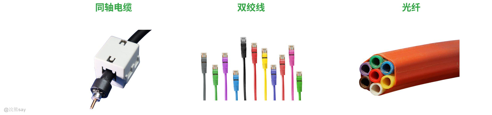
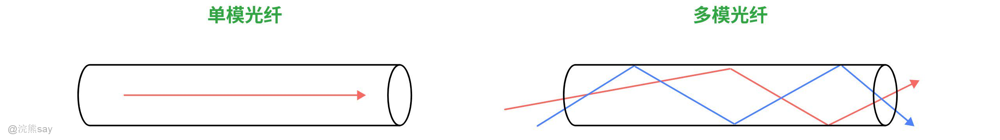

# 4、物理层

**Part 04：物理层**
| 【原创声明】大家好，我是say，是这篇文章的原创作者！985硕士毕业，应届进入某大厂后道心破碎，社招上岸多家855半垄断央企，因为自己淋过雨，希望帮大家撑把伞，帮助更多同学找到不内卷、能够好好生活的央国企，已帮助1000+同学上岸央国企，需要连联系学长的加微信：wx_hxsay |
| --- |

## 物理层

## 什么是物理层？

物理层是计算机网络体系结构中的最底层，负责在物理介质上传输比特流，定义物理设备的电气、机械和规程特性，主要目标是实现各种硬件设备在计算机网络上如何传输数据比特流，尽可能屏蔽掉物理设备和传输媒体的差异，使得数据链路层感受不到硬件设备之间的差异。

## 物理层的特性

1.  机械特性：指明接口所用接线器的形状和尺寸、引线数目和排列、固定和锁定装置等，例如RJ - 45接口的形状和引脚排列
2.  电气特性：指明在接口电缆的各条线上出现的电压的范围，例如RS - 232标准规定了信号线上的电压范围
3.  功能特性：指明某条线上出现的某一电平的电压表示何种意义，例如某条线上高电平表示逻辑1，低电平表示逻辑0
4.  过程特性：指明对于不同功能的各种可能事件的出现顺序，例如握手协议中的信号发送顺序

## 传输介质分类

## 有线传输介质

### 同轴电缆

同轴电缆由内导体（铜芯）、绝缘层、屏蔽层和外护套组成，通过电信号传输，类似于网状的屏蔽层可以屏蔽干扰信号，内层的铜制芯用来传输数据。同轴电缆适用于短距（1-5 米）可达 10Gbps 以上，长距（200-500 米）速率降至 10Mbps；抗电磁干扰能力强，信号衰减中等；成本介于双绞线和光纤之间。现在同轴电缆的典型应用有线电视（CATV）网络、工业强干扰环境通信、短距服务器集群互联，传统以太网曾广泛使用

### 双绞线

双绞线由两根绞合的铜导线构成，分非屏蔽（UTP）和屏蔽（STP）两类，依赖电信号传输。其速率覆盖 1Gbps（Cat5e）至 40Gbps（Cat8.2），传输距离通常 100 米内；UTP 抗干扰较弱，STP 通过屏蔽层提升稳定性；支持 PoE 供电，可同时传输数据和电力。常用于家庭 / 办公室局域网、工业传感器连接、物联网短距设备互联，是目前最普及的短距传输介质。

### 光纤

光纤顾名思义就是以光为传输介质的一种信息传导线路，由玻璃 / 塑料纤芯、包层和护套组成，分多模（MMF）和单模（SMF），通过光信号传输。传输的原理是“光的全反射”，简单来说，光纤通信是利用光纤传递光脉冲来进行通信的。

**单模光纤：**光纤的直径只有一个光的波长，可以使光线一直向前传播而不会产生多次反射，单模光纤相比于多模光纤可以支撑更加长的传播举例，适用于长距离传输，带宽高，成本较高，单模光纤速率可达 1Tbps、传输距离超 120 公里；完全免疫电磁干扰，信号衰减极低。

**多模光纤：**如上图所示，多模光纤可以实现多条不同角度的入射光纤在同一条光纤中传播，光脉冲在多模光纤中传输的时候回逐渐展宽，造成失真，因此多模态光纤只适用于短距离传输。适用于短距离传输，带宽较低，成本较低，多模光纤支持 10Gbps（550 米）至 100Gbps（2 公里）。

## 无线传输介质

### 红外线

红外线是波长在 750nm - 1mm 间的电磁波，频率高于微波、低于可见光 。其对非透明物体透过性差，衍射能力弱，适合短距离、视距传输。因不受无线电干扰且使用不受限，常见于家电遥控器等设备。但传输距离有限，一般在 10 米以内 。

### 无线电波

无线电波是通过介质或在介质分界面连续折射、反射来传播的电磁波 。依波长（频率）分不同波段，传播特性各异。长波适合远距离，中波用于船舶导航和广播，短波靠天波可远距通信广播，超短波用于调频广播、移动通信等。因其能长距离传输，在广播、通信、导航等领域广泛应用 。

### 激光通信

激光通信利用激光束作信息载体，发送端将信息调制到激光束上发出，接收端解调还原信息 。调制方式有强度调制、频率调制等。优点是传输快、远，抗干扰和保密性强；缺点是设备贵、技术难、对环境要求高。受天气、距离等限制，现主要用于军事、航天、通信等领域 。

### 微波通信

微波通信，也叫微波中继通信，使用 1m - 0.01m 波长微波，靠地面视距接力站转换信号实现远距离通信 。微波沿直线传播，超视距通信需设多个接力站逐站传递信号。具有通信频带宽、容量大、质量好、干扰小，建设维护成本低等优点，用于中远距离通信，在民用和军用通信中重要 。

### 卫星通信

卫星通信是利用人造地球卫星作中继站转发无线电波，实现多个地球站间通信 ，可突破地理限制，覆盖范围广、通信容量大、可靠性高。但存在信号传输延迟，易受卫星寿命、轨道位置、空间环境等影响 ，广泛用于国际通信、电视转播、航空航海通信、气象观测等领域 。

## 不同传输介质
| 传输介质 | 传输方式 | 速率 / 工作频带 | 传输距离 | 性能 | 价格 | 应用 |
| --- | --- | --- | --- | --- | --- | --- |
| 双绞线 | 宽带、基带 | ≤1Gb/s | 模拟：10km；数字：500m | 较好 | 低 | 模拟 / 数字信号传输 |
| 50Ω 同轴电缆 | 基带 | 10Mb/s | <3km | 较好 | 较低 | 基带数字信号 |
| 75Ω 同轴电缆 | 宽带 | ≤450MHz | 100km | 较好 | 较低 | 模拟电视、数据及音频 |
| 光纤 | 基带 | 40Gb/s | 20km 以上 | 很好 | 较高 | 远距离高速数据传输 |
| 微波 | 宽带 | 4～6GHz | 几百 km | 好 | 中等 | 远程通信 |
| 卫星 | 宽带 | 1～10GHz | 18000km | 很好 | 高 | 远程通信 |

## 物理层设备分类

## 中继器

中继器（Repeater）是一种工作在物理层的网络设备，用于解决信号在传输过程中因距离过长或干扰而产生的衰减和失真问题，从而扩展网络的传输范围。

从原理上来说，中继器的主要功能是将接收到的信号进行再生和放大，使其能够在更远的距离上传输。它不检查信号中的错误或数据内容，只是简单地复制和转发比特流，以确保信号的强度和波形符合传输要求。通过两个端口连接两个网段，将一个端口接收到的信号进行整形和放大，然后从另一个端口发送出去。其原理是信号再生，而不是简单地将衰减的信号放大。中继器一般具有以下几个特点：

1.  不进行存储 ：信号延迟小，能够快速转发数据
2.  不检查错误 ：会扩散错误，因为它只是简单地转发信号，不会对数据进行校验或纠错
3.  不对信息进行任何过滤 ：所有接收到的信号都会被转发到其他端口
4.  可进行介质转换 ：如将UTP（非屏蔽双绞线）转换为光纤，以适应不同的传输介质

中继器的常用场景是在长距离同轴电缆网络中，信号易衰减，中继器可使信号恢复强度继续传输，保障网络连通性。

## 集线器（HUB）

集线器（Hub） 是一种工作在物理层的网络设备，它的主要功能是将多个设备连接起来，并以广播方式传输数据。其实质上是一个多端口的中继器，也工作在物理层。当一个端口接收到数据信号后，由于信号在从端口到Hub的传输过程中已有了衰减，所以Hub会将该信号进行整形放大，使之再生（恢复）到发送时的状态，紧接着转发到其他所有（除输入端口以外）处于工作状态的端口上。如果同时有两个或多个端口输入，则输出时会发生冲突，致使这些数据都成为无效的

集线器具有与中继器同样的特点，如不进行存储、不检查错误、不对信息进行任何过滤等 ，可改变网络物理拓扑形式，如将总线连接转换为星形连接，但逻辑上仍是一个总线型共享介质网络 ，以集线器为核心的网络中所有主机共享带宽，无法限制冲突和广播，适用于小型网络

1.  主要用于使用双绞线组建共享式网络，是解决从服务器连接到桌面最经济的方案
2.  在交换式网络中，Hub直接与交换机相连，将交换机端口的数据送到桌面
3.  使用Hub组网灵活，它把所有结点的通信集中在以其为中心的结点上，对结点相连的工作站进行集中管理，不让出问题的工作站影响整个网络的正常运行，并且用户的加入和退出也很自由

集线器的应用场景是在早期以太网中，常通过集线器连接多台计算机，但由于共享带宽，易造成网络拥塞，现已逐渐被交换机取代 。

## 历年真题
| 【例题】计算机网络按传输介质分类，以下哪种介质传输速率最高？A. 光纤；B. 同轴电缆；C. 双绞线；D. 无线电波答案：A解析：光纤利用光信号传输，速率可达100Gbps以上，远高于同轴电缆（10 - 100Mbps）、双绞线（1Gbps至10Gbps）和无线电波（如Wi - Fi的数Gbps）。 |
| --- |

| 【国家电网（2017）】以下哪个选项描述的是物理层的功能？A. 主机寻址采用的是网络层的ARP协议；B. 物理层的功能是传输比特流；C. 传输层是ISO OSI协议的第四层协议，实现端到端的数据传输；D. 网络层是利用无线和有线网络对采集的数据进行编码、认证和传输。答案：B解析：物理层的主要功能是传输比特流。 |
| --- |

| 【国家电网（2023）】下列网络互连设备中，属于物理层的是？A. 交换机；B. 中继器；C. 路由器；D. 网桥答案：B解析：中继器是物理层设备，用于放大和再生信号，扩展网络传输距离。 |
| --- |

| 【中国铁塔（2021）】以下关于物理层设备的描述，正确的是？A. 中继器、集线器、CLOCK都属于物理层；B. 交换机属于网络层设备；C. 路由器属于数据链路层设备；D. 网卡属于网络层设备答案：A解析：中继器、集线器工作在物理层，用于信号的放大和转发；交换机属于数据链路层设备；路由器属于网络层设备；网卡工作在数据链路层。 |
| --- |

| 【南方电网（2017）】以下属于物理层设备的是（多选）？A. 集线器；B. 路由器；C. 网桥；D. 中继器答案：AD解析：集线器和中继器属于物理层设备，用于信号的放大和转发；路由器属于网络层设备；网桥属于数据链路层设备。 |
| --- |
