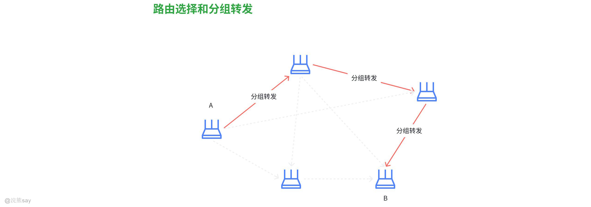
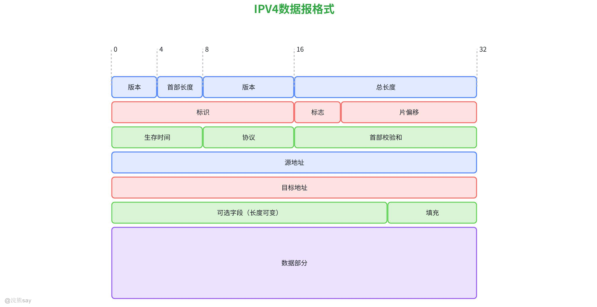
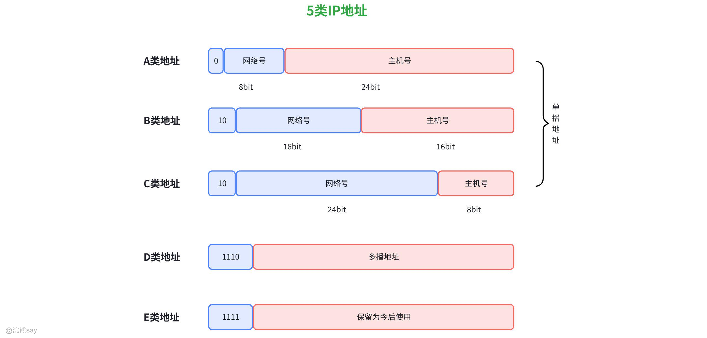
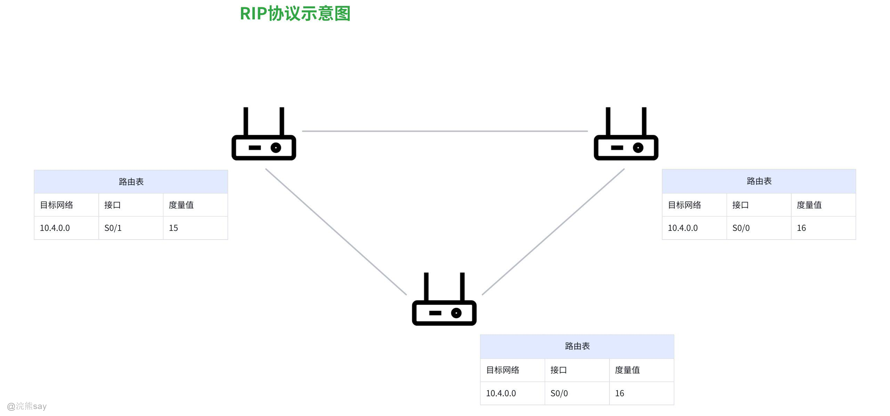
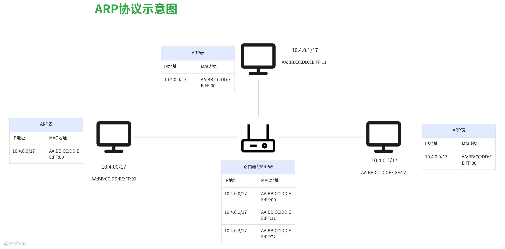
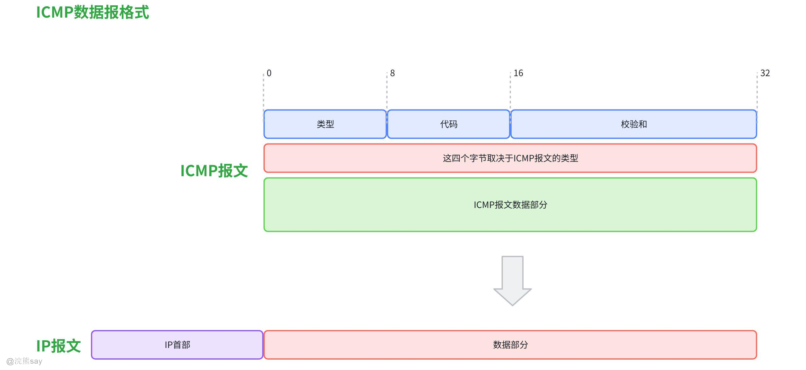

# **Part 06： 网络层**
| 【原创声明】大家好，我是say，是这篇文章的原创作者！985硕士毕业，应届进入某大厂后道心破碎，社招上岸多家855半垄断央企，因为自己淋过雨，希望帮大家撑把伞，帮助更多同学找到不内卷、能够好好生活的央国企，已帮助1000+同学上岸央国企，需要连联系学长的加微信：wx_hxsay |
| --- |

## 网络层功能

网络层是 OSI 参考模型中的第三层，主要负责将分组从源节点传输到目的节点，为传输层提供服务。其核心功能包括逻辑寻址、路由选择、分组转发、拥塞控制以及异构网络互联等，以确保数据在不同网络之间的正确传输和高效通信。

## 网络层主要协议

1.  **网际协议 IP** ：负责网络层寻址、路由选择、分段及包重组，有 IPv4 和 IPv6 两个版本。IPv4 采用 32 位地址，以点分十进制表示；IPv6 采用 128 位地址，地址空间更大，能满足未来物联网等大量设备接入互联网的需求。IP 协议是一个无连接、不可靠的协议，其核心问题是路由选择 。
2.  **地址解析协议 ARP** ：负责把 IP 地址转化成物理地址 。
3.  **反向地址解析协议 RARP** ：负责把物理地址转化成 IP 地址 。
4.  **网际控制报文协议 ICMP** ：定义了网络层控制和传递消息的功能，可以报告 IP 数据包传送过程中发生的错误、失败等信息，提供网络诊断功能 。
5.  **网际组管理协议 IGMP** ：负责管理 IP 组播组 。
6.  **路由信息协议 RIP** ：是典型的距离向量算法 。
7.  **开放式最短路径优先协议 OSPF** ：是链路状态算法，用于让一个组织或运营商内部的所有路由器自动地、动态地学习到整个网络的拓扑，并计算出到达所有网段的最短路径

## 异构网络互联

指将不同类型、不同协议的网络连接在一起，实现数据在异构网络之间的传输。例如，将以太网、无线局域网、广域网等不同类型的网络连接起来。网络层通过 IP 协议将各种异构网络中的数据封装成统一格式的数据包，屏蔽了不同网络的差异，使得数据能够在不同网络之间透明传输。同时，网络层还需要处理不同网络之间的地址转换、协议转换等问题，以确保数据能够正确地到达目的节点。

## 路由与转发

路由器的主要功能包括路由选择和分组转发，根据所需的性能要求，采用合适的路由算法来构造路由表，并进行路由选择。该路由表会根据从各相邻路由器所得到的关于整个网络的拓补变化情况，动态的改变所选择的路由，最终得到最佳的路由。

### 路由选择

是指确定数据包从源节点到目的节点的最佳路径的过程。路由器根据网络拓扑结构、链路状态、路由协议等信息，构建路由表，其中包含了网络地址与下一跳地址的映射关系。当路由器接收到数据包时，会根据数据包中的目的地址查找路由表，确定将数据包转发到哪个下一跳节点，从而实现数据的定向传输。

### 分组转发

是指路由器根据路由表将接收到的数据包从一个接口转发到另一个接口的过程。当数据包到达路由器时，路由器会检查数据包的目的地址，然后在路由表中查找对应的转发条目，根据条目中指定的出接口将数据包转发出去。转发过程涉及到数据包的接收、检查、修改（如更新 TTL 字段）和发送等操作，需要高效、准确地完成，以保证数据的快速传输。

## 网络层的主要设备

**路由器（Router）** ：用于连接多个逻辑上分开的网络，具有判断网络地址和选择 IP 路径的功能，是网络层的一种互联设备。它能在多网络互联环境中，建立灵活的连接，可用完全不同的数据分组和介质访问方法连接各种子网。路由器的核心功能包括对子网间的数据包进行路由选择，实现拥塞控制、网际互联等功能，确保数据从源主机到目的主机的端到端传输。关键协议包括 IP（网际协议）、ICMP（网络控制报文协议）、ARP（地址解析协议）等 。

**三层交换机（Layer 3 Switch）** ：结合了二层交换机的高速转发与路由器的路由功能，主要用于同一局域网内不同 VLAN 间的通信。它可以基于 IP 地址在不同 VLAN 或子网间路由数据，替代部分路由器功能，通过硬件 ASIC 芯片实现三层路由，转发速率远超传统路由器，支持 VLAN 间路由、静态路由及部分动态路由协议（如 OSPFv2/v3） 。

**桥路器（Brouter）** ：它控制从一个网络组件到另一个网络组件（时充当桥接器）和从网络到因特网（时充当路由器）的传输 。

**网关（Gateway）** ：又称网间连接器、协议转换器，在网络层以上实现网络互连，是最复杂的网络互连设备，仅用于两个高层协议不同的网络互连。既可以用于广域网互连，也可以用于局域网互连。网关对收到的信息要重新打包，以适应目的系统的需求

## 历年真题
| 【国家电网（2022 年）】网络层的主要功能是（ ）。A. 将网络地址翻译成对应的物理地址，并决定如何将数据从发送方路由到接收方B. 提供端到端的可靠、不可靠服务，包括连接管理、流量控制、复用与分用C. 定义数据格式及加密D. 定义如何开始、控制和结束一个会话答案 ：A解析 ：网络层的核心功能是逻辑寻址、路由选择和分组转发，其主要作用是将网络地址（如 IP 地址）翻译成对应的物理地址（如网卡地址），并决定如何将数据从发送方路由到接收方 |
| --- |

| 【国家电网（2023 年）】以下关于网络层和数据链路层联网设备的描述，正确的是（ ）。A. 网络层的联网设备是路由器B. 数据链路层的联网设备是网桥和交换机C. 传输层和会话层主要是软件功能，都不需要专用的联网设备D. 以上都对答案 ：D解析 ：网络层的主要设备是路由器，负责根据 IP 地址进行路由选择和分组转发；数据链路层的常见设备包括网桥和交换机，它们基于 MAC 地址进行帧的转发和过滤；传输层和会话层主要通过软件实现，一般不需要专用的联网设备 |
| --- |

| 【国家电网（2014 年）】网络层提供的服务使传输层不需要了解网络中的（ ）。A. 数据传输和交换技术B. 物理地址C. 端口号D. 应用程序答案 ：A解析 ：网络层的目的是实现两个端系统之间的数据透明传送，为传输层提供服务，使传输层不需要了解网络中的数据传输和交换技术，如分组交换、路由选择等具体实现细节。 |
| --- |

## IPv4协议

## IPv4的概念

### IPv4地址概念

IPv4 即互联网协议第四版，是互联网协议（IP）的一种具体实现，也是目前全球互联网广泛使用的网络层协议之一。它定义了网络上设备如何标识和通信，通过为每个连接到互联网的设备分配唯一的地址，实现数据在网络中的路由和传输，使得不同地区、不同类型的网络设备能够相互连接和交换信息。

### IPv4的特点

IPv4的特点通常包括唯一性、固定长度，可变性

1.  **唯一性：**在一个特定的网络环境中，每台设备的IPv4地址都是唯一的。这是确保网络中数据能够准确无误地发送到目标设备的关键。如同现实生活中的家庭住址，唯一性保证了网络数据包能够像信件一样准确地送达目的地，避免数据混乱和错误传输。
2.  **固定长度：**IPv4地址的长度固定为32位。这种固定长度的设计使得网络设备在处理IPv4地址时能够采用统一的方式进行存储、解析和路由决策。它就像一个标准的容器，无论里面存储的是什么内容，其大小始终保持不变，便于网络设备进行高效的处理和管理。
3.  **可变性：**计算机拥有的ip地址不是固定不变的，当网络发生变化之后，计算机的ip地址也会动态的发生变化，现在绝大多数计算机使用的都是动态ip地址。

### IPv4的表示方法——点分十进制表示法

由于32位二进制数不容易被人记忆，所以在书写IP地址的时候，通常采用点分十进制表示法，将 32 位的二进制地址分成 4 个 8 位的部分，每个部分用十进制数表示，中间用点号分隔。例如，192.168.1.1 就是一个典型的 IPv4 地址。其中，每个十进制数的取值范围是 0 到 255。这种表示方法便于人们理解和记忆，也方便网络设备进行地址的识别和处理。
| IP地址 | 11001100 11100011 10101011 11010011 |   |   |   |
| --- | --- | --- | --- | --- |
| 4 个字节 | 11001100 | 11100011 | 10101011 | 11010011 |
| 转化为十进制数 | 204 | 227 | 171 | 211 |
| 点分十进制表示 | 204.227.171.211 |   |   |   |

例如将IP地址： 11001100 11100011 10101011 11010011用点分十进制表示法表示的转换过程如上表所示。

## IP数据报格式

IP数据报由首部和数据两部分组成，首部的长度一般在20~60字节之间，其中固定长度是20字节是所有IP数据报所必须的；在首部固定部分后面有一些是可选字段，其长度是可变的，一个IP数据报的最大长度为65535字节，以下是各部分及字段详细介绍：

### IP数据报首部

#### 固定部分（20字节 ）

1.  **版本（4位）**：标识IP协议版本，常见有IPv4（值为4 ）和IPv6（值为6 ） ，发送和接收设备据此确定处理方式。
2.  **首部长度（4位）**：以4字节为单位，指示IP数据报首部长度。因首部可变部分存在，需该字段确定首部边界，取值范围5 - 15（对应20 - 60字节 ）。
3.  **区分服务（8位）**：用于提供不同服务质量，前6位是服务类型（DSCP） ，可标识不同优先级或服务需求，后2位保留。
4.  **总长度（16位）**：指IP数据报（首部 + 数据部分）的总字节数，最大值65535字节 ，据此判断数据报大小。
5.  **标识（16位）**：源主机为数据报分配唯一标识，用于分片和重组。同一数据报分片具有相同标识，接收方据此判断哪些分片属同一数据报。
6.  **标志（3位）**：最高位保留，中间位DF（不分片） ，置1表示数据报不能分片；最低位MF（更多分片） ，置1表示后续还有分片，置0表示最后一个分片。
7.  **片偏移（13位）**：以8字节为单位，指示该分片在原数据报中的相对位置，用于重组分片数据报。
8.  **生存时间（TTL，8位）**：数据报在网络中可经过的最大跳数，每经一个路由器减1 ，减为0时丢弃，防止数据报在网络中无限循环。
9.  **协议（8位）**：标识数据部分封装的上层协议，如TCP（值为6 ）、UDP（值为17 ） ，使IP层能将数据交付给对应上层协议处理。
10.  **首部检验和（16位）**：仅对首部计算校验和，用于检测首部在传输过程中是否出错。计算方法是将首部按16位分组求和取反，接收方重新计算验证。
11.  **源地址（32位）**：发送方IP地址，标识数据报来源。
12.  **目的地址（32位）**：接收方IP地址，指示数据报最终目的地。

### 可变部分

1.  **可选字段**：长度可变，用于实现可选功能，如记录路由（记录数据报经过的路由器地址）、时间戳（记录数据报经过各路由器的时间） ，最长40字节。
2.  **填充**：可选字段长度不是4字节整数倍时，用填充字段补全，保证首部长度是4字节整数倍。

### IP数据报数据部分

承载上层协议（如TCP、UDP）的数据，长度由总长度减去首部长度确定，其内容根据上层协议不同而不同，如TCP数据段、UDP用户数据报等。

## IPv4地址分类

IP地址分类是指将IP地址划分成若干个固定的类，每一类地址都是由两个固定长度的字段组成的，两级的IP地址可以用网络号+主机号表示。

前面一部分是网络号，标志主机或者路由器所连接到的网络，网络号在整个互联网范围内是唯一的，第二个字段是主机号，标志着该主机路由器。由于前面的网络号在整个互联网范围是唯一的，因此整个IP地址在整个互联网范围也是唯一的，网络号相同的主机不经过路由器可以直接进行通信。

### 5类IP地址

IPv4 地址根据网络号和主机号的划分方式，主要分为以下五类：

#### A类地址

-   **结构**：首位固定为 0 ，紧接着 7 位为网络号，剩余 24 位为主机号 ，共 8 位用于标识网络，24 位标识主机。
-   **范围**：网络号取值范围是 0 - 127 ，但 0 和 127 有特殊用途（如 127 用于本地环回测试 ），实际可用网络号从 1 - 126 。每个 A 类网络可容纳约 （减去全 0 和全 1 的主机号 ）个主机。
-   **用途**：适用于大型网络，拥有大量主机的网络环境 。

#### B类地址

-   **结构**：前两位固定为 10 ，接下来 14 位是网络号，16 位是主机号 ，即 16 位标识网络，16 位标识主机。
-   **范围**：网络号取值范围从 128.0 - 191.255 。每个 B 类网络可容纳约 个主机。
-   **用途**：适用于中等规模网络，像一些企业网络 。

#### C类地址

-   **结构**：前三位固定为 110 ，21 位用于网络号，8 位用于主机号 ，也就是 24 位标识网络，8 位标识主机。
-   **范围**：网络号取值范围从 192.0.0 - 223.255.255 。每个 C 类网络可容纳 = 254 个主机 。
-   **用途**：常用于小型网络，如办公室、家庭网络 。

#### D类地址

-   **结构**：前四位固定为 1110 ，剩余 28 位是多播地址 。
-   **范围**：地址范围从 224.0.0.0 - 239.255.255.255 。
-   **用途**：用于多播（组播）通信 ，可将数据同时发送给一组主机 。

#### E类地址

-   **结构**：前四位固定为 1111 ，其余位保留为今后使用 。
-   **范围**：地址范围从 240.0.0.0 - 255.255.255.255 。
-   **用途**：目前主要用于研究和实验等特殊用途 。

其中，A、B、C 类地址属于单播地址，用于一对一的通信场景 。

## 特殊ip地址
| 特殊IP地址 | 地址范围/具体地址 | 用途 |
| --- | --- | --- |
| 受限广播地址 | 255.255.255.255 | 向本地网络内所有主机发送广播消息，路由器禁止转发 |
| 直接广播地址 | 主机号全为1，如C类地址网络号部分+255（不同类别网络号规则不同） | 向同一子网内所有主机发送广播数据，路由器可决定是否转发 |
| 环回地址 | 127.0.0.0 - 127.255.255.255，常用127.0.0.1 | 测试本地TCP/IP协议是否正常工作，数据包不离开设备 |
| 0.0.0.0 | 无特定范围 | 设备启动未获取IP地址时，用作数据包源地址，不能作为目的地址 |
| 多播地址 | 224.0.0.0 - 239.255.255.255 | 实现一对多通信，用于视频流、在线会议、路由协议等 |
| 私有地址 | A类：10.0.0.0 - 10.255.255.255B类：172.16.0.0 - 172.31.255.255C类：192.168.0.0 - 192.168.255.255 | 用于企业等内部网络，接入Internet需通过NAT转换 |

## IP地址和物理地址区别

IP地址放在IP数据报的首部，是一种网络层以及以上层次所使用的地址，是一种逻辑地址；而物理地址则是放在MAC帧的首部，是数据链路层和物理层的使用地址。

1.  **IP地址（逻辑地址）**：由网络层（IP协议）分配的逻辑地址，用于标识网络中设备的逻辑位置，可根据网络拓扑变化动态调整。IPv4为32位二进制数（通常表示为点分十进制，如192.168.1.1），IPv6为128位（如2001:0db8:85a3:0000:0000:8a2e:0370:7334）。
2.  **物理地址（MAC地址）**：由数据链路层（如以太网）使用的硬件地址，固化在网络接口卡（NIC）的芯片中，唯一标识设备的物理身份，通常不可修改。格式是48位二进制数，通常表示为12位十六进制数（如00:1A:2B:3C:4D:5E），前24位为厂商标识符（OUI），后24位为设备序列号。

IP地址和物理地址的对比如下表所示：
| 维度 | IP地址 | 物理地址（MAC地址） |
| --- | --- | --- |
| 所属层次 | 网络层（OSI第3层） | 数据链路层（OSI第2层） |
| 地址性质 | 逻辑地址，可动态分配或修改 | 物理地址，硬件固化，全球唯一 |
| 作用范围 | 跨网络路由（全球或局域网） | 局域网内通信（同一数据链路层） |
| 地址长度 | IPv4：32位；IPv6：128位 | 48位（6字节） |
| 分配方式 | 手动配置、DHCP动态分配或自动生成 | 由硬件厂商烧录，遵循IEEE标准 |
| 是否可变 | 可随网络环境变化（如更换路由器） | 固定不变（除非更换网卡） |

两者在网络通信中缺一不可：IP地址实现逻辑路由，MAC地址完成物理传输，共同构成从“逻辑定位”到“物理送达”的完整通信链条。

## 历年真题
| 【南方电网（2024 ）】以下 IP 地址中，属于 C 类地址的是（ ）。A. 112.213.12.23B. 210.123.23.12C. 23.123.213.23D. 156.123.32.12答案 ：B解析 ：C 类地址的二进制表示开头部分为 110，其 IP 范围是 192 - 223。A 选项和 C 选项是 A 类 IP 地址（二进制表示开头部分为 0，IP 范围是 1 - 126），D 选项是 B 类 IP 地址（二进制表示开头部分为 10，IP 范围是 128 - 191） |
| --- |

## 划分子网和子网掩码

## 划分子网

前面讲过，ip地址由网络号+主机号组成，而划分子网则是在IP地址中增加一个“子网段号”，是的两级的IP地址变成三级的IP地址。具体来说就是将主机号中的若干位划分为子网号，而网络号保持不变，如下图所示：

划分子网一般而言是一个局域网系统内部的失去，本局域网以外的单位是察觉不到这个网络内部是由多个子网组成的，对外仍然表现为一个网络。

当其它网络上的主机向该网络发送数据包的时候，IP数据包仍然根据网络号来查找路由器，路由器收到该IP数据包之后，再将其转换成局域网内部的子网号和真实的IP地址。

## 子网掩码

子网掩码是一种用于标识 IP 地址中网络部分和主机部分的重要工具，在计算机网络中起着关键作用，子网掩码是一个 32 位的二进制数，它与 IP 地址结合使用，用于确定 IP 地址的网络部分和主机部分。P 地址和子网掩码是相辅相成的，缺一不可。IP 地址用于标识网络中的主机，而子网掩码用于确定 IP 地址的网络部分和主机部分。只有同时知道 IP 地址和子网掩码，才能确定该主机所在的网络以及在该网络中的具体位置。

将 IP 地址与子网掩码进行按位逻辑与运算，可以得到该 IP 地址所在的网络地址。例如，IP 地址为 192.168.1.100，子网掩码为 255.255.255.0，进行与运算后得到网络地址 192.168.1.0。同时通过改变子网掩码中 1 的位数，可以将一个较大的网络划分为多个较小的子网。例如，一个 C 类网络（默认子网掩码为 255.255.255.0），如果将子网掩码改为 255.255.255.192（即 26 位网络位），则可以将该网络划分为 4 个子网，每个子网可容纳 62 台主机。

路由器根据子网掩码来确定数据包的转发路径。当路由器接收到一个数据包时，它会根据数据包的目的 IP 地址和子网掩码来确定该数据包应该转发到哪个子网，常见的子网掩码如下所示：

-   A 类网络：默认子网掩码为 255.0.0.0，网络部分占 8 位，主机部分占 24 位，适用于大型网络。
-   B 类网络：默认子网掩码为 255.255.0.0，网络部分占 16 位，主机部分占 16 位，适用于中型网络。
-   C 类网络：默认子网掩码为 255.255.255.0，网络部分占 24 位，主机部分占 8 位，适用于小型网络。

## 子网掩码计算方法

### 网络地址计算

将 IP 地址和子网掩码转换为二进制数，然后进行按位逻辑与运算，得到的结果就是网络地址。例如，IP 地址为 10.1.2.3，子网掩码为 255.255.255.0，转换为二进制后分别为：

-   IP 地址：00001010.00000001.00000010.00000011
-   子网掩码：11111111.11111111.11111111.00000000
-   与运算结果：00001010.00000001.00000010.00000000，即网络地址为 10.1.2.0。

### 主机数量计算

根据子网掩码中 0 的位数来计算主机数量。，其中减 2 是因为要排除网络地址和广播地址。例如，子网掩码为 255.255.255.192（即 26 位网络位，6 位主机位），则

### 确定子网范围

已知网络地址和子网掩码，可以确定该子网的 IP 地址范围。例如，网络地址为 192.168.1.0，子网掩码为 255.255.255.192，则该子网的 IP 地址范围为 192.168.1.1 到 192.168.1.62，广播地址为 192.168.1.63。

## 无分类编址CIDR

CIDR，即“无类域间路由（Classless Inter-Domain Routing）”，是一种TCP/IP协议中的路由聚合技术，可以减少IP地址的浪费和网络设备的压力，提高网络运行效率，是为了解决IP地址耗尽所提出的一种方法。CIDR 是一种摒弃传统 A、B、C 类网络划分模式的 IP 地址编址方法，通过 “网络前缀 + 主机位” 的方式灵活定义网络范围，实现 IP 地址的高效分配与路由聚合，解决了 IPv4 地址短缺和路由表膨胀问题。CIDR的主要特点包括：

1.  **无类别划分**
    不再依赖固定的 A 类（8 位网络位）、B 类（16 位）、C 类（24 位）网络边界，而是用 “/ 网络前缀长度” 表示网络范围。例如：

-   192.168.1.0/24 表示网络前缀为前 24 位，剩余 8 位为主机位。
-   10.0.0.0/16 表示前 16 位为网络前缀，后 16 位为主机位。

1.  **地址表示法**

-   格式：IP地址/网络前缀长度，其中前缀长度用数字 n 表示（n 范围 1~32）。
-   示例：
-   子网掩码255.255.255.0对应/24（前 24 位为 1）；
-   子网掩码255.255.0.0对应/16（前 16 位为 1）。

总之，CIDR通过调整前缀长度，将大网络划分为不同规模的子网，提高地址利用率。解决了 IPv4 地址资源紧张和路由效率问题，是现代网络编址的核心技术。掌握 CIDR 的地址计算和路由聚合方法，对网络规划、IP 地址管理及路由配置具有关键意义。

## 历年真题
| 【国家电网（2017）】某公司的网络地址为 192.168.1.0，要划分成 5 个子网，每个子网最多 20 台主机，则适用的子网掩码是（）A. 255.255.255.192B. 255.255.255.240C. 255.255.255.224D. 255.255.255.248答案：C解析：需要划分成 5 个子网，2^3 = 8 > 5，所以子网位至少需要 3 位；每个子网最多 20 台主机，2^5 - 2 = 30 > 20，所以主机位至少需要 5 位。因此，子网掩码为 255.255.255.224。 |
| --- |

| 【国家电网 （2016 ）】下列关于 IP 地址和子网掩码的说法中，正确的是（）A. IP 192.168.0.55 / 29 与 192.168.0.49 / 29 在同一子网B. 129.23.144.16 / 255.255.192.0 与 129.23.126.222 / 255.255.192.0 在同一子网C. 子网掩码为 255.255.255.192 的网段最多有 126 台可用的主机D. 子网掩码为 255.255.255.128 的网段最多有 126 台可用的主机答案：AD解析：/29 子网掩码对应 255.255.255.248，每个子网有 8 个 IP 地址，192.168.0.49 - 192.168.0.55 均在 49 - 56 网段，故 A 正确；255.255.192.0 的子网划分中，144 属于 128 - 191 网段，126 属于 0 - 127 网段，不在同一子网，B 错误；255.255.255.192 子网主机数为 62，C 错误；255.255.255.128 子网主机数为 126，D 正确 |
| --- |

## 路由协议

路由协议是网络层的重要组成部分，用于确定数据包在网络中的传输路径。根据网络类型和设计需求，路由协议可分为不同的类型，主要包括路由选择协议、RIP、OSPF 和 BGP等协议。

## 路由选择协议

路由选择协议说白了就是网络里的“导航系统”，专门告诉路由器怎么把数据包从起点送到终点。比如说咱们寄快递，不同快递公司有不同的送货路线规划，路由选择协议也一样，根据网络大小和需求分成外部网关协议和内部网关协议两类：

1.  内部网关协议（IGP）：用于自治系统（AS）内部的路由信息交换，常见协议包括 RIP、OSPF、IS-IS 等。
2.  外部网关协议（EGP）：用于不同自治系统之间的路由信息传递，目前最常用的是 BGP。

举个例子：在一个公司或者机构内部的网络里（专业叫自治系统，AS），用的是“内部导航协议，IGP”，像RIP和OSPF就是属于内部网关协议。RIP比较简单粗暴，就看“跳数”——比如从A路由器到B路由器要经过几个中间设备，超过15步就觉得太远不去了，适合小网络，但反应慢，万一网络结构变了，它得好久才能更新路线，还容易绕路。OSPF就高级点，像画地图一样，把每个路由器的连接情况和带宽都记下来，用算法算出最快的路，适合大公司的复杂网络，还能分区管理，不会绕路，反应也快。

而不同公司、不同运营商的网络之间（比如电信和联通的网络），就得用“跨区导航协议，EGP”，最常用的是BGP。这就像不同快递公司之间交换送货信息，BGP不光看路有多远，还看“规矩”——比如经过哪些运营商、有没有政策限制，甚至可以自己设置优先走哪条路，特别适合像互联网这种超级复杂的大网络，能处理海量的路线信息，而且可以按策略控制数据走哪条线，比如优先选便宜的或者速度快的路径。

## 路由信息协议（RIP，Routing Information Protocol）

RIP（Routing Information Protocol，**路由信息协议**）是基于**距离矢量算法**的内部网关协议（IGP），核心用 “跳数” 衡量路径开销，仅适用于小型局域网或简单分支网络，是早期网络中常用的路由协议。通俗来说RIP协议就像个“路痴版导航”，是路由器里最简单的路径规划方式。打个比方，它就像你问邻居“去超市怎么走”，邻居告诉你“过3个路口左转”，你再把这话传给下一个人，大家靠互相打听来记路线，其核心流程如下：

1.  路由器初始化：启动时，仅包含自身直连网络的路由条目，形成初始路由表。
2.  路由更新：每隔 30 秒，向邻居发送完整路由表（RIPv1）或增量更新（RIPv2），告知邻居自己可达的网络及跳数。
3.  路径计算：收到邻居的路由信息后，对比自身路由表，选择跳数最少的路径作为最优路由，更新本地路由表。
4.  环路处理：若某条路由不可达，通过 “毒性逆转” 标记为 16 跳（不可达），并快速通告邻居，避免环路。

RIP协议的优点在于配置和维护门槛低，无需复杂拓扑规划，路由器无需存储全网拓扑，仅需维护邻居路由信息，对硬件要求低。RIP协议的缺点是，适用范围窄，最大 15 跳限制，无法用于中型及以上网络。逐跳更新导致路由信息扩散延迟，网络故障后恢复时间长。开销较大，30 秒全量广播（RIPv1）会占用网络带宽，尤其在路由器较多时。路径判断单一，仅看跳数，不考虑带宽、延迟等实际链路质量，可能选择低效路径。

RIP 协议的核心价值是 “简单易用”，适配小型网络的路由需求，但受限于跳数限制和收敛速度，如今已逐渐被 OSPF、EIGRP 等更高效的路由协议替代。其本质是 “邻居间共享全部路由”，通过跳数判断最优路径，是理解距离矢量路由协议的基础。

## 开放式最短路径优先（OSPF，Open Shortest Path First）

OSPF（Open Shortest Path First）是基于**链路状态算法**的企业级内部网关协议（IGP），核心用于大中型网络的路由寻址，凭借全局拓扑感知、最优路径计算和快速收敛成为主流选择。

通俗来说，OSPF协议就像个“聪明的城市交通规划师”，专门给中大型网络算最优路线，就像你用手机导航APP，每个路口的摄像头（路由器）实时上传路况，APP后台把所有路况拼成实时地图，然后根据你的起点和终点，直接算出最快路线，还能避开拥堵。OSPF就是这个逻辑，只不过它在网络里干的是同样的事儿——用实时链路状态算最优路径，还支持“选路优先看带宽”（比如优先走宽的路，不看跳数），是企业中大型网络的主流协议。主要工作流程如下：

1.  邻居发现与邻接建立：路由器启动后，向直连接口发送 Hello 包，匹配参数一致的设备建立邻居关系，进一步同步链路信息形成邻接关系。
2.  链路状态同步：邻接路由器间交换 LSA（包含自身直连链路、邻居信息、Cost 值等），所有路由器收集 LSA 后，构建完全一致的 “链路状态数据库（LSDB）”（即全网拓扑图）。
3.  最优路径计算：基于 LSDB，以自身为根节点，通过 SPF 算法生成 “最短路径树”，从树中提取路由条目写入本地路由表。
4.  路由维护：链路故障或拓扑变化时，触发 LSA 更新，全网 LSDB 快速同步后，路由器重新执行 SPF 算法，更新路由表（收敛速度快）。

OSPF协议的优点在于：路径最优，基于带宽计算 Cost，避免 RIP “跳数少但带宽低” 的低效路径。收敛快速,触发式更新 + SPF 算法，网络故障后能快速恢复路由连通。支持大型网络,区域划分降低路由开销，可适配千台路由器的复杂拓扑。开销可控，仅传递链路状态变化信息，不重复发送全量路由表，节省带宽。OSPF协议的缺点在于，配置复杂，区域规划、邻居管理、认证配置等要求运维具备一定技术门槛。资源占用高，需存储 LSDB 并执行 SPF 算法，对路由器的 CPU、内存要求高于 RIP。

OSPF 的核心竞争力是 “全局拓扑 + 最优路径 + 快速收敛”，通过区域划分突破了大型网络的扩展限制，是企业级网络（如园区网、数据中心互联）的首选 IGP 协议；其本质是 “全网同步拓扑，各自计算路由”，与 RIP“邻居共享路由，逐跳传递” 的逻辑形成核心区别。

## 外部网关协议（BGP，Border Gateway Protocol）

BGP（Border Gateway Protocol）是**外部网关协议（EGP）** 的核心标准，核心用于不同自治系统（AS）间交换路由信息，凭借灵活的路由控制能力和防环路设计，成为互联网骨干网及企业跨 AS 互联的首选协议。

通俗来说BGP协议就像互联网世界的“跨国物流调度中心”，专门解决不同网络运营商（比如电信、联通、亚马逊云）之间的数据传输路线问题，比前面的OSPF和RIP更像“老油条”，讲究“策略优先”而非单纯找最短路径。 因为整个互联网是无数个运营商、企业网络连起来的“超级网”，每个主体都有自己的利益和规则（比如有的运营商之间互相免费转接流量，有的需要收费），BGP能让每个网络根据自己的策略选择路线，同时又能把所有路线信息互通，确保数据能跨全球传输，是互联网的“全球物流总指挥”。BGP的核心逻辑如下：

1.  对等体建立：手动配置对等体 AS 号和 IP 地址后，双方通过 TCP 端口 179 建立连接，发送 “OPEN 报文” 协商参数（如 AS 号、保持时间），参数一致则建立稳定邻居关系。
2.  路由交换：邻居建立后，交换 “路由更新报文”，包含可达网络前缀及对应的 AS 路径、下一跳等属性，双方接收后更新本地 “BGP 路由表”。
3.  最优路径选择：基于预设的路径属性优先级（如先比本地优先级，再比 AS 路径长度等），从多条可达路由中筛选出最优路由，若该路由需向内网发布，会注入 AS 内部 IGP。
4.  路由维护：通过 “Keepalive 报文”（默认 60 秒发送一次）保活邻居关系；路由状态变化（如链路故障、策略调整）时，触发增量更新，同步对等体并重新决策最优路径。

BGP协议的优点在于，唯一能支撑大规模跨 AS 互联的协议，是互联网全球互通的基础，通过多路径属性和路由策略，可按需控制流量走向（如优先走低成本运营商、分担流量），AS 路径属性 + 多种辅助防环机制，彻底避免跨 AS 路由环路。适配大规模网络，支持海量路由条目（互联网级路由表），更新机制高效，带宽开销可控。BGP协议的缺点是，配置复杂，对等体规划、路由策略设计、属性调整等对运维技术要求极高，需熟悉跨 AS 网络架构。依赖 IGP 支撑，BGP 对等体间的连通性需依赖 AS 内部 IGP 保障，若 IGP 故障会导致 BGP 邻居中断。选路决策复杂，多路径属性的优先级配置不当易导致路由异常，排查难度高于 IGP。

BGP 的核心竞争力是 “跨 AS 选路 + 灵活路由控制”，通过路径属性和 TCP 可靠连接，既保障了大规模互联的稳定性，又能满足企业个性化的流量调度需求，是互联网及中大型企业跨域互联的 “基石协议”。与 IGP（如 OSPF）的核心区别在于：IGP 负责 AS 内部 “快速收敛、最优路径”，BGP 负责 AS 之间 “策略控制、环路避免”。

## RIP、OSPF、BGP协议核心对比表
| 对比维度 | RIP（路由信息协议） | OSPF（开放式最短路径优先） | BGP（边界网关协议） |
| --- | --- | --- | --- |
| 协议类型 | 内部网关协议（IGP），距离矢量协议 | 内部网关协议（IGP），链路状态协议 | 外部网关协议（EGP），路径矢量协议 |
| 核心定位 | 小型自治系统（AS）内部路由互联 | 大中型自治系统（AS）内部路由互联 | 跨自治系统（AS）路由交换（互联网/企业跨域） |
| 算法基础 | 距离矢量算法（逐跳传递路由表） | 链路状态算法 + SPF（最短路径优先）算法 | 路径矢量算法（传递路由属性+AS路径） |
| 度量值（路径开销） | 跳数（最大15跳，16跳不可达） | Cost=10⁸/链路带宽（bps），带宽越高Cost越小 | 无固定度量值，依赖多路径属性（AS路径长度、本地优先级等） |
| 适用场景 | 小型局域网（如办公室、小型分支），无复杂拓扑 | 企业园区网、数据中心、大中型内网，需最优路径和快速收敛 | 互联网骨干网、企业多运营商互联、跨地域跨AS互联 |
| 收敛速度 | 慢（逐跳更新，依赖计时器） | 快（触发式更新+SPF算法，秒级收敛） | 中等（触发+增量更新，依赖对等体同步） |
| 更新机制 | 周期全量更新（RIPv1广播，RIPv2组播），默认30秒 | 触发更新（链路变化时）+ Hello包保活（10/30秒），无全量路由广播 | 触发更新+增量更新，仅传递变化路由，Keepalive保活（60秒） |
| 防环路机制 | 水平分割、毒性逆转、抑制计时器 | SPF算法天然无环路，LSDB全网一致 | AS路径属性（含自身AS则丢弃）、同步规则 |
| 支持核心功能 | RIPv2支持VLSM、CIDR，无路由汇总优先级 | 支持VLSM、CIDR、路由汇总、认证、区域划分 | 支持路由策略（过滤/聚合/属性调整）、VPN、多协议（IPv4/IPv6） |
| 资源占用（CPU/内存） | 低（无需存储拓扑，仅维护邻居路由） | 中高（需存储LSDB，执行SPF算法） | 高（需维护海量路由表+路径属性，依赖TCP连接） |
| 配置复杂度 | 简单（仅需启用协议、宣告直连网络） | 中等（区域规划、接口配置、邻居匹配） | 复杂（对等体规划、路由策略、属性调整） |
| 典型版本 | RIPv1（有类）、RIPv2（无类） | OSPFv2（IPv4）、OSPFv3（IPv6） | BGPv4（IPv4）、BGPv4+（IPv6）、MP-BGP（多协议） |

## 历年真题
| 【南方电网（2024 ）】开放最短路径优先（OSPF）协议是一种链路状态路由协议，旨在替代距离矢量路由协议 RIP。OSPF 是一种无类路由协议，它使用区域概念实现可扩展性。RFC 2328 将 OSPF 度量定义为一个独立的值，该值称为开销，使用以下哪种作为 OSPF 开销度量？A. 跳数；B. 带宽；C. 延迟；D. 可靠性答案 ：B解析 ：OSPF 使用带宽作为开销度量，因为带宽能够更准确地反映链路的性能 |
| --- |

| 【国家电网（2023 ）】如果路由器收到了多个路由协议转发的关于某个目标的多条路由，那么决定采用哪条路由的策略是？A. 选择与自己路由协议相同的；B. 选择路由费用最小的；C. 比较各个路由的管理距离；D. 比较各个路由协议的版本答案 ：C解析 ：当路由器收到多个路由协议转发的关于某个目标的多条路由时，应该选择管理距离最短的路由，因为管理距离反映了路由协议的可信度和优先级。 |
| --- |

| 【国家电网（2017 ）】以下哪些是有类路由协议？A. RIPV；B. IGRP；C. OSPF；D. IS - IS答案 ：AB解析 ：有类路由协议是指在路由更新中不包含子网掩码信息的协议，RIPV 和 IGRP 属于有类路由协议，而 OSPF 和 IS - IS 是无类路由协议。 |
| --- |

## 其它协议

## ARP协议

### ARP协议概念

ARP即地址解析协议（Address Resolution Protocol ） ，是TCP/IP协议族中的重要协议，用于在采用以太网的TCP/IP网络中，将网络层的IPv4地址动态映射为数据链路层的MAC地址 。它仅适用于IPv4，IPv6中类似功能由ICMPv6的邻居发现协议实现。其主要作用是让网络设备能建立目标IP地址和MAC地址之间的映射，以便在局域网中准确传输数据帧。

### ARP协议工作原理

1.  **ARP缓存查找** ：当设备要向目标设备发送数据时，先在本地ARP缓存表中查找目标IP地址对应的MAC地址。若存在，直接使用该MAC地址封装数据帧并发送；若不存在，则进入下一步。
2.  **发送ARP请求** ：设备以广播形式发送ARP请求报文，该报文封装在数据帧中。数据帧的源MAC地址是发送设备自身MAC地址，目的MAC地址为广播地址（FF - FF - FF - FF - FF - FF ） 。ARP请求报文中包含源IP地址、源MAC地址、目的IP地址等信息 。该请求会在整个局域网内传播，所有主机都会收到。
3.  **ARP响应** ：局域网内其他主机收到ARP请求后，检查报文中的目的IP地址是否与自身IP地址匹配。若不匹配，直接丢弃；若匹配，则将ARP报文中的源MAC地址和源IP地址信息记录到自己的ARP缓存表中 ，然后以单播方式向发送方返回ARP响应报文，报文中包含自身MAC地址。
4.  **更新ARP缓存** ：发送方收到ARP响应后，获取目标设备的MAC地址，将其与目标IP地址的映射关系存入本地ARP缓存表，后续与该目标设备通信时，可直接从缓存表中获取MAC地址，无需再次发送ARP请求 。ARP缓存表中的映射关系有一定有效期，过期后会自动删除。

### RARP协议

RARP即逆向地址解析协议（Reverse Address Resolution Protocol ） ，于1984年6月在RFC903中定义 。与ARP相反，它的作用是将数据链路层的MAC地址动态映射为网络层的协议地址（如IP地址 ） 。在无盘工作站等场景中应用，这些设备知道自身MAC地址，但启动时不知道IP地址，通过RARP协议，无盘工作站发送RARP请求，网络中的RARP服务器接收请求后，根据MAC地址查找并返回对应的IP地址，使无盘工作站获得IP地址进行网络通信。

## ICMP协议

### ICMP协议概念

ICMP即互联网控制报文协议（Internet Control Message Protocol ） ，是TCP/IP协议族的网络层协议，常被视为IP协议一部分，用于在IP主机、路由器间传递控制消息 。IP协议尽力而为传输数据，不负责反馈传输中的错误等情况，ICMP则辅助IP协议进行网络质量管理，在IP包出错时汇报错误信息。比如，当路由器无法转发数据包时，可通过ICMP告知发送方 。其消息主要分查询类和差错诊断类，用于网络诊断、检测可达性、报告错误，常见工具ping和traceroute都依赖ICMP 。

### ICMP协议报文格式

ICMP报文封装在IP数据报中，IP报头在最前，一个ICMP报文含IP报头（至少20字节 ）、ICMP报头（至少8字节 ）和ICMP报文数据部分 。当IP报头协议字段值为1时，表明是ICMP报文，ICMP报头具体如下：

-   **类型（1字节）**：标识ICMP报文类型，已定义14种 。从类型值分两类，1 - 127为差错报文，如目标不可达、超时；128以上为信息报文 ，如回显请求与应答 。
-   **代码（1字节）**：与类型字段共同标识ICMP报文详细类型 。如类型值3表示终点不可达，代码值0 - 15对应不同不可达细分情况，像代码0为网络不可达、代码1为主机不可达 。
-   **校验和（2字节）**：对包括ICMP报文数据部分的整个ICMP数据报计算校验和 ，检测报文传输是否出错，计算方法同IP报头校验和 。
-   **标识（2字节）**：仅适用于回显请求和应答ICMP报文，标识本ICMP进程，其他如目标不可达、超时ICMP报文该字段值为0 。

### ICMP协议报文种类
| 分类 | 类型值 | 代码值 | 报文名称 | 功能说明 |
| --- | --- | --- | --- | --- |
| 差错报告报文 | 3 | 0 | 终点不可达 - 网络不可达 | 路由器或主机无法传递数据，因网络不可达时发送 |
| 3 | 1 | 终点不可达 - 主机不可达 | 路由器或主机无法传递数据，因主机不可达时发送 |
| 3 | 2 | 终点不可达 - 协议不可达 | 路由器或主机无法传递数据，因协议不可达时发送 |
| 3 | 3 | 终点不可达 - 端口不可达 | 路由器或主机无法传递数据，因连接不存在端口时发送 |
| 4 | - | 源点抑制 | 路由器因网络拥塞，告知发送主机减少数据报流量 |
| 5 | - | 改变路由（重定向） | 路由器告知发送主机到目标IPv4地址的更好路由 |
| 11 | 0 | 超时 - 传输超时 | IP数据报跳数超过生存时间时发送 |
| 11 | 1 | 超时 - 分段重组超时 | 分段的IP数据报未在期限内重组时发送 |
| 12 | - | 参数问题 | IP数据报首部参数有问题时发送 |
| 询问报文（查询类报文） | 8 | - | 回送（Echo）请求 | Ping工具发送此报文检查IPv4连接 |
| 0 | - | 回送（Echo）应答 | 目标主机收到回送请求后，正常时返回此报文 |
| 13 | - | 时间戳（Timestamp）请求 | 发送方填充原始时间戳，测试两台主机数据报来回传输时间 |
| 14 | - | 时间戳（Timestamp）应答 | 接收方收到时间戳请求后，填充接收时间戳后返回此报文 |

## 历年真题
| 【国家电网（2019 年）】将物理地址转换为 IP 地址的协议是（ ）A. IPB. ICMPC. ARPD. RARP答案 ：D解析 ：ARP 地址解析协议，用于将 IP 地址转换为物理地址；ICMP 是传输控制协议；RARP 逆向地址解析协议将物理地址转化成网络地址 |
| --- |

| 【国家电网（2016 年）】ARP 协议的功能是（ ）A. 根据 IP 地址查询 MAC 地址B. 根据 MAC 地址查询 IP 地址C. 根据域名查询 IP 地址D. 根据 IP 地址查询域名答案 ：A解析 ：ARP（地址解析协议）用于在局域网中，根据已知的 IP 地址获取对应的 MAC 地址。B 选项是 RARP 协议的功能；C 和 D 选项是 DNS（域名系统）的功能 |
| --- |

| 【国家电网（2019 年）】ICMP 协议属于（ ）。A. 网络层协议B. 传输层协议C. 数据链路层协议D. 应用层协议答案 ：A解析 ：ICMP（Internet Control Message Protocol）即网际控制报文协议，是 TCP/IP 协议族的一个子协议，属于网络层协议，用于传输出错报告控制信息，如目的主机或网络不可到达、报文被丢弃、路由阻塞等 |
| --- |

## IPv6

## 概念&特点

IPv6 是互联网协议第 6 版，是 IPv4 的 “继任者”，主要解决 IPv4 地址不够用的问题（IPv4 地址像 192.168.1.1，只有约 43 亿个，而全球联网设备早超百亿）。

IPv6 地址长度是 128 位，数量是 2¹²⁸个，大概够给地球上每粒沙子都分配一个地址，再也不用担心 “门牌不够用”。不用像 IPv4 那样分 A/B/C 类地址，自动支持子网划分（比如企业网、家庭网自己随便分）。自带 “地址自动配置” 功能，设备联网时能自己生成地址，不用手动设置（像手机连 WiFi 自动获取 IP）。现在IPv4地址正逐渐 向 IPv6 进行过度，主要采用以下两种方式：

1.  **双协议栈方式** ：在完全过渡到 IPv6 之前，使一部分主机（或路由器）同时运行 IPv4 和 IPv6 两个协议栈，通过双协议进行转换 。

1.  **隧道技术** ：将整个 IPv6 数据报封装到 IPv4 数据报的数据部分，使 IPv6 数据报可以在 IPv4 网络的隧道中传输

## 表示方法

1.  采用“冒号十六进制”表示，将 128 位地址分成 8 段，每段 16 位，转换为十六进制并用冒号分隔，例如 2001:0db8:85a3:0000:0000:8a2e:0370:7334 。
2.  支持零压缩，即连续的零可以用一对冒号取代，例如 FF05:0:0:0:0:0:0:B3 可写成 FF05::B3 。
3.  支持 CIDR 的斜线表示法，例如 60 位的前缀 2AB0:0000:000D:3000:0000:0000:0000:0000 可记为 2AB0:0000:000D:3000::/60 。

## 地址类型
| 地址类型 | 核心作用 | 典型特征/应用 |
| --- | --- | --- |
| 单播地址（Unicast） | 标识单个设备，数据直接定向传输 | 全球单播地址：全球唯一，可互联网访问（如网站服务器地址）链路本地地址：局域网内有效，以fe80::开头（设备自动生成） |
| 组播地址（Multicast） | 标识一组设备，数据发送后组内所有设备接收 | 应用：视频会议数据广播、路由器路由信息更新（如OSPFv3） 格式：以ff00::开头（如ff02::1代表链路内所有节点） |
| 任播地址（Anycast） | 标识一组设备，数据自动发送至网络距离最近的设备 | 应用：云服务就近连接（如阿里云服务器）、DDoS防御流量分散特点：地址格式与单播相同，需手动配置设备所属组 |

## 特殊地址
| 地址类型 | 具体地址（含缩写） | 用途说明 |
| --- | --- | --- |
| 未指明地址 | 16字节全0地址（缩写为“::”） | 仅作为未配置标准IP地址的主机的源地址使用 |
| 环回地址 | 0:0:0:0:0:0:0:1（记为“::1”） | 用于主机自身回路测试，仅本机内部通信 |
| 基于IPv4的地址 | 前缀为0000:0000:0000:0000:0000:FFFF | 部分地址用作与IPv4兼容的通信地址 |
| 本地链路单播地址 | 以fe80::开头 | 仅用于局域网内设备之间的通信 |

## 历年真题
| 【国家电网（ 2018）】 关于 IPv6，下面的论述中正确的是（ ）。A. IPv6 数据包的首部比 IPv4 复杂B. IPv6 的地址分为单播、广播和任意播 3 种C. 主机拥有的 IPv6 地址是唯一的D. IPv6 地址长度为 128 比特答案 ：D解析 ：IPv6 地址长度为 128 比特，相比 IPv4 的 32 比特地址空间大大增加，解决了地址短缺问题。IPv6 数据包首部相对 IPv4 更加简洁，选项 A 错误；IPv6 没有广播地址，选项 B 错误；主机可以拥有多个 IPv6 地址，选项 C 错误 |
| --- |

| 【国家电网（2017）】关于 IPv6，下面的论述中不正确的是（ ）。A. IPv6 数据包的首部比 IPv4 复杂B. IPv6 的地址分为单播、广播和任意播 3 种C. 主机拥有的 IPv6 地址是唯一的D. IPv6 地址长度为 128 比特答案 ：ABC解析 ：IPv6 数据包首部进行了简化，选项 A 错误；IPv6 没有广播地址，选项 B 错误；主机可以有多个 IPv6 地址，选项 C 错误；IPv6 地址长度为 128 比特，选项 D 正确。 |
| --- |
