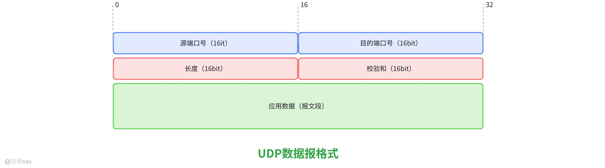
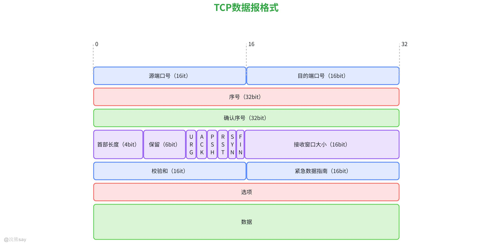
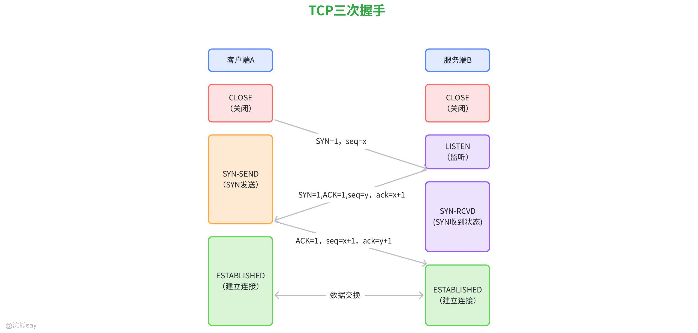
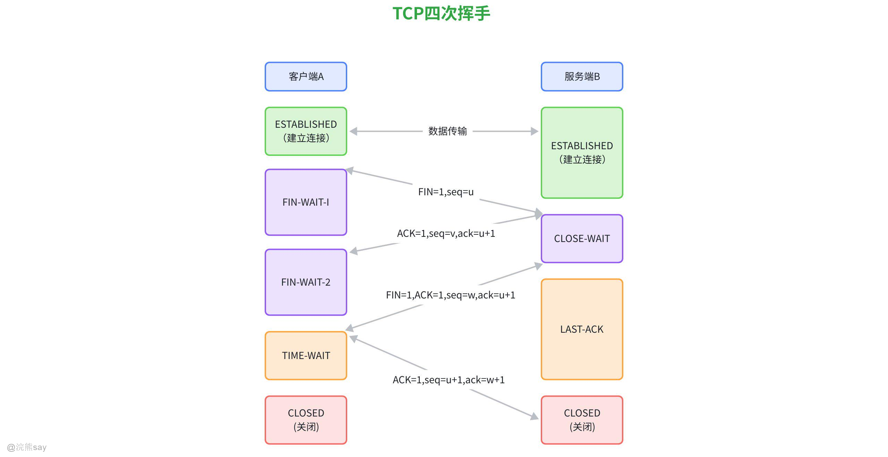
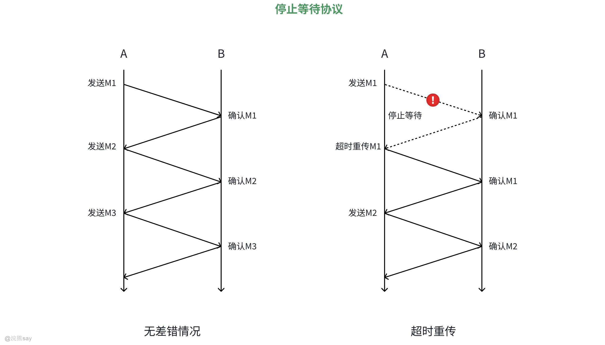
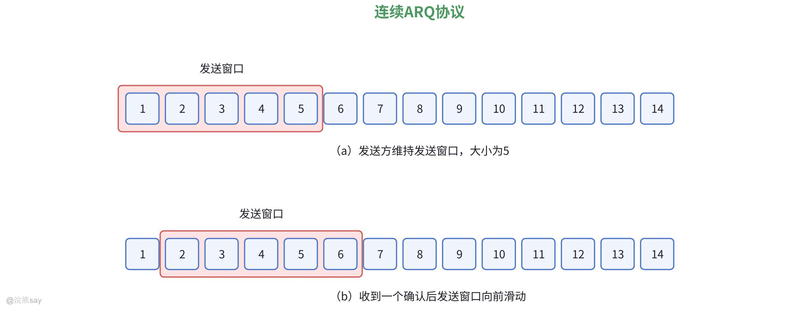
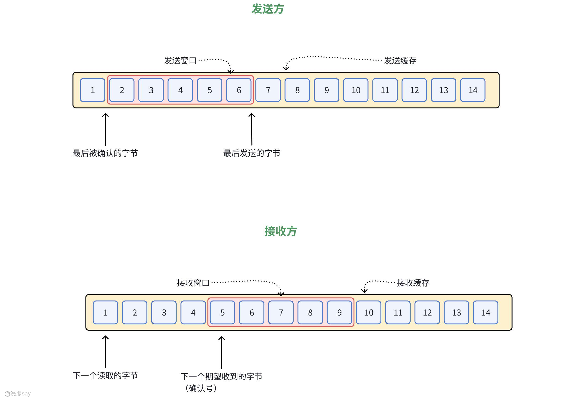
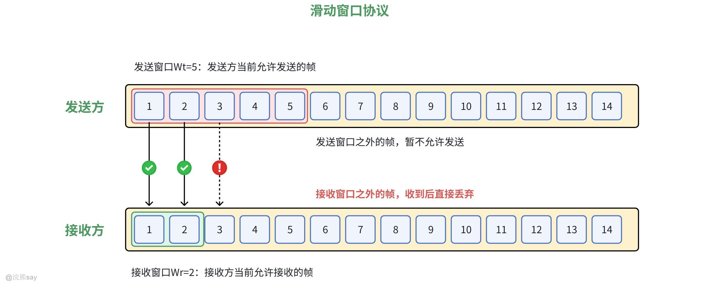
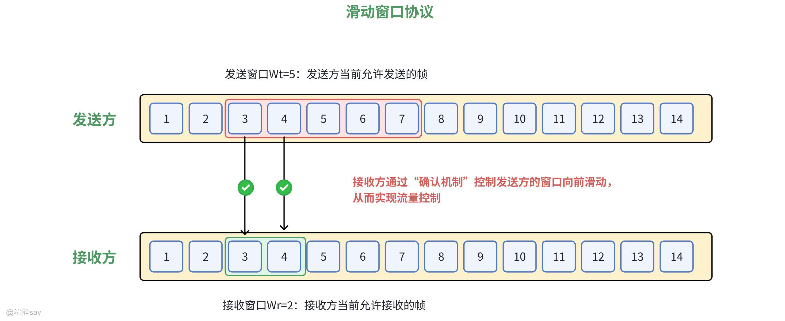
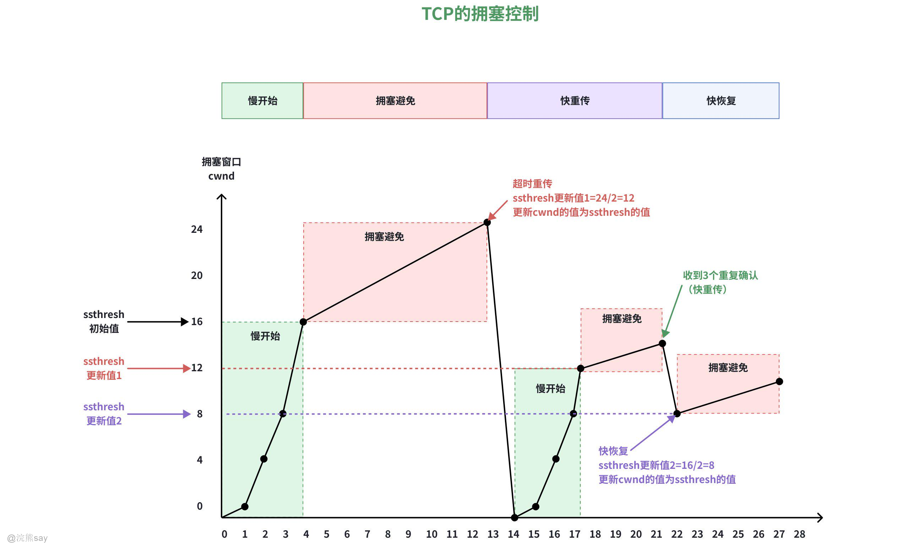

# **Part 07：传输层**
| 【原创声明】大家好，我是say，是这篇文章的原创作者！985硕士毕业，应届进入某大厂后道心破碎，社招上岸多家855半垄断央企，因为自己淋过雨，希望帮大家撑把伞，帮助更多同学找到不内卷、能够好好生活的央国企，已帮助1000+同学上岸央国企，需要连联系学长的加微信：wx_hxsay |
| --- |

## 传输层概述

## 传输层功能

传输层是计算机网络体系结构中的关键层次，其最本质的功能是在源主机与目的主机的进程之间建立 “端到端” 的逻辑通信链路。不同于网络层的 “主机到主机” 通信（基于 IP 地址），传输层以 “进程到进程” 为单位（基于端口号），确保数据准确、高效地从发送方应用程序传递到接收方应用程序。

## 传输层的主要功能

1.  **分段与重组** ：发送方传输层将应用层的大数据分割为适宜网络传输的 “报文段”（Segment），每个报文段包含头部（含端口号、序号等控制信息）和数据部分；接收方传输层则将多个分段按顺序重组为完整数据，解决网络层可能导致的分组乱序、丢失问题 。
2.  **端口寻址与复用** ：通过端口号（Port Number，16 位无符号整数，范围 0 - 65535）标识不同应用进程，如 HTTP 默认端口 80、FTP 端口 21 等；支持多应用并发通信，同一主机的多个进程可通过不同端口同时与远程主机通信，实现传输层的复用与分用功能 。
3.  **连接管理** ：面向连接的协议（如 TCP）需完成 “三次握手” 建立连接、“四次挥手” 释放连接，确保通信链路的可靠性；无连接协议（如 UDP）则无需预建立连接，直接发送数据，适合对实时性要求高的场景 。
4.  **差错控制** ：通过校验和（Checksum）机制检测报文段在传输中是否发生错误，若发现错误则请求重传（TCP）或直接丢弃（UDP，由应用层处理）；TCP 还通过确认（ACK）和超时重传机制，确保数据无丢失地到达 。
5.  **流量与拥塞控制** ：流量控制主要聚焦于发送方和接收方之间的点对点通信场景，旨在防止发送方发送数据的速度过快，导致接收方因处理能力或缓冲区容量有限而无法及时接收数据，进而出现数据丢失的情况，TCP 协议中通过滑动窗口机制实现流量控制；拥塞控制则着眼于整个网络的全局状态，当网络中的数据流量超过链路或设备的承载能力时，会引发网络拥塞，拥塞控制通过一系列算法（如慢开始、拥塞避免等）来调节发送方的发送速率，使网络中的数据流量保持在合理范围内，避免因多个发送方同时大量传输数据而造成网络过载

## 传输层的两种服务
| 服务类型 | 代表协议 | 连接特性 | 可靠性 | 传输效率 | 典型应用场景 |
| --- | --- | --- | --- | --- | --- |
| 面向连接的可靠服务 | TCP（传输控制协议） | 需建立连接（三次握手） | 保证数据有序、无丢失 | 较低（因控制开销大） | 网页浏览（HTTP）、邮件（SMTP）、文件传输（FTP） |
| 无连接的不可靠服务 | UDP（用户数据报协议） | 无需建立连接 | 不保证顺序和交付 | 较高（无额外开销） | 视频直播、语音通话（VoIP）、在线游戏 |

**面向连接的可靠服务（TCP）** ：通信双方在传输数据前，需通过三次握手建立连接，确保双方准备就绪，为可靠传输奠基；提供可靠交付，通过确认机制、重传机制、序列号与确认号保证数据顺序性与完整性；支持全双工通信，连接两端可同时收发数据；面向字节流，把应用程序交来的数据看成无结构字节流，不关心数据内容含义，只负责可靠传输；头部开销大，最小 20 字节，最大 60 字节；通过拥塞控制算法感知网络状态，网络拥塞时降低发送速率，保障网络稳定 。

**无连接的不可靠服务（UDP）** ：通信前无需建立连接，直接将数据报发送给目标地址，无连接释放过程，减少协议开销；不保证数据到达，无确认机制和重传机制；面向数据报，数据边界保留，受底层网络 MTU 限制；头部开销小，仅 8 字节；实时性高，延迟低；支持广播和多播

## 历年真题
| 【国家电网 （2017）】传输层是 ISO OSI 协议的第四层协议，实现端到端的数据传输。该层是两台计算机经过网络进行数据通信时，第一个端到端的层次，具有缓冲作用。当网络层服务质量不能满足要求时，它将服务加以提高，以满足高层的要求；当网络层服务质量较好时，它只用很少的工作。传输层还可进行复用，即在一个网络连接上创建多个逻辑连接。以下关于传输层的描述，正确的是（）A. 传输层只提供面向连接的服务B. 传输层只提供无连接的服务C. 传输层既提供面向连接的服务，也提供无连接的服务D. 传输层不提供任何服务答案 ：C解析 ：传输层的典型协议包括 TCP（面向连接）和 UDP（无连接），因此传输层既提供面向连接的服务，也提供无连接的服务。 |
| --- |

| 【国家电网 （2017）】下面的关于传输控制协议表述不正确的是（）A. 主机寻址B. 进程寻址C. 流量控制D. 差错控制答案 ：A解析 ：传输层的主要功能包括进程寻址、流量控制和差错控制等，而主机寻址通常是网络层的功能。 |
| --- |

## 端口与寻址

端口这东西说白了就是为了在电脑里区分不同的应用程序，比如你同时开着微信、浏览器和迅雷下载，网络上的数据传到你电脑时，得知道该交给哪个程序处理，端口就像给每个程序配了个独一无二的 “门牌号”，这就是使用端口的目的 —— 让传输层能准确把数据送到对应的进程手里，不然一堆数据过来根本分不清该归谁。

## 使用端口的目的

端口（Port）是计算机网络中用于标识不同应用程序或服务的逻辑地址，其核心目的如下：

1.  区分应用程序：当一台计算机同时运行多个网络服务（如网页浏览、邮件收发、文件传输）时，端口可确保数据准确送达目标程序，避免混淆。
2.  实现多服务并发通信：通过不同端口号，同一台设备能同时支持多个网络连接，例如服务器可通过 80 端口提供网页服务，同时通过 22 端口处理 SSH 远程连接。
3.  遵循网络通信规范：端口是 TCP/IP 协议体系的标准组成部分，各类网络服务通过约定端口号实现标准化通信，如 HTTP 协议默认使用 80 端口。

## 端口号

端口号其实就是个 16 位的数字，范围从 0 到 65535，不同的数字对应不同的服务或程序。这些端口号还分了类，比如 0 到 1023 是公认端口，早就被固定分配给了常见的核心服务，像 HTTP 用 80 端口，FTP 用 21 端口，SMTP 邮件服务用 25 端口；1024 到 49151 是注册端口，需要向相关机构注册后才能用；49152 到 65535 是动态端口，由操作系统临时分配给应用程序。端口号是 0-65535 之间的整数，分为三类：

1.  知名端口（Well-Known Ports）：0-1023，由 IANA（互联网数字分配机构）统一分配，用于标识常见服务（如 80 端口对应 HTTP）。
2.  注册端口（Registered Ports）：1024-49151，可由应用程序注册使用（如 MySQL 默认 3306 端口）。
3.  动态 / 私有端口（Dynamic/Private Ports）：49152-65535，用于临时分配给客户端程序。

需要注意的是，同一台计算机上，每个端口号在同一时间只能被一个进程占用。

## 常见端口列表
| 端口号 | 协议 | 服务名称 | 应用场景 |
| --- | --- | --- | --- |
| 20/21 | TCP | FTP（文件传输协议） | 用于文件上传与下载，20 端口传输数据，21 端口传输控制命令。 |
| 22 | TCP | SSH（安全外壳协议） | 加密远程登录服务器，替代不安全的 Telnet。 |
| 23 | TCP | Telnet（远程登录协议） | 明文远程登录，因安全性低已逐渐被 SSH 取代。 |
| 25 | TCP | SMTP（简单邮件传输协议） | 发送电子邮件，如从客户端发送邮件到服务器。 |
| 53 | UDP/TCP | DNS（域名系统） | 将域名解析为 IP 地址，UDP 用于常规查询，TCP 用于区域传输（如主从服务器同步）。 |
| 80 | TCP | HTTP（超文本传输协议） | 网页浏览的基础协议，未加密的网页访问。 |
| 443 | TCP | HTTPS（安全 HTTP） | 加密的网页访问，通过 TLS/SSL 协议保障数据安全（如网银、电商网站）。 |
| 110 | TCP | POP3（邮局协议版本 3） | 从邮件服务器接收邮件到客户端，通常配合 SMTP 使用。 |
| 143 | TCP | IMAP（互联网邮件访问协议） | 更灵活的邮件接收协议，支持在线管理邮件（如文件夹同步）。 |
| 3306 | TCP | MySQL 数据库服务 | 开源数据库 MySQL 的默认连接端口。 |
| 3389 | TCP | RDP（远程桌面协议） | Windows 系统远程桌面连接，允许用户通过网络控制远程计算机。 |
| 8080 | TCP | 代理服务器 / 应用程序端口 | 常用于 Web 服务器的备用端口（如 Tomcat 默认端口），或作为 HTTP 的非标准端口。 |

## 套接字

而套接字（Socket）可以理解成是 IP 地址和端口号的 “组合拳”，单独一个 IP 地址只能定位到网络中的某台主机，加上端口号才能精准定位到这台主机上的某个应用程序。比如一台服务器的 IP 地址是 192.168.1.1，它的 HTTP 服务用 80 端口，那这个套接字就是（192.168.1.1，80），相当于完整的 “地址 + 门牌号”，这样数据传输时就能准确找到目标程序，实现不同主机上进程之间的通信。

-   定义：套接字是网络通信的端点，由IP 地址 + 端口号组成，用于标识网络中唯一的通信进程。例如，套接字(192.168.1.1:80)表示 IP 为 192.168.1.1 的设备上的 80 端口服务。
-   工作原理：
-   在 TCP/IP 协议中，套接字分为 TCP 套接字和 UDP 套接字，分别对应面向连接和无连接的通信模式。
-   服务器通过绑定固定端口的套接字监听连接请求，客户端则通过目标 IP 和端口的套接字发起连接。
-   与端口的关系：端口是套接字的组成部分，套接字通过端口号定位具体服务，通过 IP 地址定位网络中的设备，二者共同构成网络通信的基础单元。

## 历年真题
| 【南方电网（2023）】某个计算机中心有 28 台微机，每台微机有 24 个应用，每个应用占用1个端口地则这个计算机中心所有应用的地址总数为( )。A.24B.28C.52D.672答案：D解析：每台微机有 24个应用,则有24个地址,故所有应用的地址总数为28*24=62. |
| --- |

| 【国家电网（2017）】关于 TCP 和 UDP 端口，下列说法中不正确的是( )。A.TCP 和 UDP 分别拥有自己的端口号，二者互不干扰，可以共存于同一台主机B.TCP 和 UDP 分别拥有自己的端口号，但二者不能共存于同一台主机C.TCP 和 UDP 的端口号没有本质区别，二者互不干扰，可以共存于同一台主机D.TCP 和 UDP 的端口号没有本质区别，但二者相互干扰，不能共存于同一台主机答案：B、C、D解析：TCP和UDP的端口独立性：TCP和UDP是两种不同的传输层协议，它们的端口号是独立编号的。例如，一台主机可以同时通过TCP的80端口提供HTTP服务，同时通过UDP的53端口提供DNS服务，二者互不干扰。因此A正确，B错误。端口号的本质区别：TCP和UDP的端口号虽然都是0-65535的整数，但它们属于不同协议，用途和通信机制不同（如TCP是面向连接的，UDP是无连接的）。因此，端口号对二者而言有本质区别，C中“没有本质区别”错误，D中“相互干扰、不能共存”也错误。 综上，不正确的选项是 B、C、D。 |
| --- |

## UDP协议详解

## UDP协议特点

UDP（User Datagram Protocol，用户数据报协议）是一种无连接的传输层协议，在网络通信中具有独特的特性，以下是其主要特点的详细介绍：

1.  无连接特性：通信前无需建立连接，发送数据前不需要像 TCP 一样经历“三次握手”建立连接，直接将数据报发送给目标地址。无连接释放过程，数据传输完成后也无需断开连接，减少了协议开销。适用于对实时性要求高、不要求可靠传输的场景，如视频直播、语音通话（Skype、微信语音）、在线游戏等 。
2.  不可靠传输：不保证数据到达，UDP 不检查数据是否被接收方成功接收，也不处理丢包、重复或乱序问题。无确认机制，发送方发送数据后，不会等待接收方的确认应答。无重传机制，若数据在传输中丢失，UDP 不会自动重传 。
3.  面向数据报：数据边界保留，发送方的 UDP 数据报会作为一个整体发送，接收方读取时也必须按完整数据报接收，不能部分读取。数据报大小限制，受底层网络 MTU（最大传输单元）限制，UDP 数据报最大长度通常约为 1472 字节（以太网环境），超过会被分片 。
4.  头部开销小：UDP 头部仅 8 字节，对比 TCP 头部（20 字节，不含选项），UDP 在传输效率上更优，适合对带宽敏感的场景 。
5.  实时性高，延迟低：无连接和确认机制减少了协议处理时间，数据传输延迟更低 。
6.  支持广播和多播：广播传输，可将数据报发送到局域网内所有主机（如 DHCP 协议使用 UDP 广播获取 IP）。多播传输，可将数据报发送到一组指定主机，减少网络带宽消耗（如视频直播多播）。TCP 仅支持单播，无法直接实现广播或多播 。

总之，UDP的设计核心是“高效与实时”，牺牲可靠性换取传输效率，适合对延迟敏感但容忍丢包的应用。在实际应用中，开发者可根据需求选择UDP或TCP，或在UDP之上构建自定义的可靠性机制（如QUIC协议）。

## UDP协议报文格式

UDP（用户数据报协议）报文格式由首部和数据部分组成 ，以下是各字段含义：

**（1）首部字段**

1.  **源端口号（16 bit）**：发送方应用程序所使用的端口号。若发送方不需要对方回复，该字段可设为全0 。比如简单网络管理协议（SNMP）的代理端给管理端发送报文时，源端口可按需处理。
2.  **目的端口号（16 bit）**：接收方应用程序对应的端口号，用于UDP报文在接收端准确交付给目标应用程序。像DNS查询请求中，客户端会将报文发往服务器的53号目的端口。
3.  **长度（16 bit）**：该字段表示UDP首部和UDP数据部分合起来的总长度，以字节为单位 。最小值是8（仅首部，无数据时），因为首部固定8字节。
4.  **校验和（16 bit）**：可选字段（可设为全0 ）。用于检测UDP报文在传输过程中是否出现差错。计算时，会在UDP报文前添加12字节伪首部（包含源IP、目的IP等信息） ，连同首部和数据部分一起进行二进制反码求和运算得到校验和。

**（2）数据部分**

即应用数据（报文段） ，承载的是应用层交付给UDP层需要传输的数据，其长度由“长度”字段减去首部长度（8字节）得到。

## 与TCP的对比
| 特性 | UDP | TCP |
| --- | --- | --- |
| 连接性 | 无连接 | 面向连接 |
| 可靠性 | 不可靠传输 | 可靠传输（确认、重传、排序） |
| 头部开销 | 8字节 | 20字节（最小） |
| 传输方式 | 面向数据报 | 面向字节流 |
| 广播/多播支持 | 支持 | 不支持 |
| 适用场景 | 实时、低延迟、少量丢包可接受 | 可靠传输（文件传输、HTTP） |

## 历年真题
| 【中国铁塔（2021）】下列关于 UDP 协议的叙述中，正确的是 （）Ⅰ 提供无连接服务Ⅱ 提供复用/分用服务Ⅲ 通过差错校验，保障可靠数据传输A. 仅ⅠB. 仅Ⅰ、ⅡC. 仅IIID.I、II、III都对答案 ：B解析 ：UDP 的主要特点是无连接性和不可靠性，通过端口号实现复用/分用功能，差错校验不能保证数据一定会被正确接收和处理。 |
| --- |

## TCP协议详解

TCP（传输控制协议）是一种面向连接的、可靠的、基于字节流的传输层通信协议，用于在不可靠的网络环境中提供可靠的数据传输。

## TCP协议特点

1.  面向连接：通信双方在传输数据前，需通过三次握手建立连接。先由客户端发送 SYN 包，服务器回 SYN - ACK 包，客户端再回 ACK 包，连接建立。此过程确保双方准备就绪，为可靠传输奠基 ，如打电话前先拨号接通。
2.  可靠交付：

-   确认机制：发送方发数据后等接收方确认（ACK ），收到确认才认为数据成功传输。
-   重传机制：若一定时间未收到确认，发送方重发数据，防止数据丢失，像重要信件寄丢重寄。
-   序列号与确认号：给每个字节编序列号，接收方按序接收，用确认号告知发送方已成功接收的数据，保证数据顺序性与完整性。

1.  全双工通信：连接两端可同时收发数据，双方在同一时间既能发送信息给对方，也能接收对方信息，比如双向车道，车辆可同时双向行驶 。
2.  面向字节流：把应用程序交来的数据看成无结构字节流，不关心数据内容含义，只负责可靠传输，如同按顺序搬运字节 “箱子” 。
3.  头部开销大：头部最小 20 字节，最大 60 字节。因包含端口号、序列号、确认号等众多字段。相比 UDP，额外信息多，传输效率受一定影响 。
4.  拥塞控制：通过慢启动、拥塞避免、快重传、快恢复等算法，感知网络状态。网络拥塞时，降低发送速率，避免网络进一步拥塞，保障网络稳定，类似交通拥堵时控制车辆流量 。

## TCP协议报文格式

1.  源端口号（16 bit）：标识发送方应用程序，与 IP 地址组合能让接收方准确回复 。
2.  目的端口号（16 bit）：标识接收方应用程序，使报文能交付到目标进程 。
3.  序号（32 bit）：本报文段发送数据组第一个字节序号，保证数据传输有序性。如报文段序号 300，数据 100 字节，下一段序号 400 。
4.  确认号（32 bit）：期望收到的下一个字节序号，ACK 标志为 1 时有效，告知发送方哪些数据已正确接收 。
5.  数据偏移 / 首部长度（4 bit）：指示数据区在报文段中的起始偏移值，也表示首部长度。因首部可能有可选项，长度可变，取值范围对应首部 20 - 60 字节 。
6.  保留（6 bit）：为未来扩展预留，目前一般置 0 。
7.  控制位（6 bit） ：

-   URG：紧急指针标志，为 1 时紧急指针有效，指示有紧急数据 。
-   ACK：确认序号标志，为 1 时确认号有效 。
-   PSH：push 标志，为 1 时让接收方尽快将报文段交应用程序，不排队 。
-   RST：重置连接标志，用于处理错误连接或拒绝非法请求 。
-   SYN：同步序号，用于连接建立，SYN = 1 表示发起连接请求 。
-   FIN：finish 标志，用于释放连接，为 1 表示发送方无数据发送 。

1.  窗口（16 bit）：接收端告知发送端自己缓存大小，即接收窗口大小，控制发送速率，实现流量控制，窗口最大 65535 。
2.  校验和（16 bit）：对整个 TCP 报文段（首部 + 数据）计算所得，发送端算好存储，接收端验证，检查传输中是否出错 。
3.  紧急指针（16 bit）：URG = 1 时有效，是正偏移量，与序号相加表示紧急数据最后一个字节序号 。
4.  选项和填充：常见选项如最长报文大小（MSS） ，用于协商最大报文段长度。因选项长度不一定是 32 位整数倍，需填充位保证首部是 32 位整数倍 。
5.  数据部分：可选。连接建立和终止、无数据发送或处理超时等情况，可能无数据部分 。

## TCP连接管理

### TCP连接的三个阶段

1.  连接建立阶段

-   通过 “三次握手” 同步初始序列号（ISN），协商 TCP 参数（如窗口大小、MSS 等），建立双向通信路径。
-   客户端和服务器状态变化：CLOSED → SYN\_SENT → ESTABLISHED（客户端）；CLOSED → LISTEN → SYN\_RCVD → ESTABLISHED（服务器）。

1.  数据传输阶段

-   全双工通信，双方可同时发送和接收数据。
-   使用序列号和确认号保证可靠传输，通过滑动窗口实现流量控制。

1.  连接释放阶段

-   通过 “四次挥手” 有序关闭连接，释放资源。
-   客户端和服务器状态变化：ESTABLISHED → FIN\_WAIT\_1 → FIN\_WAIT\_2 → TIME\_WAIT → CLOSED（客户端）；ESTABLISHED → CLOSE\_WAIT → LAST\_ACK → CLOSED（服务器）。

### TCP连接的建立——三次握手

1.  客户端发送 SYN 包

-   客户端向服务器发送 SYN 报文段，包含：
-   SYN 标志位 = 1，表示请求建立连接；
-   初始序列号（ISN\_Client），随机生成（如 x）。
-   客户端进入SYN\_SENT状态。

1.  服务器响应 SYN+ACK 包

-   服务器收到 SYN 后，发送 SYN+ACK 报文段，包含：
-   SYN 标志位 = 1，表示同意建立连接；
-   ACK 标志位 = 1，表示确认客户端的 SYN；
-   服务器初始序列号（ISN\_Server），随机生成（如 y）；
-   确认号 = 客户端 ISN+1（即 x+1），表示期望接收的下一个字节序号。
-   服务器进入SYN\_RCVD状态。

1.  客户端发送 ACK 包

-   客户端收到 SYN+ACK 后，发送 ACK 报文段，包含：
-   ACK 标志位 = 1；
-   确认号 = 服务器 ISN+1（即 y+1）；
-   序列号 = 客户端 ISN+1（即 x+1）。
-   双方进入ESTABLISHED状态，连接建立完成。

### TCP连接的释放——四次挥手

1.  客户端发送 FIN 包

-   客户端完成数据发送后，发送 FIN 报文段，包含：
-   FIN 标志位 = 1，表示请求关闭连接；
-   序列号 = 当前发送序号（如 u）。
-   客户端进入FIN\_WAIT\_1状态。

1.  服务器响应 ACK 包

-   服务器收到 FIN 后，立即发送 ACK 报文段，包含：
-   ACK 标志位 = 1；
-   确认号 = 客户端序列号 + 1（即 u+1）；
-   序列号 = 当前发送序号（如 v）。
-   服务器进入CLOSE\_WAIT状态，客户端收到 ACK 后进入FIN\_WAIT\_2状态。

1.  服务器发送 FIN 包

-   服务器完成数据发送后，发送 FIN 报文段，包含：
-   FIN 标志位 = 1；
-   序列号 = v（与步骤 2 相同，因 FIN 也占一个序号）；
-   确认号 = u+1（与步骤 2 相同）。
-   服务器进入LAST\_ACK状态。

1.  客户端响应 ACK 包

-   客户端收到 FIN 后，发送 ACK 报文段，包含：
-   ACK 标志位 = 1；
-   确认号 = 服务器序列号 + 1（即 v+1）；
-   序列号 = u+1（与步骤 2 相同）。
-   客户端进入TIME\_WAIT状态，持续 2MSL（最大段生存期）后关闭；服务器收到 ACK 后立即进入CLOSED状态。

关键点：

-   TIME\_WAIT 状态的作用：

1.  确保最后一个 ACK 能到达服务器（若丢失，服务器会重发 FIN）；
2.  等待足够时间，让本次连接的所有报文段在网络中自然消失，防止干扰新连接。

-   半关闭状态：
    客户端发送 FIN 后，仍可接收服务器数据（FIN\_WAIT\_2状态），称为 “半关闭”，适用于需要双向关闭的场景（如 HTTP/1.0）。

## TCP的可靠性传输

### 自动重传机制

TCP的自动重传机制是指，发送方发送数据后启动定时器，若在规定时间（超时重传时间 RTO）内未收到确认（ACK），则自动重传该数据。在以下场景中，会触发TCP的自动重传：

1.  数据丢失：接收方未收到数据，发送方超时后重传。
2.  ACK 丢失：接收方已接收数据，但 ACK 在传输中丢失，发送方仍会重传。
3.  乱序到达：接收方按序缓存乱序报文段，若缺失序号数据超时，发送方重传。

### 停止等待ARQ协议

停止等待 ARQ 协议是一种简单的可靠传输协议，用于在不可靠的信道上实现可靠的数据传输，主要应用于数据链路层，也可用于传输层等场景。以下是对该协议的详细介绍：

1.  发送方操作
2.  发送方从应用层接收数据，将其封装成帧（数据链路层的协议数据单元），并为每个帧分配一个序号（通常从 0 开始，采用模 2 编号，即只有 0 和 1 两个序号 ）。
3.  发送方发送一个帧后，就进入等待状态，启动一个超时计时器。超时计时器的时长要合理设置，一般略大于从发送方到接收方的往返传播时延。
4.  接收方操作
5.  接收方收到帧后，首先检查帧的正确性，例如通过校验和等方式检查帧在传输过程中是否出错。
6.  如果帧正确且序号正确（与期望接收的序号一致 ），接收方接收该帧，去除帧首部等信息后将数据交付给上层应用，并向发送方发送一个确认帧（ACK），确认帧中会包含对所接收帧的确认信息（通常携带接收帧的序号 ）。
7.  如果帧出错或者序号不正确（说明是重复帧 ），接收方丢弃该帧，不发送确认帧（或者发送否定确认帧 NAK ，不过实际中常采用不发送确认帧的方式 ）。
8.  重传机制
9.  发送方若在超时计时器超时之前收到接收方的确认帧，说明帧已正确接收，发送方停止超时计时器，接着从应用层获取下一个数据帧进行发送。
10.  若超时计时器超时后仍未收到确认帧，发送方认为之前发送的帧丢失或接收方未正确接收，于是重传该帧，并重新启动超时计时器。

### 连续ARQ协议

连续 ARQ（Automatic Repeat reQuest，自动重传请求）协议是**滑动窗口协议**的一种具体实现，核心是**发送方连续发送多个分组，无需等待前一个分组的确认**，以此提升信道利用率；接收方则通过**累积确认**的方式批量反馈，简化交互流程。它常与**后退 N 帧（Go-Back-N, GBN）** 策略结合使用，因此也被称为 **GBN-ARQ，其具体流程如下：**

1.  发送方
2.  连续发送：发送方不必像停止 - 等待 ARQ 协议那样，每发送一个帧就等待确认，而是可以在发送窗口允许的范围内，连续发送多个数据帧。发送窗口规定了发送方可以连续发送而不必等待确认的帧的序号范围 。例如，若发送窗口大小为 5，发送方可以依次发送序号为 0 - 4 的 5 个帧。
3.  维护发送窗口：发送方每收到一个确认帧，就将发送窗口向前滑动相应的帧数。比如收到对序号为 0 帧的确认，且发送窗口内还有未发送帧，就将窗口向前滑动 1 个位置，可继续发送新的帧。
4.  超时重传：发送方为最早发送且未得到确认的帧启动超时计时器。若超时计时器超时，发送方重传该帧及之后所有已发送但未确认的帧。例如，发送方发送了 0 - 4 号帧，0 号帧超时未收到确认，就重传 0 - 4 号帧。
5.  接收方
6.  接收帧处理：接收方按序接收帧，只接收序号正确且在接收窗口内的帧。若收到的帧序号正确，接收方将其接收并交付给上层，然后向发送方发送确认帧（ACK ），确认帧中通常携带已正确接收的最高序号帧 。
7.  维护接收窗口：接收方每接收一个正确的帧，就将接收窗口向前滑动相应位置，准备接收后续帧。例如，接收窗口初始为 0 - 4，接收了 0 号帧后，窗口滑动为 1 - 5。若接收方收到乱序帧（序号不在接收窗口内 ），则丢弃该帧，不发送确认。

连续 ARQ 协议的优点是拥有高信道利用率，能连续发送分组以避免停等协议 “发送 - 等待 - 确认” 的时间浪费，且接收方仅需维护大小为 1 的窗口，实现逻辑简单；缺点则是重传效率低，一旦有分组丢失就需重传后续所有未确认分组，同时对信道质量敏感，信道误码率高时会因频繁重传导致性能下降

### 对比总结
| 协议 | 停止等待 ARQ | Go-Back-N | 选择重传 |
| --- | --- | --- | --- |
| 信道利用率 | 低（等待确认） | 高（连续发送） | 高（仅重传丢失帧） |
| 重传策略 | 单帧超时重传 | 超时帧及其后续帧 | 仅超时帧 |
| 接收方缓存 | 无需缓存 | 无需缓存（丢弃乱序） | 需要缓存乱序帧 |
| 实现复杂度 | 简单 | 中等 | 高（需缓存和序号管理） |
| 应用场景 | 低带宽 / 高延迟链路 | 丢包率较低场景 | 高丢包率 / 高带宽场景 |

## 历年真题
| 【南方电网（2023）】主机甲与主机乙之间建立了一个 TCP 连接，主机甲向主机乙发送了 3 个连续的 TCP 段，各段有效载荷分别为 300 字节、400 字节和 500 字节，已知第 3 个 TCP 段的序号为 900 。若主机乙仅正确接收到第 1 个和第 3 个 TCP 段，那么主机乙发送给主机甲的确认序号是多少？A. 300B. 500C. 1200D. 1400【答案】B【解析】TCP 序号是段首字节编号；按序接收 + 累积确认，乱序段丢弃，确认序号 = 期望下一字节序号。倒推段序号：已知第 3 段序号 900，有效载荷 400B 的第 2 段序号 = 900-400=500；有效载荷 300B 的第 1 段序号 = 500-300=200。分析接收状态：乙仅收第 1、3 段，第 2 段丢失→第 3 段属于乱序段被丢弃，仅第 1 段（200~499）按序接收完成。计算确认序号：第 1 段最后字节序号 499，期望下一字节序号 = 499+1=500。 |
| --- |

| 【国家电网（2020）】假设主机A需要通过TCP将一个很大的文件发送给主机B，A和B之间由一台路由器相联，相距5000km，信号的传播速率为200km/ms，数据传输率为10Mbps，TCP的数据报长度为1KB，路由器的排队及转发延迟为1ms，忽略主机的处理延迟以及数据包和ACK包的传输延迟。求A和B之间发送一个数据报的往返延迟RTT。答案:解析：无 |
| --- |

| 主机甲采用停等协议向主机乙发送数据，数据传输速率是3kbps，单向传播延时是200ms，忽略确认段的传输延时，当信道利用率等于40%时，数据段的长度为（ ）。A. 240比特B. 400比特C. 480比特D. 800比特【答案】C【解析】无 |
| --- |

## TCP的流量控制

## 什么是流量控制？

**TCP 流量控制**是 TCP 协议的核心机制之一，目的是**避免发送方的数据发送速率过快，导致接收方缓冲区溢出、数据丢失**，实现**发送方与接收方之间的速率匹配**。它是一种**端到端**的控制（仅涉及发送方和接收方），核心实现依赖 **滑动窗口机制** 中的**接收窗口（rwnd），**其核心原理简单描述如下：

1.  **接收方通告窗口大小**接收方会维护一个**接收缓冲区**，用于暂存收到的 TCP 数据。接收方通过 TCP 报文首部的 **窗口字段**，向发送方通告当前接收缓冲区的剩余可用空间，这个空间大小就是 **接收窗口 rwnd**。例如：接收缓冲区总大小 1000 字节，已用 600 字节 → rwnd = 400 字节。
2.  **发送方调整发送速率**发送方的**实际发送窗口** = min(拥塞窗口 cwnd, 接收窗口 rwnd)（cwnd 是拥塞控制的窗口，后续会讲）。发送方只能发送 rwnd 大小以内的未确认数据，不能超过接收方的处理能力。
3.  **动态更新窗口**接收方处理完缓冲区数据后，会再次通过 TCP 报文更新 rwnd；发送方根据新的 rwnd 继续发送数据，形成闭环。

**与拥塞控制不同，**流量控制解决**端到端的速率不匹配**，拥塞控制解决**网络层面的拥堵**，二者共同决定发送方的实际发送窗口。

## 缓存和窗口

### 为什么需要缓存？

在网络通信中，发送方和接收方的处理能力、数据处理速度可能存在差异。例如，发送方可能以较快的速度发送数据，而接收方由于自身处理能力限制或其他原因，无法及时处理接收到的数据。如果没有缓存，当接收方处理速度较慢时，可能会导致数据丢失，因为发送方持续发送的数据会超出接收方的处理能力。缓存可以暂时存储发送方发送过来的数据，让接收方有足够的时间去处理这些数据，从而避免数据因接收方处理不及时而丢失。

#

网络环境是复杂多变的，可能会出现网络拥堵、延迟等情况。当网络出现拥堵时，数据传输的速度会变慢，如果发送方仍然以原来的速度发送数据，会导致数据在网络中堆积，进一步加重网络拥堵。缓存可以在网络状况较好时存储一部分数据，在网络状况较差时减少发送方的发送速度，利用缓存中的数据来平滑数据的传输，从而提高网络的传输效率和稳定性。

### 什么是缓存？

TCP缓存是指在计算机网络通信中，为了临时存储数据而设置的一块内存区域或存储设备。它位于发送方和接收方之间，或者在网络节点中，用于暂时保存数据，以便在需要时可以快速获取和使用。

1.  临时存储数据：如前面所说，缓存可以暂时存储发送方发送的数据，等待接收方处理。
2.  提高数据访问速度：当接收方需要再次访问相同的数据时，可以直接从缓存中获取，而不必重新从网络中传输，从而提高数据的访问速度。
3.  减少网络带宽的占用：如果相同的数据被多次访问，缓存可以避免重复传输这些数据，从而减少网络带宽的占用。

### 缓存的类型

-   发送方缓存：位于发送方，用于存储已经发送但尚未收到确认的数据。如果发送方没有收到接收方的确认信息，它会重新发送缓存中的数据。
-   接收方缓存：位于接收方，用于存储已经接收到但尚未被应用程序处理的数据。接收方会根据缓存的状态向发送方发送反馈信息，告知发送方自己的接收能力，从而实现流量控制。

## 滑动窗口与流量控制

### 滑动窗口与流量控制

滑动窗口是 TCP 实现流量控制的关键机制，通过动态调整发送方和接收方的数据传输窗口大小，解决收发双方速率不匹配问题，避免网络拥塞和数据丢失。确保发送方发送数据的速率不超过接收方的处理能力，本质是通过控制 “窗口大小” 实现数据流量的动态调节。发送方维护 “发送窗口”，限制未确认数据的最大量；接收方维护 “接收窗口”，告知发送方自己当前能接收的数据量。双方通过 ACK 报文交互窗口状态，实时调整传输速率，实现流量的自适应控制。

### 滑动窗口协议原理

#### 基本概念

窗口大小（Window Size）：接收方允许发送方发送的数据字节数，由接收方根据自身缓存剩余空间动态设置，通过 TCP 报文的 “窗口字段” 通知发送方。

序列号（Sequence Number）：每个数据字节都有唯一序列号，用于标识数据顺序和确认接收状态。

确认号（Acknowledgment Number）：接收方返回的下一个期望接收的字节序列号，同时隐含前序数据已确认接收。

#### 协议工作流程

-   初始化窗口：连接建立时，收发双方协商初始窗口大小（如默认值或根据 MSS 调整）。
-   数据发送与确认：

-   发送方在窗口范围内发送数据，未确认的数据保留在发送缓存中。
-   接收方收到数据后，将数据存入接收缓存，并通过 ACK 返回确认号和当前接收窗口大小（如 “窗口字段”= 剩余缓存空间）。
-   窗口滑动：

-   当发送方收到确认号为 N 的 ACK 时，说明前 N-1 字节数据已确认，发送窗口向右滑动，允许发送新的数据（窗口左边界更新为 N）。
-   接收方根据缓存使用情况调整窗口大小（如处理完数据后释放缓存，窗口扩大；缓存不足时窗口缩小）。

#### 关键机制

-   流量控制反馈：接收方通过窗口字段实时告知发送方自己的接收能力，发送方根据该值调整发送速率。
-   累积确认：接收方通常只确认最后一个连续收到的字节，提高效率（如收到 1-1000、1200-2000 字节，仅确认 1000，1200 之后的数据需等待）。

### 滑动窗口特点

1.  动态适应性：窗口大小随接收方缓存状态实时调整，适应网络变化和收发速率差异。
2.  提高传输效率：允许发送方在窗口范围内连续发送多个数据包，减少等待 ACK 的时间，提升吞吐量（对比停等协议）。
3.  可靠性保障：未确认数据保留在发送缓存中，超时未确认则重传，结合序列号和确认机制确保数据不丢失、不重复。
4.  流量控制精细化：通过字节级的窗口控制，比简单的 “停等” 方式更精准，避免网络资源浪费。
5.  可能的问题：
6.  窗口缩小通知丢失：若接收方发送的窗口缩小报文丢失，发送方可能继续以原窗口大小发送，导致缓存溢出（TCP 通过 “窗口探测” 机制缓解）。
7.  零窗口状态：当接收方缓存满时，发送 “零窗口” 通知，发送方停止发送并启动 “零窗口探测定时器”，定期询问接收方状态，避免死锁。

## 真题
| 【国家电网2016】信道带宽为 1Gbps，端到端时延为 10ms，TCP 的发送窗口为 65535B，则可能达到的最大吞吐量是()。A.1MbpsB.3.3MbpsC.26.2MbpsD.52.4Mbps【答案】【解析】(1)本题考查 TCP 传输的性能分析。(2)发送时延(3)往返时延(4)当达到最大吞吐量时，信道接收到确认之后，立刻发送下一报文段，时间间隔，所以最大吞吐量为。 |
| --- |

## TCP拥塞控制

## TCP拥塞控制概念

### 什么是拥塞控制？

拥塞控制是 TCP 协议为解决网络中多节点数据传输过载导致的性能下降问题，通过动态调整发送方数据发送速率，避免网络拥塞（如路由器队列溢出、丢包率上升）的机制。当网络中多个发送方同时向同一网络路径传输数据，超过链路或路由器处理能力时，会导致数据包排队、延迟增加甚至丢包，拥塞控制通过 “探测 - 响应” 机制缓解这种情况。

### 拥塞控制和流量控制的关系？
| 对比维度 | 拥塞控制 | 流量控制 |
| --- | --- | --- |
| 目标 | 防止网络整体过载（全局视角） | 解决收发双方速率不匹配（点对点） |
| 控制对象 | 发送方速率，基于网络整体状态 | 发送方速率，基于接收方缓存能力 |
| 触发因素 | 网络中路由器队列拥塞、丢包 | 接收方缓存不足 |
| 实现方式 | 慢启动、拥塞避免、快重传、快恢复 | 滑动窗口（接收窗口反馈） |
| 典型协议层 | 网络层与传输层协同（关注网络状态） | 传输层（仅关注接收方状态） |

### 拥塞控制的一般原理

**（1）拥塞的本质与检测**

拥塞的本质是网络中可用资源（带宽、路由器缓存）小于数据传输需求，导致数据包排队延迟或丢弃。因此，拥塞的检测方式可以分成两种：

-   显式反馈：路由器通过 ICMP 拥塞报文（如源抑制报文）通知发送方。
-   隐式反馈：发送方通过 “超时重传”（RTO 超时）或 “重复 ACK”（同一序列号 ACK 多次接收）判断网络拥塞（丢包通常由拥塞引起）。

**（2）拥塞控制的核心策略**

1.  探测阶段：发送方逐步增加发送速率，试探网络承载能力（如 TCP 慢启动阶段）。
2.  响应阶段：当检测到拥塞时，降低发送速率，避免网络进一步恶化（如拥塞避免、快重传机制）。
3.  自适应调整：根据网络状态动态调整发送窗口，在网络空闲时提高吞吐量，拥塞时降低速率。

**（3）关键参数**

1.  拥塞窗口（Congestion Window, cwnd）：发送方维护的状态变量，代表当前网络允许发送的最大数据量，初始值通常为 1-2 个 MSS（最大段大小）。
2.  慢启动阈值（Slow Start Threshold, ssthresh）：控制慢启动阶段向拥塞避免阶段切换的阈值，初始值一般为 65535 字节。

拥塞控制通过 “探测 - 响应 - 调整” 的循环，使发送方速率与网络承载能力匹配，避免因发送过快导致的拥塞崩溃，同时最大化网络资源利用率。后续 TCP 拥塞控制算法（如 Reno、NewReno、CUBIC 等）均基于此原理优化。

## TCP拥塞控制算法

TCP 拥塞控制算法通过动态调整发送方的发送速率，避免网络拥塞并优化传输效率。主要包括慢开始、拥塞避免、快速重传和快速恢复四个核心机制，通常结合使用（如 TCP Reno、NewReno 等实现）。

### 慢开始

初始阶段逐步增加发送速率，避免突然大量发包导致网络拥塞，主要工作流程如下：

1.  初始化：发送方将拥塞窗口（cwnd）设置为较小值（通常为 1-2 个 MSS，如 1460 字节）。
2.  指数增长：每收到一个 ACK，cwnd 增加 1 个 MSS（即每轮 RTT 窗口翻倍）。例如：

-   初始 cwnd=1，发送 1 个段；
-   收到 ACK 后，cwnd=2，发送 2 个段；
-   收到 2 个 ACK 后，cwnd=4，发送 4 个段...

1.  阈值切换：当 cwnd ≥ 慢开始阈值（ssthresh）时，转入拥塞避免阶段。

通过慢开始，可以温和探测网络容量，避免初始阶段因未知网络状态导致拥塞，快速提升吞吐量，尤其适用于新连接或长时间静默后的恢复。

### 拥塞避免算法

当接近网络容量时，减缓窗口增长速度，避免拥塞。

**（1）触发条件：**

1.  慢开始阶段中，当 cwnd ≥ ssthresh 时，切换至拥塞避免。
2.  检测到拥塞（如超时重传）后，重置 ssthresh 并进入拥塞避免。

**（2）工作流程：**

1.  每收到一个 ACK，cwnd 增加 1/cwnd 个 MSS（如 cwnd=4 时，每个 ACK 使 cwnd 增加 0.25）。
2.  每轮 RTT（收到所有发送段的 ACK）后，cwnd 近似线性增长（+1 MSS）。

**（3）拥塞处理：**

超时重传：当发生超时（RTO），说明网络拥塞严重：

1.  ssthresh = cwnd / 2（减半）。
2.  cwnd = 1 MSS（重新进入慢开始）。

### 快速重传算法

当收到多个重复 ACK 时，立即重传可能丢失的数据包，无需等待超时，减少因等待超时导致的长时延，快速恢复丢包场景下的传输效率。

**（1）触发条件**

-   发送方连续收到 3 个相同 ACK（如 ACK=1001 重复 4 次），表明序号 1001 后的段可能丢失。

**（2）工作流程：**

1.  检测丢包：收到 3 个重复 ACK 后，无需等待超时，立即重传丢失的段。
2.  调整窗口：

-   ssthresh = cwnd / 2。
-   cwnd = ssthresh（进入快速恢复阶段）。

### 快速恢复算法

在快速重传后，不直接回到慢开始，而是通过部分窗口收缩快速恢复传输，避免在网络仅轻微拥塞时过度降低发送速率，保持较高吞吐量

**（1）触发条件**

快速重传后（收到 3 个重复 ACK），进入快速恢复。

**（2）工作流程**

1.  窗口调整：

-   ssthresh = cwnd / 2。
-   cwnd = ssthresh + 3\*MSS（3 为重复 ACK 数量，假设每个重复 ACK 对应一个新 ACK）。

1.  继续发送：

-   重传丢失的段后，继续发送新段（窗口大小为调整后的 cwnd）。

1.  ACK 处理：

-   收到新 ACK（确认所有丢失段）时，将 cwnd 设置为 ssthresh（退出快速恢复）。
-   若收到重复 ACK，说明又有段到达但仍有丢失，cwnd 增加 1 MSS（继续发送）。

## 真题
| 【笔试真题】一个 TCP 连接总是以 1KB 的最大段发送 TCP 段，发送方有足够多的数据要发送。当拥塞窗口为 16KB 时发生了超时，如果接下来的4个 RTT(往返时间)时间内的 TCP 段的传输都是成功的，那么当第4个RTT 时间内发送的所有TCP 段都得到肯定应答时，拥塞窗口大小是( )。A.7KBB.8KBC.9KBD.16KB【答案】C【解析】(1)无论在慢开始阶段还是在拥塞避免阶段，只要发送方判断网络出拥塞(其根据就是没有按时收到确认)，就要把开始门限ssthresh 设置为出现拥塞时的发送方窗口值的半(但不能小于 2)，然后把拥塞窗口 cwnd 重新设置为 1，执行“慢开始算法”(2)这样做的目的就是要迅速减少主机发送到网络中的分组数，使得发生拥塞的路由器有足够时间把队列中积压的分组处理完毕。(3)在发生拥塞后，慢开始门限 ssthresh=16KB/2=8KB，发送口 cwnd=1KB。(4)在接下来的3个 RTT内，执行慢开始算法，呈指数形式增加到 8KB，此时由于慢开始门限 ssthresh=8KB，因此转而执行“拥塞避免”算法，即拥塞窗口开始“加法增大’因第4个 RTT结束后，拥窗口cwnd=8+1=9KB。 |
| --- |

| 【笔试真题】主机甲和乙已建立了 TCP 连接，甲始终以 MSS=1KB 大小的段发送数据，并一直有数据发送，乙每收到一个数据段都会发出一个接收窗口为 10KB 的确认段。若甲在t时刻发生超时时拥塞窗口为8KB，则从t时刻起不再发生超时的情况下经过 10 个 RTT 后甲的发送窗口是( )。A.10B.12C.14D.15【答案】 A【解析】(1)当超时后，拥塞窗口减半变为 4KB，把慢开始的门限值设为当前窗口的一半，即;sthresh=1/2*8KB=4KB。(2)设置拥塞窗口 cwnd=1MSS。(3)再次从慢开始阶段开始。发生拥塞后开始慢开始 cwnd=1KB，之后呈指数增长。(4)经过1个RTT，cwnd=21=2KB，经过2个RTTcwnd=22=4KB，此时到达门限值ssthresh，之后进入拥塞避免阶段。(5)经过3个RTT，cwnd=4+1=5KB，由于题目说之后一直都没有发生超时，cwnd会一直线性增长到接收窗口大小。(6)经过8个RTT，cwnd=10KB，因为发送端不能超过接收端 10， |
| --- |
