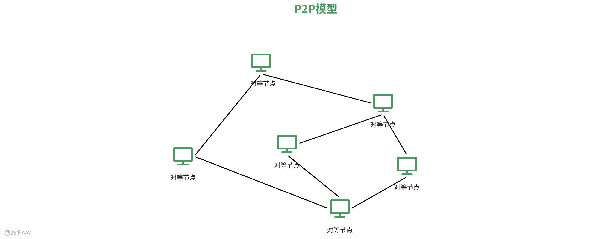
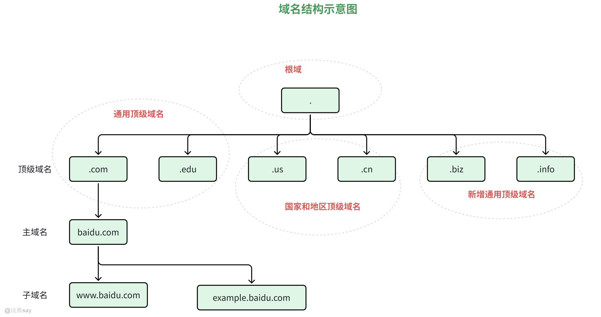
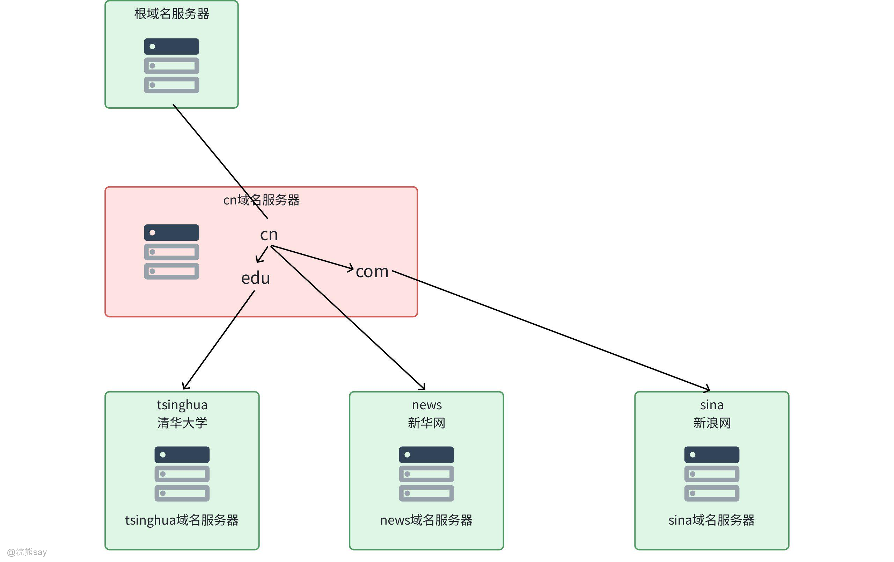
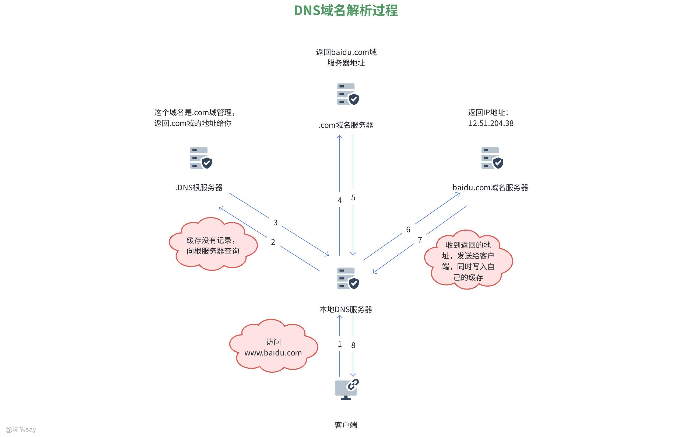

# **Part 08：会话层、表示层、应用层**

## 会话层（Session Layer）

## 什么是会话层？

**会话层**是 **OSI 七层网络模型** 中的第 5 层，位于**传输层（第 4 层）和表示层（第 6 层）之间**，核心作用是**建立、管理和终止表示层实体之间的通信会话**，简单说就是负责**应用程序之间的 “对话控制”**。它不负责数据的传输可靠性（这是传输层的工作），而是专注于**协调通信双方的交互方式**，让应用程序之间的会话有序进行。

**会话层与传输层的区别在于**传输层（如TCP/UDP）负责端到端的数据包传输，不关注应用逻辑；会话层则基于传输层连接，为应用程序提供有状态的会话管理（如会话同步、断点恢复）。例如：TCP保证数据包可靠传输，而会话层确保文件传输会话在中断后能从断点继续。

**会话层与表示层也存在交互，**会话层将应用数据传递给表示层进行格式转换（如加密、压缩），表示层处理后的数据再通过会话层的会话控制机制传输。

举个简单的例子来帮助大家理解会话层，会话层就像是“会议室管理员”，传输层负责把参会人员数据送到会议室门口，会话层负责安排座位、定好发言规则、记录会与进度和最后会议结束时的收尾，能够让程序之间的会话有序进行。

但是在TCP/IP模型中，会话层的功能通常被整合到应用层或传输层中，而非作为独立层次。例如：

-   **HTTP/1.1的Cookie机制**：通过Cookie管理客户端与服务器的会话状态（如登录信息），本质是应用层对会话层功能的实现。
-   **TCP的连接管理**：部分会话层的流量控制功能被TCP的滑动窗口机制覆盖（尽管TCP本身属于传输层）。

但在特定场景中，会话层的概念仍有实际意义，如实时通信（RTC）协议（如WebRTC）需显式管理会话的建立、媒体流同步和中断恢复，这可视为会话层功能的现代应用。

## 会话层核心功能

1.  **会话建立、维护与终止**

为应用程序创建逻辑连接（会话），定义会话的开始和结束规则，例如数据库访问、远程登录（如SSH）等场景中的会话管理。 支持会话的中断与恢复：当通信中断时，会话层可记录断点（如文件传输的字节位置），恢复后从断点继续传输，避免重复工作。

1.  **会话同步与 checkpoint（检查点）**

在长会话中设置同步点（如视频流的关键帧、文件传输的分段标记），用于故障恢复时定位位置。例如，传输大文件时每传输10MB设置一个检查点，若中途中断，只需从最近的检查点重新传输。

1.  **会话多路复用**

在单个传输层连接上复用多个会话，提高资源利用率。例如，浏览器与服务器的单个TCP连接可同时处理多个HTTP会话（如加载网页文本、图片、视频等）。

1.  **会话流量控制与异常处理**

协调通信双方的传输节奏，避免发送方过载接收方（与传输层流量控制的区别：会话层控制的是应用级会话的传输速率，而传输层控制的是端到端的数据包流动）。 处理会话异常（如超时、连接中断），决定是否重新建立会话或终止通信。

## 会话层的协议与应用场景
| 类别 | 具体项 | 核心作用 |
| --- | --- | --- |
| 典型协议 | NFS（网络文件系统） | 管理客户端与服务器的文件访问会话，支持断点续传和会话恢复 |
| SSH（安全外壳协议） | 建立加密会话，管理远程登录的连接状态与数据交互流程 |
| ASP（AppleTalk会话协议） | 用于早期苹果设备网络，管理设备间的会话连接建立、维护与终止 |
| 应用场景 | 远程过程调用（RPC） | 借助会话层机制，维护客户端与服务端之间的通信状态，保障远程调用有序执行 |
| 视频会议系统 | 在音视频数据流中设置同步点，实现会话中断后从最近关键帧恢复，避免全程重传 |
| 数据库连接（如MySQL） | 管理客户端与数据库服务端的查询会话生命周期，包括会话建立、交互控制、资源释放 |

## 表示层（Presentation Layer）

## 什么是表示层？

**表示层**是 **OSI 七层网络模型** 中的第 6 层，位于**会话层（第 5 层）和应用层（第 7 层）之间**，核心作用是**处理通信双方的数据表示差异，实现数据的 “格式统一”**，让不同系统、不同架构的设备能看懂彼此传输的数据。它不负责数据的传输和会话管理，只专注于**数据的 “翻译” 和 “包装”**，是应用程序之间的 “翻译官”。

表示层通过格式转换、加密压缩等机制，确保不同系统间的数据能被正确理解和处理。尽管在TCP/IP架构中其功能常与应用层、传输层融合，但其核心思想（如标准化数据表示、安全处理）仍是现代网络协议设计的基础。理解表示层有助于分析数据在网络中的“语义转换”过程，例如文件传输中的格式适配、加密通信中的安全机制等。

## 表示层的核心功能

1.  **数据格式转换**

将应用层的原始数据转换为适合网络传输的标准格式，或在接收端将标准格式还原为本地可识别的格式。例如：

-   不同操作系统的文件换行符（Windows的\\r\\n与Linux的\\n）需通过表示层统一转换。
-   图像格式转换（如JPEG转PNG）、视频编码转换（H.264转VP9）。

1.  **数据加密与解密**

为应用数据提供安全保障，通过加密算法（如AES、RSA）对数据进行加密，接收端再解密还原。例如：

-   HTTPS协议中，表示层对HTTP请求/响应数据进行TLS加密（实际在TCP/IP模型中，加密功能由传输层的TLS/SSL实现，但概念上属于表示层范畴）。
-   邮件传输中的PGP加密，对邮件内容进行格式处理和加密。

1.  **数据压缩与解压缩**

通过算法减少数据体积，提高传输效率，接收端再解压缩还原。例如：

-   Web页面的HTML、CSS、JavaScript文件通过gzip压缩后传输，减少带宽占用。
-   视频流的H.265压缩标准，在表示层对原始视频数据进行编码压缩。

1.  **数据表示标准化**

定义数据的语法和语义，确保不同系统理解一致。例如：

-   ASN.1（抽象语法标记）用于定义网络协议中的数据结构（如SNMP协议的消息格式）。
-   XML、JSON等数据格式的解析与生成，属于表示层处理范畴。

## 表示层的协议与应用场景
| 类别 | 具体项 | 核心作用 |
| --- | --- | --- |
| 典型协议 | ASN.1（抽象语法标记一） | 定义网络数据的抽象语法，为电信、金融等领域的协议（如X.25、LDAP）提供统一数据描述规范 |
| SSL/TLS（安全套接层/传输层安全） | 虽在TCP/IP模型中归属传输层，但功能上对应OSI表示层，实现数据加密、解密及格式处理，保障传输安全 |
| JPEG、MPEG | 分别作为图像、视频编码标准，由表示层负责完成数据的格式转换与压缩，降低网络传输带宽消耗 |
| 应用场景 | 文件传输（如FTP） | 根据目标系统的格式要求，完成文件的格式适配（如文本文件的字符集转换），确保跨系统文件正常解析 |
| 网络安全（如VPN） | 借助表示层的加密功能，对传输的数据包进行封装与加密，防止数据被窃取或篡改 |
| 多媒体通信（如视频会议） | 处理音视频流的编码（如Opus音频编码、VP8视频编码），实现多媒体数据的高效传输与还原 |

## 应用层（Application Layer）

## 什么是应用层？

**应用层**是 **OSI 七层网络模型** 的**最顶层（第 7 层）**，位于表示层之上，是**直接对接用户应用程序的一层**。它的核心作用是 **为应用程序提供网络服务接口**，让用户能通过应用程序（如浏览器、邮件客户端）与网络中的其他设备进行通信，本质是**处理应用程序的网络需求**。应用层的核心功能主要包括提供网络服务接口、处理用户交互需求和管理应用级资源访问：

1.  **提供网络服务接口**定义了应用程序与网络交互的标准接口，比如网页浏览需要 HTTP 协议、文件传输需要 FTP 协议，应用程序通过调用这些协议实现网络功能。
2.  **处理用户交互需求**接收用户的网络请求（如输入网址、点击 “发送文件”），并将其转化为网络能识别的指令，同时把网络返回的结果（如网页内容、文件传输状态）反馈给应用程序。
3.  **管理应用级资源访问**协调应用程序对网络资源的访问，比如 DNS 协议负责将域名转换为 IP 地址，让应用程序能找到目标服务器。

需要注意：**应用层 ≠ 应用程序**。应用程序（如微信、Chrome 浏览器）是用户直接使用的软件，而应用层是为这些软件提供网络通信能力的协议集合。

## 应用层网络模型

### 客户/服务模型（C/S模型）

#### 什么是C/S模型？

**客户 / 服务模型（Client/Server Model，C/S 模型）** 是一种**分布式网络架构**，核心是将应用程序拆分为**客户端（Client）** 和**服务器端（Server）** 两个独立部分，通过网络通信协作完成任务，二者各司其职、分工明确。它是网络应用中最基础、最常用的架构模式，广泛支撑着各类网络服务（如数据库访问、文件传输、远程登录等）。

#### C/S模型工作流程

1.  **服务器初始化**：服务器启动后，绑定特定端口并进入**监听状态**，等待客户端连接。
2.  **客户端发起请求**：客户端通过服务器的IP地址和端口，向服务器发送**连接请求**。
3.  **建立通信连接**：服务器接受请求，与客户端建立TCP/UDP通信链路（TCP用于可靠传输，UDP用于高速传输）。
4.  **请求处理与响应**：

-   客户端发送具体服务请求（如“查询某用户数据”“下载某文件”）；
-   服务器接收请求后，执行对应的业务逻辑，生成结果；
-   服务器将结果返回给客户端。

1.  **连接终止**：一次服务完成后，可选择**断开连接**（如HTTP短连接），或保持连接等待后续请求（如数据库长连接）。

#### C/S模型的优缺点

C/S模型的优点在于：

1.  **分工明确，性能高效**：服务器专注处理复杂计算和资源管理，客户端专注用户交互，充分发挥两端硬件性能。
2.  **安全性高**：核心数据和业务逻辑集中在服务器端，客户端仅获取结果，降低数据泄露风险，便于权限管控。
3.  **响应速度快**：客户端可缓存部分数据，减少重复请求；服务器可针对业务需求优化（如数据库索引、集群部署）。

C/S模型的缺点在于：

1.  **开发维护成本高**：需分别开发客户端和服务器端程序，且客户端需适配不同操作系统（Windows、macOS、Linux）。
2.  **客户端部署麻烦**：用户需手动安装客户端软件，后续版本更新也需逐个客户端升级。
3.  **服务器压力集中**：所有客户端请求都由服务器处理，高并发场景下需搭建集群或负载均衡架构。

### 什么是P2P模型？

**P2P 模型（Peer-to-Peer，对等网络模型）** 是一种**去中心化的分布式网络架构**，与 C/S（客户 / 服务器）模型相对应。在 P2P 网络中，不存在固定的 “客户端” 和 “服务器” 角色划分，**每个网络节点（Peer，对等体）的地位完全平等**，既可以作为 “客户端” 请求其他节点的资源或服务，也可以作为 “服务器” 向其他节点提供资源或服务。P2P 模型的核心是**节点间的直接交互**，无需依赖中心化服务器进行中转或管理，所有节点共同参与网络资源的共享与维护。P2P模型的核心特点是去中心化、节点对等性和资源分布式共享：

1.  **去中心化**无中心节点或服务器，节点之间通过直接连接完成通信和资源共享。即使部分节点下线，只要仍有节点在线，网络就能正常运行，容错性强。
2.  **节点对等性**每个节点的功能和地位完全一致，兼具 “请求方” 和 “服务方” 双重身份。例如：一台电脑在下载文件的同时，也会向其他节点上传已下载的文件片段。
3.  **资源分布式共享**网络中的资源（文件、算力、带宽等）分散存储在各个节点上，而非集中在服务器。节点可按需从多个对等体获取资源，提升资源获取效率。

#### P2P模型的核心流程

1.  **节点发现**：新节点加入网络时，通过**对等节点发现协议**（如 Kademlia）找到已存在的节点，建立连接。
2.  **资源查询**：节点发起资源请求（如下载某文件），通过网络广播或路由转发，查询拥有该资源的节点。
3.  **直接交互**：请求节点与拥有资源的节点建立直接连接，进行资源传输或服务交互（如分段下载文件）。
4.  **资源共享**：请求节点在获取资源的同时，向其他需要该资源的节点提供上传服务，参与网络资源的共建。

#### P2P模型的优点

1.  去中心化与高扩展性：无需依赖中心服务器，新增节点可直接加入网络并提供资源，网络规模可动态扩展。
2.  资源利用率高：每个节点贡献带宽和存储资源，避免集中式服务器的瓶颈，适合大规模文件共享（如 BT 下载）。
3.  容错性强 ：个别节点失效不影响整体网络运行，数据可分散存储在多个节点，提升可靠性。
4.  隐私性较好 ：数据传输不经过中心服务器，减少隐私信息泄露风险（但需结合加密技术）。

#### P2P模型的缺点

1.  资源发现效率低：缺乏中心索引，节点需通过广播或分布式哈希表（DHT）查找资源，可能导致延迟较高或搜索失败。
2.  网络管理困难：节点动态加入 / 退出易导致网络拓扑不稳定，且难以统一实施安全策略（如防止恶意节点传播病毒文件）。
3.  节点负载不均：部分节点可能因提供大量资源而承担过高负载（如 “超级节点”），影响性能甚至离线。
4.  法律与版权问题：分布式架构下难以追踪资源来源，可能被用于非法内容传播，面临版权纠纷风险。

## 应用层常见协议
| 协议名称 | 用途 | 端口 |
| --- | --- | --- |
| HTTP/HTTPS | Web浏览器与服务器间传输网页内容 | HTTP：80 、HTTPS：443 |
| FTP | 网络中双向传输文件 | 21（控制连接）、20（数据连接） |
| SMTP | 发送和传输电子邮件 | 25（默认）587（安全模式） |
| POP3 | 收件人从邮箱服务器接收邮件 | 110（默认）995（安全模式） |
| IMAP | 收件人从邮箱服务器接收邮件 | 143（默认）993（安全模式） |
| DNS | 将域名解析为IP地址 | 53 |
| DHCP | 自动为局域网设备分配网络配置参数 | 67（服务器端）68（客户端） |
| Telnet | 远程登录到其他计算机执行命令 | 23 |
| SSH | 远程登录到其他计算机执行命令 | 22 |
| SNMP | 监控和管理网络设备状态与性能 | 161（默认）162（陷阱消息） |
| NTP | 同步网络中各设备的时钟 | 123 |
| BitTorrent | 基于P2P模型的文件共享 | 6881-6889（默认范围） |
| RDP | 远程控制Windows系统桌面 | 3389 |

## 域名服务

### 域名结构

域名结构是一种**分层分级的树形逻辑结构**，用于唯一标识互联网中的主机或服务。其核心是通过**从右到左**的层级划分实现全球统一管理，逻辑上类似于现实中的 “国家→城市→街道→门牌号” 分级体系，既保证了域名的全球唯一性，又具备极强的可扩展性。域名的各层级之间以英文句点 . 分隔，从右到左层级依次降低，具体分为以下三层核心结构：

-   **顶级域名（TLD）** 处于域名结构的最右侧层级，是域名的最高分类，主要分为三大类别：
-   **国家和地区顶级域名（ccTLD）**：通常由两个字母组成，用于对应特定国家或地区，例如中国的 .cn、日本的 .jp、美国的 .us。
-   **通用顶级域名（gTLD）**：无国家或地区属性限制，适用于各类组织与用途，例如 .com（面向商业组织）、.org（面向非营利机构）、.edu（面向教育院校）。
-   **新通用顶级域名（new gTLD）**：是近年来新增的域名类型，覆盖场景更丰富多元，例如 .xyz、.online、.shop、.tech 等。
-   **二级域名** 位于顶级域名的左侧，由用户自主申请注册，是标识特定组织、机构或服务的核心标识，例如域名 baidu.com 中的 baidu，就是百度公司的核心二级域名。
-   **子域名** 是在二级域名基础上按需拓展的下级层级，可根据业务需求灵活划分，用于区分不同的服务模块，例如 mail.baidu.com 中的 mail 专指邮件服务，www.baidu.com 中的 www 则对应网页浏览服务。

域名结构的核心管理逻辑与 **“国家→城市→街道→门牌号”** 的层级划分高度相似，通过分层分级的管理模式，既实现了全球域名的唯一性，又保障了域名体系的可扩展性。

### 域名服务器（Domain Name Server，DNS）

**域名服务器（DNS 服务器）** 是运行**域名系统（DNS）协议**的专用服务器，核心作用是**实现域名与 IP 地址的双向映射解析**，解决 “用户易记域名” 与 “网络识别 IP 地址” 之间的转换问题，是互联网域名访问的核心支撑节点。

域名服务器的架构与域名的**分层树形结构**一一对应，采用**分布式层级部署**的方式，避免了单点故障和集中式管理的压力，同时大幅提升解析效率，按功能和层级分为以下几类：

1.  根域名服务器（Root DNS Server）：全球共 13 组（A~M），负责管理顶级域名服务器的 IP 地址，是域名解析的起点。
2.  顶级域名服务器（TLD DNS Server）：对应各顶级域名（如 “.com”“.cn”），存储二级域名的解析记录。
3.  权威域名服务器（Authoritative DNS Server）：由域名所有者管理，存储该域名下所有子域名的具体 IP 映射关系，分为：

-   主域名服务器：存储原始解析数据。
-   辅助域名服务器：从主服务器同步数据，提供冗余备份。

1.  本地域名服务器（Local DNS Server）：也称为递归域名服务器，为用户设备提供递归解析服务，缓存常用解析结果以加速访问。

### 域名解析流程

1.  **客户端发起请求**客户端在浏览器输入www.baidu.com，向本地 DNS 服务器发送域名解析请求（对应图中步骤①）。
2.  **本地 DNS 检查缓存**本地 DNS 服务器查询自身缓存，发现无该域名的解析记录，于是向**根域名服务器**发起查询请求（对应图中步骤②）。
3.  **根服务器指引**根域名服务器告知本地 DNS：“该域名由.com域管理”，并返回.com域服务器的地址（对应图中步骤③）。
4.  **访问.com域服务器**本地 DNS 服务器向.com域服务器发起查询请求（对应图中步骤④）。
5.  **.com域服务器指引**.com域服务器返回baidu.com域对应的权威服务器地址（对应图中步骤⑤）。
6.  **访问baidu.com域服务器**本地 DNS 服务器向baidu.com域服务器发起查询请求（对应图中步骤⑥）。
7.  **获取目标 IP**baidu.com域服务器返回www.baidu.com对应的 IP 地址（14.251.177.38）（对应图中步骤⑦）。
8.  **返回结果并缓存**本地 DNS 服务器将 IP 地址返回给客户端，同时把该解析结果写入自身缓存，便于后续同类请求直接复用（对应图中步骤⑧）。

## 浣熊真题
| 【中国铁塔2019】Web 应用层协议（HTTP）所依赖的传输协议及为它保留的端口号为A. TCP 的 80 端口B. UDP 的 80 端口C. TCP 的 25 端口D. UDP 的 25 端口答案 ：A解析 ：HTTP 协议是应用层协议，它依赖于传输层的 TCP 协议，并且通常使用 80 端口进行通信。UDP 是面向无连接的协议，不适合需要可靠传输的 HTTP 协议。25 端口通常用于 SMTP（简单邮件传输协议） |
| --- |

| 【中国铁塔2021】TCP/IP 与 OSI 七层模型相比,其没有表示层和会话层,这两层的功能由()提供。A. 网络层B. 应用层C. 传输层D. 数据链路层答案 ：B解析 ：TCP/IP 模型将 OSI 参考模型中的会话层和表示层的功能合并到应用层实现。应用层面向不同的网络应用引入了不同的应用层协议，包括基于 TCP 协议的如 HTTP、FTP、TELNET 等 |
| --- |

| 【中国铁塔2022】TCP/IP 与 OSI 层模型相比,其没有表示层和会话层,这两层的功能由()提供A. 应用层B. 网络层C. 数据链路层D. 传输层答案 ：A解析 ：TCP/IP 模型将 OSI 参考模型中的会话层和表示层的功能合并到应用层实现。应用层面向不同的网络应用引入了不同的应用层协议，包括基于 TCP 协议的如 HTTP、FTP、TELNET 等。 |
| --- |

| 【国家电网2016】在 OSI 参考模型中，自下而上第一个提供端到端服务的层次是（）。A. 数据链路层B. 传输层C. 会话层D. 应用层答案 ：B解析 ：OSI 参考模型中，物理层、数据链路层和网络层主要提供点到点的服务（如数据链路层在相邻节点间，网络层在源到目的节点间）。而传输层是自下而上第一个提供端到端服务的层次，它直接为应用进程之间提供可靠或不可靠的数据传输，屏蔽了下层的网络细节。会话层、应用层在传输层之上，依赖传输层的端到端服务 |
| --- |

| 【国家电网2015】在 OSI 参考模型中,直接为会话层提供服务的是()A. 应用层B. 表示层C. 传输层D. 网络层答案 ：C解析 ：在 OSI 参考模型中，各层之间的关系是：下层为上层提供服务。传输层直接为会话层提供服务，会话层则位于传输层之上。表示层为应用层提供服务，网络层为传输层提供服务 |
| --- |

| 【国家电网2023】以下关于网络层次与主要设备对应关系的叙述中,配对正确的是()A. 网络层一一集线器B. 数据链路层--网桥C. 传输层-一路由器D. 会话层--防火墙答案 ：B解析 ：网络层对应的设备是路由器，数据链路层对应的设备是网桥，物理层对应的设备是集线器。会话层没有特定的硬件设备对应，防火墙主要工作在网络层和传输层 |
| --- |

| 【国家电网2016】域名结构中从左向右级别越来越低，分多层排列。A.正确B.错误答案 ：A解析 ：域名结构如"www.example.com"，从左到右依次是主机名、二级域名、顶级域名，级别越来越低，分多层排列，所以该说法正确 |
| --- |

| 【国家电网2018】提高域名解析效率的方法可以为()A.从本地域名服务器开始解析B.在域名服务器中使用高速缓存技术C.减小资源记录的 TTL 时间值D.在客户机中使用高速缓存技术答案 ：B, D解析 ：提高域名解析效率的方法主要包括在域名服务器中使用高速缓存技术和在客户机中使用高速缓存技术。减小 TTL 时间值会导致缓存失效更快，降低效率；从本地域名服务器开始解析是域名解析的基本流程，不是提高效率的方法 |
| --- |

| 【国家电网2023】以下说法中错误的是()A.域名服务器中存放 Internet 主机的 IP 地址B.域名服务器中存放 Internet 主机的域名C.域名服务器中存放 Internet 主机域名与 IP 地址的对照表D.域名服务器中存放 Internet 主机的电子邮箱的地址答案 ：A, B, D解析 ：域名服务器中存放的是 Internet 主机域名与 IP 地址的对照表，不是单独存放 IP 地址或域名，也不存放电子邮箱地址。 |
| --- |

| 【南方电网2017】根据域名代码规定，表示政府部门网站的域名代码是A..netB..comC..govD..org答案 ：C解析 ：EDU 为教育机构，COM 为商业机构，NET 为主要网络支持中心，GOV 为政府部门，ORG 为非营利组织，MIL 为军事组织，AC 为科研机构等。 |
| --- |

| 【国家电网2023】某公司内部使用 WB.xyz.com.cn 作为访问某服务器的地址,其中 WB 是()A.主机名B.协议名C.目录名D.文件名答案 ：A解析 ：互联网网址的协议只有 http 或者 https，作为内部服务器地址，一般将主机名作为起始，WB 应该是主机名。也可用排除法，其他三个明显不可能。 |
| --- |

| 【国家电网2023】主域名服务器在接收到域名请求后,首先查询的是()A.本地 hosts 文件B.转发域名服务器C.本地缓存D.授权域名服务器答案 ：C解析 ：主域名服务器在接收到域名请求后，首先查询的是本地缓存，以提高解析效率。 |
| --- |

| 【航天科技2021】对等计算（Peer to Peer computing，P2P），是指信息或服务的提供者和使用者通过直接交换实现资源共享，形成非中心化的、自组织的，且所有或大部分联系是对称的分布式环境。根据上述定义，下列选项属于基于 P2P 的网络应用的是：A. 支持点对点在线聊天、文件传送等功能的即时通信软件B. 利用电子商务的各种手段实现图书买卖过程的网上书店C. 帮助检索者查找存储在互联网上信息的网络搜索引擎D. 提供用户存放、展示、分享照片等功能的网络电子相册答案 ：A解析 ：根据定义，P2P 是指信息或服务的提供者和使用者通过直接交换实现资源共享，形成非中心化的、自组织的，且所有或大部分联系是对称的分布式环境。选项 A 中的即时通信软件支持点对点在线聊天、文件传送等功能，符合 P2P 模型的特点。其他选项都是基于 C/S 模型的应用。 |
| --- |

| 【工商银行2020】C/S 是一种重要的网络计算机模式，其含义是（）。A. 客户/服务器模式B. 文件/服务器模式C. 分时/共享模式D. 浏览器/服务器模式答案 ：A解析 ：C/S 结构，即 Client/Server（客户机/服务器）结构，是计算机软件系统体系结构，通过将任务合理分配到 Client 端和 Server 端，降低了系统的通讯开销，可以充分利用两端硬件环境的优势。开发 C/S 架构可以采用多种语言，包括 Java、C++、C#等 |
| --- |

| 【中国银行2023】下列关于网络应用模型的叙述中，错误的是()A. 在 C/S 模型中，主动发起通信的是客户，被动通信的是服务器B. 在向多用户分发一个文件时，P2P 模型通常比 C/S 模型所需的时间短C. 在客户/服务器(C/S)模型中，客户与客户之间可以直接通信D. 在 P2P 模型中，结点之间具有对等关系答案 ：C解析 ：在客户/服务器(C/S)模型中，客户端与客户端之间通常无法直接通信，而是需要通过服务器进行交互。因为 C/S 模型是一种集中式的体系结构，服务器负责协调、管理和调度客户端之间的通信和数据交换，提供统一的服务接口和数据访问接口。客户端之间的通信需要经过服务器，因此客户端无法直接通信。 |
| --- |
