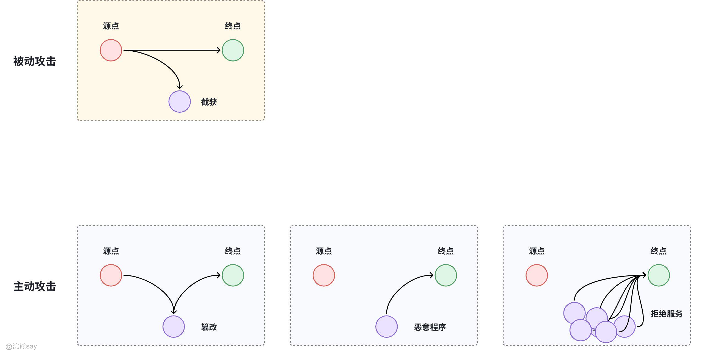
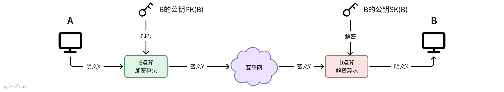
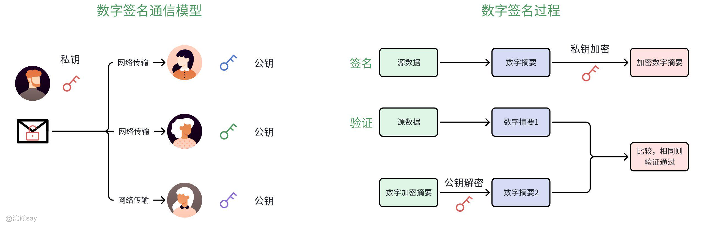

# **Part 09: 网络管理与网络安全**

## 网络安全

## 什么是网络安全？

**网络安全**的核心定义是：通过技术防护、管理规范、法律约束等多重手段，保护计算机网络系统的硬件设施、软件程序、核心数据及全流程通信环节，使其免受恶意攻击、非法破坏、数据篡改与信息泄露的威胁，确保网络系统持续稳定、安全可靠地运行，同时保障信息的**完整性、保密性和可用性**三大核心属性。从广义视角划分，网络安全的防护范畴涵盖以下五个关键层面：

1.  **基础设施安全**：聚焦服务器、路由器、交换机等核心硬件设备的防护，包括物理环境安全、设备运行状态监控及硬件漏洞防护，筑牢网络安全的物理根基。
2.  **系统安全**：针对操作系统、数据库平台、各类应用程序等软件系统，开展常态化漏洞扫描、补丁修复与精细化权限管控，防范恶意代码入侵与非法越权访问。
3.  **数据安全**：围绕数据的全生命周期实施防护，在数据存储、传输、处理等环节部署加密、脱敏、备份恢复等措施，杜绝核心数据泄露、丢失或篡改。
4.  **通信安全**：优化TCP/IP等基础网络传输协议的安全设计，部署SSL/TLS等加密通信技术，防范窃听、劫持、中间人攻击等网络传输风险。
5.  **用户安全**：通过安全培训与意识教育提升用户防护能力，重点防范钓鱼邮件、恶意软件感染等社会工程学攻击，从终端用户层面阻断安全风险入口。

## 网络安全特征

网络安全的特征围绕**保障网络系统与数据的安全运行**展开，核心遵循业界公认的 **CIA 三元组**（保密性、完整性、可用性），同时延伸出不可否认性、可控性、可审查性等关键特征，各特征相互关联、缺一不可。具体如下：

1.  保密性（Confidentiality）：确保信息仅被授权主体访问，防止未授权的泄露或窃取。通过加密技术（如 AES、RSA）、访问控制（权限管理）、数据脱敏等手段，限制敏感信息的可见范围。例如：银行转账信息加密传输，防止黑客截获账户密码。
2.  完整性（Integrity）：所谓完整性就是保证信息在存储或传输过程中未被篡改、破坏或伪造，维持数据的一致性和准确性。实现上可以使用哈希算法（如 SHA-256）生成数据摘要，通过对比摘要验证数据是否被篡改；结合数字签名技术确认信息来源的真实性。例如：软件安装包附带哈希值，用户下载后可校验包文件是否被恶意修改。
3.  可用性（Availability）：指确保授权用户在需要时能够正常访问和使用网络资源，避免因攻击或故障导致服务中断。通过负载均衡、冗余备份（如服务器集群、异地容灾）、DDoS 防御等技术，保障系统的持续运行能力。例如：电商平台在促销期间通过扩容服务器，防止流量激增导致网站崩溃。
4.  可控性（Controllability）：指系统管理者对网络资源的使用、传输及访问具有可控的权限，能够对用户行为和数据流动进行监督与管理。通过防火墙策略、审计日志、流量监控等手段，限制非法操作并记录用户活动，便于追溯和管控。企业通过网络管理系统限制员工访问非工作相关网站，控制带宽使用。
5.  不可否认性（Non-Repudiation）：指确保信息交互的参与者无法否认其行为，防止事后抵赖或否认操作的发生。借助数字签名、时间戳、交易日志等技术，为行为提供不可篡改的证据。电子合同通过数字签名确认签署方身份，避免签约后否认合同有效性。

网络安全的概念围绕 “保护网络系统及信息” 展开，而五大特征从不同维度构建了安全体系的核心要求。在实际应用中，需结合技术工具（如防火墙、加密算法）、管理制度（如安全策略、人员培训）及法律规范（如数据安全法），全方位保障网络环境的安全与稳定。随着网络攻击手段的升级，这些特征也在不断延伸和细化，推动网络安全技术的持续发展。

## 网络安全的威胁类型

### 计算机网络通信面临的威胁类型

#### 被动攻击

被动威胁的核心特征是**攻击者仅窃取信息，不修改数据、不干扰通信流程**，具有极强的隐蔽性，难以被直接检测。

1.  **窃听 / 监听攻击**攻击者通过网络嗅探工具（如 Wireshark）捕获网络中传输的明文数据，窃取敏感信息（如账号密码、交易记录、隐私数据）。典型场景：公共 Wi-Fi 环境下，未加密的 HTTP 协议传输数据易被监听。
2.  **流量分析攻击**攻击者不解析数据内容，仅通过分析通信流量的大小、频率、传输方向等特征，推测通信双方的身份、通信规律甚至业务类型。典型场景：通过监测某服务器的流量峰值，推断其业务高峰时段，为后续攻击做准备。

#### 主动攻击

主动威胁是攻击者**主动干预通信过程**，通过篡改数据、伪造身份、干扰服务等方式，破坏网络通信的完整性和可用性，危害性更强。

1.  **数据篡改攻击**攻击者截获网络传输的数据后，修改内容再发送给接收方，破坏数据的完整性。典型场景：中间人攻击中，攻击者篡改电商平台的订单金额，窃取额外资金。
2.  **拒绝服务攻击（DoS）/ 分布式拒绝服务攻击（DDoS）**

-   DoS：攻击者通过单一节点发送大量无效请求，耗尽目标服务器的带宽、算力等资源，导致合法用户无法访问服务。
-   DDoS：攻击者控制大量傀儡机（僵尸网络），协同发起攻击，威力远超单节点 DoS，是大型网站的主要威胁之一。

1.  **身份欺骗攻击**攻击者伪造合法用户或设备的身份，骗取服务器的信任，非法获取访问权限或数据。典型场景：IP 地址欺骗、DNS 欺骗、伪造数字证书等。
2.  **恶意代码攻击**攻击者通过网络传播病毒、木马、蠕虫、勒索病毒等恶意程序，入侵目标设备后窃取数据、控制设备或破坏系统。典型场景：点击钓鱼链接下载带木马的文件，导致主机被远程控制。

### 网络存在的主要威胁

（1）**非授权访问**：未经许可使用网络或计算机资源。表现为绕开访问控制机制违规使用设备资源、越权访问信息，形式有假冒、身份攻击、非法用户操作、合法用户违规操作等。

（2）**信息泄漏或丢失：**敏感数据有意或无意泄露、丢失。包括传输中、存储介质里的数据泄漏，以及通过隐蔽隧道窃取信息等情况。

（3）**破坏数据完整性：**非法获取数据使用权，对重要信息进行删除、修改、插入、重发等操作，或恶意篡改数据干扰用户正常使用。

（4）**拒绝服务攻击：**干扰网络服务系统，改变作业流程，运行无关程序使系统响应变慢甚至瘫痪，阻止合法用户使用服务。

（5）**利用网络传播病毒**：借助网络传播计算机病毒，破坏力远超单机系统，用户防范难度大。

## 网络安全措施

1.  **防火墙技术**：配置防火墙是基本、经济且有效的网络安全手段，通过限制外界对内部网络访问及管理内部用户访问外网权限，提升内部网络安全性，降低入侵风险。
2.  **数据加密技术**：可防止网络数据被篡改、泄露与破坏，包括链路加密、端 - 端加密、节点加密和混合加密，混合加密安全性更高。
3.  **防病毒技术**：硬件上，CPU 内嵌防病毒技术配合操作系统可防范缓冲区溢出漏洞攻击；软件上，防毒杀毒软件能检测、防护并处理恶意程序。
4.  **人员素质提升**：加强网络使用者安全教育，提高责任心，通过技术培训提升操作人员技能，避免人为事故。

## 浣熊真题
| 【国家电网2017】拒绝式服务攻击会影响信息系统的()。A. 完整性B. 可用性C. 机密性D. 可控性答案 ：B解析 ：拒绝式服务攻击会影响信息系统的可用性，使系统无法正常提供服务 |
| --- |

| 【国家电网2017】以下关于计算机病毒的特征说法正确的是（）A. 计算机病毒只具有破坏性，没有其他特征B. 破坏性和传染性是计算机病毒的两大主要特征C. 计算机病毒具有破坏性，不具有传染性D. 计算机病毒只具有传染性，不具有破坏性答案 ：B解析 ：计算机病毒具有破坏性和传染性两大主要特征，除此之外还具有潜伏性、隐蔽性、可触发性等特征 |
| --- |

| 【国家电网2023】关于网络安全的描述，不正确的是()A. 网络完全工具的每一个单独组织只能完成其中部分功能，而不能完成全部功能B. 信息安全的基本要素有机密性、完整性、可用性C. 典型的网络攻击步骤为：信息收集，试探寻找突破口、实施攻击，消除记录保留访问权限D. 只有得到允许的人才能修改数据，并且能够判别出数据是否已被篡改，描述的是信息安全的可用性答案 ：D解析 ：只有得到允许的人才能修改数据，并且能够判别出数据是否已被篡改，描述的是信息安全的完整性，而非可用性。可用性是指网络资源在需要时即可使用，不因系统故障或误操作等使资源丢失或妨碍对资源的使用。 |
| --- |

| 【国家电网2023】关于网络安全防御技术的描述，不正确的是()A. 防火墙主要实现网络安全的安全策略，可以对策略中涉及的网络访问行为实施有效管理，也可以对策略之外的网络访问行为进行控制B. 入侵检测系统注重是网络安全状况的监督，绝大多数 IDS 系统都是被动的C. 蜜罐技术是一种主动防御技术，是一个诱捕攻击者的陷阱D. 虚拟专业网络是在公网中建立专用的、安全的数据通信通道答案 ：A解析 ：防火墙是一种较早使用、实用性很强的网络安全防御技术，它阻挡对网络的非法访问和不安全数据的传递，使得本地系统和网络免于受到许多网络安全威胁。在网络安全中，防火墙主要用于逻辑隔离外部网络与受保护的内部网络。防火墙主要是实现网络安全的安全策略，而这种策略是预先定义好的，所以是一种静态安全技术。在策略中涉及的网络访问行为可以实施有效管理，而策略之外的网络访问行为则无法控制。防火墙的安全策略由安全规则表示 |
| --- |

## 加密/解密

## 加密 / 解密概念

加密，是将明文（原始可读懂的数据）通过特定的加密算法和密钥，转化为密文（不可直接读懂的乱码形式）的过程。目的是防止数据在传输或存储过程中被未授权者读取，保证数据的保密性。例如，在网上银行转账时，用户输入的账号、密码等信息会被加密处理后再传输。

解密则是加密的逆过程，使用对应的解密算法和密钥，把密文还原成明文。只有拥有正确密钥的合法接收者才能进行解密操作，获取原始数据。

## 加密 / 解密算法分类

计算机网络中加密、解密算法一般分为两类，对称加密算法和非对称加密算法：

### 对称加密算法

**对称加密算法**是加密和解密**使用同一把密钥**的加密技术，也叫**单密钥加密**。其核心逻辑是：发送方用密钥将明文转换为密文，接收方用**完全相同的密钥**将密文还原为明文，加密与解密的操作互为逆过程。常见算法如 DES（数据加密标准 ）、AES（高级加密标准）、IDEA 。优点是加密和解密速度快，适合对大量数据加密；缺点是密钥管理困难，因为通信双方需共享同一密钥，密钥传输过程存在安全风险。常见的对称加密算法如下表所示：

#### 常见对称加密算法
| 算法名称 | 核心特点 | 优缺点 | 适用场景 |
| --- | --- | --- | --- |
| DES（数据加密标准） | 经典对称加密算法，分组加密模式 | 优点：算法成熟、兼容性强；缺点：密钥过短易被暴力破解，安全性不足，已淘汰 | 历史加密场景的兼容需求 |
| 3DES（三重数据加密标准） | 基于DES改进，通过“加密-解密-加密”或“解密-加密-解密”三次迭代提升安全性 | 优点：安全性高于DES；缺点：运算效率低，存在设计缺陷，逐渐被替代 | 对安全性有一定要求，但需兼容DES的过渡场景 |
| AES（高级加密标准） | 国际公认安全标准，分组加密模式，适应性广 | 优点：安全性能强、运算速度快、适配多场景；缺点：无明显短板 | 文件加密、数据库加密、VPN传输、HTTPS数据传输等（对称加密首选） |
| RC4 | 流密码算法，以字节流为单位加密，非分组加密 | 优点：算法简单、加密速度极快；缺点：存在安全漏洞，安全性较弱 | 对安全性要求不高的临时数据加密、历史系统兼容 |

#### 对称加密工作流程（以 AES 为例）

1.  通信双方预先协商好**同一把 AES 密钥**，并确保密钥的安全存储。
2.  发送方将明文数据输入 AES 加密函数，结合密钥生成密文。
3.  密文通过网络传输（即使被拦截，攻击者也无法直接解读）。
4.  接收方将密文输入 AES 解密函数，使用同一密钥还原出明文。

#### 对称加密适用场景

1.  大文件加密（如压缩包密码、本地磁盘加密）；
2.  数据库敏感字段加密（如用户手机号、银行卡号存储）；
3.  实时通信数据加密（如 VPN 隧道传输、音视频流加密）；
4.  与非对称加密配合使用（如 HTTPS 协议：用非对称加密传输对称密钥，再用对称加密传输实际数据，兼顾安全性和效率）。

### 非对称加密算法

**非对称加密算法** 是一种**加密和解密使用不同密钥**的加密技术，也叫**公钥加密算法**。其核心逻辑是生成一对**密钥对**：**公钥（Public Key）** 和**私钥（Private Key）**，二者数学上相关但无法从其中一个推导出另一个。公钥可对外公开，私钥则由持有者严格保密，且满足两大核心特性：

1.  用**公钥加密**的数据，只能用对应的**私钥解密**；
2.  用**私钥加密**的数据（数字签名场景），只能用对应的**公钥验证**。

**非对称加密的优点**在于密钥分发安全性高，公钥可对外自由传播而无需担忧泄露问题，完美解决了对称加密存在的密钥分发风险；同时支持身份认证功能，借助私钥签名与公钥验签的机制，能够有效确认消息发送方的真实身份，实现通信行为的不可否认性；在多用户通信场景下密钥管理更为简单，N个用户仅需配置N对密钥对即可，无需两两协商独立密钥。**缺点**则体现在运算速度相对较慢，由于算法依托大整数分解、椭圆曲线离散对数等复杂数学难题设计，加密解密的效率远不及对称加密算法；且该算法不适合对大体积数据进行加密，仅能处理密钥、哈希值等小数据量内容，无法直接对文件、视频等大型数据载体实施加密操作。

#### 常见非对称加密算法
| 算法名称 | 核心原理 | 特点与应用场景 |
| --- | --- | --- |
| RSA | 基于大整数分解难题：将两个大质数相乘容易，但反向分解乘积得到质数因子极难 | 目前应用最广泛的非对称加密算法，支持加密和数字签名；密钥长度通常为1024位、2048位（推荐）、4096位，长度越长安全性越高，但运算速度越慢；适用于密钥交换、数字签名、身份认证 |
| ECC（椭圆曲线加密算法） | 基于椭圆曲线离散对数难题：在椭圆曲线上的点运算，正向计算容易，反向求解极难 | 优势：相同安全性下，密钥长度远短于RSA（如256位ECC ≈ 3072位RSA），运算速度更快、资源消耗更低；适合移动端、物联网等资源受限场景；逐渐成为RSA的替代方案 |
| DSA（数字签名算法） | 基于离散对数难题，仅支持数字签名，不支持数据加密 | 专门用于身份认证和消息防篡改，安全性与RSA相当，运算效率优于RSA；常与哈希算法配合使用（如SHA-256 + DSA） |
| ElGamal | 基于离散对数难题，支持加密和数字签名 | 算法灵活性高，但运算效率低于RSA，主要用于学术研究和特定安全领域 |

#### 非对称加密工作流程

非对称加密的两种典型应用场景流程如下：

# 场景1：数据加密传输（A向B发送敏感信息）

1.  B生成一对RSA密钥对，将**公钥**公开给A，**私钥**自己留存；
2.  A获取B的公钥，用该公钥对敏感信息（如密码、对称密钥）进行加密，生成密文；
3.  密文通过网络传输，即使被攻击者拦截，没有B的私钥也无法解密；
4.  B接收密文后，用自己的私钥进行解密，还原出原始信息。

# 场景2：数字签名（A向B发送消息并证明身份）

1.  A生成一对密钥对，将**公钥**公开给B，**私钥**自己留存；
2.  A对要发送的消息计算哈希值（如SHA-256），用**私钥**对哈希值进行加密，生成**数字签名**；
3.  A将**消息原文 + 数字签名**一起发送给B；
4.  B获取A的公钥，先用公钥解密数字签名，得到原始哈希值；同时对收到的消息原文计算哈希值；
5.  对比两个哈希值：若一致，说明消息未被篡改且确实由A发送（不可否认）；若不一致，说明消息被篡改或发送方身份伪造。

#### 非对称加密适用场景

非对称加密算法因效率限制，通常不直接加密大体积数据，而是与对称加密配合使用，兼顾**安全性**和**效率**，典型场景包括：

1.  **密钥交换**：HTTPS协议中，客户端与服务器通过非对称加密交换对称加密的密钥，后续用对称加密传输实际数据；
2.  **数字签名**：电子合同、代码签名、区块链交易等场景，用于身份认证和防篡改；
3.  **身份认证**：VPN登录、SSH远程登录等场景，通过公钥验签确认用户合法身份；
4.  **小额数据加密**：加密短信验证码、登录密码等小体积敏感数据。

## 数字签名

**数字签名**是基于**非对称加密算法**实现的一种安全技术，核心作用是**验证消息的真实性、完整性和不可否认性**，相当于现实世界中的 “手写签名”，但安全性更高、可追溯性更强。它并非直接对消息原文加密，而是结合**哈希算法**和**非对称加密**完成，既保证了效率，又确保了安全。

其原理简单通俗来说类似于你有一把锁和很多把钥匙，你每次发送信件的时候用你的这把锁把信件锁住，然后你的钥匙分发给不同的人，只有拥有你分发钥匙的人才能打开锁查看你信件当中的内容。例子中的锁就是加密算法或者叫做私钥，发给其它人钥匙就叫做公钥。常见的数字加密算法包括：RSA Signature、DSA Signature等，数字签名至少应满足以下三个条件：

1.  **接收者能验证签名‌**：接收者必须能够使用发送者的公钥验证签名的真实性，确保签名是由发送者生成的，并且没有被篡改
2.  **发送者不能否认签名‌**：发送者在签名后不能否认自己的签名行为。如果发生签名真伪的争执，有第三方能够解决争执，确保发送者不能否认自己的签名
3.  **接收者不能伪造签名‌：**接收者无法伪造签名，即任何其他人不能伪造签名，确保签名的唯一性和不可复制性

## 浣熊真题
| 【邮储银行2023】公钥是公开发布的，主要用于加密信息；私钥是自己用的，主要用来解密信息；它与私钥成对出现；公钥可以计算出货币的地址，所以可以作为拥有这个货币地址的凭证；A.正确B.错误答案：A（正确）；解析：公钥公开用于加密，私钥保密用于解密；公钥可推导货币地址（如比特币地址），故可作为地址拥有凭证 |
| --- |

| 【交通银行2023】加密技术通常分为“对称式”和“非对称式”，以下说法正确的是？；A.对称式加密用不同密钥但位数相同；B.对称式加密用同一密钥但位数不同；C.非对称式加密用不同密钥；D.非对称式加密用同一密钥；答案：C；解析：对称式加密用同一密钥，非对称式加密用一对不同密钥（公钥加密、私钥解密） |
| --- |

| 【国家电网2020】关于加密技术，下列正确的说法是？；A.对称密码体制中加密算法和解密算法是保密的；B.密码分析的目的就是千方百计地寻找密钥或明文；C.对称密码体制的加密密钥和解密密钥是相同的；D.所有的密钥都有生存周期；答案：B、C、D；解析：对称密码体制的算法通常公开，密钥保密，故 A 错误；密码分析旨在恢复密钥或明文，B 正确；对称密钥加密解密密钥相同，C 正确；所有密钥均有生成、使用、过期、销毁的生命周期，D 正确 |
| --- |

| 【国家电网2023】关于加密技术，下列说法正确的是？；A.IDEA 国际数据加密算法是对称密码算法，加密密钥是 128 位；B.公钥加密由对应的一对唯一性密钥（公开密钥和私有密钥）组成，解决了密钥的发布和管理问题；C.Internet 密钥交换协议（IKE）用于交换和管理 VPN 中使用的加密密钥，属于混合型协议；D.数字签名是公钥加密的重要应用；答案：A、B、C、D；解析：IDEA 是对称密码算法，密钥长度 128 位；公钥加密用一对密钥解决密钥分发问题；IKE 由 ISAKMP、OAKLEY 和 SKEME 组成，是混合型协议；数字签名利用私钥签名、公钥验证，是公钥加密的应用 |
| --- |

## 传输层SSL协议

## 什么是SSL协议？

**SSL 协议**（Secure Sockets Layer，安全套接层）是一种**位于传输层与应用层之间的安全通信协议**，核心作用是为 TCP 连接提供**数据加密、身份认证、数据完整性校验**三大能力，解决网络传输过程中数据被窃听、篡改、伪造的问题。

SSL 协议由网景公司于 1994 年提出，后续经过版本迭代（SSL 1.0/2.0/3.0），因存在安全漏洞，被 IETF（互联网工程任务组）升级为**TLS 协议**（Transport Layer Security，传输层安全）。目前业界通常将 SSL/TLS 视为同一体系，日常所说的 “SSL 加密” 实际多为 TLS 协议的应用。

早期 SSL 协议（尤其是 SSL 2.0/3.0）存在严重安全漏洞（如 POODLE 漏洞），已被主流浏览器和服务器弃用。目前广泛使用的是**TLS 协议**（TLS 1.2/TLS 1.3），TLS 是 SSL 的标准化升级版，安全性和性能更优。在实际应用中，“SSL” 和 “TLS” 常被混用，例如 “SSL 证书” 实际是**TLS 证书**，“HTTPS 加密” 的核心是 TLS 协议。

## SSL协议的作用和特点

### SSL协议的作用

1.  **数据加密传输**通过混合加密机制（非对称加密 + 对称加密），将传输的明文数据转换为不可直接解读的密文，即使数据被攻击者拦截，也无法获取有效信息。
2.  **双向身份认证**借助数字证书和非对称加密算法，验证通信双方（尤其是服务器）的真实身份，防止 “中间人攻击” 和伪造服务器钓鱼。
3.  **数据完整性校验**通过哈希算法生成数据摘要，确保传输过程中数据未被篡改，一旦数据发生变动，接收方可立即识别。

### SSL协议的特点

1.  **混合加密机制**握手阶段用**非对称加密**传输预主密钥（解决对称密钥分发风险），数据传输阶段用**对称加密**（保证加密效率），兼顾安全性与性能。
2.  **基于数字证书的身份认证**借助第三方可信机构（CA）颁发的数字证书，解决公钥的可信度问题，避免 “公钥伪造” 的中间人攻击。
3.  **与应用层协议解耦**SSL 不依赖具体的应用层协议，可与 HTTP、FTP、SMTP 等协议结合，形成 HTTPS、FTPS、SMTPS 等安全应用层协议。
4.  **会话缓存机制**首次握手成功后，客户端和服务器会缓存会话信息。后续重连时可跳过部分握手步骤，直接复用会话密钥，提升连接建立效率。

## SSL协议工作流程

SSL 的核心是**握手阶段**，该阶段完成密钥协商和身份认证，之后的实际数据传输则使用协商好的对称密钥加密，兼顾安全性与效率。以客户端访问 HTTPS 网站为例，握手流程如下：

1.  **客户端问候**客户端向服务器发送请求，包含支持的 SSL 版本、加密套件列表（如 RSA+AES 组合）、随机数Random1，用于后续生成会话密钥。
2.  **服务器问候**服务器返回响应，包含选定的 SSL 版本、加密套件、随机数Random2，并附带**服务器数字证书**（证书中包含服务器公钥、证书颁发机构 CA 信息等）。
3.  **客户端验证证书**客户端验证服务器证书的合法性：

-   检查证书是否由可信 CA 颁发；
-   检查证书是否过期、是否与服务器域名匹配；
-   通过 CA 的公钥验证证书上的数字签名，确认证书未被篡改。若证书验证失败，客户端会提示风险并终止连接；若验证通过，客户端从证书中提取服务器公钥。

1.  **密钥交换**客户端生成一个**预主密钥（Pre-Master Secret）**，用服务器公钥加密后发送给服务器。只有服务器能通过自身私钥解密，获取预主密钥。
2.  **生成会话密钥**客户端和服务器分别使用 Random1 + Random2 + 预主密钥，通过相同的算法生成**会话密钥**（对称密钥），后续数据传输均使用该密钥加密。
3.  **握手完成**客户端和服务器互相发送 “握手完成” 消息，并使用会话密钥加密该消息，确认加密通信通道已建立。后续应用层数据（如 HTTP 请求）会被封装为 SSL 记录，加密后通过 TCP 传输。

## SSL协议的典型应用场景

1.  **HTTPS 协议**：最主流的应用，通过 HTTP + SSL/TLS 实现网页数据的安全传输，保护用户登录密码、支付信息等敏感数据。
2.  **邮件安全传输**：与 SMTP、POP3、IMAP 协议结合，形成 SMTPS、POP3S、IMAPS，保障邮件内容和附件的安全。
3.  **远程访问安全**：如 FTPS（安全文件传输协议）、SSH（基于类似加密原理），用于安全的文件上传下载和服务器远程管理。
4.  **移动应用通信**：APP 与后端服务器的 API 通信，通过 SSL/TLS 加密，防止数据在传输过程中被劫持篡改。

## 浣熊真题
| 【国家电网2016】VPN 使用的二层协议有。A.SSLB.IPSecC.PPTPD.L2TP答案：C、D解析：SSL 属于三层或更高层协议，不是 VPN 使用的二层协议；PPTP（点对点隧道协议）和 L2TP（第二层隧道协议）是 VPN 常用的二层协议 |
| --- |

| 【平安保险2025】SSL 协议提供的效劳主要有。A.压缩数据降低网络传输的数据量B.认证用户和效劳器，确保数据发送到正确的客户机和效劳器C.维护数据的完好性，确保数据在传输过程中不被改变D.加密数据以防止数据中途被窃取。答案：B、C、D。解析：SSL 协议主要提供三大服务：认证用户和服务器（确保通信对象正确）、维护数据完整性（防止传输中篡改）、加密数据（防止中途窃取），不包括压缩数据 |
| --- |

| 【国家电网2023】SSL 是一个安全协议，它提供使用 TCP/IP 的通信应用程序间的隐私与完整性。选项：A.正确B.错误答案：A.正确。解析：SSL 协议的核心功能是为使用 TCP/IP 的通信应用程序提供隐私（加密数据）与完整性（防止篡改）保障 |
| --- |
