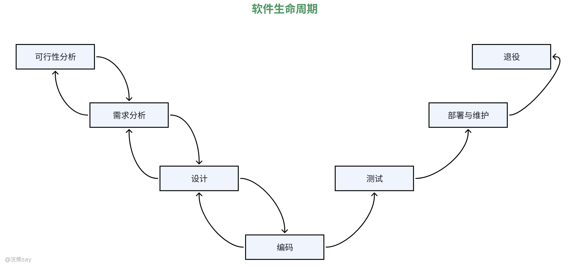
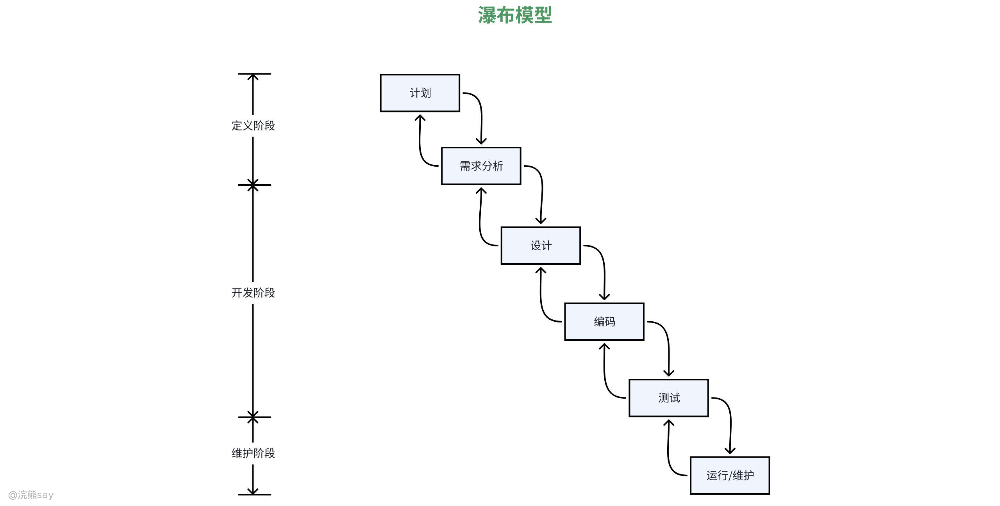
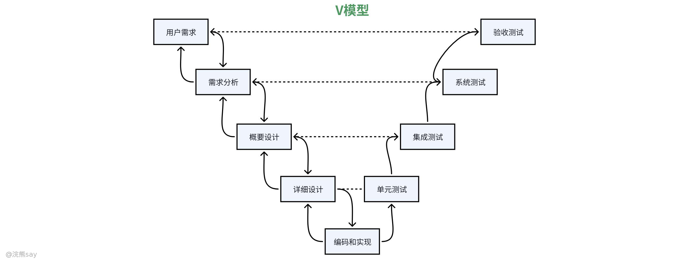
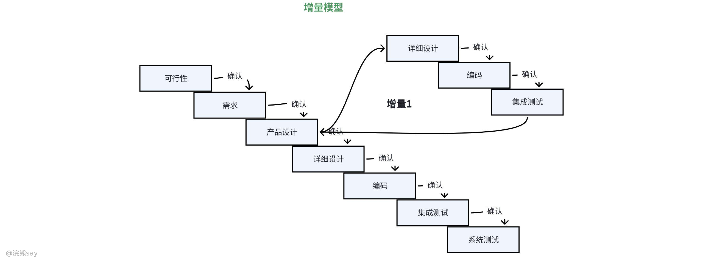
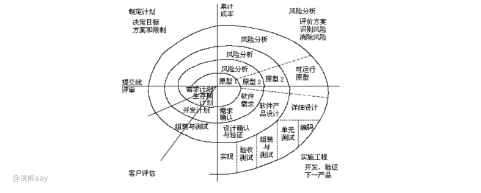
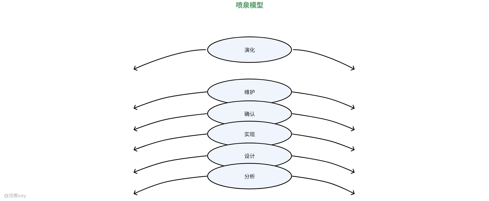
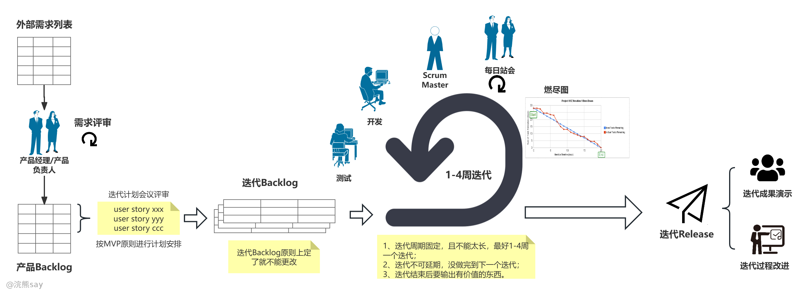

# 软件工程概念

## 什么是软件工程？

软件工程是一门将工程学的核心原则、方法与体系化思维，深度融合计算机科学、数学、项目管理、质量管理等多学科知识，应用于软件全生命周期的研发、管理、维护与优化的交叉学科和工程实践体系。它的诞生源于上世纪60年代出现的“软件危机”——传统作坊式的软件开发模式，因缺乏规范的流程、统一的标准和科学的管理，导致软件项目频繁出现进度失控、成本超支、质量低下、可维护性极差等问题，而软件工程的核心目标，就是通过工程化的手段解决这些问题，实现软件的规模化、标准化、可复用、可维护开发，让软件从单一的代码编写行为，升级为一套可控、可量化、可优化的系统工程，最终高效交付满足用户需求、具备稳定性能、符合质量标准且全生命周期成本可控的软件产品。

简言之，软件工程的本质是用工程学的思维和方法改造软件研发过程，它让软件开发从一种依赖个人经验的“手艺活”，变成了一套可复制、可规模化、可优化的“工程活”，其核心价值不仅在于能高效开发出符合需求的软件产品，更在于能保障软件在全生命周期中始终保持良好的可维护性、可扩展性和稳定性，同时实现研发成本、进度、质量的平衡与可控，最终让软件产品能够持续为业务创造价值，这也是软件工程与单纯的计算机编程最本质的区别。

## 软件工程的核心目标

软件工程的核心目标是围绕软件全生命周期，以工程化的方法体系为支撑，在研发成本、项目进度、软件质量三大核心约束之间实现动态平衡，最终高效交付能够持续匹配业务与用户需求、具备实际使用和商业价值，且全生命周期可维护、可扩展的软件产品。其所有目标均服务于 “让软件研发从依赖个人经验的作坊式工作，升级为可控、可量化、可复用的系统工程” 这一核心宗旨，各目标相互关联、相互制约，构成有机整体，既规避了传统软件开发中进度失控、成本超支、质量低下的 “软件危机”，又保障了软件产品在全生命周期中能持续为业务创造价值，是软件工程所有方法、过程、工具设计与落地的根本导向。软件工程的核心目标可归为五大核心维度，各维度层层递进、互为支撑，共同构成软件工程的目标体系：

1.  抽象：忽略复杂系统非本质细节，聚焦核心特征形成不同层次抽象模型，既能简化复杂问题、降低理解与设计难度，在面向对象开发中便通过 “类” 抽象现实实体（如 “用户类” 包含姓名、账号等属性及登录、支付等方法），无需关注具体实现逻辑。
2.  模块化：将软件系统分解为独立可交互的模块，每个模块承担特定功能，核心要求是 “高内聚”（模块内部功能紧密相关，如 “订单模块” 仅处理订单创建、支付、取消等操作）与 “低耦合”（模块间通过明确接口通信，减少直接依赖，如订单模块调用支付模块接口而非直接操作其内部数据），优势在于便于团队分工开发、单独测试、后期维护及功能复用。
3.  信息隐藏：模块内部实现细节（如算法、数据结构）对其他模块隐藏，仅通过公开接口提供服务，可降低模块间相互影响，即便模块内部修改，只要接口不变，其他模块无需调整，典型示例为操作系统的文件操作接口（如 read ()、write ()），用户无需知晓数据在磁盘的存储格式。
4.  一致性：软件系统在设计、编码、文档等方面保持统一规范与风格，具体体现为命名规则一致（如变量用小写驼峰式 userName）、界面风格统一（如按钮颜色、布局）、错误处理方式统一等，可提升代码可读性，减少团队协作的沟通成本。
5.  复用性：通过复用已有模块、组件或框架减少重复开发，例如使用 Spring Boot 等开源框架快速搭建 Web 应用，无需从零开发数据库连接、权限控制等基础功能。

综上，软件工程的五大核心目标并非孤立存在，而是形成了 “需求与质量为核心导向，成本与进度为刚性约束，可维护与可扩展为长期保障，规模化协作与持续价值输出为最终结果” 的逻辑体系。软件工程的所有方法、过程、工具均围绕这一体系设计与落地，最终实现软件研发的工程化、标准化、规模化，让软件产品在全生命周期中始终保持良好的使用状态，持续为业务和用户创造价值，这也是软件工程区别于单纯计算机编程的核心本质。

## 软件工程三要素

软件工程的经典核心三要素为**过程**、**方法**和**工具**，三者相互依存、协同联动，共同构成软件工程实施的基础框架，是保障软件开发工程化、标准化推进，从根本上解决进度延迟、成本超支、质量不稳定等软件危机问题的核心支撑，三者缺一不可，形成层层支撑、相互赋能的有机整体。

**过程**是软件工程的核心骨架，也是统筹方法和工具落地的整体执行框架，其核心是定义软件从构思到退役全生命周期的规范流程，包括阶段划分、各阶段的核心目标、执行步骤、交付标准，以及阶段间的衔接逻辑和管控规则。过程要素的落地需结合项目特性选定适配的开发模型（如瀑布、Scrum、增量模型等），同时建立配套的过程管控机制，比如需求变更管理、项目进度跟踪、风险识别与预警、成本核算等，确保软件开发活动始终有序、可控推进，避免因流程混乱导致的各类项目问题，此前提及的软件生命周期各阶段管理、项目管理的核心要求，均属于过程要素的具体落地范畴。

**方法**是软件工程的实施准则，为软件开发全流程的具体工作提供科学、标准化的技术手段和实践策略，是实现软件功能、保障软件质量的核心技术支撑，也是过程要素落地的具体操作依据。方法要素覆盖软件工程的各个环节，包括需求分析阶段的用户访谈、场景分析、用例建模等方法，设计阶段的架构设计、模块化设计、信息隐藏、抽象建模等方法，实现阶段的编码规范、结对编程等方法，测试阶段的单元测试、集成测试、性能测试等方法，以及质量管理中的代码审查、缺陷根因分析、质量指标量化分析等方法，此前梳理的软件工程基本原理、质量管理的实施方式，均属于方法要素的核心内容，为开发人员提供了可落地、可复制的工作指导。

**工具**是软件工程的技术载体，是过程和方法落地的物质支撑，通过标准化的工具链实现过程管控和方法实施的自动化、规范化，大幅提升开发效率、降低人工成本，同时让过程的监控、方法的执行更精准、可追溯。工具要素形成覆盖软件开发全生命周期的完整工具链，对应过程管控的项目管理工具（Jira、Trello、甘特图），对应配置管理的版本控制工具（Git、SVN）、持续集成工具（Jenkins），对应开发实现的编码工具（IDEA、VS Code），对应质量管理的缺陷跟踪工具（Jira）、测试工具（JUnit、JMeter），以及支撑团队协作的即时沟通工具（Slack）、文档协作工具（Confluence）等，工具的适配性直接影响方法落地的效率和过程管控的精准度，是软件工程工程化、规模化推进的必要条件。

三者的协同关系构成了软件工程的实施核心：过程为方法和工具划定整体实施框架，脱离过程的方法和工具会导致开发活动无序、缺乏统一目标；方法为过程的落地提供具体技术策略，脱离方法的过程和工具只是空有框架，无法保障软件质量和开发效率；工具为方法和过程的高效实施提供技术赋能，脱离工具的过程和方法难以适配工程化、规模化的开发需求，仅依靠人工会大幅增加出错概率和成本。软件工程的落地本质上是对三者的协同优化，根据项目规模、需求特性、团队能力适配合理的过程框架、科学的方法体系和适用的工具链，最终实现“有限资源内交付高质量软件产品”的核心目标。

## 软件生命周期（Software Life Cycle, SLC）

软件生命周期（Software Development Life Cycle，SDLC）是对软件从概念构思、需求提出开始，到设计开发、测试部署、运维维护，最终因业务迭代、技术淘汰等原因停止使用并退役消亡的整个生命过程的结构化、系统化描述与管理框架。它并非单一的步骤集合，而是一套覆盖软件全生命阶段的工程化方法论，核心目的是通过规范各阶段的任务、产出、权责与验收标准，让软件开发从无序的 “作坊式” 工作变为可控的流程化工作，从而降低开发风险、提升软件质量、控制项目成本与进度，同时保障软件在投入使用后能持续匹配业务需求，直至完成其价值使命。

软件生命周期的核心是阶段化划分与阶段间的衔接验证，不同的软件开发模型（如瀑布模型、敏捷模型、迭代模型、螺旋模型等）会根据项目的需求特性、规模大小、行业属性调整阶段的划分方式、迭代逻辑与交付节奏（比如瀑布模型是线性的阶段递进，敏捷模型是碎片化的迭代循环），但所有模型的底层都围绕软件从诞生到退役的核心环节展开，经典且通用的软件生命周期可分为七个核心阶段，各阶段环环相扣，前一阶段的产出物是后一阶段的工作基础，且每个阶段都包含明确的目标、任务、交付成果与评审验收环节，避免因前期工作的疏漏导致后期大量的返工成本，主要包括了以下7个阶段：

1.  问题定义与可行性研究：明确软件需解决的核心问题，从技术、经济、时间等维度分析可行性，输出《可行性研究报告》，作为项目是否启动的决策依据。
2.  需求分析：通过用户访谈、问卷调查、场景分析等方式，深入收集功能需求、非功能需求及约束条件，输出《需求规格说明书》明确软件 “做什么”（如 “用户可查询近 3 个月订单”“系统响应时间不超过 2 秒”），常用工具包括描述用户与系统交互的用例图、以 “作为用户，我希望…… 以便……” 为格式的用户故事。
3.  设计：将需求转化为具体技术方案，回答 “怎么做”，分为架构设计与详细设计：架构设计确定系统整体结构（如分层架构、微服务架构）、模块划分及技术选型（如编程语言、数据库）；详细设计聚焦每个模块的内部逻辑（如算法、数据结构）、接口参数、数据库表结构等，输出物包括架构图、详细设计文档、数据库设计图等。
4.  实现（编码）：依据设计文档编写代码，将设计转化为可运行程序，需遵循注释清晰、命名合理等编码规范，使用 Git 等版本控制工具管理代码，输出源代码与单元测试用例。
5.  测试：验证软件是否符合需求并发现修复缺陷，涵盖单元测试（测试单个模块或函数，如用 JUnit 测试 “订单金额计算” 函数）、集成测试（测试模块间接口兼容性，如 “用户登录后能否成功跳转至订单页面”）、系统测试（验证整体需求满足度，如压力测试 1000 用户并发下的稳定性）、验收测试（由用户参与，确认软件适配实际业务场景），输出测试报告与缺陷清单。
6.  部署与维护：部署阶段将软件安装到生产环境，配置服务器、数据库等依赖；维护阶段根据用户反馈与环境变化调整软件，包括修复运行 BUG 的纠错性维护、适配新环境的适应性维护、新增功能的完善性维护（如 “支持微信支付”）、优化代码避免潜在问题的预防性维护（如重构冗余代码）。
7.  退役：当软件不再满足业务需求（如被新系统替代），停止维护并下线，同步清理相关数据与资源。

除了上述核心阶段，软件生命周期的管理还强调全程的文档化与评审，每个阶段的成果都需要形成标准化的文档，且每个阶段结束前都需进行正式的评审，只有评审通过才能进入下一个阶段，这是保障软件质量、控制项目风险的关键。同时，软件生命周期并非一成不变的线性流程，随着软件开发技术的发展，从传统的瀑布模型（线性阶段递进）到现代的敏捷模型（迭代式、增量式开发）、螺旋模型（结合瀑布与迭代，强调风险控制），其阶段划分与执行逻辑不断优化，适配不同类型的项目：比如瀑布模型适合需求明确、规模固定的传统软件项目（如工业软件、财务软件），敏捷模型适合需求多变、追求快速交付的互联网软件项目（如 APP、小程序、电商平台）。

简言之，软件生命周期的本质是对软件 “从生到死” 的全流程进行科学化、工程化的管理，让软件开发不再是一个孤立的 “开发” 环节，而是覆盖需求、设计、开发、测试、部署、运维、退役的完整体系，最终实现软件的价值最大化与开发、维护成本的最小化。

# 软件开发模型

软件开发模型是软件工程中对软件生命周期各阶段进行结构化、标准化的执行框架，其核心是规范开发各阶段的衔接逻辑、执行流程和交付标准，不同模型的设计思路适配不同的项目约束（如需求明确性、开发周期、风险程度、团队规模）。主流的软件开发模型可分为传统结构化开发模型和敏捷开发模型两大类，同时还有部分融合了多种模型核心思想的衍生/混合型模型，各类模型各有优劣，实际项目中常结合场景灵活融合使用，以下为核心主流模型的详细解析：

## 传统结构化开发模型

这类模型以线性、阶段化、文档驱动为核心特征，开发流程遵循固定的先后顺序，阶段间衔接清晰，适合需求明确、变更少、对流程规范性要求高的项目，是早期软件工程的主流模型。

### 瀑布模型

瀑布模型是最经典的结构化模型，核心遵循线性顺序、单向推进的原则，将软件生命周期的问题定义、需求分析、设计、实现、测试、部署维护、退役各阶段依次开展，每个阶段完成后输出标准化文档，作为下一个阶段的唯一输入，阶段间几乎无反向反馈，如同瀑布自上而下流动。该模型流程清晰、管理成本低，文档体系完整便于后期追溯，适合需求完全明确、低风险、小型且开发周期固定的项目，如嵌入式系统、工业控制软件开发；但缺点也十分明显，灵活性极差，需求变更的成本极高，若后期测试阶段发现前期需求或设计问题，返工代价巨大，也无法适配需求模糊的项目。

### V模型

V模型是瀑布模型的经典改进版，核心是将测试环节与开发环节一一对应，强调测试的提前介入，打破了瀑布模型中测试仅存在于编码后的单一格局，形成“开发向下、测试向上”的V型结构。具体为：需求分析对应验收测试、架构设计对应系统测试、详细设计对应集成测试、编码阶段对应单元测试，每个开发阶段启动前，需先明确对应的测试标准和用例。该模型将测试规划贯穿开发全流程，能提前发现需求、设计阶段的缺陷，大幅提升软件质量，适合需求明确、对可靠性和质量要求极高的项目，如军工、医疗、金融核心系统开发；但本质仍属于线性模型，流程的刚性较强，面对需求变更时的调整灵活性依旧不足，且对测试团队的提前介入要求较高。

### 快速原型模型

针对瀑布模型无法适配需求模糊的问题，快速原型模型应运而生，其核心是先构建简易的软件原型，通过与用户的交互验证并迭代完善需求，再基于最终确认的原型开展正式开发。原型分为两种类型：抛弃型原型仅用于需求验证，无需考虑代码质量和可维护性，验证完成后直接舍弃；演化型原型则会在需求迭代中逐步优化，最终直接演化为正式的产品版本。该模型让用户全程参与需求确认，能最大程度减少需求偏差，解决“用户不知道自己想要什么”的核心问题，适合需求模糊、用户无法清晰描述业务诉求的项目，如电商平台、社交APP的初期开发；但缺点是原型开发会占用额外的人力和时间资源，若对原型开发的范围把控不当，易出现原型偏离核心需求、开发周期无限延长的问题。

### 增量模型

增量模型的核心是将软件产品拆分为多个独立的、可交付的增量模块，分阶段开发、分阶段交付，每个增量模块完成后即可投入实际使用，后续增量模块基于前期已交付的版本迭代开发，最终整合为完整的软件产品。例如开发企业管理系统时，先开发核心的“用户登录+权限管理”增量模块并交付，再开发“人事管理”“财务管理”等后续模块，逐步完善系统功能。该模型将大型项目的开发风险进行分散，能快速向用户交付可用的核心功能，便于用户提前验证业务价值，也能根据用户反馈及时调整后续增量的开发方向，适合大型、复杂，且需要逐步向用户交付功能的项目，如企业级ERP系统、大型政务平台开发；但对模块的拆分和集成规划要求较高，若模块划分不合理，易出现模块间耦合过高、后期集成难度大的问题。

### 螺旋模型

螺旋模型

螺旋模型是融合了增量模型和快速原型模型的高阶结构化模型，其核心创新是将风险分析作为开发全流程的核心环节，以迭代螺旋的方式分阶段开发，每个螺旋圈对应一个完整的开发迭代周期，每个周期均包含“制定开发计划→风险识别与分析→实施开发与原型构建→评估验证与规划下一圈”四个核心步骤，螺旋的圈数随产品功能的完善逐步增加，最终形成完整产品。该模型全程重视风险管控，能在开发早期识别并规避技术、需求、资源等方面的风险，适合大型、复杂、高风险的项目，如航天航空软件、大型分布式系统开发；但缺点是流程复杂，对开发团队的风险分析能力和项目管理能力要求极高，且过多的风险评估和文档工作会增加开发成本，延长开发周期。

### 喷泉模型

喷泉模型是面向对象软件开发中适配性极强的迭代式开发模型，核心特征在于软件开发各阶段并非线性割裂，而是呈现相互迭代、无间歇推进的动态状态。在整个开发流程中，软件的部分模块或相关功能常常需要经过多次重复打磨，相关的对象与功能成分会在每一轮迭代中逐步添加、完善，实现渐近式的积累与优化，避免了传统模型中阶段断层导致的返工成本。这种模式充分契合面向对象开发的封装、继承、多态特性，各阶段的交互与重叠能让开发团队快速响应需求调整，无需等到所有需求完全明确再启动后续工作，大幅提升了开发效率，尤其适合需求模糊、变化频繁的创新型项目。但由于其迭代循环的非线性特性，常规的线性项目管理方法难以适配，对团队的协作同步、进度把控与质量管控提出了更高要求，需要配套灵活的过程管理机制与高效的沟通协作模式，才能充分发挥其迭代优势。

## 敏捷开发模型

敏捷开发模型是对传统结构化模型的颠覆，源于2001年的《敏捷宣言》，核心遵循迭代、增量、响应变化、以人为本的原则，摒弃了传统模型中繁琐的文档要求，强调团队协作、用户持续反馈、快速交付可用产品，开发流程灵活且富有弹性，适合需求多变、追求快速上线和持续迭代的互联网项目，是目前互联网行业的主流开发模型，其中Scrum、看板（Kanban）、极限编程（XP）为最核心的三类。

### Scrum模型

Scrum是目前应用最广泛的敏捷开发模型，属于轻量、迭代式的敏捷框架，以短周期的Sprint（冲刺，通常1-4周） 为核心迭代单元，每个Sprint结束后必须交付一个可独立运行的产品增量。该模型定义了清晰的角色、仪式和工件：角色包括产品负责人（PO，负责梳理需求、确定需求优先级）、Scrum大师（SM，负责保障Scrum流程顺畅，移除团队开发中的障碍）、自组织开发团队（自主分配任务，完成Sprint开发）；仪式包括每日站会（快速同步进度、问题和计划）、Sprint计划会（确定当期Sprint的开发范围）、Sprint评审会（向用户展示产品增量并收集反馈）、Sprint回顾会（总结当期流程问题并优化）；工件包括产品待办列表（整体需求清单）、冲刺待办列表（当期Sprint的开发任务）、可交付的增量产品。Scrum模型灵活度高，能快速响应需求变更，团队自组织性强，适合互联网产品、需求频繁变更、追求快速迭代交付的项目，如手机APP、小程序、电商平台开发；但对团队成员的专业能力和自我管理能力要求较高，若产品负责人对需求优先级把控不当，易出现“范围蔓延”，导致Sprint目标无法完成。

### 看板（Kanban）模型

看板模型源于丰田的精益生产方式，核心是通过可视化看板实现工作流的透明化管理，限制在制品数量，提升开发效率，属于“无固定迭代周期”的敏捷模型，强调拉式生产——只有前一个任务完成，后一个任务才能启动，从根源上减少开发过程中的瓶颈和等待。看板通常分为“待办→进行中→测试→评审→完成”等列，每个任务以卡片形式呈现，直观展示项目的整体进度和各环节的工作状态，同时通过设定“在制品上限”，避免团队同时处理过多任务导致效率低下。该模型轻量、易落地，无需严格的迭代周期约束，能灵活适配按需开发的场景，适合小型开发团队、需要持续优化工作流，或开发节奏不固定的项目，如初创公司的产品开发、软件运维团队的任务管理；但缺点是缺乏明确的迭代目标和交付节点，若团队自我管理能力不足，易出现任务推进缓慢、需求优先级混乱的问题。

### 极限编程（XP）

极限编程以高质量代码和极致响应需求变更为核心，是最“激进”的敏捷模型，强调客户全程深度参与，通过一系列严格的核心实践保障开发效率和代码质量，核心实践包括：结对编程（两名开发者共用一台电脑，一人编码一人评审，实时提升代码质量）、测试驱动开发（TDD，先编写测试用例，再编写满足用例的代码，以测试引导开发）、持续集成（频繁将代码集成到主干，及时发现集成问题）、重构（在不改变功能的前提下，持续优化代码结构，提升可维护性）、简单设计（以满足当前需求为核心，避免过度设计）、现场客户（客户全程驻场，实时解答团队的需求问题）。该模型能最大程度保证代码质量，减少后期维护成本，且能快速响应极不稳定的需求，适合小型、高效的开发团队，或需求极度多变、对代码质量要求极高的项目；但缺点是核心实践的执行要求严格，对客户的参与度和团队的技术能力、协作能力要求极高，在大型团队中难以落地。

## 主流衍生/混合型模型

除了传统和敏捷两大核心类别，实际项目中还会用到融合了多种模型核心思想的衍生模型，其中最具代表性的是迭代模型和DevOps模型：

1.  迭代模型：是众多开发模型的基础核心思想，并非独立的模型，其将软件开发分为多个短周期的迭代，每个迭代都完成“需求→设计→编码→测试”的完整流程，迭代结束后交付一个产品版本，通过多轮迭代逐步完善产品功能。瀑布模型、敏捷模型、增量模型均融合了迭代思想，该模型的核心价值是将复杂开发过程拆解为小周期，便于及时发现问题、响应反馈，是目前几乎所有软件开发的基础逻辑。
2.  DevOps模型：融合了开发（Development）和运维（Operations）的核心思想，并非单纯的开发模型，而是将开发、测试、运维全流程打通的一体化框架，核心是持续集成（CI）、持续交付（CD）、持续部署（CD），强调开发团队和运维团队的深度协作，打破部门壁垒，实现代码从开发、测试到部署上线的自动化、标准化，大幅提升软件的发布效率和稳定性。DevOps模型常与敏捷模型结合使用，适合云原生、微服务架构，或追求快速、稳定发布的项目，如互联网大厂的产品开发，是目前大型软件项目的主流落地框架。

## 软件开发模型的选择原则

实际项目中不会单一使用某一种开发模型，核心选择依据是项目的实际约束条件，具体可参考：

1.  若需求明确、低风险、对质量和流程规范性要求高，优先选择瀑布模型或V模型，可融合少量迭代思想；
2.  若需求模糊、用户无法清晰描述诉求，优先选择快速原型模型，验证需求后再结合增量或敏捷模型开发；
3.  若项目大型、复杂，需要逐步交付功能，优先选择增量模型或螺旋模型，重视风险管控；
4.  若需求多变、追求快速上线和持续迭代，优先选择Scrum或看板模型，小型团队可尝试XP模型；
5.  若追求开发、测试、运维的高效协同，快速稳定发布产品，可将敏捷模型与DevOps模型结合使用。

简言之，软件开发模型的核心价值是“适配项目”，而非生搬硬套，实际落地中需根据项目的需求特性、团队能力、交付要求，融合多种模型的优点，制定定制化的开发流程。

# 软件工程的关键支撑要素

软件工程的高效落地与全流程管控，离不开项目管理、配置管理、质量管理、团队协作四大关键支撑要素的协同配合，各要素围绕软件开发全生命周期形成专属保障体系，分别从进度成本把控、软件资产管理、质量过程控制、跨角色执行落地的层面，为项目顺利推进保驾护航，具体内容如下：

1、**项目管理**

核心目标是保障项目在预定的时间与成本范围内完成开发工作，最终交付符合质量要求的软件产品。实际落地中可借助专业工具实现项目全流程管控，例如通过Jira跟踪各环节任务执行进度、Trello搭建可视化看板管理工作流、甘特图科学规划项目整体时间线，让项目进度、任务分配与阶段节点清晰可追溯。

2、**配置管理**

核心目标是对软件开发全流程中的各类软件资产（包括代码、文档、系统配置等）进行规范化版本管理，精准追踪资产的所有变更记录，避免版本混乱、资产丢失或变更追溯无据的问题。主流适配工具涵盖分布式版本控制系统Git、集中式版本控制系统SVN，同时可结合Jenkins实现代码的持续集成，让配置与代码的管理、更新更高效、标准化。

3、**质量管理**

核心目标是通过全流程的过程控制与系统化的缺陷管理，从源头把控并持续提升软件产品质量。具体可通过多种标准化方法落地实施：开展代码审查（如借助GitHub Pull Request完成代码的评审与合并）、建立全链路缺陷跟踪机制（如通过Jira记录并跟进BUG的发现、修复、验证全流程）、开展质量量化分析，围绕缺陷密度、测试覆盖率等核心质量metrics进行数据监控与分析，让质量管理工作有数据可依、有标准可循。

4、**团队协作**

作为软件工程的核心执行要素，其核心是明确跨角色的职责划分并搭建高效的内部沟通协作体系。首先需界定清晰的核心角色与对应职责：产品经理主导需求的梳理、评审与落地把控，开发工程师负责代码的编写、实现与单元测试，测试工程师开展全维度的质量验证与缺陷反馈，运维工程师完成软件的环境搭建、部署上线与线上保障等；同时搭配专业的沟通协作工具，通过Slack实现团队成员的即时沟通、信息同步，借助Confluence完成团队文档的协同编辑、统一管理与便捷检索，让跨角色的信息传递更高效，协作衔接更顺畅。

# 软件工程的挑战与趋势

软件工程在落地实践中，始终面临着多方面的核心挑战，核心集中在软件规模持续扩大带来的系统复杂性攀升，典型如千万行代码级别的大型系统，其日常维护、漏洞修复与功能迭代的难度呈指数级增长，对架构设计、代码规范和文档体系都提出了极高要求；同时互联网产品等业务场景下的需求快速变化与高频迭代，要求软件研发体系具备极强的灵活适配能力，易出现迭代效率与软件质量失衡的问题；此外跨团队、跨角色的协作壁垒也成为研发效率的重要制约因素，不同团队的技术栈差异、流程规范不统一、信息传递不畅等问题，极易导致交付成果衔接断层、研发节奏不一致。

为应对上述核心挑战，软件工程领域逐步形成了贴合技术发展与业务需求的三大核心发展趋势：低代码/无代码开发模式通过可视化的操作界面、预制化的组件与模板，大幅降低了软件研发的技术门槛，既能够实现简单业务需求的快速落地，也能让专业研发人员聚焦于复杂系统的核心架构与功能开发，有效释放整体研发产能；DevOps理念则通过深度融合开发与运维环节，打通了“开发-测试-部署-运维”的研发闭环，依托自动化的流程与工具链实现软件的持续集成、持续交付，大幅提升了软件的迭代效率与运维稳定性，适配了高频迭代的业务需求；人工智能辅助开发技术则渗透到研发全流程，从AI代码生成、代码优化到自动化测试用例生成、漏洞智能排查，借助技术手段替代了大量重复性的人工工作，既提升了研发各环节的效率，也能在一定程度上降低人为失误，缓解大规模系统研发与维护的压力。

归根结底，软件工程的本质是用工程化思维解决软件研发全流程的各类问题，通过建立规范的研发流程、落地科学的技术方法、适配高效的工具体系，在软件开发的质量、成本、效率三大核心维度之间实现动态平衡，最终让软件产品落地并持续释放商业与业务价值。而无论是传统的瀑布模型，还是当下广泛应用的敏捷开发模式，其底层逻辑都是工程化思维的不同实践形式，核心目标都是为了更好地应对软件研发过程中的固有复杂性与需求不确定性，让软件研发从依赖个人经验的作坊式工作，成为可控、可量化、可复用的系统工程。

# 真题
| 【国家电网】软件工程的三要素是（ ）。A.技术、方法和工具B.方法、对象和类C.方法、工具和过程D.过程、模型和方法答案：C解析：软件工程三要素是方法、工具和过程——方法是完成软件工程项目的技术手段，工具支持软件的开发、管理和文档生成，过程支持软件开发各环节的控制和管理 |
| --- |

| 【国家电网2022】软件设计中通常采用结构化设计方法，模块的独立程度是评价设计好坏的重要度量。耦合性与内聚性是模块独立性的两个定性标准。内聚性是一个模块内部各个元素间彼此结合的紧密程度的度量；耦合性是模块间互相连接的紧密程度的度量。一般较优秀的软件设计，应尽量做到（ ）。A.高耦合，高内聚B.高耦合，低内聚C.低耦合，高内聚D.低耦合，低内聚答案：C解析：一般较优秀的软件设计，应尽量做到高内聚、低耦合，即减弱模块之间的耦合性和提高模块内的内聚性，有利于提高模块的独立性 |
| --- |

| 【国家电网】关于软件工程的各类定义请判断以下关于软件工程的叙述中有误的是（ ）。A.软件工程的目标是生产具有正确性、可用性以及成本合适的软件产品；B.软件工程的过程是生产一个最终能满足需求且达到工程目标的软件产品所需要的步骤；C.软件工程的过程只包括设计并构建计算机程序；D.软件工程的原则是围绕工程设计、工程支持以及工程管理在软件开发过程中必须遵循的原则答案：C解析：软件工程的过程不仅包括设计并构建计算机程序，还包括需求分析、测试、维护等环节 |
| --- |
