# 需求分析概念

## 什么是需求分析？

在软件工程中，需求分析是软件开发过程的关键核心阶段，核心目标是准确理解用户及利益相关者对软件系统的期望与要求，将模糊、零散的需求转化为清晰、可执行的规格说明，最终回答 “软件应该做什么” 的核心问题，为后续设计、开发、测试及维护工作奠定坚实基础。其具体目标包括：通过与用户、利益相关者深度沟通，全面挖掘显性与隐性需求；梳理不同主体或需求间的歧义与冲突（如功能优先级、性能指标差异），推动达成共识；将需求转化为具体、可量化、可检验的文档（如需求规格说明书），确保开发结果与预期一致；为后续全流程工作提供明确依据，直接影响软件质量与项目成败。需求分析作为 “理解用户” 与 “定义产品” 的关键桥梁，高质量的分析过程能让开发团队找准方向、高效推进，最终交付符合预期的软件产品。

## 需求分析任务

需求分析的核心任务围绕 “明确要求、梳理数据、建立模型、形成文档、验证有效性” 展开，具体包括：​

1.  确定系统综合要求：明确软件需具备的核心功能，界定响应时间、吞吐量、有效性、准确性等定量性能指标，考量系统部署后的可支持性（含可移植性、可维护性等），明确用户接口、硬件接口、软件接口、通信接口等外部接口需求，同时厘清约束信息（如数据精度要求、指定运行环境等限制设计者与程序员选择的条件）。
2.  分析系统数据要求：梳理系统所需的基本数据元素、数据元素间的逻辑关系（数据结构）、数据总量及峰值等关键信息，为数据建模提供支撑。
3.  建立软件逻辑模型：根据采用的开发方法选择对应建模方式，结构化方法中常用数据流图描述，面向对象分析方法中则通过类模型呈现。
4.  编写软件需求规格说明书：将所有分析结果规范化、文档化，形成正式的需求基准文件。
5.  开展需求分析评审：从一致性、完整性、现实性、有效性等维度验证需求规格，确保需求合理可行。

## 需求分析方法

1.  功能分解方法：核心思想是将系统视为若干功能的集合，通过 “自顶向下、逐步求精” 的思路，将总功能逐层分解为子功能，最终形成倒置的 “功能树” 结构。该方法契合传统程序设计人员的思维习惯，分解结果常接近系统程序结构雏形，但难以与软件设计明确分离，对用户需求变化的适应性较弱。
2.  结构化开发方法：提出分解与抽象、模块独立化等提升软件结构合理性的准则，涵盖结构化分析、结构化设计、结构化程序设计等系列方法。其中，结构化分析技术是面向数据流的需求分析技术，适用于大型数据处理系统。
3.  信息建模方法：从数据视角对现实世界建立模型，核心工具是实体 - 联系图，通过实体与联系构成的网络，清晰描述系统的信息状况与数据关联。
4.  面向对象的分析方法：融合实体 - 联系图中的概念与面向对象程序设计语言的核心思想，关键在于识别和定义问题域内的类与对象，分析其相互关系，并依据问题域的操作规则建立系统模型。

## 需求分析原则

需求分析需遵循五大核心原则，以确保分析过程的系统性与有效性：一是能够表示和理解问题的信息域，为功能梳理提供基础；二是能够明确定义软件将完成的核心任务，锁定开发目标；三是能够刻画软件的行为（即外部事件引发的响应）；四是能够划分数据、功能、行为三类模型，分层次揭示细节；五是分析过程需从要素信息逐步深入至细节信息。应用这些原则，可帮助分析人员更完整地理解功能需求，通过模型简洁传递功能与行为特征，借助抽象与分解降低问题复杂度，实现系统化的需求处理。

# 结构化分析

## 结构化分析方法

结构化分析是遵循 “面向数据流、自顶向下、逐层分解” 核心策略的需求分析技术，其核心原则为 “抽象” 与 “分解”—— 即按功能分解逻辑，对系统逐层拆解，直至识别出所有可实现的软件元素。该方法的核心产出包括三部分：一是一套分层数据流图（DFD），用于直观描述数据流从输入到输出的完整变换流程；二是一本数据字典（DD），详细定义 DFD 中所有数据流、文件及组成数据项的具体含义；三是一组加工逻辑说明，通过结构化语言、判定表、判定树等形式，明确每个不可再分的 “基本加工” 的具体处理规则。其核心工具对应上述产出，包括数据流图、数据字典、结构化语言、判定表及判定树。

## 结构化分析步骤

1、**画分层数据流图**

以整个系统为单一加工构建基本功能模型，再通过 “自顶向下、逐步细化” 的方式逐层分解，每一层分解都使加工功能更具体，直至所有加工简化为无需再分的 “基本加工”。最终形成的分层 DFD 将完整呈现系统的数据流与加工逻辑，勾勒系统整体概貌。

2、**确定数据定义与加工策略**

深入梳理系统数据细节，明确数据定义与加工规则。此过程中可能发现新问题，需通过补充调查优化 DFD 与加工定义，形成 “绘制 - 定义 - 修改” 的循环，直至产出用户与分析员达成共识的需求规格说明书（SRS）。

3、**需求分析的复审**

由用户、系统分析员主导，邀请设计人员参与，重点审查 DFD、数据字典及加工规格说明的完整性、易改性与易读性，排查文档中的矛盾、冗余与遗漏问题，确保需求规格的合理性。

## 结构化分析工具——E-R图

### 什么是ER图？

ER 图（Entity-Relationship Diagram，实体 - 联系图）是数据库设计的核心可视化工具，由 Peter Chen 于 1976 年提出，通过标准化图形符号具象化描述现实世界中的实体、属性及实体间关联，属于概念数据模型的核心表达形式，被形象称为数据库设计的 “施工图”。采用 E-R 模型（实体 - 关系模型）的核心价值体现在以下几个方面：

1.  高效数据建模：E-R 模型提供了直观易懂的建模范式，通过将现实世界中的数据抽象为实体、属性及关联关系，并以标准化图形符号呈现，能够精准捕捉数据核心结构，助力设计人员快速构建贴合业务场景的数据模型。
2.  清晰数据可视化：借助图形化表达，E-R 模型可将数据的组织逻辑、实体间的关联模式及属性特征直观呈现，让复杂的数据关系变得清晰易懂，便于技术团队与业务人员高效沟通，也为后续系统维护提供了直观参考。
3.  强化数据完整性：通过明确定义实体间的关联规则与约束条件，E-R 模型从设计源头规避了数据冗余、不一致等问题，确保数据在插入、更新、删除等操作过程中始终保持一致性与准确性，为数据质量提供基础保障。
4.  支撑查询优化：基于 E-R 模型对数据关系的清晰梳理，开发人员能够精准把握查询逻辑，设计出更高效的查询语句与关联方式，有效提升查询响应速度；同时，模型还能为索引设计提供明确指导，进一步优化数据库访问性能。

综上，E-R 模型构建了直观且规范的数据描述与数据库设计框架，不仅提升了数据库设计的科学性与合理性，更通过保障数据完整性、优化查询性能，全面增强了数据库系统的运行效率与可靠性，是数据库设计领域的核心工具之一。

### ER图构成

#### 实体（Entity）

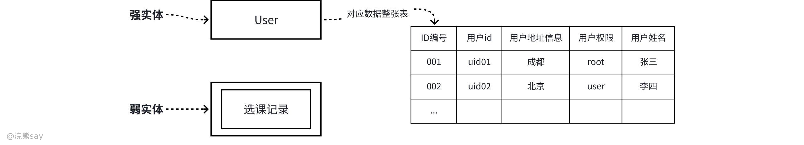

实体表示现实世界中的一个独立对象，可以是人、物、地点、概念等，对应数据库中的 “表”。符号规范为：强实体用矩形框表示，弱实体（依赖强实体存在，无法独立标识）用双线矩形框表示。典型示例包括学生、课程、订单、商品等强实体，以及选课记录、订单明细等依赖强实体存在的弱实体。

#### 属性（Attribute）

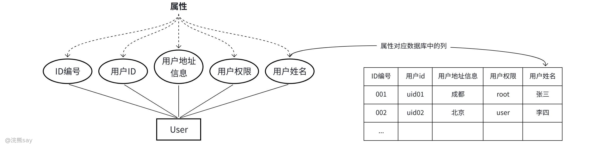

性是描述实体特征的信息。每个实体可以有多个属性，例如一个人实体可以有姓名、年龄、性别等属性。对应数据库中的 “列”，符号为椭圆形，通过直线与所属实体连接，其中主键（唯一标识实体的属性）需加下划线标注。属性可分为多类：简单属性不可拆分（如 “姓名”“年龄”），复合属性可进一步拆解（如 “地址” 可拆分为省、市、街道等）；单值属性仅对应唯一值（如 “学号”“身份证号”），多值属性可同时存在多个值（如 “电话号码”“兴趣爱好”）；派生属性无需直接存储，可通过其他属性推导得出（如 “年龄” 由 “出生日期” 计算获得）。

#### 关系（Relation Ship）

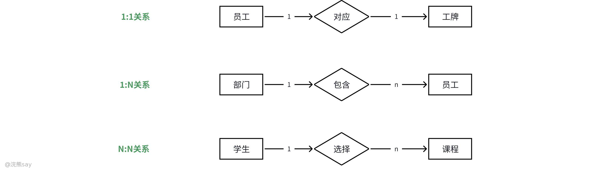

在E-R模型中，**关系**指实体间的关联模式，对应数据库设计中的“表间关联”。其图形符号为菱形框，通过直线与相关实体连接，直线上需明确标注关系类型（如一对一、一对多）及约束条件（如基数约束、完整性约束），以此精准界定实体间的作用规则。根据实体间的连接逻辑与关联范围，E-R图中的关联关系可分为以下三类：

1.  一对一（One-to-One，简称1:1）关联：两个实体集中，一个实体的任意实例仅能与另一个实体的唯一实例建立关联，反之亦然。例如“员工”与“专属工牌”的关联——一名员工对应唯一工牌，一个工牌仅归属一名员工，二者为严格的一一对应关系。
2.  一对多（One-to-Many，简称1:N）关联：一个实体的单个实例可与另一个实体的多个实例建立关联，而后者的每个实例仅能与前者的一个实例关联。例如“部门”与“员工”的关联——一个部门可包含多名员工，但每名员工仅隶属于一个部门，呈现“一方主导、多方从属”的特征。
3.  多对多（Many-to-Many，简称M:N）关联：两个实体集中，一个实体的多个实例可分别与另一个实体的多个实例建立关联。例如“学生”与“课程”的关联——一名学生可选修多门课程，一门课程也可被多名学生选修，双方实例的关联无唯一限制。

此外，E-R图中的关系可额外配置**关系属性**，用于补充描述关联本身的关键信息——这类属性无法单独归属某一个实体，却能完善关系的刻画维度。以“职工”与“部门”的“工作”关系为例，可添加“入职时间”“岗位职责”“薪资等级”等属性，精准呈现职工在对应部门的具体工作状态，让数据模型更贴合实际业务场景，避免信息缺失。

## 结构化分析工具——数据流图

### 数据流图的概念

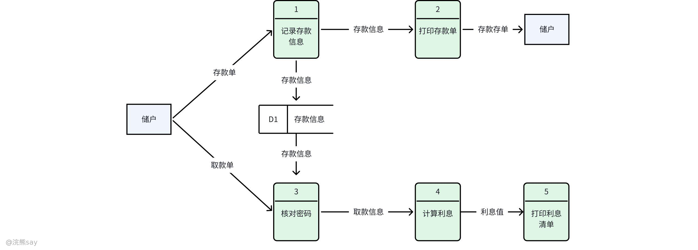

数据流图（Data Flow Diagram，简称 DFD）是可行性研究中的核心图形化分析工具，本质是一种描绘系统逻辑功能的可视化技术。其核心作用是清晰呈现信息流的运动轨迹，以及数据从输入进入系统后，经过一系列变换、处理，最终输出的完整逻辑过程。

它聚焦于软件系统的数据流转与处理逻辑，不涉及具体的物理部件（如硬件设备、程序模块的具体实现），也不描述数据加工的控制流程（区别于程序流程图），仅通过标准化图形符号，直观展现数据的来源、流动路径、处理环节、存储方式及最终去向，为推导系统逻辑模型、开展技术可行性分析提供清晰的可视化支撑，帮助分析人员与项目相关方快速理解系统核心功能与数据交互关系。

### 数据流图的组成

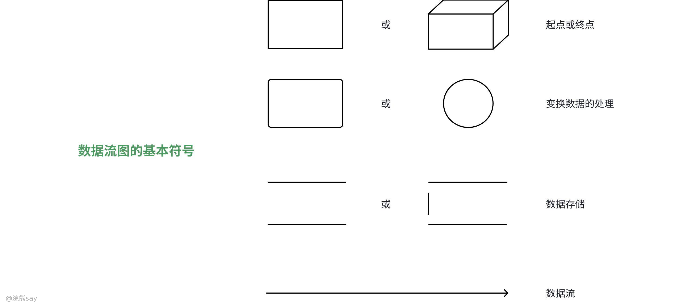

1.  **起点或终点（外部实体）：常用** 矩形或立方体表示，代表系统外部的数据来源或接收方，如用户、其他系统等，是数据的起点或终点。它是系统与外部环境的接口，只负责向系统输入数据或接收系统输出的数据，内部不涉及任何数据处理逻辑。例如：“学生”、“图书馆管理员”、“支付网关系统”。
2.  **变换数据的处理（处理过程）：** 常用圆角矩形（或圆形）表示，表示对数据进行加工、计算或转换的操作，是系统的核心功能单元。它是数据流图的核心，负责接收输入数据流，按照既定规则进行处理，然后产生输出数据流。每个处理过程都必须有唯一的标识和明确的处理描述。例如：“借阅图书”、“计算总成绩”、“验证用户身份”。
3.  **数据存储：** 两条平行横线（或带一侧竖线的平行横线），表示系统中用于持久化保存数据的逻辑存储，如数据库、文件等。用于描述数据的存档、读取和写入。它不代表具体的物理存储设备（如硬盘、U 盘），而是逻辑上的数据集合。例如：“图书信息表”、“用户数据库”、“订单记录文件”。
4.  **数据流：** 带箭头的直线，表示数据在系统中流动的方向和内容，连接外部实体、处理过程和数据存储。箭头方向代表数据的传输路径，线上通常需要标注数据的名称（如 “借阅申请单”、“用户信息”），表示在系统中流动的具体数据内容。

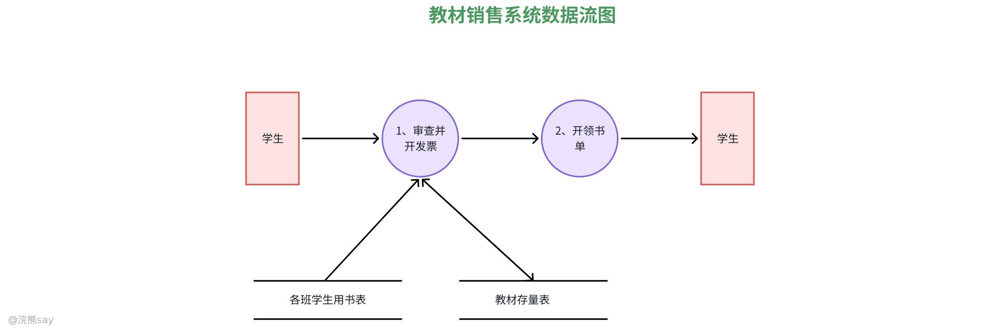

如上图所示，是一个教材销售系统的数据流图，它清晰地展示了学生购买教材时，数据在系统内部的流动和处理过程。

图中的红色矩形“学生”是系统的外部实体，既是整个流程的起点，也是终点。学生首先向系统发起购书请求，这个请求数据流向第一个处理过程——“审查并开发票”。这个处理环节是整个流程的核心校验步骤，它需要同时访问两个数据存储：一是“各班学生用书表”，用来核对该学生是否有购买相应教材的资格和数量；二是“教材存量表”，用来确认仓库中是否有足够的库存。

当审查通过并成功开具发票后，处理结果会传递到第二个处理过程“开领书单”。这个环节会生成最终的取书凭证——领书单，并将其作为输出数据交还给“学生”，学生凭此单据就可以领取教材，整个购书流程至此结束。

这张图用图形化的方式，把“学生购书”这个业务场景拆解成了“请求-校验-处理-输出”四个清晰的步骤，让我们能直观地理解系统内部的数据逻辑。

## 浣熊真题
| 【国家电网2022】数据流图是进行软件需求分析的常用图形工具，其基本图形符（ ）。A. 输入、输出、外部实体和加工B. 变换、加工、数据流和存储C. 加工、数据流、数据存储和外部实体D. 变换、数据存储、加工和数据流答案 ：C解析 ：数据流图的基本图形符号包括加工（处理过程）、数据流、数据存储和外部实体。加工用圆角矩形表示，数据流用带箭头的直线表示，数据存储用两条平行横线表示，外部实体用矩形表示。 |
| --- |

| 【国家电网2021】DFD 中的每个加工至少有（ ）。A. 一个输入流或一个输出流B. 一个输入流和一个输出流C. 一个输入流D. 一个输出流答案 ：B解析 ：DFD 中的每个加工必须有输入和输出，不存在只有输入或只有输出的加工。这是绘制数据流图的基本规则之一，确保数据处理的完整性。 |
| --- |

# UML建模工具

## UML概念

### 什么是 UML？

UML（Unified Modeling Language，统一建模语言）是用于可视化、描述、构建和文档化软件系统的标准化建模语言，通过统一的符号和规则，衔接开发者、设计师、客户等多角色，助力各方清晰理解系统的结构、行为与交互逻辑。

### UML 作用

UML 的核心价值在于贯穿软件系统开发全生命周期，不同阶段对应特定的建模应用：​

-   **用户需求阶段**：通过用例图捕获需求，从用户视角描述系统功能及操作者与系统的交互过程；
-   **系统分析阶段**：聚焦问题域核心概念（如对象、类）及相互关系，构建静态模型，类图是该阶段的核心工具；
-   **系统设计阶段**：在分析模型基础上，补充技术细节相关类（如交互接口类、数据处理类、通信并行处理类），为实现阶段提供详细设计依据；
-   **系统实现阶段**：采用面向对象程序设计语言，将设计阶段的类转化为源程序代码；通过构件图描述代码构件的物理结构及相互关系，借助配置图定义系统软硬件的物理体系结构；
-   **测试阶段**：UML 模型为测试提供核心依据 —— 类图用于单元测试，构件图、合作图用于集成测试，用例图用于确认测试，最终验证结果是否满足用户需求。

## UML关系

在 UML（统一建模语言）中，关系（Relationships） 用于描述模型元素（如类、用例、组件等）之间的联系，是构建 UML 图的核心要素。

### UML关系分类

不同的关系代表不同的语义，以下是 UML 中最常用的 6 种关系，按从弱到强的依赖程度排序：

1、**依赖（Dependency）**

表示一个元素（客户端）以某种方式依赖于另一个元素（供应商），即客户端的实现需要用到供应商的信息或服务，若供应商发生变化，可能影响客户端。依赖是一种临时性、弱关联的关系，不强调结构上的连接，仅体现 “使用” 或 “依赖” 的逻辑。比如一个类调用另外一个类得静态方法，就属于依赖关系，比如A中调用B.staticMethod。

2、**关联（Association）**

表示两个元素之间存在结构上的连接，通常是对象之间的 “拥有” 或 “交互” 关系，是一种相对稳定的关系。比依赖更强，体现元素间的长期联系，可带有属性（如关联名称、多重性）。例如：学生（Student）和课程（Course）之间的“选课关联”。

3、**聚合（Aggregation）**

聚合是关联关系的一种特例，属于整体与部分的关系，强调 “部分可以脱离整体独立存在”，整体和部分是松散的组合，部分的生命周期不依赖于整体（如整体销毁，部分仍可存在）。一般用带空心菱形的实线表示，菱形指向整体（整体 ←\[空心菱形 + 实线\]→ 部分）。例如：图书馆（Library）和书籍（Book）：书籍可以脱离图书馆单独存在（如被读者借出），图书馆是整体，书籍是部分。

4、**组合（Composition）**

组合也是关联关系的特例，属于整体与部分的关系，但强调 “部分完全依赖于整体”，即部分不能脱离整体独立存在。整体和部分是紧密的组合，部分的生命周期由整体控制（整体创建时部分被创建，整体销毁时部分也随之销毁）。用带实心菱形的实线表示，菱形指向整体（整体 ←\[实心菱形 + 实线\]→ 部分）。例如：人体（Body）和心脏（Heart）：心脏不能脱离人体单独存在，是人体的核心组成部分。

5、**泛化（Generalization）**

泛化表示一般与特殊的关系，即 “特殊元素”（子类）继承 “一般元素”（父类）的属性和行为，并可添加自己的特性。体现面向对象中的 “继承” 概念，是一种强关联，子类与父类之间是 “is-a” 的关系（如 “学生是一个人”）。用带空心三角形的实线表示，三角形指向父类（子类 →\[空心三角形 + 实线\]→ 父类），示例：

-   父类 “动物（Animal）”，子类 “狗（Dog）”“猫（Cat）”：狗和猫继承动物的 “呼吸”“进食” 行为，同时有自己的 “吠叫”“喵喵叫” 行为。
-   父类 “形状（Shape）”，子类 “圆形（Circle）”“矩形（Rectangle）”：子类继承形状的 “面积计算” 方法，同时实现各自的具体逻辑。

6、**实现（Realization）**

实现是依赖关系的特例，描述两个不同语义层次的元素之间的关系，通常指 “一个元素（如类）实现另一个元素（如接口）定义的行为”。接口定义 “做什么”，实现类定义 “怎么做”，体现 “规范与实现” 的分离。用带空心三角形的虚线表示，三角形指向被实现的元素（如接口）（实现类 ←\[空心三角形 + 虚线\]→ 接口）。

-   常见场景：
-   类（Class）实现接口（Interface）：如Class Bird实现Interface Flyable（飞翔接口），实现fly()方法。
-   用例（UseCase）与用例实现（UseCaseRealization）：用例定义功能，用例实现描述如何通过交互完成该功能。

### UML关系对比
| 关系类型 | 核心语义 | 强弱程度 | 符号特点 | 典型示例 |
| --- | --- | --- | --- | --- |
| 依赖 | 元素间的临时使用 | 最弱 | 虚线箭头 | 类 A 调用类 B 的方法 |
| 关联 | 元素间的结构连接 | 中等 | 实线（可带箭头） | 学生与课程的 “选课” 关系 |
| 聚合 | 整体与可独立存在的部分 | 较强 | 空心菱形 + 实线（指向整体） | 图书馆与书籍 |
| 组合 | 整体与不可独立的部分 | 很强 | 实心菱形 + 实线（指向整体） | 人体与心脏 |
| 泛化 | 一般与特殊（继承） | 强 | 空心三角形 + 实线（指向父类） | 动物与狗、猫 |
| 实现 | 规范与实现的分离 | 较强 | 空心三角形 + 虚线（指向接口） | 类实现接口 |

## 静态模型

### 什么是静态模型？

静态模型（Static Models）是 UML 的核心组成部分，用于描述系统在特定时间点的结构，聚焦系统组成元素（类、对象、接口、组件等）及相互关系，不涉及元素动态行为或交互过程，是系统设计的基础。

### 用例图

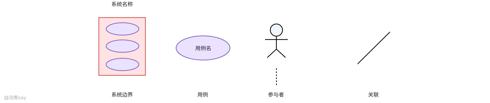

用例图是一种用于描述软件系统与外部参与者交互的 UML 图，它能清晰展现系统功能和参与者之间的关系，用于描述软件系统与外部参与者的交互，核心元素包括参与者、用例和关系：​

-   **用例**：代表外部可见的系统功能，包含完成某项任务的一系列逻辑相关操作。它是从用户角度出发，对系统行为的抽象描述，聚焦于系统能为用户做什么，而非系统如何实现。例如在电商系统中，“用户下单”“查看订单” 都是典型的用例。
-   **参与者**：与系统交互的外部实体，可为人员、软件、硬件或其他系统。参与者是触发系统行为的源头，比如在图书管理系统中，借书的读者、录入图书信息的管理员是人员参与者，而连接系统的自动借还书设备则属于硬件参与者。
-   **关系类型**：
-   **参与者与用例间的关联关系**：表明参与者对用例的使用，即参与者通过何种方式与系统的特定功能进行交互。
-   **用例间的包含 / 扩展 / 泛化关系**：“包含” 关系指一个用例包含另一个用例的功能，比如 “提交订单” 用例可能包含 “计算运费” 用例；“扩展” 关系表示在特定条件下，一个用例对另一个用例功能的扩展，如 “普通用户查询订单” 和 “VIP 用户查询订单（可查看更多历史订单）”；“泛化” 关系则是用例间的继承关系，子用例继承父用例的行为和属性 。
-   **参与者间的泛化关系**：描述参与者之间的继承关系，例如 “普通用户” 和 “管理员” 都继承自 “系统用户”，具备 “系统用户” 的基本属性和行为，同时又有各自特有的行为。

### 类图

#### 什么是类图？

类图是**UML（统一建模语言）静态建模体系中的核心建模工具**，它以可视化图形的形式，系统地描述类的结构定义及其相互关系，是理解、分析和设计软件系统结构的重要手段。

-   **类名**：用于标识类，是类的唯一名称，体现类所代表的实体或概念。
-   **属性**：描述类的特征或状态，定义了类所包含的数据信息 ，如 “学生” 类中的 “姓名”“年龄” 属性。
-   **操作**：也称为方法，体现类能够执行的行为或功能，例如 “学生” 类中的 “计算成绩”“修改信息” 操作。

类与类之间存在多种语义关系，如表示 “is-a” 关系的**泛化（继承）**，体现 “has-a” 关系的**关联**（包括聚合和组合），描述依赖使用关系的**依赖**，以及用于实现接口的**实现**关系等。这些关联清晰展现了类在系统中的协作与交互逻辑。

#### 类之间的关系

类间关系遵循 UML 元模型定义，主要包含依赖、泛化、关联、聚合和组合等五种基本关系类型，具体如下：

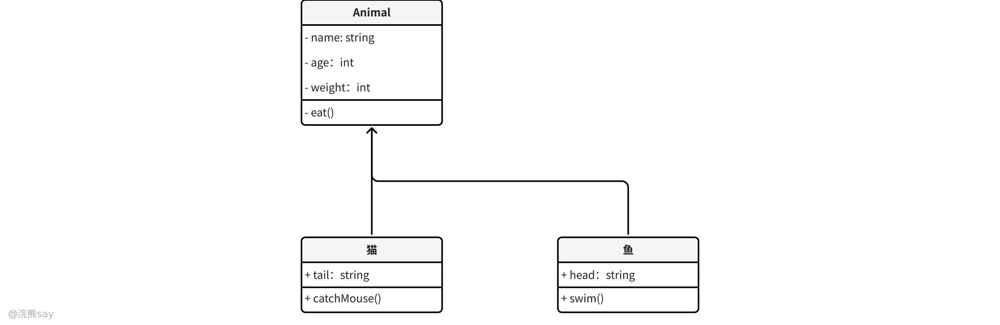

**依赖:** 就是构造这个类的时候，需要依赖其他的类，用虚箭线表示。

**继承、泛化:** 子类继承了父类的所有属性和行为。用带空心三角形的实线表示

**关联:** 两个不同类之间关联，可以单向或双向。用实箭线表示。

**聚合:** 强关联关系，是整体与部分的关系，聚合的整体和部分之间在生命周期上没有什么必然的联系，部分对象可以在整体对象创建之前创建，也可以在整体对象销毁之后销毁。用带空心菱形的实线表示。

**组合:** 强聚合，是整体与部分的关系。组合关系比聚合关系更强。它强调了整体与部分的生命周期是一致的，在组合关系中，整体与部分是不可分的，整体的生命周期结束也就意味着部分的生命周期结束。用带实心菱形的实线表示。总的来说，这几种关系所表现的强弱程度依次为:组合>聚合>关联>依赖。

### 包图

#### 什么是包图？

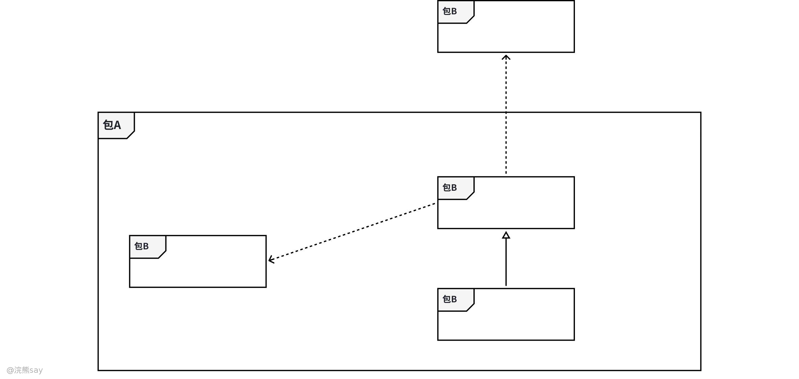

UML 包图（Package Diagram）是一种用于展示系统模块化结构的静态图，它通过 **包（Package）**对相关的模型元素（如类、接口、组件等）进行分组，并展示包之间的依赖关系。包图有助于理解系统的高层架构，简化复杂系统的视图，控制元素的可见性，并支持团队分工协作。

### 构建图

构件图用于反映代码的物理结构，描述系统中各构件、构件的提供接口与需求接口、端口及相互关系，需注意构件与类的本质区别：构件是可替换的物理抽象（如文件），类是包含属性和方法的逻辑抽象。

**构件：** 定义良好接口、可重用、可替代的物理实现单元，包括程序源代码、可执行文件、子系统、脚本、动态链接库（DLL）、ActiveX 控件等，隐藏内部实现，仅通过接口提供服务；

**接口：** 分为提供接口（导出接口，构件提供的服务集合）和需求接口（导入接口，构件请求其他服务时遵循的规范）；

**端口：** 构件或类与环境、其他类 / 构件、内部部件的交互点，通常是构件或类的属性；

### 部署图

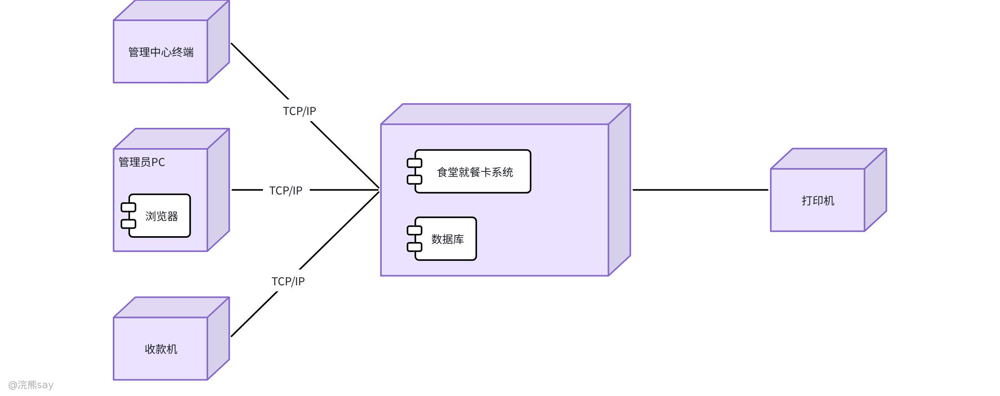

部署图描述系统资源运行时的物理分布，系统资源称为 “结点”，作为静态建模工具，它用于展示运行时过程节点结构、构件实例及对象结构。若含依赖关系的构件实例分布在不同节点，部署图可清晰呈现执行过程中的瓶颈，为系统优化提供依据。

## 动态模型

在 UML（统一建模语言）中，动态模型（Dynamic Models） 用于描述系统中元素的行为、交互过程及状态变化，关注系统在运行时的动态特性，而非静态结构。动态模型通过不同的图从多个角度展现系统的动态行为，是理解系统功能实现和业务流程的关键。

### 时序图

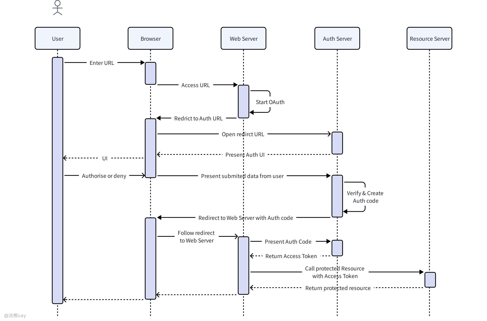

时序图是**时间维度**下对象交互的动态描述，核心呈现对象按时间顺序发送消息的完整过程，适用于拆解用例的具体实现流程，同时可排查消息顺序、对象依赖等逻辑问题。其核心构成包括：

-   **对象**：参与交互的实例，以 “对象名：类名”（如 “user: User”）标识，位于图顶部；
-   **生命线**：从对象向下延伸的虚线，表征对象在交互中的存在周期；
-   **消息**：对象间的交互指令，以带箭头线表示，含同步消息（实线箭头，如 “调用方法”）、异步消息（虚线箭头，如 “发送无需返回的通知”）及可选的返回消息（带箭头虚线）；
-   **激活期**：生命线上的矩形框，标识对象接收消息后执行操作的时间段。

示例：“用户登录” 场景中，user 对象向登录服务对象发送 “验证账号密码” 同步消息，服务对象执行验证后返回 “验证结果”，激活期同步展现双方的操作执行时段。

### 协作图

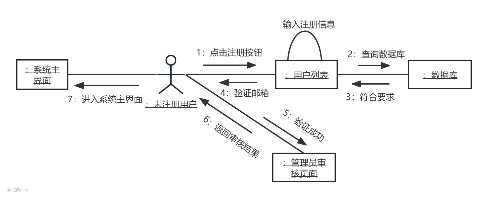

协作图

协作图与时序图语义一致，核心差异在于**以空间维度为核心**，更强调对象间的关联关系，通过消息编号体现交互顺序，适用于对象关联复杂的场景。其核心构成包括：

-   **对象**：与时序图定义一致，以矩形表示；
-   **关联**：连接对象的实线，是交互的基础；
-   **消息**：带箭头线 + 编号（如 “1. 提交账号密码”“2. 返回结果”），编号明确交互顺序。

示例：“用户登录” 协作图中，user 与登录服务通过关联线连接，消息 “1. 提交账号密码” 从 user 发送至服务，消息 “2. 验证成功” 从服务返回至 user，直观呈现对象关联与交互逻辑。

### 活动图

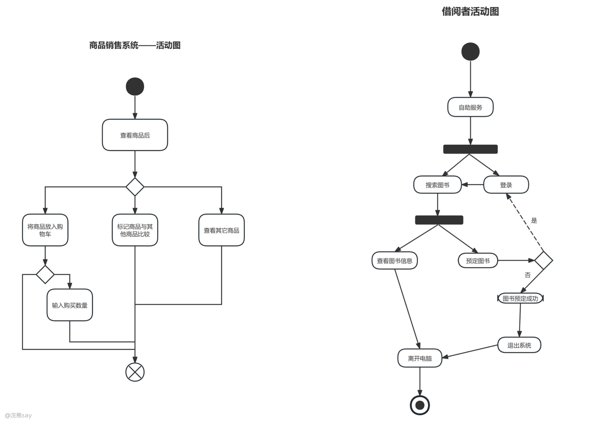

活动图用于描述业务流程或操作步骤的动态逻辑，类似流程图但更面向对象，可清晰展现活动的执行顺序、分支、合并及并行关系。其核心构成包括：​

-   **基础元素**：初始节点（实心圆）、终止节点（圆圈 + 实心圆）、活动（圆角矩形，如 “输入账号”“验证信息”）、控制流（带箭头线，表征活动间顺序）；
-   **分支与合并**：通过菱形判断节点实现，如 “验证成功？” 节点可分支为 “成功→进入系统”“失败→提示错误”，多控制流也可通过判断节点合并后进入后续活动；
-   **并行活动**：通过分叉（Fork）节点将一条控制流拆分为多条并行流（如 “下单” 后 “通知仓库” 与 “通知用户” 并行），再通过汇合（Join）节点将多条并行流合并为一条（如并行活动完成后进入 “订单完成”）。

示例：用户注册流程中，“填写表单” 后经 “信息是否完整” 判断节点分支（完整→“提交”，不完整→“提示补全”），“提交” 后通过分叉节点启动 “验证手机号” 与 “验证邮箱” 并行活动，汇合后进入 “注册成功” 终止节点。

### 状态图

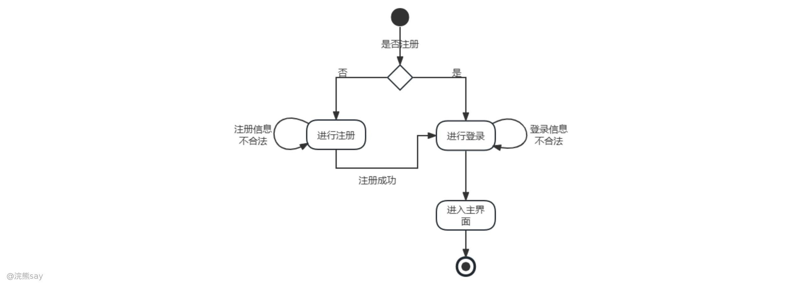

状态图聚焦**单个对象的生命周期**，描述对象因事件触发而产生的状态转换规律，适用于状态变化复杂的对象。其核心构成包括：

-   **状态**：对象某一时刻的条件，以圆角矩形表示，含初始状态（实心圆）、终止状态（圆圈 + 实心圆）及中间状态（如 “待付款”“已发货”）；
-   **转换**：状态间的切换，以带箭头线表示，标注格式为 “事件 \[条件\] / 动作”（如 “支付成功 \[金额正确\] / 生成订单号”）；
-   **事件**：触发状态转换的内外部行为（如 “点击支付按钮”“超时”）。

示例：订单状态图中，初始节点→“待付款”（事件：创建订单）；“待付款”→“已付款”（事件：用户支付）；“已付款”→“待发货”（事件：商家确认）；“待发货”→“已发货”（事件：物流揽收）；“已发货”→“已签收”（事件：用户确认收货）→终止状态，同时 “待付款” 状态下触发 “超时” 事件可转换为 “已取消”。

## 浣熊真题
| 【中国铁塔2022】UML 中有多种类型的图，其中,( )对系统的使用方式进行分类,( )显示了类及其相互关系，( )显示人或对象的活动，其方式类似于流程图，通信图显示在某种情况下对象之间发送的消息，( )与通信图类似，但强调的是顺序而不是连接。A.用例图B.类图C.活动图D.顺序图答案 ：ABCD解析 ： (1)用例图展示了用例模型，从用户使用系统的角度对系统进行了划分。 (2)类图显示了类之间的关系。 (3)活动图则和流程图类似，用于显示人或对象的活动。 (4)顺序图和通信图类似，不同点在于强调的是对象间发送消息的顺序。 |
| --- |

| 【国家电网2022】在面向对象的动态模型中，每张状态图表示（）的动态行为。A. 某一个类B. 有关联的若干类C. 一系列事件D. 一系列状态答案 ：A解析 ：在面向对象的动态模型中，状态图是描述单个类对象在其生命周期中可能经历的状态变化的图形工具，每张状态图对应一个类 |
| --- |

| 【平安保险2025】在 UML 提供的图中，（ ）用于按时间顺序描绘对象间的交互。A. 协作图B. 网络图C. 序列图D. 状态图答案 ：C解析 ：序列图（又称时序图）是时间维度上描述对象之间交互的动态图，展示对象按时间顺序发送消息的过程。时序图一般由对象、生命线和消息构成。 |
| --- |

# 面向对象分析

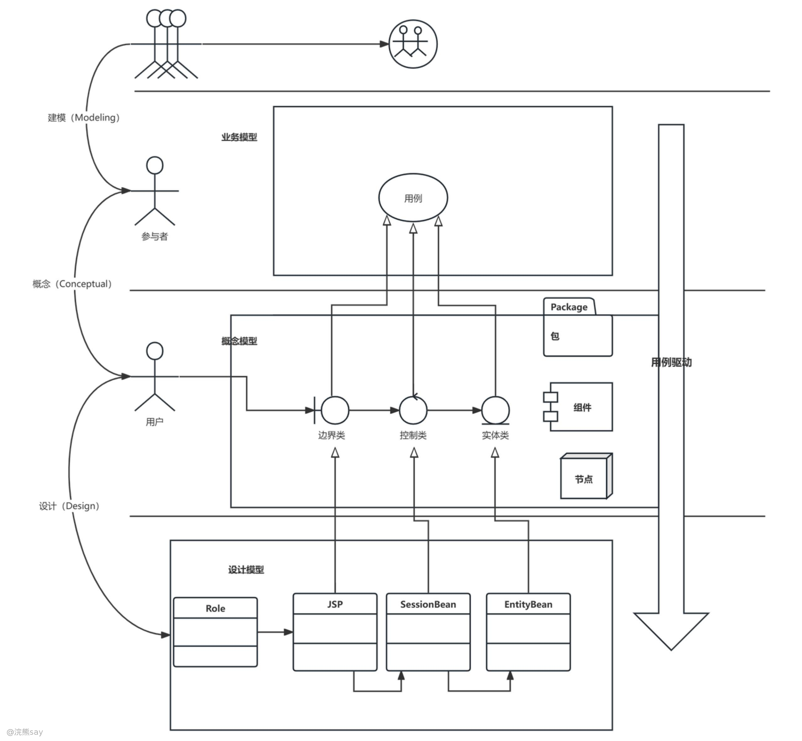

面向对象分析（OOA）的核心是将用户需求转化为清晰、可复用的面向对象模型，通过抽象、封装等思想拆解业务逻辑，为后续设计与开发奠定基础，其核心流程如下：

## 需求获取与分析

需求获取是分析的起点，需通过访谈、问卷、场景模拟、原型演示等多元方式，全面收集两类核心需求：一是**功能需求**（用户直接使用的业务场景，如 “学生选课”“成绩查询”“外卖下单”）；二是**非功能需求**（系统运行的约束条件，如 “响应时间≤2 秒”“数据加密存储”“7×24 小时稳定性”）。在此基础上，需明确**系统边界**—— 界定哪些功能属于系统核心范围，哪些依赖外部系统（如 “电商系统对接第三方支付平台”“校园系统关联教务数据库”），最终将需求整理为规范化文档（如《需求规格说明书》《用例场景集》），确保需求无歧义、可验证。

## 提取对象、类、属性与方法

这一步聚焦 “业务实体的抽象”，从需求描述中拆解核心要素：

-   **识别对象与类**：提取与业务强相关的关键实体（对象），如 “外卖系统” 中的 “用户”“商家”“餐品”“订单”“骑手”，过滤无关实体（如 “地区天气”“用户手机品牌” 等非核心信息）；再将具有相同属性、行为的对象抽象为**类**（类是对象的模板，对象是类的实例），例如 “用户” 类包含 “普通用户”“会员用户” 等对象。
-   **定义属性与方法**：为每个类明确静态特征与动态行为：
-   属性：描述类的静态数据特征，如 “餐品” 类的属性包括 “名称”“价格”“库存量”“口味”“配送范围”；“学生” 类的属性包括 “学号”“姓名”“院系”“年级”。
-   方法：描述类的动态操作行为，如 “订单” 类的方法包括 “创建订单”“取消订单”“修改收货地址”“确认收货”；“商家” 类的方法包括 “上架餐品”“修改价格”“处理退款”。

## 关系梳理

类并非孤立存在，需明确其相互作用关系，常见关联类型及说明如下：

-   **关联**：类之间的基础依赖关系，通常体现 “业务交互”，如 “用户” 与 “订单” 是 “下单” 关联（一个用户可创建多个订单，一个订单归属一个用户）；“学生” 与 “课程” 是 “选课” 关联（一个学生可选多门课程，一门课程可被多个学生选择）。
-   **继承**：类之间的 “通用 - 特殊” 关系，子类复用父类的属性与方法，同时新增特有特征，如 “会员用户” 继承 “用户” 类（复用 “姓名”“手机号” 属性），新增 “会员等级”“积分” 属性及 “积分兑换” 方法；“管理员” 继承 “用户” 类，新增 “权限管理” 方法。
-   **聚合 / 组合**：类之间的 “整体 - 部分” 关系：
-   聚合：部分可独立于整体存在，如 “订单” 由多个 “餐品” 聚合而成（订单取消后，餐品仍可在商家货架上）；
-   组合：部分与整体生命周期绑定，如 “购物车” 与 “购物车项”（购物车删除后，对应的购物车项也随之消失）。
-   **依赖**：类之间的 “临时使用” 关系，一个类的方法需借助另一个类的功能完成，如 “支付” 方法依赖 “银行卡” 类（支付时需调用银行卡的 “验证密码”“扣减金额” 功能）；“订单结算” 依赖 “优惠券” 类（结算时需调用优惠券的 “校验有效性” 功能）。

## 模型构建

通过两类模型将业务逻辑可视化，分别聚焦 “用户交互” 与 “系统运行行为”：

-   **用例模型**：以用户视角描述系统功能，核心是识别**参与者**（与系统交互的角色，如 “学生”“管理员”“商家”）和**用例**（参与者与系统的具体交互场景，如 “学生选课”“管理员添加课程”“商家处理订单”）；再用用例图展示参与者与用例的关联，明确每个用例的触发条件（如 “选课需满足课程未选满”）、执行流程（如 “提交选课申请→系统校验→确认选课成功”）及结果（如 “选课成功后更新课程剩余名额”）。
-   **动态模型**：描述系统运行时的行为交互，核心工具包括：
-   时序图：按时间顺序展示对象间的消息传递，如 “下单流程” 中 “用户→订单系统→支付系统→商家系统” 的交互顺序；
-   状态图：展示单个对象的生命周期状态变化，如 “订单” 从 “待支付”→“已支付”→“待发货”→“已发货”→“已完成” 的流转，及 “待支付” 超时转为 “已取消” 的规则；
-   活动图：描述复杂业务流程的步骤、分支与并行逻辑，如 “退款流程” 中 “用户申请退款→商家审核（通过→发起退款；不通过→驳回申请）→支付系统执行退款→通知用户” 的分支逻辑。

## 模型验证与优化

面向对象分析并非线性流程，需通过反复验证修正模型：邀请用户、领域专家、开发人员共同评审，重点检查 “需求覆盖完整性”（如是否遗漏 “优惠券使用”“退款售后” 等核心场景）、“类与关系合理性”（如是否冗余 “历史订单” 类，或遗漏 “骑手” 类与 “订单” 的关联）、“逻辑一致性”（如状态流转是否符合业务规则，方法与属性是否匹配）。根据评审反馈回溯调整，消除歧义与冗余，确保模型准确映射业务逻辑，具备可扩展性与可维护性。

## 浣熊真题
| 【国家电网2015】面向对象分析的第一步是( )。
A. 定义服务
B. 确定附加的系统约束
C. 确定问题域
D. 定义类和对象
答案 ：C
解析 ：面向对象分析的目的是理解应用问题，确定系统功能和性能。其核心步骤包括认定对象、组织对象等，而第一步是 确定问题域 ，即明确系统要解决的业务范围，后续分析需基于此展开 |
| --- |

| 【中国铁塔2021】结构化程序设计强调（）。
A. 程序的易读性
B. 程序的效率
C. 程序的规模
D. 程序的可复用性
答案 ：A
解析 ：结构化设计通过清晰的模块结构（如顺序、分支、循环）保证程序易理解、易维护，核心目标是 提高可读性 ，而非直接优化效率或规模 |
| --- |

| 【国家电网2021】在面向对象的数据模型中，每一个对象都有一个唯一的标识，称为（）。
A. 属性
B. 封装
C. 对象标识
D. 继承
答案 ：C
解析 ：对象标识（OID）是面向对象模型中对象的唯一标识符，用于区分不同实例，与属性（数据）、封装（隐藏实现）、继承（代码复用）无关 |
| --- |

| 【国家电网2021】在面向对象的系统中，对象是运行时的基本实体，对象之间通过传递（）进行通信。
A. 对象
B. 封装
C. 类
D. 消息
答案 ：D
解析 ：面向对象系统中，对象通过 消息传递 实现交互，例如“订单”对象向“支付”对象发送“扣款”消息，消息包含操作名和参数 |
| --- |
