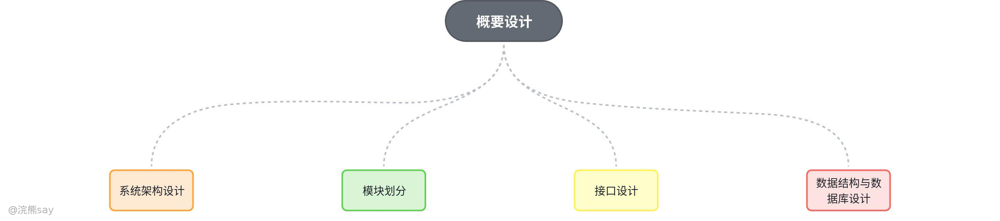
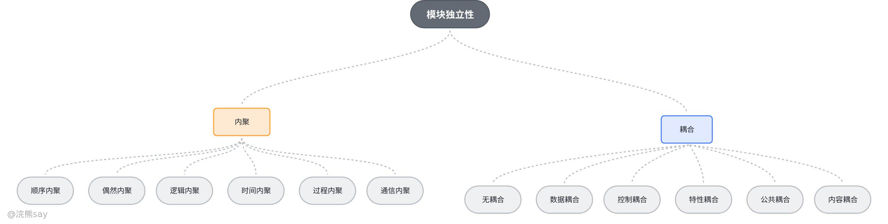
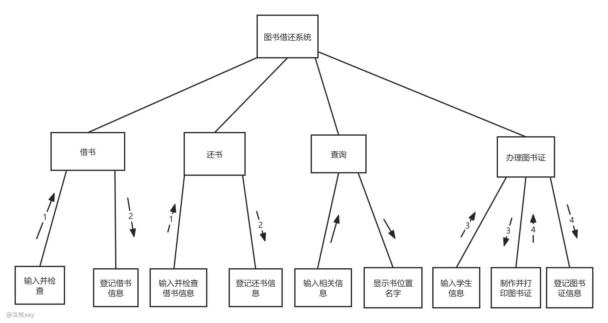
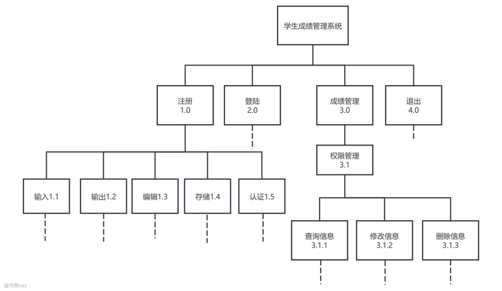
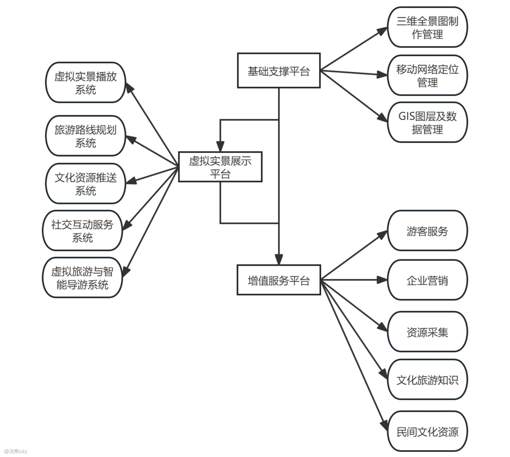
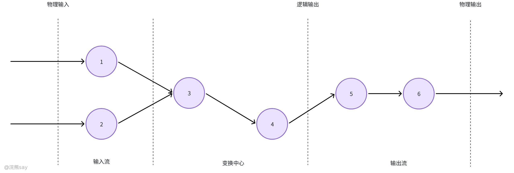
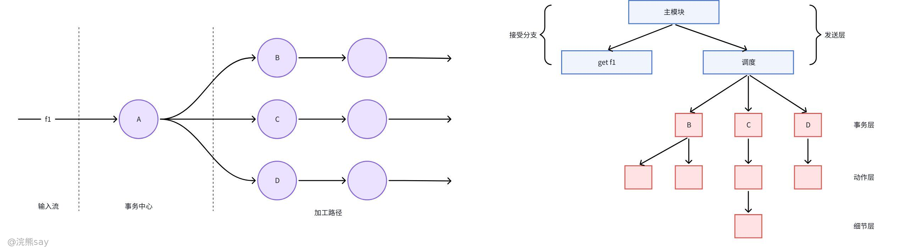
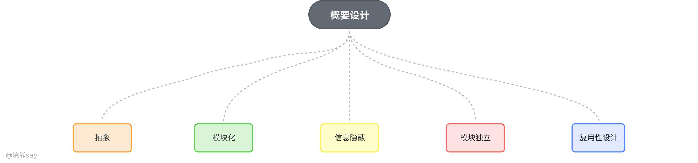
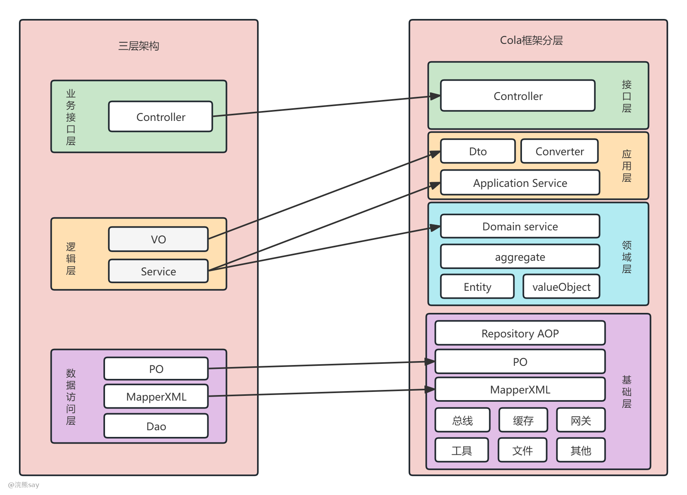
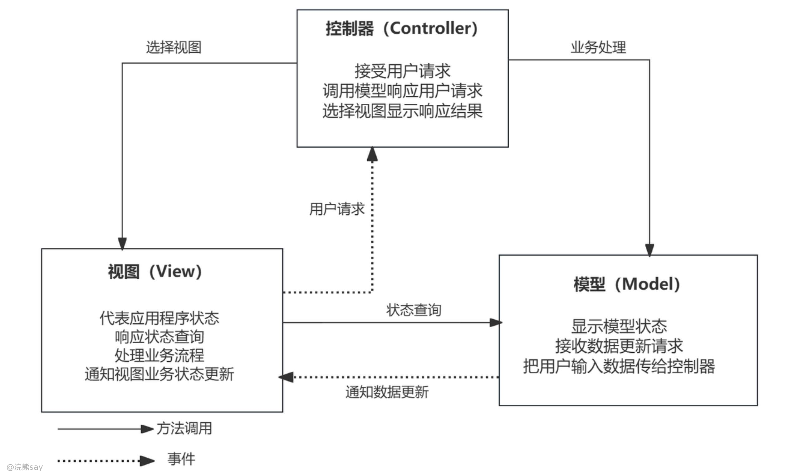

# 概要设计

## 概要设计概念

概要设计（Preliminary Design / High-Level Design）是软件工程中衔接需求分析与详细设计的核心环节，核心目标是将用户需求转化为可落地的系统架构方案，明确系统整体结构、模块划分、交互规则及技术选型，为后续开发提供清晰的顶层设计蓝图。概要设计围绕 “系统整体构建” 展开，涵盖六大核心维度，确保设计方案的完整性与可行性：​

-   **系统架构设计**：采用分层架构（如表现层、业务逻辑层、数据访问层）实现职责分离，提升可维护性与扩展性；明确各层交互方式（如表现层通过接口调用业务逻辑层，业务逻辑层访问数据访问层获取数据），定义系统总体拓扑结构。
-   **模块划分与设计**：按功能将系统拆解为独立模块（如电商系统分为用户管理、商品管理、订单管理、支付模块），明确模块间调用顺序与依赖关系（如 “订单模块” 依赖 “支付模块” 完成交易）；为每个模块设计清晰的输入 / 输出接口（如 “用户登录接口” 输入用户名密码，输出登录状态码），同时遵循 “高内聚、低耦合” 原则评估模块质量，避免过度依赖。
-   **接口设计**：包含内部接口与外部接口两类 —— 内部接口定义模块间交互协议（如 REST API、消息队列），确保参数格式、返回值规范一致；外部接口设计与第三方系统的对接方式（如支付网关、物流 API），处理数据转换与安全认证；同时规定接口错误处理机制，明确返回码（如 404 资源不存在、500 服务器内部错误）及重试策略。
-   **数据结构与数据库设计**：基于需求分析定义核心数据结构（如 “订单” 包含用户 ID、商品列表、金额等属性）；数据库设计分三步推进：概念设计用 E-R 图表示实体及关系（如 “用户” 与 “商品” 的购买关系），逻辑设计将 E-R 图转换为关系模式（创建用户表、商品表、订单表，定义主键、外键约束），物理设计优化表结构（如索引设计、分库分表），平衡读写性能与存储成本。
-   **测试计划制定**：确定测试类型（单元测试、集成测试、系统测试）与覆盖范围（重点测试支付流程、库存扣减等核心场景）；选择自动化测试工具（如 JUnit、Selenium）或手动测试方法（如边界值分析、异常处理测试）；准备模拟测试数据（如测试账号、商品信息），确保测试环境与生产环境隔离。
-   **设计文档编写**：输出概要设计说明书（概述系统架构、模块划分、接口规范、数据结构及部署方案）、数据库设计文档（记录表结构、索引设计、数据字典）、用户手册（补充操作流程、界面说明）及测试计划（细化测试用例、执行步骤及预期结果），为后续阶段提供依据。

## 概要设计原理

概要设计遵循五大核心原理，确保系统结构合理、可维护、可扩展：​

-   **抽象**：软件开发过程是对解法抽象层次的逐步细化，从需求描述到源程序代码，每个阶段都在深化抽象细节；模块化设计中，高抽象层次模块概括问题解法，低抽象层次模块则对其进行细化补充。
-   **模块化**：将复杂软件分解为小型、简单的模块（如高级语言中的过程、函数），模块可独立开发、测试，最终组装为完整程序，体现 “分而治之” 思想；模块化设计能使程序结构清晰，便于阅读、理解、测试和修改。
-   **信息隐蔽**：开发程序结构时，将可能变化的因素封装在单一模块内部，定义模块时尽量少暴露内部处理过程；当变化发生时，仅需修改对应模块，无需改动其他部分，显著提升软件的可修改性、可测试性和可移植性。
-   **模块独立**：每个模块完成相对独立的子功能，与其他模块联系简单，其独立程度通过耦合性和内聚性衡量 —— 内聚性体现模块内部元素结合的紧密程度，耦合性体现模块间连接的紧密程度，设计需追求 “高内聚、低耦合”。
-   **复用性设计**：软件开发无需从零开始，可直接使用或修改已有软构件（包括代码、需求模型、设计文档、测试用例等）组装新系统；软件复用能提高开发效率，且经多次验证的软构件可提升新系统质量。

## 模块独立性

模块独立性是软件工程中的核心原则，指软件系统中各个模块在功能、数据和代码实现上保持相对独立的特性。它通过**内聚**和**耦合**两个维度衡量：

-   **内聚（Cohesion）**：指模块内部各元素之间的功能相关性，高内聚意味着模块仅完成单一清晰的任务，如用户认证模块仅负责身份验证，避免掺杂日志记录、权限分配等其他功能。常见内聚类型从低到高包括**偶然内聚**（元素随机组合）、**逻辑内聚**（相似功能聚合）、**功能内聚**（最高等级，所有元素服务于同一目标）。
-   **耦合（Coupling）**：描述模块间的依赖程度，低耦合表示模块间联系松散，修改一个模块不易影响其他模块。例如，使用消息队列实现模块通信，而非直接调用代码，可降低耦合度。耦合类型从高到低包括**内容耦合**（模块直接操作对方内部数据）、**控制耦合**（模块间传递控制信号）、**数据耦合**（仅传递必要数据，理想状态）。

保持高内聚、低耦合的模块设计，可显著提升软件的**可维护性**（单个模块修改不影响全局）、**可扩展性**（新增功能只需添加或修改独立模块）和**可复用性**（模块可独立应用于其他项目），是系统稳健架构的基石。

### 什么是内聚？

内聚（Cohesion）是软件工程领域用于衡量 **模块内部各元素结合紧密程度** 的重要指标。它反映了模块功能的专一性与完整性，高内聚意味着模块功能明确、独立性强，更易于维护和复用；低内聚则表示模块功能混杂，存在冗余或不必要的耦合。根据内聚程度从低到高，可将其分为以下七种类型：

-   **偶然内聚**：模块内各处理元素无任何逻辑联系，仅是因偶然因素组合在一起，是内聚程度最低的类型；
-   **逻辑内聚**：模块执行多个逻辑相似的功能，通过参数确定具体执行内容，如一个模块同时处理 “文件读取”“数据校验”“日志记录” 等相关但不相同的操作；
-   **时间内聚**：将需同时执行的动作组合为模块，各部分在同一时间完成，例如初始化模块在系统启动时同时执行资源加载、配置读取等操作；
-   **过程内聚**：模块内部处理步骤相关联，且需按特定次序执行，常见于包含一系列连续操作流程的模块；
-   **通信内聚**：模块内所有处理元素操作同一数据结构、使用相同输入或产生相同输出，例如对用户信息进行 “查询、修改、删除” 的模块；
-   **顺序内聚**：各处理元素围绕同一功能，需顺序执行，前一元素的输出作为后一元素的输入，形成流水线式的处理逻辑；
-   **功能内聚**：最强内聚形式，模块内所有元素共同完成一个核心功能，缺一不可且无法分割，例如 “用户身份认证” 模块仅专注于验证用户身份，不包含其他无关操作。

**设计原则**：在软件架构设计中，应优先追求功能内聚，识别并重构低内聚模块。当内聚性与耦合性出现冲突时，可优先保证内聚性，后续再逐步优化模块间的耦合关系，以实现高内聚、低耦合的理想架构。

### 什么是耦合？

耦合是在软件工程中用于衡量模块间关联程度的重要概念，它反映了模块之间相互联系的紧密程度。在系统设计中，不同类型的耦合会对系统的可维护性、可扩展性产生不同影响。根据关联紧密程度从低到高，耦合可分为以下六类：

-   **无直接耦合**：两个模块不存在直接关联，它们分属于不同的控制与调用链，彼此之间不传递任何信息。这种情况下，模块独立性最强，一个模块的修改基本不会影响到另一个模块 。
-   **数据耦合**：模块之间存在调用关系，调用时仅传递简单数据值（类似于编程语言中的值传递）。数据耦合的耦合程度较低，模块具有较高的独立性，是较为理想的耦合方式 。
-   **控制耦合**：调用模块向被调用模块传递控制变量，被调用模块根据该变量的值选择性地执行特定功能。控制耦合使模块间的联系比数据耦合更紧密，降低了模块的独立性 。
-   **特征耦合**：模块之间传递数据结构，但接收数据结构的目标模块仅使用其中的部分内容。这种耦合方式由于传递了不必要的整体数据结构，增加了模块间的依赖 。
-   **公共耦合**：多个模块通过公共数据环境（如全程变量、共享通信区、文件等）实现相互作用。公共耦合会导致模块间的关系变得复杂，一个模块对公共数据的修改可能影响到其他多个模块，增加系统维护难度 。
-   **内容耦合**：一个模块直接使用另一个模块的内部数据，或者通过非正常入口转入另一个模块的内部执行。内容耦合的耦合程度最高，极大地破坏了模块的封装性和独立性，会给系统的维护和调试带来极大困难 。

在进行软件设计时，应遵循以下原则：优先采用数据耦合方式，尽量减少控制耦合与特征耦合的使用，严格限制公共耦合的作用范围，同时必须完全避免出现内容耦合的情况，以此提升系统的稳定性和可维护性。

## 软件结构设计工具

### 层次图（H图）

层次图

层次图是软件架构设计的核心可视化工具，层次图通过结构化的布局直观展现系统模块间的调用关系与层级依赖，特别适用于自顶向下的模块化设计方法论。在图示表达上，以矩形框代表独立功能模块，通过简洁的连线明确模块间调用方向；箭头指向表示调用发起方，反向箭头则代表响应或返回关系。这种设计使得开发团队能快速识别核心控制模块、子功能组件及其交互逻辑，尤其在大型系统设计中，可有效避免模块间调用关系混乱，辅助架构师完成系统层级划分与职责分配。此外，结合功能需求文档，H 图还能用于评估设计方案的可扩展性与维护性，通过层级深度与模块耦合度分析，优化系统架构设计。

### HIPO 图

**HIPO 图是**作为结构化设计中重要的文档化工具，HIPO 图（Hierarchy plus Input-Process-Output）由层次图（H 图）与每个模块的 IPO 图（输入 - 处理 - 输出图）有机结合而成。在 H 图中，通过树状结构直观展示系统的模块层级划分与模块间的调用关系，能够帮助设计者与开发团队快速把握系统整体架构脉络；而 IPO 图则以表格形式，针对 H 图中的每个模块，详细标注输入数据的来源与格式、内部处理逻辑（包括算法步骤、数据转换规则等）、输出结果的形式与去向，实现 “整体结构 + 局部细节” 的完整呈现。通过二者相辅相成，HIPO 图既能为系统设计提供宏观指导，又能在微观层面明确模块的具体实现要求，有效保障设计文档的完整性与可执行性 。

### 软件结构图

**软件结构图（SC 图）**是一种精确表达软件结构的图形工具，通过特定的符号规范，能清晰呈现软件系统中模块、调用关系及信息传递。在软件结构图中，**矩形框表示模块**，直观展现系统的各个组成部分；模块间的箭头表示调用关系，箭头方向由调用模块指向被调用模块，清晰体现模块之间的依赖和交互；模块间传递的信息则会标注在箭头旁，帮助开发者明确数据的流向和处理逻辑 。软件结构图是软件开发过程中从需求分析过渡到系统设计阶段的重要工具，能帮助团队成员更好地理解系统架构，协调开发工作，确保系统开发符合预期设计目标。

## 真题
| 【国家电网2021】以下关于耦合的描述中，正确的是（ ）。A. 耦合是指模块内部各元素之间联系的紧密程度B. 耦合是指模块之间联系的紧密程度C. 耦合是指模块内部各元素之间没有联系D. 耦合是指模块之间没有联系答案 ：B解析 ：耦合是指模块之间联系的紧密程度。耦合度越高，说明模块之间的联系越紧密，模块的独立性也越低。耦合度的高低是衡量模块独立性的一个重要指标。 |
| --- |

| 【国家电网2016】以下关于模块独立性的描述中，正确的是（ ）。A. 模块独立性是指每个模块只完成一个相对独立的特定子功能，并且与其他模块之间的联系简单 B. 模块独立性是指每个模块只完成一个相对独立的特定子功能，并且与其他模块之间没有联系 C. 模块独立性是指每个模块完成多个相对独立的特定子功能，并且与其他模块之间的联系简单 D. 模块独立性是指每个模块完成多个相对独立的特定子功能，并且与其他模块之间没有联系答案 ：A解析 ：模块独立性是指每个模块只完成一个相对独立的 |
| --- |

# 结构化设计

结构化设计（Structured Design，简称 SD 方法）是软件工程中经典的设计方法，核心以数据流为驱动，通过标准化的映射规则将需求阶段的数据流图（DFD）转化为清晰、可维护的软件结构，最终实现 “高内聚、低耦合” 的模块设计目标。

## 结构化设计方法

### 基本思想

结构化设计方法的核心是**基于数据流的映射转换**：任何软件系统的业务逻辑均可通过数据流图（DFD）描述，SD 方法定义了一套标准化的 “映射规则”，能够将数据流图精准转化为软件结构图（SC）。这种方法的通用性极强，从理论上可适用于各类软件的结构设计，其核心目标是通过结构化分解，让软件结构清晰、模块独立、易于实现与维护。

### 数据流图的两类映射方式

数据流图（DFD）主要分为变换型和事务型两类，SD 方法针对不同类型提供了对应的映射策略，最终均需结合模块独立性原则对初始软件结构图进行精化优化：​

-   变换型数据流图：通过 “变换分析” 转换为初始软件结构图；
-   事务型数据流图：通过 “事务分析” 转换为初始软件结构图；
-   精化优化：对初始软件结构图进行模块合并、分解、调整，确保模块满足高内聚、低耦合要求，形成最终可落地的软件结构，并输出至设计文档。

### 变换型数据流图映射方法

变换型数据流图的核心特征是包含**输入、变换中心、输出**三部分，数据处理流程遵循 “取得数据→变换加工→输出数据” 的逻辑，其映射步骤如下：

1.  界定边界：在数据流图上明确划分输入部分（数据采集与预处理）、变换中心（核心业务逻辑处理）、输出部分（数据展示或传递）的分界线；
2.  一级分解（搭建框架）：设计顶层模块与第一层模块 —— 为每个逻辑输入设计专属输入模块（功能：向顶层模块提供标准化数据），为每个逻辑输出设计专属输出模块（功能：输出顶层模块处理后的信息），为变换中心设计核心变换模块（功能：对输入数据执行核心加工）；
3.  二级分解（细化分支）：采用自顶向下的方式，逐层分解各分支模块，设计中层、下层功能模块，明确模块间的调用关系与数据传递路径。

### 事务型数据流图映射方法

事务型数据流图的核心特征是存在一个**事务中心**，数据沿输入通路到达事务中心后，会根据数据类型从多个动作序列中选择一个执行，数据流呈束状分布，其映射步骤如下：

1.  识别核心组件：在数据流图上确定事务中心（核心决策与分发模块）、接收部分（数据接收与初步校验）、发送部分（不同类型的动作执行序列）；
2.  搭建框架：将三部分分别映射为软件结构图中的事务控制模块（核心：分发任务）、接收模块（功能：接收并预处理输入数据）、动作发送模块（功能：执行具体的动作序列）；
3.  细化分支：对接收分支和发送分支进行逐层分解，补充中层、下层模块，明确各模块的职责与交互关系，形成完整的初始软件结构图。

## 结构化设计步骤

1.  确定系统主功能：从需求分析结果中提炼核心业务功能与流程，明确系统的核心价值链路（如在线购物系统的主功能：商品浏览→下单→支付→物流跟踪）；
2.  DFD 映射为初始模块结构图（MSD）：

    -   变换型 DFD：按 “输入→业务逻辑→数据库操作” 的层级划分模块层，搭建初始结构；
    -   事务型 DFD：以事务中心为顶层核心，向下展开各分支处理模块（如订单处理系统中，事务中心按 “订单创建”“订单修改”“订单取消” 拆分分支模块）；

1.  优化模块结构：

    -   精简冗余：删除功能重复的冗余模块，合并逻辑相似的模块（如 “用户注册” 与 “用户信息修改” 模块复用 “用户信息验证” 子模块）；
    -   降低复杂度：对扇出过高的模块（调用过多子模块）进行拆分，将子功能独立为专属模块，避免单个模块职责过重；

1.  定义模块接口：明确每个模块的输入参数（数据类型、格式要求）、返回值（结果数据、状态标识），例如 “登录模块” 返回格式为 {code: 200, token: "xxx"}；同时设计统一的错误处理机制，如参数校验失败返回特定错误码、系统异常返回统一提示等；
2.  设计数据结构：基于数据流图中的数据流特征，设计模块内部使用的局部数据结构（如 “购物车” 模块用数组存储商品 ID、数量、单价等信息）与模块间共享的数据结构；确保数据结构设计与数据库模型同步，匹配模块处理逻辑，避免数据冗余或格式不兼容。

## 真题
| 【中国铁塔2021】结构化程序设计强调（）。
A. 程序的易读性
B. 程序的效率
C. 程序的规模
D. 程序的可复用性
答案 ：A
解析 ：结构化程序设计的目的：通过设计结构良好的程序，以程序静态的良好的结构保证程序动态执行的正确性，使程序易理解、易调试、易维护，以提高软件开发的效率，减少出错率。 |
| --- |

## 面向对象设计

面向对象设计（Object-Oriented Design，简称 OOD）是在面向对象分析（OOA）的基础上，将分析模型转化为可落地的软件设计方案的核心环节。其核心目标是遵循面向对象思想，设计出高内聚、低耦合、可重用、易维护的系统架构与类结构，为编码实现提供清晰蓝图。

## 面向对象设计准则

面向对象设计需遵循六大核心准则，确保系统结构合理、功能高效、易于扩展：​

**模块化**：以 “对象” 作为核心模块单元，每个对象封装了特定的数据结构（属性）与操作这些数据的方法（行为），形成 “数据 + 行为” 的紧密结合体，使模块边界清晰、职责单一。

**抽象**：全面支持过程抽象（提炼同类操作的共性逻辑）、数据抽象（封装对象的核心数据特征）与参数化抽象（通过参数灵活适配不同场景），简化复杂逻辑的表达，提升设计的通用性。

**信息隐藏**：通过类的结构设计实现 “接口与实现分离”—— 类对外暴露统一的调用接口，隐藏内部数据存储、方法实现细节，仅通过接口与其他对象交互。这种方式降低了对象间的依赖，当内部实现变更时，无需修改外部调用逻辑。

**弱耦合**：耦合度衡量不同对象间关联的紧密程度，设计需尽可能降低不必要的耦合，具体分为两类：

-   交互耦合：对象间通过消息传递实现交互，设计时需简化消息连接的复杂度、减少消息发送数量，使交互逻辑松散灵活；
-   继承耦合：父类与子类通过继承形成的耦合，这类耦合需保证紧密性，确保子类能充分复用父类的属性与方法，符合 “通用 - 特殊” 的逻辑关系。

**强内聚**：内聚性体现构件内部元素对完成特定目标的贡献程度，面向对象设计中需实现三类高内聚：

-   服务内聚：每个方法（服务）仅专注完成一个明确功能，避免 “一个方法多职责”；
-   类内聚：每个类有清晰的核心用途，其属性与服务均为实现该用途所必需，若类存在多用途，应拆分为多个专用类；
-   一般 - 特殊内聚：继承关系（一般类 - 特殊类）需准确反映领域知识，确保子类对父类的扩展合理、逻辑连贯。

**可重用**：重用是面向对象设计的核心优势之一，包含两方面含义：一是优先复用已有的成熟类（如开源组件、项目内通用类）；二是设计新类时，需考虑其协议（接口）的通用性，为后续复用预留空间。软件成分的重用范围覆盖代码、分析结果、设计结果等多个层面。

## 系统架构设计

软件系统架构是系统主要组成元素的组织方式、全局性决策及元素间的交互规则，其设计结果会影响整个系统的实现与扩展。面向对象设计中的系统架构设计包含六大核心活动：​

1.  **系统高层结构设计**：基于需求模型与分析模型，选择适配的软件架构模式（如层次架构、MVC），搭建系统的顶层组织结构，明确核心组成部分的划分与定位。
2.  **确定设计元素**：识别并定义核心设计类与子系统，将设计类按功能或业务维度组织到对应包中；为子系统设计统一接口，明确对外交互规则；同时挖掘复用机会，整合通用功能为可复用构件。
3.  **确定任务管理策略**：针对多用户、高并发的复杂系统，制定任务调度、并发控制策略，解决任务冲突、性能瓶颈等问题（如通过线程池管理并发任务、采用锁机制避免数据竞争）。
4.  **实现分布式机制**：若系统构件部署在不同服务器上，需选择支持远程通信的技术（如 RPC、REST API），设计统一的跨服务器通信方案，确保分布式环境下的数据一致性与交互稳定性。
5.  **设计数据存储方案**：根据选用的数据库管理系统（如 MySQL、MongoDB），选择适配的数据库访问构件（如 ORM 框架），设计对象数据与数据库表的映射规则，明确数据的存储、读取、修改、删除等操作方法，兼顾存储性能与数据安全性。
6.  **人机界面设计**：遵循统一的界面规范与用户体验要求，确定界面实现的技术基础（如 Web 端 Vue、移动端 Flutter）与工具，设计界面组件的布局、交互逻辑，确保界面直观、易用、风格统一。

所有设计活动需严格遵循系统架构设计文档，确保各设计元素的交互逻辑与全局架构保持一致。

## 典型设计架构

面向对象设计常用的架构模式有，层次架构、模型 - 视图 - 控制架构（model-view-control，MVC）、管道与过滤器架构（pipes and filters）、黑板架构（blackboard）等。

三层架构到四层架构的演进

**三层架构**：适用于中小型系统，通过分层实现职责分离，便于维护与扩展：

-   表示层：直接面向用户的界面层，负责界面展示与用户交互（如表单、网页、移动端界面）；
-   业务逻辑层：核心处理层，针对具体业务场景实现逻辑运算、规则校验等功能（如订单结算、用户权限验证）；
-   数据访问层：与数据库交互的底层，负责数据的增删改查操作，屏蔽数据库实现细节，为业务逻辑层提供数据支持。

**四层架构**：针对中型或大型复杂系统，在三层架构基础上细化分层，提升复用性与扩展性：

-   应用子系统层：包含系统特有的业务服务（如电商系统的 “订单管理子系统”“支付子系统”）；
-   业务专用层：封装多个应用子系统共用的业务构件（如 “用户认证”“日志记录” 构件）；
-   中间件层：提供通用复用构件，包括 GUI 构建器、数据库接口、跨平台操作系统服务、OLE 构件（如电子表格、图表编辑器）等；
-   系统软件层：底层支撑层，包含操作系统、数据库管理系统、硬件接口、设备驱动程序等。

**MVC 架构**：适用于需要分离界面与业务逻辑的系统（如 Web 应用、移动端应用），核心是解耦视图、控制器与模型：

-   视图（View）：负责界面显示与用户交互，接收用户操作请求（如点击按钮、提交表单），并展示模型返回的处理结果；
-   控制器（Controller）：充当 “分发器”，接收视图传递的请求，根据请求类型选择对应的模型进行处理，同时指定处理完成后跳转的视图，实现视图与模型的解耦；
-   模型（Model）：封装系统的核心数据、状态与业务逻辑，接收控制器的请求并执行相应处理（如数据计算、数据库操作），返回处理结果给控制器。

## 真题
| 【国家电网2021】在面向对象的数据模型中，每一个对象都有一个唯一的标识，称为（ ）。
A. 属性
B. 封装
C. 对象标识
D. 继承
答案 ：C
解析 ：对象标识（OID）是面向对象模型中对象的唯一标识符，用于区分不同实例，与属性（数据）、封装（隐藏实现）、继承（代码复用）无关。 |
| --- |

| 【中国铁塔2019】下面关于类和对象的描述中，错误的是：
A. 类就是 C 语言中的结构体类型，对象就是 C 语言中的结构体变量
B. 类和对象之间的关系是抽象和具体的关系
C. 对象是类的实例，一个对象必须属于一个已知的类
D. 类是具有共同行为的若干对象的统一描述体
答案 ：A
解析 ：类与 C 语言的结构体有本质区别，结构体仅包含数据（属性），而类还包含方法（行为），且支持封装、继承、多态等特性 |
| --- |

| 【中电28所】以下哪些属于面向对象编程的特性？（ ）
A. 封装
B. 继承
C. 多态
D. 抽象
答案 ：ABCD
解析 ：封装将数据和操作封装在一起；继承实现代码复用；多态允许不同对象对同一消息产生不同响应；抽象提取共同特征形成抽象类或接口。 |
| --- |
