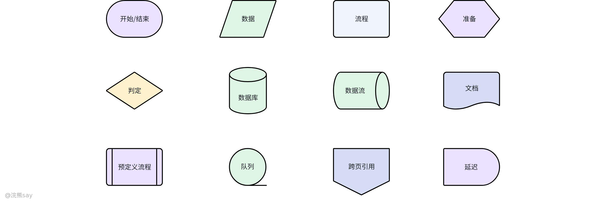
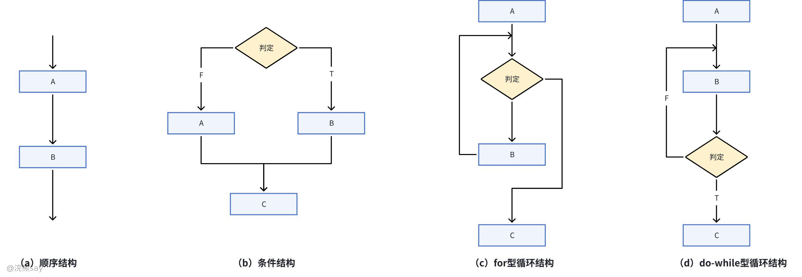
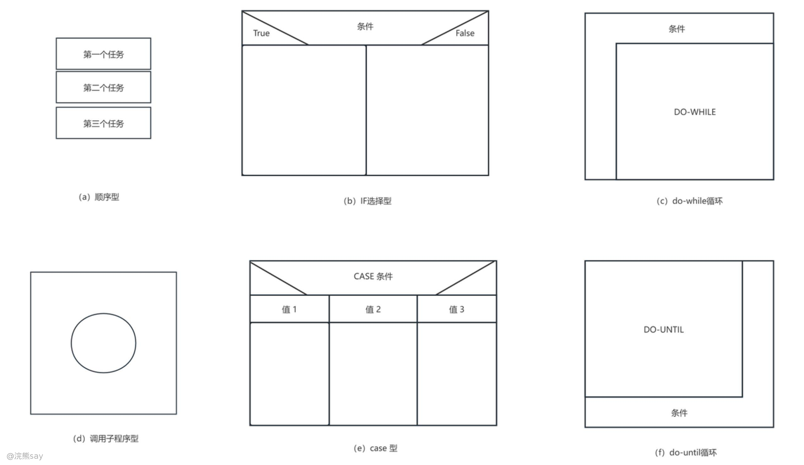
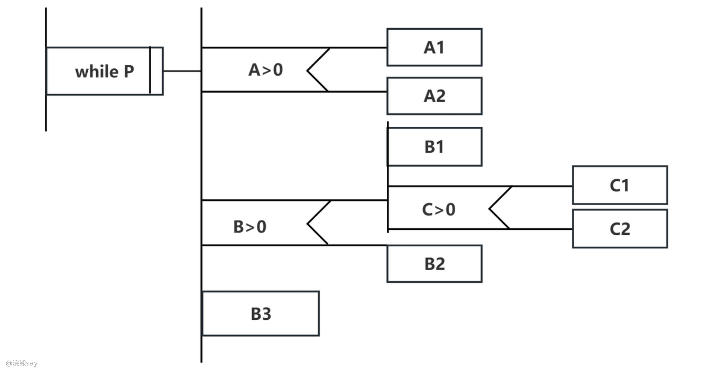
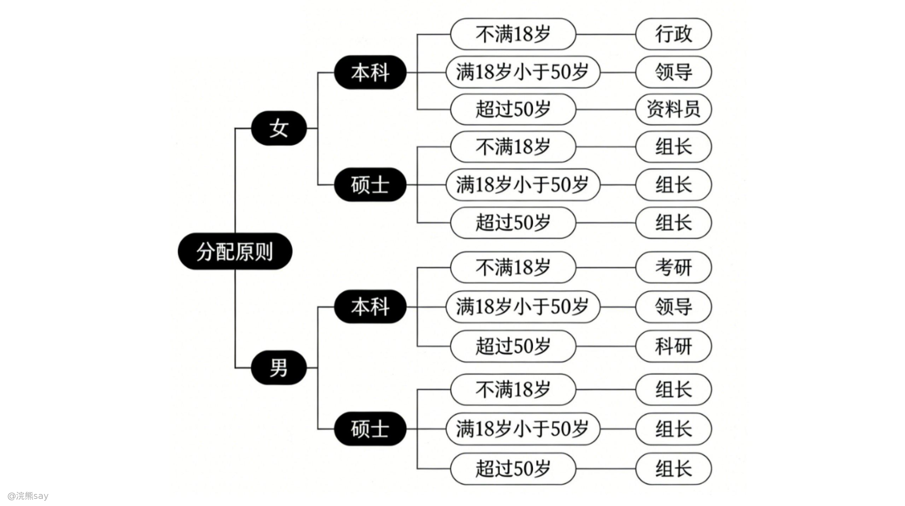

# 详细设计

详细设计是软件工程中衔接概要设计与编码实现的关键环节，核心聚焦 “如何具体实现系统”，通过明确模块执行流程、数据结构、算法逻辑等细节，为开发人员提供可直接落地的程序蓝图，其设计质量直接决定代码的可读性、可维护性与性能表现。

## 什么是详细设计？

详细设计又称 “过程设计”，根本目标是明确系统各模块的具体执行逻辑，制定程序实现的详细 “蓝图”。需重点区分的是，详细设计并非直接编写程序代码，而是通过标准化工具与规范，将模块功能转化为清晰、可执行的设计方案，其结果直接影响最终程序代码的质量 —— 包括逻辑正确性、性能效率、可扩展性等核心指标。

## 详细设计的任务是什么？

1.  **数据结构设计**：对需求分析、概要设计阶段定义的概念性数据类型进行精准落地，明确数据的存储格式、字段约束、关联关系（如结构体、类的属性细化、数据库字段的具体类型定义）；
2.  **算法设计**：为每个模块设计详细的执行算法，通过图形、表格、伪代码等工具描述处理流程，同时评估算法的时间复杂度、空间复杂度，确保满足性能要求；
3.  **性能设计**：针对系统周转时间、响应速度、吞吐量、计算精度等性能指标，优化模块间控制方式与算法逻辑（如高并发场景下的异步处理、大数据量下的分批次处理）；
4.  **物理设计**：聚焦数据库的物理实现，确定数据的存储结构（如数据表分区、索引类型）、存取方法（如查询优化策略、缓存机制），平衡存储效率与访问性能；
5.  **配套设计**：包括代码设计（编码规范、命名规则）、模块接口设计（输入 / 输出参数、异常处理机制）、用户界面设计（交互细节、反馈逻辑）、测试用例设计（单元测试、接口测试场景）；
6.  **文档编写与评审**：输出《详细设计说明书》，涵盖软件结构图表、模块算法描述、输入输出项、外部接口等内容；组织技术评审，重点核查算法逻辑的正确性、数据库物理结构的合理性。

## 详细设计的方法有哪些？

详细设计作为软件生命周期中承上启下的关键环节，其实施过程需严格遵循系统化方法论与设计准则，以保障设计成果具备逻辑严密性、工程可行性与知识可传递性。

详细设计包含三大核心设计准则。其一，在确保程序语义正确性与运行稳定性的基础上，着重强化算法逻辑与代码结构的可读性，以提升系统的可维护性与可扩展性；其二，采用结构化设计范式作为核心技术框架，通过模块化分解与层次化组织构建规范的程序控制流程；其三，运用标准化建模工具对模块级算法进行形式化描述，确保设计意图在不同开发阶段的精准传递与完整复现。同时，详细设计包含两类主流设计方法论：

1.  **结构化程序设计（Structured Programming, SP）**：基于 "顺序"" 选择 ""循环" 三种基本控制结构，通过组合嵌套构建具有单入口 - 单出口特性的程序逻辑体系。该方法通过自顶向下、逐步求精的设计策略，将复杂系统分解为层次化模块，形成清晰的程序执行流程，是构建过程式软件系统的经典设计范式。
2.  **面向对象设计（Object-Oriented Design, OOD）**：该方法遵循模块化、抽象化与信息隐藏原则，将设计过程划分为系统架构设计与对象模型精化两个阶段。核心工作包括：对系统对象模型进行迭代优化，完成类成员函数的算法实现与接口设计，构建类间关联关系网络，并通过设计模式应用实现系统性能优化。代表性方法包括 Coad-Yourdon 方法、Booch 方法及对象建模技术（OMT）等，通过统一建模语言（UML）实现设计成果的可视化表达与标准化管理。

# 结构化设计

## 什么是结构化设计？

结构化设计的核心是构建 “结构化程序”—— 即程序代码块仅通过顺序、选择、循环三种基本控制结构连接，且每个代码块仅有一个入口和一个出口。设计中应尽可能避免使用 GOTO 语句，仅在错误检测等特殊场景有限使用，且需采用前向 GOTO 语句。需明确的是，结构化程序设计的本质并非 “禁止 GOTO 语句”，而是通过规范控制结构，使程序代码易于阅读、理解与维护。

## 结构化设计的方法

-   **自顶向下**：设计时先明确全局目标与总体流程，再逐步拆解为局部细节；优先搭建顶层框架，再逐层细化各模块的具体功能，避免过早陷入细节设计。
-   **逐步求精**：针对复杂问题，设置中间子目标作为过渡，将大问题分解为多个可解决的小问题，逐步细化解决方案，降低设计难度。
-   **模块化**：将大型程序按功能拆分为独立的功能模块，模块间通过明确接口交互，同时按层次关系组织模块（如顶层模块调用中层模块，中层模块调用底层模块），实现 “分而治之”。
-   **结构化编码**：严格使用顺序、选择、重复三种基本控制结构构造程序，确保每个结构单入口、单出口，使程序逻辑线性化、易追踪。

## 面向数据结构的设计方法

面向数据结构的设计方法聚焦 “程序处理过程的设计”，与面向数据流的设计方法（用于构建软件结构）形成互补，其核心目标是得出模块内部具体的程序处理描述。该方法的本质是以信息对象及其操作为核心，认为复合信息对象具有明确的层次结构，这种结构可分解为多种基础结构对象，最终能直接映射为程序结构，实现数据结构与程序结构的统一。面向数据结构的设计方法中，最具代表性的是 Jackson 方法与 Warnier 方法，二者原理相通但细节存在差异：​

-   **Jackson 方法**：定义了一套以数据结构为导向的映射流程，核心思路是从目标系统的输入、输出数据结构入手，导出程序的框架结构，再补充算法细节、异常处理等内容，形成完整的程序结构图。该方法适用于输入、输出数据结构清晰明确的中小型系统，优势是流程直观、映射关系简单。
-   **Warnier 方法**：与 Jackson 方法核心原理一致，但逻辑更严谨，主要差异体现在三方面：一是使用的图形工具不同（Warnier 图 vs Jackson 图）；二是配套的伪码规范不同；三是构造程序框架时，Warnier 方法仅基于输入数据结构推导，而 Jackson 方法同时结合输入与输出数据结构进行设计。

# 结构化设计工具

## 什么是结构化设计工具？

结构化设计工具属于过程设计工具的范畴，它是专门用于描述程序处理过程的标准化工具。这类工具的核心要求是**无歧义性**，即必须清晰、明确地指明控制流程、处理功能、数据组织及其他实现细节。如此一来，开发人员在编码阶段能够直接将设计描述翻译为程序代码，无需进行额外的解读与猜测，从而有效保障程序开发的准确性与一致性 。结构化设计工具按表现形式可分为三大类：图形类、表格类、语言类。

-   **图形类**：包括程序流程图、盒图（N-S 图）、PAD 图等。程序流程图以直观的图形符号展现程序执行流程；盒图强调程序的结构化，用方盒表示不同的程序模块；PAD 图则采用二维树形结构，清晰呈现程序逻辑。
-   **表格类**：如判定表，通过表格形式列出条件组合与对应的操作，适合描述复杂的条件判断逻辑。
-   **语言类**：典型的如 PDL 伪代码，以接近自然语言和编程语言的方式描述程序逻辑，便于理解与转换为实际代码。

这些常用工具适用于不同场景，在实际应用中，需要根据设计复杂度、团队习惯等因素合理选择，以充分发挥结构化设计工具在软件开发过程中的作用。

## 程序流程图

程序流程图是用统一标准符号描述程序运行步骤的图形工具，它在处理流程图基础上，进一步细化输入输出数据与处理过程，清晰呈现计算机核心运行步骤，是软件开发过程中重要的可视化表达手段。



程序流程图中涵盖起止端点、处理步骤、条件判断、数据输入输出、文件 / 文档、控制流、循环边界、并行方式、注解等标准化符号，通过符号组合表达程序逻辑；的**支持结构**：可表示顺序、选择、循环三种基本控制结构，也能兼容非结构化逻辑；



程序流程图的优势是控制流程描绘直观，上手门槛低；劣势是无法支持逐步求精，可理解性随逻辑复杂度下降，允许随意转移控制（违背结构化设计原则），且难以清晰表示数据结构。

## 盒图（NS图）



盒图以矩形框为基本单元，通过矩形框的嵌套与组装来表达算法逻辑，是专为结构化程序设计打造的图形工具，其设计特性决定了它天然不支持非结构化程序的描述。盒图可完整覆盖顺序型、选择型、CASE 型多分支、循环型（DO-UNTIL、DO-WHILE）、调用子程序型等各类结构化结构，通过矩形框的层级嵌套直观呈现逻辑关系，让复杂的逻辑层级一目了然。其核心优势在于无法任意转移控制流程，能够强制设计人员遵循结构化设计原则，从根源上避免非结构化逻辑的产生；同时，盒图中特定控制结构的作用域（即功能域）界定清晰，便于设计人员和开发人员快速区分局部数据与全程数据的作用范围，减少因数据作用域模糊导致的逻辑错误；此外，矩形框的嵌套关系能够清晰展现模块的层次结构，让复杂逻辑的层级关系变得直观易懂，大幅降低了逻辑理解与沟通的成本。

## PAD 图



PAD 图采用二维树形结构来表示程序的控制流，控制流程严格遵循 “自上而下、从左到右” 的执行规则，既保留了图形工具的直观性，又具备逻辑描述的严谨性，是结构化设计中兼具易用性与专业性的工具。PAD 图的核心符号涵盖顺序、选择、while 型循环、until 型循环、case 多分支、语句标号、定义等专用类型，通过树形分支的自然延展来构建完整的逻辑流程，每个分支对应一段独立的逻辑片段，整体结构规整有序。其核心优势体现在三个方面：一是层次结构清晰明确，程序的整体结构与局部逻辑一目了然，无论是设计人员自查还是跨团队沟通，都能实现易读、易懂、易记的效果；二是天然支持自顶向下、逐步求精的设计方法，设计人员可先搭建顶层框架，再沿着树形分支逐步细化每个节点的具体逻辑，契合复杂模块的设计思路；三是转换性强，其规整的结构能够快速翻译成 Java、Python 等高级语言源程序，部分专业工具还支持基于 PAD 图直接自动生成代码，大幅提升了从设计到编码的转化效率。

## 过程设计语言

PDL（Process Design Language）又称设计程序语言，是介于自然语言与编程语言之间的伪码工具，核心用途是精准描述功能模块的算法设计与加工细节，搭建设计与编码之间的桥梁。PDL 作为伪码，不具备编译执行能力，其程序结构覆盖五大类 —— 基础控制结构（顺序结构、选择结构、重复结构、出口结构）与扩充结构（模块定义、模块调用、数据定义、输入 / 输出），可满足复杂模块的设计描述需求。

**从语法规则上来说，PDL**分为 “外语法” 与 “内语法” 两层 —— 外语法采用严格固定的关键字（如 if、then、else、while、module），用于规范控制结构与数据结构的定义；内语法采用自然语言词汇，用于描述具体操作逻辑与条件判断，兼顾严谨性与灵活性。
```
// 用户登录流程PDL描述
module 用户登录(输入：用户名，密码；输出：登录结果，跳转地址)
    数据定义：登录状态（成功/失败），用户权限等级
    过程：
        验证用户名格式合法性
        验证密码加密匹配度
        if 登录状态 == 成功 then
            读取用户权限等级
            跳转地址 = 管理页（根据权限等级区分）
            记录登录成功日志（包含用户名、登录时间、IP地址）
        else
            登录结果 = 错误提示（"账号或密码错误，请重试"）
            记录登录失败日志（包含用户名、失败原因、尝试时间）
        end if
end module
```

PDL的主要特点包括：关键字固定语法确保结构化设计规范，支持模块化与数据说明机制；处理逻辑采用自然语言描述，降低非技术人员的理解门槛；可灵活定义简单与复杂数据结构（如数组、结构体、集合）；子程序的定义与调用规则不受具体编程语言接口方式限制，通用性强。

## 判定表

判定表是一种以矩阵形式呈现逻辑判断的结构化表格工具，核心优势是能无遗漏地覆盖所有条件组合，清晰映射对应的执行动作，适用于业务规则复杂、条件繁多的决策场景。其核心定义是通过表格矩阵直观表达 “条件组合 - 执行动作” 的对应关系，可充分穷尽所有可能的逻辑分支，避免决策规则遗漏或歧义。
| 规则 | 条件C1：销售好 | 条件C2：库存低 | 条件C3：有空货架 | 动作A1：增加进货 | 动作A2：继续销售 | 动作A3：产品下架 |
| --- | --- | --- | --- | --- | --- | --- |
| 1 | T | T | T | √ | √ |   |
| 2 | T | T | F | √ | √ |   |
| 3 | T | F | T |   | √ |   |
| 4 | T | F | F |   | √ |   |
| 5 | F | T | T |   |   | √ |
| 6 | F | T | F |   |   | √ |
| 7 | F | F | T |   | √ |   |
| 8 | F | F | F |   |   | √ |

如上表所示，判定表的表格分为四个固定区域：左上区域为 “条件项”（如超市产品销售场景中的 “销售好”“库存低”“有空货架”）；左下区域为 “动作项”（如 “增加进货”“继续销售”“产品下架”）；右上区域为 “条件组合矩阵”（所有条件的取值组合，如 “销售好 = 是，库存低 = 否”）；右下区域为 “动作执行矩阵”（每个条件组合对应的具体动作，如 “销售好 = 是，库存低 = 是” 对应 “增加进货”）。

## 判定树



判定树是判定表的图形化延伸，以 “根节点 - 分支节点 - 叶节点” 的树形结构描述逻辑判断，适合表达多个策略与条件相关的决策功能，直观性更强。它是一种图形化逻辑工具，以树状结构分层展示决策过程：根节点为核心决策目标（如 “产品销售决策”）；分支节点为条件判断（如 “销售好？”“库存低？”）；叶节点为具体执行动作（如 “增加进货”“继续销售”），每个分支对应一条完整的决策路径。判定树形式直观、结构简单，无需专业知识即可快速理解决策逻辑，适合跨团队沟通（如产品、设计、开发对齐规则），但数据元素重复率高（同一条件需在多个分支中重复出现），复杂逻辑下树形结构会过于冗长，且分支次序对结构简洁度影响较大（如先判断核心条件可简化结构，先判断次要条件会增加分支层级），而判定表无此局限，因此判定树更适用于条件数量较少、逻辑关系相对简单的决策场景。

## 真题
| 【国家电网】结构化设计方法是面向（ ）的设计方法。
A. 过程
B. 对象
C. 数据流
D. 数据结构
答案 ：C
解析 ：结构化设计方法（SD 方法）是面向数据流的设计方法，核心以数据流为驱动，通过标准化的映射规则将需求阶段的数据流图（DFD）转化为清晰、可维护的软件结构，最终实现“高内聚、低耦合”的模块设计目标 |
| --- |

# 面向对象的设计

面向对象详细设计是在分析模型基础上，对系统的类、子系统、数据存储、人机交互等核心元素进行精细化设计的过程，核心目标是明确 “如何通过对象协作实现系统功能”，为编码实现提供精准、可落地的设计方案。

## 面向对象设计方法

**子系统设计**：将分析模型拆解为若干具有良好接口的子系统，子系统内部类协同工作，外部通过标准化接口交互。子系统分解主要采用两种方式：分层设计（将系统组织为层次结构，每层作为独立子系统）和分块设计（将系统拆分为相对独立、弱耦合的子系统，每个子系统提供一类专属服务）。

**类和对象设计**：作为设计核心，需对每个类的属性与操作进行详细定义 —— 明确属性的数据类型、存储格式，设计操作的实现算法、输入输出参数，同时梳理类之间的消息传递规则，确保对象通过消息交互完成既定功能。在面向对象系统中，模块、数据结构、接口等核心要素均集中体现在对象及对象层次结构中。

**数据存储部件设计**：既要定义数据的持久化格式，也要设计配套的存储服务（包括数据存储、检索、管理、维护）。核心是设计与数据库表对应的 “实体类”，以及实现数据增删改查操作的服务类，确保对象数据与数据库存储的高效映射与同步。

**人机交互部件设计**：聚焦系统输入与输出的实现，将界面元素抽象为 “界面对象”，通过面向对象概念描述界面模型 —— 包括界面对象的类定义、属性与操作、整体 - 部分结构、一般 - 特殊结构、关联关系及消息交互规则，确保人机交互逻辑与系统整体设计一致。

## 系统元素设计

**类对象设计**：在分析类的基础上，进一步明确每个设计类的属性（类型、取值范围、默认值）、操作（算法逻辑、参数列表、返回值、异常处理），以及类接收和发送的消息格式、交互时序，确保类的设计满足高内聚、低耦合要求，可独立实现特定功能。

**子系统设计**：重点设计子系统的内部组织（包含的设计元素及元素间关系）、对外暴露的接口（接口定义、操作规范），以及子系统之间的关联关系。具体步骤包括：将子系统的外部行为分配给内部设计元素（类或子系统），确保接口定义的所有操作均有对应实现；通过类图描述子系统内部元素及关系，用状态图展现子系统的状态变迁；明确子系统间的依赖关系，避免循环依赖（如子系统不能既实现某接口又依赖该接口），若某子系统元素使用另一子系统元素的行为，需明确标注依赖，且不可轻易修改被依赖元素的行为分配。

**包设计**：包是逻辑相关设计元素的组织单元，设计核心是将类、子系统等元素按功能或业务维度分组，使系统结构更有序，契合 “高内聚、低耦合” 原则。包设计支持个人或团队相对独立地开展后续工作，降低大型系统的开发复杂度，设计过程需循环渐进，结合需求与实现视角逐步完善，确保设计模型与需求分析模型一致，同时为编码提供清晰指导。

## 分包设计

分包设计的核心是通过合理分组优化系统结构，提升开发效率与可维护性，需遵循明确的原则与依赖管理规则：​

-   **分包目的**：细化系统组织单元，便于理解与维护；使设计元素呈现 “高内聚、低耦合” 特征；支持并行开发，不同包可由不同团队独立负责；降低大型复杂系统的开发与维护难度。
-   **分包原则**：边界类分包需根据接口稳定性调整 —— 若接口易替换或变更，需将其与其他部分隔离；若接口稳定，可将边界类与功能相关的实体类、控制类打包；无关联的必选边界类需与同接口的边界类放在单独包中；功能上相关的类应集中放在同一包内，减少跨包依赖。
-   **依赖与耦合管理**：包依赖关系需清晰标注，体现修改影响范围，通常在高层视图中展示包依赖，便于度量系统复杂度与估算修改工作量；需杜绝包之间的相互依赖（如 A 依赖 B 同时 B 依赖 A）；复用价值高的包不应依赖复用价值低的包，层次架构中低层包不依赖高层包，仅允许依赖同层及下层包，避免跨层依赖；包应依赖子系统接口，而非直接依赖实现接口的系统元素包，确保依赖的稳定性。

## 数据存储设计

对于需要持久保存实例数据的类，需设计统一的存储、读取、修改方法，以下以 Java + 关系数据库的实现方案为例：​

**引入相关类库**：采用 JDBC 实现持久化机制，需引入 java.sql 包中的核心类（如 ResultSet、Statement、Connection、DriverManager），并将这些类整合到系统中间件层，为数据操作提供基础支持。

**构造持久化专用类**：设计带有istent>标识的专用类，包括：>PersistentClass（代表需持久保存的设计元素）、PersistentClient（代表持久性协作中的交互者）、List（用于返回数据库查询结果集）、DBClass（负责数据库读写操作）。

**描述静态结构与应用场景**：通过类图展现持久化机制的静态结构（java.sql 提供的类与自定义持久化类的关联关系）；明确典型数据库操作场景，包括数据的增加、删除、查询、修改等核心功能的实现流程。

## 人机交互设计

人机交互设计需以需求阶段构建的用例模型为基石，全面梳理系统交互要素，确保界面既符合易用性原则，又实现功能完整性。具体设计策略如下：

-   **用户分层驱动的差异化界面设计**：基于用户技术熟练度、岗位职责与访问权限进行多维分类，优先满足核心特权用户高频操作需求，同时建立包容性设计机制覆盖全用户群体。借鉴行业标杆软件的界面规范，构建初始命令系统（如菜单层级、按钮组布局），并通过可用性测试持续优化操作流程，确保符合用户认知习惯。
-   **平台适配的界面类体系构建**：界面类设计深度绑定目标图形用户界面（如 Windows、Macintosh、Xwindow）特性，采用以下结构化设计方法：
-   **关系建模**：通过 UML 类结构图清晰呈现窗口及其组件的层级关系与协作逻辑
-   **菜单系统**：为每个窗口类定制菜单条、下拉菜单及弹出菜单，细化菜单创建逻辑、高亮交互规则与事件触发机制
-   **信息呈现**：规范窗口内数据展示格式与交互反馈机制
-   **行为控制**：定义控制子类对象的方法集，保障界面交互的一致性与响应性
-   **快速原型驱动的迭代优化**：将人机交互原型作为核心验证工具，条件允许时组织用户进行交互式演示。通过沉浸式体验收集用户对功能完整性与操作流畅性的反馈，建立敏捷迭代机制，持续优化界面设计，实现用户体验的动态提升。

## 真题
| 【国家电网2021】在面向对象的数据模型中，每一个对象都有一个唯一的标识，称为（ ）。
A. 属性
B. 封装
C. 对象标识
D. 继承
答案 ：C
解析 ：对象标识（OID）是面向对象模型中对象的唯一标识符，用于区分不同实例，与属性（数据）、封装（隐藏实现）、继承（代码复用）无关 |
| --- |

| 【国家电网】面向对象分析的第一步是( )。
A. 定义服务
B. 确定附加的系统约束
C. 确定问题域
D. 定义类和对象
答案 ：C
解析 ：面向对象分析的目的是理解应用问题，确定系统功能和性能。其核心步骤包括认定对象、组织对象等，而第一步是 确定问题域 ，即明确系统要解决的业务范围，后续分析需基于此展开 |
| --- |

| 【国家电网】对象模型的描述工具是（ ）。
A. 状态图
B. 数据流图
C. 结构图
D. 对象图
答案 ：D
解析 ：对象图是对象模型的描述工具，用于展示系统中对象的静态结构和关系 |
| --- |
