# 软件测试概念

## 什么是软件测试？

测试是为发现程序错误而执行程序的过程，它依据开发各阶段的规格说明与程序内部结构，设计并使用测试用例运行程序，从而查找程序中存在的错误。作为保障系统质量与可靠性的关键环节，软件测试也是对系统分析、设计与实施工作的最终复查。

开展软件测试需要三类核心信息：一是软件配置，涵盖需求规格说明书、设计说明书、源程序等相关文档与代码；二是测试配置，包含测试方案、测试用例、测试驱动程序等测试相关资料；三是测试工具，即用于辅助测试的各类程序与工具，例如测试数据自动生成、静态与动态分析、测试结果分析等工具。

测试与调试的核心区别在于：测试的核心是**发现错误**，而调试的核心是**定位并纠正错误**，其目的是消除软件故障，确保程序稳定可靠运行。

## 测试的目的

软件测试的核心目的是证明程序存在错误，而非证明程序无错误。一个优质的测试用例，能够发现尚未被察觉的错误；一次成功的测试，就是找出了此前未发现的错误。测试用例由输入数据和预期输出结果组成，程序运行结果与预期不符，即说明存在错误，需要进行修正。同时，软件测试必须形成规范文档，主要包括测试计划和测试报告。测试计划明确测试内容、目的、步骤、进度与测试用例设计；测试报告则记录测试结果，对比实际与预期输出，说明发现的问题及测试效果。

## 测试的原则

软件测试需遵循一系列基本原则，保障测试的有效性与规范性：所有测试都应追溯到用户需求；测试开始前必须制定计划并严格执行，避免随意性；测试规模应从小到大逐步推进；穷举所有场景的测试无法实现，需合理设计用例；建议由独立第三方开展测试，减少开发人员主观影响；测试应尽早启动并持续进行，降低后期纠错成本；设计测试方案时，需同时明确输入数据与预期输出；测试用例既要包含合理有效输入，也要覆盖不合理、失效的输入；测试时不仅要检查程序是否完成应有功能，还要检查是否执行了不该做的操作；测试计划、用例等资料需妥善保存，作为软件文档的一部分，为后续维护与重复测试提供支持。

## 测试的过程

软件测试过程与软件开发过程呈逆向关系，开发是从需求分析、概要设计、详细设计到编码逐步细化的过程，而测试则是从单元测试、集成测试到系统测试逐步验证的过程。完整的动态测试通常包含单元测试、集成测试、系统测试，部分场景还会增加用户验收测试，各阶段测试中都可能伴随回归测试。

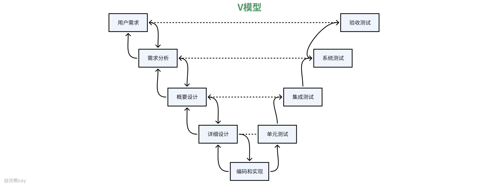

软件测试的 V 模型（RAD 快速应用开发模型）与瀑布模式结构相近，涵盖需求收集、系统设计、编码、测试等环节，其特点是将测试细分为单元、集成、系统、验收四个阶段，且每个测试阶段都与前期开发阶段对应：单元测试对应详细设计的最小可测试单元，集成测试对应概要设计的模块组合，系统测试对应需求规格说明，验收测试对应用户实际使用需求。

V 模型的优势是测试阶段与开发阶段清晰对应，目标明确；缺点是仍基于瀑布模式，测试人员通常在编码完成后才能介入，难以提前参与需求分析与系统设计环节。系统测试计划应在**需求分析阶段**制定，在设计阶段进一步细化完善。

## 测试的类型

### 测试类型分类

#### 按是否运行程序划分

**静态测试**：不运行被测程序，通过人工检测或计算机辅助静态分析的方式评审文档、检查代码，发现程序缺陷，主要包括代码走查、代码检查、评审、静态结构分析、质量度量等。

**动态测试**：在指定环境中运行被测程序，输入测试用例并对比结果，检验程序正确性、可靠性与有效性。

#### 按测试依据与方式划分

**黑盒测试**：不关注程序内部结构，仅依据需求规格说明书，从功能角度设计用例，检查程序功能是否满足需求。

**白盒测试**：基于程序内部逻辑结构设计用例，检查所有逻辑路径是否按要求正常运行。

**灰盒测试**：介于黑盒测试与白盒测试之间，兼顾功能与部分内部结构进行测试。

其中，代码走查与代码审查均为静态测试中的代码评审方式，**代码审查是正式的评审活动，代码走查则是非正式的讨论过程**。

### 静态测试

静态测试是指在软件测试过程中，**不实际运行、不执行被测的程序代码**，主要依靠人工审查或者借助专业的计算机辅助静态分析工具，对软件相关的各类文档、源代码进行全面检查、评审、分析与度量的测试方法。它不需要搭建运行环境、输入测试数据，而是直接从文档和代码本身出发，检查内容是否完整规范、逻辑是否合理、是否符合编程标准、是否存在语法隐患、结构缺陷以及与设计说明不一致等问题，通过提前发现这些潜在错误，减少程序运行后出现故障的概率，是软件质量保障中非常重要且高效的测试手段。

静态测试的常用方法主要包括以人工方式开展的**代码走查、代码检查、代码评审**，以及借助工具实现的**静态结构分析和代码质量度量**，这些方法都不需要运行程序，通过对代码和文档进行审查、分析与度量，来发现其中的缺陷、不规范之处以及逻辑问题，从而提前排查软件风险。

### 动态测试

动态测试是指**在实际运行环境中执行被测程序**，通过输入预先设计好的测试用例，观察程序的运行过程与输出结果，将实际结果与预期结果进行对比，从而判断程序功能是否正确、逻辑是否可靠、运行是否稳定的测试方法。它是通过程序的动态执行过程来发现错误、验证软件有效性和可靠性的重要手段。

动态测试的常用方法主要分为**黑盒测试**和**白盒测试**两大类。黑盒测试也叫功能测试，它不关注程序内部的代码结构和实现逻辑，只根据软件的需求规格说明，从外部功能角度设计测试用例，检查程序是否实现了规定的功能、输出结果是否符合预期。白盒测试也叫结构测试，它会深入程序内部，基于代码的逻辑结构、执行路径来设计测试用例，检查程序内部的语句、分支、路径等是否按照设计要求正确执行。灰盒测试则是介于黑盒测试和白盒测试之间，既关注软件的外部功能表现，也兼顾部分内部结构来开展测试工作。

## 测试用例

测试用例是为发现特定错误设计的测试数据与预期结果的组合，即**测试用例 = 测试数据 + 期望结果**。由于无法覆盖所有路径与输入数据，设计测试用例的核心目标是用最少的用例发现最多的错误。

设计测试用例需遵循：同时包含输入与预期输出，便于结果核对；兼顾合理与不合理输入，提升错误发现率；长期保留测试用例，方便回归测试与软件维护。

## 调试

调试是在测试发现错误后，定位错误原因与具体位置并进行修正的工作，一般由程序开发人员完成。调试步骤为：从错误外部表现确定出错位置，分析代码找到错误根源，修改设计与代码排除错误，重复原始测试确认修正效果，若无效则撤销改动，重新排查。常用调试方法包括试探法、回溯法、对分查找法、归纳法和演绎法。

## 真题
| 【中国铁塔2019】下列关于软件验收测试的合格通过准则错误的是（ ）
A. 软件需求分析说明书中定义的所有功能已全部实现，性能指标全部达到要求
B. 所有测试项没有残余一级、二级和三级错误
C. 立项审批表、需求分析文档、设计文档和编码实现不一致
D. 验收测试工件齐全
答案 ：C
解析 ：软件验收测试的合格通过准则应包括：软件需求分析说明书中定义的所有功能已全部实现，性能指标全部达到要求；所有测试项没有残余一级、二级和三级错误；立项审批表、需求分析文档、设计文档和编码实现一致；验收测试工件齐全。因此，选项 C 是错误的 |
| --- |

# 测试过程

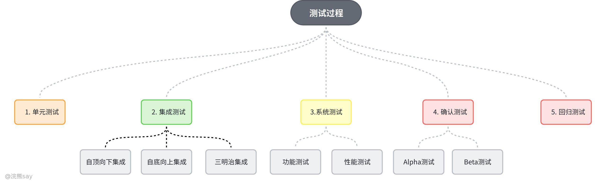

## 单元测试

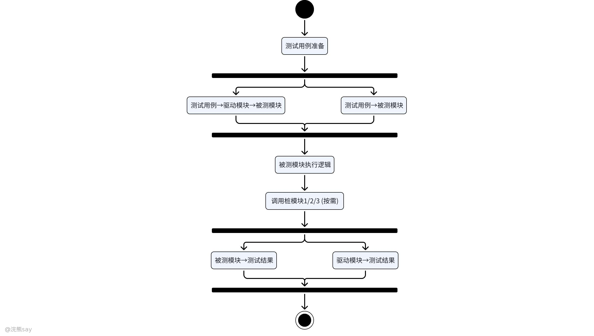

单元测试又称模块测试，是将每个模块作为独立实体进行的测试，通常在模块编写完成且无编译错误后开展，以详细设计描述为指南，重点针对程序重要执行通路进行检测，目的是发现模块内部的编码错误与详细设计缺陷。若采用机器测试，多选用白盒测试法，且支持多个模块同步测试。

单元测试的核心重点包括五个方面：一是模块间接口，需检查调用本模块的输入参数、本模块调用子模块的传入参数是否正确，以及全局与局部变量的定义和用法是否一致；二是局部数据结构，排查数据类型说明不一致、未赋值或初始化的变量、错误的初始值或缺省值、变量名拼写错误等问题；三是重要执行通路，验证是否存在死代码、计算优先级错误、精度问题、表达式符号错误及循环变量使用错误等；四是出错处理通路，检查错误描述是否易懂、能否准确定位错误、与实际错误是否相符，错误处理逻辑是否正确，以及错误发生后是否未受系统不当干预；五是边界条件，测试普通合法数据、普通非法数据、边界内接近边界的合法数据及边界外接近边界的非法数据的处理情况。

开展单元测试需搭建专用测试环境，核心依赖两类模块：驱动模块（Drive）用于模拟被测试模块的上一级模块，负责接收数据、传送给被测模块、启动被测模块并打印测试结果；桩模块（Sub）用于模拟被测模块调用的所有下级模块，通常仅执行少量数据处理（如打印入口和返回信息），以检验被测模块与下级模块的接口有效性。值得注意的是，单元测试计划需在详细设计阶段制定，明确测试目标、范围、方法及测试用例设计，这是保障单元测试质量的关键。

## 集成测试

单元测试完成后仍需进行集成测试，原因在于模块单独运行正常时，组合后可能出现各类问题：数据穿过接口时可能丢失、模块间可能存在有害影响、子功能组合可能无法实现预期主功能、个别可接受的误差积累可能超出允许范围，以及全程数据结构可能存在缺陷等。集成测试又称组装测试，是按照概要设计要求将独立模块组装为子系统或完整系统，通过系统化测试发现接口错误的技术。

集成测试主要分为非渐增式测试和渐增式测试两种模式：非渐增式测试先分别测试各个模块，再将所有模块组合进行整体测试；渐增式测试（应用更为广泛）则是将待测试模块逐步集成到已测试通过的模块集合中，每次集成后立即测试，逐步完成所有模块的组装与测试，其核心集成策略包括自顶向下、自底向上及三明治集成三种。

### 自顶向下集成

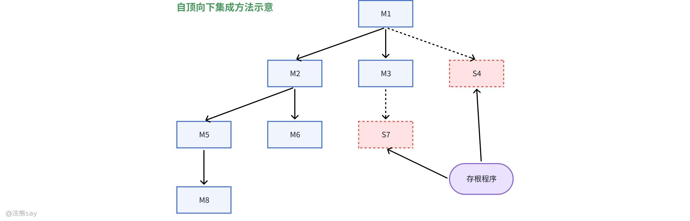

自顶向下集成从主控制模块开始，沿着程序控制层次向下逐步结合各个模块，组装时可采用深度优先或宽度优先策略。深度优先策略先组装软件结构中一条主控制通路上的所有模块，再构造其他控制通路；宽度优先策略则沿软件结构水平方向移动，组装同一控制层次的所有模块。

其测试步骤为：首先测试主控模块，设计桩模块模拟其调用的下级模块；随后依次用实际模块替代桩模块，每次替代后进行测试，确保与主控模块正常交互；接着对组装后的子系统测试，设计新的桩模块模拟子系统调用的下级模块；最后逐步用实际模块替代剩余桩模块，完成全量模块的组装测试。

该方法的优点包括：减少驱动模块开发工作量，无需为顶层模块设计驱动；能较早验证功能可行性和核心控制、判断点，及时发现上层模块接口错误；深度优先策略可优先实现并验证完整软件功能，且支持故障隔离，便于定位问题。缺点则是桩模块的开发和维护成本较高，尤其是复杂底层模块的桩模块需模拟多种功能；底层组件行为验证被推迟，可能导致后期发现问题后修正难度增加，且底层组件测试易不充分。适用于控制结构清晰稳定、高层接口变化小、底层接口未定义或频繁修改、控制组件技术风险高需尽早验证，以及希望尽早展示系统功能行为的场景。

### 自底向上集成

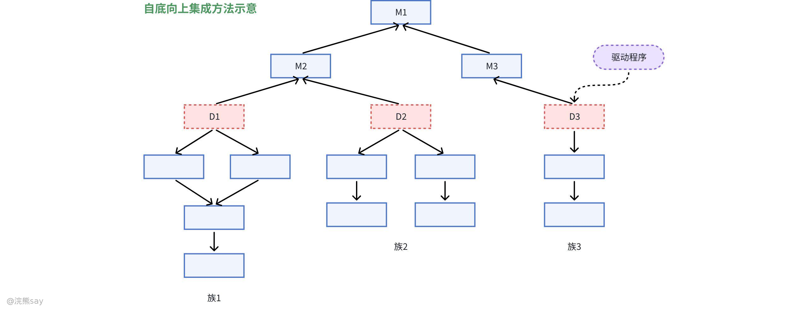

自底向上集成从软件结构最低层的 “原子” 模块开始组装和测试，先将低层模块组合成实现特定子功能的模块族，编写驱动程序协调测试数据输入与输出，对模块族进行测试验证子功能；之后去掉驱动程序，沿软件结构自下向上逐步组合模块族，最终完成整个系统的集成测试。

测试步骤为：先对最底层模块单独测试，设计驱动模块模拟其上级调用模块；再用实际上层模块替代驱动模块，与已测试的底层模块连接测试；随后设计驱动模块模拟调用新形成的子系统，验证子系统功能；最后将所有测试通过的子系统按程序结构连接，完成整体组装测试。

其优点是减少桩模块开发工作量，测试用例设计相对简单，支持故障隔离，便于定位底层模块问题；可早期验证底层组件行为，尤其是涉及复杂算法和输入 / 输出的模块，且支持多个底层模块并行测试，提升测试效率。缺点则是驱动模块开发工作量庞大，随着集成推进，驱动模块的数量和复杂度可能增加；高层验证被推迟到最后，设计上的错误难以及时发现，可能导致后期大规模修改。适用于底层接口稳定、高层接口变化频繁，以及底层组件较早完成的场景。

### 三明治集成

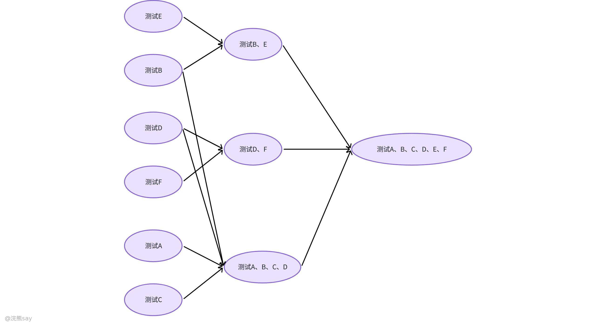

三明治集成又称混合式集成，将系统分为三层，中间一层为目标层。对目标层上方采用自顶向下集成策略，从顶层模块逐步向下集成相关模块；对目标层下方采用自底向上集成策略，从底层模块逐步向上集成相关模块；最终在目标层汇合，完成整个系统的集成测试。该方法综合了自顶向下和自底向上集成的优点，适用于大部分软件开发项目，但缺点是对中间层的测试不够充分，中间层与上下层模块的接口问题可能无法全面检测。

## 系统测试

系统测试是将经过集成测试的软件作为计算机系统的一个元素，与计算机硬件、外设、支持软件、数据及人员等其他系统元素结合，进行一系列组装测试和确认测试的过程，其核心关注软件与其他系统元素的协同工作情况，而非仅局限于软件本身。

系统测试的依据是软件需求规格说明书，目的是通过与用户需求对比，发现系统与需求不符或矛盾的地方，确保系统在实际应用环境中正常有效运行，测试内容主要涵盖功能测试和性能测试两大类。

功能测试包括图形界面测试和核心功能测试：图形界面测试重点检查界面布局合理性、元素完整性及操作便捷性；核心功能测试则验证软件是否实现了需求规格说明书中规定的各项功能，且每个功能都能正确执行。

性能测试的覆盖范围广泛，包括配置测试（测试软件在不同硬件配置、软件环境下的运行情况）、时间性能测试（评估响应时间、处理速度等指标）、压力测试（逐步增加系统负载，验证极限情况下的系统表现）、容量测试（确定系统能处理的数据量上限）、安全性测试（排查安全漏洞，防止未授权访问和数据泄露）、恢复测试（验证系统故障后在规定时间内恢复正常运行的能力，以及恢复后数据的完整性和一致性）、兼容性测试（验证软件与其他相关软件、硬件设备的兼容情况）、备份测试（检查备份功能有效性及备份数据的恢复能力）、可用性测试（评估软件的易用性，包括界面友好程度和操作简便性）等。

## 确认测试

确认测试又称 “验收测试”“有效性测试”，是软件交付给用户前的关键环节，核心任务是进一步验证软件的功能、性能及其他特性是否与用户要求一致，确保软件能够满足用户实际应用需求。需求分析阶段形成的软件需求规格说明书是确认测试的核心依据，所有测试活动均围绕该说明书展开，同时该说明书也是判定软件有效性的核心标准。

确认测试的实施流程需依次开展有效性测试、软件配置审查、验收测试和安装测试，经管理部门认可与专家鉴定后，软件方可交付用户使用。有效性测试重点验证软件功能和性能是否符合需求规格说明书；软件配置审查则全面检查软件配置文档的完整性与正确性；验收测试和安装测试则聚焦软件交付与部署环节的可用性。从测试内容来看，确认测试主要包括功能测试、性能测试、强度测试和配置复审，其中功能测试与性能测试虽与系统测试中的相关内容类似，但更侧重于用户实际使用视角；强度测试用于检查软件在异常场景下的运行表现；配置复审则是对软件所有配置项进行全面审查，确保配置合规。

确认测试主要分为 Alpha 测试和 Beta 测试两类。Alpha 测试在开发者场所进行，由用户在开发者的指导下开展，开发者全程记录测试过程中发现的错误和使用问题，测试环境受控，便于开发者及时观察反馈、快速定位问题；Beta 测试则由最终用户在一个或多个客户场所执行，开发者通常不在测试现场，测试环境是软件在开发者无法控制的 “真实” 应用场景，用户记录使用过程中遇到的所有问题并反馈给开发者，能更真实地反映软件实际使用效果。需要注意的是，可靠性测试作为验证软件平均失效间隔时间等指标是否符合需求的测试类型，属于确认测试阶段的典型活动。

## 回归测试

回归测试是指在软件发生变化后，重新执行已完成测试的某个子集，其核心目的是保证新模块集成、程序调试或其他原因导致的程序变更，不会带来非预期的副作用，确保软件在修改后仍能保持原有的功能和性能，维护软件的稳定性与可靠性，降低修改行为带来的风险。

当程序出现特定变化时，需及时实施回归测试，例如建立新的数据流路径、新增 I/O 操作、激活新的控制逻辑等，这些变化都可能影响软件原有功能的正常运行，必须通过回归测试验证。回归测试集是已执行过的测试用例的子集，主要包含三类测试用例：一是能够检测软件全部功能的代表性测试用例，用于确保软件核心功能不受修改影响；二是针对可能受修改影响的软件功能的附加测试用例，重点验证与修改相关的功能正确性；三是针对被修改过的软件成分的测试用例，直接检查修改部分的实现效果。在软件调试过程中，改正当前故障可能会引入新的故障，此时回归测试是发现这类潜在问题的关键手段。

# 真题
| 【国家电网】单元测试阶段主要涉及（ ）的文档。
A. 需求设计
B. 编码和详细设计
C. 详细设计
D. 概要设计
答案 ：B
解析 ：单元测试是在编码完成后进行的测试，主要验证代码是否符合详细设计的要求。因此，单元测试阶段主要涉及编码和详细设计的文档。 |
| --- |

| 【中国银行】下列哪个是软件测试的主要活动之一？（ ）
A. 项目管理
B. 编写测试计划
C. 代码编写
D. 确认需求
答案 ：B
解析 ：软件测试的主要活动包括测试计划制定、测试用例设计、测试执行、缺陷管理等。编写测试计划是软件测试的重要环节，而项目管理、代码编写和确认需求属于软件开发过程中的其他活动。 |
| --- |

| 【国家电网2022】以下关于确认测试的叙述中，不正确的是（ ）。
A. 确认测试需要验证软件的功能和性能是否与用户要求一致
B. 确认测试是以用户为主的测试
C. 确认测试需要进行有效性测试
D. 确认测试需要进行软件配置复查
答案 ：B
解析 ：确认测试是以开发方为主的测试，用户参与的是验收测试。确认测试的目的是验证软件是否满足需求规格说明书中规定的功能和性能要求，包括有效性测试和软件配置复查 |
| --- |

| 【国家电网2023】自底向上的集成测试策略的优点包括（ ）。
A. 主要的设计问题可以在测试早期处理
B. 不需要写驱动程序
C. 不需要写桩程序
D. 不需要进行回归测试
答案 ：C
解析 ：自底向上的集成测试策略的优点包括不需要写桩程序。这种测试方法从底层模块开始测试，只需要设计驱动模块来模拟调用这些底层模块的上级模块，而不需要为高层模块编写桩程序。 |
| --- |

# 白盒测试

## 什么是白盒测试？

白盒测试也称结构测试，其核心是根据程序的内部结构和逻辑设计测试用例，对程序的执行路径和过程进行针对性测试，检查是否符合设计要求，它深入程序内部，重点关注代码的执行逻辑与结构完整性。白盒测试的常用技术包括逻辑覆盖、循环覆盖和基本路径测试三类，其中逻辑覆盖是通过测试数据运行程序，考查对程序逻辑的覆盖程度，主要包含语句覆盖、判定覆盖、条件覆盖、判定 - 条件覆盖、条件组合覆盖和路径覆盖六种标准；循环覆盖则是设计足够测试用例，验证循环中每个条件在各种场景下的正确执行；基本路径测试是在程序控制流图基础上，通过分析环路复杂性导出基本可执行路径集合，进而设计测试用例覆盖主要路径。

白盒测试的优势在于能够深入程序内部逻辑进行覆盖测试，全面检查结构和逻辑的正确性，但同时也存在明显局限：无法检验程序的外部功能特性，不能从用户视角验证是否满足功能需求，也无法对程序内部欠缺的功能或逻辑进行测试。

## 逻辑覆盖测试方法

### 语句覆盖

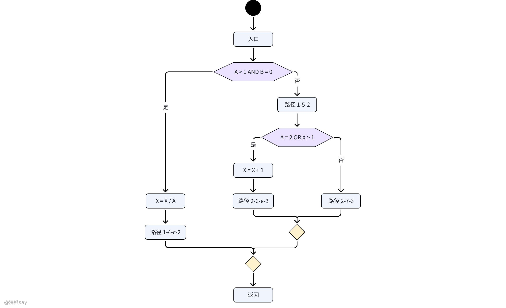

语句覆盖的核心思想是设计测试用例，使程序中每个可执行语句至少执行一次，确保无遗漏语句。例如通过输入 “A=2，B=0，X=4”，可让程序执行路径为 sacbed，覆盖所有语句。其优点是从源代码获取测试用例直观，无需细分判定表达式，操作简单；缺点是仅针对显式语句，无法测试隐藏条件，在多分支逻辑运算中难以全面覆盖，是最弱的逻辑覆盖标准。

### 判定覆盖

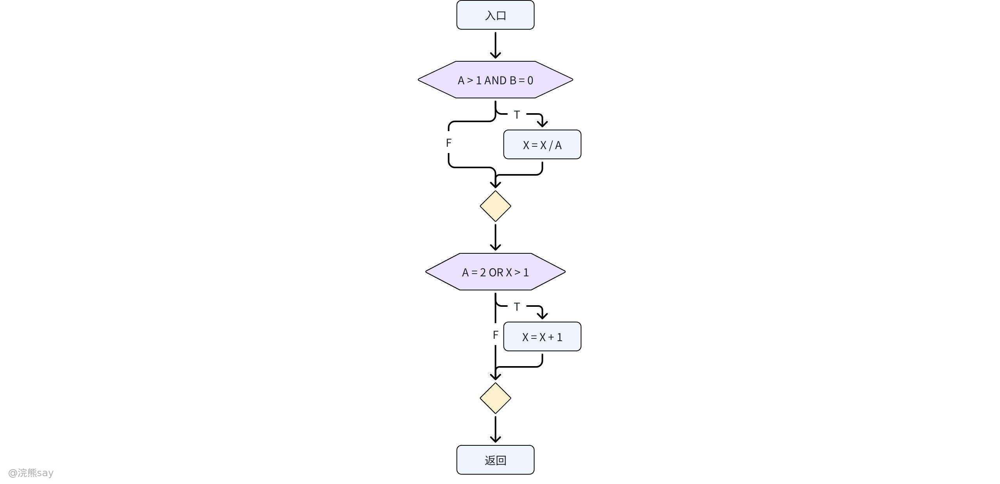

判定覆盖要求设计的测试用例，使程序中每个判断的取真分支和取假分支至少经历一次，即判断真假值均被满足。例如输入 “A=3，B=0，X=3” 覆盖 sacbd 路径，输入 “A=2，B=1，X=1” 覆盖 sabed 路径，即可实现判定覆盖。它比语句覆盖测试能力更强，能覆盖判断的不同分支，且同样具备简单性，但对于由多个逻辑条件组合而成的判定语句，仅关注最终结果而忽略单个条件取值，容易遗漏部分测试路径，仍是较弱的逻辑覆盖。

### 条件覆盖

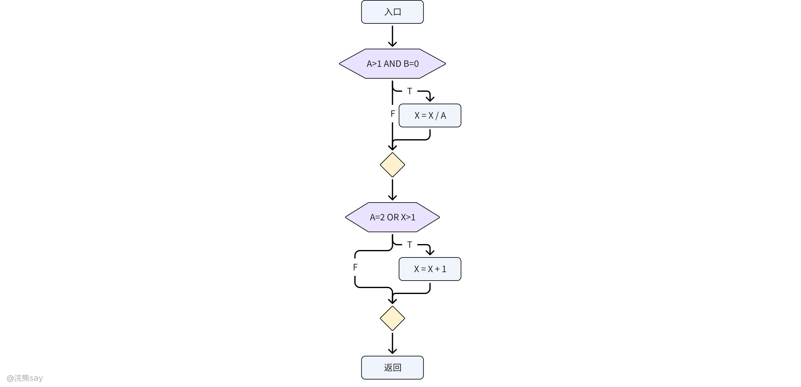

条件覆盖聚焦判断中各个条件的不同取值，设计测试用例使每个判断中每个条件的可能取值至少满足一次。例如输入 “A=2，B=0，X=4” 覆盖 sacbed 路径，输入 “A=1，B=1，X=1” 覆盖 sabd 路径，可实现条件覆盖。其优点是增加了对条件判定情况的测试，拓展了测试路径，能更全面检验条件取值对程序的影响；缺点是不一定包含判定覆盖，仅保证每个条件至少一次为真，不考虑所有判定结果，可能存在判定结果未完全覆盖的情况。

### 判定一条件覆盖

兼顾条件覆盖和判定覆盖的要求，设计足够测试用例，使判断条件中所有条件的可能取值至少执行一次，同时所有判断的可能结果也至少执行一次。例如输入 “A=2，B=0，X=4” 和 “A=1，B=1，X=1”，可同时满足判定与条件覆盖。它弥补了条件覆盖可能不包含判定覆盖的不足，但未考虑条件的组合情况，可能遗漏多个条件组合对程序的影响。

### 条件组合覆盖

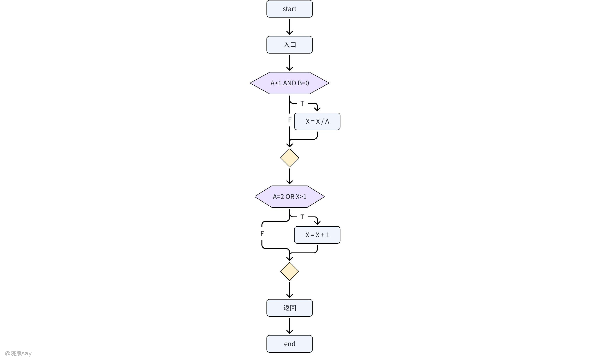

条件组合覆盖要求设计测试用例，使每个判定表达式中条件的各种可能组合都至少执行一次，全面考量条件组合对程序的影响。以相关示例为例，需覆盖八种条件组合（如 “A>1，B=0”“A>1，B≠0” 等），通过四组测试数据（A=2，B=0，X=4；A=2，B=1，X=1；A=1，B=0，X=2；A=1，B=1，X=1）即可实现所有组合覆盖。其优点是覆盖程度高，同时满足判定、条件覆盖标准，且考虑条件组合；缺点是即便覆盖了多种条件组合，也不一定能覆盖程序中的所有路径，例如上述测试数据未覆盖 sacbd 路径。需要注意的是，满足条件组合覆盖的测试用例，必然满足判定覆盖、条件覆盖和判定 - 条件覆盖，是前述几种覆盖标准中最强的，但无需对不同判定的条件组合再进行交叉组合，否则会导致测试用例数量大幅增加。

### 路径覆盖

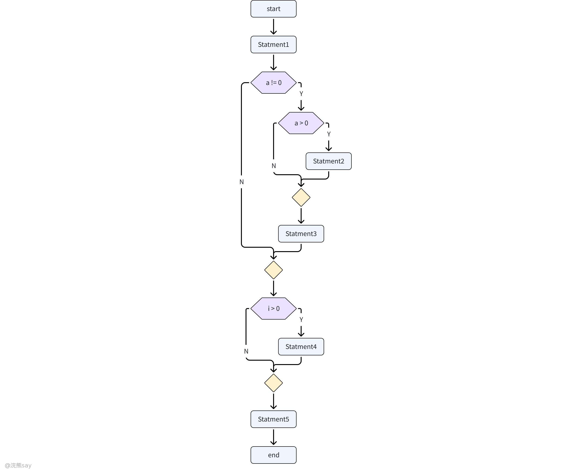

路径覆盖核心是设计测试用例，覆盖程序中所有可能的执行路径，确保每条路径都得到检验。其优点是测试最为彻底，覆盖面远超其他五种方法，能最大限度发现程序错误；缺点是需要设计大量复杂的测试用例，工作量呈指数级增长，且难以覆盖所有条件组合。例如某流程图包含 6 条路径，就至少需要 6 个测试用例才能满足路径覆盖要求。

## 循环覆盖测试方法

### 简单循环的测试

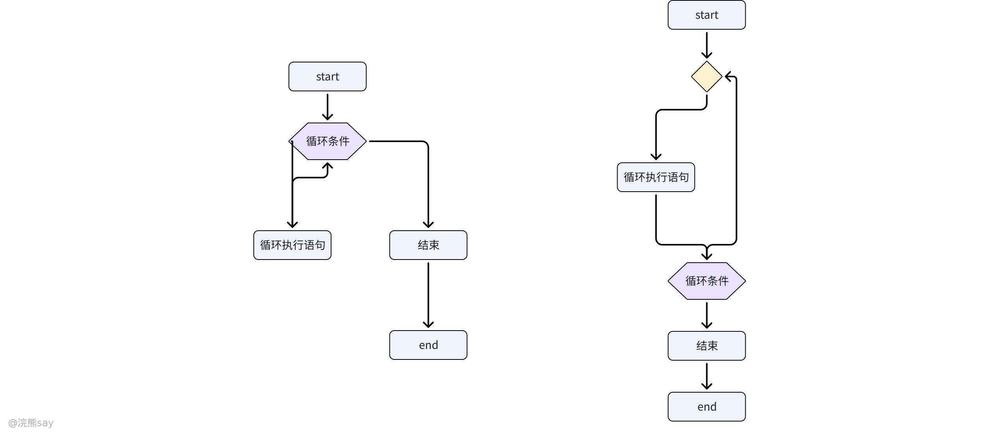

设 n 为允许通过循环的最大次数，测试集应包含多种典型场景。首先是**边界值测试**，需覆盖跳过整个循环（循环次数为 0）、仅执行一次循环、执行两次循环，这些场景能验证循环初始化和单次执行的正确性；其次是**正常范围测试**，选择执行 m 次循环（1 < m < n-1），确保循环在常规次数下稳定运行；最后是**边界与越界测试**，执行 n-1 次、n 次和 n+1 次循环，其中 n-1 和 n 验证边界条件处理，n+1 则用于暴露可能的溢出或异常处理逻辑缺陷。例如，在计算数组元素累加和的循环中，当 n=100 时，测试 n+1 次可能触发数组越界异常，从而验证程序的健壮性。

### 嵌套循环的测试

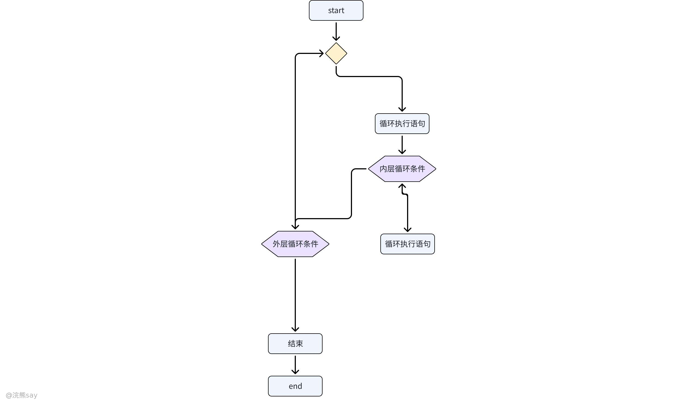

若采用简单循环的测试方法，测试案例数量将呈几何级增长（假设内层循环最大次数为 m，外层为 n，测试组合可达 m×n 种），因此需采用分层测试策略。首先，将外层循环固定为最小值（如 0 或初始状态），仅对最内层循环进行测试，除应用简单循环测试方法外，还需补充边界外值（如 -1 或 m+1），以验证循环终止条件的鲁棒性；完成内层测试后，将内层循环设置为典型值（如中间值），逐步扩展至外层循环，每次固定已测试层的参数，直至所有嵌套层级测试完毕。例如，在矩阵遍历的双层嵌套循环中，先固定外层行索引，测试列循环的各种情况，再推进到外层循环，可大幅减少冗余测试。

### 串接循环

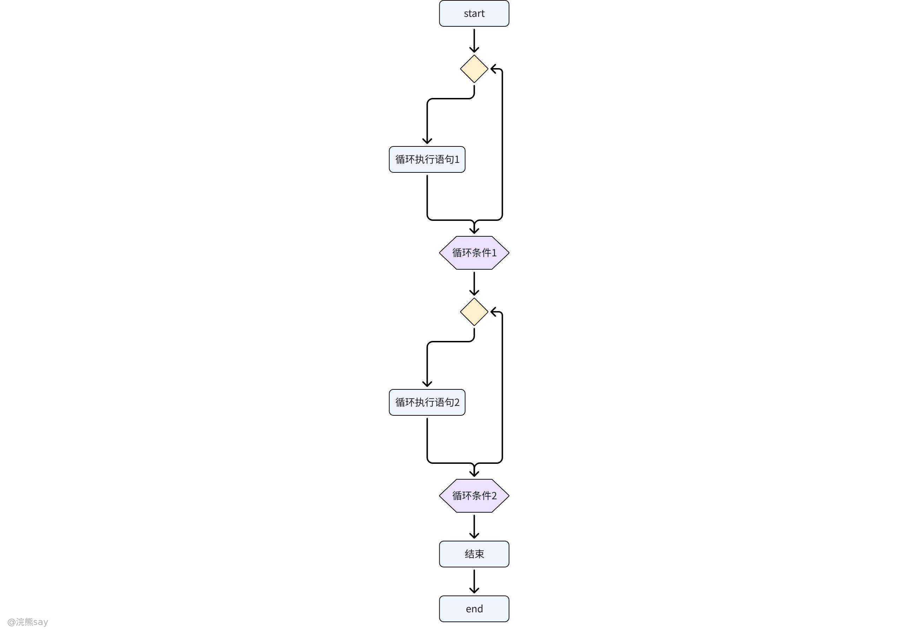

串接循环需根据循环间的依赖关系选择策略。若串接的循环彼此独立（即前序循环结果不影响后续循环条件），可采用简单循环测试策略分别验证；若多个循环的循环计数存在串接关系（如后一个循环的起始值依赖前一个循环的结束状态），则需按嵌套循环的测试方法执行，通过分层控制循环变量，确保数据传递和状态转换的正确性。例如，在处理分页数据的循环中，下一页的起始索引依赖上一页的结束索引，此时需将多个循环视为整体进行测试。

### 无结构循环的测试

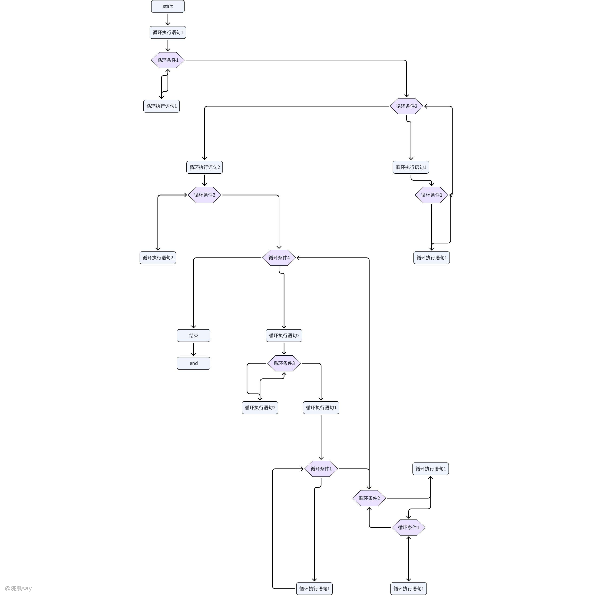

此类循环常因 goto 语句、非结构化跳转导致逻辑混乱，无法直接进行有效测试。需按照结构化程序设计思想，通过提取重复代码块、使用条件语句替代跳转逻辑等方式，将程序重构为顺序、选择、循环三种基本结构的组合。例如，将包含大量 goto 跳转的循环重构为 while 或 for 循环，并配合 break、continue 语句，使循环结构清晰可测，再基于重构后的代码设计测试用例，确保功能完整性和逻辑正确性。

## 真题
| 【国家电网】在软件测试中，白盒测试方法是通过分析程序的（ ）来设计测试用例的方法。
A. 应用范围
B. 内部逻辑
C. 功能
D. 输入数据
答案 ：B
解析 ：白盒测试是通过分析程序的内部逻辑和结构来设计测试用例的方法。它深入程序内部，关注代码的执行逻辑和路径，而不是程序的应用范围、功能或输入数据。因此，选项 B 正确。 |
| --- |

| 【国家电网】以下属于白盒测试方法的是（ ）。
A. 边值分析
B. 语句测试
C. 分支测试
D. 路径测试
答案 ：BCD
解析 ：白盒测试方法包括语句测试、分支测试、路径测试等逻辑覆盖方法。边值分析属于黑盒测试方法，用于测试输入域的边界值。因此，选项 B、C、D 正确。 |
| --- |

| 【国家电网】以下关于白盒测试的叙述中，正确的是（ ）。
A. 白盒测试是根据程序的功能来设计测试用例的
B. 白盒测试无需考虑模块内部的执行过程和程序结构
C. 白盒测试主要用于测试程序的外部功能
D. 白盒测试需要了解程序的内部结构
答案 ：D
解析 ：白盒测试需要了解程序的内部结构和执行过程，根据程序的逻辑路径设计测试用例，主要用于测试程序的内部逻辑和结构，而不是外部功能。白盒测试需要考虑模块内部的执行过程和程序结构，因此选项 D 正确。 |
| --- |

# 黑盒测试

## 什么是黑盒测试？

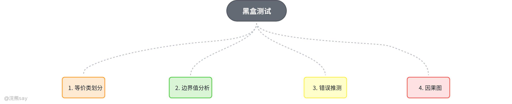

黑盒测试也称功能测试，其核心特点是完全不考虑软件的内部结构和特性，仅聚焦软件的外部功能表现，通过验证输入与输出的对应关系，检测软件是否满足需求规格说明。常用的黑盒测试技术包括等价类划分、边界值分析、错误推测和因果图法，测试策略通常以边界值分析法为优先选择，必要时结合等价类划分法，将错误推测法作为补充手段，同时配合逻辑覆盖进行对照检查，确保测试的全面性与有效性。

黑盒测试的优势在于能够站在用户立场开展测试，直接针对软件功能进行验证，更贴合用户的实际使用需求；但缺点也较为明显，由于无法触及程序内部逻辑结构，难以发现因内部逻辑缺陷导致的错误。例如，当系统重用第三方组件且无法获取其源代码时，黑盒测试是唯一可行的测试方式，而依赖程序内部结构的基本路径覆盖、分支覆盖、环路覆盖等方法均不适用。

## 等价分类法

等价类划分法的核心思想是将程序的输入域划分为若干等价类（即输入数据的子集合），同一等价类中的输入数据对于揭露程序错误具有等价性，因此只需从每个等价类中选取代表性数据作为测试用例，就能以少量用例实现高效测试。等价类分为有效等价类和无效等价类：有效等价类由合理、有意义的输入数据构成，用于检验程序是否实现了预设功能和性能；无效等价类则由不合理、无意义的输入数据构成，用于验证程序对不符合规格说明的输入的处理能力。

确定等价类需遵循明确原则：若输入条件规定了取值范围或值的个数，可确立 1 个有效等价类和 2 个无效等价类；若规定了输入值集合或 “必须如何” 的条件，可确立 1 个有效等价类和 1 个无效等价类；若输入数据是一组需分别处理的值，可为每个值确立 1 个有效等价类，再额外确立 1 个包含所有不允许输入值的无效等价类；若规定了输入数据必须遵守的规则，可确立 1 个符合规则的有效等价类和若干个从不同角度违反规则的无效等价类；若输入条件为布尔量，可直接确立 1 个有效等价类和 1 个无效等价类；若已知同一等价类中各元素的程序处理方式不同，则需进一步细分等价类，保证测试准确性。

根据等价类设计测试用例的流程为：首先为每个等价类分配唯一编号，便于管理追踪；其次设计测试用例，尽可能多地覆盖未被覆盖的有效等价类，重复该过程直至所有有效等价类均被覆盖；最后针对每个未被覆盖的无效等价类，设计单独的测试用例（每个用例仅覆盖 1 个无效等价类），直至所有无效等价类覆盖完毕。例如，某大学学籍管理系统中学生年龄的输入范围为 16～40，按规则可划分为 1 个有效等价类（16≤年龄≤40）和 2 个无效等价类（年龄＞40、年龄＜16）。

## 边界值分析

根据长期测试经验，程序在处理边界情况时最容易发生错误，因此边界值分析法常作为等价类划分法的补充手段，通过选取等价类边界及相邻值作为测试用例，全面检测程序在边界条件下的运行稳定性。该方法不仅适用于输入条件的边界测试，也可用于设计输出域的测试用例。在实际测试方案设计中，通常会将等价类划分与边界值分析联合使用，结合两者优势提升测试的充分性和有效性。

## 错误猜测法

错误推测法基于测试人员的直觉和过往经验，核心思路是列举程序中可能存在的错误以及容易发生错误的特殊情况，再针对这些场景有针对性地设计测试用例。这种方法无需严格遵循固定规则，依赖测试人员对软件功能的理解和测试经验的积累，能有效发现其他测试方法可能遗漏的潜在问题，是黑盒测试中重要的补充手段。

## 因果图法

因果图法是通过图解方式分析输入条件的各种组合情况，进而设计测试用例的方法，其核心优势是能清晰表达输入条件（因）与输出结果（果）之间的因果关系，避免遗漏输入组合。设计测试用例的步骤为：首先从软件规格说明书中提取原因（输入条件）和结果（输出或程序状态改变），并为其分别标识；其次分析语义，明确原因与结果、原因与原因之间的关系，绘制因果图并标注约束和限制条件；接着将因果图转换为判定表，使各种输入组合及对应输出结果更清晰呈现；最后依据判定表的每一列设计测试用例，确保所有可能的输入组合都能被覆盖。

## 真题
| 【中国银行】下列哪种测试方法可以发现未被测试人员发现的缺陷？（ ）
A. 白盒测试
B. 灰盒测试
C. 黑盒测试
D. 自动化测试
答案 ：B
解析 ：灰盒测试结合了白盒测试和黑盒测试的优点，既关注程序的内部结构，又关注程序的外部功能，能够发现未被测试人员发现的缺陷。白盒测试和黑盒测试各有局限性，自动化测试主要用于提高测试效率，而不是发现新的缺陷。因此，选项 B 正确 |
| --- |

| 【中国银行】当程序经过简单的测试后一般不会再存在很重大的错误，主要是一些难以发现的小错误，比如漏掉了某个操作、分支谓词规定的边界不正确等。用来检测这些小错误的测试方法是（ ）。
A. 黑盒测试
B. 结构测试
C. 集成测试
D. 程序变异测试
答案 ：B
解析 ：结构测试（白盒测试）是通过分析程序的内部结构和逻辑来设计测试用例的方法，能够发现程序中的小错误，如漏掉操作、边界条件不正确等。黑盒测试主要用于测试程序的外部功能，集成测试用于测试模块之间的接口，程序变异测试用于评估测试集的有效性。因此，选项 B 正确 |
| --- |

| 【中国铁塔2019】用黑盒技术设计测试用例的方法之一为（ ）
A. 因果图
B. 逻辑覆盖
C. 循环覆盖
D. 基本路径测试
答案 ：A
解析 ：黑盒测试技术包括等价类划分、边界值分析、错误推测法和因果图法等。因果图法是黑盒测试中常用的一种设计测试用例的方法，用于分析输入条件的组合及其产生的输出结果之间的因果关系。而逻辑覆盖、循环覆盖和基本路径测试属于白盒测试技术。 |
| --- |

# 面向对象的测试

面向对象的测试与传统软件测试存在显著差异，其核心特点体现在三个方面：一是传统集成测试中 “逐步搭建模块” 的方法不再适用，因为面向对象软件中类之间存在复杂依赖关系，无法简单按模块逐步集成；二是面向对象软件的各开发阶段有着独特的要求和结果，不能用功能细化的视角检测分析与设计成果，其分析和设计更侧重对象间的交互与协作；三是需适配面向对象开发特点，构建新的测试模型满足测试需求。

## 面向对象测试的主要活动

面向对象测试的核心活动包括四类：类测试聚焦类的功能性与结构性，确保类能正确实现预定功能且具备良好结构；交互测试涵盖汇集类与协作类的测试，检验类之间的交互是否正确协调；系统测试包含功能测试、性能测试、强度测试、安全测试、健壮性 / 恢复测试、安装 / 卸载测试等，全面检测系统是否满足用户需求；验收测试由用户或其代表参与，验证软件是否符合实际需求，决定是否接受该软件。

## 面向对象的测试模型

结合面向对象开发模型与传统测试步骤，面向对象软件测试分为六个阶段：面向对象分析测试验证分析结果的合理性与正确性；面向对象设计测试检查设计是否符合分析要求，以及设计本身的合理性与可行性；面向对象编程测试验证编程实现是否契合设计要求，代码是否正确规范；面向对象单元测试以类或对象为基本单位，确保每个单元功能正确；面向对象集成测试聚焦类之间的交互与协作，验证集成后系统的正常运行；面向对象系统测试则对整个系统进行全面评估，保障整体性能与功能达标。

## 各阶段核心测试内容

1.  **分析测试**：核心是验证对象及其关系的合理性与可行性。由于面向对象系统中对象相对稳定而关系易变，测试需围绕三方面展开：确认分析模型中对象定义准确完整，符合系统需求；检查对象之间的关系合理清晰，能正确反映业务逻辑；验证对象属性的定义与方法的功能是否满足要求。
2.  **设计测试**：类和类结构的设计需满足当前需求，且便于系统实现、对象重用与扩展。测试主要从三方面进行：检查类的设计是否合理，是否具备良好的封装性、继承性和多态性；验证类层次结构是否有利于代码重用与扩展；确保类库中的类能正确高效地被重用。
3.  **编程测试**：面向对象程序的功能实现分布在类中，测试需忽略功能实现细则，聚焦类功能实现与面向对象程序风格：一是数据成员是否满足封装要求，仅能通过类的方法访问和修改；二是类的方法是否能正确完成预定功能。
4.  **单元测试**：面向对象软件的单元测试以类或对象为最小可测试单位，不能孤立测试单个操作，需将操作作为类的一部分进行测试，确保其在类的环境中正常执行。类测试由封装的操作和类的状态行为共同驱动，因为类可能包含多个操作，且同一操作可能存在于不同类中。
5.  **集成测试**：主要采用两种策略：基于线程的测试将响应一个输入或事件所需的类集成形成线程，分别测试每个线程并应用回归测试，避免集成产生副作用；基于使用的测试先测试不依赖服务器类的独立类，再逐层测试依赖已测试类的依赖类，直至完成整个系统构造。此外，集群测试作为集成测试的重要步骤，会设计测试用例检查相互协作的类，发现类间协作错误。
6.  **系统测试**：需尽量搭建与用户实际使用环境一致的测试平台，确保测试结果真实可靠，对缺失的设备部件需通过模拟手段保障系统正常运行。测试应参考面向对象分析（OOA）结果，检测软件是否能准确 “再现” 问题空间、解决实际问题，既是对系统整体行为的检测，也是对开发设计的再确认。
7.  **确认测试**：重点检查用户可见的动作与可识别的输出，验证软件是否符合用户期望。测试用例需基于动态模型和系统行为脚本设计，聚焦用户可能的交互场景，确保覆盖易发现交互需求错误的情景。

## WebApp 测试

WebApp 测试采用软件测试基本原理，结合面向对象系统的测试策略与战术，核心内容包括：评审内容模型，发现信息不准确、不完整等内容错误；评审接口模型，确保其适配所有用例，保障 WebApp 与其他系统或组件的正确交互；评审设计模型，排查导航错误，保证用户浏览顺畅；测试用户界面，发现表现机制与导航机制错误，提升界面友好性与易用性；对功能构件进行单元测试，确保单个构件功能正常；测试贯穿体系结构的导航，验证导航的正确性与完整性；在不同环境配置下测试兼容性，确保 WebApp 稳定运行；开展安全性测试，排查并修复安全漏洞；进行性能测试，评估不同负载下的响应时间、吞吐量等指标；通过最终用户群测试，收集内容、导航、可用性、兼容性、安全性、可靠性及性能等方面的反馈，进一步优化 WebApp。

## 真题
| 【交通银行2022】手机软件测试方法中，属于测试原理的方法是（ ）。
A. 手工测试
B. 系统测试
C. 单元测试
D. 白盒测试
答案 ：D
解析 ：白盒测试是一种测试原理，它通过分析程序的内部结构和逻辑来设计测试用例。手工测试、系统测试和单元测试是测试的方式或级别，而不是测试原理。因此，选项 D 正确 |
| --- |
