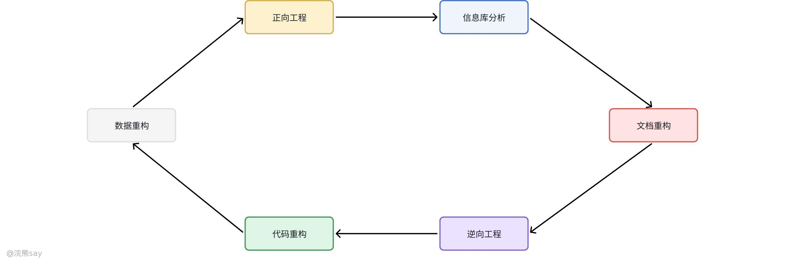

# 软件维护概念

软件维护是软件交付使用后，为改正潜在错误、满足新需求而进行的修改过程，而提高软件可维护性是开发管理信息系统各步骤的关键，其直接决定系统能否被良好维护。软件需要维护的原因主要包括：运行中发现测试阶段未察觉的潜在错误与设计缺陷；为增强功能、提升性能需改进软件设计；需适应新的硬件、软件、外部设备、通信设备等工作环境，或变动后的数据、文件；以及为防止系统失效而进行预防性修改。

软件维护分为非结构化维护和结构化维护两类：非结构化维护因软件未采用软件工程方法开发，通常只有程序而缺乏完善文档，导致维护工作异常困难；结构化维护则基于软件工程方法开发，各阶段均形成规范文档，这些文档能帮助维护人员理解软件的功能、性能、系统结构、数据结构、接口及设计约束等，让维护工作更易开展。从本质来看，软件维护过程是一个修改和压缩了的软件定义与开发过程，具体需建立维护组织、确定报告和评价流程、规范维护需求的事件序列、建立维护活动记录保管流程，并明确复审标准。

## 软件的可维护性

软件的可维护性指维护人员理解、改正、改动或改进软件的难易程度，是衡量软件质量的主要特征之一。其核心指标包括可理解性、可测试性和可修改性，而文档是决定软件可维护性的关键因素，软件系统文档分为用户文档和系统文档两类。需要注意的是，当数据、软件结构、模块过程等软件相关特点发生改动时，必须及时修改相应技术文档，确保文档与软件的一致性。

提高软件可维护性的途径有多种：建立明确的软件质量目标和优先级，为开发与维护提供指引；使用能提升软件质量的技术和工具，提高开发效率与质量；选择便于维护的程序设计语言，降低后续维护难度；采取明确有效的质量保证审查措施，及时发现并解决问题；同时完善程序文档，保证其完整性和准确性，为维护工作提供有力支持。

## 软件维护步骤与内容

## 维护步骤

首先由相关人员提出维护或修改要求，随后领导对该要求进行审查并作出答复，若同意修改则将其列入维护计划；接着领导分配维护任务，维护人员按照计划开展修改工作；最后对维护成果进行验收，并登记相关修改信息。

## 维护内容

各类维护活动均需覆盖整个软件配置，包括维护文档和软件可执行代码，具体分为硬件维护、软件维护和数据维护三类。

硬件维护通常由专职人员负责，主要包括定期的设备保养性维护和应对突发性故障的维护。软件维护是根据需求变化或硬件环境变化，对应用程序进行部分或全部修改，具体分为四种类型：改正性维护，用于识别和纠正软件交付后暴露的隐藏错误、改进性能缺陷、排除误使用问题；适应性维护，当外部环境（如新软硬件配置）或数据环境（如数据库、数据格式、输入输出方式、存储介质）变化时，修改软件以适应这些变化；完善性维护，为满足用户在使用过程中提出的新功能、新性能要求，对软件进行修改或重新开发，以扩充功能、增强性能、提高加工效率和可维护性；预防性维护，为提高应用软件的可靠性和可维护性，使其适应未来软硬件环境变化，主动增加预防性新功能，避免系统被淘汰。数据维护主要由数据库管理员负责，核心工作是保障数据库的安全性、完整性以及进行并发性控制。

# 软件维护的困难与副作用

## 维护困难

软件维护面临诸多挑战：理解他人编写的程序往往十分困难；开发文档可能存在不合格、缺失或与程序不一致的问题；有时需要等待开发人员对软件进行说明，进而影响维护进度；软件设计阶段未考虑未来的修改和维护需求，导致维护工作受阻；同时维护工作还经常会遇到各种挫折。

## 维护代价

维护代价高昂且体现在多方面：明显代价是维护费用高昂，在软件总成本中的占比已上升至 80% 左右；无形代价包括不能及时满足改错或修改要求引发用户不满、维护中的改动可能引入潜在错误降低软件质量、软件工程师从事维护工作可能打乱正常开发过程；此外，维护还会导致生产率大幅下降，需要投入大量工作量，既包括分析评价、修改设计、编写代码等生产性劳动，也包括理解代码功能、解释数据结构、明确接口特点和性能限度等非生产性劳动。

## 维护副作用

修改软件过程中可能产生三类副作用：修改代码的副作用，由于软件内在结构等因素，即使是微小修改也可能引发错误；修改数据的副作用，修改数据结构可能导致软件设计与数据结构不匹配，进而引发软件错误；修改文档的副作用，对软件成分进行修改时需相应修改相关技术文档，但修改过程中可能产生新错误，导致文档与程序功能不匹配、默认条件改变等问题。

## 软件维护再工程

从理论上讲，采用规范的软件维护管理方法后，软件经维护应仍具备可维护性，但随着多次纠错和功能完善，软件可能出现难以预测的问题，稳定性和可维护性逐渐下降，此时需要软件再工程。

软件再工程是将新技术和新工具应用于老旧软件的 “彻底” 预防性维护方式，与普通软件维护存在明显区别：普通维护具有局部性，目的是完成纠错或适应需求变化；而软件再工程运用逆向工程、重构等技术，在充分理解原有软件的基础上进行分解、综合和重新构建，以提高软件的可理解性、可维护性、可复用性或演化性。Pressman 定义了 6 类再工程活动，通常按顺序开展且可能重复循环，包括正向工程、信息库分析、文档重构、数据重构、代码重构、逆向工程。

逆向工程是从源代码入手，重新恢复设计文档和需求规格说明书的过程，目前已有 CASE 工具辅助实现，能让源代码更清晰呈现或直接生成流程图、结构图等图表。理想状态下，逆向工程可导出多个层次的抽象，从低层的过程设计表示，到稍高层次的程序和数据结构信息，再到相对高层的数据和控制流模型，以及高层的实体 - 关系模型等。

软件重构分为代码重构和数据重构，目的是运用最新设计和实现技术，修改老系统的源代码和数据，提高软件可维护性以适应未来变化。重构不改变系统整体体系结构，通常局限于单个模块的设计细节和内部局部数据结构，若重构超出模块边界涉及体系结构，则转变为正向工程。

正向工程又称革新或改造，不仅能从现有程序中恢复设计信息，还会利用这些信息改变或重构现有系统，提升整体质量。其过程运用软件工程的原理、概念、技术和方法重新开发现有应用系统，多数情况下，经再工程的软件不仅能实现原有功能，还会增加新功能并提高整体性能。

# 系统转换

## 系统试运行

在新、老系统转换前，需先对新系统进行试运行。试运行阶段的主要工作包括：对系统进行初始化操作，输入各项原始数据记录；记录系统运行过程中的数据和状况；核对新系统与老系统的输出结果；考察实际系统的输入方式；测试系统实际运行的响应速度。

## 系统转换方式

当新系统运行成功后，可采用以下三种方式进行新、老系统转换：​

直接转换：确认新系统运行无误后，立即启用新系统并终止老系统运行。该方式转换过程简单、成本低，但风险较大，若新系统出现问题可能对业务造成较大影响。

并行转换：让新、老系统并行运行一段时间，经考验确认新系统稳定可靠后，再由新系统正式替代老系统。此方式安全性高，能有效降低风险，但会增加运行成本和工作量。

分段转换：又称逐步转换、向导转换、试点过渡法等，是直接转换和并行转换的结合。将系统分成若干部分，分阶段逐步将各部分从老系统转换到新系统，既能降低风险，又能在一定程度上控制成本和工作量。

## 真题
| 【国家电网】三种常见的软件再工程是（ ）
A. 横向工程
B. 逆向工程
C. 软件重构
D. 正向工程
答案 ：BCD
解析 ：常见软件再工程包括逆向工程、软件重构、正向工程。 |
| --- |

| 【国家电网2023】以下关于软件可维护性的叙述中，不正确的是"可维护性()"
A. 是衡量软件质量的一个重要特性
B. 不受软件开发文档的影响
C. 是软件开发阶段各个时期的关键目标
D. 可以从可理解性、可靠性、可测试性、可行性、可移植性等方面进行度量
答案 ：B
解析 ：软件可维护性受软件开发文档的影响，完善的文档能提高可维护性。 |
| --- |

| 【国家电网2022】根据软件过程活动对软件工具进行分类，则逆向工程工具属于()工具。
A. 软件开发
B. 软件维护
C. 软件管理
D. 软件支持
答案 ：B
解析 ：逆向工程是根据现有产品逆向推导出其实现技术、逻辑结构甚至程序代码的过程，属于软件维护阶段工具 |
| --- |

| 【国家电网2020】关于软件开发的描述中，错误的是()。
A. 软件生命周期包括计划、开发、运行三个阶段
B. 开发初期进行需求分析、总体设计、详细设计
C. 开发后期进行编码和测试
D. 文档是软件运行和使用中形成的资料
答案 ：D
解析 ：文档是软件开发过程中形成的资料，而非运行和使用中形成。 |
| --- |
