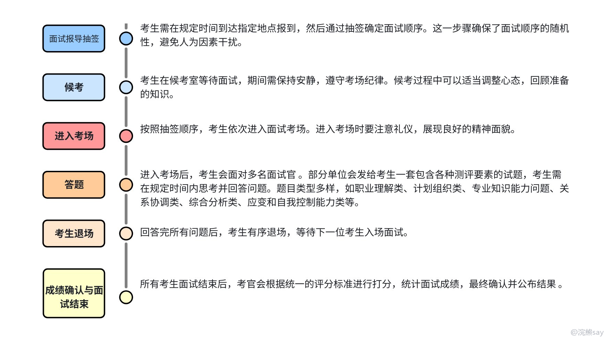
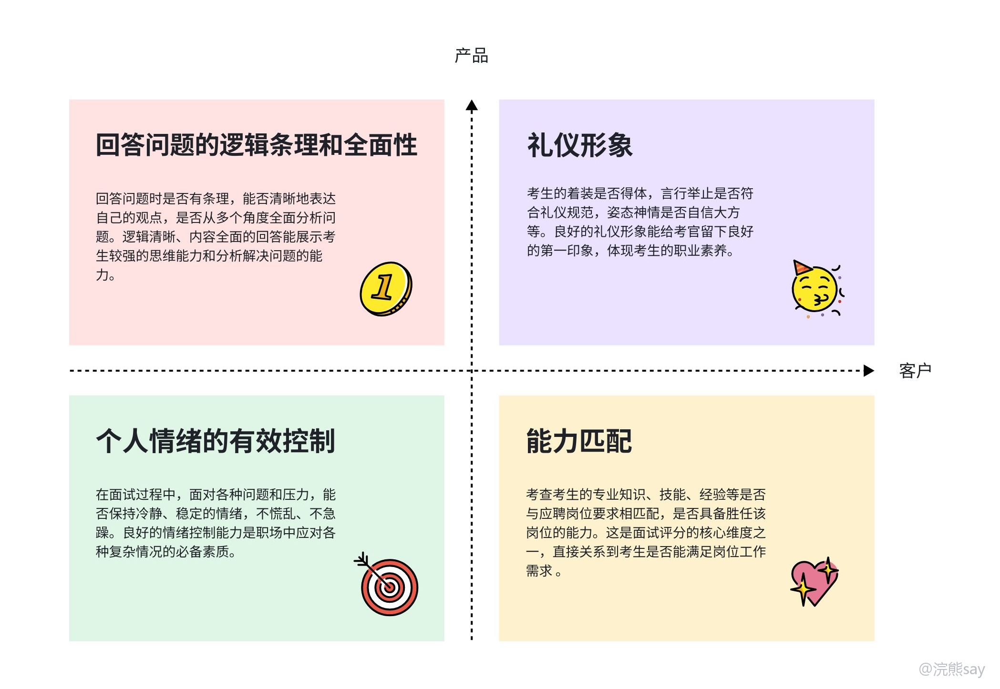

# 结构化面试基础认知

很多同学一听到“结构化面试”，第一反应就是背模板。但央国企结构化面试虽然有固定流程、固定题型和固定评分维度，本质上并不是考谁把模板背得更完整，而是看你面对一个工作场景时，能不能有条理地分析问题、给出稳妥方案，并且体现出和岗位、企业文化匹配的状态。

所以这类面试最忌讳的不是“没话说”，而是答得很满但没有有效信息。你说了一堆“加强沟通、提高认识、总结经验”，考官听完还是不知道你到底会怎么做，这就是结构化面试里最常见的低效表达。

## 一、结构化面试到底是什么

结构化面试，也可以理解成标准化面试。它一般会提前设计好题目、评分标准和面试流程，同一批岗位的考生面对的题型和评价尺度相对一致，这样可以尽量保证公平，它的“结构化”主要体现在三个方面：
| 维度 | 具体表现 | 对考生的影响 |
| --- | --- | --- |
| 流程结构化 | 报到、抽签、候考、入场、答题、退场都有固定安排 | 不要临场乱问、乱发挥，按考场节奏来 |
| 题目结构化 | 常见题型相对固定，如综合分析、计划组织、人际关系、应急处置等 | 可以提前按题型准备框架 |
| 评分结构化 | 考官会围绕表达、逻辑、岗位匹配、情绪状态等维度打分 | 答案要让考官听得出评分点 |

大家准备结构化面试，重点不是背几句金句，而是建立自己的答题框架。框架的作用是让你在紧张的时候不至于乱，而不是让你每道题都说成一个味道。

## 二、央国企结构化面试一般怎么走

不同单位细节会不一样，但整体流程一般比较规范：先按通知时间到达考点，核验身份材料后抽取面试顺序；随后进入候考室等待，手机等物品通常会统一管理；轮到自己时，听引导进入考场，问好、落座，然后根据考官读题或题本要求进行作答。

正式答题通常围绕 2-4 道题展开，有些单位会把结构化、半结构化和专业追问混在一起。答题结束后按要求退场，部分单位会现场公布成绩，部分单位后续再通知结果。

这里需要注意一个点：央国企面试的“规矩感”很重要。不是说大家要表现得很僵硬，而是要让考官感受到你稳、守规则、能进入组织体系工作，比如不要抢话、不要随意打断，也不要在不知道流程时自作主张。

## 三、考官到底在看什么

结构化面试表面上是在问你“怎么看”“怎么办”，本质上是在看你是不是一个适合进入这个单位的人。常见评分维度可以拆成下面几类：
| 评分维度 | 考官关注什么 | 备考时怎么准备 |
| --- | --- | --- |
| 逻辑表达 | 有没有开头、分点、收尾，表达是否清楚 | 训练“先表态、再分析、后落地”的结构 |
| 问题分析 | 能不能看到原因、影响、风险、对策 | 多练分类讨论，不要只说一句“加强管理” |
| 岗位匹配 | 是否理解岗位、企业属性、基层工作特点 | 提前研究目标单位业务、岗位职责、企业文化 |
| 情绪稳定 | 临场是否慌乱，遇到追问是否能稳住 | 平时限时录音练习，减少口头禅和停顿 |
| 价值观契合 | 是否有责任意识、协作意识、服务意识 | 答题时自然体现大局观、纪律性和长期发展意愿 |

对于央国企来说，尤其要注意三个关键词：**稳、实、匹配**。“稳”是情绪和态度稳定，“实”是对策具体、不飘，“匹配”是能把答案落到单位、岗位和工作场景上。

## 四、哪些央国企有结构化面试

很多央国企都会在面试里加入结构化题，比如国家电网、中国石油、中国石化、中国移动、中国联通、中国电信、中国建筑集团，以及不少地方国企、城投、交投、水务、能源类单位。但不同单位的侧重点不一样，不能只问“考不考结构化”，更要看它会往哪类岗位场景靠。
| 单位/岗位类型 | 常见倾向 | 准备重点 |
| --- | --- | --- |
| 考试类央企、地方国企 | 结构化占比可能更高，题目更像公考面试 | 综合分析、计划组织、人际关系、应急处置 |
| 技术类岗位 | 结构化可能和专业面、项目面混在一起 | 项目表达、岗位理解、技术问题后的结构化补充 |
| 基层运行、生产、安全类岗位 | 爱考应急处置、安全意识、服从安排 | 安全生产、应急流程、责任意识 |
| 市场、运营、客服类岗位 | 爱考沟通协调、客户投诉、活动组织 | 人际关系、服务意识、计划组织 |

比如能源类单位更容易结合保供、安全生产、抢修应急来问；通信类单位更容易结合客户服务、网络保障、数字化转型来问；工程建筑类单位则经常绕不开现场管理、质量安全和跨部门协调。

## 五、结构化面试难在哪里

结构化面试的难点不在于题目看不懂，而在于很多同学会答得“正确但无效”。最典型的表现就是全程套话，不分场景，不联系岗位，最后听起来像一篇万能稿。

常见问题有四个：第一，全是“加强沟通、提高认识、总结经验”这类空话；第二，安全事故、群众投诉、同事矛盾都用同一套话术；第三，答案像在考公务员，没有体现央国企和目标岗位；第四，临场表达太散，心里有想法但一开口就绕。

解决办法也很直接：按题型准备框架，按单位准备素材，按真题训练表达。结构化面试不是拼谁背得多，而是看谁能在有限时间内把问题讲清楚。

## 六、怎么开始准备

如果时间比较紧，可以先掌握基础题型框架，包括综合分析、计划组织、人际关系、应急处置；再整理目标单位素材，比如主营业务、重大项目、企业文化、岗位职责和常见工作场景；接着做限时练习，每道题思考 30-60 秒，答题控制在 2-3 分钟；最后通过录音复盘表达问题，重点看自己是否啰嗦、空泛、没有结尾。

这里给大家一个最基础的复盘清单：
| 检查项 | 合格标准 |
| --- | --- |
| 开头 | 10 秒内能回应题干，不绕圈 |
| 分点 | 至少有 2-3 个清晰层次 |
| 动作 | 每个对策都能说出具体做法 |
| 岗位 | 至少有一句能落到单位或岗位 |
| 收尾 | 能总结态度或后续改进 |

结构化面试不是短期完全靠背就能解决的东西，但它可以通过训练快速提分。最重要的是别把答案练成“万能模板”，央国企面试更喜欢稳妥、具体、有岗位理解的表达；大家先把题型框架搭起来，再把目标单位素材塞进去，最后用录音反复修，效果会比单纯背金句好很多。
