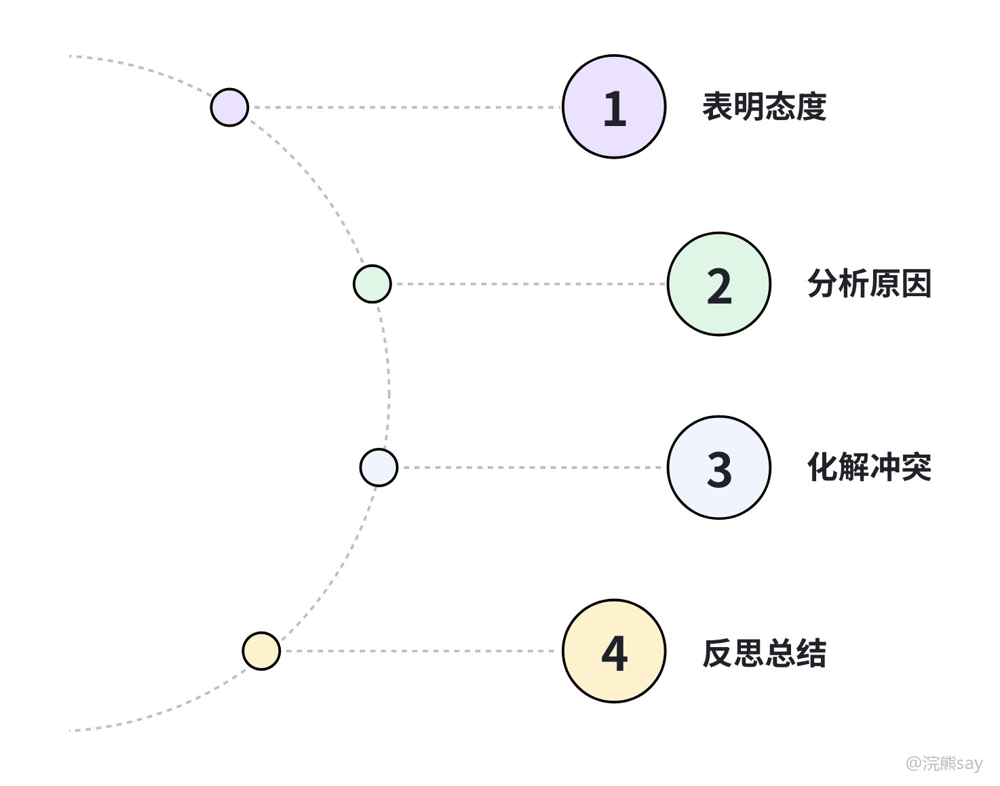

# 结构化面试——人际关系

人际关系题，是很多同学最容易答“假”的题型。题目通常会设置领导误解你、同事不配合、老员工不认可你、群众投诉、下属犯错等场景，让你说怎么办。

这类题的核心不是让你表演“高情商”，而是看你能不能在职场矛盾里稳住情绪、尊重规则、推动工作继续往前走。尤其在央国企语境下，考官很在意你有没有组织感、协作意识和基本的汇报意识。

## 一、这类题考什么

人际关系题本质上考四件事：遇到误解、批评、冲突时能不能稳住情绪；能不能把工作目标放在个人面子前面；能不能找准对象、时机、方式去沟通；最后能不能看到自己的不足并修正。
| 考察点 | 考官想听什么 | 常见失分点 |
| --- | --- | --- |
| 情绪稳定 | 遇到误解、批评、冲突时不急躁 | 抱怨对方、急着解释 |
| 大局意识 | 把工作目标放在个人面子前面 | 只关心自己委屈不委屈 |
| 沟通协调 | 能找准对象、时机、方式 | 只说“加强沟通”，没有具体动作 |
| 反思改进 | 能看到自己的不足并修正 | 全程把责任推给别人 |

央国企尤其看重“组织感”。你可以表达自己的想法，但不能显得不服管、不懂协作、遇到矛盾就情绪化；同时也不能一味讨好，什么问题都说成自己的错，而是要围绕工作目标去解决问题。

## 二、常见关系场景

人际关系题常见对象主要有领导、同事、老员工、群众或客户、下属或新人。不同对象的处理方式不一样，但底层原则一致：先把关系稳住，再把事情解决。
| 对象 | 常见题目 | 答题重点 |
| --- | --- | --- |
| 领导 | 被批评、被误解、意见不一致、临时加任务 | 尊重领导、先执行后反馈、用事实沟通 |
| 同事 | 不配合、抢功、推诿、沟通不畅 | 主动沟通、明确分工、围绕共同目标 |
| 老员工 | 不认可新人建议、习惯旧流程 | 尊重经验、用数据说话、小范围试点 |
| 群众/客户 | 投诉、情绪激动、误解政策 | 倾听记录、解释政策、跟踪反馈 |
| 下属/新人 | 工作失误、情绪低落、能力不足 | 指导帮助、复盘问题、建立机制 |

比如面对领导批评，重点不是解释自己多委屈，而是先接受意见、核实问题、提出改进；面对同事不配合，重点不是给对方贴标签，而是查清原因、明确分工、必要时请示协调。

## 三、答题框架：态度、原因、沟通、改进

人际关系题建议用四步法：先表明态度，再分析原因，然后沟通解决，最后反思改进。这个框架的好处是比较稳，不容易把矛盾答成抱怨，也不容易把答案说得太理想化。

### 1\. 先表明态度

开头要稳，不要一上来就判断谁对谁错。可以这样说：

面对这种情况，我会先保持冷静，把工作顺利推进放在第一位。对于矛盾本身，我会客观分析原因，主动沟通解决，避免因为个人情绪影响团队协作。

这个开头的好处是，先把价值观放稳：工作优先、情绪稳定、主动解决。考官听到这里，至少会觉得你不是一个一遇到矛盾就炸的人。

### 2\. 分析原因，不要只怪别人

人际关系题里，即使题干看起来是对方的问题，也建议先反思自己。常见原因可以从三类说：自身原因，比如沟通不充分、表达方式不合适、准备不够、经验不足；对方原因，比如对情况不了解、工作压力大、存在顾虑、信息不对称；客观原因，比如任务紧、分工不清、流程不顺、资源不足。

比如同事不配合，你不要直接说“他没有团队意识”。可以说：

我会先反思是否自己前期沟通不够充分，导致对方没有理解任务重要性；也会考虑对方手头工作较多，或者对分工安排存在顾虑。

这个表达更成熟，也更符合真实职场逻辑。因为很多矛盾并不是某个人坏，而是信息、分工、压力和沟通方式没有处理好。

### 3\. 沟通解决，动作要具体

“加强沟通”是废话，除非你说清楚怎么沟通。一般可以从时机、方式、内容、结果四个角度展开。
| 维度 | 示例 |
| --- | --- |
| 时机 | 选择对方相对空闲、情绪稳定的时候 |
| 方式 | 私下沟通、书面梳理、会议协商、向领导请示 |
| 内容 | 说明任务目标、听取顾虑、明确分工、确认时间节点 |
| 结果 | 形成共识，必要时请领导协调资源 |

如果是领导场景，注意不要说“说服领导”，更稳妥的表达是“向领导补充汇报事实和方案，请领导决策”。如果是群众投诉，重点不是辩解，而是倾听、记录、解释、反馈。

### 4\. 反思总结，形成机制

最后不要只说“以后我会注意”，要落到具体改进。比如：

事后我会复盘这次协作中的问题，今后在任务开始前就把目标、分工、时间节点和风险点讲清楚，并定期同步进展，减少类似误会。

人际关系题的结尾最好体现“下次怎么避免”。如果你只是把这一次矛盾处理完，没有形成改进，答案就容易显得浅。

## 四、高频场景怎么答

### 1\. 领导批评你

基本思路是先接受，再核实，再改进。不要急着解释，更不要说“领导不了解情况”，可以先认真听取批评，记录领导指出的问题；如果确实是自己失误，马上制定改进措施；如果存在信息不完整，选择合适时机补充汇报事实；后续定期反馈进展，避免领导担心。

### 2\. 同事不配合

基本思路是先自查，再沟通，再协调。你可以先反思自己是否分工不清或沟通不到位，再私下了解同事顾虑和工作压力，结合任务目标重新明确分工和时间节点；如果确实影响工作进度，要及时向领导汇报，请求协调资源。

需要注意，向领导汇报不是“告状”，而是为了保障工作。只要你汇报的是事实、方案和风险，而不是情绪和抱怨，这个动作就是合理的。

### 3\. 老同事不采纳你的建议

基本思路是尊重经验，用事实沟通，小范围验证。可以先肯定老同事经验，主动请教他的考虑；再把自己的建议用数据、案例或风险分析讲清楚；如果双方仍有分歧，不要强行争论，可以提出低风险环节先试点，最终服从团队决策，并在执行中继续优化。

### 4\. 群众或客户情绪激动

基本思路是先安抚，再记录，再解决，再反馈。可以把对方引导到相对安静的区域，避免矛盾扩大；耐心听取诉求，完整记录关键事实；属于职责范围内的，说明办理流程和时间，不属于职责范围内的，做好解释和转办引导；后续主动反馈处理结果。

## 五、真题示范

**题目：**

领导安排你和一位老同事合作项目，但他总以经验丰富为由不采纳你的建议，导致工作滞后。你怎么办？

**参考思路：**

第一，我会先保持冷静，把项目推进放在第一位。老同事经验丰富，他的顾虑可能来自过往工作经验，我不会简单认为对方是在否定我。

第二，我会先反思自己的建议是否表达得不够清楚，是否缺少数据支撑，也会主动请教老同事不采纳建议的具体原因。这样既能体现对老同事的尊重，也有助于找到真正影响推进的问题。

第三，在沟通时，我会先肯定老同事的经验，再把自己的方案用数据、案例和风险点讲清楚。如果双方仍有分歧，可以建议选择一个低风险环节先试运行，用实际效果来验证。

第四，如果分歧已经影响项目进度，我会把不同方案的优缺点整理清楚，向领导客观汇报，请领导统筹决策。事后我也会复盘沟通方式，提升自己和不同经验背景同事协作的能力。

## 六、常见误区
| 问题 | 改法 |
| --- | --- |
| 过度委屈 | 少讲个人感受，多讲工作目标 |
| 直接指责 | 先反思自己，再分析对方和客观因素 |
| 沟通空泛 | 讲清楚沟通对象、时机、内容和结果 |
| 不敢汇报 | 工作受影响时要及时请示，不是硬扛 |
| 结尾鸡汤 | 落到分工、流程、同步机制等具体改进 |

人际关系题记住一个原则：不争对错，先保工作；不推责任，主动沟通；不讲空话，形成改进。这样答出来，会比单纯背“我会换位思考、加强沟通”靠谱很多。
