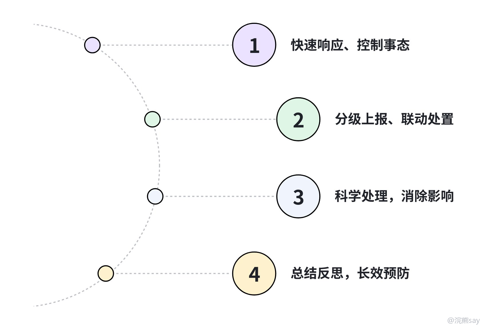

# 结构化面试——应急处置

应急处置题，是央国企结构化面试里非常值得重视的一类题。原因很简单：央国企很多岗位都和生产运行、公共服务、工程建设、客户保障有关，一旦出事，最重要的不是你会不会说漂亮话，而是能不能先稳住现场、保护人员、按流程上报、把影响降下来。

这类题答不好，考官会觉得你缺少安全意识和组织纪律。尤其是能源、通信、建筑、交通、制造这些行业，应急处置往往和岗位实际联系很紧，不能只用“我会冷静处理”这种空话糊弄过去。

## 一、这类题考什么

应急处置题通常会给你一个突发场景，比如设备故障、施工事故、群众投诉、网络舆情、员工突发疾病、数据泄露等，让你说“怎么办”。核心不是让你把所有流程都背出来，而是看你能不能分清轻重缓急。
| 考察点 | 考官关注什么 | 常见失分点 |
| --- | --- | --- |
| 快速反应 | 能不能第一时间控制风险 | 上来就调查原因，忽视人员安全 |
| 流程意识 | 是否知道报告、联动、留痕 | 自己单打独斗，不请示不上报 |
| 统筹协调 | 能不能调动安保、医疗、技术、宣传等资源 | 只说“我会处理”，没有分工 |
| 善后复盘 | 能不能处理后续影响、防止复发 | 事情结束就结束，没有整改 |

一句话，应急题要答出“先救人、控现场、按流程、再复盘”。这个顺序不能乱，尤其不能一上来就追责，面试里先追责往往显得你不懂应急优先级。

## 二、央国企常见应急场景

不同单位出题会结合行业特点。大家备考时，要结合目标行业准备几个关键词，比如能源类记住保供、安全、抢修，通信类记住网络保障、客户安抚、信息安全，建筑类记住现场管控、人员救援、质量安全。
| 场景 | 常见题目 | 答题重点 |
| --- | --- | --- |
| 生产安全 | 火灾、设备故障、管线泄漏、施工坍塌 | 生命至上、断电断源、警戒疏散、专业救援 |
| 公共服务 | 停电、断网、客户投诉、窗口冲突 | 安抚群众、解释原因、快速恢复、跟踪反馈 |
| 网络舆情 | 网传负面视频、客户投诉扩散、谣言传播 | 核实事实、统一口径、及时通报、依法处理 |
| 内部管理 | 员工突发疾病、资料丢失、数据泄露 | 先处置风险，再查原因，做好保密和补救 |
| 自然灾害 | 暴雨、台风、地震影响生产运行 | 值班值守、物资保障、政府联动、恢复生产 |

同样是应急题，场景不同，优先级也不同。生产安全先保人、控危险源，网络舆情先核实事实、统一口径，群众冲突先安抚情绪、隔离矛盾，数据泄露则要先切断风险、保全证据。

## 三、答题框架：控制、上报、处置、善后

应急处置题建议用四步法：第一时间控制事态，按流程汇报联动，分类处置降低影响，最后善后复盘防止复发。这个框架适用面很广，但具体内容一定要跟题目场景匹配。

### 1\. 第一时间控制事态

先处理最紧急、最危险、最不可逆的事情。如果有人受伤，先救人；如果有继续扩大的风险，先隔离危险源；如果现场混乱，先维持秩序。

可以这样表达：

我会第一时间到达现场，在保证自身安全的前提下，组织人员撤离到安全区域，设置警戒范围，避免无关人员靠近，同时联系医疗、消防或专业抢修力量。

这里需要注意，不要把“调查原因”和“追究责任”放到最前面。原因要查，责任也要认定，但那是现场风险初步控制后的事情。

### 2\. 按流程汇报和联动

央国企很看重组织纪律，遇到突发事件不能隐瞒，也不能越过必要流程乱汇报。比较稳妥的说法是：

在现场初步控制的同时，我会按照单位应急预案和信息报告要求，及时向直属领导和相关职能部门汇报，并根据事件性质联系安保、医疗、技术、宣传等部门协同处理。

如果题目涉及政府监管、消防、公安、环保等外部部门，可以说“按规定对接相关部门”。这里不要随便编具体时间节点，除非题干或单位制度里明确给了要求。

### 3\. 分类处置，降低影响

中间部分要根据题目类型说具体动作，应急题最怕答案抽象。比如“我会妥善处理舆情”就很虚，可以改成“先核实视频内容和事件真相，统一由宣传或相关负责人对外回应，避免多人多口径，同时持续监测评论区和媒体传播情况”。
| 类型 | 处置动作 |
| --- | --- |
| 安全事故 | 疏散人员、切断危险源、保护现场、配合专业救援 |
| 设备故障 | 启用备用方案、组织抢修、通知受影响对象 |
| 群众冲突 | 安抚情绪、隔离冲突、记录诉求、承诺反馈 |
| 网络舆情 | 核实事实、统一口径、发布说明、持续监测 |
| 数据泄露 | 切断访问、保全日志、评估范围、通知相关部门 |

如果题目同时包含多个矛盾，比如既有安全事故又有网络舆情，就要分线处理。可以说救援组负责现场救援，技术组负责风险排查，宣传组负责信息发布，安保组负责秩序维护，这样答案会更有组织感。

### 4\. 善后复盘，防止复发

事情控制住以后，还要讲善后。一般包括人员救治、家属沟通、客户安抚、损失统计、原因调查、责任认定、整改措施、制度完善、专项培训等。

可以这样收尾：

事后我会配合相关部门复盘事件原因，梳理制度和流程中的薄弱环节，形成整改清单，并通过培训、演练和检查，避免类似问题再次发生。

善后不是为了凑字数，而是体现你有闭环意识。央国企很多岗位对安全、合规、流程要求比较高，能讲到复盘和制度完善，会比单纯说“处理完毕”更稳。

## 四、真题示范

**题目：**

你单位施工现场发生脚手架坍塌，有工人被困，周围群众拍摄视频上传网络，引发关注。作为现场负责人，你如何处理？

**参考思路：**

第一，立即控制现场。我会第一时间启动现场应急预案，组织无关人员撤离，设置警戒范围，同时拨打急救和消防电话，联系专业救援力量，优先保障被困人员生命安全。

第二，及时汇报联动。我会按单位应急报告流程向直属领导、安全管理部门和项目负责人汇报，同步协调安保、医疗、技术和宣传人员到场，明确各小组分工。

第三，做好现场处置和舆情应对。救援组负责配合专业力量救援被困人员，技术组排查二次坍塌风险，安保组维护现场秩序；对于网络视频，会由单位统一核实并发布权威信息，说明救援进展，避免谣言扩散。

第四，做好善后和整改。事件结束后，配合调查事故原因，关心伤员救治和家属沟通，开展脚手架、临边防护等专项检查，完善安全培训和现场巡检制度。

这个答案的重点不是“说得狠”，而是把救援、上报、舆情、整改都覆盖到。应急题的成熟感，往往就来自这种优先级清楚、分工清楚、后续清楚。

## 五、常见误区
| 问题 | 改法 |
| --- | --- |
| 上来先追责 | 先救人、先控风险，责任调查放到善后 |
| 不会上报 | 按单位预案向领导和相关部门汇报 |
| 单兵作战 | 明确安保、医疗、技术、宣传等协同 |
| 忽略群众情绪 | 对投诉、围观、舆情要有安抚和解释 |
| 结尾太空 | 具体说整改清单、培训演练、制度完善 |

应急处置题要记住一个底层顺序：生命安全优先，风险控制优先，组织流程优先，后续整改不能少。只要这个顺序不乱，答案基本就不会跑偏。
