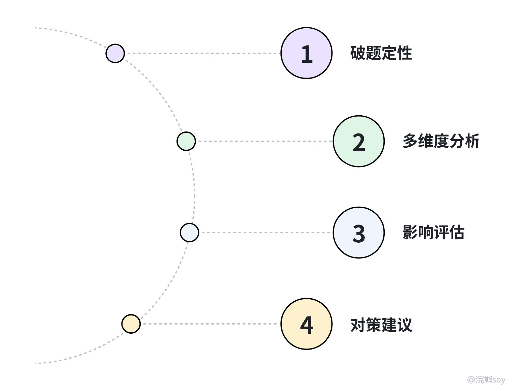

# 结构化面试——社会现象

社会现象题，经常让同学觉得“我知道这件事，但不知道怎么讲得像面试答案”。比如让你谈全职儿女、银发经济、人工智能、灵活就业、预制菜进校园、短视频沉迷、网络暴力、年轻人逃离制造业等，平时聊天大家都能说几句，但面试里需要的是有判断、有分析、有对策。

这类题的重点不是你知道多少热点，而是你能不能把一个社会现象拆开，讲清楚它为什么出现、影响是什么、该怎么规范或引导。央国企面试里，这类题还经常带一点公共责任视角，不能只站在普通网友的角度吐槽。

## 一、这类题考什么

社会现象题一般考四个能力：能不能对现象做稳妥定性，能不能从多主体、多原因拆解，是否有基本政策意识，以及能不能联系央国企责任和公共服务。
| 考察点 | 考官想听什么 | 常见失分点 |
| --- | --- | --- |
| 价值判断 | 能不能对现象做稳妥定性 | 非黑即白，情绪化评价 |
| 分析能力 | 能不能从多主体、多原因拆解 | 只从个人感受出发 |
| 政策意识 | 是否知道政府、企业、社会各自该做什么 | 对策只有“加强监管” |
| 岗位视角 | 能不能联系央国企责任和公共服务 | 答案像普通热点评论 |

也就是说，你不能只说“我觉得这个现象不好”或者“这个现象挺正常”。面试答案要能看到政府治理、企业责任、社会协同和个人选择之间的关系，这样才像结构化面试，而不是随口聊热点。

## 二、央国企爱考哪些方向

常见方向可以分成科技发展、民生服务、青年就业、经济发展、文化网络、绿色低碳几类。备考时不建议死背热点，更实用的方法是准备一套分析框架，然后用不同素材填进去。
| 方向 | 典型话题 | 答题重点 |
| --- | --- | --- |
| 科技发展 | AI、大数据、数字化转型、数据安全 | 技术进步与伦理、隐私、安全的平衡 |
| 民生服务 | 养老、医疗、教育、老旧小区改造 | 公平可及、服务质量、基层治理 |
| 青年就业 | 慢就业、全职儿女、灵活就业、逃离制造业 | 理解压力，但强调能力提升和长期发展 |
| 经济发展 | 消费券、地摊经济、银发经济、县域经济 | 激发活力，同时规范秩序 |
| 文化网络 | 网络暴力、短视频沉迷、国潮文化 | 正向引导、平台责任、公众素养 |
| 绿色低碳 | 双碳、绿色转型、新能源下乡 | 发展和环保协同，不能一刀切 |

比如谈人工智能，不要只说“会提高效率”或者“会抢工作”，而要讲清楚技术进步带来的效率提升、就业结构变化、数据安全风险，以及政府、企业、个人分别该怎么应对。

## 三、答题框架：定性、分析、影响、对策

社会现象题建议用四步逻辑链：先定性，再分析原因，接着评价影响，最后提出对策。这个顺序很稳，适合大多数热点和争议类题目。

### 1\. 破题定性

开头要先说明你怎么看。常见定性有三种：正向现象可以说值得肯定但要持续完善；负面现象可以说需要重视，背后有深层原因；争议现象则不要简单否定，也不要放任发展，而是需要规范引导。

可以用这个句式：

我认为这一现象不能简单地肯定或否定。它一方面反映了……，另一方面也暴露出……，需要在理解现实原因的基础上进行规范和引导。

这个开头适合大多数争议类题目，因为它既有态度，也没有把复杂问题说死。

### 2\. 多维度分析原因

社会现象题不要只从一个角度看，可以用“主体分析法”来拆。个人层面可以分析观念变化、压力增加、能力结构、消费习惯；企业层面可以分析商业模式、用工方式、技术应用、社会责任；政府层面可以分析政策供给、监管标准、公共服务；社会层面可以分析舆论环境、文化价值、行业发展阶段。
| 主体 | 可以分析什么 |
| --- | --- |
| 个人 | 观念变化、压力增加、能力结构、消费习惯 |
| 企业 | 商业模式、用工方式、技术应用、社会责任 |
| 政府 | 政策供给、监管标准、公共服务 |
| 社会 | 舆论环境、文化价值、行业发展阶段 |

也可以用“原因分类法”，从经济原因、技术原因、制度原因、观念原因去讲。比如一个现象既可能和收入压力有关，也可能和新技术扩散有关，还可能和规则滞后、公众认知变化有关。

### 3\. 评价影响，别只说好或坏

影响部分要有辩证感。比如人工智能，一方面能提高效率、释放重复劳动、创造新岗位；另一方面也会带来就业替代焦虑、数据隐私、算法偏见等问题，关键不是因为风险否定技术，也不是因为效率忽视治理。

可以这样表达：

这一现象一方面能够提升效率、满足新的社会需求；另一方面，如果缺少规则约束，也可能带来公平、安全和责任边界方面的问题。因此关键不是简单叫停，而是在发展中规范，在规范中发展。

这类表达比“有利有弊”更完整，因为它不仅说了两面，还给出了处理方向。

### 4\. 提出对策，要具体到主体

对策不要只说“加强监管”。建议按政府、企业、平台或媒体、个人来讲，这样答案会更具体，也更像真正的治理思路。
| 主体 | 对策表达 |
| --- | --- |
| 政府 | 完善标准、加强监管、优化公共服务、提供政策引导 |
| 企业 | 履行社会责任、建立自查机制、保护用户权益 |
| 平台/媒体 | 做好内容审核、信息提示、正向宣传 |
| 个人 | 提升辨别能力、遵守规则、理性选择 |

如果题目和央国企相关，最好补一句企业视角。比如可以说，对于央国企来说，更要在追求效率的同时守住安全、合规和社会责任底线，发挥示范带动作用。

## 四、真题示范

**题目：**

近年来“全职儿女”现象引发热议，一些年轻人选择在家照顾父母并获取生活费。你怎么看？

**参考思路：**

第一，我认为“全职儿女”不能简单地贴标签。它一方面反映了老龄化背景下家庭照护需求增加，另一方面也和部分年轻人的就业压力、职业迷茫有关，需要理性看待。

第二，从积极角度看，这种方式在一定程度上能够缓解家庭养老压力，增加亲子陪伴，也让一些家庭在特殊阶段有了过渡方案。它不是完全没有价值，但要看到它更适合作为阶段性选择，而不是长期依赖。

第三，从风险角度看，如果年轻人长期脱离劳动力市场，可能影响职业发展，也容易让家庭关系从亲情互助变成经济依赖，甚至产生新的矛盾。因此不能只看到温情的一面，也要看到长期发展的压力。

第四，解决这个问题不能只靠家庭内部消化。政府层面可以完善社区养老、喘息服务等支持；企业层面可以探索更灵活的用工方式；年轻人自身也要把它看成阶段性选择，持续提升能力，保持重新进入职场的可能。

最后，我认为这类现象提醒我们，面对社会变化要有包容理解，但也要引导年轻人建立长期发展意识。

## 五、常见误区
| 问题 | 改法 |
| --- | --- |
| 只讲个人感受 | 加入政府、企业、社会等主体视角 |
| 观点太绝对 | 争议现象多用辩证表达 |
| 对策太空 | 把“加强监管”拆成标准、执法、平台责任、公众教育 |
| 热点堆太多 | 少背材料，多讲清楚逻辑 |
| 脱离央国企 | 结尾联系公共服务、社会责任、合规经营 |

社会现象题最重要的是逻辑。大家记住一个万能但不空的顺序：先定性，再找原因，再看影响，最后按主体提对策；只要能把这个顺序练熟，大多数热点题都不会完全没话说。
