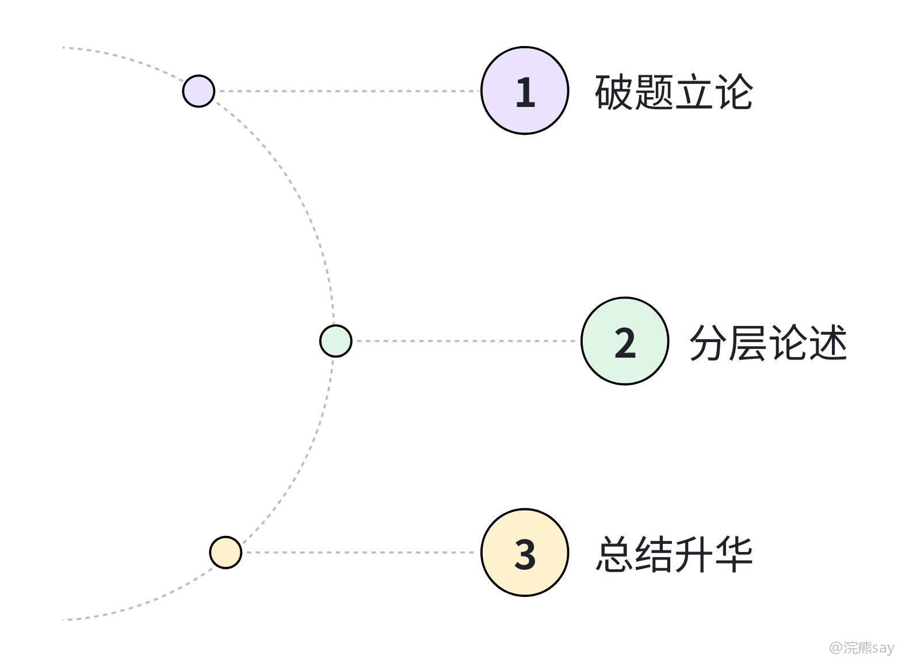

# 结构化面试——观点态度题

观点态度题是结构化面试里很常见的一类题，通常会给你一句话、一个观点或一个价值判断，让你谈理解。比如“年轻人应该躺平吗”“如何理解功成不必在我，功成必定有我”“效率和公平哪个更重要”，这些题表面上考表达，实际上考的是价值判断稳不稳、论证有没有层次，以及最后能不能落到岗位和行动上。

这类题不要简单理解成背名言、背金句，也不要空喊口号。考官更想看的是，你面对一个有争议或有价值导向的问题时，能不能给出成熟、稳妥、符合组织要求的判断。

## 一、这类题到底考什么

观点态度题的核心不是“说得漂亮”，而是“判断清楚”。尤其在央国企面试里，大家不能只站在纯个人感受上说话，还要能回到组织、岗位、服务对象和企业发展上。
| 考察点 | 考官想听什么 | 常见失分点 |
| --- | --- | --- |
| 立场判断 | 能不能明确表态，必要时辩证分析 | 开头绕半天，不知道到底支持还是反对 |
| 逻辑论证 | 能不能从原因、意义、风险、实践等角度展开 | 只会说“很重要”“很有意义” |
| 价值契合 | 是否体现责任意识、大局意识、奋斗意识 | 过度强调个人利益和情绪 |
| 岗位落地 | 能不能结合未来工作说怎么做 | 结尾喊口号，不知道和岗位有什么关系 |

所以大家在准备这类题时，不要把重点放在“有没有高级词”上，而是要训练自己先表态、再解释、最后落地。开头要让考官知道你的判断，中间要让考官听到你的理由，结尾要让考官看到你未来会怎么做。

## 二、央国企常见命题方向

央国企的观点态度题一般不会特别“网感”，它更喜欢围绕价值观、责任担当、组织纪律、企业发展来出题。大家不用把所有热点都背一遍，更实用的做法是准备几个高频价值词，比如责任、奋斗、协作、创新、合规、服务、长期主义，很多题都可以围绕这些词展开。
| 题目方向 | 典型问题 | 答题重点 |
| --- | --- | --- |
| 奋斗与成长 | 如何看待躺平、内卷、吃苦耐劳 | 反对消极躺平，也不鼓励无效内卷，强调目标明确、踏实成长 |
| 个人与集体 | 如何理解团队合作、螺丝钉精神 | 个人价值要在组织目标中实现，不能只讲个人得失 |
| 改革与创新 | 如何看待国企改革、数字化转型、科技自立自强 | 既要支持创新，也要注意合规、安全和长期主义 |
| 责任与担当 | 如何理解基层锻炼、急难险重任务 | 体现服从安排、解决问题、主动补位 |
| 规则与效率 | 效率优先还是公平优先、结果重要还是过程重要 | 辩证看待，强调依法合规基础上的效率 |

比如谈“奋斗”，不要只说年轻人要吃苦，而要讲清楚为什么要奋斗、奋斗和无效内卷有什么区别、进入央国企以后如何把个人成长和组织需要结合起来。这样答案才不会变成泛泛而谈。

## 三、答题框架：表态、分析、落地

观点态度题建议用三段式：先表态，再分析，最后落地。这个框架不复杂，但要注意每一段都要说出有效信息，不能只是把“我认为很重要”换几种说法重复一遍。

### 1\. 先表态：不要一上来就绕

开头要直接回应题干。如果观点明显正确，可以先肯定；如果观点有争议，可以说“需要辩证看待”；如果观点明显消极，比如躺平、投机取巧，就要明确不认同。

可以用这个句式：

我认为这个观点有一定道理，但不能片面理解。结合央国企工作实际，我更倾向于从三个角度来看：一是……，二是……，三是……。

也可以这样说：

我不认同把这个问题简单理解为……。在我看来，真正重要的是在明确目标的基础上，把个人成长和组织需要结合起来。

### 2\. 再分析：至少讲出两个层次

中间部分不要只堆形容词，要把观点拆开讲。一般可以从现实背景、组织需要、个人成长、风险边界这几个角度切入，具体选哪几个，要看题目本身。
| 维度 | 适合什么题 | 示例表达 |
| --- | --- | --- |
| 现实背景 | 社会热点、青年就业、企业改革 | 当前行业变化快，岗位能力要求也在提高 |
| 组织需要 | 央国企责任、公共服务、重点工程 | 央国企承担的不只是经营任务，还有民生保障和社会责任 |
| 个人成长 | 奋斗、基层锻炼、长期主义 | 年轻人要通过具体任务积累经验，而不是只追求短期舒适 |
| 风险边界 | 创新、效率、结果导向 | 创新不能突破合规底线，效率也不能牺牲安全质量 |

这里的重点是，每个分点后面都要补一句解释。不要只说“第一，要有责任意识；第二，要有创新精神；第三，要有团队意识”，这类答案听起来整齐，但其实没有讲出什么内容。

### 3\. 最后落地：说自己以后怎么做

观点态度题一定要收回到自己，结尾可以从岗位行动、学习提升、团队协作三个方向落地。比如可以说：

如果未来有机会进入单位，我会一方面尽快熟悉岗位流程和业务规范，另一方面在具体任务中主动补位、及时复盘，把这种认识落实到每一次交付、每一次协作和每一次服务中。

这种表达比“我将贡献青春力量”更具体，也更像真实面试里的回答。口号不是不能用，但如果只有口号，没有岗位动作，考官很难给高分。

## 四、高频题怎么答

### 1\. “躺平”与“奋斗”

这类题不要简单骂年轻人，也不要无脑拔高。比较稳妥的表态是：不认同消极躺平，但也要反对无效内卷，真正需要的是目标清晰、节奏合理、长期坚持的奋斗。

展开时可以先承认躺平背后有就业压力、成长焦虑等现实原因，不能只做道德批评；再指出如果长期逃避责任，会影响个人成长，也不符合组织对青年员工的期待；最后落到提升本领，把精力放在能产生积累的事情上。

### 2\. “过程重要”还是“结果重要”

这类题建议辩证回答。央国企场景下，结果当然重要，但过程必须合规，尤其是安全生产、工程建设、资金使用、客户服务这些领域，不能为了短期结果忽视流程规范。

可以这样说：

我认为结果和过程不是对立关系。结果体现工作成效，过程决定结果是否可持续、是否经得起检查。对于央国企来说，很多工作涉及公共利益和安全责任，更不能为了短期结果忽视流程规范。

### 3\. “专业能力”和“人际关系”哪个更重要

比较好的判断是：专业能力是基础，沟通协作是放大器。尤其在央国企，很多工作不是一个人闭门完成的，而是跨部门、跨层级、跨专业协作，只会技术但说不清、推不动，也会影响结果。

所以回答时不要把二者对立起来。可以先说明专业能力决定你能不能把事情做对，再说明沟通协作决定你能不能把事情推动起来，最后落到自己会在提升业务能力的同时，主动适应团队协作方式。

## 五、常见误区
| 问题 | 改法 |
| --- | --- |
| 立场模糊 | 开头 10 秒内给出态度，不要一直铺垫 |
| 金句太多 | 金句只能点缀，核心还是解释和行动 |
| 论证空泛 | 每个分点后面补一句“为什么”或“怎么做” |
| 脱离岗位 | 结尾至少联系一次目标单位、岗位职责或工作场景 |
| 过度绝对 | 对争议题保持辩证，不要把复杂问题说死 |

观点态度题的核心，不是让你说得多漂亮，而是让考官觉得你判断稳、价值观正、能落到工作里。大家练习时可以记住一句话：先把观点讲明白，再把道理讲清楚，最后把自己放进去。
