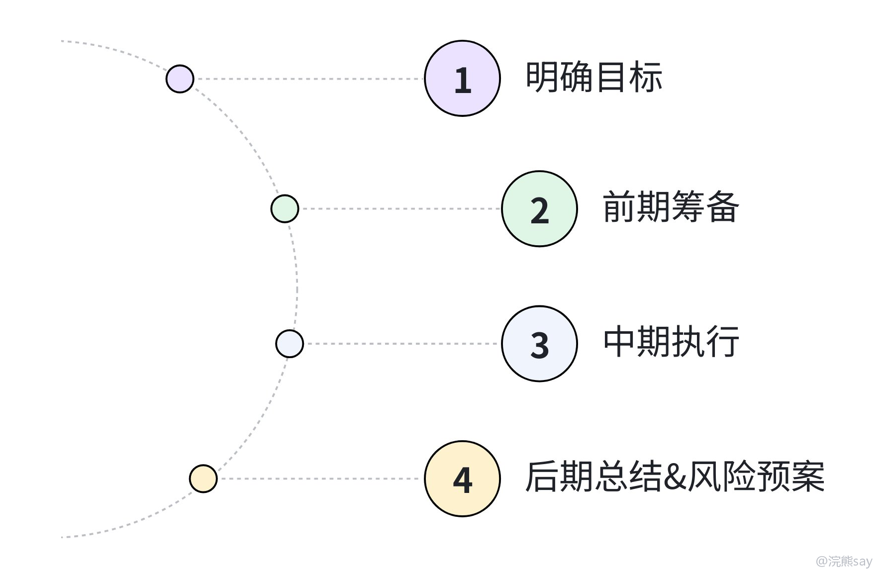

# 结构化面试——计划组织

计划组织题一般会让你负责一次会议、调研、培训、宣传、活动、演练或者项目推进。这类题看起来很简单，很多同学都会说“我会提前准备、认真组织、做好总结”，但问题是考官听完以后，可能还是不知道你到底准备了什么、怎么组织、最后怎么证明有效。

计划组织题想拿分，关键不是流程背得全，而是目标清楚、分工明确、动作具体、结果可评估。说白了，考官想知道这件事交给你，你是不是真的能推进下去。

## 一、这类题考什么

计划组织题本质上是在考你有没有基本的工作推进能力。进入央国企以后，很多新人不一定一上来就做多复杂的决策，但经常会接触会议筹备、材料整理、活动执行、调研走访、专项检查这些工作，结构化面试就会通过这类题，看你是不是能把事情办稳。
| 考察点 | 考官想听什么 | 常见问题 |
| --- | --- | --- |
| 目标意识 | 知道这件事为什么做、要达到什么效果 | 只讲流程，不讲目的 |
| 统筹能力 | 能安排时间、人员、物资、预算、流程 | 想到哪说到哪 |
| 协调能力 | 能和部门、领导、外部单位沟通 | 缺少责任分工 |
| 风险意识 | 能提前想到突发情况和预案 | 全程假设一切顺利 |
| 结果意识 | 能总结复盘、沉淀成果 | 最后只说“形成报告” |

一句话，计划组织题要答出“像个能干活的人”。如果你的答案只有大词，没有时间、对象、分工、成果，考官很难相信你真的理解这个工作。

## 二、央国企常见命题场景

央国企的计划组织题，不太会只考普通聚餐、团建这种题，它更喜欢和党建、安全、调研、宣传、业务推进结合起来。大家备考时，可以把目标单位的主营业务套进去，比如能源类单位多想安全生产、保供、双碳，通信类单位多想数字化、客户服务、网络安全，建筑类单位多想项目管理、质量安全、现场协调。
| 场景 | 常见题目 | 答题重点 |
| --- | --- | --- |
| 党建学习 | 组织一次主题党日、理论学习、青年座谈 | 党建与业务结合，避免形式主义 |
| 安全生产 | 开展消防演练、安全检查、隐患排查 | 安全第一、流程合规、记录留痕 |
| 调研走访 | 调研客户需求、基层问题、政策执行效果 | 样本选择、访谈提纲、数据分析 |
| 宣传活动 | 企业开放日、政策宣讲、志愿服务 | 受众定位、传播渠道、舆情风险 |
| 业务推进 | 数字化转型交流会、项目复盘会 | 问题导向、成果转化、后续跟踪 |

不同场景的答题重点不一样。调研类题要讲清楚样本怎么选、问题怎么问、数据怎么收；安全演练类题要强调预案、现场警戒、医疗保障、设备检查；宣传活动类题则要注意口径统一和舆情风险。

## 三、答题框架：目标、准备、执行、总结、预案

计划组织题建议用五步法：先明确目标，再做好准备，然后组织执行，接着总结转化，最后补充风险预案。这个框架足够覆盖大多数题目，关键是每一步都要有具体动作。

### 1\. 明确目标和原则

开头先说这件事要解决什么问题，不要一上来就“我会成立工作小组”。工作小组是手段，不是目的，目标说清楚了，后面的流程才不会显得机械。

可以这样开头：

我会先明确本次活动的核心目标：一是让参会人员真正了解数字化转型的典型做法，二是收集各部门在落地中的实际困难，三是形成后续可推进的试点清单。

央国企场景下，还可以补一句原则：

在组织过程中，我会坚持务实、节约、合规的原则，避免把活动办成只重形式的材料工程。

### 2\. 做好前期准备

前期准备至少讲四件事：先请示领导，确认目标、预算、时间和参与范围；再摸清需求，通过问卷、访谈、历史资料了解参与对象和实际问题；接着制定方案，明确流程、分工、时间表、物资清单；最后协调资源，联系场地、专家、设备、宣传、后勤等。

如果题目给了具体身份，比如你是团委干部、办公室人员、项目负责人，前期准备就要结合身份说。不要所有题都一上来“成立专项小组”，有些小任务不需要这么重的表达。

### 3\. 过程执行要有抓手

中期执行不能只说“有序开展”，可以按流程讲，也可以按小组讲。这里的关键是给考官画面感，你说“我会做好现场管理”，不如说“我会提前完成设备联调，现场安排一名同事负责控时，一名同事负责签到和资料发放”。
| 执行模块 | 可以说的动作 |
| --- | --- |
| 宣传通知 | 发布通知、明确时间地点、说明参与要求 |
| 现场组织 | 签到、引导、控时、设备调试、秩序维护 |
| 内容推进 | 主题分享、案例展示、分组讨论、实操演练 |
| 记录留痕 | 拍照、会议纪要、问题清单、反馈表 |
| 突发处理 | 人员缺席、设备故障、流程超时、舆情误读 |

如果现场环节比较多，可以用“会前、会中、会后”来展开；如果涉及多个部门，可以用“宣传组、执行组、后勤组、记录组”来展开。结构不是固定的，重点是让考官知道你能把任务拆开。

### 4\. 后期总结要能转化

很多同学最后一句就是“活动结束后，我会总结经验，形成报告”，这不够。计划组织题的后期总结最好答出三个层次：收集反馈，形成成果，跟踪落地。

比如可以说：

活动结束后，我会把各部门提出的问题整理成清单，按照“立即解决、协调解决、长期跟踪”三类分类，并报领导审阅，推动形成后续试点安排。

这个表达比单纯说“形成报告”有效，因为它说明了报告怎么用、问题怎么转化、后续怎么推进。央国企面试里，能把活动结果沉淀成机制或清单，会显得更像真实工作。

### 5\. 提前准备风险预案

计划组织题想答得成熟，一定要有风险意识。风险预案不用说太多，但说一两点会明显比普通答案更稳。
| 风险 | 预案 |
| --- | --- |
| 参与度低 | 提前和部门负责人沟通，明确参与要求 |
| 设备故障 | 提前联调，准备备用电脑、投影、网络 |
| 流程超时 | 设置控时人员，压缩非核心环节 |
| 现场安全 | 做好人员引导、医疗包、应急联系人 |
| 舆情风险 | 对外宣传统一口径，重要内容先审核 |

如果题目本身没有明显风险，不用硬塞一大段预案；但涉及安全演练、对外宣传、群众参与、媒体报道时，风险意识一定要体现出来。

## 四、真题示范

**题目：**

你单位计划开展“数字化转型经验交流会”，领导让你负责，你会如何组织？

**参考思路：**

第一，我会先和领导确认本次交流会的目标。重点不是简单开会，而是梳理各部门数字化转型中的实际问题，学习成熟经验，并形成后续可推进的试点清单。

第二，做好前期准备。我会先向各部门收集数字化工具使用情况和业务堵点，筛选出共性问题；同时联系内部信息化部门、优秀试点部门以及外部专家，确定分享主题和会议议程。

第三，组织现场实施。会议可以采用“案例分享+问题研讨+工具展示”的形式，现场安排专人负责签到、控时、设备保障和会议记录，确保讨论不空泛，问题能够被记录下来。

第四，推动成果转化。会后我会整理形成问题清单和优秀案例汇编，按照短期优化、试点推进、长期建设三类提出建议，报领导审阅后跟踪落实；同时提前做好预案，比如专家临时无法到场时改为线上接入，设备故障时准备备用电脑和网络，确保活动顺利完成。

## 五、常见误区
| 问题 | 改法 |
| --- | --- |
| 只讲流程 | 开头先讲目标，最后讲成果 |
| 没有分工 | 说清楚谁负责宣传、现场、后勤、记录 |
| 忽视合规 | 涉及预算、采购、宣传时要有审批意识 |
| 没有细节 | 增加签到、控时、反馈表、问题清单等具体动作 |
| 总结空洞 | 把“形成报告”改成“问题分类+责任人+时间节点” |

计划组织题不需要讲得花里胡哨。真正好用的答案，是让考官听完觉得：这个同学知道事情怎么推进，也知道哪些地方容易出问题，交给他一项具体工作，大概率能办成。
