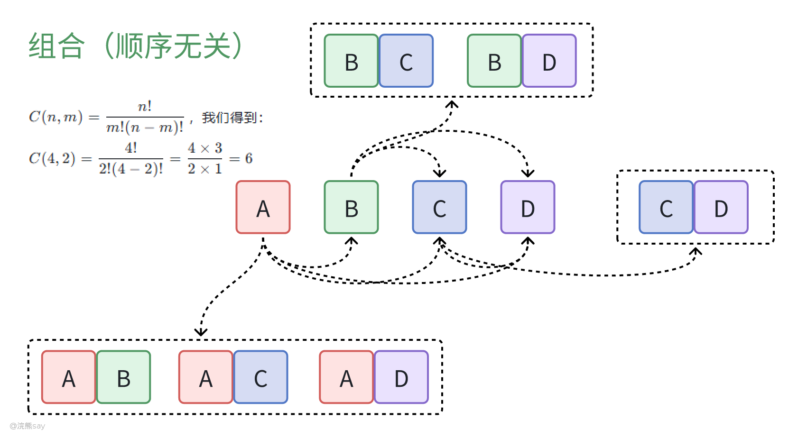
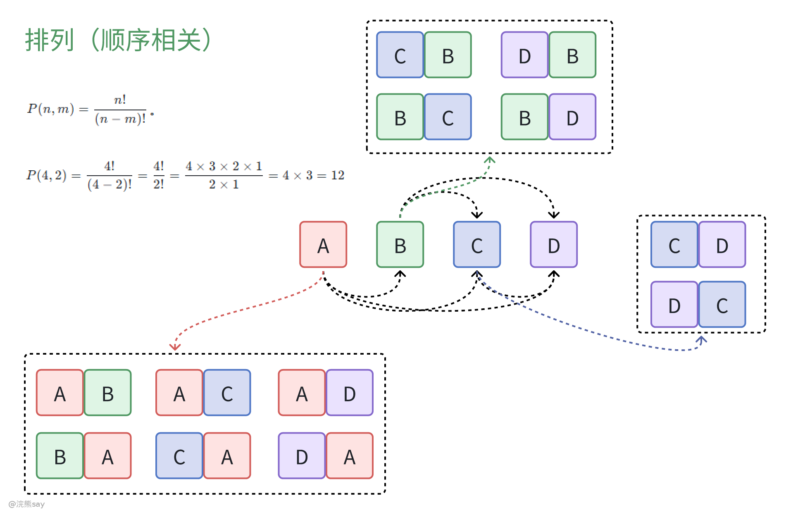
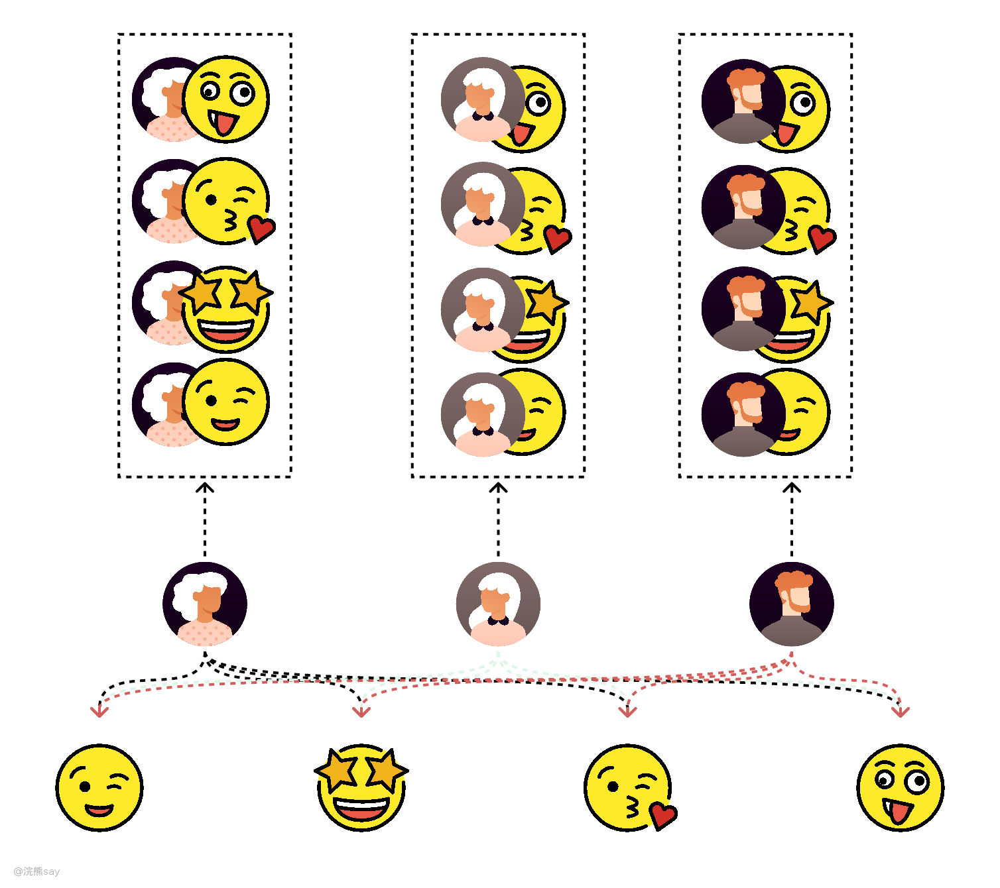
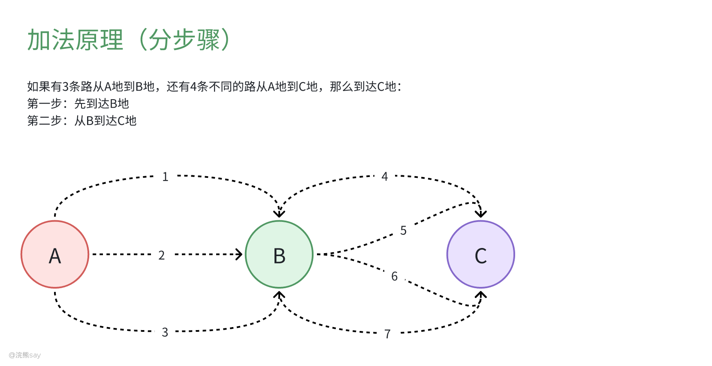

# 排列组合
## 什么是排列组合？

排列组合是我们高中就学过的概率相关章节的基础知识，简单来说就是用来解决大家排队有多少种排法的问题，排列和组合的区别在于——是否关注顺序。

**1. 排列（Permutation）:**
   当我们从n个不同元素中取出m个元素排成一列，不同的顺序被视为不同的排列，也称为”n排m“这时的计算公式为： $P(n, m) = \frac{n!}{(n-m)!}$
   其中 $n!$ 表示n的阶乘，即 $n! = n \times (n-1) \times ... \times 2 \times 1$，特别地，$0! = 1$。

**2. 组合（Combination）:**
   如果我们只关心从n个不同元素中取出m个元素而不考虑它们的顺序，那么这就是一个组合问题, 这也被称为“n选m”，组合的计算公式为：  $C(n, m) = \frac{n!}{m!(n-m)!}$
## 组合例子

对于4个字母A、B、C、D，从中选择2个字母的所有可能的组合（不考虑顺序），使用组合公式 $C(n, m) = \frac{n!}{m!(n-m)!}$，我们得到：
$C(4, 2) = \frac{4!}{2!(4-2)!} = \frac{4 \times 3}{2 \times 1} = 6$
这表示有6种不同的方式来选择这两个字母：AB、AC、AD、BC、BD、CD。注意这里的顺序不重要，所以AB和BA被视为相同的组合。

## 排列例子

现在，如果我们关心的是从这4个字母中选取2个字母，并且这次要考虑它们的顺序，这就是一个排列的问题了。排列公式是 $P(n, m) = \frac{n!}{(n-m)!}$。

对于同样的4个字母A、B、C、D，如果我们要选出2个字母并考虑它们的顺序，那么计算方法如下：
$$P(4, 2) = \frac{4!}{(4-2)!} = \frac{4!}{2!} = \frac{4 \times 3 \times 2 \times 1}{2 \times 1} = 4 \times 3 = 12$$

这意味着一共有12种不同的排列方式。具体来说，这些排列包括：AB, BA; AC, CA; AD, DA; BC, CB; BD, DB; CD, DC; 每个组合都有两种排列方式，因为一旦选择了两个字母，它们可以以两种不同的顺序排列。因此，排列的数量是组合数量的两倍，在这个例子中就是 $6 \times 2 = 12$。

# 计数原理

**1. 分步计数原理（乘法原理）：** 完成一件事需分成 n 个步骤，各步骤分别有 $m_1、m_2……m_n$ 种不同方法，那么完成这件事总共就有 $N = m_1×m_2×…×m_n$ 种不同方法，强调做事的步骤关联性，各步骤相互依存，需依次完成。

例如：如果有3件不同的上衣和4条不同的裤子，那么可以搭配出 3×4=123×4=12 种不同的服装组合。

**2. 分类计数原理（加法原理）：** 完成一件事有 n 类办法，每类办法中分别有 $m_1、m_2……m_n$ 种不同方法，完成此事共有 $N = m_1 + m_2 +…+ m_n$ 种不同方法，关键在于分类时要做到标准统一、不重不漏，各类办法是相互独立的不同途径。

例如，如果有3条路从A地到B地，还有4条不同的路从A地到C地，那么从A地出发，要么到达B地要么到达C地的路径总数为3 + 4 = 7条

# 真题

例1：滑雪和滑冰是冬奥会的两大项赛事，其中高山滑雪、自由式滑雪、单板滑雪、跳台滑雪、越野滑雪和北欧两项是滑雪大项中的6个分项，短道速滑、速度滑冰和花样滑冰是滑冰大项中的3个分项。小林打算去现场观看比赛，共选择6个项目，并且每个大项不少于1个，若所有项目比赛时间均不交叉，则不同的观赛方式有：

A. 83种  
B. 84种  
C. 92种  
D. 102种  

解答：小林需要选择6个项目，并确保每个大项（滑雪和滑冰）至少选一个。通过组合公式计算每种情况的组合数并相加，我们得到：
- 滑雪选5个，滑冰选1个：$C(6, 5) \times C(3, 1) = 6 \times 3 = 18$
- 滑雪选4个，滑冰选2个：$C(6, 4) \times C(3, 2) = 15 \times 3 = 45$
- 滑雪选3个，滑冰选3个：$C(6, 3) \times C(3, 3) = 20 \times 1 = 20$
将可能的情况相加得到总数：$$18 + 45 + 20 = 83$$答案： A. 83种

例2:某高校开设A类选修课四门，B类选修课三门，小刘从中共选取四门课程，若要求两类课程各至少选一门，则选法有:

A. 18种  
B. 22种  
C. 26种  
D. 34种  

解答：根据A类选修课的选择数量分类讨论：
- A类选1门，B类选3门：$C(4, 1) \times C(3, 3) = 4 \times 1 = 4$
- A类选2门，B类选2门：$C(4, 2) \times C(3, 2) = 6 \times 3 = 18$
- A类选3门，B类选1门：$C(4, 3) \times C(3, 1) = 4 \times 3 = 12$
将这些情况相加得到总数：$$4 + 18 + 12 = 34$$答案： D. 34种
