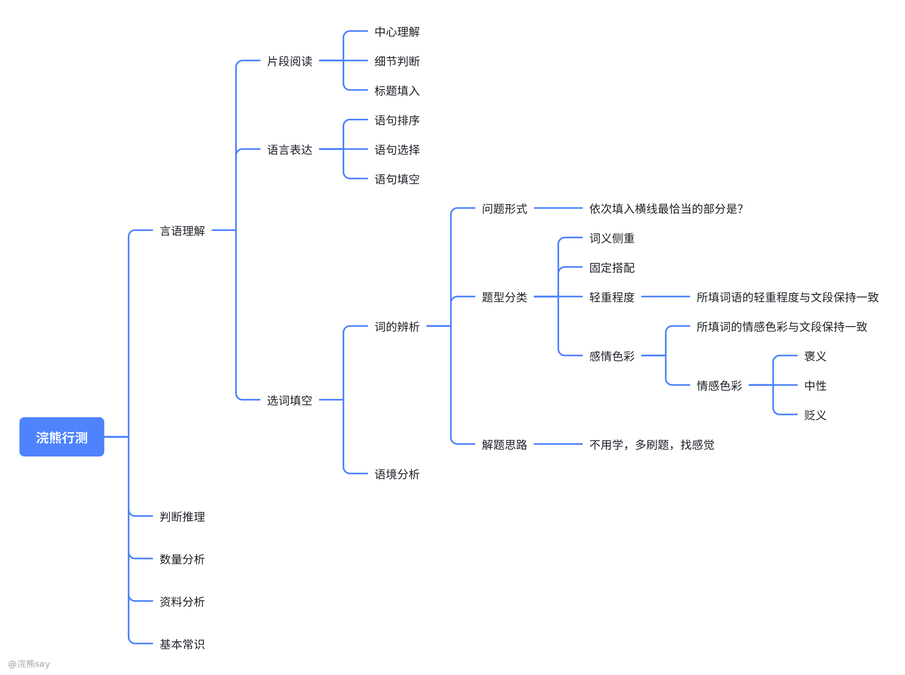
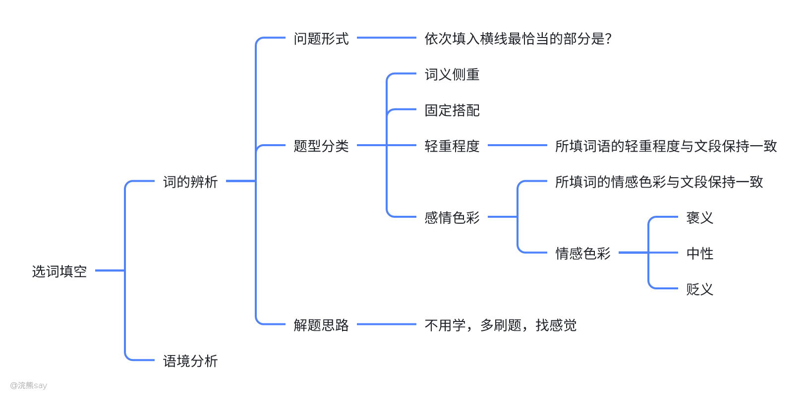

# 考试路线行测学习——先画树干、再填枝叶

我比较推荐的一种学习方法是从宏观到局部的学习方法，无论学习一个什么东西你先搞清楚学习哪些内容，知识脉络是什么然后再去深入学习即可。

就像一棵树，我们先去填充它的树干，再来丰富它的枝叶，让整个学习过程变得更加有趣、目标更加明确，下面我就来详细说说整个方法。

行测学习也是一样，我知道很多课程都是从言语理解开始，老师板着一张脸开始给你讲各种题型的解决办法，各种小窍门。

这些东西有用吗？——非常有用！但是这些课程有个最恶心的点，就是反人类。中国的课程从来都是上来就给你上强度，叫你背这个、背那个，但是从来不告诉你为什么学，为什么背。

相反，我们应该心中有一个知识体系，知识我学习行测首先该学哪些模块，这些模块分别有什么题型，最后才是去学习每个题型的解法和在实战种不断去丰富迭代。

# 知识树行测学习法

## 构建行测知识树——枝干

其实大多数我们去学习一个东西总会学不进去，觉得很烦，听课很烦，看教程看不懂，其核心原因不是因为你笨，也不是你不够努力，而是大多数教程、课程的设计其实是反人类的。

比如你的目标是造飞机，这本来是一个很有意思的东西，但是大多数教材、课程上来就先跟你讲螺丝的100种拧法，你是不是瞬间就对造飞机的课程丝毫没有兴趣了。

相反，我觉得更加合理的学习思路是先知道造飞机分成哪些模块，每个模块分别有什么功能，然后再去逐个拆分，这样才是一种更符合人性的学习方法。

至于螺丝的100种拧法，我觉得最好等到实战的时候再去学习，而不是一上来就给我劝退了。所以说，我们学习的方法其实像一棵树的生长一样——先长枝干，再长树叶。

## 构建行测解题方法——树叶

前面给大家构建好了一个行测学习的知识树，但是这个东西其实是不完整的，没有生命力的，就像一颗树只有枝干没有树叶。

下一步我们的目标就是给树添加树叶，对于行测的树叶来说就是各种题型的解决方法，这也是行测想做的一个事情。

例如：对于”言语理解“的”选词填空“，首先给大家分成了”词的辨析“和”语境分析“两类题型，对于具体的”词的辨析“又会从问题形式、题型分类和解题思路三个角度给大家搭建好这类题型的解题方法。最后通过一个例子来完成我们知识树的构建，如下：

但是，这里需要跟大家说明的是，行测的例子相对来说非常简单，只是让大家快速理解相关的理论，减少大家入门时的学习成本，真的行测考题非常多，这个需要大家下来参考其它资料、刷题迭代来进行补充。

## 海量刷题、疯狂提分

咱们前面的知识树的搭建过程其实相当于造飞机的设计过程，我们理清楚了造飞机分成几步、每步需要干些什么、操作手册是咋样的。

但是，这东西始终是纸上谈兵，没有经历过实战的迭代和检验，这些东西不会有价值。因此，我们下一步就是通过实战不断来丰富和完善自己的知识树。

整个迭代的过程也可以分步骤、分阶段：

第一步：通过刷题的方式来考察自己之前总结的方法是否正确，及时更正不正确的解题思路

第二步：不断添加新的树叶，一种题型可能会有多种不同的解决办法，需要添加进去

不断重复刷题、总结、刷题的循环，来不断完善自己的知识体系。

# 世界上最好的方法，是看似最蠢的方法

不知道在哪里听过这样一句话——”如果你想走捷径，那么一开始就要走看上去最绕远的路，这条路其实才是真正的捷径“

学习其实也是一样，看起来这套方法好像很麻烦，又是搭知识体系，又是丰富知识点啥的，不如直接去b站找一个行测课程从头到尾跟着刷题来得省心。

但是大家扪心自问一下，刷视频课程的时候大家到底有多少时间是专注在课程本身的，还是说只是装装样子今天又学习了好久来安慰自己一下，自己努力过了。

无论对于什么课程，其实学习效果最好的是老师，而不是学生。我们只有亲身去实践、去思考的东西才会是我们掌握最牢固的东西。

哪怕其中某些东西忘掉了，我们可以随时将以前记录的东西拿出来学习，这个过程看似很慢，实则很快。你拿一本行测书，认真去梳理，可能半天不到就能梳理完成”言语理解“一章的内容，而不是去看课程，看了又忘、忘了又看。

自我感动是最不可取的，我们需要问问自己到底掌握了多少，总结了多少东西，这些才会最终体现到你的分数上。

# 资料推荐

1.  知识树搭建——行测

2.  知识树丰富——行测、粉笔行测、真题

3.  刷题迭代——历年真题
