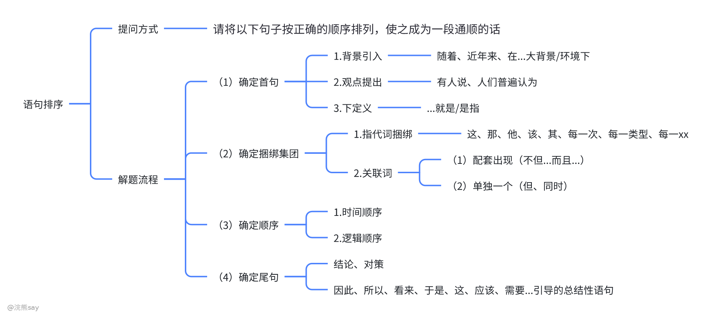
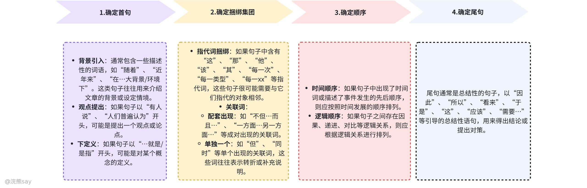

# 什么是语句排序？

“语句排序”题型要求考生将给定的一组句子按照逻辑顺序重新排列，使其成为一个连贯、合理的段落。这种题型主要考察考生的逻辑思维能力和语言组织能力，下面是一个详细的解题流程和技巧的思维导图：

# 提问方式
| 题目通常会这样问：“请将以下句子按正确的顺序排列，使之成为一段通顺的话。” |
| --- |

# 解题流程

1）**确定首句**

-   **背景引入**：通常包含一些描述性的词语，如“随着”、“近年来”、“在…大背景/环境下”。这类句子往往用来介绍文章的背景或设定情境。
-   **观点提出**：如果句子以“有人说”、“人们普遍认为”开头，可能是提出一个观点或论点。
-   **下定义**：如果句子以“…就是/是指”开头，可能是对某个概念的定义。

2）**确定捆绑集团**

-   **指代词捆绑**：如果句子中含有“这”、“那”、“他”、“该”、“其”、“每一次”、“每一类型”、“每一xx”等指代词，这些句子很可能需要与它们指代的对象相邻。
-   **关联词**：
-   **配套出现**：如“不但…而且…”、“一方面…另一方面…”等成对出现的关联词。
-   **单独一个**：如“但”、“同时”等单个出现的关联词，这些词往往表示转折或补充说明。

3）**确定顺序**

-   **时间顺序**：如果句子中出现了时间词或描述了事件发生的先后顺序，则应按照时间发展的顺序排列。
-   **逻辑顺序**：如果句子之间存在因果、递进、对比等逻辑关系，则应根据逻辑关系进行排列。

4）**确定尾句**

尾句通常是总结性的句子，以“因此”、“所以”、“看来”、“于是”、“这”、“应该”、“需要…”等引导的总结性语句，用来得出结论或提出对策。

# 例题解析

例题：请将以下句子按正确的顺序排列，使之成为一段通顺的话：

A. 有人说，这种做法虽然短期内有效，但长远来看却弊大于利。

B. 随着经济的快速增长，环境问题日益突出。

C. 为此，我们必须寻找更加可持续的发展模式。

D. 环境保护已经成为全球共同关注的话题。

E. 这就是所谓的“绿色经济”。

**解题步骤**：

1.  **确定首句**：B句（背景引入），“随着经济的快速增长，环境问题日益突出。”
2.  **确定捆绑集团**：

-   D句（观点提出），“环境保护已经成为全球共同关注的话题。”
-   A句（转折），“有人说，这种做法虽然短期内有效，但长远来看却弊大于利。”
-   E句（下定义），“这就是所谓的‘绿色经济’。”

1.  **确定顺序**：逻辑顺序应该是先提出背景，再引出观点，然后进行论述，最后给出定义。
2.  **确定尾句**：C句（对策），“为此，我们必须寻找更加可持续的发展模式。”

**最终排序**：B、D、A、E、C

# 真题
| 【中核工业2025】请将下列语句按照正确顺序排列：①安全高效的新冠疫苗的快速发展，无疑是一项历史性成就②即持续免疫运动、有效监测、快速分子诊断这三点相结合③值得注意的是，高效的疫苗也可以实现疾病的消除——天花就是人类根除感染的最佳例子④这种结合的重要性是来之不易的经验教训⑤这需要全球协同，将高效的疫苗覆盖率、主动监测以及在暴发时进行快速有针对性的疫苗接种工作结合起来⑥人们当然希望在尽可能多的区域快速控制新增感染，但这一结果，要取决于在全球范围内采用疫苗的广泛度⑦否则，可能会出现虽有疫苗问世，但并没有彻底根除疾病的窘境——就像脊髓灰质炎（小儿麻痹症）一样；
A.①⑥③⑤②④⑦
B.①⑤②③④⑦⑥
C.⑥⑦⑤③①②④
D.⑥①⑤④②③⑦
答案 ：A
解析 ：对比选项，确定首句。①句指出新冠疫苗发展的积极意义，⑥句是对①句“快速控制新增感染”的具体解释，故①在⑥前，排除 C、D 两项。④句“这种结合”指代②句“持续免疫运动、有效监测、快速分子诊断这三点相结合”，故②④捆绑，排除 B 项。最终答案为 A |
| --- |

| 【中国银行2018】将以下六个句子重新排列，顺序正常的是（1）贫困户的生存条件本来就比较恶劣（2）基于常理推断，他们获取政策利好的渠道基本不可能靠互联网、手机等电子政务平台，而政策文件要下发到每村每户似乎也不太现实（3）对异地扶贫对象而言，点对点的精准政策宣传才是应有之举（4）推进政府信息公开，不能局限于把政策文件的原文对外公示或将电子政务上线运营（5）政府信息公开、简政放权等措施，是推进政府服务的重要手段（6）因此，只有指派专员，对相关地区和人员进行精准的政策宣传，才能更好推进易地扶贫良政的落实
A.(5)(4)(1)(3)(6)(2)
B.(5)(4)(3)(1)(2)(6)
C.(5)(3)(1)(6)(2)(4)
D.(4)(3)(1)(6)(2)(5)
答案：B
解析：⑥项有“因此”总结词，排除 A；①和②中“他们”指贫困户，需绑定，排除 D；⑤讲政府服务手段，④是对信息公开的分述，故顺序为(5)(4)，最终选 B |
| --- |

| 【国家能源2018】下列 5 个句子排序正确的是：①西汉时期扬雄就提出了“书为心画”，这个观念深入人心。②明代汤显祖写的《牡丹亭》里面，柳梦梅则通过自画像上的题字风格来想象杜丽娘的灵心慧性。③元代王实甫的戏曲《西厢记》中，张君瑞曾通过书信的字迹揣摩崔莺莺的心态。④在中国，自古以来，人们普遍认为字迹就是心迹。⑤这两个戏曲中的情节反映了社会大众对于自己的普遍认识。
A.①③②⑤④
B.④①③②⑤
C.④②③①⑤
D.①②③⑤④
答案：B
解析：④是观点句，应为首句；①③②有“西汉、元代、明代”时间顺序，绑定后接⑤，选 B 。 |
| --- |

| 【国家能源2018】将以上 6 个句子重新排列，语序正确的是：①爱因斯坦的错误也为前沿发现带来了挑战②但对于爱因斯坦，即使是错误也是值得一提的③通过这些错误，我们可以看出爱因斯坦的思想经历了怎样的发展过程，关于宇宙的科学观念随之发生了怎样的变化④和所有人一样，爱因斯坦也犯过错误，和大多数物理学家一样，他有时把这些错误写入论文发表出来⑤在推进人类知识的极限之时，我们很难知道写在纸上的理论是否与真实现象相符，也很难知道激进的新想法究竟是会带来更深刻的认识，还是会不了了之⑥对于我们中的大部分人来说，误入歧途的事很容易遗忘
A.④⑥②③①⑤
B.④③⑤①⑥②
C.⑥②⑤④①③
D.⑥⑤②④③①
答案：A
解析：⑥②句式一致且语义相反，绑定；①⑤是对③的解释，绑定；④是首句，选 A |
| --- |

| 【工商银行2021】下列语句排序最为连贯的一项是（1）大部分国家在军事上更是视信息化发展（2）目前的卫星导航系统可以实现单兵实时定位，确认每支部队的位置，这对协调部队指挥以及战术运用更加有利（3）因此，发展适合本国需要的导航系统已经成为了大国的战略之一（4）如今早已跨入了信息化时代，任何领域都在逐渐向信息化发展（5）另外，导弹这类精确制导武器，也需要卫星导航系统提供定位，再结合自身的设备不断修正航线，能击中目标（6）正因如此，卫星导航系统变得越来越重要
A.（4）（6）（2）（5）（1）（3）
B.（1）（6）（2）（5）（3）（4）
C.（4）（1）（6）（2）（5）（3）
D.（1）（2）（5）（4）（6）（3）
答案：C
解析：（4）是背景句，为首句；（4）（1）都提“信息化”，话题一致；（6）是（1）的结果，（2）（5）举例说明卫星导航的重要性，（3）总结，选 C |
| --- |

| 【农业银行2021】下列排序最为连贯的是（1）客观来说，生活的片刻现象之所以产生既有过度溺爱的因素，也有教育失衡的原因（2）这减少了孩子深入思考独立生活的机会（3）生活能力不是选修课，而是每个人的必修课，这其中必然包括处理生活事务的能力（4）另一方面，有的家长只重视学习表现，担心孩子的劳动会耽误学习，因此选择代劳，有的学校只追求升学率，忽视了学生自理能力训练（5）这也就造成了他们生活的偏科生活能力的缺失（6）一方面有的父母不仅对子女的教育、饮食起居照顾得无微不至，还在升学资源职业规划等选择上大包大揽
A.312654
B.316245
C.136425
D.135264
答案：B
解析：（3）是观点句，为首句；（6）“一方面”后接（2）“减少思考机会”，（4）“另一方面”后接（5）“生活能力缺失”，因果关系绑定，选 B |
| --- |

| 【四川能投2025】①楚人悲屈原，千载意未歇②半盏屠苏犹未举，灯前小草写桃符③未必素娥无怅恨，玉蟾清冷桂花孤④尘世难逢开口笑，菊花须插满头归⑤墦间人散後，乌鸟正西东
A：①②③⑤④
B：③④②⑤①
C：⑤①③②④
D：②⑤①③④
答案：D
解析：①写端午节，②写除夕，③写中秋节，④写重阳节，⑤写清明节；按节日时间顺序（除夕→清明→端午→中秋→重阳）排列为②⑤①③④，选 D |
| --- |
