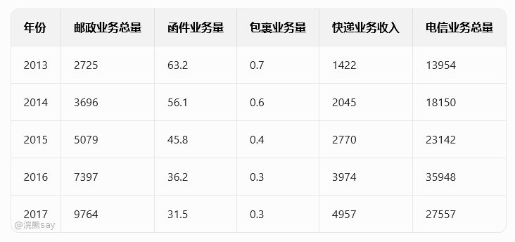
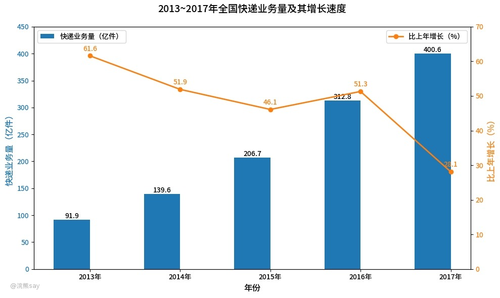

# 增长量相关基础概念

## 基期

基期是指在统计学中，为了计算动态指标（如增长率、发展速度等）而选定的一个作为对比标准的时间点或时间段。基期的作用是用来与报告期（即需要分析的当前期或目标期）的数据进行比较，以观察和分析研究对象在不同时间点上的变化情况。如上图中，紫色的部分表示2022年的数据，那么紫色的柱状图就是基期。

## 现期

现期，也称为报告期，是指相对于基期而言的一个时间点或时间段，它通常指的是当前或最近的时期。在进行数据分析时，现期是指用来与基期数据进行对比的实际观察或测量的时间段，用以反映研究对象在该时期的最新状态或表现。如上图中，橙色的柱状图表示2023年的数据，那么2023年对应的橙色柱状图就是现期。

## 指数

按照现期实际值与基期实际值的比例关系，以基期值为100，求解得到的现期实际值叫做指数：

$$
\frac{\text{现期}}{\text{基期} } = \frac{\text{指数}}{\text{100} } 
$$

由于指数和增长率都涉及基期和现期，因此可以通过指数求解增长率，公式如下：

$$
增长率=(\frac{\text{指数}}{\text{100}}-1)*\text{100\%} = (指数-100)\%
$$

-   指数>100，现期值>基期值，指标相较于上年有所增长
-   指数100，故A市粮食产量同比增加。
2.  2017年A市粮食产量的指数为111.1为最大，故国内生产总值增长最快的是2017年。
3.  由于2018年A市粮食产量的指数为105.6，故增长率为(105.6-100)%，即增长5.6%。
4.  2021年A市粮食产量的指数为106.9，2014年A市粮食产量的指数为102.4，故2021年A市粮食产量的指数比2014年多了106.9-102.4=4.5个百分点。

# 增长量
## 增长量

增长量是指在特定时间段内，某一数值增加或减少的绝对量，它是报告期水平与基期水平之间的差异，用于衡量这一时间段内现象的变化程度。增长量的计算公式为：
$$
增长量 = 现期-基期
$$

根据计算时选取的基期不同，增长量可以分为两种类型：

1.  **逐期增长量**：指报告期水平与前一期水平之差，反映了现象在相邻两个时期间的增长（或减少）的数量。这有助于观察事物发展的连续性和趋势。

2.  **累计增长量**（或称累积增长量）：指报告期水平与固定基期水平（通常是研究期间的起始水平）之间的差额，说明了一定时期内的总体增长量。这对于评估长期发展趋势特别有用。

增长量的结果可以是正数也可以是负数，正数表示增长，而负数则表示减少。在实际应用中，增长量的计算对于经济分析、市场研究、政策制定等多个领域都非常重要。

## 年均增长量

年均增长量是指在一定的时间跨度内，某项指标平均每一年的增长量，年均增长量可以通过以下公式计算：

$$
\text{年均增长量} = \frac{\text{末期}-\text{初期值}}{\text{年数} } 
$$

这里的“末期值”是指指定时间段结束时的值，“初期值”是指该时间段开始时的值，而“时间跨度（年数）”则是指从初期到末期之间的时间长度，以年为单位。例如：假设现期是2015，基期是2011，那么年数=2015-2011=4年。

## 增长量另一个公式

增长量除了用现期-基期来计算之外，还有另外一个可以和增长率联系起来的公式，这个公式相对比较复杂，但是却又比较重要：

$$
增长量 = \frac{\text{现期}}{\text{1} + \text{增长率}} * 增长率
$$

# 真题

**真题1（国家能源2017）** 2009年1—11月份，城镇固定资产投资168634亿元，同比增长32.1%，比上年同期加快5.3个百分点，比1—10月回落1.0个百分点。其中，国有及国有控股投资73535亿元，增长37.8%；房地产开发投资31271亿元，增长17.8%。从项目隶属关系看，2009年1—11月份，中央项目投资15277亿元，同比增长16.4%；地方项目投资153357亿元，增长33.9%。在注册类型中，1—11月份，内资企业投资155132亿元，同比增长35.6%；港澳台商投资5696亿元，增长1.5%；外商投资6865亿元，下降0.1%。分产业看，2009年1—11月份，第一产业投资增长51.5%，第二产业投资增长26.1%，第三产业投资增长36.6%。在行业中，2009年1—11月份，煤炭开采及洗选业投资2614亿元，同比增长33.6%；电力、热力的生产与供应业投资9442亿元，增长20.2%；石油和天然气开采业投资2075亿元，下降6.5%；铁路运输业投资4646亿元，增长80.7%。从施工和新开工项目情况看，2009年1—11月份，累计施工项目429470个，同比增加100493个；施工项目计划总投资393087亿元，同比增长36.3%；新开工项目317012个，同比增加88236个；新开工项目计划总投资136922亿元，同比增长76.6%。从到位资金情况看，2009年1—11月份，到位资金189487亿元，同比增长39.2%。其中，国家预算内资金增长69.8%，国内贷款增长46.4%，自筹资金增长32.2%，利用外资下降15.2%。

**题干** ：分产业来看，2009 年 1-11 月份，在已给行业中属于第二产业的行业投资比 2008 年同期约增加了()亿元。

A. 1900

B. 2000

C. 2100

D. 2200

**答案** ：C

**解析** ：第二产业包括煤炭开采及洗选业、电力热力的生产与供应业、石油和天然气开采业。2009 年 1-11 月这几个产业的投资增长量计算为： 
$$
\frac{2614}{1+33.6\%} \times 33.6\% + \frac{9442}{1+20.2\%} \times 20.2\% + \frac{2075}{1-6.5\%} \times (-6.5\%) \approx 657 + 1587 - 144 = 2100亿元。
$$ 

**真题2（中储粮 2023）** 2012年全年，全国完成邮政业务总量2037亿元，比上年增长26.7%，完成邮政函件业务70.7亿件，包裹业务0.8亿件。全年完成电信业务总量12985亿元，比上年增长11.1%。

2013—2017年全国邮电业务量及收入情况（单位：亿元/亿件）

近年来，包裹业务量呈逐年减少的趋势，同时快递业务成功逆袭，快递业务量逐年大幅度上升，2017年已经达到400.6亿件。

2013—2017年全国快递业务量及其增长速度（柱状图显示：2013年91.9亿件，增长61.6%；2014年139.6亿件，增长51.9%；2015年206.7亿件，增长46.1%；2016年312.8亿件，增长51.3%；2017年400.6亿件，增长28.1%）

**题干** ：2013-2017 年，全国快递业务量同比增加值最大的年份为()。

A. 2014

B. 2015

C. 2016

D. 2017

**答案** ：C

**解析** ：增长量=现期量-基期量。2014 年=139.6-91.9=47.7 亿件，2015 年=206.7-139.6=67.1 亿件，2016 年=312.8-206.7=106.1 亿件，2017 年=400.6-312.8=87.8 亿件，2016 年增长量最大。

**真题3（航空工业计算所2025）**  国家财政科技拨款及其占比情况（2014-2018 年）如下，请根据以下表格回答问题：

| 年份 | 国家公共财政支出（亿元） | 国家财政科技拨款（亿元） | 中央财政科技拨款（亿元） | 地方财政科技拨款（亿元） |
| --- | --- | --- | --- | --- |
| 2014 | 151785.6 | 6454.5 | 2899.2 | 3555.4 |
| 2015 | 175877.8 | 7005.8 | 3012.1 | 3993.7 |
| 2016 | 187755.2 | 7760.7 | 3269.3 | 4491.4 |
| 2017 | 203085.5 | 8383.6 | 3421.4 | 4962.1 |
| 2018 | 220904.1 | 9518.2 | 3738.5 | 5779.7 |

**题干** ：2018 年我国科技拨款同比约增长多少万亿元？

A. 0.23

B. 0.28

C. 0.33

D. 0.38

**答案** ：A

**解析** ：2018 年科技拨款=9518.2（国家）+3738.5（中央）+5779.7（地方）≈19036.4 亿元；2017 年≈8383.6+3421.4+4962.1≈16767.1 亿元。增长量≈19036.4-16767.1=2269.3 亿元≈0.23 万亿元。
