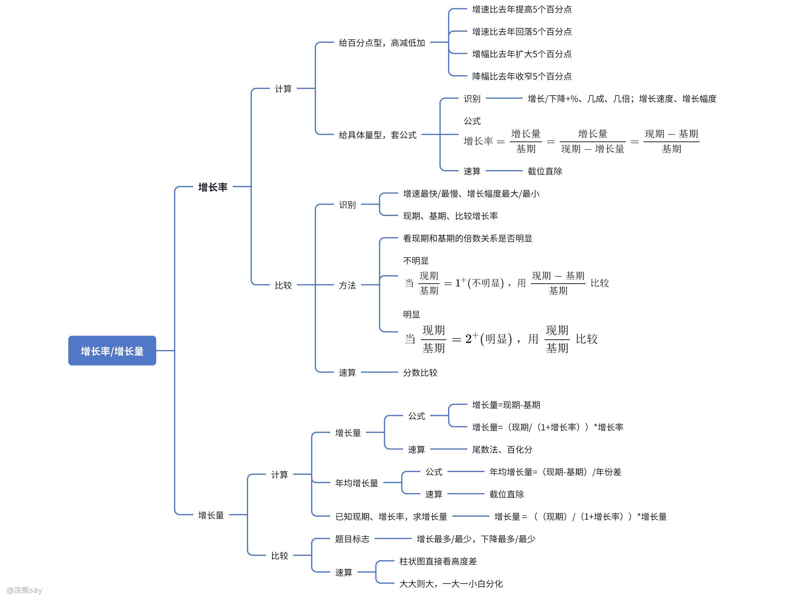
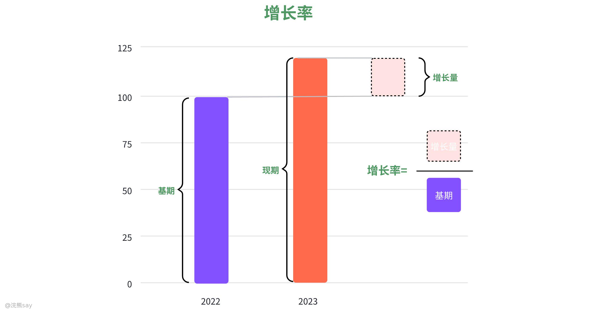
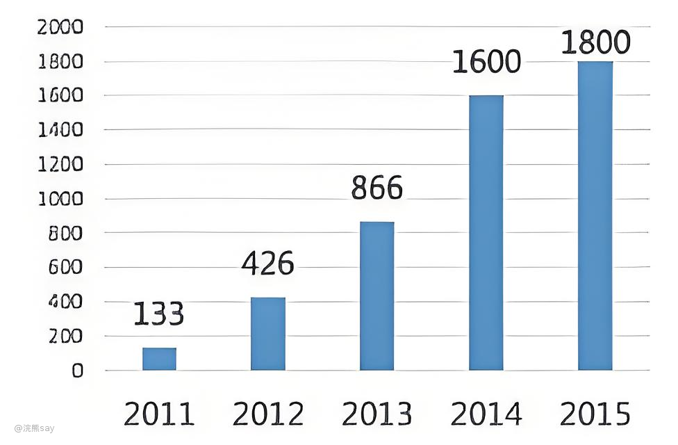
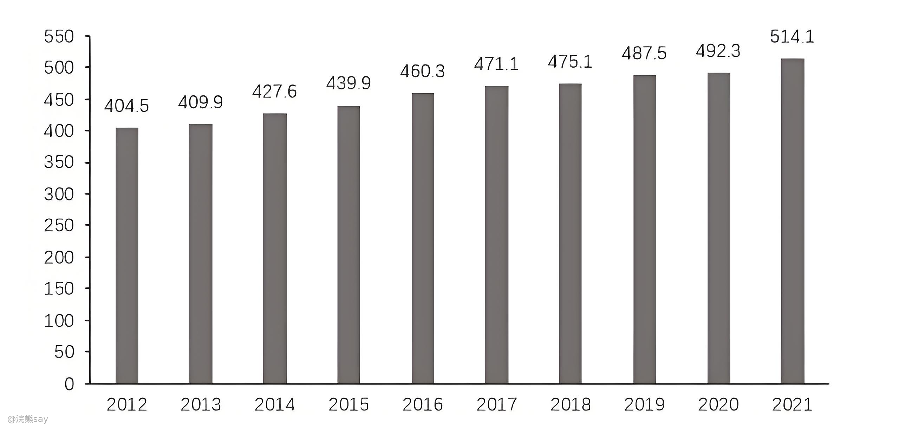
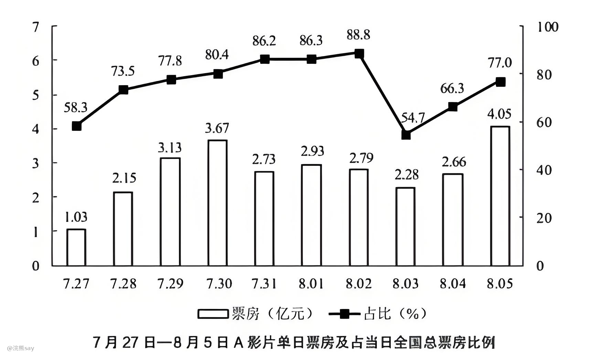

# 增长率相关概念

## 思维导图

## 增长率

增长率是表述基期量与现期量变化的相对量，增长率又称增速、增幅或者增长幅度增值率等，增长率为负时表示下降，增长率的计算公式如下：

$$
\text{增长率} = \frac{\text{增长量}}{\text{基期}} = \frac{\text{增长量}}{\text{现期} - \text{增长量}} = \frac{\text{现期} - \text{基期}}{\text{基期}}
$$

例如，如果某公司2022年的收入为100万元，2023年的收入为120万元，那么2023年的收入增长率就是20%。

# 年均增长率

## 年均增长率

如果假设第一年为A，第n+1年为B，这n年的**年均增长率为r**，那么：
$$

B=A(1+r)^n 

$$

$$
r=\sqrt[n]{\frac{B}{A} }-1 
$$

如果n=1，此时的年均增长率等于年增长率，则有：

$$
r=\frac{B}{A}-1 
$$

如n年间的增长率分别为 $$r_1$$，$$r_2$$，...，$$r_n$$ ,年均增长率为 ，则 $$(1+r)^n=(1+r_1)(1+r_2)...(1+r_n)$$，从而:

$$
r=\sqrt[n]{(1+r_1)(1+r_2)...(1+r_n)} -1
$$

## 年平均增长率

年均增长率顾名思义就是增长率平摊到每一年的增长率,用公式表达的话就是将所有年的增长率相加，再除以年份：

$$
\frac{r_1+r_2+...+r_n}{n} 
$$

需要注意的是，一般年平均增长率是大于年均增长率的，即：

$$
\frac{r_1+r_2+...+r_n}{n} > \frac{r_1+r_2+...+r_n}{n} 
$$

## 总增长率

假设第一年为A，第n年为B，那么总增长率就是从第一年到第n年的增长率，公式如下：

## 实例分析

例题：如果 2001 年广东省工业污染治理国家预算内资金为 3.10 亿元，则 2001 至 2003 年，该项资金年均增长率约为：

A . 75 % 
B . 60 % 
C . 50 % 
D . 36 %

解析：关键词“广东”，“国家预算内资金”，解题点定位在表格第三列倒数第二行，由年均增长率公式；

$$
r=\sqrt[n]{\frac{B}{A} }-1 ；\frac{B}{A}=\frac{6.97}{3.1}=2.2;r=\sqrt[2]{2.2}-1=0.5
$$

# 增长率、降幅、变化幅度的区别？

## 增长率、降幅、变化幅度概念

1.  **幅度与增长率**：幅度本质是指标在一定时期内的变化程度（即增长率），可正可负 —— 正值代表增长，负值代表减少，常用于经济数据、股票价格、人口数量等场景。例如，公司年利润增加 10% 则利润增幅（增长率）为 10%，城市人口减少 2% 则人口增幅（增长率）为 - 2%。增长率侧重衡量变化速度，比较时需关注正负号以明确变化方向，如项目 A 年化增长率 5% 优于项目 B 的 - 10%。
2.  **降幅**：特指指标减少的程度，仅适用于下降场景。比较降幅时聚焦绝对值（不考虑正负），核心衡量 “减少多少”。例如，商品价格从 100 元降至 95 元（降幅 5%），另一商品降至 85 元（降幅 15%），后者降幅更大。
3.  **变化幅度**：描述指标增长或减少的绝对比率，是非负值，仅体现变化大小而非方向。计算时取增长率的绝对值，若 A 项目上涨 10%、B 项目下降 10%，二者变化幅度均为 10%。

## 实例分析

1.2023 年收入 10 万元，同比增长 10%，增速比去年提高 5 个百分点，求 2022 年增长率？

解析：“提高” 表示今年增速较去年上升，用减法计算，2022 年增长率 = 10%-5%=5%。

2.2023 年收入 10 万元，同比增长 10%，增速比去年回落 5 个百分点，求 2022 年增长率？

解析：“回落” 表示今年增速较去年下降，用加法计算，2022 年增长率 = 10%+5%=15%。

3.2023 年收入 10 万元，同比下降 10%，降幅比去年扩大 5 个百分点，求 2022 年降幅及增长率？

解析：降幅计算不考虑正负号，“扩大” 意味着今年降幅比去年更大，故 2022 年降幅 = 10%-5%=5%；增长率需体现下降方向，即 - 5%。

4.2023 年收入 10 万元，同比下降 10%，降幅比去年收窄 5 个百分点，求 2022 年降幅及增长率？

解析：“收窄” 表示今年降幅比去年更小，降幅计算用加法，2022 年降幅 = 10%+5%=15%；增长率对应为 - 15%。

# 增长率比较

## 增长率比较定义
| 增速最快/最慢：增速快慢通常通过增长率来衡量。增长率越大，增速越快；增长率越小，增速越慢。增长率可以是正数也可以是负数，正数表示增长，负数表示减少。 |
| --- |

| 增长幅度最大/最小：增长幅度通常指的是增长的绝对值，无论是增长还是减少。增长幅度越大，变化越显著；增长幅度越小，变化越微弱。增长幅度的计算方法是取增长率的绝对值。 |
| --- |

已知现期值和基期值，需要比较增长率，设增长率用r表示，则公式式如下：

$$
r=\frac{现期-基期}{基期}=\frac{现期}{基期}-1  
$$

在比较多个增长率时，可以简化计算过程。例如，如果有两个增长率 和 ，分别由以下公式计算：

$$
r_1=\frac{A}{B}-1  
$$

$$
r_2=\frac{C}{D}-1  
$$

由于每个公式中都有一个“-1”，可以直接比较和 $$\frac{A}{B}$$、$$\frac{C}{D}$$ 的大小，从而确定增长率的大小。

## 快速比较方法

想要快速比较2个场景得增长率，我们需要看现期和基期的倍数关系是否明显，通过这个来可以快速的进行判断

-   当$$\frac{现期}{基期}=1+不明显$$ ：如果现期值和基期值相差不大，即现期值与基期值的比值接近1，此时直接用**增长率** 进行比较更为准确。

-  当$$\frac{现期}{基期}=2+明显$$ ：如果现期值明显大于基期值，即现期值与基期值的比值明显大于1，此时可以直接用现$$\frac{基期}{现期}$$的比值进行比较，这样可以简化计算过程。

## 实例分析

例：下图2012年-2015年，哪一年的同比增速最快？

解析：图中看倍数关系明不明显，2011年跟 2012年倍数关系明显，直接用426/133=3+，866/426=2+，1600/866=1+，1800/1600=1+，明显 2012 年增速最大。

## 真题

**例1：2012年~2021年全国羊肉产量年度变化情况如下图所示，则2021年，全国羊肉产量同比增长率约为（）**

2012年~2021年全国羊肉产量年度变化情况

A. 2.4%

B. 3.4%

C. 4.4%

D. 5.4%

解析：根据题干“2021 年，全国羊肉产量同比增长率约为”，可判定本题为一般增长率问题。定位图1可知 2020 年、2021 年全国羊肉产量分别为 492.3 万吨、514.1 万. 根据公式:增长率= $$\frac{现期-基期}{基期} $$，则 2021 年全国羊肉产量同比增长率为 $$\frac{514.1-492.3}{492.} $$ ≈4.4%。故正确答案为C

**例2： (2019 广东)，如下表为2016-2018年全国电力工业统计数据(部分)**

| 指标名称 | 2018 年 | 2017 年 | 2016 年 |
| --- | --- | --- | --- |
| 可再生能源发电量(亿千瓦时) | 18700 | 17000 | 15500 |
| 其中: 水电发电量(亿千瓦时) | 12000 | 11945 | 11745 |
| 风电发电量(亿千瓦时) | 3660 | 3057 | 2420 |
| 光伏发电发电量(亿千瓦时) | 1775 | 1182 | 662 |
| 生物质发电发电量(亿千瓦时) | 906 | 794 | 647 |
| 全口径发电设备容量(万千瓦) | 177703 | 189967 | 165151 |

2017年，下列可再生能源发电量同比增幅最大的是:

A.水电

B.风电

C.光伏发电

D.生物质发电

解析：C。解析:增幅最大，即增长率最大，判定题型为增长率比较问题。2017年同比是和 2016 年做比较，对应材料找数据，不需要看 2018年的数据，表格中的数据都是 1倍多的关系，用“(现期-基期)/基期“做比较。A顶:(11945-11745)/11745=200/11745；B项:(3057-2420)/2420=637/2420；C项:(1182-662)/662=520/662；D项:(794-647)/647=147/647，可以看出C项明显最大，故选C。

**例3：7月 28 日~8月5日间，A影片票房环比增速最快的单日，当日A影片占全国总票房/5:的比例在该影片上映 10 天内排名（）**

A.第7

B.第6

C.第5

D.第4

解析：先找到当日的比例再进行排名，注意问的是环比增速最快的，环比按最小的统计周期(天)相比，即和上一天比，增速比较问题，看“现期/基期“倍数关系明显不明显。r7月 28日=2.15/1.03=2+，倍数关系明显，直接用“现期/基期“做比较,除了 7月 28 日，其余日期的环比增长率都没有2倍以上的关系，即7月 28 日的环比增长率最大，占全国总票房的比例是 73.5%,看其余日期的比例,一共有3天(58.3%、54.7%.66.3%)的比例比 73.5%低，一共有 10 天，即 7月 28 日排名第 7。故选 A。
