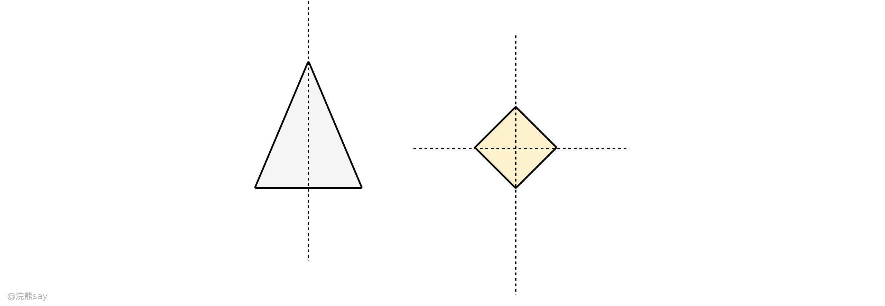
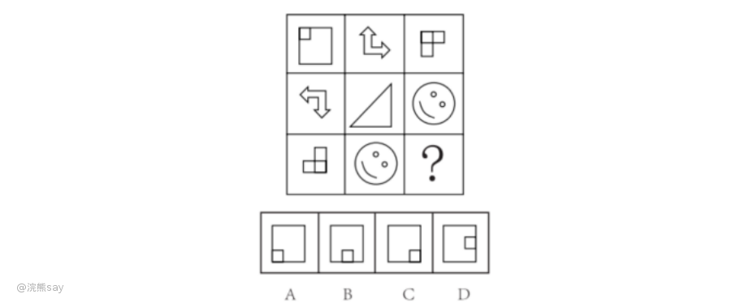

# 解题思路
在图形推理中，对称性是一个非常重要的考点，也是非常简单的一类题型，于对称性的题目，我们可以采用以下三个步骤来解决：
- **确认对称轴：** 首先需要确定图形的对称轴，通常可以通过观察图形中是否存在明显的对称轴或者通过旋转图形来找到对称轴。
- **分析对称性：** 根据对称轴的不同位置，可以分为水平对称、垂直对称、镜像对称等多种类型。需要仔细观察图形，并结合对称轴的位置来判断图形的对称性。
- **判断是否符合规律：** 通过对图形的对称性进行分析，可以得到一些规律，例如每个图形都具有相同的对称轴等等。需要根据这些规律来判断选项是否符合要求。 

# 对称图形分类

在图形推理题目中，对称性是一个重要的考察点，根据对称性的不同表现形式，可以将对称性分为以下几类：

## 轴对称（镜像对称）

如果一个图形沿着一条直线折叠后，两侧能够完全重合，则该图形为轴对称图形。这条直线称为对称轴。轴对称图形可以有一个或多个对称轴。例如，等腰三角形有一条对称轴，正方形有四条对称轴。

## 中心对称

如果一个图形绕着某一点**旋转180度**后能与原图形完全重合，则该图形为中心对称图形。这个点被称为对称中心。例如，平行四边形是中心对称图形，但一般不是轴对称图形（除非它是矩形、菱形或正方形）。

## 旋转对称

如果一个图形绕着中心点旋转一定角度（小于360度）后能与自身重合，则该图形具有旋转对称性。旋转的角度称为旋转角。例如，正五边形绕其中心旋转72度可以与自身重合，因此它具有旋转对称性。

在解决图形推理题目时，识别这些不同类型的对称性可以帮助快速找到规律，从而正确解答问题。了解并熟练掌握这些对称性的概念和特点对于提高解题效率非常有帮助。

# 真题

**例题1：把下面的六个图形分为两类，使每一类图形都有各自的共同特征或规律，分类正确的一项是\_\_\_\_\_.**

A. 1 2 3, 4 5 6

B. 1 2 5, 3 4 6

C. 1 3 5, 2 4 6

D. 1 4 6, 2 3 5

解析：图形元素组成不同，考虑属性规律。观察发现，题干均为轴对称图形，考虑对称性，①④⑥既是轴对称图形又是中心对称图形，②③⑤仅为轴对称图形，所以①④⑥为一组，②③⑤为另一组。故正确答案 D。

**例题2：从所给的四个选项中，选择最恰当的一个填入问号处，使之呈现一定的规律性**

解析：图形元素组成不同，优先考虑属性规律。九宫格优先按行看，第一行中三幅图都是轴对称图形，并且对称轴的方向依次顺(逆)时针旋转 90°，第二行与第一行规律相同，第三行也应该满足此规律，只有C项符合。故正确答案为C。
