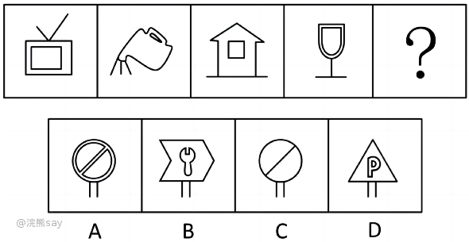
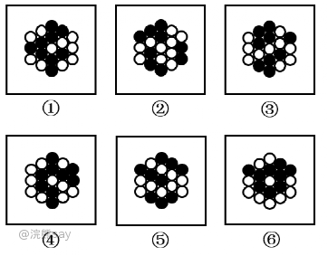
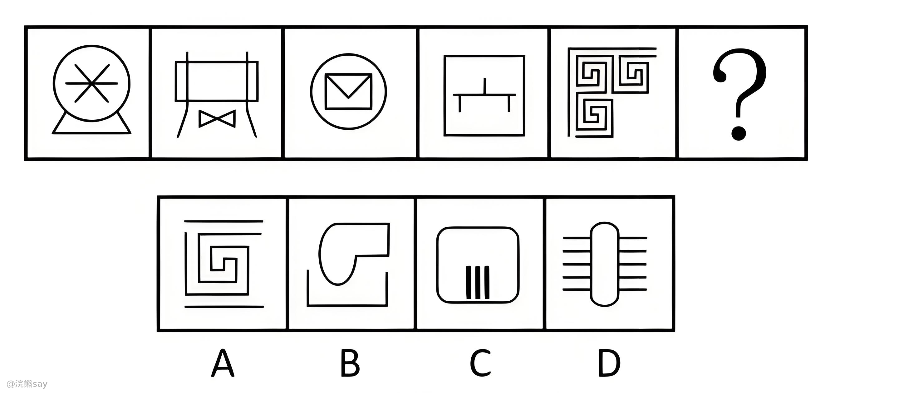
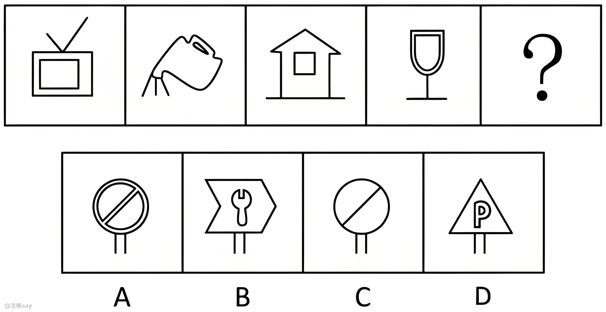
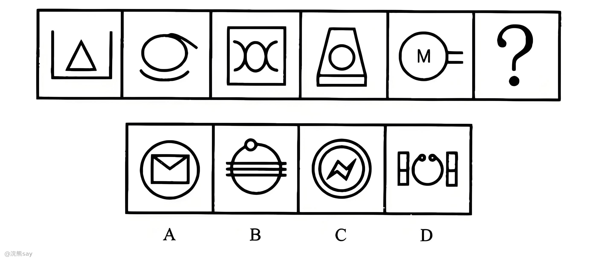
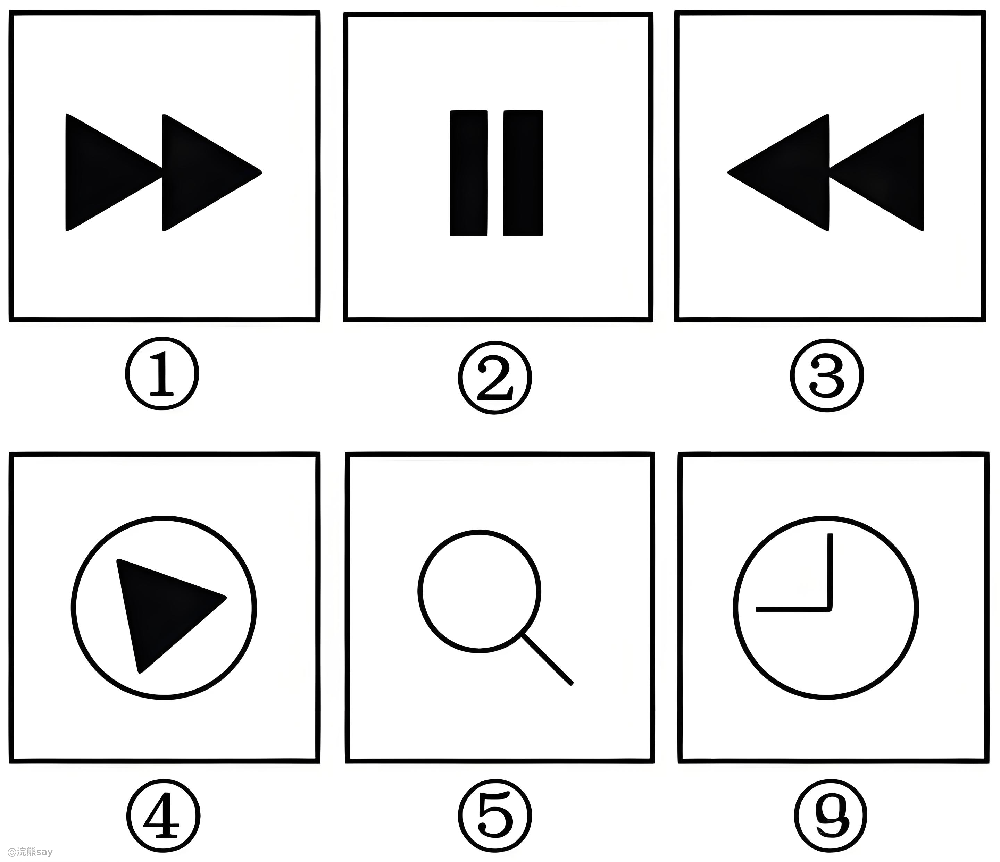

# 什么是整体部分数？

行测中的“图形推理——整体和部分”题型主要考察的是考生对图形中整体与部分关系的理解和识别能力，一般来说整体部分数都是考察一个大图形由多少个独立子图构成的，一般有以下两类题。

## 普通几何图形

如上图所示，图形大图形整体由两个小的部分组成，更准确一点儿来说，大图形是由两个子连通图构成的。

## 黑白块

黑白块题型也可以考察整体部分数，这个优点像围棋，比如下图就考察黑子将白字分割成了多少个部分数，然后可以将以下6个图形分成2类。

# 真题

**例题1：请从所给的四个选项中，选出最恰当的一项填入问号处，使之呈现一定的规律性。**

解析：观察发现题干出现较多生活化图形，考虑部分数。题干图形的部分数均为2，故？处要选一个部分数为2的图形，只有B项符合。

**例题2：从所给的四个选项中，选择最合适的一个填入问号处，使之呈现一定的规律性：**

解析：整体观察题干，图形元素构成凌乱，考虑数量。观察发现，每个图形均由两个部分构成，满足这一规律的只有B项。

**例题3：从所给的四个选项中，选择最合适的一个填入问号处，使之呈现一定的规律性：**

解析：整体观察题干，图形元素构成凌乱，考虑整体和部分数，均为2部分，选项A满足规律。

**例题4：把下面的六个图形分为两类，使每一类图形都有各自的共同特征和规律，分类正确的一项是：**

A.①②⑥，③④⑤ B.①③④，②⑤⑥

C.①⑤⑥，②③④ D.①③⑤，②④⑥

解析：题干图形出现了粗线条和生活化图形，考虑部分数。图①③⑤的部分数均为1，图②④⑥的部分数均为2。故图①③⑤为一组，图②④⑥为一组。故正确答案为D。
