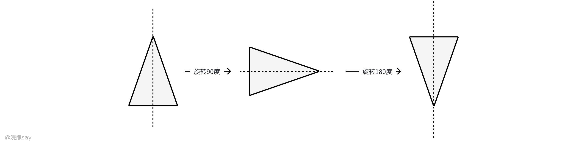
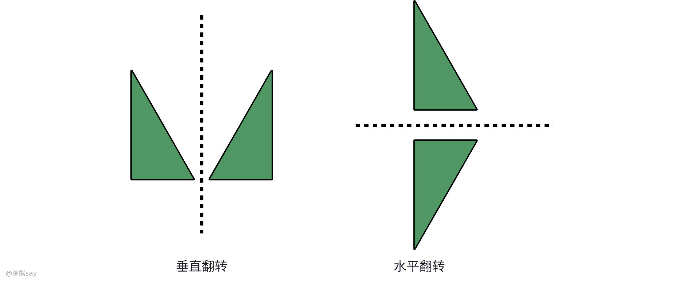
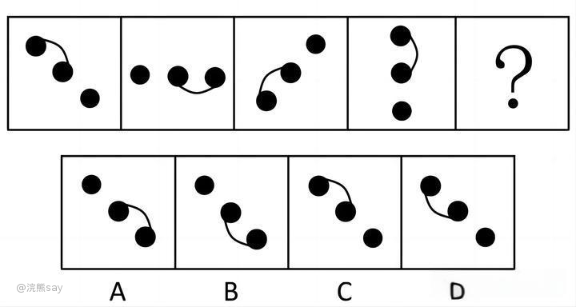
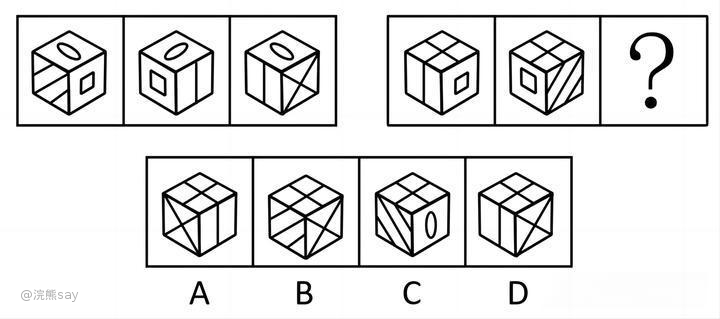
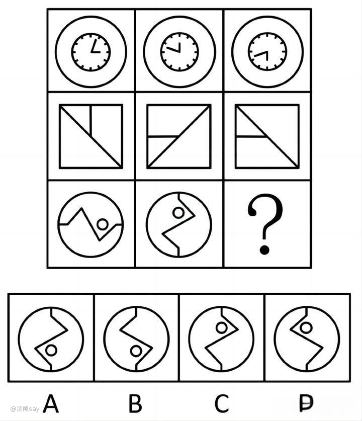

# 旋转、翻转定义

旋转、翻转是指图形绕某一固定中心点做圆周运动，仅改变位置，形状、大小保持不变，是行测图形推理中常考察的知识点，同时由于旋转和翻转比较容易观察到，解决这类问题相对也比较简单。

## 旋转常见考点

1.  方向：顺时针、逆时针
2.  常见角度：45、60、90、120、180等肉眼可见的度数，不会旋转哪些难以分辨的角度。

## 翻转常见考点

1.  左右翻转（垂直翻转）：两图沿竖轴对称
2.  上下翻转（水平翻转）：两图沿横轴对称

# 真题

1.  **请选择最合适的一项填入问号处，使之符合之前四个图形的变化规律：**

解析：考查旋转固定角度；元素组成相同，位置变化。图形整体依次顺时针旋转135度，只有B符合此规律。故正确答案为B。

2.  **从所给的四个选项中，选择最合适的一个填入问号处，使之呈现一定的规律性：**

解析：考查立体图形的旋转；两组图形优先观察第一组，均为同一个六面体，图1整体沿水平方向顺时针旋转90度得到图2，图2整体沿水平方向顺时针旋转90度得到图3。应用此规律，验证图1到图2，满足此规律，因此“？”处图形应由图2整体沿水平方向顺时针旋转90度得到，即顶面为田字面，左面为斜线面。故正确答案为B。

3.  **请从所给的四个选项中，选出最恰当的一项填入问号处，使之呈现一定的规律性。**

解析：考查旋转和上下翻转；元素相同，位置不同，考虑位置变化；九宫格优先横向看，第一行中，图一逆时针旋转90度得到图二，图二上下翻转得到图三；第二行经验证，符合该规律；第三行应用规律，只有B项符合。故正确答案为B。
