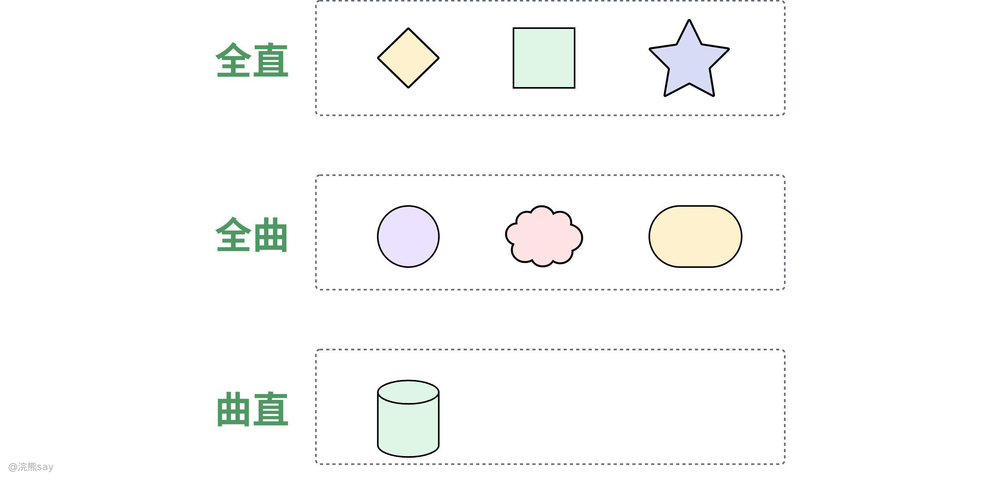
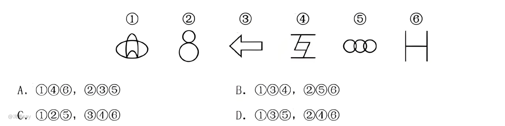
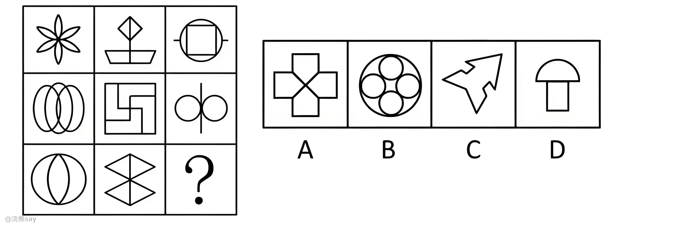
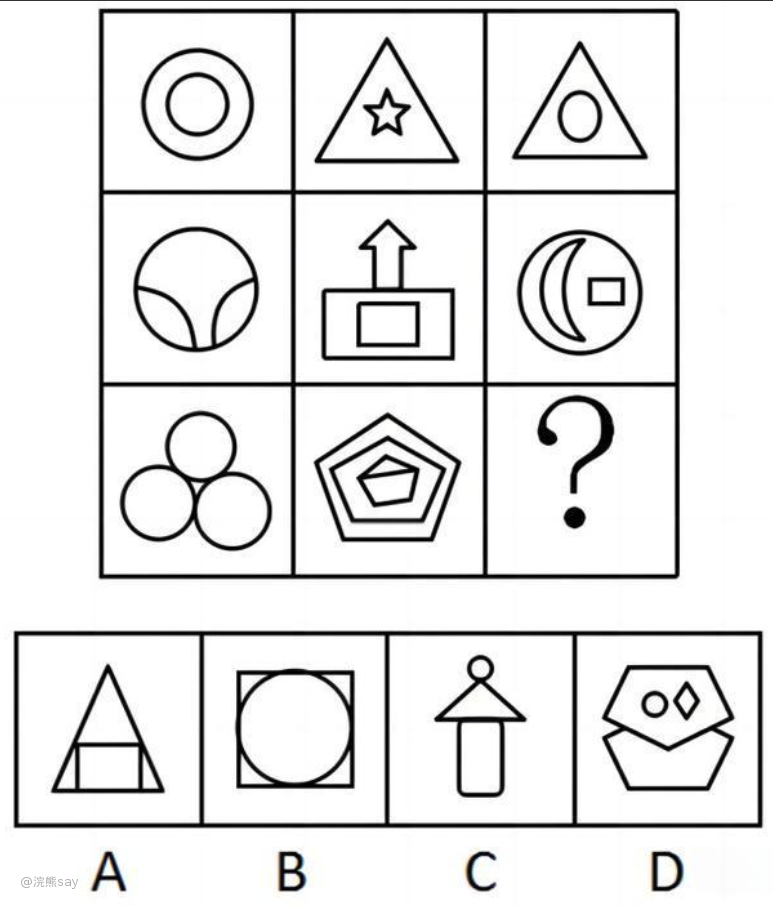
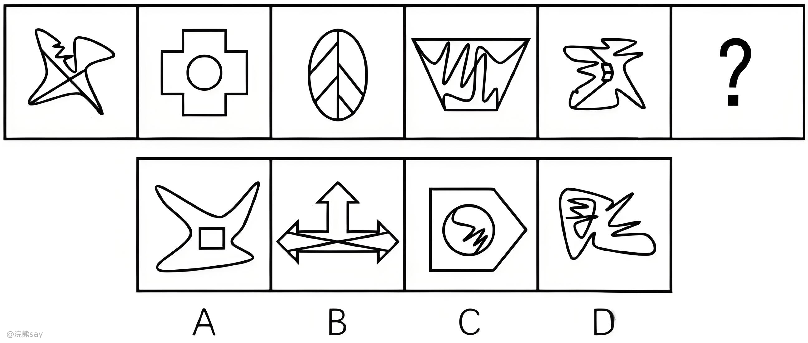
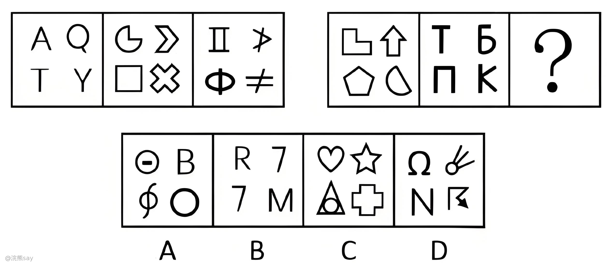
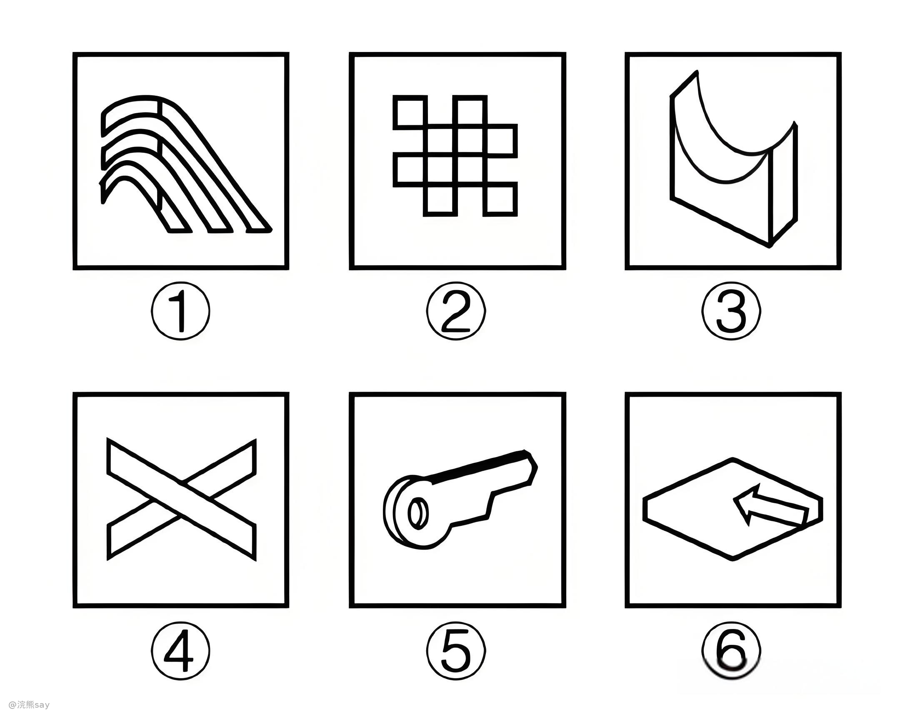
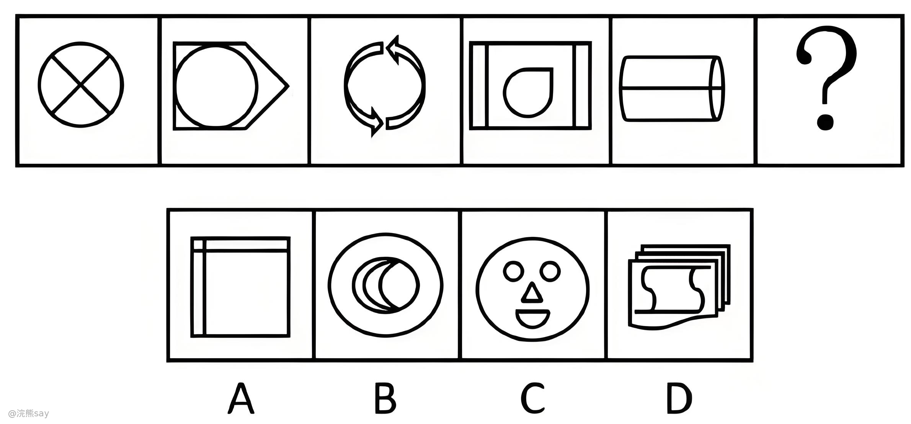
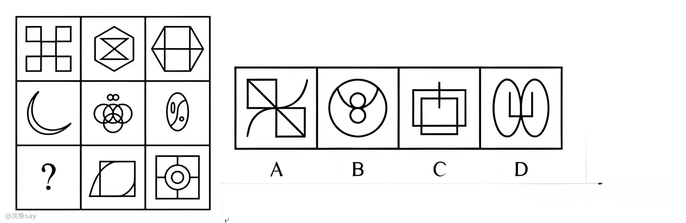

# 什么是曲直性？

曲直性是图形推理中**基础属性规律**，指图形由**直线、曲线**构成的属性特征，不涉及图形大小、位置、数量，仅判断线条构成类型。

✅ 全直线图形：△、□、☆（所有线条都是直线）

✅ 全曲线图形：○、S、⌒（所有线条都是曲线）

✅ 曲+直图形：🍐、☆带弧线、字母B（既有曲线又有直线）

# 曲直性3大考法

## 分组分类（送分题）

-   特征：题干给出 6 个图形，要求分为两组（各 3 个），每组具备统一规律
-   技巧：优先观察整体曲直属性，直接按「全直线 / 全曲线 / 曲直混合」分组

**例1：把下面的图形分为两类，使每一类图形都有各自的共同规律或特征，分类正确的一项是：**

解析：题干看共性：有纯曲线的图形，可以考虑曲直性，①②⑤是纯曲线，③④⑥是纯直线，所以选 C 选项。

## 属性叠加（进阶题）

-   特征：九宫格/两组图，多为九宫格、两组式图形，前后图形存在组合 / 递变规律
-   规律：曲+曲=？ 直+直=？ 曲+直=？ ；口诀：**“曲直相遇，混搭成新”**

**例2：从所给的四个选项中，选择最合适的一个填入问号处，使之符合已呈现的规律性：**

解析：题干为九宫格图形，考虑从横行或竖列找到规律。观察发现，九宫格第一列图形均由曲线构成，第二列图形均由直线构成，第三列图形均由曲线和直线两种元素构成，满足条件的只有D项。

故正确答案为D。

**提示：** 九宫格的题需要注意，我们熟悉的是横着看，其实还可以看每列，还有部分真题可以米字型交叉去看。

## 曲直+数量/位置（拉分题）

-   曲直×线条数：曲线数与直线数存在大小对比、数量等差等规律，曲线数＞直线数（或相反）
-   曲直×位置：外部曲线 + 内部直线、外部直线 + 内部曲线，外曲内直/外直内曲
-   曲直×开闭：全曲线多为封闭图形，全直线可开放 / 封闭，常结合面数量、封闭区域共同判定

**例3： 从所给的四个选项中，选择最合适的一个填入问号处，使之符合已呈现的规律性：**

解析：题干为九宫格图形，观察发现题干出现全直线，全曲线图形，优先考虑曲直性。第一列都是曲线图形，第二列都是直线，第三列都是有直线和曲线，只能排除 A 选项，无法选出选项；再观察图形发现出现明显窟窿以及图形被分割，考虑面数量；第一行图中面数量都是2，第二行图中面数量都是3，第三行图中面数量都是4，所以“？”处面数量应该是4，只有D选项符合。故正确答案为D。

# 解题技巧

## 3个易错陷阱（避开即提分）

**忽略复合考点**：看到曲线 + 直线组合，只看曲直属性，未同步数曲线 / 直线数量、面数量

**概念混淆**：「全曲线」≠「有曲线」—— 全曲线要求**无任何直线**，有曲线可包含直线

**顺序颠倒**：优先数复杂数量规律，忽略简单属性规律；牢记口诀：**先属性，后数量**

## 5分钟速记口诀

**“先看整体分曲直，全直全曲优先记，**

**有曲有直藏规律，数量位置一起理，**

**外曲内直别忘记，分组叠加是送分！”**

# 真题

**例1：从所给的四个选项中，选出最合适的一个填入问号处，使之呈现一定的规律性。**

解析：观察图形，元素组成不同，题干和选线均比较杂乱，但都有内部和外框。题干图形1、3、5外曲内直，图形2、4外直内曲，“？”应为外直内曲的图形，对应C项。故正确答案为C。

**例2：从所给的四个选项中，选择最合适的一个填入问号处，使之呈现一定规律性。**

解析：每个方框内四个元素，各不相同，观察曲直性，都是由3个全直线的小图形和1个既有曲线也有直线的小图形组成，故“？”处图形也应该由3个全直线的小图形和1个既有曲线也有直线的小图形组成，只有B项符合。故正确答案为B。

**例3：把下面的六个图形分为两类，使每一类图形都有各自的共同特征或规律，分类正确的一项是：**

**例4：请从所给的四个选项中，选出最恰当的一项填入问号处，使之呈现一定的规律性。**

解析：观察发现，题干图形都是由曲线和直线共同构成，排除A、B两项；继续观察发现，题干图形封闭面明显，考虑数面。题干图形面数量都为4，故“？”处应该选择面数量为4的图形，只有D项符合。故正确答案为D。

**例5：从所给的四个选项中，选择最合适的一个填入问号处，使之呈现一定的规律性：**

解析：九宫格图形优先看横行，第一行为全直线图形，第二行为全曲线图形，第三行的图2和图3均为直+曲图形，则？处也应为直+曲图形，排除B、C项。继续观察发现，题干所有图形均为封闭图形，只有D项符合。故正确答案为D。
