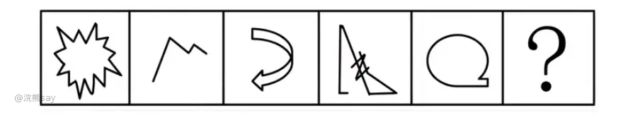
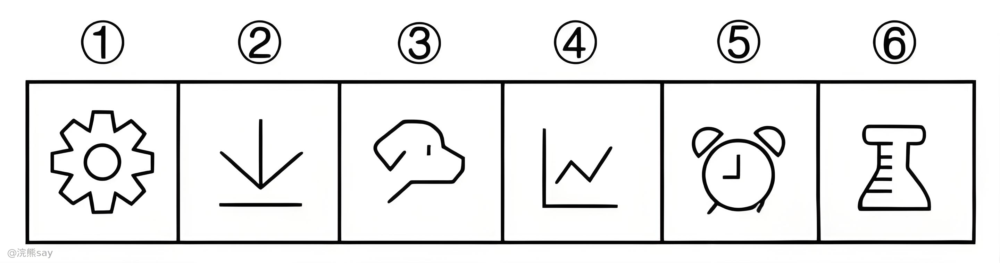
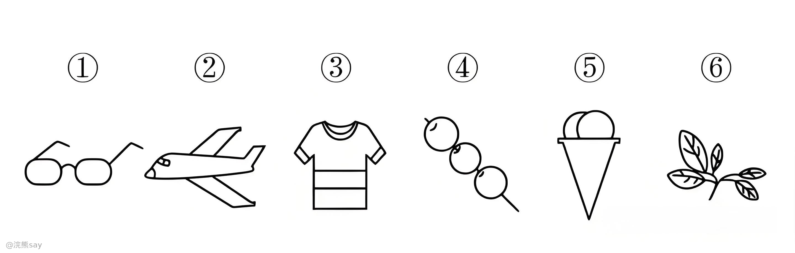
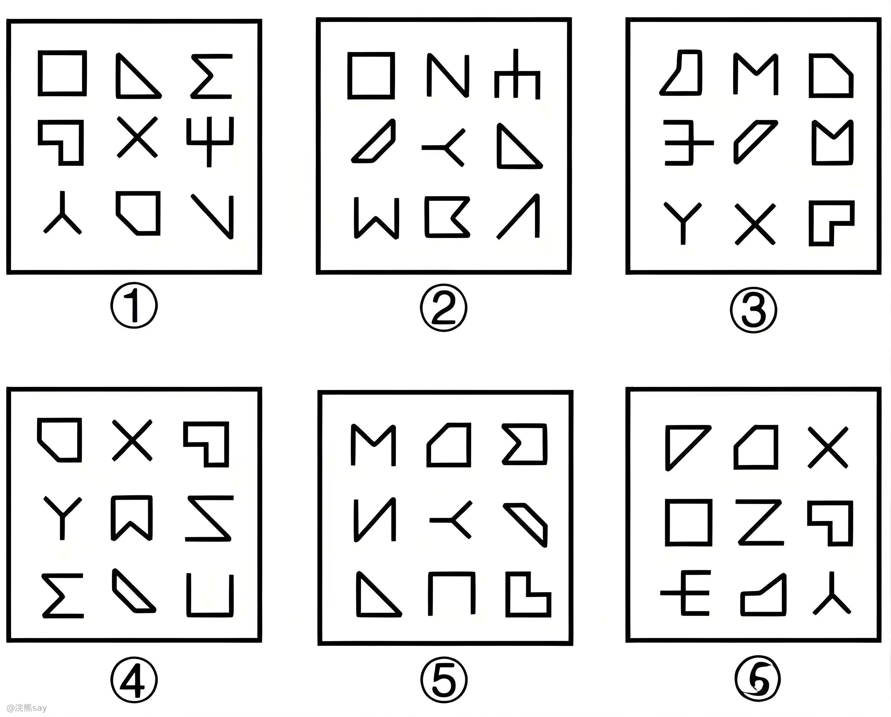
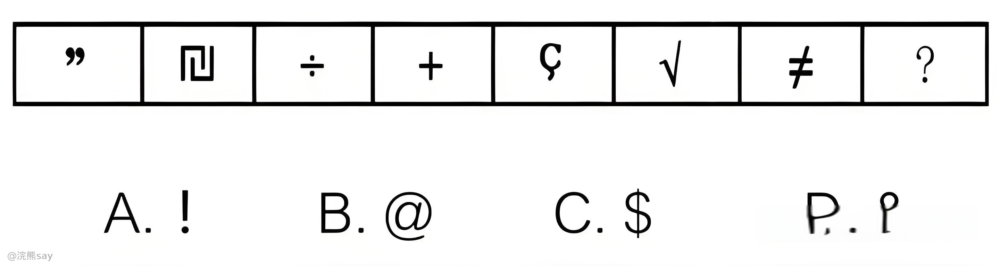
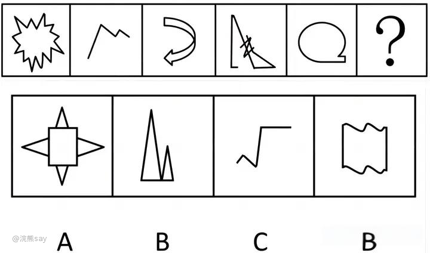

# 4.开闭性

行测中的“图形推理——开闭性”题型主要考察的是考生对图形中开放和封闭状态的理解和识别能力。这类题目通常会给出一组图形，要求考生根据图形的开闭性找出规律或选择合适的答案。下面我将从几个方面系统地介绍这一题型：

# 开闭性的定义

-   **开放图形**：图形边缘未完全闭合，存在明显缺口或开口，无法形成独立封闭区域（例：“C”“月牙形”）
-   **封闭图形**：图形边缘完整闭合，能形成至少一个独立封闭区域，无任何缺口（例：“○”“正方形”“五角星”）

# 常见题型

**图形分类**：给出多个图形，要求将这些图形按照开闭性进行分类。仔细观察每个图形，判断其是开放图形还是封闭图形，然后进行分类。

**规律识别**：给出一个图形序列，要求找出其中的开闭性规律，并选择下一个图形。观察图形序列中开放图形和封闭图形的交替出现或变化规律。

# 解题策略

1、**细节特点**：

- 是否具备开闭性： 观察图形的边缘是否有缺口或开口。观察图形的形状，判断其是否完全闭合。
- 缺口位置： 如果图形是开放的，注意缺口的位置和大小。 

2、**寻找规律**：

- 交替规律：观察图形序列中开放图形和封闭图形是否交替出现。
- 递增/递减规律：观察图形序列中开放图形和封闭图形的数量是否按某种规律递增或递减。
- 位置规律：观察图形序列中缺口的位置是否按某种规律变化。 

# 真题

**例1：把下面六个图形分为两类，使每一类图形都有各自的共同特征或规律，分类正确的一项是：**

A.①⑤⑥，②③④

B.①②⑤，③④⑥

C.①②④，③⑤⑥

D.①③⑤，②④⑥

解析：对称、曲直均无明显规律，考虑开闭性。图①⑤⑥均为带有封闭区域的图形，图②③④均为全开放的图形，即①⑤⑥为一组，②③④为一组。故正确答案为A。

**例2 把下面的图形分为两类，使每一类图形都有各自的共同特征或规律，分类正确的一项是：**

A.①③⑥，②④⑤ B.①③⑤，②④⑥

C.①④⑥，②③⑤ D.①②④，③⑤⑥

解析：对称、曲直均无明显规律，考虑开闭性。图①④⑥均为半开半封闭图形；图②③⑤均为全封闭图形。因此①④⑥一组，②③⑤一组。故正确答案为C。

**例3 把下面的六个图形分为两类，使每一类图形都有各自的共同特征或规律，分类正确的一项是：**

A.①③④，②⑤⑥

B.①②④，③⑤⑥

C.①②⑥，③④⑤

D.①⑤⑥，②③④

解析：第一反应对称性，无分组规律；观察发现，题干每幅图中均出现多个全开放图形，优先考虑开闭性。图①②④中有5个全开放图形、4个全封闭图形；图③⑤⑥中有4个全开放图形、5个全封闭图形，即图①②④为一组，图③⑤⑥为一组。故正确答案为B。

**例4 从所给四个选项中，选择最合适的一个填入问号处，使之呈现一定的规律性：**

解析：题干都是全开放的图形，故问号处也应该是全开放的图形，只有A项符合。故正确答案为A。

**例5 请从四个选项中，选择最合适的一个填入问号处，使之呈现一定规律性：**

解析：图形中完全封闭图形与不完全封闭图形依次交替出现，故？处应该填入一个不完全封闭图形，选项中C选项为开放图形，属于不完全封闭图形，A、B、D三项均为完全封闭图形。故正确答案为C。
