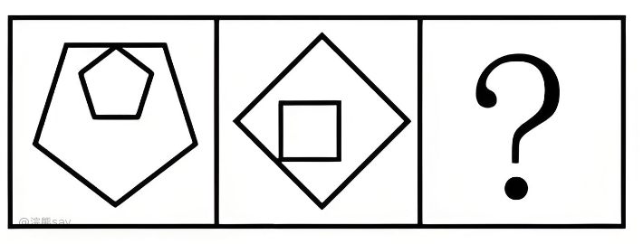
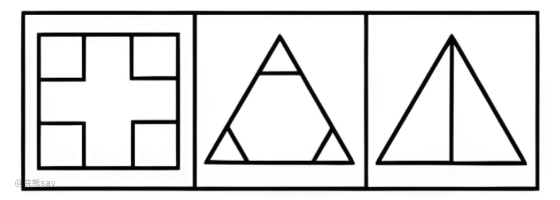
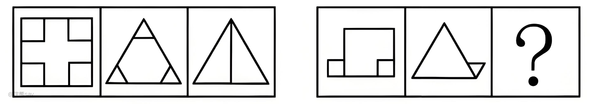
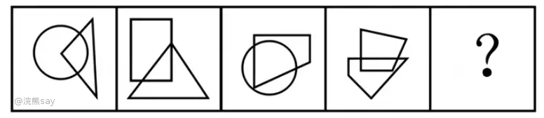
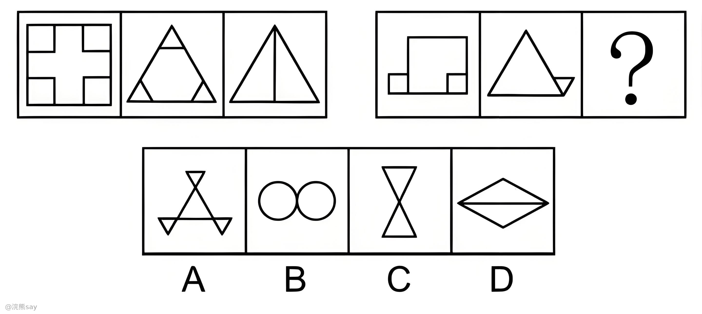
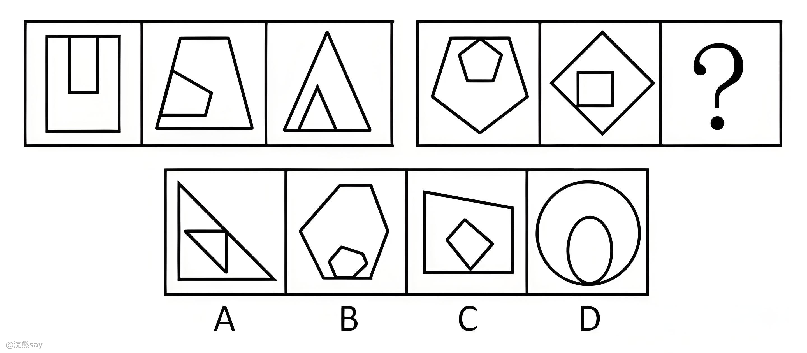
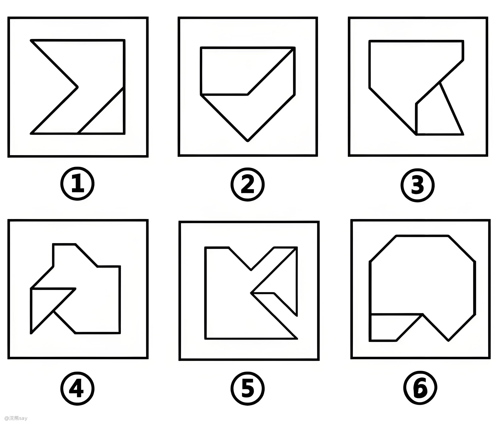
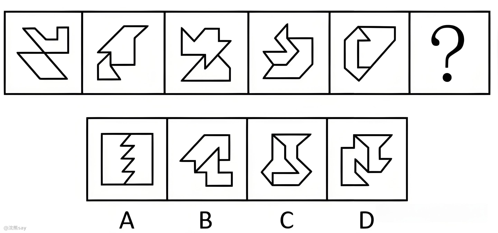

# 5. 连接方式

行测中的“连接方式”题型主要考察的是考生对图形中不同部分之间连接方式的理解和识别能力。这类题目通常会给出一组图形，要求考生根据图形的连接方式找出规律或选择合适的答案。下面我将从几个方面系统地介绍这一题型：

# 连接方式的定义

-   **点连接**：图形通过顶点相连，如上图所示前2个图形的内外图形之间，都是通过顶点进行连接的。

-   **线连接**：图形通过线段相连，如上图所示，内外图形之间都是通过线进行连接的。

-   **图形间关系**：图形之间的相对位置关系，如相离、相切、相交等，具体表现如上图所示。

# 常见考法

1、  **点连接**：给出多个图形，要求找出其中的点连接关系。观察图形的顶点，判断它们是如何通过顶点连接的。如上图所示，图形之间都是通过点来进行连接的，因此？中需要填入的也是一个点连接的图片。

2、  **线连接**：给出多个图形，要求找出其中的线连接关系。观察图形的线段，判断它们是如何通过线段连接的。特别注意线段的长度（最长边、最短边）和位置。如上图所示，所有图形区域之间都是通过线连接的。

3、  **图形间关系**：给出多个图形，要求找出它们之间的相对位置关系，观察图形之间的相对位置，判断它们是相离、相切、相接还是相交。如上图所示，所有图形均是相交的。

# 解题策略
- 连接方式：观察图形的连接方式是否按某种规律变化，比如有的图形之间都是通过线进行连接的，有的图形之间是通过点进行连接的。 

- 位置规律：观察图形的相对位置是否按某种规律变化，有的考题中相交点、相交线的位置可能会按照一些规律进行变化。 |

- 数量规律：观察图形的数量是否按某种规律变化，有的考题中不同的图形的数量关系可能会产生变化，有的数量保持一致，有的数量递增、递减等都有可能。

# 真题

**例1：从所给四个选项中，选择最合适的一个填入问号处，使之呈现一定的规律性：**

解析：考查图形间连接方式；每幅图均由多个封闭图形构成，优先考虑图形间关系。观察发现，题干图形面与面之间都是通过线连接，而A项、B项和[C项](https://zhida.zhihu.com/search?content_id=234828904&content_type=Article&match_order=1&q=C%E9%A1%B9&zhida_source=entity)中的面与面之间均是通过点连接，只有D项符合，当选。故正确答案为D。

**例2：从所给的四个选项中，选择最合适的一个填入问号处，使之呈现一定的规律性。**

解析：考查图形间连接方式和位置结合。每一幅图内外元素都是相同图形，排除D，前三幅图内外元素都有一部分线段重合，后两幅图内外元素均有一个交点，排除B项；观察内外图形相交的位置，依次为上、左、下、上、左，故问号处图形内外相交的位置应该在下方，排除A项。故正确答案为C。

**例3：把下面的六个图形分为两类，使每一类图形都有各自的共同特征或规律，分类正确的一项是（ ）**。

A.①②④，③⑤⑥

B.①③⑤，②④⑥

C.①③⑥，②④⑤

D.①⑤⑥，②③④

解析：考查图形间连接边的数量。观察发现，题干每幅图形均由两个面相交而成，考虑图形间关系。图①⑤⑥中两个图形具有1条相交边，图②③④中两个图形具有2条相交边，即图①⑤⑥一组，图②③④一组。故正确答案为D。

**例4：每道题包含一套图形和四个选项，请从四个选项中选出最恰当的一项填在问号处，使图形呈现一定的规律性。**

解析：考查图形连接边的数量；每幅图均由两个图形构成，优先考虑图形间关系。观察发现，题干两个图形之间相交的线数量分别为0、1、2、3、4，则？处要找相交的线数量为5的图形，只有C项符合，当选。故正确答案为C。
