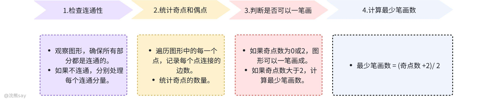
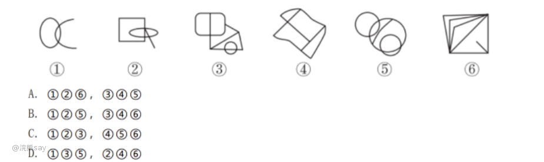

# 笔画数题的底层原理

## 连通图

| 连通图：如果在一个图形中，任意两个点之间都存在一条路径可以直接或间接地相互到达，这样的图形称为连通图。简而言之，就是图形中的所有部分都是相互连接的，没有孤立的部分，反之则叫做非连通图 |
| --- |

在解决“最少几笔画成”的问题时，首先需要确保所讨论的是一个连通图。如果不是连通图，那么需要分别计算每个连通分量的最少笔画数，然后将这些笔画数相加。

## 奇点与偶点
| 奇点：若以一个点为起点，延伸出的线条数为奇数，则该点为奇点。 |
| --- |

| 偶点：若以一个点为起点，延伸出的线条数为偶数，则该点为偶点。 |
| --- |

# 欧拉路径与回路——一笔画底层原理

## 欧拉路径 (Eulerian Path)
| 定义：在一个图中，如果存在一条路径能够恰好经过每个顶点一次且仅一次，那么这条路径就被称为欧拉路径 |
| --- |

-   路径可以开始于图中的任意一个顶点，结束于另一个不同的顶点。
-   **对于无向图，存在欧拉路径的充分必要条件是：图是连通的，并且最多有两个顶点具有奇数度（即奇点）**。如果正好有两个奇点，那么路径必须从其中一个奇点开始，到另一个奇点结束。
-   **对于有向图**，存在欧拉路径的条件稍微复杂一些，要求每个顶点的入度和出度相等，或者恰好有一个顶点的入度比出度少1（作为路径的起点），另一个顶点的出度比入度少1（作为路径的终点），其余所有顶点的入度和出度相等。

## 欧拉回路 (Eulerian Circuit)

-   定义：如果一个图中的欧拉路径能够形成一个闭合的环，即从某个顶点出发，经过每条边恰好一次后又回到这个顶点，那么这样的路径就被称为欧拉回路。
-   特点：
-   欧拉回路是欧拉路径的一个特例，它不仅要求图是连通的，还要求图中所有顶点的度数都是偶数。
-   在无向图中，这意味着每个顶点连接的边数必须是偶数。
-   在有向图中，这意味着每个顶点的入度和出度必须相等。

# 题型分类

行测中的笔画数题型主要考察的是考生对于图形的观察力以及逻辑思维能力，特别是对于图形能否一笔画出的判断能力。根据题目要求和图形的特点，可以将笔画数题型大致分为两大类：一笔画题型和多笔画题型。

## 一笔画题型

要求判断给定的图形是否能够通过一笔不间断地画出，即从任意一点开始，不抬起笔，不重复画线，最终回到起点或者结束于另一点。符合欧拉路径或欧拉回路的条件，即图形中奇点（与奇数条边相连的顶点）的数量为0或2。

**解题技巧**：

-   **检查奇点数量**：如果图形中奇点的数量超过2个，则该图形无法一笔画出；如果奇点数量为0或2个，则该图形可以一笔画出。
-   **寻找起点**：当图形可以一笔画出时，如果存在奇点，则应该从奇点开始画起；如果没有奇点，则可以从任意一点开始。

## 多笔画题型

当图形不能一笔画出时，需要计算最少需要几笔才能画出整个图形。这类题目往往比一笔画题目更复杂，因为需要综合考虑图形的结构和连通性。

**解题技巧**：

-   **确定奇点数量**：首先确定图形中奇点的数量，因为每增加一对奇点，就需要额外的一笔来完成绘制。
-   **计算最少笔画数**：最少笔画数可以通过以下公式计算得出：最少笔画数 = (奇点数 + 2) / 2（向下取整）。这是因为每增加一对奇点，就需要额外的一笔来完成它们之间的连接。
-   **特殊情况处理**：如果图形是由几个完全不相连的部分组成的，那么每个部分都需要单独考虑，每个部分的最少笔画数相加即为整个图形的最少笔画数。

## 解题思路

在行测中，“最少几笔画成”这类题目通常涉及到图论中的欧拉路径和欧拉回路的概念。以下是如何在行测中应用这些概念的具体步骤和技巧：

## 判断图形是否连通

观察图形，确保图形中的所有部分都是相互连接的，没有孤立的部分。如果图形不连通，需要分别计算每个连通分量的最少笔画数，然后将这些笔画数相加。

## 确定奇点和偶点

遍历图形中的每一个点，统计每个点连接的边数（或线条数）。

-   奇点：连接的边数为奇数的点。
-   偶点：连接的边数为偶数的点。
-   重要性：奇点的数量直接影响到图形能否一笔画成。

## 应用欧拉路径和欧拉回路的条件

如果一个连通图中最多有两个奇点，那么这个图存在一条欧拉路径，可以一笔画成。

-   **0个奇点：**存在欧拉回路，可以一笔画成，且**路径是一个闭合的环。**
-   **2个奇点：**存在欧拉路径，可以一笔画成，但**路径不是闭合的环**，必须从一个奇点开始，到另一个奇点结束。
-   **多于2个奇点：不能一笔画成**，需要计算最少笔画数。

## 计算最少笔画数
| 连通图笔画数 = 奇点数 / 2理由：每增加一笔，理论上可以消除两个奇点（一个作为新笔画的起点，另一个作为终点）。 |
| --- |

# 真题

**例题1：把下面的六个图形分为两类，使每一类图形都有各自的共同特征或规律，分类确的一项是()**

解析：本题为分组分类题目。图形元素组成不同，无明显属性规律，考虑数量规律观察发现，图①为“日”字的变形图，图⑤为多圆相交，考虑笔画数。图①②⑤的奇点数都是 2，为一笔画图形，图③④⑥的奇点数都是 4，为两笔画图形。即①②⑤一组，③④⑥一组。故正确答案为 B。

**例题2：从所给四个选项中，选择最合适的一个填入问号处，使之呈现一定的规律性**

解析：观察图形发现，元素组成不同，且无属性规律，考虑数量规律。观察发现题干中第四幅图点、线、面数量与其他几个图形差异较大，数线、数点、数面都没有规律可以考虑笔画数。进一步观察发现，题干中各图均为一笔画图形，选项中A项为一笔画图形，B、C两项为两笔画图形，D项为三笔画图形，故正确答案为 A。
