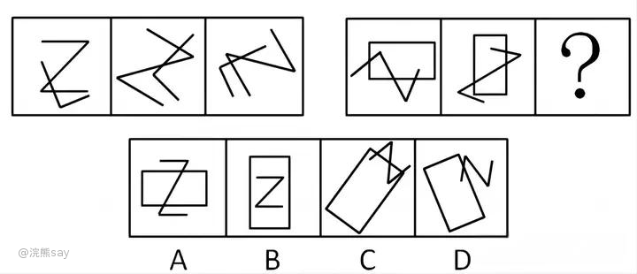
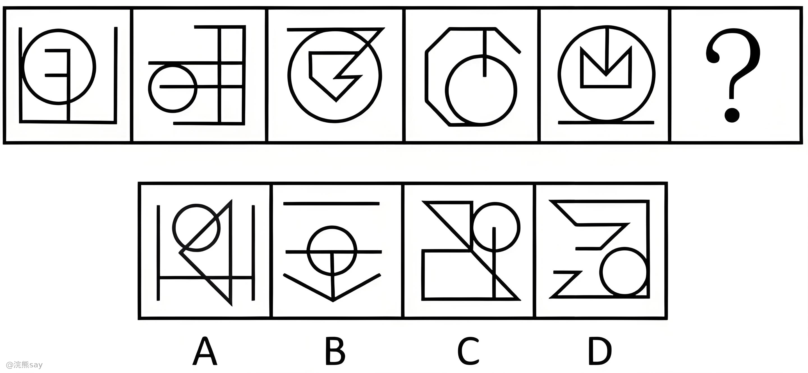
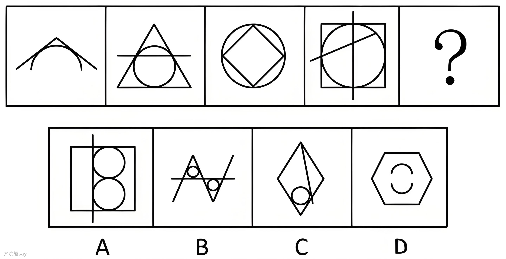
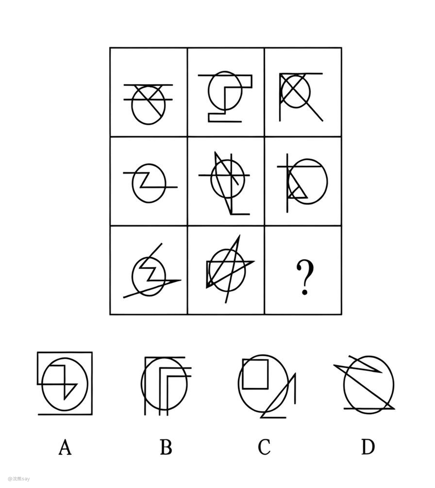

# 8.点的数量

行测中的“点的数量”题型主要考察的是考生对图形中交点、切点等点的数量的理解和识别能力。这类题目通常会给出一组图形，要求考生根据图形中的点的数量找出规律或选择合适的答案。下面我将从几个方面系统地介绍这一题型：

# 点的数量基本考法

| 交点数量：要求找出其中的交点数量，观察图形中的线条，统计交点的数量。 |
| --- |

| 切点数量：要求找出其中的切点数量。观察图形中的线条与圆的接触点，统计切点的数量。 |
| --- |

| 曲直交点：要求找出其中的曲直交点数量。观察图形中的直线与曲线的交点，统计曲直交点的数量。 |
| --- |

| 曲曲交点：要求找出其中的曲曲交点数量。观察图形中的两条曲线的交点，统计曲曲交点的数量。 |
| --- |

| 圈内点和圈外点：要求找出其中的圈内点和圈外点的数量。观察图形中的封闭图形，统计圈内点和圈外点的数量。 |
| --- |

# 真题

**例1： 从所给四个选项中，选择最合适的一个填入问号处，使之呈现一定的规律性：**

解析：考查交点的数量，第一组图形中，每个图形都是杂乱且相交的，交点数量都为2；第二组图形，前两个图形的元素是相交的，并且交点数量为3，那么第三个图形的交点数量也应为3，只有C符合。

**例2：从所给的四个选项中，选择最合适的一个填入问号处，使之呈现一定的规律性。**

解析：考查切点，观察发现，题干每幅图形均存在曲线与直线，且曲直相交，优先考虑曲直交点数。题干每幅图形的曲直交点数均为2个，但无法得出唯一答案。继续观察发现，题干图形相切明显，考虑切点数，每幅图的切点数均为1个，只有C项符合规律。

**例3：从所给的四个选项中，选择最合适的一个填入问号处，使之呈现一定规律性：**

解析：考查[曲直交点](https://zhida.zhihu.com/search?content_id=234435568&content_type=Article&match_order=3&q=%E6%9B%B2%E7%9B%B4%E4%BA%A4%E7%82%B9&zhida_source=entity)数量；元素组成凌乱，观察图形均由直线和曲线构成，且曲线和直线都有交点。

观察发现，题干中图形直线与曲线的交点数目依次为2、3、4、5、?，问号处应该填入直线与曲线有6个交点的选项，只有B项满足。

故正确答案为B。

**例4：从所给的四个选项中，选择最合适的一个填入问号处，使之呈现一定的规律性：**

解析：考查圆内部交点；观察题干发现，直接数交点并无规律，但每个图形都有一个圆，发现第一行所有图形圆内的交点都为1，第二行所有图形圆内的交点都为2，第三行前两幅图形圆内的交点都为3，故“？”处图形圆内的交点也应为3。A、B、C、D项分别为4、2、3、1，C项当选。故正确答案为C。
