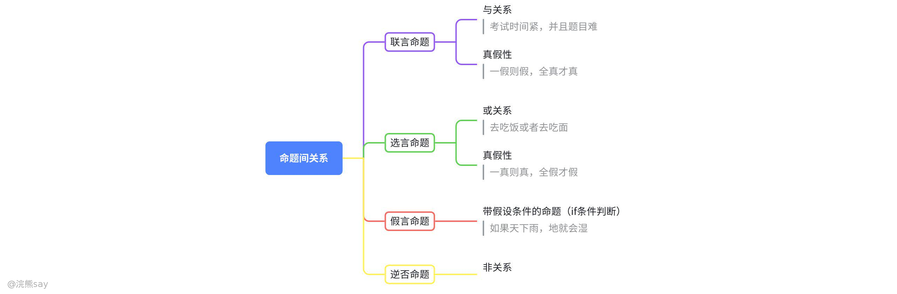
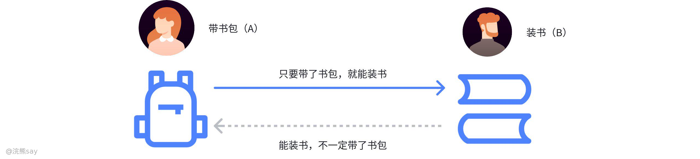
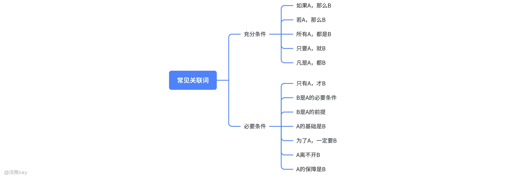

# 3.复言命题

**复言命题**

## 什么是复言命题？

复言命题是个缝合怪，多个命题通过逻辑关联词组合在一起的命题叫做复言命题。复言命题是由两个或多个**肢命题**（可独立判断真假的简单命题，如 “小明会游泳”“今天下雨”）通过特定**逻辑关联词**（如 “且”“或”“如果… 那么…”）组合而成的命题。

如上图所示，复言命题一般由“联词”和“肢命题”构成，其本质的两层含义：

1.  结构上：肢命题是 “零件”，逻辑关联词是 “连接轴”，二者共同构成完整命题；
2.  真假判定上：总命题的真假**不依赖单个肢命题的绝对真假**，而是由 “肢命题的真假组合” 与 “逻辑关联词的性质” 共同决定（例如 “A 或 B”，只要 A、B 中有一个为真，总命题就为真）。

根据逻辑关联词的不同，复言命题核心分为联言命题、选言命题、假言命题三类，而矛盾命题（否命题）是解题中 “找对立面”“排除错误选项” 的关键工具，贯穿各类命题的推导过程。

## 联言命题（“且” 关系）

-   **基本形式：**A 且 B（常见关联词：“既… 又…”“不仅… 还…”“虽然… 但是…”“并且”，核心是 “所有肢命题必须同时成立”）；
-   **生活化案例：**“小红既会弹钢琴，又会跳芭蕾”，只有 “会弹钢琴” 和 “会跳芭蕾” 都为真时，这句话才为真；只要有一项为假（比如不会弹钢琴），整句话就为假；
-   **真假规则：全真才真，一假即假**（所有肢命题为真，总命题才真；任一肢命题为假，总命题必假）；
-   **易混点提醒：**“虽然… 但是…” 在逻辑中仍属于 “且” 关系（如 “虽然天气冷，但是我要出门”，本质是 “天气冷” 且 “我要出门”，二者同时成立），不要被语气转折误导；

| 例题：(2018 广州)只有具有良好的逻辑思维能力并且具有物理学专业背量的人，才能胜任这个岗位。如果上述判断为真，以下哪项不可能为真?()A.物理学专业博士小赵胜任了这个岗位B.从未学习过物理学知识的小李，胜任了这个岗位C.小刘具有物理学专业背量，但他不能胜任这个岗位D.小孙不能胜任这个岗位，但他的逻辑思维能力是大家公认的答案：B解析：我们将原题干进行翻译，得到:胜任一逻辑且物理。如果胜任了岗位，就意味着一定逻辑思维能力良好和具有物理学专业背景，所以B选项错误。故本答案为 B. |
| --- |

## 选言命题（“或” 关系）

-   基本形式：A 或 B（常见关联词：“或者… 或者…”“可能… 也可能…”“至少一个”），核心是 “肢命题中至少有一个成立”；
-   分类与辨析：选言命题分 “相容选言”（A、B 可同时成立，如 “吃米饭或吃面条”，可既吃米饭也吃面条）和 “不相容选言”（“要么 A 要么 B”，A、B 只能有一个成立，如 “要么选 A 方案，要么选 B 方案”，不能同时选），考试中未明确说明时，默认是 “相容选言”；
-   生活化案例：“周末去看电影或去逛公园”，只要满足其中一项（看电影、逛公园），这句话就为真；只有 “既不看电影，也不逛公园”，这句话才为假；
-   真假规则：**一真则真，同假才假**（任一肢命题为真，总命题为真；两个肢命题均假，总命题才假）；
-   易混点提醒：“或” 关系≠“二选一”，不要误以为 “A 或 B” 意味着 “只能选一个”，它包含 “两个都选” 的情况；

| 例题：(2018 广东)某围棋队有选手会在比赛时喝茶，他们或者喝红茶，或者喝绿席。如果以上描述为真，下列哪项一定是真的?()I.该围棋队一名在比赛时不喝红茶的选手，一定喝绿茶。Ⅱ.该围棋队没有选手比赛时喝黑茶。Ⅲ.该围棋队有的选手比赛时不喝茶。A. 只有IB.只有ⅡC.只有血D.亚和亚答案：B解析：我们将原题干进行翻译，得到:喝茶一红茶或绿茶。对于I，可能有选手不喝茶的，所以错误;对于Ⅱ，队员喝茶的时候一定是红茶或者绿茶，不可能是黑茶，正确。对于Ⅲ，我们不知道是否全部都会喝茶，因为“有的”是分1个、部分和全部三种情况的所以血错误，本题正确答案为 B. |
| --- |

## 矛盾命题（否命题）

矛盾命题是指对原命题的**全面、彻底否定**，表述为 “并非 A”（常见关联词：“并非”“不成立”“是假的”），其真假性与原命题完全相反（原命题为真，矛盾命题必为假；原命题为假，矛盾命题必为真）；解题中常用于 “找不可能为真的选项”“找一定为假的命题”，或通过 “否定矛盾命题” 推出原命题的真假；常见命题的矛盾转换（原命题→矛盾命题，附真题高频场景示例）：

① A 且 B → 非 A 或 非 B（例：原命题 “考试时间紧且题目难”→ 矛盾命题 “考试时间不紧，或题目不难”；真题场景：“胜任岗位需要 A 且 B” 的矛盾是 “胜任岗位但缺少 A，或缺少 B”）；

② A 或 B → 非 A 且 非 B（例：原命题 “去德国馆或意大利馆”→ 矛盾命题 “既不去德国馆，也不去意大利馆”；真题场景：“获奖的是甲或乙” 的矛盾是 “甲和乙都没获奖”）；

③ 要么 A 要么 B → （A 且 B）或（非 A 且非 B）（例：原命题 “要么抵抗要么投降”→ 矛盾命题 “既抵抗又投降，或既不抵抗也不投降”）；

④ 如果 A 那么 B → A 且 非 B（例：原命题 “天下雨则地湿”→ 矛盾命题 “天下雨但地没湿”；真题场景：“如果考上公务员就涨工资” 的矛盾是 “考上公务员但没涨工资”）；

⑤ 只有 A 才 B → 非 A 且 B（例：原命题 “年满 18 有选举权”→ 矛盾命题 “未满 18 却有选举权”；真题场景：“只有通过笔试才能进面试” 的矛盾是 “没通过笔试却进了面试”）；

⑥ 当且仅当 A 才 B → （A 且非 B）或（非 A 且 B）（例：原命题 “你去我才去”→ 矛盾命题 “你去我没去，或你没去我去了”）。

## 假言命题（充分 / 必要 / 充要条件）

## 什么是充分必要条件？

假言命题的本质是 “**条件与结果的推导关系**”，所有关联词均可转化为标准形式 “A→B”（A 是前件，B 是后件，读作 “A 推出 B”），解题的关键是 “准确翻译关联词”；

三类条件的核心辨析（附口诀 + 示例）：

① 充分条件：“只要 A，就 B”（A→B），口诀 “有 A 必 B，无 A 未必无 B”—— A 是 B 的 “足够条件”，满足 A 就一定能推出 B，但不满足 A 也可能通过其他方式得到 B（例：“只要带雨伞，就不会淋雨”，带雨伞（A）一定不淋雨（B），但不带雨伞（无 A）也可能躲雨不淋雨（有 B））；

② 必要条件：“只有 A，才 B”（B→A），口诀 “无 A 必无 B，有 A 未必有 B”—— A 是 B 的 “必备条件”，不满足 A 就一定推不出 B，但满足 A 也未必能得到 B（例：“只有通过笔试，才能进面试”，没通过笔试（无 A）一定进不了面试（无 B），但通过笔试（有 A）也可能因面试失利没进面试（无 B））；

③ 充要条件：“当且仅当 A，才 B”（A↔B），口诀 “有 A 必 B，无 A 必无 B”—— A 与 B 一一对应，满足 A 就有 B，不满足 A 就没有 B（例：“当且仅当年满 18，才享有完全民事行为能力”，年满 18（A）就有完全民事行为能力（B），未满 18（无 A）就没有（无 B））；

如果用一句话来总结充分必要条件的话，那么充分必要条件就是 “这个条件和结果之间，像一把钥匙开一把锁 —— 有钥匙（条件）一定能开锁（结果），没钥匙（条件）一定开不了锁（结果），反过来，能开锁（结果）一定有这把钥匙（条件）。”

## 充分必要条件常见关联词

① “如果 A 那么 B”“只要 A 就 B”“若 A 则 B”→ A→B（A 是充分条件）；

② “只有 A 才 B”“除非 A 否则不 B”“A 是 B 的前提 / 基础”→ B→A（A 是必要条件）；

③ 易混关联词 “除非 A 否则 B”→ 非 A→B（例：“除非下雨，否则去爬山”→ 没下雨→去爬山）；

核心记住 “肯前必肯后，否后必否前，否前肯后无必然结论”（例：A→B 为真时，A 真则 B 真；B 假则 A 假；A 假不能推 B 的真假，B 真不能推 A 的真假）。

## 真题
| 【中国铁塔2018】一切物质都是可塑的，树木是可塑的。所以树木是物质。试分析以下哪个选项的结构与上述最为相近？A. 一切真理都是经过实践检验的，进化论是真理，所以进化论是经过实践检验的；B. 一切恒星都是自身发光的，金星不是恒星，所以金星自身不发光；C. 一切公民都必须遵守法律，我们是公民，所以我们必须遵守法律；D. 所有的坏人都攻击我，你攻击我，所以你是坏人答案 ：D解析 ：题干推理结构为“肯后推肯前”（物质→可塑，树木可塑→树木是物质）。D 项“坏人→攻击我，你攻击我→你是坏人”同样为“肯后推肯前”，与题干结构一致 |
| --- |

| 【国家能源2018】对某城镇居民休闲运动的一项调查显示：所有广场舞爱好者都爱好看电视；有些电视爱好者喜欢打羽毛球，所有喜欢打羽毛球的人都不爱好太极拳，有些广场舞爱好者同时爱好太极拳。根据以上结论，下列判断必定为假的是：A. 有些广场舞爱好者喜欢打羽毛球；B. 所有电视爱好者都爱好太极拳；C. 所有喜欢打羽毛球的人都爱好看电视；D. 有些太极拳爱好者不喜欢打羽毛球答案 ：B解析 ：由②“有些电视爱好者喜欢打羽毛球”和③“喜欢打羽毛球→不爱好太极拳”递推可得“有些电视爱好者不爱好太极拳”，其矛盾命题“所有电视爱好者都爱好太极拳”必定为假。 |
| --- |

| 【国家能源2018】教师让四名学生每人去拿一只桌球，不论什么颜色。学生拿了球后，教师发现唯一的一只白球被拿走了，问谁拿了白球。甲说：我没有拿白球。乙说：是丁拿的白球。丙说：是乙拿的白球。丁说：白球不是我拿的。如果四人中只有一人说的是真话，那么拿了白球的是（ ）。A.甲；B.乙；C.丙；D.丁答案 ：A解析 ：乙和丁的话矛盾（乙：丁拿；丁：¬丁拿），必有一真一假。因只有一人说真话，故甲和丙为假。甲说“我没有拿白球”为假，即甲拿了白球。 |
| --- |

| 【中国石化2018】小王接听过来自行政部所有人的电话。如果上述判断为真，以下哪项不可能为真？A. 行政部的小李拨打过小王的电话B. 小王接听过行政部老张的电话C. 行政部有人未拨打过小王的电话D. 行政部没有人未拨打过小王的电话答案：C解析 ：“小王接听过行政部所有人的电话”等价于“行政部所有人都拨打过小王的电话”（接听是拨打的必要条件）。C 项“行政部有人未拨打过小王的电话”与题干矛盾，不可能为真。 |
| --- |
